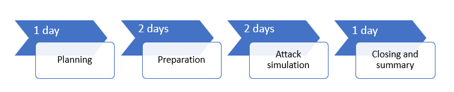

# 執行試驗 Microsoft 威脅防護專案Run your pilot Microsoft Threat Protection project 

[!INCLUDE [Microsoft 365 Defender rebranding](../includes/microsoft-defender.md)]

適用於：\*\*\*\***Applies to:**
- Microsoft 威脅防護Microsoft Threat Protection

若要有效判斷 Microsoft 威脅防護 (MTP) 的優點和採用方式，您可以執行試驗專案。To effectively determine the benefit and adoption of Microsoft Threat Protection (MTP), you can run a pilot project. 在實際執行環境中啟用 Microsoft 威脅防護，並啟動您的使用案例之前，最好要規劃決定要為試驗專案完成的工作，並設定成功準則。Before enabling Microsoft Threat Protection in your production environment and starting your use cases, it's best to plan to determine the tasks to accomplish for your pilot project and set the success criteria. 

## 如何使用本次試驗行動手冊How to use this pilot playbook

本指南提供 Microsoft 威脅防護的概述，以及如何設定試驗專案的逐步指示。This guide provides an overview of Microsoft Threat Protection and step-by-step instructions on how to set up your pilot project. 

下列範例時程表視您環境中的適當資源而異。The following sample timeline varies depending on having the right resources in your environment. 有些偵測和工作流程可能需要比其他的更多學習時間。Some detections and workflows might need more learning time than the others.

>[!IMPORTANT]
>為了獲得最佳結果，請盡可能請盡可能遵循試驗指示。For optimum results, follow the pilot instructions as closely as possible.

### 試驗行動手冊階段Pilot playbook phases 

執行 Microsoft 威脅防護試驗有四個階段：There are four phases in running a Microsoft Threat Protection pilot:

|階段Phase | 描述Description | 
|:-------|:-----|
|  [規劃Planning](mtp-pilot-plan.md)| 深入瞭解在執行 Microsoft 威脅防護試驗專案之前，您需要考慮的事項：Learn what you need to consider before running your Microsoft Threat Protection pilot project:   -範圍- Scope   -使用案例- Use cases  - 需求：- Requirements  -測試計劃- Test plan   -成功準則- Success criteria   -計分卡- Scorecard 
|   [製備Preparation](mtp-evaluation.md)|  存取 Microsoft 365 的安全性中心以設定您的 Microsoft 威脅防護試驗環境。Access Microsoft 365 Security Center to set up your Microsoft Threat Protection pilot  environment. 您將會指導您：You'll be guided to:  -識別利益關係人，並尋找您試驗的登出- Identify stakeholders and seek sign-off for your pilot   -環境考慮- Environment considerations  -Access- Access  -Azure Active Directory 安裝程式- Azure Active Directory setup   -設定順序- Configuration order   -註冊 Microsoft 365 E5 試用版- Sign up for Microsoft 365 E5 Trial   -設定網域- Configure domain  -指派 Microsoft 365 E5 授權- Assign Microsoft 365 E5 licenses   -完成入口網站中的設定向導- Complete the setup wizard in the portal|
|   [攻擊模擬Attack simulation](mtp-pilot-simulate.md) | 若要模擬攻擊，您將會得到下列指導：To simulate an attack, you'll be guided to:  -確認測試環境需求- Verify the test environment requirements  -執行模擬-  Run the simulation  -調查事件- Investigate an incident  -解決事件- resolve the incident 
|   [關閉及摘要Closing and summary](mtp-pilot-close.md) | 當您到達程式的結尾時，系統會將您導向：When you've reached the end of the process, you'll be guided to:  -流覽您的最後一個輸出- Go through your final output -向您的專案關係人呈現您的輸出- Present your output to your stakeholders  -提供意見反應- Provide feedback  -執行後續步驟- Take next steps 

## 下一步Next step
|  [規劃階段Planning phase](mtp-pilot-plan.md) | 規劃 Microsoft 威脅防護試驗專案Plan your Microsoft Threat Protection pilot project 
|:-------|:-----|
