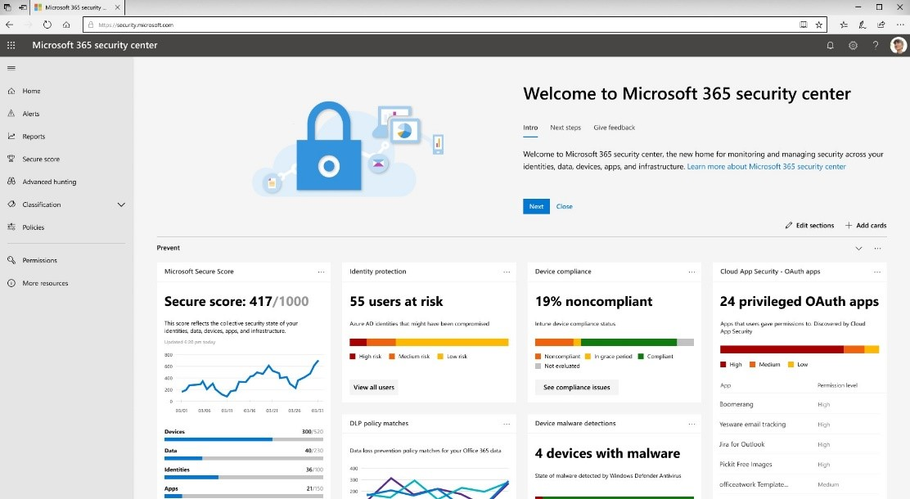

# Microsoft 365 安全性中心概述

管理您的業務以防止不斷演變威脅橫向安全性帶許多挑戰。 您可能會有太多的安全性解決方案，以進行大量控制項的不同位置，並不知道哪些控制項最有效且可將為您的工作人員介紹新挑戰。 它可能很難的安全性小組合作，找出安全性與生產力的平衡點。

輸入 Microsoft 365 安全性中心-用來監控及管理安全性跨 Microsoft 身分識別、 資料、 裝置、 應用程式] 及基礎結構的新 [首頁。 這裡您可以輕鬆檢視您的組織，法案設定裝置、 使用者和應用程式]，並取得可疑的活動警訊的安全性健康狀況。 在 Microsoft 365 安全性中心特別適用於安全性系統管理員和更妥善地管理並保護其組織的安全性作業小組。

新的 Microsoft 365 安全中心和 Microsoft 365 合規性中心是設計用以滿足安全性小組和規範小組的需求的特定工作區。 這些解決方案整合在整個 Microsoft 365 服務，並提供洞察力來協助降低風險並保護您的數位資產。

[了解更多並準備好](https://docs.microsoft.com/office365/securitycompliance/microsoft-security-and-compliance)新的 Microsoft 365 安全中心和 Microsoft 365 合規性中心。

請造訪 Microsoft 365 安全性中心在 security.microsoft.com。  

## 讓我們詳細探討

[**首頁**] 頁面上顯示許多安全性小組需要的一般卡。 卡和資料的撰寫方式是取決於使用者角色。 因為在 Microsoft 365 安全性中心使用角色型存取控制，不同的角色，將會看到是以其日常工作更有意義的卡片。  

這在快速資訊可協助您跟得貴組織中的最新活動。 在 Microsoft 365 安全性中心聚集所有同等級訊號從各種來源，以呈現 Microsoft 365 環境的全方位檢視。

Microsoft 365 安全性中心包含：

* **家用版**– 取得在快速檢視您組織的整體安全性健康狀況。
* **提醒**-整個 Microsoft 356 環境，包括提醒從 Microsoft Cloud App Security，Office 365 ATP，Azure AD，具有所有警示的可視性和 Microsoft Defender ATP。 適用於 E3 和 E5 客戶。  
* **報表**– 取得詳細資料，您需要更妥善地保護您的使用者、 裝置、 應用程式]，以及更多的資訊。
* **安全分數** – 使用 Microsoft 安全分數改善整體的安全性狀況。 此頁面提供所有最多摘要的不同的安全性功能和您已啟用的功能，並包含區域以提升的建議。
* **搜捕** – 在 Microsoft 365 組織中主動搜尋惡意軟體、可疑檔案和活動。
* **分類** – 藉由新增標籤來分類文件、電子郵件訊息、文件、網站等項目，以協助防止資料遺失。 套用標籤時 （自動或使用者），內容或網站受到根據您選擇的設定。 例如，您可以建立標籤來加密檔案、新增內容標記，以及控制使用者對特定網站的存取。
* **原則** – 設定原則來管理裝置、防範威脅，以及接收關於組織中各項活動的警示。
* **權限** – 管理組織中可存取 Microsoft 365 安全性中心以檢視內容及執行工作的人員。 您也可以在 Azure AD 入口網站中指派 Microsoft 365 權限。

## 深入了解

探索這些監視、 檢視和回應您的安全性需求的相關主題：

* 檢閱並改善您的安全性狀態，而使用 [Microsoft 安全分數](microsoft-secure-score.md)
* [報表](monitoring-and-reporting.md)的身分識別、 資料、 裝置、 應用程式] 和基礎結構的狀態
* [主動搜尋](hunting.md)入侵嘗試與資料外洩活動影響您的電子郵件、 資料、 裝置及帳戶
* [了解最新的攻擊行銷活動](latest-attack-campaigns.md)和技巧與威脅分析
