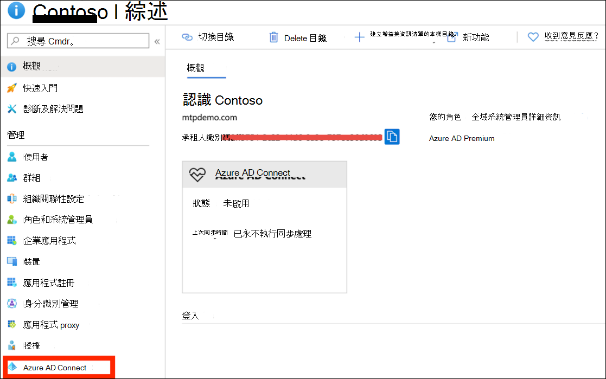
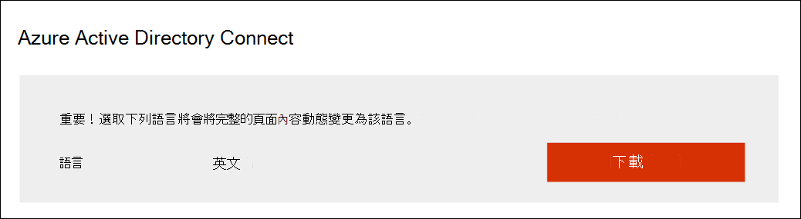
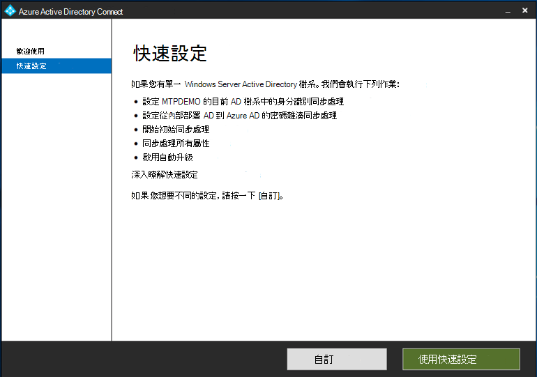
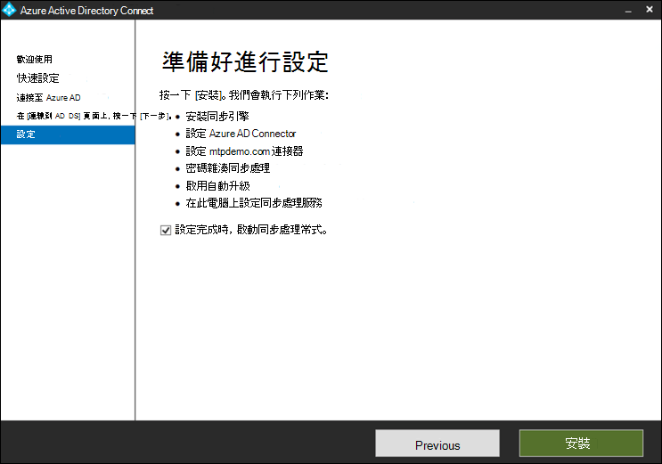
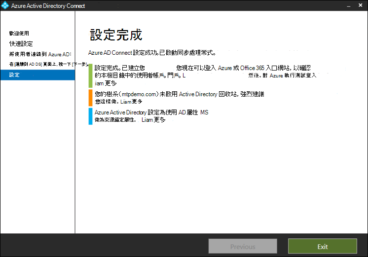

# 準備您的 Microsoft 威脅防護試用實驗室環境

適用於：****
- Microsoft 威脅防護

建立 Microsoft 威脅防護試用實驗室環境並加以部署時，會有三個階段的處理常式：

 
<table border="0" width="100%" align="center">
  <tr style="text-align:center;">
    <td align="center" style="width:25%; border:0;" bgcolor="#d5f5e3">
      <a href= "https://docs.microsoft.com/microsoft-365/security/mtp/prepare-mtpeval"> 
        
       階段1：準備 </a> 
    </td>
     <td align="center"  >
      <a href="https://docs.microsoft.com/microsoft-365/security/mtp/setup-mtpeval">
        
       階段2：設定 </a> 
        </td>
    <td align="center">
      <a href="https://docs.microsoft.com/microsoft-365/security/mtp/config-mtpeval">
        
       階段3：設定板載 &</a> 
</td>
  </tr>
  <tr>
    <td style="width:25%; border:0;">
   
    </td>
    <td valign="top" style="width:25%; border:0;">
    
</td>
    <td valign="top" style="width:25%; border:0;">

</td>    
  </tr>
</table>

您目前是在準備階段。

準備工作是任何成功部署的關鍵。 本節將逐步指導您準備建立 Microsoft 威脅防護部署的試用實驗室環境時，您需要考慮的事項。

## 必要條件
瞭解授權、硬體和軟體需求，以及其他設定，以提供和使用 Microsoft 威脅防護。 請參閱 [Microsoft 威脅防護](https://docs.microsoft.com/microsoft-365/security/mtp/prerequisites?view=o365-worldwide)的最低需求， [microsoft Defender atp](https://docs.microsoft.com/windows/security/threat-protection/microsoft-defender-atp/minimum-requirements)， [OFFICE 365 atp](https://docs.microsoft.com/office365/servicedescriptions/office-365-advanced-threat-protection-service-description)， [Azure ATP](https://docs.microsoft.com/azure-advanced-threat-protection/atp-prerequisites)， [microsoft Cloud App Security](https://docs.microsoft.com/azure-advanced-threat-protection/atp-prerequisites)。

## 利益關係人和簽署
下列章節可用於識別專案中相關的所有利益關係人，以及可能需要簽署、審查或通知的所有利益關係人，甚至是針對基本執行的評估或證明。

>[!NOTE]
>並非所有組織都可能具有這類角色的安全性組織成熟度。 在這種情況下，請與您的領導團隊聯繫，以複查和核准職責。

視您的組織而定，將相關者新增至下表。

-   SO = 在此專案上登出

-   R = 審閱此專案並提供輸入

-   I = 此專案的通知

| 姓名                 | 角色                                                                                                                                                                                                          | 動作 |
|----------------------|---------------------------------------------------------------------------------------------------------------------------------------------------------------------------------------------------------------|--------|
| 輸入名稱和電子郵件 | **首席資訊安全性監察官 (CISO) ** *成為新技術部署之組織內充當主管的執行代表。*                                                  | 所以     |
| 輸入名稱和電子郵件 | **網路防護運作中心的 Head (CDOC) ** *CDOC 小組的代表，以定義如何將此變更與客戶的安全性作業小組中的處理常式對齊。*       | 所以     |
| 輸入名稱和電子郵件 | **安全性***小組中的代表負責定義如何將此變更與組織中的核心安全性架構對應。*                         | R      |
| 輸入名稱和電子郵件 | **工作場所***會為 IT 小組設計代表，以定義如何將此變更與組織中的核心工作區架構對齊。*                             | R      |
| 輸入名稱和電子郵件 | **安全性分析員***來自 CDOC 小組的代表，可提供偵測功能、使用者經驗和安全性作業的整體有用性。* | I      |

## 準備您的 Azure Active Directory
如果您已啟用 Active Directory 和 Azure Active Directory 內部部署之間的同步處理，請略過此步驟。 從 Azure Active Directory 複查現有的最佳作法檔。 下列步驟經過優化，可評估 Microsoft 威脅防護。

1. 移至 [Azure Active Directory](https://portal.azure.com/#blade/Microsoft_AAD_IAM/ActiveDirectoryMenuBlade) 入口網站 > **azure AD Connect**。 
   

2. 按一下**Download** [從**Microsoft Azure Active Directory 連線]** ，然後將它轉接至您的網域控制站。
  

3. 在網域控制站上，遵循 Azure Active Directory Connect 嚮導。 閱讀授權條款和隱私權通知，如果您同意，請選取此核取方塊。 按一下 [繼續]。
  

4. 流覽至 **Express 設定**。
  

5. 輸入您的全域系統管理員認證。 按 **[下一步]**。
![您應輸入全域系統管理員認證的 [連線到 Azure AD] 頁面影像](../../media/mtp-eval-5.png)  

6. 輸入您的 Active Directory 網域服務企業系統管理員認證。 按 **[下一步]**。
![您應輸入認證的 [連線到 AD DS] 頁面影像](../../media/mtp-eval-6.png)  

7. 按一下 [ **安裝** ] 以確認設定。
  

8. 恭喜，您已成功設定 Azure Active Directory Connect。
  

您現在可以 [將使用者和群組新增至 Active Directory](https://docs.microsoft.com/azure-advanced-threat-protection/atp-playbook-setup-lab#bkmk_hydrate) ，並 [設定 SAM-R 原則](https://docs.microsoft.com/azure-advanced-threat-protection/atp-playbook-setup-lab#configure-sam-r-capabilities-from-contosodc)。  

## 設定順序
下表指出 Microsoft 建議為您的試用實驗室環境部署設定 Microsoft 威脅防護元件的順序。

| 元件                               | 描述                                                                                                                                                                                                                                                                                                                                                                                                                                                                                                                                                                                                                                                                                              | 設定順序排名 |
|-----------------------------------------|----------------------------------------------------------------------------------------------------------------------------------------------------------------------------------------------------------------------------------------------------------------------------------------------------------------------------------------------------------------------------------------------------------------------------------------------------------------------------------------------------------------------------------------------------------------------------------------------------------------------------------------------------------------------------------------------------------|---------------------|
| Office 365 進階威脅防護| Office 365 ATP 會保護您的組織免受電子郵件訊息、連結 (URLs) 和共同作業工具所帶來的惡意威脅。   [瞭解更多資訊。](https://docs.microsoft.com/microsoft-365/security/office-365-security/office-365-atp?view=o365-worldwide)                                                                                                                                                                                                                                             | 1                    |
|Azure 進階威脅防護|Azure ATP 使用 Active Directory 信號來識別、偵測和調查您組織中的高級威脅、已遭破壞的身分識別，以及惡意的有問必答行為。   [深入了解](https://docs.microsoft.com/azure-advanced-threat-protection/)。| 2  |
|Microsoft Cloud App Security| Microsoft Cloud App Security 是雲端存取安全性經紀人 (CASB) ，可在多個雲端上運作。 它可提供豐富的知名度、控制資料旅行和複雜的分析，以在所有雲端服務之間識別及打擊 cyberthreats。   [深入了解](https://docs.microsoft.com/cloud-app-security/)。                                                                                                                                                                                                                                                                                                                                                                       |3                    |
|Microsoft Defender 進階威脅防護 | Microsoft Defender ATP 端點偵測和回應功能可提供近乎即時並可採取行動的進階攻擊偵測。 安全性分析人員可以有效地排定警示的優先順序、深入了解入侵的全貌，並採取回應動作來補救威脅。   [瞭解更多資訊。](https://docs.microsoft.com/windows/security/threat-protection/microsoft-defender-atp/microsoft-defender-advanced-threat-protection)                                     |4                    |                                                                                                                                                                                                                                    

## 後續步驟
  [階段2：設定](setup-mtpeval.md)  設定您的 Microsoft 威脅防護試用實驗室環境

