# 設定您的 Microsoft 365 Defender 試用版實驗室環境Set up your Microsoft 365 Defender trial lab environment 

[!INCLUDE [Microsoft 365 Defender rebranding](../includes/microsoft-defender.md)]

適用於：**Applies to:**
- Microsoft 365 DefenderMicrosoft 365 Defender 

建立 Microsoft 365 Defender 試用版實驗室或試驗環境並部署此為三階段程式：Creating a Microsoft 365 Defender trial lab or pilot environment and deploying it is a three-phase process:

| [階段 1：準備Phase 1: Prepare](prepare-mtpeval.md) | 階段 2：設定Phase 2: Set up | [階段 3：上機Phase 3: Onboard](config-mtpeval.md) |  [回到試驗手冊Back to pilot playbook](mtp-pilot.md) |
|--|--|--|--|
||*您目前在這裡！**You are here!*  | | |

您目前處於設定階段。You're currently in the set up phase. 採取存取 Microsoft 365 資訊安全中心的初始步驟，然後設定您的試驗實驗室或試驗環境。Take the initial steps to access Microsoft 365 Security Center then set up your trial lab or pilot environment.

註冊 Office 365 或 Azure Active Directory 訂閱以產生 *.onmicrosoft.com* 租使用者，您可以使用該租使用者註冊您的 Microsoft 365 E5 授權。Sign up for an Office 365 or Azure Active Directory subscription to generate a *.onmicrosoft.com* tenant that you can use to sign up for your Microsoft 365 E5 license. 

>[!NOTE]
>如果您已經有現有的 Office 365 或 Azure Active Directory 訂閱，您可以略過 Office 365 E5 試用版或試驗租使用者建立步驟。If you already have an existing Office 365 or Azure Active Directory subscription, you can skip the Office 365 E5 trial or pilot tenant creation steps.

在這個階段，您將受指引到：In this phase, you'll be guided to:
- 建立 Office 365 E5 試用版租使用者Create an Office 365 E5 trial tenant
- 啟用 Microsoft 365 試用版訂閱Enable Microsoft 365 trial subscription

## 建立 Office 365 E5 試用版租使用者Create an Office 365 E5 trial tenant
>[!NOTE]
>如果您已經有現有的 Office 365 或 Azure Active Directory 訂閱，您可以略過 Office 365 E5 試用版租使用者建立步驟。If you already have an existing Office 365 or Azure Active Directory subscription, you can skip the Office 365 E5 trial tenant creation steps.

1. 請前往 [Office 365 E5 產品](https://www.microsoft.com/microsoft-365/business/office-365-enterprise-e5-business-software?activetab=pivot%3aoverviewtab) 入口網站，然後選取 **免費試用**。Go to the [Office 365 E5 product portal](https://www.microsoft.com/microsoft-365/business/office-365-enterprise-e5-business-software?activetab=pivot%3aoverviewtab) and select **Free trial**.

   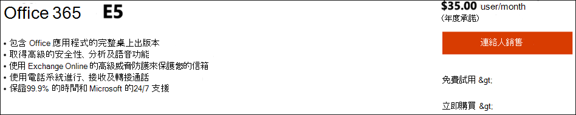
  
2. 在個人或公司 (電子郵件地址以完成) 。Complete the trial registration by entering your email address (personal or corporate). 按一下 **[設定帳戶**。Click **Set up account**.

   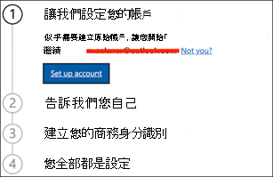

3. 填入您的名字、姓氏、公司電話號碼、公司名稱、公司大小，以及國家/地區。Fill in your first name, last name, business phone number, company name, company size, and country or region.  

   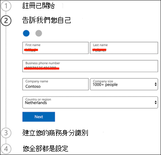
   
   > [!NOTE]
   > 您在這裡設定的國家/地區或區域會決定您的 Office 365 將託管的資料中心區域。The country or region you set here determines the data center region your Office 365 will be hosted.
  
4. 選擇您的驗證喜好設定：透過文字訊息或通話。Choose your verification preference: through a text message or call. 按一下 **[傳送驗證碼**。Click **Send Verification Code**. 

   

5. 設定租使用者自訂功能變數名稱，然後按一下 [下一 **步**。Set the custom domain name for your tenant, then click **Next**.

   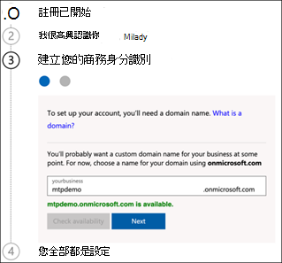
 
6. 設定第一個身分識別，該身分識別即為租使用者全域系統管理員。Set up the first identity, which will be a Global Administrator for the tenant. 填入 **名稱和\*\*\*\*密碼**。Fill in **Name** and **Password**. 按一下 **[註冊**。Click **Sign up**.

   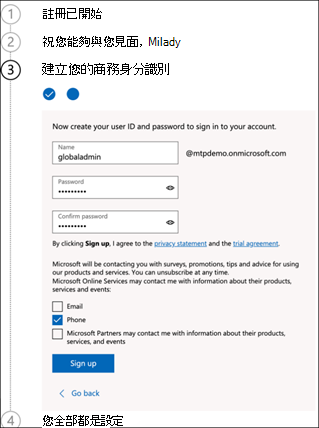

7. 按一下 **[前往設定** 以完成 Office 365 E5 試用版租使用者設定。Click **Go to Setup** to complete the Office 365 E5 trial tenant provisioning.

   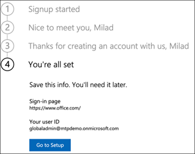

8. 將您的公司網域連接到 Office 365 租使用者。Connect your corporate domain to the Office 365 tenant. [選擇性]選擇 **連接您已有的網域** ，然後輸入您的功能變數名稱。[Optional] Choose **Connect a domain you already own** and type in your domain name. 按 **[下一步]**。Click **Next**.

   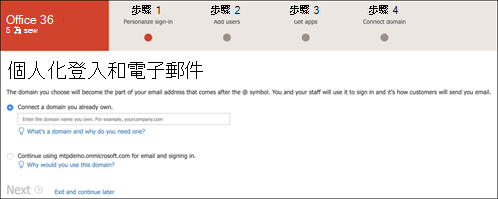
 
9. 新增 TXT 或 MX 記錄以驗證網域擁有權。Add a TXT or MX record to validate the domain ownership. 一旦將 TXT 或 MX 記錄新增到您的網域後， **請選取驗證**。Once you’ve added the TXT or MX record to your domain, select **Verify**.

   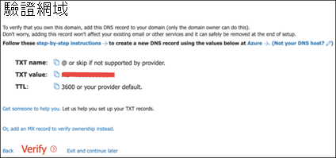
 
10. [選擇性]為租使用者建立更多使用者帳戶。[Optional] Create more user accounts for your tenant. 您可以按一下下一步來跳過 **此步驟**。You can skip this step by clicking **Next**.

    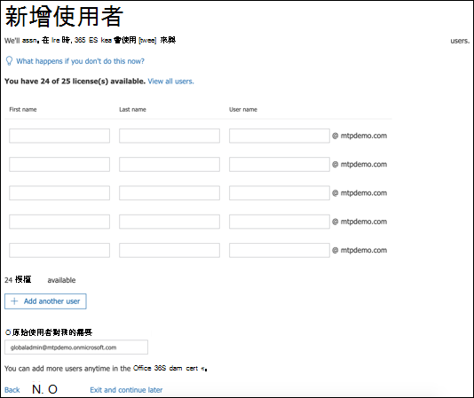
 
11. [選擇性]下載 Office App。[Optional] Download Office apps. 按一下 **[下一** 步， 略過此步驟。Click **Next** to skip this step. 

    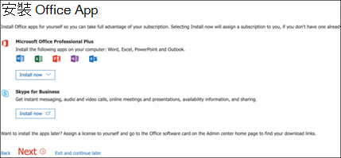

12. [選擇性]遷移電子郵件訊息。[Optional] Migrate email messages. 同樣，您可以略過此步驟。Again, you can skip this step.

    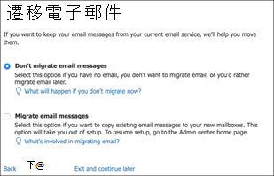
 
13. 選擇線上服務。Choose online services. 選取 **Exchange，** 然後按一下 [下 **一步**。Select **Exchange** and click **Next**. 

    

14. 新增 MX、CNAME 和 TXT 記錄至您的網域。Add MX, CNAME, and TXT records to your domain. 完成後， **請選取驗證**。When completed, select **Verify**.

    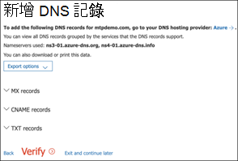
 
15. 恭喜您，您已完成您的 Office 365 租使用者提供。Congratulations, you have completed the provisioning of your Office 365 tenant.

    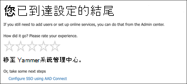

## 啟用 Microsoft 365 試用版訂閱Enable Microsoft 365 trial subscription

>[!NOTE]
>註冊試用版可給您 25 個使用者授權，一個月可以使用。Signing up for a trial gives you 25 user licenses to use for a month. 請參閱 [試用或購買 M365 訂閱以](https://docs.microsoft.com/microsoft-365/commerce/try-or-buy-microsoft-365#try-or-buy-a-microsoft-365-subscription-1) 瞭解詳細資料。See [Try or Buy an M365 subscription](https://docs.microsoft.com/microsoft-365/commerce/try-or-buy-microsoft-365#try-or-buy-a-microsoft-365-subscription-1) for details.

1. 從 [Microsoft 365 系統管理中心](https://admin.microsoft.com/)，按一下 [ **帳單** ，然後流覽至 **購買服務**。From [Microsoft 365 Admin Center](https://admin.microsoft.com/), click **Billing** and then navigate to **Purchase services**.

2. 選取 **Microsoft 365 E5，** 然後按一下 [ **開始免費試用**。Select **Microsoft 365 E5** and click **Start free trial**. 

   

3. 選擇您的驗證喜好設定：透過文字訊息或通話。Choose your verification preference: through a text message or call. 一旦決定好後，請輸入電話號碼，**然後根據您的選擇** 選取範圍選取給我或撥打給我。Once you have decided, enter the phone number, select **Text me** or **Call me** depending on your selection.

   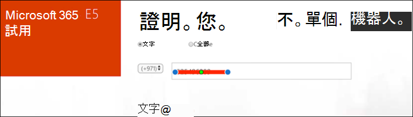
 
4. 輸入驗證碼，然後按一下 **[開始免費試用**。Enter the verification code and click **Start your free trial**.

   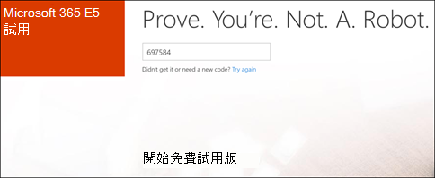

5. 按一下 **[立即試用** 以確認您的 Microsoft 365 E5 試用版。Click **Try now** to confirm your Microsoft 365 E5 trial.

   
 
6. 請前往 **Microsoft 365 系統管理中心**  >  **使用者**  >  **主動使用者**。Go to the **Microsoft 365 Admin Center** > **Users** > **Active users**. 選取您的使用者帳戶，選取 **管理產品** 授權，然後將授權從 Office 365 E5 切換至 **Microsoft 365 E5。**Select your user account, select **Manage product licenses**, then swap the license from Office 365 E5 to **Microsoft 365 E5**. 按一下 **[儲存]**。Click **Save**.

   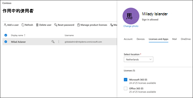
 
7. 再次選取全域系統管理員帳戶，然後按一下 [ **管理使用者名稱**。Select the global administrator account again then click **Manage username**.

   

8. [選擇性]根據您在onmicrosoft.com選擇哪些專案，將網域從新網域變更為您自己的網域。[Optional] Change the domain from *onmicrosoft.com* to your own domain—depending on what you chose on the previous steps. 按一下 **[儲存變更]**。Click **Save changes**.

   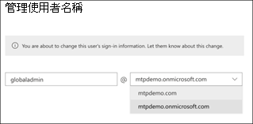

## 下一步Next step
|[階段 3：設定&上Phase 3: Configure & Onboard](config-mtpeval.md) | 針對您的 Microsoft 365 Defender 試用版實驗室或試驗環境設定每個 Microsoft 365 Defender 基礎，並設置端點。Configure each Microsoft 365 Defender pillar for your Microsoft 365 Defender trial lab or pilot environment and onboard your endpoints.
|:-------|:-----|
