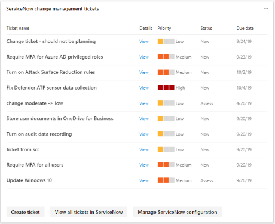

# 透過 ServiceNow 管理票證Manage tickets through ServiceNow

ServiceNow 是一個流行的雲端計算平臺，可協助公司管理企業作業的數位工作流程。ServiceNow is a popular cloud computing platform that helps companies manage digital workflows for enterprise operations. 其 Now 平臺具有 IT 工作流程、員工工作流程和客戶工作流程。Their Now platform has IT workflows, employee workflows, and customer workflows. Microsoft 已與 ServiceNow 合作，讓 IT 系統管理員可輕鬆管理這兩個平臺的票證和工作。Microsoft has partnered with ServiceNow to make it easier for IT admins to manage their tickets and tasks in both platforms. [深入瞭解 ServiceNowLearn more about ServiceNow](https://www.servicenow.com/)

Microsoft 365 的安全性中心現在已增強，可在 ServiceNow 中以本機方式建立及追蹤票證。Microsoft 365 security center is now enhanced with the ability to natively create and track tickets in ServiceNow. 安全性管理員可以直接傳送[Microsoft Secure 得分](microsoft-secure-score.md)改進動作來 ServiceNow 和建立票證。Security administrators can send a [Microsoft Secure Score](microsoft-secure-score.md) improvement action directly to ServiceNow and create a ticket. 您可以建立事件管理和變更管理票證。Both incident management and change management tickets can be created. 然後，您可以在 Microsoft 的「安全性中心」首頁中追蹤它們，然後 ServiceNow。They can then be tracked in the Microsoft security center home page, and ServiceNow.

## 必要條件Prerequisites

可以存取 Microsoft 365 security center 和 ServiceNow 實例，其具有：Have access to the Microsoft 365 security center and a ServiceNow instance with:  

* Kingston 或更高版本Kingston or higher version
* 具有系統管理員高認證Have admin HI credentials
* 具有目標廠商實例的系統管理員許可權Have admin privileges on your target vendor instance

ServiceNow 建議使用者將預設設定保留在 ServiceNow 實例中。ServiceNow recommends that users keep default settings in your ServiceNow instance. 在完成安裝檢查清單並與 Microsoft 365 安全性中心整合時，讓自訂動作可能會造成錯誤。Having customizations could cause errors when completing the installation checklist and integration with the Microsoft 365 security center.

## 資料交換Data exchange

當您將 Microsoft 365 的安全性中心連線至 ServiceNow 時，Microsoft 會收到下列其他資料：When you connect the Microsoft 365 security center to ServiceNow, Microsoft receives the following additional data:

* ServiceNow 實例名稱ServiceNow instance name
* ServiceNow 用戶端識別碼ServiceNow client ID
* ServiceNow 用戶端密碼ServiceNow client secret
* ServiceNow 存取 & 重新整理權杖ServiceNow access & refresh tokens

當您從 Microsoft 365 security center 建立 ServiceNow 票證時，下列資料會傳送至 ServiceNow：When you create a ServiceNow ticket from the Microsoft 365 security center, the following data is sent to ServiceNow:

* 啟動票證建立的使用者識別碼User ID that initiates the ticket creation
* 任務名稱Task name
* 任務描述Task description
* 優先順序Priority
* 到期日Due date
* 建議來源（使用者建議或 Microsoft 建議）Recommendation source (User recommendation or Microsoft recommendation)
* 建議類別（裝置、資料、應用程式、身分識別、基礎結構）Recommendation category (Devices, Data, Apps, Identity, Infrastructure)

## 將 Microsoft 365 的安全性中心連線至 ServiceNowConnect Microsoft 365 security center to ServiceNow

流覽至 Microsoft 365 的「安全性中心」首頁，以查看 ServiceNow 連接卡。Navigate to the Microsoft 365 security center home page to see the ServiceNow connection card.

選取 [連線至 ServiceNow] 以移至 [ServiceNow 設定] 頁面。Select "Connect to ServiceNow" to go to the ServiceNow setup page. 依照指示授權 Microsoft 365 連接器應用程式。Follow the instructions to authorize the Microsoft 365 Connector app.

> [!NOTE]
> 在您授權 Microsoft 365 security center 和 ServiceNow 之間的連線之前，請確定您使用您在安裝步驟中建立的整合使用者登入和密碼。Before you authorize the connection between Microsoft 365 security center and ServiceNow, make sure you use the integration user login and password you created in the installation steps. 請勿使用您的個人認證。Do not use your personal credentials.

在您遵循指示和授權連線之後，請在 Microsoft 365 [安全性中心] 連線頁面和 ServiceNow Microsoft 365 票證發放連接器應用程式體驗中查看線上狀態。After you have followed the directions and authorizing the connection, view the connection status on both the Microsoft 365 security center connection page and in the ServiceNow Microsoft 365 Ticketing Connector App experience. 現在，您已全部設定為開始建立任務！Now you are all set to start creating tasks!

## 建立任務並將其共用至 ServiceNowCreate a task and share it to ServiceNow

整合設定後，根據特定的 Microsoft 安全分數改進動作建立 ServiceNow 工作。Once the integration is set up, create ServiceNow tasks based on specific Microsoft Secure Score improvement actions. 請移至 Microsoft 365 安全性中心入口網站中安全評分的任何改進動作，然後選取「共用」圖示。Go to any improvement action in Secure Score in the Microsoft 365 security center portal, and select the "share" icon. 其中一個 dropdown 選項是 ServiceNow。One of the dropdown options is ServiceNow.

工作會產生，您可以在其中設定優先順序及編輯名稱、描述或到期日。A task is generated where you can set the priority and edit the name, description, or due date. 填寫所有必要欄位後，將工作傳送至 ServiceNow。Once all the required fields are filled in, send the task to ServiceNow.

這項工作會顯示在 ServiceNow 成為 Microsoft 365 安全性和設定變更要求。The task is visible in ServiceNow as a Microsoft 365 Security and Configuration Change Request.

## 追蹤票據Track tickets

一旦 ServiceNow 變更管理和事件管理票證已建立，便會顯示在 Microsoft 365 安全中心首頁的卡片上。Once ServiceNow change management and incident management tickets have been created, they are displayed on cards in the Microsoft 365 security center home page. 您可以從這些卡片建立票證、查看所有票證或管理 ServiceNow 設定。From these cards, you can create a ticket, view all tickets, or manage the ServiceNow configuration.

  

若要在 Microsoft 365 的安全性中心重新布建或管理您的 ServiceNow 整合，請選取 [管理任何卡片上的**ServiceNow**設定]。To re-provision or manage your ServiceNow integration in the Microsoft 365 security center, select **Manage ServiceNow configuration** on either of the cards. 從那裡移除目前的 ServiceNow 連線，並自訂票證狀態名稱。From there, remove the current ServiceNow connection and customize ticket state names.

使用 Microsoft 365 security center 中顯示的 ServiceNow 入場券，您的工作可以在一個位置進行追蹤，並依據其他安全性儀表板專案進行處理。With ServiceNow tickets visible in the Microsoft 365 security center, your tasks live in a place where they can be tracked and acted upon alongside your other security dashboard items.

## 疑難排解Troubleshooting

### 安裝檢查清單（OAuth 建立）的第一個步驟中收到錯誤You receive an error in the first step of the installation checklist (OAuth creation)

**錯誤訊息**：針對來自範圍 ' x_mioms_m365ticket ' 的「oauth_entity ' 的讀取作業已遭到拒絕，因為資料表的跨範圍存取原則**Error Message**: Read operation against 'oauth_entity' from scope 'x_mioms_m365ticket' has been refused due to the table's cross-scope access policy

應用程式假設 ServiceNow 實例上的任何系統管理員都可以建立和讀取 OAuth 實體。The app assumes any admin on the ServiceNow instance can create and read OAuth entities. 這項錯誤可能是由於您的 ServiceNow 實例的自訂專案所造成，其可限制誰可以建立/讀取 OAuth 實體。This error could be caused due to a customization on your instance of ServiceNow, which restricts who can create/read OAuth entities.

**ServiceNow 建議使用者保留預設功能。****ServiceNow recommends that users keep default functionality.**

將 "應用程式註冊表" 資料表設定設為預設值：Set the "application registries" table configurations to default:

* 標籤 = 應用程式 RegisteriesLabel = Application Registeries
* Name = oauth_entityName = oauth_entity
* 從 = 所有應用程式範圍存取Accessible from = All application scopes
* 可讀取 = 核取方塊選取Can read = check box selected

### 如何驗證為 Microsoft 365 Security & 合規性連接器所建立的 OAuth 實體How to validate the OAuth entity created for Microsoft 365 Security & Compliance connector

移至 ServiceNow 中的 [應用程式註冊表（**功能表 > 系統 OAuth > 應用程式**登錄）]，並使用您指派它的名稱，尋找您所建立的 OAuth 實體。Go to application registries table (**Menu > System OAuth > Application Registry**) in ServiceNow and find the OAuth entity created by you, with the name that you assigned it.

### 以 integration 使用者的身分登入Logging in as the integration user

在您授權 Microsoft 365 security center 和 ServiceNow 之間的連線之前，請確定您使用您在安裝步驟中建立的整合使用者登入和密碼。Before you authorize the connection between Microsoft 365 security center and ServiceNow, make sure you use the integration user login and password you created in the installation steps. 請勿使用您的個人認證。Do not use your personal credentials.

1. 前往 ServiceNow 中的 [授權] 頁面。Go the authorization page in ServiceNow.
2. 如果您是以您的個人認證登入，請選取右上角的 [**不**] 連結。If you are signed in with your personal credentials, select the **Not You** link in the upper right-hand corner.
3. 以您先前從安裝檢查清單建立的整合使用者身分登入 ServiceNow。Log in to ServiceNow as the integration user you created previously from the installation checklist.  
4. 在 [ServiceNow] 頁面中選取 [**允許**]，詢問安全性 + 合規性連接器是否可以連線至您的 ServiceNow 帳戶。Select **Allow** in the ServiceNow page that asks whether the Security + Compliance Connector can connect to your ServiceNow account.
5. 繼續執行設定步驟。Proceed with the setup steps.

### 如何驗證使用 Microsoft 365 Security & 合規性連接器安裝檢查清單所建立的整合使用者How to validate the Integration User created with the installation checklist for Microsoft 365 Security & Compliance connector

移至 ServiceNow 中的 [使用者] 表格 **（[功能表 > 使用者管理 > 使用者**）]，並尋找您用來指定的整合使用者名稱。Go to Users Table **(Menu > User Administration > Users**) in ServiceNow and find the Integration user created by you, with the name that you assigned it.

### 您的公司啟用單一登入，可防止您透過 Microsoft 365 安全中心連線到 ServiceNow。Your company has single sign-on enabled which prevents you from connecting to ServiceNow through the Microsoft 365 security center

如果貴公司已啟用單一登入，但收到錯誤或登入失敗，請遵循這兩種方案之一。If your company has enabled single sign-on and you receive an error or login is unsuccessful, follow one of the two solutions.

#### 以 integration 使用者的身分登入 ServiceNowLog into ServiceNow as the integration user

1. 向後流覽至 ServiceNow 中的 [授權] 頁面。Navigate back to the authorization page in ServiceNow.
2. 選取右上角的 [**不**] 連結。Select the **Not You** link in the upper right-hand corner.
3. 以您先前從安裝檢查清單建立的整合使用者身分登入 ServiceNow。Log in to ServiceNow as the integration user you created previously from the installation checklist.  
4. 在 [ServiceNow] 頁面中選取 [**允許**]，詢問安全性 + 合規性連接器是否可以連線至您的 ServiceNow 帳戶。Select **Allow** in the ServiceNow page that asks whether the Security + Compliance Connector can connect to your ServiceNow account.
5. 繼續執行設定步驟。Proceed with the setup steps.

#### 建立安全性系統管理員使用者Create a security admin user

1. 在 Azure Active Directory 中建立具有安全性系統管理員許可權的使用者。Create a user with security admin privileges in Azure Active Directory. 使用者必須具有與您從安裝檢查清單中所建立的整合使用者相同的名稱和電子郵件地址。The user needs to have the same name and email address as the integration user you created from the Installation Checklist. 登入和連線完成後，您就可以移除安全性系統管理員角色。You can remove the security admin role once login and connection has been completed.
2. 以此使用者的身分登入 Microsoft 365 安全中心，然後依照設定步驟進行。Log in to the Microsoft 365 security center as this user and follow the setup steps.

### IP 篩選IP filtering

如果您已啟用 IP 篩選，您可能需要明確允許 IP 位址。If you have enabled IP filtering, you may need to explicitly allow IP addresses. 如需如何在 ServiceNow 中允許 IP 範圍的資訊，請參閱[IP 位址存取控制](https://docs.servicenow.com/bundle/orlando-platform-administration/page/administer/login/task/t_AccessControl.html)。See [IP Address Access Control](https://docs.servicenow.com/bundle/orlando-platform-administration/page/administer/login/task/t_AccessControl.html) for information on how to allow IP ranges in ServiceNow. 請參閱[AZURE Ip 範圍和服務標籤-公用雲端](https://www.microsoft.com/en-us/download/details.aspx?id=56519)以取得允許的 IP 位址清單。See [Azure IP Ranges and Service Tags - Public Cloud](https://www.microsoft.com/en-us/download/details.aspx?id=56519) for a list of IP addresses to allow.

### 安裝已完成，但看不到票證，而且無法共用Installation is complete but don't see tickets and can't share

如果已完成安裝和設定步驟，但是您沒有在首頁上看到 ServiceNow 卡片，而且無法從 Microsoft 安全分數 ServiceNow 共用，請檢查 [布建] 頁面的狀態https://security.microsoft.com/ticketProvisioning。If the installation and setup steps have been completed, but you don't see the ServiceNow cards on the home page and can't share to ServiceNow from Microsoft Secure Score, check the status of the provisioning page at https://security.microsoft.com/ticketProvisioning. 選取 [**授權**]，然後回到首頁。Select **Authorize** and return to the home page. 應該會出現卡。The cards should appear.

