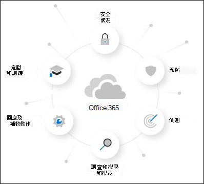

# 關於 Microsoft Defender for Office 365 試用版About the Microsoft Defender for Office 365 trial

Microsoft Defender for Office 365 保護您的組織免受電子郵件訊息、連結 (URLs) 和共同作業工具帶來的惡意威脅。Microsoft Defender for Office 365 safeguards your organization against malicious threats that are posed by email messages, links (URLs), and collaboration tools. 適用於 Office 365 的 Defender 包括：Defender for Office 365 includes:

- **威脅防護原則**：定義威脅防護原則，用來為組織設定適當的保護層級。**Threat protection policies**: Define threat-protection policies to set the appropriate level of protection for your organization.
- **報告**：查看即時報告，以監視您組織中的 Office 365 的 Defender。**Reports**: View real-time reports to monitor Defender for Office 365 performance in your organization.
- **威脅調查與回應功能**：使用先進的工具來調查、了解、模擬以及防止潛在威脅。**Threat investigation and response capabilities**: Use leading-edge tools to investigate, understand, simulate, and prevent threats.
- **自動調查及回應功能**：節省調查和減輕威脅的時間和精力。**Automated investigation and response capabilities**: Save time and effort investigating and mitigating threats.

Microsoft Defender for Office 365 試用版是一種最簡單的方法，可嘗試使用 Office 365 的 Defender，而設定它只需要幾次按一下。A Microsoft Defender for Office 365 trial is the easiest way to try the capabilities of Defender for Office 365, and setting it up only takes a couple of clicks. 完成試用設定後，組織中的所有 Office 365 方案1和方案2功能都可在最多90天內取得。After the trial setup is complete, all Defender for Office 365 Plan 1 and Plan 2 capabilities are available in the organization for up to 90 days.

> [!NOTE]
> 本文所述的自動設定目前是公開預覽，可能無法在您的位置提供。The automated configuration that's described in this article is currently in Public Preview and might not be available in your location.

## 條款與條件Terms and conditions

適用于90天的 Office 365 試用版可供使用，而且可以為您的所有使用者啟動。The Defender for Office 365 trial is available for 90 days and can be initiated for all of your users. 如需詳細資訊，請參閱 [Microsoft Defender For Office 365 試用條款 & 條件](defender-for-office-365-trial-terms-and-conditions.md)。For more information, see [Microsoft Defender for Office 365 Trial Terms & Conditions](defender-for-office-365-trial-terms-and-conditions.md).

## 設定 Office 365 試用版的 DefenderSet up a Defender for Office 365 trial

試用版可讓組織輕鬆安裝和設定 Office 365 的 Defender。A trial allows organizations to easily set up and configure the Defender for Office 365 capabilities. 在安裝期間，[在反垃圾郵件原則中](set-up-anti-phishing-policies.md#impersonation-settings-in-anti-phishing-policies-in-microsoft-defender-for-office-365)專用於 Defender for Office 365 的原則 (具體地說，[安全附件](safe-attachments.md)、[安全連結](safe-links.md)和模擬保護) 會使用標準範本，以進行預設的[安全性原則](preset-security-policies.md)。During setup, policies that are exclusive to Defender for Office 365 (specifically, [Safe Attachments](safe-attachments.md), [Safe Links](safe-links.md), and [impersonation protection in anti-spam policies](set-up-anti-phishing-policies.md#impersonation-settings-in-anti-phishing-policies-in-microsoft-defender-for-office-365)) are applied using the Standard template for [preset security policies](preset-security-policies.md).

根據預設，這些原則的適用範圍是組織中的所有使用者，但是系統管理員可以在安裝程式期間或之後自訂原則，讓它們只適用于特定使用者。By default, these policies are scoped to all users in the organization, but admins can customize the policies during or after setup so they apply only to specific users.

在設定期間，也會為整個組織設定 MDO P2 或對等) 中 (所找到的 MDO 回應功能。During setup, MDO response functionality (found in MDO P2 or equivalent) is also set up for the entire organization. 不需要任何原則範圍。No policy scoping is required.

## 授權Licensing

在試用設定過程中，Office 365 的 Defender 會自動套用至組織。As part of the trial setup, the Defender for Office 365 licenses are automatically applied to the organization. 授權在前90天內沒有任何收費。The licenses are free of charge for the first 90 days.

## 權限Permissions

若要開始或結束試用，您必須是 Azure Active Directory 中 **全域管理員** 或 **安全性管理員** 角色的成員。To start or end the trial, you need to be a member of the **Global Administrator** or **Security Administrator** roles in Azure Active Directory. 如需詳細資訊，請參閱 [關於系統管理員角色](../../admin/add-users/about-admin-roles.md)。For details, see [About admin roles](../../admin/add-users/about-admin-roles.md).

## 其他資訊Additional information

在您註冊試用版之後，最多可能需要2個小時的時間，所做的變更和更新才可供使用。After you enroll in the trial, it might take up to 2 hours for the changes and updates to be available. 而且，系統管理員必須登出後再登入以查看變更。And, admins must log out and log back in to see the changes.

系統管理員可以移至 <> 卡，隨時停用試用版。Admins can disable the trial at any point by going to the <> card.

## 可用性Availability

Office 365 試用版會逐步向外推出符合特定準則的現有客戶 (包括地理) ，而且沒有 Office 365 方案1的現有 Defender 或「計畫」2授權 (包含在其訂閱中或作為附加元件) 。The Defender for Office 365 trial is gradually rolling out to existing customers who meet specific criteria (including geography) and who don't have existing Defender for Office 365 Plan 1 or Plan 2 licenses (included in their subscription or as an add-on).

## 深入瞭解 Office 365 的 DefenderLearn more about Defender for Office 365

適用于 365 Office 的 Defender，可提供完整的功能蓋板，協助組織保護其企業。Defender for Office 365 helps organizations secure their enterprise by offering a comprehensive slate of capabilities.

您也可以在本 [互動指南](https://techcommunity.microsoft.com/t5/video-hub/protect-your-organization-with-microsoft-365-defender/m-p/1671189)中深入瞭解 Office 365 的 Defender。You can also learn more about Defender for Office 365 at this [interactive guide](https://techcommunity.microsoft.com/t5/video-hub/protect-your-organization-with-microsoft-365-defender/m-p/1671189).

### 預防Prevention

穩健的篩選堆疊可防止各種大量的大量型攻擊，包括商務電子郵件洩漏、認證網路釣魚、勒索代碼和高級惡意程式碼。A robust filtering stack prevents a wide variety of volume-based and targeted attacks including business email compromise, credential phishing, ransomware, and advanced malware.

- [反網路釣魚原則： Office 365 的 Defender 中的獨佔設定Anti-phishing policies: Exclusive settings in Defender for Office 365](set-up-anti-phishing-policies.md#exclusive-settings-in-anti-phishing-policies-in-microsoft-defender-for-office-365)
- [安全附件Safe Attachments](safe-attachments.md)
- [安全連結Safe Links](safe-links.md)

### 偵測Detection

業界領先的 AI 會偵測惡意和可疑的內容，並關聯攻擊模式，以找出保護的活動。Industry-leading AI detects malicious and suspicious content and correlates attack patterns to identify campaigns designed to evade protection.

- [Microsoft Defender for Office 365 的即時檢視Campaign Views in Microsoft Defender for Office 365](campaigns.md)

### 調查和搜尋Investigation and hunting

強大的體驗可協助識別、優先考慮威脅，並提供高級搜尋功能，以追蹤跨 Office 365 的攻擊。Powerful experiences help identify, prioritize, and investigate threats, with advanced hunting capabilities to track attacks across Office 365.

- [威脅瀏覽器和即時偵測Threat Explorer and Real-time detections](threat-explorer.md)
- [Defender for Office 365 的即時報告Real-time reports in Defender for Office 365](view-reports-for-mdo.md)
- [威脅追蹤器 - 新增和值得注意的功能Threat Trackers - New and Noteworthy](threat-trackers.md)
- 與[Microsoft 365 Defender](../defender/microsoft-365-defender.md)整合Integration with [Microsoft 365 Defender](../defender/microsoft-365-defender.md)

### 回應和修正Response and remediation

大量的事件回應和自動化功能會 amplify 您的安全性小組的效能和效能。Extensive incident response and automation capabilities amplify your security team's effectiveness and efficiency.

- [Microsoft Defender for Office 365 中的自動調查和回應 (AIR) Automated investigation and response (AIR) in Microsoft Defender for Office 365](office-365-air.md)

### 意識和訓練Awareness and training

透過用戶端應用程式內的整合體驗，豐富的類比和訓練功能會建立使用者知曉。Rich simulation and training capabilities along with integrated experiences within client applications build user awareness.

- [開始使用攻擊模擬訓練Get started using Attack simulation training](attack-simulation-training-get-started.md)

### 安全狀況Secure posture

建議的範本和設定真知灼見可協助客戶取得並保持安全。Recommended templates and configuration insights help customers get and stay secure.

- [EOP 和 Microsoft Defender for Office 365 中的預先設定安全性原則Preset security policies in EOP and Microsoft Defender for Office 365](preset-security-policies.md)
- [EOP 和 Microsoft Defender For Office 365 中保護原則的設定 analyzer](configuration-analyzer-for-security-policies.md)。[Configuration analyzer for protection policies in EOP and Microsoft Defender for Office 365](configuration-analyzer-for-security-policies.md).

## 提供意見Give feedback

您的意見反應可協助我們在保護您的環境時免受高級攻擊。Your feedback helps us get better at protecting your environment from advanced attacks. 分享您的經驗和產品功能與試用結果的印象。Share your experience and impressions of product capabilities and trial results.
