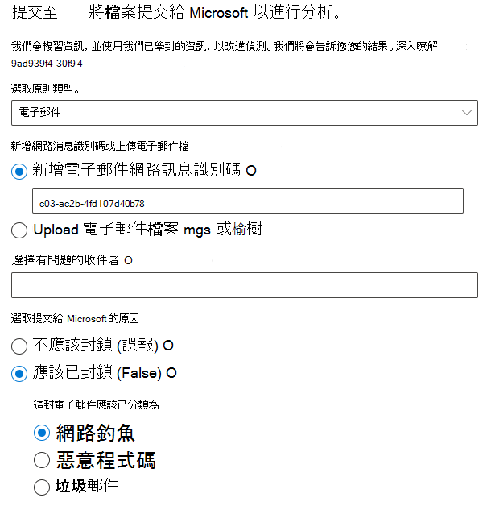
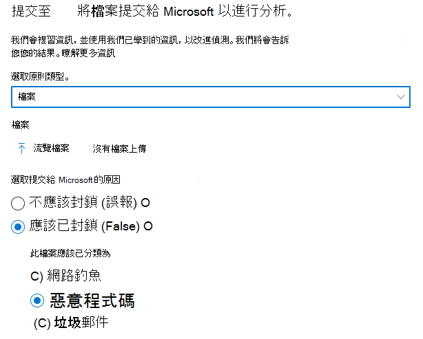
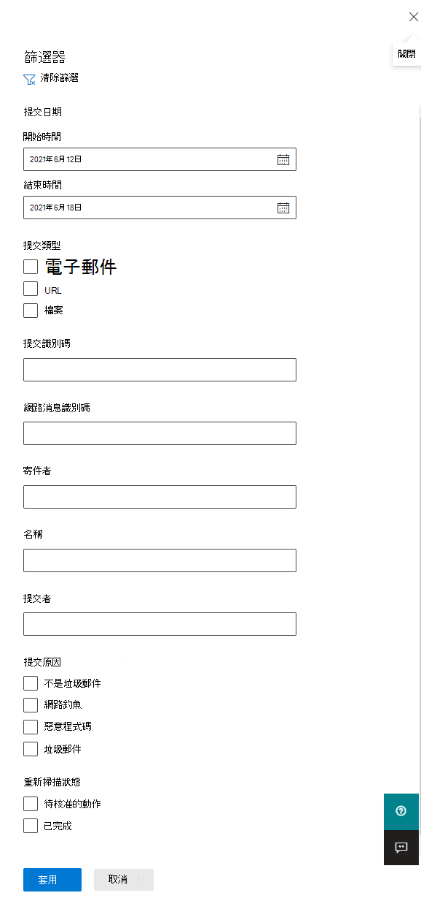
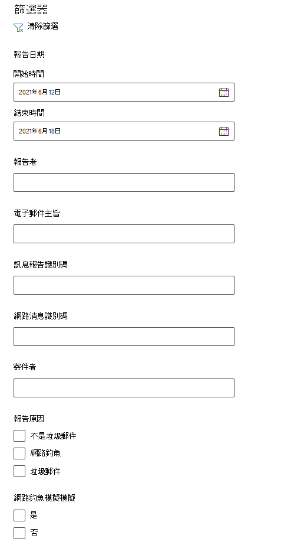
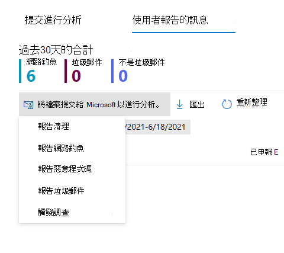

# 使用系統管理提交，將可疑的垃圾郵件、網路釣魚詐騙、URL 和檔案提交給 MicrosoftUse Admin Submission to submit suspected spam, phish, URLs, and files to Microsoft

[!INCLUDE [Microsoft 365 Defender rebranding](../includes/microsoft-defender-for-office.md)]

**適用於****Applies to**
- [Exchange Online ProtectionExchange Online Protection](exchange-online-protection-overview.md)
- [適用於 Office 365 的 Microsoft Defender 方案 1 和方案 2Microsoft Defender for Office 365 plan 1 and plan 2](defender-for-office-365.md)

在 Microsoft 365 具有 Exchange Online 信箱的組織中，系統管理員可以使用 Microsoft 365 Defender 入口網站中的提交入口網站，將電子郵件訊息、URLs 及附件提交給 Microsoft 以進行掃描。In Microsoft 365 organizations with Exchange Online mailboxes, admins can use the Submissions portal in the Microsoft 365 Defender portal to submit email messages, URLs, and attachments to Microsoft for scanning.

當您提交電子郵件訊息時，您會收到：When you submit an email message, you will get:

- **電子郵件驗證檢查**：傳送電子郵件時的驗證是否已通過或失敗的詳細資料。**Email authentication check**: Details on whether email authentication passed or failed when it was delivered.
- **原則點擊**：有關任何可能允許或封鎖內送電子郵件進入您租使用者之原則的資訊，請覆寫我們的服務篩選 verdicts。**Policy hits**: Information about any policies that may have allowed or blocked the incoming email into your tenant, overriding our service filter verdicts.
- 「**負載信譽/引爆**：檢查郵件中的任何 URLs 和附件。**Payload reputation/detonation**: Examination of any URLs and attachments in the message.
- **評分分析**：檢查是否有惡意的「人工 graders 完成」。**Grader analysis**: Review done by human graders in order to confirm whether or not messages are malicious.

> [!IMPORTANT]
> 在所有承租人中都不會進行負載信譽/引爆和評分分析。Payload reputation/detonation and grader analysis are not done in all tenants. 當資料不應該保留租使用者界限以符合合規性目的時，就會封鎖資訊，避免進入組織外部。Information is blocked from going outside the organization when data is not supposed to leave the tenant boundary for compliance purposes.

如需其他方式將電子郵件訊息、URLs 和附件提交給 Microsoft，請參閱 [向 Microsoft 報告訊息和](report-junk-email-messages-to-microsoft.md)檔案。For other ways to submit email messages, URLs, and attachments to Microsoft, see [Report messages and files to Microsoft](report-junk-email-messages-to-microsoft.md).

## 開始之前有哪些須知？What do you need to know before you begin?

- 您於 <https://security.microsoft.com/> 開啟 Microsoft 365 Defender 入口網站。You open the Microsoft 365 Defender portal at <https://security.microsoft.com/>. 若要直接移至 [ **提交** ] 頁面，請使用 <https://security.microsoft.com/reportsubmission> 。To go directly to the **Submissions** page, use <https://security.microsoft.com/reportsubmission>.

- 若要將郵件和檔案提交給 Microsoft，您必須是下列其中一個角色群組的成員：To submit messages and files to Microsoft, you need to be a member of one of the following role groups:
  - [Microsoft 365 Defender 入口網站](permissions-microsoft-365-security-center.md)中的 **組織管理** 或 **安全性讀者**。**Organization Management** or **Security Reader** in the [Microsoft 365 Defender portal](permissions-microsoft-365-security-center.md).
  
    請注意，此角色群組的成員資格是 [查看使用者送至自訂信箱的使用者](#view-user-submissions-to-microsoft) ，如本文稍後所述。Note that membership in this role group is required to [View user submissions to the custom mailbox](#view-user-submissions-to-microsoft) as described later in this article.

- 如需使用者如何提交郵件和檔案給 Microsoft 的詳細資訊，請參閱 [向 Microsoft 報告訊息和](report-junk-email-messages-to-microsoft.md)檔案。For more information about how users can submit messages and files to Microsoft, see [Report messages and files to Microsoft](report-junk-email-messages-to-microsoft.md).

## 向 Microsoft 報告可疑內容Report suspicious content to Microsoft

1. 在 Microsoft 365 Defender 入口網站中，移至 [**電子郵件 &** 共同作業 \> **提交**]。In the Microsoft 365 Defender portal, go to **Email & collaboration** \> **Submissions**.

2. 在 [ **提交** ] 頁面上，確認已選取 [已 **提交的分析** ] 索引標籤，然後按一下 [  **提交至 Microsoft 進行分析**]。On the **Submissions** page, verify that the **Submitted for analysis** tab is selected, and then click  **Submit to Microsoft for analysis**.

3. 使用送出 **至 Microsoft 來審閱** 浮出的浮出的浮出方式，如下列各節所述提交郵件、URL 或電子郵件附件。Use the **Submit to Microsoft for review** flyout that appears to submit the message, URL, or email attachment as described in the following sections.

   > [!NOTE]
   > 無法在不允許資料離開環境的雲中使用檔案和 URL 提交。File and URL submissions are not available in the clouds that do not allow for data to leave the environment. 選取 [檔案] 或 [URL] 的功能將會灰顯。The ability to select File or URL will be greyed out.

### 將可疑的電子郵件提交給 MicrosoftSubmit a questionable email to Microsoft

1. 在 [ **選取提交類型** ] 方塊中，確認下拉式清單中已選取 [ **電子郵件** ]。In the **Select the submission type** box, verify that **Email** is selected in the drop down list.

2. 在 [ **新增網路消息識別碼] 或 [上傳電子郵件** 檔案] 區段中，使用下列其中一個選項：In the **Add the network message ID or upload the email file** section, use one of the following options:
   - **新增電子郵件網路郵件識別碼**：此為 GUID 值，可在郵件中的 **X-MS-Exchange-Organization-網路 Message-Id** 標頭中，或在 Office365 中的 **X-** ----------------------------**Add the email network message ID**: This is a GUID value that's available in the **X-MS-Exchange-Organization-Network-Message-Id** header in the message or in the **X-MS-Office365-Filtering-Correlation-Id** header in quarantined messages.
   - **Upload 電子郵件檔 ( .msg 或 .eml)**：按一下 **[流覽檔案]**。**Upload the email file (.msg or .eml)**: Click **Browse files**. 在開啟的對話方塊中，尋找並選取 .eml 或 .msg 檔案，然後按一下 [ **開啟**]。In the dialog that opens, find and select the .eml or .msg file, and then click **Open**.

   > [!NOTE]
   > 將郵件送出多久30天，已暫時為 Office 365 客戶的 Defender 停用。The ability to submit messages as old as 30 days has been temporarily suspended for Defender for Office 365 customers. 系統管理員只可以回復7天。Admins will only be able to go back 7 days.

3. 在 [ **選擇有問題的收件者** ] 方塊中，指定您想要執行原則檢查的收件者。In the **Choose a recipient who had an issue** box, specify the recipient that you would like to run a policy check against. 原則檢查會決定是否因使用者或組織原則而略過掃描的電子郵件。The policy check will determine if the email bypassed scanning due to user or organization policies.

4. 在 [ **選取要提交給 Microsoft 的原因** ] 區段中，選取下列其中一個選項：In the **Select a reason for submitting to Microsoft** section, select one of the following options:
   - **不應該封鎖 (誤報)****Should not have been blocked (false positive)**
   - **應該已封鎖**：在 [ **電子郵件應該已分類成** ] 區段中，選取下列其中一個值 (如果您不確定，請使用您的最佳 judgement) ：**Should have been blocked**: In the **The email should have been categorized as** section that appears, select one of the following values (if you're not sure, use your best judgement):
     - **網路釣魚****Phish**
     - **垃圾郵件****Spam**
     - **惡意程式碼****Malware**

5. 完成作業後，請按一下 [ **提交** ] 按鈕。When you're finished, click the **Submit** button.

> [!div class="mx-imgBorder"]
> 

### 將可疑 URL 傳送給 MicrosoftSend a suspect URL to Microsoft

1. 在 [ **選取提交類型** ] 方塊中，從下拉式清單中選取 [ **URL** ]。In the **Select the submission type** box, select **URL** from the drop down list.

2. 在出現的 [ **url** ] 方塊中，輸入完整的 URL (例如， `https://www.fabrikam.com/marketing.html`) 。In the **URL** box that appears, enter the full URL (for example, `https://www.fabrikam.com/marketing.html`).

3. 在 [ **選取要提交給 Microsoft 的原因** ] 區段中，選取下列其中一個選項：In the **Select a reason for submitting to Microsoft** section, select one of the following options:
   - **不應該封鎖 (誤報)****Should not have been blocked (false positive)**
   - **應該已封鎖**：在 **此 URL 中，應該已分類為** 所出現的區段，請選取 [ **網路釣魚** 或 **惡意** 代碼]。**Should have been blocked**: In the **This URL should have been categorized as** section that appears, select **Phish** or **Malware**.

4. 完成作業後，請按一下 [ **提交** ] 按鈕。When you're finished, click the **Submit** button.

> [!div class="mx-imgBorder"]
> 

### 將可疑的電子郵件附件提交給 MicrosoftSubmit a suspected email attachment to Microsoft

1. 在 [ **選取提交類型** ] 方塊中， **從下拉式清單中選取** [檔案]。In the **Select the submission type** box, select **File** from the drop down list.

2. 在出現的 [ **檔** ] 區段中，按一下 **[流覽檔案]**。In the **File** section that appears, click **Browse files**. 在開啟的對話方塊中，尋找並選取檔，然後按一下 [ **開啟**]。In the dialog that opens, find and select the file, and then click **Open**.

3. 在 [ **選取要提交給 Microsoft 的原因** ] 區段中，選取下列其中一個選項：In the **Select a reason for submitting to Microsoft** section, select one of the following options:
   - **不應該封鎖 (誤報)****Should not have been blocked (false positive)**
   - **應該已封鎖**：在 **此 URL 中，應該已分類為** 所出現的區段， **惡意** 代碼是唯一的選擇，而且會自動加以選取。**Should have been blocked**: In the **This URL should have been categorized as** section that appears, **Malware** is the only choice, and is automatically selected.

4. 完成作業後，請按一下 [ **提交** ] 按鈕。When you're finished, click the **Submit** button.

> [!div class="mx-imgBorder"]
> 

## 查看對 Microsoft 的系統管理員報送View admin submissions to Microsoft

1. 在 Microsoft 365 Defender 入口網站中，移至 [**電子郵件 &** 共同作業 \> **提交**]。In the Microsoft 365 Defender portal, go to **Email & collaboration** \> **Submissions**.

2. 在 [ **提交** ] 頁面上，確認已選取 [已 **提交進行分析** ] 索引標籤。On the **Submissions** page, verify that the **Submitted for analysis** tab is selected.

   - 您可以按一下可用的欄標題，排序專案。You can sort the entries by clicking on an available column header. 按一下 [ **自訂欄** ] 以顯示最多7欄。Click **Customize columns** to show a maximum of seven columns. 預設值會標上星號 (\*)：The default values are marked with an asterisk (\*):
     - **提交名稱**\***Submission name**\*
     - **寄件者**\***Sender**\*
     - **提交日期**\***Date submitted**\*
     - **提交類型**\***Submission type**\*
     - **提交原因**\***Reason for submitting**\*
     - **重新掃描狀態**\***Rescan status**\*
     - **重新掃描結果**\***Rescan result**\*
     - **篩選判定****Filter verdict**
     - **傳遞/封鎖原因****Delivery/Block reason**
     - **提交識別碼****Submission ID**
     - **網路消息識別碼/物件識別碼****Network Message ID/Object ID**
     - **Direction****Direction**
     - **寄件者 IP****Sender IP**
     - **大量相容層級 (BCL)****Bulk compliant level (BCL)**
     - **目的地****Destination**
     - **原則動作****Policy action**
     - **提交者****Submitted by**

     當您完成時 **，按一下 [** 套用]。When you're finished, click **Apply**.

   - 若要篩選項目，請按一下 [ **篩選**]。To filter the entries, click **Filter**. 可用的篩選條件如下：The available filters are:
     - **提交日期**： **開始日期** 和 **結束日期**。**Date submitted**: **Start date** and **End date**.
     - **提交類型**： **電子郵件**、 **URL** 或 **檔案**。**Submission type**: **Email**, **URL**, or **File**.
     - **提交識別碼**：指派給每個提交的 GUID 值。**Submission ID**: A GUID value that's assigned to every submission.
     - **網路消息識別碼****Network Message ID**
     - **Sender****Sender**

     當您完成時 **，按一下 [** 套用]。When you're finished, click **Apply**.

     > [!div class="mx-imgBorder"]
     > 

   - 若要群組專案，請按一下 [ **群組** ]，然後從下拉式清單中選取下列其中一個值：To group the entries, click **Group** and select one of the following values from the drop down list:
     - **無****None**
     - **類型****Type**
     - **原因****Reason**
     - **狀態****Status**
     - **重新掃描結果****Rescan result**

   - 若要匯出專案，請按一下 [ **匯出**]。To export the entries, click **Export**. 在出現的對話方塊中，儲存 .csv 檔。In the dialog that appears, save the .csv file.

### 系統管理員提交重新掃描詳細資料Admin submission rescan details

在系統管理提交中提交的郵件會經過檢查，並顯示在提交詳細資料浮出的結果中：Messages that are submitted in admin submissions are reviewed and results shown in the submissions detail flyout:

- 寄件者在傳遞電子郵件時，電子郵件驗證是否失敗。If there was a failure in the sender's email authentication at the time of delivery.
- 任何有關可能會影響或覆寫郵件決策的原則點擊的資訊。Information about any policy hits that could have affected or overridden the verdict of a message.
- 目前的引爆結果，查看郵件中所含的 URL 或檔案是否惡意。Current detonation results to see if the URLs or files contained in the message were malicious or not.
- Graders 的意見反應。Feedback from graders.

如果發現覆寫，則應該會在幾分鐘內完成重新掃描。If an override was found, the rescan should complete in several minutes. 如果電子郵件驗證或傳遞中沒有問題，則不會受到覆寫的影響，來自 graders 的意見反應可能需要一天。If there wasn't a problem in email authentication or delivery wasn't affected by an override, then the feedback from graders could take up to a day.

## 查看 Microsoft 的使用者報送View user submissions to Microsoft

如果您已部署 [報表訊息增益集](enable-the-report-message-add-in.md)、[報告網路釣魚增益集](enable-the-report-phish-add-in.md)或人員在 [Outlook 網頁版中使用內建報告](report-junk-email-and-phishing-scams-in-outlook-on-the-web-eop.md)，您可以在 [**使用者報告的郵件**] 索引標籤上看到要報告的使用者。If you've deployed the [Report Message add-in](enable-the-report-message-add-in.md), the [Report Phishing add-in](enable-the-report-phish-add-in.md), or people use the [built-in reporting in Outlook on the web](report-junk-email-and-phishing-scams-in-outlook-on-the-web-eop.md), you can see what users are reporting on the **User reported message** tab.

1. 在 Microsoft 365 Defender 入口網站中，移至 [**電子郵件 &** 共同作業 \> **提交**]。In the Microsoft 365 Defender portal, go to **Email & collaboration** \> **Submissions**.

2. 在 [ **提交** ] 頁面上，選取 [ **使用者報告的郵件** ] 索引標籤。On the **Submissions** page, select the **User reported messages** tab.

   - 您可以按一下可用的欄標題，排序專案。You can sort the entries by clicking on an available column header. 按一下 [ **自訂欄** ] 以顯示最多7欄。Click **Customize columns** to show a maximum of seven columns. 預設值會標上星號 (\*)：The default values are marked with an asterisk (\*):

     - **電子郵件主題**\***Email subject**\*
     - **報告者**\***Reported by**\*
     - **報告日期**\***Date reported**\*
     - **寄件者**\***Sender**\*
     - **報告原因**\***Reported reason**\*
     - **重新掃描結果**\***Rescan result**\*
     - **訊息報告識別碼****Message reported ID**
     - **網路消息識別碼****Network Message ID**
     - **寄件者 IP****Sender IP**
     - **網路釣魚模擬模擬****Phish simulation**

     當您完成時 **，按一下 [** 套用]。When you're finished, click **Apply**.

   - 若要篩選項目，請按一下 [ **篩選**]。To filter the entries, click **Filter**. 可用的篩選條件如下：The available filters are:
     - **報告日期**： **開始日期** 和 **結束日期**。**Date reported**: **Start date** and **End date**.
     - **報告者****Reported by**
     - **電子郵件主旨****Email subject**
     - **訊息報告識別碼****Message reported ID**
     - **網路消息識別碼****Network Message ID**
     - **Sender****Sender**
     - 已 **報告原因**：**非垃圾郵件**、**網路釣魚** 或 **垃圾郵件**。**Reported reason**: **Not junk**, **Phish**, or **Spam**.
     - **網路釣魚模擬**： **是** 或 **否****Phish simulation**: **Yes** or **No**

     當您完成時 **，按一下 [** 套用]。When you're finished, click **Apply**.

     > [!div class="mx-imgBorder"]
     > 

   - 若要群組專案，請按一下 [ **群組** ]，然後從下拉式清單中選取下列其中一個值：To group the entries, click **Group** and select one of the following values from the drop down list:
     - **無****None**
     - **原因****Reason**
     - **Sender****Sender**
     - **報告者****Reported by**
     - **重新掃描結果****Rescan result**
     - **網路釣魚模擬模擬****Phish simulation**

   - 若要匯出專案，請按一下 [ **匯出**]。To export the entries, click **Export**. 在出現的對話方塊中，儲存 .csv 檔。In the dialog that appears, save the .csv file.

> [!NOTE]
> 如果組織已設定為將使用者報告的郵件傳送至自訂信箱，則不會傳送報告的郵件進行重新掃描，而且 **使用者報告的訊息** 中的結果將永遠為空。If organizations are configured to send user reported messages to the custom mailbox only, reported messages will not be sent for rescan and the results in **User reported messages** will always be empty.

### 撤銷使用者報送Undo user submissions

一旦使用者將可疑的電子郵件提交至自訂信箱，使用者和系統管理員就沒有任何可復原提交的選項。Once a user submits a suspicious email to the custom mailbox, the user and admin don't have an option to undo the submission. 如果使用者想要復原電子郵件，將可在 [刪除的郵件] 或 [垃圾郵件] 資料夾中復原。If the user would like to recover the email, it will be available for recovery in the Deleted Items or Junk Email folders.

### 從自訂信箱將郵件提交給 MicrosoftSubmit messages to Microsoft from the custom mailbox

如果您已將自訂信箱設定為在未傳送郵件給 Microsoft 的情況下截獲使用者報告的郵件，您可以尋找特定郵件並將其傳送給 Microsoft 進行分析。If you've configured the custom mailbox to intercept user-reported messages without sending the messages to Microsoft, you can find and send specific messages to Microsoft for analysis. 這會有效地將使用者提交權移至系統管理員提交。This effectively moves a user submission to an admin submission.

在 [ **使用者報告的郵件** ] 索引標籤上，選取清單中的訊息，按一下 [ **提交給 Microsoft 進行分析**]，然後從下拉式清單中選取下列其中一個值：On the **User reported messages** tab, select a message in the list, click **Submit to Microsoft for analysis**, and then select one of the following values from the drop down list:

- **報告清理****Report clean**
- **報告網路釣魚****Report phishing**
- **報告惡意程式碼****Report malware**
- **報告垃圾郵件****Report spam**
- **觸發調查****Trigger investigation**

> [!div class="mx-imgBorder"]
> 
