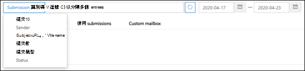

# 使用系統管理提交，將可疑的垃圾郵件、網路釣魚詐騙、URL 和檔案提交給 Microsoft

[!INCLUDE [Microsoft 365 Defender rebranding](../includes/microsoft-defender-for-office.md)]

在使用 Exchange Online 信箱的 Microsoft 365 組織中，系統管理員可以使用安全性 & 合規性中心內的提交入口網站，將電子郵件訊息、URLs 和附件提交給 Microsoft 以供掃描。

當您提交電子郵件時，您會收到任何可能允許內送電子郵件進入租使用者的原則，以及對郵件中的任何 URLs 和附件進行檢查的相關資訊。 可能允許郵件的原則包括個別使用者的安全寄件者清單，以及租使用者層級原則，例如 Exchange 郵件流程規則 (也稱為 transport rules) 。

如需其他方式將電子郵件訊息、URLs 和附件提交給 Microsoft，請參閱 [向 Microsoft 報告訊息和](report-junk-email-messages-to-microsoft.md)檔案。

## 開始之前有哪些須知？

- 您要在 <https://protection.office.com/> 開啟安全性與合規性中心。 若要直接移至 **提交** 頁面，請使用 <https://protection.office.com/reportsubmission> 。

- 若要將郵件和檔案提交給 Microsoft，您必須是下列其中一個角色群組的成員：

  - **組織管理** 或 [安全性 & 規範中心](permissions-in-the-security-and-compliance-center.md) 的 **安全性系統管理員** 。 

  - [Exchange Online](https://docs.microsoft.com/Exchange/permissions-exo/permissions-exo#role-groups)中的 **組織管理** 。

    請注意，此角色群組的成員資格是 [查看使用者送至自訂信箱的使用者](#view-user-submissions-to-the-custom-mailbox) ，如本主題稍後所述。

- 如需使用者如何提交郵件和檔案給 Microsoft 的詳細資訊，請參閱 [向 Microsoft 報告訊息和](report-junk-email-messages-to-microsoft.md)檔案。

## 向 Microsoft 報告可疑內容

1. 在 [安全性 & 規範中心] 中，移至 [ **威脅管理** \> **提交** ]，確認您在 [系統 **管理提交** ] 索引標籤上，然後按一下 [ **新增提交** ]。

2. 使用看似送出的 **新** 送出控制項，如下列各節所述提交郵件、URL 或附件。

### 將可疑的電子郵件提交給 Microsoft

1. 在 [ **物件類型** ] 區段中，選取 [ **電子郵件** ]。 在 [ **提交格式** ] 區段中，使用下列其中一個選項：

   - **網路消息識別碼** ：這是在郵件中 **X-MS-Exchange-Organization-網路 Message-Id** 標頭中可用的 GUID 值。

   - **File** 檔案：按一下 **[選擇** 檔案]。 在開啟的對話方塊中，尋找並選取 .eml 或 .msg 檔案，然後按一下 [ **開啟** ]。

2. **在 [收** 件者] 區段中，指定您想要執行原則檢查的一或多個收件者。 原則檢查會決定是否因使用者或組織原則而略過掃描的電子郵件。

3. 在 [ **提交原因** ] 區段中，選取下列其中一個選項：

   - **不應該封鎖**

   - **應該已封鎖** ：請選取 **[垃圾郵件** ]、[ **網路釣魚** ] 或 [ **惡意** 代碼]。 如果您不確定，請使用您的最佳判斷。

4. 如果篩選因提交原則而略過，您將會看到該原則的相關資訊。

   如果篩選器因一或多個原則而略過，掃描將會在數分鐘內完成。 您可以按一下 [狀態] 連結，以查看有關提交的其他資訊。 這包括原則檢查的結果和重新掃描判定。 附注這不會再透過 Microsoft Defender for Office 365 完整篩選堆疊執行電子郵件，但會根據郵件、URL 或檔案的某些屬性執行部分重新掃描。

5. 完成作業後，請按一下 [ **提交** ] 按鈕。

### 將可疑 URL 傳送給 Microsoft

1. 在 [ **物件類型** ] 區段中，選取 [ **URL** ]。 在出現的方塊中，輸入完整的 URL (例如， `https://www.fabrikam.com/marketing.html`) 。

2. 在 [ **提交原因** ] 區段中，選取下列其中一個選項：

   - **不應該封鎖**

   - **應該已封鎖** ：請選取 [ **網路釣魚** 或 **惡意** 代碼]。

3. 完成作業後，請按一下 [ **提交** ] 按鈕。

### 將可疑檔提交至 Microsoft

1. 在 [ **物件類型** ] 區段中，選取 [ **附件** ]。

2. 按一下 **[選擇** 檔案]。 在開啟的對話方塊中，尋找並選取檔，然後按一下 [ **開啟** ]。

3. 在 [ **提交原因** ] 區段中，選取下列其中一個選項：

   - **不應該封鎖**

   - **應該已封鎖** ： **惡意** 代碼是唯一的選擇，而且會自動加以選取。

4. 完成作業後，請按一下 [ **提交** ] 按鈕。

## 查看系統管理員報送

在 [安全性 & 規範中心] 中，移至 [ **威脅管理** \> **提交** ]，確認您在 [系統 **管理提交** ] 索引標籤上，然後按一下 [ **新增提交** ]。

在頁面頂端附近，您可以輸入開始日期、結束日期和 (預設值) 您可以依 **提交識別碼** (指派給每個提交) 的 GUID 值進行篩選，方法是在方塊中輸入值，然後按一下 [重新整理]  。 Update

若要變更篩選準則，請按一下 [ **提交識別碼** ] 按鈕，然後選擇下列其中一個值：

- **Sender**
- **Subject/URL/檔案名**
- **提交者**
- **提交類型**
- **狀態**

若要匯出結果，請按一下頁面頂端附近的 [ **匯出** ]，然後選取 [ **圖表資料** 或 **表格** ]。 在出現的對話方塊中，儲存 .csv 檔案。

在圖形下方有三個索引標籤： **電子郵件** (預設) 、 **URL** 及 **附件** 。

### 查看系統管理電子郵件報送

按一下 [ **電子郵件** ] 索引標籤。

您可以按一下頁面底部附近的 [ **欄選項** ] 按鈕，從該視圖新增或移除欄：

- **Date**
- **提交識別碼** ：指派給每個提交的 GUID 值。
- **提交者**\*
- **主旨**\*
- **Sender**
- **寄件者 IP**\*
- **提交類型**
- **傳遞原因**
- **地位**\*
- **控制項類型**
- **控制項來源**

  \* 如果您按一下此值，詳細資訊就會顯示在浮出控制項中。

### 查看管理 URL 提交

按一下 [ **URL** ] 索引標籤。

您可以按一下頁面底部附近的 [ **欄選項** ] 按鈕，從該視圖新增或移除欄：

- **Date**
- **提交識別碼**
- **提交者**\*
- **URL**\*
- **提交類型**
- **地位**\*

  \* 如果您按一下此值，詳細資訊就會顯示在浮出控制項中。

### View admin 附件提交

按一下 [ **附件** ] 索引標籤。

您可以按一下頁面底部附近的 [ **欄選項** ] 按鈕，從該視圖新增或移除欄：

- **Date**
- **提交識別碼**
- **提交者**\*
- **檔案名**\*
- **提交類型**
- **地位**\*

  \* 如果您按一下此值，詳細資訊就會顯示在浮出控制項中。

## 查看 Microsoft 的使用者報送

如果您已部署 [報表訊息增益集](enable-the-report-message-add-in.md)，或人員使用 [網頁型 Outlook 中內建的報表](report-junk-email-and-phishing-scams-in-outlook-on-the-web-eop.md)，您可以在 [ **使用者報送** ] 索引標籤上看到使用者的報告。

1. 在 [安全性 & 規範中心] 中，移至 [ **威脅管理** \> **提交** ]。

2. 選取 [ **使用者報送** ] 索引標籤，然後按一下 [ **新增提交** ]。

您可以按一下頁面底部附近的 [ **欄選項** ] 按鈕，從該視圖新增或移除欄：

- **提交于**
- **提交者**\*
- **主旨**\*
- **Sender**
- **寄件者 IP**\*
- **提交類型**

\* 如果您按一下此值，詳細資訊就會顯示在浮出控制項中。

在頁面頂端附近，您可以輸入開始日期、結束日期和 (預設值) 您可以在 [收件者] 方塊中輸入值，然後按一下 [重新整理] 按鈕，以篩選收 **件** 者  。 Update

若要變更篩選準則，請按一下 [ **寄件者** ] 按鈕，然後選擇下列其中一個值：

- **寄件者網域**
- **主旨**
- **提交者**
- **提交類型**
- **寄件者 IP**

若要匯出結果，請按一下頁面頂端附近的 [ **匯出** ]，然後選取 [ **圖表資料** 或 **表格** ]。 在出現的對話方塊中，儲存 .csv 檔案。

## 查看自訂信箱的使用者報送

**如果** 您已 [將自訂信箱設定](user-submission.md) 為接收使用者報告的郵件，您可以查看並提交傳遞到報表信箱的郵件。

1. 在 [安全性 & 規範中心] 中，移至 [ **威脅管理** \> **提交** ]。

2. 選取 [ **自訂信箱** ] 索引標籤。

您可以按一下頁面底部附近的 [ **欄選項** ] 按鈕，從該視圖新增或移除欄：

- **提交于**
- **提交者**\*
- **主旨**\*
- **Sender**
- **寄件者 IP**\*
- **提交類型**

在頁面頂端附近，您可以輸入開始日期、結束日期，也可以透過在方塊中輸入值，然後按一下 [重新整理] 按鈕 **來篩選**  。 Update

若要匯出結果，請按一下頁面頂端附近的 [ **匯出** ]，然後選取 [ **圖表資料** 或 **表格** ]。 在出現的對話方塊中，儲存 .csv 檔案。

## 撤銷使用者報送

一旦使用者將可疑的電子郵件提交至自訂信箱，使用者和系統管理員就沒有任何可復原提交的選項。 如果使用者想要復原電子郵件，將可在 [刪除的郵件] 或 [垃圾郵件] 資料夾中復原。 

### 從自訂信箱將郵件提交給 Microsoft

如果您已將自訂信箱設定為在未傳送郵件給 Microsoft 的情況下截獲使用者報告的郵件，您可以尋找特定郵件並將其傳送給 Microsoft 進行分析。 這會有效地將使用者提交權移至系統管理員提交。

在 [ **自訂信箱** ] 索引標籤上，選取清單中的訊息，按一下 [ **動作** ] 按鈕，然後進行下列其中一項選擇：

- **報告清理**
- **報告網路釣魚**
- **報告惡意程式碼**
- **報告垃圾郵件**

