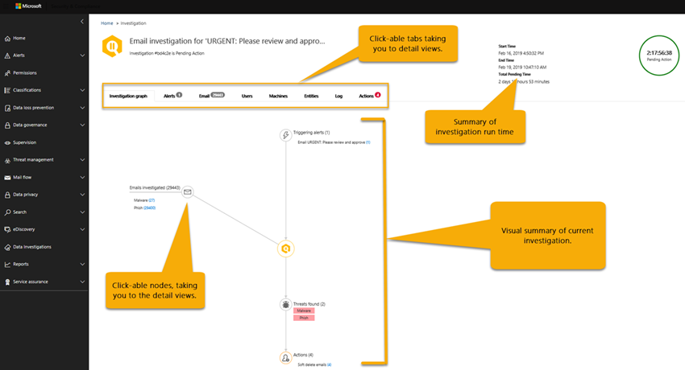

# 詳細資料及自動化調查 Office 365 中的結果Details and results of an automated investigation in Office 365

當[自動化調查](office-365-air.md)發生在[Office 365 進階威脅防護](office-365-atp.md)，詳細資料，調查可用期間和之後自動的調查程序。When an [automated investigation](office-365-air.md) occurs in [Office 365 Advanced Threat Protection](office-365-atp.md), details about that investigation are available during and after the automated investigation process. 如果您擁有必要權限，您可以在調查詳細資料檢視中查看這些詳細資料。If you have the necessary permissions, you can view those details in an investigation details view. 調查詳細資料檢視可提供您最新的狀態，以及核准任何待核准動作的能力。The investigation details view provides you with up-to-date status and the ability to approve any pending actions. 

## 檢視調查的詳細資料View details of an investigation

1. 移至 [https://protection.office.com](https://protection.office.com) 並登入。Go to [https://protection.office.com](https://protection.office.com) and sign in. 這樣會帶您前往安全性與合規性中心。This takes you to the the Security & Compliance Center.

2. 執行下列其中一項動作：Do one of the following:

    - 移至 [威脅管理]\*\*\*\*  >  [儀表板]\*\*\*\*Go to **Threat management** > **Dashboard**. 這樣會帶您前往[安全性儀表板](security-dashboard.md)。This takes you to the [Security Dashboard](security-dashboard.md). 您的 AIR 小工具會顯示在[安全性儀表板](security-dashboard.md)上方。Your AIR widgets appear across the top of the [Security Dashboard](security-dashboard.md). 選取小工具，例如**調查摘要**。Select a widget, such as **Investigations summary**.

    - 移至 [威脅管理]\*\*\*\*  >  [調查]\*\*\*\*。Go to **Threat management** > **Investigations**. 

    這兩種方法都會帶您前往調查清單。Either method takes you to a list of investigations.

     

3. 在調查清單中，選取 [識別碼]\*\*\*\* 欄中的項目。In the list of investigations, select an item in the **ID** column. 這樣會開啟調查詳細資料頁面，從檢視中的調查圖形開始。This opens investigation details page, starting with the investigation graph in view.

    

   使用各個索引標籤深入了解調查。Use the various tabs to learn more about the investigation.

## 檢視與調查相關警示的詳細資料View details about an alert related to an investigation

某些類型的警示會在 Office 365 中觸發自動化調查。Certain kinds of alerts trigger automated investigation in Office 365. 若要深入了解，請參閱[警示](automated-investigation-response-office.md#alerts)。To learn more, see [Alerts](automated-investigation-response-office.md#alerts). 使用下列程序來檢視與自動化調查相關聯警示的詳細資料。Use the following procedure to view details about an alert that is associated with an automated investigation.

1. 移至 [https://protection.office.com](https://protection.office.com) 並登入。Go to [https://protection.office.com](https://protection.office.com) and sign in. 這樣會帶您前往安全性與合規性中心。This takes you to the the Security & Compliance Center.

2. 移至 [威脅管理]\*\*\*\*  >  [調查]\*\*\*\*。Go to **Threat management** > **Investigations**.

3. 在調查清單中，選取 [識別碼]\*\*\*\* 欄中的項目。In the list of investigations, select an item in the **ID** column. 

4. 開啟調查詳細資料時，選取 [警示]\*\*\*\* 索引標籤。觸發調查的任何警示都會列在此處。With details of an investigation open, select the **Alerts** tab. Any alerts that triggered the investigation are listed here.

5. 選取清單中的項目。Select an item in the list. 隨即開啟一個飛出視窗，其中包含警示的詳細資料以及其他資訊和動作的連結。A flyout opens, with details about the alert and links to additional information and actions.

6. 檢閱飛出視窗中的資訊，並視特定警示採取動作，例如**解決**、**隱藏**，或**通知使用者**。Review the information on the flyout, and, depending on the particular alert, take an action, such as **Resolve**, **Suppress**, or **Notify users**. 

    - **解決**等同於關閉警示**Resolve** is equivalent to closing an alert
    
    - **隱藏**會導致原則在指定時段不觸發警示**Suppress** causes a policy to not trigger alerts for a specified period of time
    
    - **通知使用者**會啟動電子郵件，並且已輸入使用者的電子郵件地址，讓您的安全性操作小組輸入要給這些使用者的訊息。**Notify users** starts an email with users' email addresses already entered, and enables your security operations team to type a message to those users. (這類似於使用[威脅總管](threat-explorer.md)將訊息傳送給收件者。)(This is similar to sending a message to recipients using [Threat Explorer](threat-explorer.md).)  

## 如何使用不同的索引標籤How to use the various tabs

下列各節會引導您不同的索引標籤上自動化的調查] 頁面上，以及如何您可以使用資訊。The following sections walk you through the various tabs on the automated investigations page and how you can use the information.

### 自動化的調查頁面Automated investigations page

[自動化的調查] 頁面上顯示貴組織的調查和其目前狀態。The automated investigations page shows your organization's investigations and their current states.

 
  
您可以：You can:
- 直接前往調查 （選取**調查識別碼**）。Navigate directly to an investigation (select an **Investigation ID**).
- 套用篩選。Apply filters. 選擇 [從**調查類型**、**時間範圍**、**狀態**或這些項目的組合。Choose from **Investigation Type**, **Time range**, **Status**, or a combination of these.
- 將資料匯出至.csv 檔案。Export the data to a .csv file.

調查狀態表示分析和動作的進度。The investigation status indicates the progress of the analysis and actions. 當調查執行時，狀態會變更為表示是否已找到威脅，以及是否已核准的動作。As the investigation runs, status changes to indicate whether threats were found, and whether actions have been approved. 

|狀態Status  |其意思What it means  |
|---------|---------|
|啟動中Starting | 調查已排入佇列推出開始The investigation is queued to begin soon |
|正在執行Running | 調查已啟動，並且所進行的分析The investigation has started and is conducting its analysis |
|沒有找到的威脅No Threats Found | 調查已完成其分析，而且找不到任何威脅The investigation has completed its analysis and no threats were found |
|由系統終止Terminated By System | 調查已不關閉，並將在 7 天後過期The investigation was not closed and expired after 7 days |
|擱置中的巨集指令Pending Action | 調查找到威脅與建議的動作。The investigation found threats with actions recommended.  調查會繼續執行後已找到初始威脅，並建議動作，所以您應該查看記錄檔之前核准，看看分析器是否仍為正在進行中的動作。The investigation continues running after it's found initial threats and recommended actions, so you should check the log before approving actions to see if analyzers are still in-progress. |
|找到的威脅Threats Found | 調查找到威脅，但威脅沒有空調內可用的動作。The investigation found threats, but the threats do not have actions available within AIR.  以下是使用者動作是沒有方向尚未空調動作。These are user actions where there is no direction AIR action yet. |
|修復Remediated | 調查完成，並完全修復 （已核准所有動作）The investigation finished and was fully remediated (all actions were approved) |
|部分修復Partially Remediated | 調查完成，並建議的動作的一些已核准The investigation finished and some of the recommended actions were approved |
|終止的使用者Terminated By User | 系統管理員終止調查An admin terminated the investigation |
|失敗Failed | 禁止達到上威脅結論調查期間發生錯誤An error occurred during the investigation that prevented it from reaching a conclusion on threats |
|排入佇列的節流設定Queued By Throttling | 調查正在等候由於系統處理限制 （以保護服務效能） 的分析The investigation is waiting for analysis due to system processing limitations (to protect service performance) |
|終止的節流設定Terminated By Throttling | 在有足夠的時間，因為調查磁碟區及處理限制的系統無法完成調查。The investigation could not be completed in sufficient time due to investigation volume and system processing limitations. 您可以選取 [檔案總管中的 [電子郵件，然後選取調查動作 retrigger 調查。You can retrigger the investigation by selecting the email in Explorer and selecting the Investigate action. |

### 調查圖表Investigation graph

當您開啟特定調查時，您會看到 [調查 graph] 頁面。When you open a specific investigation, you see the investigation graph page. 此頁面會顯示所有不同的實體： 電子郵件、 使用者 （和其活動），以及已自動調查一部分警示所觸發的裝置。This page shows all the different entities: email messages, users (and their activities), and devices that were automatically investigated as part of the alert that was triggered.

您可以：You can:
- 取得目前調查的視覺化概觀。Get a visual overview of the current investigation.
- 檢視調查工期的摘要。View a summary of the investigation duration.
- 若要檢視該節點的詳細資料視覺效果中選取節點。Select a node in the visualization to view details for that node.
- 若要檢視該索引標籤的詳細資訊，在頂端選取] 索引標籤。Select a tab across the top to view details for that tab.

### 警示調查Alert investigation

調查的 [**提醒**] 索引標籤中，您可以看到與調查有關的提醒。On the **Alerts** tab for an investigation, you can see alerts relevant to the investigation. 詳細資料包含觸發調查警示和調查相互關聯其他相關的警示，例如風險登入、 違反 DLP 原則等。Details include the alert that triggered the investigation and other correlated alerts, such as risky sign-in, DLP policy violations, etc., that are correlated to the investigation. 此頁面上，從安全性分析師也可以檢視其他詳細資料上獲取個別警示。From this page, a security analyst can also view additional details on individual alerts.

![產生提醒] 頁面上](../../media/air-investigationalertspage.png)

您可以：You can:
- 取得目前的觸發警示和任何相關聯的警示的視覺化概觀。Get a visual overview of the current triggering alert and any associated alerts.
- 若要開啟 [顯示完整警示的詳細資訊的飛出視窗頁面清單中，選取 [警示。Select an alert in the list to open a fly-out page that shows full alert details.

### 電子郵件調查Email investigation

在調查的**電子郵件**] 索引標籤中，您可以看到原始的電子郵件和類似的電子郵件被識別為調查的一部分的叢集。On the **Email** tab for an investigation, you can see the original emails and the clusters of similar email identified as part of the investigation. 

指定組織中的使用者傳送及接收，再加上電子郵件通訊和攻擊的多重使用者本質、 的程序的電子郵件的真正量Given the sheer volume of email that users in an organization send and receive, plus the multi-user nature of email communications and attacks, the process of 
- 根據類似的屬性，從郵件標頭、 內文、 URL 及附件; 叢集的電子郵件clustering email messages based on similar attributes from a message header, body, URL, and attachments; 
- 從良好的電子郵件; 分隔惡意電子郵件和separating malicious email from the good email; and 
- 對惡意電子郵件採取的動作taking action on malicious email messages 

可能需要很多時間。can take significant time. 空調現在會自動執行此程序，儲存您的組織安全性小組時間和精力。AIR now automates this process, saving your organization's security team time and effort. 

可能會在電子郵件分析步驟期間識別的電子郵件叢集的兩種不同類型： 相似性叢集與標記叢集。Two different types of email clusters may be identified during the email analysis step: similarity clusters and indicator clusters. 
- 相似性叢集會以類似的寄件者和內容屬性的電子郵件狩獵所識別的電子郵件訊息。Similarity clusters are email messages identified by hunting for emails with similar sender and content attributes. 這些叢集會評估為惡意內容根據原始偵測結果。These clusters are evaluated for malicious content based on the original detection findings. 包含足夠惡意電子郵件偵測的電子郵件叢集會被視為惡意。Email clusters that contain enough malicious email detections are considered malicious.
- 指示器叢集是識別狩獵相同的標記實體 （檔案雜湊或 URL） 從原始的電子郵件的電子郵件訊息。Indicator clusters are email messages that are identified by hunting for the same indicator entity (file hash or URL) from the original email. 時的原始的檔案/URL 實體便會被視為惡意，空調套用於標記 verdict 整個叢集的電子郵件訊息包含的實體。When the original file/URL entity is identified as malicious, AIR applies the indicator verdict to the entire cluster of email messages containing that entity. 識別為惡意程式碼檔案表示包含該檔案的電子郵件的叢集會被視為惡意程式碼的電子郵件。A file identified as malware means that the cluster of email messages containing that file are treated as malware email messages.

叢集的目標是要搜尋並找出由攻擊或活動的一部分的相同寄件者所傳送的其他相關的電子郵件。The goal of clustering is to hunt and find other related email messages that are sent by the same sender as part of an attack or a campaign.  在某些情況下，合法電子郵件可能會觸發的調查 （例如使用者回報行銷電子郵件）。In some cases, legitimate email may trigger an investigation (e.g. a user reports a marketing email).  在這些案例中，叢集的電子郵件應該識別它適當會讓它將不惡意 – 電子郵件叢集**不**表示威脅，也不將它建議電子郵件移除。In these scenarios, the email clustering should identify that email clusters are not malicious – when it appropriately does so, it will **not** indicate a threat nor will it recommend email removal.

[**電子郵件**] 索引標籤也會顯示電子郵件項目相關的調查，例如使用者回報的電子郵件的詳細資訊，原始的電子郵件報告，電子郵件訊息 zapped 因為惡意程式碼/釣魚程式等等。The **Email** tab also shows email items related to the investigation, such as the user-reported email details, the original email reported, the email message(s) zapped due to malware/phish, etc.

在 [電子郵件] 索引標籤上目前所識別的電子郵件計數代表顯示在 [**電子郵件**] 索引標籤上的所有電子郵件訊息的總和。因為電子郵件訊息中都有多個叢集，實際電子郵件訊息總數識別 （和受影響的補救動作） 跨所有叢集與原始收件者的電子郵件是唯一的電子郵件訊息存在的計數。The email count identified on the email tab currently represents the sum total of all email messages shown on the **Email** tab. Because email messages are present in multiple clusters, the actual total count of email messages identified (and affected by remediation actions) is the count of unique email messages present across all of the clusters and original recipients' email messages. 

檔案總管和空調計數上每個收件者為基礎的電子郵件，因為安全性結果、 動作和傳遞位置而異每個收件者為基礎。Both Explorer and AIR count email messages on a per recipient basis, since the security verdicts, actions, and delivery locations vary on a per recipient basis. 因此原始的電子郵件傳送給三個使用者計數為總計的三個電子郵件，而不是一個電子郵件。Thus an original email sent to three users count as a total of three email messages instead of one email. 請注意那里可能會取得一封電子郵件的其中的情況下被計算兩個或更多時間，因為電子郵件可能會在其上有多個動作，而且可能會有多個電子郵件複本一次的所有動作會都發生。Note there may be cases where an email gets counted two or more times, since the email may have multiple actions on it and there may be multiple copies of the email once all actions occur. 例如，在傳遞偵測到惡意程式碼電子郵件可能會導致封鎖 （隔離） 電子郵件以及已被取代的電子郵件 （威脅檔案取代警告： 檔案，再傳遞到使用者的信箱）。For example, a malware email that is detected at delivery may result in both a blocked (quarantined) email and a replaced email (threat file replaced with a warning file, then delivered to user's mailbox). 實際上，有兩個副本的電子郵件系統中，因為兩者都可能計算叢集計數中。Since there are literally two copies of the email in the system, both might be counted in cluster counts. 

調查次計算電子郵件計數，當您開啟調查延伸顯示 （根據基準查詢） 才會重新計算某些計數。Email counts are calculated at the time of the investigation and some counts are recalculated when you open investigation flyouts (based on an underlying query). 電子郵件計算所顯示的電子郵件] 索引標籤上的電子郵件叢集，並在叢集彈出式視窗上所顯示的電子郵件數量值調查次計算，並不會變更。The email counts shown for the email clusters on the email tab and the email quantity value shown on cluster flyout are calculated at the time of investigation and do not change. 在 [電子郵件] 索引標籤的電子郵件叢集彈出式視窗底部顯示電子郵件計數，且在檔案總管中顯示的電子郵件訊息的計數會反映調查的初始分析後收到電子郵件訊息。The email count shown at the bottom of the email tab of the email cluster flyout and the count of email messages shown in Explorer reflect email messages received after the investigation's initial analysis. 因此顯示 10 的電子郵件的原始數量電子郵件叢集會顯示電子郵件清單總數的 15 五個多個電子郵件訊息送達之間調查分析階段和系統管理員檢閱調查時。Thus an email cluster that shows an original quantity of 10 email messages would show an email list total of 15 when five more email messages arrive between the investigation analysis phase and when the admin reviews the investigation.  同樣地舊調查可能啟動具有比 Explorer 查詢顯示，因為 ATP P2 7 天的 trials 和付費授權的 30 天後過期資料更大的計數。Likewise old investigations may start having bigger counts than Explorer queries show, since ATP P2 expires data after 7 days for trials and 30 days for paid licenses.  顯示兩者計算歷史和完成目前在不同的檢視計數若要指出電子郵件影響調查和到時間現行的目前影響次該修復是執行。Showing both count historical and current counts in different views is done to indicate the email impact at the time of investigation and the current impact up until the time that remediation is run.

做為範例，請考慮下列案例。As an example, consider the following scenario. 三個電子郵件的第一個叢集已被視為是釣魚程式。The first cluster of three email messages were deemed to be phish. 類似郵件具有相同的 IP 和主旨的另一個叢集已找到，而且視為惡意，有些已識別為釣魚程式初始偵測期間。Another cluster of similar messages with the same IP and subject was found and considered malicious, as some of them were identified as phish during initial detection. 

![空調電子郵件調查] 頁面](../../media/air-investigationemailpage.png)

您可以：You can:
- 取得目前的叢集結果和威脅找到的視覺化概觀。Get a visual overview of the current clustering results and threats found.
- 按一下 [叢集實體或威脅清單] 以開啟飛出視窗] 頁面上顯示的完整警示的詳細資料。Click a cluster entity or a threat list to open a fly-out page that shows the full alert details.
- 進一步調查的電子郵件叢集按一下頂端的 '電子郵件叢集詳細資料] 索引標籤上的 '在檔案總管中開啟' 連結Further investigate the email cluster by clicking the 'Open in Explorer' link at the top of the 'Email cluster details' tab

> [!NOTE]
> 在電子郵件的內容，您可能會看到大量異常威脅表面調查的一部分。In the context of email, you may see a volume anomaly threat surface as part of the investigation. 磁碟區異常指出相較於舊版項調查事件時間前後的類似電子郵件訊息中的特殊圖文集。A volume anomaly indicates a spike in similar email messages around the investigation event time compared to earlier timeframes. 此特殊圖文集的特性類似的電子郵件流量 (例如主旨] 和 [寄件者的網域，本文相似性和寄件者 IP) 是一般的電子郵件行銷活動或攻擊的開始。This spike in email traffic with similar characteristics (e.g. subject and sender domain, body similarity and sender IP) is typical of the start of email campaigns or attacks. 不過，大量、 垃圾郵件和合法電子郵件行銷活動常共用這些特性。However, bulk, spam, and legitimate email campaigns commonly share these characteristics. 磁碟區異常代表潛在威脅，並據此可能少數嚴重相較惡意程式碼或釣魚程式的威脅，用來識別的防毒引擎、 爆炸或惡意的信譽。Volume anomalies represent a potential threat, and accordingly could be less severe compared to malware or phish threats that are identified using anti-virus engines, detonation or malicious reputation.

### 使用者調查User investigation

在 [**使用者**] 索引標籤中，您可以看到識別為調查的一部分的所有使用者。On the **Users** tab, you can see all the users identified as part of the investigation. 使用者帳戶出現在調查時沒有事件或可能影響這些使用者帳戶，或遭到盜用的指示。User accounts appear in the investigation when there is an event or indication that those user accounts might be affected or compromised.

例如，在下列映像，空調已識別危害和異常根據新的收件匣規則所建立的指標。For example, in the following image, AIR has identified indicators of compromise and anomalies based on a new inbox rule that was created. 調查的其他詳細資料 （辨識項） 可透過此危害的指標] 索引標籤內的詳細檢視，而且異常也可包含從[Microsoft Cloud App Security](https://docs.microsoft.com/cloud-app-security)的異常偵測。Additional details (evidence) of the investigation are available through detailed views within this tab. Indicators of compromise and anomalies may also include anomaly detections from [Microsoft Cloud App Security](https://docs.microsoft.com/cloud-app-security).

![空調調查的使用者] 頁面](../../media/air-investigationuserspage.png)

您可以：You can:
- 取得已識別的使用者結果與風險找到的視覺化概觀。Get a visual overview of identified user results and risks found.
- 選取使用者，若要開啟 [飛出視窗] 頁面上顯示的完整警示的詳細資料。Select a user to open a fly-out page that shows the full alert details.

### 機器調查Machine investigation

**機器**索引標籤上，您可以看到識別為調查的一部分的所有機器。On the **Machines** tab, you can see all the machines identified as part of the investigation. 

某些 playbooks 的一部分，空調相互關聯至裝置 （例如 Zapped 惡意程式碼） 的電子郵件威脅。As part of some playbooks, AIR correlates email threats to devices (e.g. Zapped malware). 例如，調查遞給惡意檔案雜湊跨[Microsoft Defender ATP](https://docs.microsoft.com/windows/security/threat-protection/microsoft-defender-atp/microsoft-defender-advanced-threat-protection
)調查。For example, an investigation passes a malicious file hash across to [Microsoft Defender ATP](https://docs.microsoft.com/windows/security/threat-protection/microsoft-defender-atp/microsoft-defender-advanced-threat-protection
) to investigate. 這可讓您的使用者，以協助確保已解決威脅，在雲端和跨端點相關機器的自動化調查。This allows for automated investigation of relevant machines for your users, to help ensure that threats are addressed both in the cloud and across your endpoints. 

您可以：You can:
- 取得目前機器和威脅找到的視覺化概觀。Get a visual overview of the current machines and threats found.
- 選取 [若要開啟 [檢視電腦，到 Microsoft defender 資訊安全中心中相關的[Microsoft Defender ATP 調查](https://docs.microsoft.com/windows/security/threat-protection/microsoft-defender-atp/automated-investigations)。Select a machine to open a view that into the related [Microsoft Defender ATP investigations](https://docs.microsoft.com/windows/security/threat-protection/microsoft-defender-atp/automated-investigations) in the Microsoft Defender Security Center.

### 實體調查Entity investigation

在 [**實體**] 索引標籤上，您可以看到識別並分析一部分調查的實體。On the **Entities** tab, you can see the entities identified and analyzed as part of the investigation. 

在這裡，您可以看到的調查實體與類型的實體，例如電子郵件、 叢集、 IP 位址、 使用者和更多詳細資料。Here, you can see the investigated entities and details of the types of entities, such as email messages, clusters, IP addresses, users, and more. 您也可以查看多少實體進行分析，且威脅，與每個相關聯。You can also see how many entities were analyzed, and the threats that were associated with each. 

![空調調查實體] 頁面上](../../media/air-investigationentitiespage.png)

您可以：You can:
- 取得調查實體和威脅找到的視覺化概觀。Get a visual overview of the investigation entities and threats found.
- 選取要開啟飛出視窗] 頁面顯示相關的實體詳細資料的實體。Select an entity to open a fly-out page that shows the related entity details.

### Playbook 記錄檔Playbook log

在 [**記錄**] 索引標籤中，您可以看到調查期間所發生的所有 playbook 步驟。On the **Log** tab, you can see all the playbook steps that have occurred during the investigation. 記錄檔會擷取所有分析器和空調一部分由 Office 365 自動調查功能完成動作的完整詳細目錄。The log captures a complete inventory of all analyzers and actions completed by Office 365 auto-investigation capabilities as part of AIR. 它本身、 描述及的實際工期提供清楚的所有所採取的步驟，包括巨集指令檢視從開始到完成。It provides a clear view of all the steps taken, including the action itself, a description, and the duration of the actual from start to finish. 

您可以：You can:
- 取得看到所採取的 playbook 步驟的視覺化概觀。Get see a visual overview of the playbook steps taken.
- 將結果匯出至 CSV 檔案。Export the results to a CSV file.
- 篩選的檢視。Filter the view.

|分析器Analyzer | 說明Description |
|-----|-----|
|DLP 違規調查DLP violations investigation |調查[Office 365 資料外洩防護](../../compliance/data-loss-prevention-policies.md)(DLP) 所偵測到任何違規Investigate any violations detected by [Office 365 Data Loss Prevention](../../compliance/data-loss-prevention-policies.md) (DLP) |
|電子郵件指標擷取Email indicators extraction |從標頭、 本文及調查的電子郵件訊息的內容解壓縮指標Extract indicators from the header, body, and content of an email message for investigation |
|檔案雜湊信譽File Hash Reputation |偵測異常根據使用者與您組織中的機器檔案雜湊Detect anomalies based on file hashes for users and machines in your organization |
|郵件叢集識別碼Mail cluster identification |電子郵件叢集分析根據標頭、 內文、 內容及 UrlEmail cluster analysis based on header, body, content, and URLs |
|郵件叢集的磁碟區分析Mail cluster volume analysis |電子郵件叢集分析根據輸出郵件流程的磁碟區模式Email cluster analysis based on outbound mail flow volume patterns |
|郵件委派調查Mail delegation investigation |調查與此調查的使用者信箱的郵件委派存取Investigate mail delegation access for user mailboxes related to this investigation |
|郵件轉寄規則調查Mail forwarding rules investigation |調查任何郵件轉寄規則與此調查的使用者信箱Investigate any mail forwarding rules for user mailboxes related to this investigation |
|未接偵測到的惡意程式碼Missed malware detected |偵測未接的惡意程式碼傳遞至貴組織中使用者的信箱Detect missed malware delivered to user's mailbox in your organization |
|隨選爆炸On-demand detonation |隨選爆炸觸發電子郵件訊息、 附件及 UrlOn-demand detonation triggered for email messages, attachments, and URLs |
|輸出郵件異常調查Outbound mail anomaly investigation |偵測異常根據貴組織中的使用者傳送模式的歷程記錄的郵件流程Detect anomalies based on historical mail flow sending patterns for users in your organization |
|輸出的惡意軟體和垃圾郵件異常調查Outbound malware and spam anomaly investigation |偵測到組織內部和輸出惡意程式碼，釣魚程式，或垃圾郵件來自您組織中的使用者Detect intra-org and outbound malware, phish, or spam originating from users in your organization |
|寄件者網域調查Sender domain investigation |從[Microsoft 智慧型安全性 Graph](https://www.microsoft.com/security/operations/intelligence)和外部威脅情報來源網域信譽的隨選核取On-demand check of domain reputation from the [Microsoft Intelligent Security Graph](https://www.microsoft.com/security/operations/intelligence) and external threat intelligence sources |
|寄件者 IP 調查Sender IP investigation | 從[Microsoft 智慧型安全性 Graph](https://www.microsoft.com/security/operations/intelligence)和外部威脅情報來源 IP 信譽的隨選核取On-demand check of IP reputation from the [Microsoft Intelligent Security Graph](https://www.microsoft.com/security/operations/intelligence) and external threat intelligence sources |
|URL 按一下調查URL clicks investigation | 調查由[Office 365 ATP 安全連結](atp-safe-links.md)保護您組織中的使用者點選Investigate clicks  from users protected by [Office 365 ATP Safe Links](atp-safe-links.md) in your organization |
|URL 信譽調查URL reputation investigation |隨選檢查 URL 信譽從[Microsoft 智慧型安全性 Graph](https://www.microsoft.com/security/operations/intelligence)和外部威脅情報來源On-demand check on URL reputation from the [Microsoft Intelligent Security Graph](https://www.microsoft.com/security/operations/intelligence) and external threat intelligence sources |
|使用者活動調查User activity investigation |分析[Microsoft 雲端 App 安全性](https://docs.microsoft.com/cloud-app-security/what-is-cloud-app-security)中的使用者活動異常Analyze user activity anomalies in [Microsoft Cloud App Security](https://docs.microsoft.com/cloud-app-security/what-is-cloud-app-security) |
|使用者回報的電子郵件指標擷取User-reported emails indicators extraction |從標頭、 本文及調查的[使用者回報的電子郵件](enable-the-report-message-add-in.md)的內容解壓縮指標Extract indicators from the header, body, and content of [user-reported email](enable-the-report-message-add-in.md) for investigation |

### 建議的動作Recommended actions

在 [**動作**] 索引標籤中，您可以看到建議的修復後調查已完成的所有 playbook 動作。On the **Actions** tab, you can see all the playbook actions that are recommended for remediation after the investigation has completed. 

動作擷取 Microsoft 建議您採取調查結尾處的步驟。Actions capture the steps Microsoft recommends you take at the end of an investigation. 您可以藉由選取一或多個動作採取以下修復動作。You can take remediation actions here by selecting one or more actions. 按一下 [**核准**允許修復以開始。Clicking **Approve** allows remediation to begin. （所需的適當的權限-'搜尋及清除' 角色，才能執行從檔案總管和空調）。(Appropriate permissions are needed - the 'Search And Purge' role is required to run actions from Explorer and AIR). 例如，安全性讀取者可以檢視動作，而不是核准它們。For example, a Security Reader can view actions but not approve them. 附註： 您不必核准的每個動作。Note: You do not have to approve every action. 如果您與建議的動作不一致，或您的組織未選擇特定類型的動作，接著您可以選擇**拒絕**動作或只需加以略過並不採取任何動作。If you do not agree with the recommended action or your organization does not choose certain types of actions, then you can choose to **Reject** the actions or simply ignore them and take no action. 核准及/或拒絕的所有動作可讓完全關閉調查 （狀態會變成修復，） 時前面調查狀態變更為部分修復狀態中的某些動作不完整的結果。Approving and/or rejecting all actions lets the investigation fully close (status becomes remediated), while leaving some actions incomplete results in the investigation status changing to a partially remediated state.

![空調調查動作] 頁面上](../../media/air-investigationactionspage.png)

您可以：You can:
- 取得 playbook 建議動作的視覺化概觀。Get a visual overview of the playbook-recommended actions.
- 選取單一動作或多個動作。Select a single action or multiple actions.
- 核准或拒絕建議的動作與註解。Approve or reject recommended actions with comments.
- 將結果匯出至 CSV 檔案。Export the results to a CSV file.
- 篩選的檢視。Filter the view.

## 後續步驟Next steps

- [檢閱並核准擱置中的動作Review and approve pending actions](air-remediation-actions.md)

- [了解自動化的調查和 Microsoft 威脅防護中的回應Learn about automated investigation and response in Microsoft Threat Protection](https://docs.microsoft.com/microsoft-365/security/mtp/mtp-autoir)