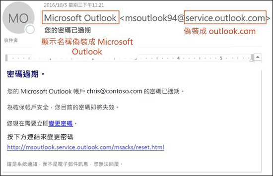
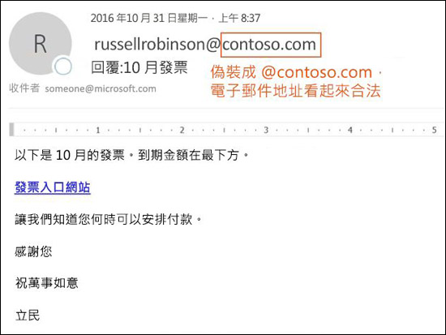
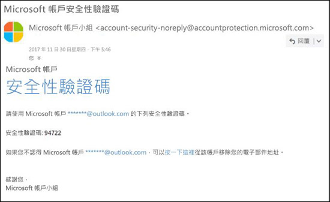

# EOP 中的反詐騙保護Anti-spoofing protection in EOP

[!INCLUDE [Microsoft 365 Defender rebranding](../includes/microsoft-defender-for-office.md)]

在擁有 Exchange Online 信箱的 Microsoft 365 組織中或是沒有 Exchange Online 信箱的獨立 Exchange Online Protection (EOP) 組織中，EOP 所包含的功能可協助保護貴組織抵禦詐騙 (偽造) 寄件者。In Microsoft 365 organizations with mailboxes in Exchange Online or standalone Exchange Online Protection (EOP) organizations without Exchange Online mailboxes, EOP includes features to help protect your organization from spoofed (forged) senders.

為保護使用者，Microsoft 嚴正看待網路釣魚攻擊。When it comes to protecting its users, Microsoft takes the threat of phishing seriously. 詐騙是攻擊者所使用的常見技巧。Spoofing is a common technique that's used by attackers. **詐騙訊息是來自實際來源以外的某人或某個位置**。**Spoofed messages appear to originate from someone or somewhere other than the actual source**. 這是設計來取得使用者認證的網路釣魚攻擊的慣用伎倆。This technique is often used in phishing campaigns that are designed to obtain user credentials. EOP 中的反詐騙技術專門檢查郵件內文中的 [寄件者] 標頭(用於顯示電子郵件用戶端中的郵件寄件者)。The anti-spoofing technology in EOP specifically examines forgery of the From header in the message body (used to display the message sender in email clients). 當 EOP 高度認為 [寄件者] 標頭為偽造時，會將該郵件視為詐騙。When EOP has high confidence that the From header is forged, the message is identified as spoofed.

EOP 中提供下列反詐騙技術：The following anti-spoofing technologies are available in EOP:

- **詐騙情報**：檢閱來自內部和外部網域中寄件者的詐騙郵件，並允許或封鎖那些寄件者。**Spoof intelligence**: Review spoofed messages from senders in internal and external domains, and allow or block those senders. 如需詳細資訊，請參閱[在 Microsoft 365 中設定詐騙情報](learn-about-spoof-intelligence.md)。For more information, see [Configure spoof intelligence in Microsoft 365](learn-about-spoof-intelligence.md).

- **防網路釣魚原則**：在 EOP 中，防網路釣魚原則可讓您開啟或關閉詐騙情報、開啟或關閉 Outlook 中未經驗證的寄件者識別碼，並針對已封鎖詐騙寄件者指定動作 (移至 [垃圾郵件] 資料夾或隔離)。**Anti-phishing policies**: In EOP, anti-phishing policies allow you to turn spoof intelligence on or off, turn unauthenticated sender identification in Outlook on or off, and specify the action for blocked spoofed senders (move to the Junk Email folder or quarantine). 適用於 Office 365 的 Microsoft Defender 中提供的進階防網路釣魚原則，也包含防模擬設定 (受保護的寄件者和網域)、信箱智慧設定，以及可調整的進階網路釣魚臨界值。Advanced anti-phishing policies that are available in Microsoft Defender for Office 365 also contain anti-impersonation settings (protected senders and domains), mailbox intelligence settings, and adjustable advanced phishing thresholds. 如需詳細資訊，請參閱 [Microsoft 365 中的防網路釣魚原則](set-up-anti-phishing-policies.md)。For more information, see [Anti-phishing policies in Microsoft 365](set-up-anti-phishing-policies.md).

- **電子郵件驗證**：任何反詐騙工作的整合部分就是在 DNS 中使用 SPF、DKIM 和 DMARC 記錄的電子郵件驗證 (Authentication) (也稱為電子郵件驗證 (Validation))。**Email authentication**: An integral part of any anti-spoofing effort is the use of email authentication (also known as email validation) by SPF, DKIM, and DMARC records in DNS. 您可以為網域設定這些記錄，這樣目的地電子郵件系統就能檢查您網域中寄件者所聲稱郵件的有效性。You can configure these records for your domains so destination email systems can check the validity of messages that claim to be from senders in your domains. 針對內送郵件，Microsoft 365 需要寄件者網域的電子郵件驗證。For inbound messages, Microsoft 365 requires email authentication for sender domains. 如需詳細資訊，請參閱 [Microsoft 365 中的電子郵件驗證](email-validation-and-authentication.md)。For more information, see [Email authentication in Microsoft 365](email-validation-and-authentication.md).

從 2018 年 10 月開始，EOP 中提供反詐騙防護功能。As of October 2018, anti-spoofing protection is available in EOP.

EOP 會分析並封鎖使用標準電子郵件驗證方法與寄件者信譽技術組合無法驗證的郵件。EOP analyzes and blocks messages that can't be authenticated by the combination of standard email authentication methods and sender reputation techniques.

## 網路釣魚攻擊中的詐騙方式How spoofing is used in phishing attacks

詐騙郵件對使用者有下列負面影響：Spoofing messages have the following negative implications for users:

- **詐騙郵件會欺騙使用者**：詐騙郵件會誘騙收件者按下連結並給予其憑證，下載惡意程式碼或回覆具有敏感內容的郵件 (稱為商務電子郵件入侵或 BEC)。**Spoofed messages deceive users**: A spoofed message might trick the recipient into clicking a link and giving up their credentials, downloading malware, or replying to a message with sensitive content (known as a business email compromise or BEC).

  以下郵件是使用詐騙寄件者 msoutlook94@service.outlook.com 的網路釣魚範例：The following message is an example of phishing that uses the spoofed sender msoutlook94@service.outlook.com:

  

  這封郵件並非來自 service.outlook.com，而是攻擊者偽造 [寄件者] 標頭欄位，使其看起來像是來自該處。This message didn't come from service.outlook.com, but the attacker spoofed the **From** header field to make it look like it did. 這是誘騙收件者按下 **變更密碼** 連結並給予其憑證的嘗試。This was an attempt to trick the recipient into clicking the **change your password** link and giving up their credentials.

  以下郵件是使用詐騙電子郵件網域 contoso.com 的 BEC 範例：The following message is an example of BEC that uses the spoofed email domain contoso.com:

  

  郵件看起來合法，但寄件者卻是偽造的。The message looks legitimate, but the sender is spoofed.

- **使用者會對真實郵件與假冒郵件產生混淆**：即使是已經知道網路釣魚的使用者也可能難以看出真實郵件與詐騙郵件之間的差異。**Users confuse real messages for fake ones**: Even users who know about phishing might have difficulty seeing the differences between real messages and spoofed messages.

  以下郵件是來自 Microsoft 安全性帳戶真實密碼重設郵件的範例：The following message is an example of a real password reset message from the Microsoft Security account:

  

  這封郵件確實是來自 Microsoft，但使用者認為是可疑的。The message really did come from Microsoft, but users have been conditioned to be suspicious. 因為分辨真實密碼重設郵件與假冒郵件有其難度，使用者會略過這些郵件、將它們回報為垃圾郵件或在不應該的情況下，將這些郵件當作網路釣魚回報給 Microsoft。Because it's difficult to the difference between a real password reset message and a fake one, users might ignore the message, report it as spam, or unnecessarily report the message to Microsoft as phishing.

## 不同類型的詐騙Different types of spoofing

Microsoft 將詐騙郵件區分為兩種類型：Microsoft differentiates between two different types of spoofed messages:

- **組織內部詐騙**：也稱為 _自我_ 詐騙。**Intra-org spoofing**: Also known as _self-to-self_ spoofing. 例如：For example:

  - 寄件者和收件者位於同一個網域：The sender and recipient are in the same domain:
    > 寄件者：chris@contoso.comFrom: chris@contoso.com   收件者：michelle@contoso.comTo: michelle@contoso.com

  - 寄件者和收件者位於同一個網域中的子網域：The sender and the recipient are in subdomains of the same domain:
    > 寄件者：laura@marketing.fabrikam.comFrom: laura@marketing.fabrikam.com   收件者：julia@engineering.fabrikam.comTo: julia@engineering.fabrikam.com

  - 寄件者和收件者位於隸屬相同組織的不同網域中 (也就是兩個網域都設定為相同組織中[公認的網域](https://docs.microsoft.com/exchange/mail-flow-best-practices/manage-accepted-domains/manage-accepted-domains) (部分機器翻譯))：The sender and recipient are in different domains that belong to the same organization (that is, both domains are configured as [accepted domains](https://docs.microsoft.com/exchange/mail-flow-best-practices/manage-accepted-domains/manage-accepted-domains) in the same organization):
    > 寄件者: sender @ microsoft.comFrom: sender @ microsoft.com   收件者: recipient @ bing.comTo: recipient @ bing.com

    電子郵件地址中會使用空格，以避免垃圾郵件機器人收集。Spaces are used in the email addresses to prevent spambot harvesting.

  因為組織內部詐騙包含下列標頭值，因此郵件不會通過[複合驗證](email-validation-and-authentication.md#composite-authentication)：Messages that fail [composite authentication](email-validation-and-authentication.md#composite-authentication) due to intra-org spoofing contain the following header values:

  `Authentication-Results: ... compauth=fail reason=6xx`

  `X-Forefront-Antispam-Report: ...CAT:SPOOF;...SFTY:9.11`

  - `reason=6xx` 表示組織內部詐騙。`reason=6xx` indicates intra-org spoofing.

  - SFTY 是郵件的安全層級。SFTY is the safety level of the message. 9 表示網路釣魚，11 表示組織內部詐騙。9 indicates phishing, .11 indicates intra-org spoofing.

- **跨網域詐騙**：寄件者和收件者網域並不相同，且彼此之間沒有關係 (也稱為外部網域)。**Cross-domain spoofing**: The sender and recipient domains are different, and have no relationship to each other (also known as external domains). 例如：For example:
    > 寄件者：chris@contoso.comFrom: chris@contoso.com   收件者：michelle@tailspintoys.comTo: michelle@tailspintoys.com

  因為跨網域詐騙包含下列標頭值，因此郵件不會通過[複合驗證](email-validation-and-authentication.md#composite-authentication)：Messages that fail [composite authentication](email-validation-and-authentication.md#composite-authentication) due to cross-domain spoofing contain the following headers values:

  `Authentication-Results: ... compauth=fail reason=000/001`

  `X-Forefront-Antispam-Report: ...CAT:SPOOF;...SFTY:9.22`

  - `reason=000` 表示郵件未通過明確電子郵件驗證。`reason=000` indicates the message failed explicit email authentication. `reason=001` 值表示郵件未通過隱含電子郵件驗證。`reason=001` indicates the message failed implicit email authentication.

  - SFTY 是郵件的安全層級。SFTY is the safety level of the message. 9 表示網路釣魚，22 表示跨網域詐騙。9 indicates phishing, .22 indicates cross-domain spoofing.

如需詐騙相關類別和複合驗證 (compauth) 值的詳細資訊，請參閱 [Microsoft 365 的反垃圾郵件標頭](anti-spam-message-headers.md)。For more information about the Category and composite authentication (compauth) values that are related to spoofing, see [Anti-spam message headers in Microsoft 365](anti-spam-message-headers.md).

如需 DMARC 的詳細資訊，請參閱[在 Microsoft 365 中使用 DMARC 來驗證電子郵件](use-dmarc-to-validate-email.md)。For more information about DMARC, see [Use DMARC to validate email in Microsoft 365](use-dmarc-to-validate-email.md).

## 關於有多少郵件被標示為詐騙郵件的報告Reports of how many messages were marked as spoofed

EOP 組織可以在 [安全性與合規性中心] 的 [報告] 儀表板中使用 **詐騙偵測** 報告。EOP organizations can use the **Spoof detections** report in the Reports dashboard in the Security & Compliance Center. 如需詳細資訊，請參閱[詐騙偵測報告](view-email-security-reports.md#spoof-detections-report)。For more information, see [Spoof Detections report](view-email-security-reports.md#spoof-detections-report).

適用於 Office 365 的 Microsoft Defender 組織可以使用 [安全性與合規性中心] 中的 [威脅總管] 來檢視網路釣魚嘗試的相關資訊。Microsoft Defender for Office 365 organization can use Threat Explorer in the Security & Compliance Center to view information about phishing attempts. 如需詳細資訊，請參閱 [Microsoft 365 威脅調查及回應](office-365-ti.md)。For more information, see [Microsoft 365 threat investigation and response](office-365-ti.md).

## 反詐騙保護的問題Problems with anti-spoofing protection

郵寄清單 (也稱為討論清單) 由於其轉寄及修改郵件的方式，已知有反詐騙問題。Mailing lists (also known as discussion lists) are known to have problems with anti-spoofing due to the way they forward and modify messages.

例如，Gabriela Laureano (glaureano@contoso.com) 對賞鳥有興趣，因此加入 birdwatchers@fabrikam.com 郵寄清單，並且將下列郵件傳送到清單：For example, Gabriela Laureano (glaureano@contoso.com) is interested in bird watching, joins the mailing list birdwatchers@fabrikam.com, and sends the following message to the list:

> **寄件者：**"Gabriela Laureano" \<glaureano@contoso.com\>**From:** "Gabriela Laureano" \<glaureano@contoso.com\>   **收件者：** 賞鳥的討論清單\<birdwatchers@fabrikam.com\>**To:** Birdwatcher's Discussion List \<birdwatchers@fabrikam.com\>   **主旨：** 本週雷尼爾山頂**Subject:** Great viewing of blue jays at the top of Mt. 觀賞藍鳥的絕佳景點Rainier this week 
 有人這週想要上雷尼爾山Anyone want to check out the viewing this week from Mt. 賞景嗎？Rainier?

郵寄清單伺服器會接收郵件，修改其內容，並且對清單的成員重新播放。The mailing list server receives the message, modifies its content, and replays it to the members of list. 重新播放的郵件具有相同的 [寄件者] 地址 (glaureano@contoso.com)，但是有標記新增至主旨行，頁尾新增至郵件底端。The replayed message has the same From address (glaureano@contoso.com), but a tag is added to the subject line, and a footer is added to the bottom of the message. 這種類型的修改常見於郵寄清單中，且可能會導致詐騙的誤判。This type of modification is common in mailing lists, and may result in false positives for spoofing.

> **寄件者：**"Gabriela Laureano" \<glaureano@contoso.com\>**From:** "Gabriela Laureano" \<glaureano@contoso.com\>   **收件者：** 賞鳥的討論清單\<birdwatchers@fabrikam.com\>**To:** Birdwatcher's Discussion List \<birdwatchers@fabrikam.com\>   **主旨：**[賞鳥人士] 本週雷尼爾山頂**Subject:** [BIRDWATCHERS] Great viewing of blue jays at the top of Mt. 觀賞藍鳥的絕佳景點Rainier this week 
 有人這週想要上雷尼爾山Anyone want to check out the viewing this week from Mt. 賞景嗎？Rainier? 
 此郵件已傳送給「賞鳥人士」討論清單。This message was sent to the Birdwatchers Discussion List. 您隨時可以取消訂閱。You can unsubscribe at any time.

為了協助郵寄清單郵件通過反詐騙檢查，請根據您是否控制郵寄清單來執行下列步驟：To help mailing list messages pass anti-spoofing checks, do following steps based on whether you control the mailing list:

- 貴組織擁有郵寄清單：Your organization owns the mailing list:

  - 請查看 DMARC.org 上的常見問題集：[我操作郵寄清單，並想要與 DMARC 互相操作，該怎麼做？](https://dmarc.org/wiki/FAQ#I_operate_a_mailing_list_and_I_want_to_interoperate_with_DMARC.2C_what_should_I_do.3F)。Check the FAQ at DMARC.org: [I operate a mailing list and I want to interoperate with DMARC, what should I do?](https://dmarc.org/wiki/FAQ#I_operate_a_mailing_list_and_I_want_to_interoperate_with_DMARC.2C_what_should_I_do.3F).

  - 閱讀此部落格文章的指示：[郵寄清單操作人員與 DMARC 互相操作以避免失敗的提示](https://blogs.msdn.microsoft.com/tzink/2017/03/22/a-tip-for-mailing-list-operators-to-interoperate-with-dmarc-to-avoid-failures/)。Read the instructions at this blog post: [A tip for mailing list operators to interoperate with DMARC to avoid failures](https://blogs.msdn.microsoft.com/tzink/2017/03/22/a-tip-for-mailing-list-operators-to-interoperate-with-dmarc-to-avoid-failures/).

  - 若考慮在郵寄清單伺服器上安裝更新以支援 ARC，請參閱 <http://arc-spec.org>。Consider installing updates on your mailing list server to support ARC, see <http://arc-spec.org>.

- 貴組織未擁有郵寄清單：Your organization doesn't own the mailing list:

  - 要求郵寄清單的維護人員為轉送郵寄清單的網域設定電子郵件驗證。Ask the maintainer of the mailing list to configure email authentication for the domain that the mailing list is relaying from.

    當有夠多寄件者回覆網域擁有者，他們應該設定電子郵件驗證記錄時，就可促使他們採取動作。When enough senders reply back to domain owners that they should set up email authentication records, it spurs them into taking action. 雖然 Microsoft 也會與網域擁有者合作發佈所需的記錄，但是當個別使用者提出要求時，助益更大。While Microsoft also works with domain owners to publish the required records, it helps even more when individual users request it.

  - 在電子郵件用戶端中建立收件匣規則，將郵件移動至收件匣。Create inbox rules in your email client to move messages to the Inbox. 您也可以要求系統管理員設定覆寫，如[使用詐騙情報來設定未經驗證電子郵件的允許寄件者](email-validation-and-authentication.md#use-spoof-intelligence-to-configure-permitted-senders-of-unauthenticated-email)中所討論。You can also ask your admins to configure overrides as discussed in the [Use spoof intelligence to configure permitted senders of unauthenticated email](email-validation-and-authentication.md#use-spoof-intelligence-to-configure-permitted-senders-of-unauthenticated-email).

  - 向 Microsoft 365 建立支援票證，以建立郵寄清單的覆寫，將其視為合法。Create a support ticket with Microsoft 365 to create an override for the mailing list to treat it as legitimate. 如需詳細資訊，請參閱[連絡商務產品的支援服務 - 系統管理說明](../../admin/contact-support-for-business-products.md)。For more information, see [Contact support for business products - Admin Help](../../admin/contact-support-for-business-products.md).

如果其他所有項目都失敗，您可以將郵件當作誤判向 Microsoft 報告。If all else fails, you can report the message as a false positive to Microsoft. 如需詳細資訊，請參閱[回報訊息和檔案至 Microsoft](report-junk-email-messages-to-microsoft.md)。For more information, see [Report messages and files to Microsoft](report-junk-email-messages-to-microsoft.md).

您也可以連絡您的系統管理員，請他們向 Microsoft 開立支援票證。You may also contact your admin who can raise it as a support ticket with Microsoft. Microsoft 工程小組會研究該郵件為何會被標示為詐騙郵件。The Microsoft engineering team will investigate why the message was marked as a spoof.

## 反詐騙保護的考量Considerations for anti-spoofing protection

如果您是目前傳送郵件至 Microsoft 365 的系統管理員，您必須確認您的電子郵件已正確驗證。If you're an admin who currently sends messages to Microsoft 365, you need to ensure that your email is properly authenticated. 否則，可能會標示為垃圾郵件或網路釣魚。Otherwise, it might be marked as spam or phishing. 如需詳細資訊，請參閱[傳送未經驗證電子郵件的合法寄件者解決方案](email-validation-and-authentication.md#solutions-for-legitimate-senders-who-are-sending-unauthenticated-email)。For more information, see [Solutions for legitimate senders who are sending unauthenticated email](email-validation-and-authentication.md#solutions-for-legitimate-senders-who-are-sending-unauthenticated-email).

個別使用者 (或系統管理員) 的安全寄件者清單中的寄件者，將會略過篩選堆疊部分，包括詐騙防護。Senders in an individual user's (or admin's) Safe Senders list will bypass parts of the filtering stack, including spoof protection. 如需詳細資訊，請參閱 [Outlook 安全寄件者](create-safe-sender-lists-in-office-365.md#use-outlook-safe-senders)。For more information, see [Outlook Safe Senders](create-safe-sender-lists-in-office-365.md#use-outlook-safe-senders).

系統管理員應使用允許的寄件者清單或允許的網域清單來加以避免 (若可能)。Admins should avoid (when possible) using allowed sender lists or allowed domain lists. 這些寄件者會略過所有垃圾郵件、詐騙和網路釣魚防護，以及寄件者驗證 (SPF、DKIM、DMARC)。These senders bypass all spam, spoofing, and phishing protection, and also sender authentication (SPF, DKIM, DMARC). 如需詳細資訊，請參閱[使用允許的寄件者清單或允許的網域清單](create-safe-sender-lists-in-office-365.md#use-allowed-sender-lists-or-allowed-domain-lists)。For more information, see [Use allowed sender lists or allowed domain lists](create-safe-sender-lists-in-office-365.md#use-allowed-sender-lists-or-allowed-domain-lists).
