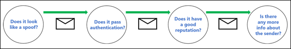

# EOP 中的反詐騙保護

在擁有 Exchange Online 信箱的 Microsoft 365 組織中或是沒有 Exchange Online 信箱的獨立 Exchange Online Protection (EOP) 組織中，EOP 所包含的功能可協助保護貴組織抵禦詐騙 (偽造) 寄件者。

為保護使用者，Microsoft 嚴正看待網路釣魚攻擊。 詐騙是攻擊者所使用的常見技巧。 **詐騙訊息是來自實際來源以外的某人或某個位置**。 這是設計來取得使用者認證的網路釣魚攻擊的慣用伎倆。 EOP 中的反詐騙技術專門檢查郵件內文中的 [寄件者] 標頭(用於顯示電子郵件用戶端中的郵件寄件者)。 當 EOP 高度認為 [寄件者] 標頭為偽造時，會將該郵件視為詐騙。

EOP 中提供下列反詐騙技術：

- **詐騙情報**：檢閱來自內部和外部網域中寄件者的詐騙郵件，並允許或封鎖那些寄件者。 如需詳細資訊，請參閱[在 Microsoft 365 中設定詐騙情報](learn-about-spoof-intelligence.md)。

- **防網路釣魚原則**：在 EOP 中，防網路釣魚原則可讓您開啟或關閉詐騙情報、開啟或關閉 Outlook 中未經驗證的寄件者識別碼，並針對已封鎖詐騙寄件者指定動作 (移至 [垃圾郵件] 資料夾或隔離)。 Office 365 進階威脅防護 (Office 365 ATP) 中提供的進階防網路釣魚原則，也包含防冒充設定 (受保護的寄件者和網域)、信箱情報設定，以及可調整的進階網路釣魚臨界值。 如需詳細資訊，請參閱 [Microsoft 365 中的防網路釣魚原則](set-up-anti-phishing-policies.md)。

- **電子郵件驗證**：任何反詐騙工作的整合部分就是在 DNS 中使用 SPF、DKIM 和 DMARC 記錄的電子郵件驗證 (Authentication) (也稱為電子郵件驗證 (Validation))。 您可以為網域設定這些記錄，這樣目的地電子郵件系統就能檢查您網域中寄件者所聲稱郵件的有效性。 針對內送郵件，Microsoft 365 需要寄件者網域的電子郵件驗證。 如需詳細資訊，請參閱 [Microsoft 365 中的電子郵件驗證](email-validation-and-authentication.md)。

從 2018 年 10 月開始，EOP 中提供反詐騙防護功能。 在此之前，只有具有 Office 365 ATP 的組織才提供反詐騙防護功能。

EOP 會分析並封鎖使用標準電子郵件驗證方法與寄件者信譽技術組合無法驗證的郵件。

## 網路釣魚攻擊中的詐騙方式

詐騙郵件對使用者有下列負面影響：

- **詐騙郵件會欺騙使用者**：詐騙郵件會誘騙收件者按下連結並給予其憑證，下載惡意程式碼或回覆具有敏感內容的郵件 (稱為商務電子郵件入侵或 BEC)。

  以下郵件是使用詐騙寄件者 msoutlook94@service.outlook.com 的網路釣魚範例：

  

  這封郵件並非來自 service.outlook.com，而是攻擊者偽造 [寄件者]**** 標頭欄位，使其看起來像是來自該處。 這是誘騙收件者按下**變更密碼**連結並給予其憑證的嘗試。

  以下郵件是使用詐騙電子郵件網域 contoso.com 的 BEC 範例：

  

  郵件看起來合法，但寄件者卻是偽造的。

- **使用者會對真實郵件與假冒郵件產生混淆**：即使是已經知道網路釣魚的使用者也可能難以看出真實郵件與詐騙郵件之間的差異。

  以下郵件是來自 Microsoft 安全性帳戶真實密碼重設郵件的範例：

  

  這封郵件確實是來自 Microsoft，但使用者認為是可疑的。 因為分辨真實密碼重設郵件與假冒郵件有其難度，使用者會略過這些郵件、將它們回報為垃圾郵件或在不應該的情況下，將這些郵件當作網路釣魚回報給 Microsoft。

## 不同類型的詐騙

Microsoft 將詐騙郵件區分為兩種類型：

- **組織內部詐騙**：也稱為_自我_詐騙。 例如：

  - 寄件者和收件者位於同一個網域：
    > 寄件者：chris@contoso.com   收件者：michelle@contoso.com

  - 寄件者和收件者位於同一個網域中的子網域：
    > 寄件者：laura@marketing.fabrikam.com   收件者：julia@engineering.fabrikam.com

  - 寄件者和收件者位於隸屬相同組織的不同網域中 (也就是兩個網域都設定為相同組織中[公認的網域](https://docs.microsoft.com/exchange/mail-flow-best-practices/manage-accepted-domains/manage-accepted-domains) (部分機器翻譯))：
    > 寄件者: sender @ microsoft.com   收件者: recipient @ bing.com

    電子郵件地址中會使用空格，以避免垃圾郵件機器人收集。

  因為組織內部詐騙包含下列標頭值，因此郵件不會通過[複合驗證](email-validation-and-authentication.md#composite-authentication)：

  `Authentication-Results: ... compauth=fail reason=6xx`

  `X-Forefront-Antispam-Report: ...CAT:SPOOF;...SFTY:9.11`

  - `reason=6xx` 表示組織內部詐騙。

  - SFTY 是郵件的安全層級。 9 表示網路釣魚，11 表示組織內部詐騙。

- **跨網域詐騙**：寄件者和收件者網域並不相同，且彼此之間沒有關係 (也稱為外部網域)。 例如：
    > 寄件者：chris@contoso.com   收件者：michelle@tailspintoys.com

  因為跨網域詐騙包含下列標頭值，因此郵件不會通過[複合驗證](email-validation-and-authentication.md#composite-authentication)：

  `Authentication-Results: ... compauth=fail reason=000/001`

  `X-Forefront-Antispam-Report: ...CAT:SPOOF;...SFTY:9.22`

  - `reason=000` 表示郵件未通過明確電子郵件驗證。 `reason=001` 值表示郵件未通過隱含電子郵件驗證。

  - SFTY 是郵件的安全層級。 9 表示網路釣魚，22 表示跨網域詐騙。

如需詐騙相關類別和複合驗證 (compauth) 值的詳細資訊，請參閱 [Microsoft 365 的反垃圾郵件標頭](anti-spam-message-headers.md)。

如需 DMARC 的詳細資訊，請參閱[在 Microsoft 365 中使用 DMARC 來驗證電子郵件](use-dmarc-to-validate-email.md)。

## 關於有多少郵件被標示為詐騙郵件的報告

EOP 組織可以在 [安全性與合規性中心] 的 [報告] 儀表板中使用**詐騙偵測**報告。 如需詳細資訊，請參閱[詐騙偵測報告](view-email-security-reports.md#spoof-detections-report)。

Office 365 ATP 組織可以使用 [安全性與合規性中心] 中的 [威脅總管] 來檢視網路釣魚嘗試的相關資訊。 如需詳細資訊，請參閱 [Microsoft 365 威脅調查及回應](office-365-ti.md)。

## 反詐騙保護的問題

郵寄清單 (也稱為討論清單) 由於其轉寄及修改郵件的方式，已知有反詐騙問題。

例如，Gabriela Laureano (glaureano@contoso.com) 對賞鳥有興趣，因此加入 birdwatchers@fabrikam.com 郵寄清單，並且將下列郵件傳送到清單：

> **寄件者：**"Gabriela Laureano" \<glaureano@contoso.com\>   **收件者：** 賞鳥的討論清單\<birdwatchers@fabrikam.com\>   **主旨：** 本週雷尼爾山頂 觀賞藍鳥的絕佳景點   有人這週想要上雷尼爾山 賞景嗎？

郵寄清單伺服器會接收郵件，修改其內容，並且對清單的成員重新播放。 重新播放的郵件具有相同的 [寄件者] 地址 (glaureano@contoso.com)，但是有標記新增至主旨行，頁尾新增至郵件底端。 這種類型的修改常見於郵寄清單中，且可能會導致詐騙的誤判。

> **寄件者：**"Gabriela Laureano" \<glaureano@contoso.com\>   **收件者：** 賞鳥的討論清單\<birdwatchers@fabrikam.com\>   **主旨：**[賞鳥人士] 本週雷尼爾山頂 觀賞藍鳥的絕佳景點    有人這週想要上雷尼爾山 賞景嗎？    此郵件已傳送給「賞鳥人士」討論清單。 您隨時可以取消訂閱。

為了協助郵寄清單郵件通過反詐騙檢查，請根據您是否控制郵寄清單來執行下列步驟：

- 貴組織擁有郵寄清單：

  - 請查看 DMARC.org 上的常見問題集：[我操作郵寄清單，並想要與 DMARC 互相操作，該怎麼做？](https://dmarc.org/wiki/FAQ#I_operate_a_mailing_list_and_I_want_to_interoperate_with_DMARC.2C_what_should_I_do.3F)。

  - 閱讀此部落格文章的指示：[郵寄清單操作人員與 DMARC 互相操作以避免失敗的提示](https://blogs.msdn.microsoft.com/tzink/2017/03/22/a-tip-for-mailing-list-operators-to-interoperate-with-dmarc-to-avoid-failures/)。

  - 若考慮在郵寄清單伺服器上安裝更新以支援 ARC，請參閱 [https://arc-spec.org](https://arc-spec.org/)

- 貴組織未擁有郵寄清單：

  - 要求郵寄清單的維護人員為轉送郵寄清單的網域設定電子郵件驗證。

    當有夠多寄件者回覆網域擁有者，他們應該設定電子郵件驗證記錄時，就可促使他們採取動作。 雖然 Microsoft 也會與網域擁有者合作發佈所需的記錄，但是當個別使用者提出要求時，助益更大。

  - 在電子郵件用戶端中建立收件匣規則，將郵件移動至收件匣。 您也可以要求系統管理員設定覆寫，如[使用詐騙情報來設定未經驗證電子郵件的允許寄件者](email-validation-and-authentication.md#use-spoof-intelligence-to-configure-permitted-senders-of-unauthenticated-email)中所討論。

  - 向 Microsoft 365 建立支援票證，以建立郵寄清單的覆寫，將其視為合法。 如需詳細資訊，請參閱[連絡商務產品的支援服務 - 系統管理說明](../../admin/contact-support-for-business-products.md)。

如果其他所有項目都失敗，您可以將郵件當作誤判向 Microsoft 報告。 如需詳細資訊，請參閱[回報訊息和檔案至 Microsoft](report-junk-email-messages-to-microsoft.md)。

您也可以連絡您的系統管理員，請他們向 Microsoft 開立支援票證。 Microsoft 工程小組會研究該郵件為何會被標示為詐騙郵件。

## 反詐騙保護的考量

如果您是目前傳送郵件至 Microsoft 365 的系統管理員，您必須確認您的電子郵件已正確驗證。 否則，可能會標示為垃圾郵件或網路釣魚。 如需詳細資訊，請參閱[傳送未經驗證電子郵件的合法寄件者解決方案](email-validation-and-authentication.md#solutions-for-legitimate-senders-who-are-sending-unauthenticated-email)。
