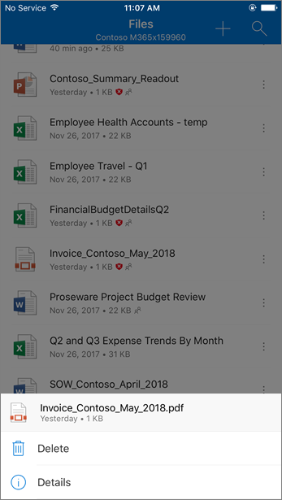
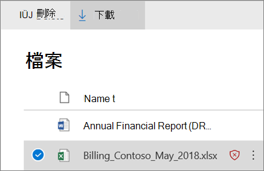

# 適用於 SharePoint、OneDrive 及 Microsoft Teams 的 ATP

## 概述適用於 SharePoint、OneDrive 及 Microsoft Teams 的 Office 365 ATP

人們經常使用 SharePoint、OneDrive 和 Microsoft Teams 來共用檔案及共同作業。 有了 [Office 365 進階威脅防護](office-365-atp.md) (ATP)，您的組織可以更安全地進行共同作業。 ATP 可協助偵測及封鎖小組網站和文件庫中被視為惡意的檔案。

## 運作方式

當 SharePoint Online、商務用 OneDrive 和 Microsoft Teams 中的檔案被認定為「惡意」時，ATP 會直接與檔案存放區整合來鎖定該檔案。 下列影像顯示文件庫中偵測到的惡意檔案範例。

雖然封鎖的檔案仍會列在文件庫和網頁、行動裝置或桌面應用程式中，但您無法開啟、複製、移動或共用封鎖的檔案。 不過，您可以刪除封鎖的檔案。 以下範例是使用者行動裝置上呈現的樣子：

根據 Microsoft 365 的設定方式，使用者可能會或可能無法下載封鎖的檔案。 以下是在使用者行動裝置上下載封鎖檔案的畫面：

若要深入了解，請參閱[為 SharePoint、OneDrive 和 Microsoft Teams 開啟 Office 365 ATP](turn-on-atp-for-spo-odb-and-teams.md)。

## 請記住下列重點

- ATP 不會掃描 SharePoint Online、商務用 OneDrive 或 Microsoft Teams 中的每個單一檔案。 原先的設計就是如此。 檔案會以非同步的方式進行掃描，其程序會使用共用及訪客活動事件，以及智慧試探法和威脅信號來識別惡意檔案。

- 請確認您的 SharePoint 網站已設定為使用[新式體驗](https://docs.microsoft.com/sharepoint/guide-to-sharepoint-modern-experience)。 當檔案被識別為惡意並且遭到封鎖時，人們可以在新式體驗中看到此動作已發生，但在傳統檢視中看不到。 使用新式體驗或傳統檢視都可套用 ATP 保護；不過，指出檔案遭到封鎖的視覺指示器只會在新式體驗中提供。

- 在 SharePoint Online、商務用 OneDrive 或 Microsoft Teams 中識別為惡意的檔案會顯示在 [Office 365 進階威脅防護的報告](view-reports-for-atp.md)和 [Explorer (與即時偵測)](threat-explorer.md) 中。

- ATP 是組織整體威脅防護戰略的一部分，其中包括反垃圾郵件和反惡意程式碼防護，以及安全連結和安全附件。 若要深入了解，請參閱[防範 Office 365 中的威脅](protect-against-threats.md)。

- SharePoint Online 系統管理員可以決定是否要讓使用者下載偵測為惡意的檔案。 方法是使用 DisallowInfectedFileDownload 參數執行 Set-SPOTenant PowerShell Cmdlet (請參閱[開啟適用於 SharePoint、OneDrive 和 Microsoft Teams 的 Office 365 ATP](turn-on-atp-for-spo-odb-and-teams.md))。

## ATP 在 SharePoint Online、商務用 OneDrive 和 Microsoft Teams 中的隔離功能

 自 2018 年的 5 月底起，安全性 &amp; 合規性中心的[隔離](quarantine-email-messages.md)功能已延伸至適用於 SharePoint Online、商務用 OneDrive 和 Microsoft Teams 的 ATP。

當 SharePoint Online、商務用 OneDrive 或 Microsoft Teams 中的檔案被識別為惡意時，ATP 除了會防止檔案開啟或共用之外，該檔案也會包含在隔離項目清單中。 （在&amp;安全性與合規性中心，移至「**威脅管理** \> 」**查看** \> **隔離**及篩選檔案。） **Files**

如果您屬於組織的 Microsoft 365 商務安全小組，而且在[安全性&amp;與合規性中心內指派](permissions-in-the-security-and-compliance-center.md)必要的許可權，您可以從隔離區下載、發行、報告和刪除因 ATP 所偵測為惡意的檔案。

- 針對 SharePoint、OneDrive 或 Microsoft Teams，**釋放和報告**檔案會移除各別小組網站或文件庫中檔案上的 ATP 封鎖。 然後使用者就能開啟、共用和下載該檔案。 此外，當您選取 [將報告傳送到 Microsoft]**** 選項時，該檔案就會以誤判的形式來報告給 Microsoft。

- **刪除檔案**會將檔案從隔離區中移除；不過，檔案仍無法開啟或共用。 您也必須在其各自的文件庫或小組網站中刪除檔案 (SharePoint Online、商務用 OneDrive 或 Microsoft Teams)。

- **下載檔案**可讓您下載檔案，並分析是否有任何誤判。

## 後續步驟

 - [開啟適用於 SharePoint、OneDrive 及 Microsoft Teams 的 Office 365 ATP](turn-on-atp-for-spo-odb-and-teams.md)

 - [檢視在 SharePoint、OneDrive 或 Microsoft Teams 中偵測到的惡意檔案資訊](malicious-files-detected-in-spo-odb-or-teams.md)

