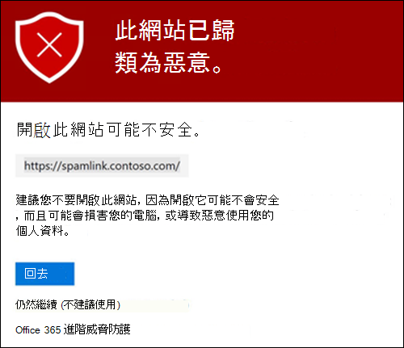
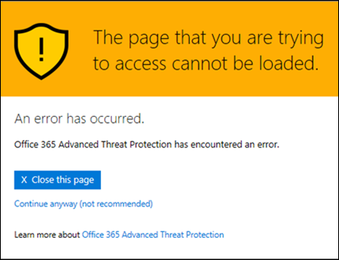

# Office 365 ATP 安全連結

[!INCLUDE [Microsoft 365 Defender rebranding](../includes/microsoft-defender-for-office.md)]

> [!IMPORTANT]
> 本文適用于具有 [Office 365 高級威脅防護 (ATP) ](office-365-atp.md)的商務客戶。 如果您使用的是 Outlook.com、Microsoft 365 系列或 Microsoft 365 個人版，且您在 Outlook 中尋找 Safelinks 的相關資訊，請參閱 [Advanced Outlook.com security](https://support.microsoft.com/office/882d2243-eab9-4545-a58a-b36fee4a46e2)。

安全連結是 [Office 365 高級威脅防護](office-365-atp.md) 中的一項功能，可提供郵件流程中的輸入電子郵件訊息的 URL 掃描和修正，以及電子郵件和其他位置中 URLs 和連結的時間驗證。 在 Exchange Online Protection (EOP) 中，除了內送電子郵件訊息中的一般 [反垃圾郵件和反惡意程式碼保護](anti-spam-and-anti-malware-protection.md) 之外，也會進行安全連結掃描。 安全連結掃描可協助保護您的組織免受網路釣魚和其他攻擊中所用的惡意連結。

在下列位置可取得安全連結保護：

- **電子郵件訊息**：安全連結保護電子郵件訊息中的連結是由安全連結原則所控制。 沒有預設的安全連結原則， **因此若要在電子郵件中取得安全連結的保護，您必須建立一或多個安全連結原則**。 如需相關指示，請參閱 [設定 ATP 中的安全連結原則](set-up-atp-safe-links-policies.md)。

  如需電子郵件安全連結保護的詳細資訊，請參閱本文稍後的 [ [電子郵件的安全連結設定](#safe-links-settings-for-email-messages) ] 區段。

- **Microsoft 團隊** (目前在點擊預覽) ：對小組交談、群組聊天或管道中的連結的安全連結保護也是由安全連結原則所控制。 沒有預設的安全連結原則， **因此若要在小組中取得安全連結的保護，您必須建立一或多個安全連結原則**。

  如需小組中安全連結保護的詳細資訊，請參閱本主題稍後的「 [Microsoft 團隊的安全連結設定](#safe-links-settings-for-microsoft-teams) 」一節。

- **Office 365 應用程式**： office 365 應用程式的安全連結保護可在支援的桌面、行動裝置和網路 ap 中取得。 您可以在安全連結原則**以外**的全域設定中，**設定**Office 365 應用程式的安全連結保護。 如需相關指示，請參閱 [在 Office 365 ATP 中設定安全連結設定的通用設定](configure-global-settings-for-safe-links.md)。

  不過，Office 365 應用程式的安全連結保護只 **適用** 于包含在使用中安全連結原則中的使用者。 如果使用者未包含在使用中的安全連結原則中，使用者就不會在支援的 Office 365 應用程式中取得安全連結保護。

  如需 Office 365 應用程式中安全連結保護的詳細資訊，請參閱本文稍後的 [office 365 應用程式的安全連結設定](#safe-links-settings-for-office-365-apps) 一節。

本文包含下列安全連結設定類型的詳細描述：

- **安全連結原則中的設定**：這些設定僅適用于包含在特定原則中的使用者，而且各原則的設定可能不同。 這些設定包括：

  - [電子郵件訊息的安全連結設定](#safe-links-settings-for-email-messages)
  - [Microsoft 小組的安全連結設定](#safe-links-settings-for-microsoft-teams)
  - [安全連結原則中的「不要重新寫入下列 URLs」清單](#do-not-rewrite-the-following-urls-lists-in-safe-links-policies)

- **全域安全連結設定**：這些設定會全域設定，而不是在安全連結原則中。 不過，這些設定僅適用于包含在使用中安全連結原則中的使用者。 這些設定包括：

  - [Office 365 應用程式的安全連結設定](#safe-links-settings-for-office-365-apps)
  - [安全連結的「封鎖下列 URLs」清單](#block-the-following-urls-list-for-safe-links)

下表說明 Microsoft 365 和 Office 365 組織中包含 ATP (的安全連結案例，也就是說，缺乏授權不是範例) 中的問題。

****

|案例|結果|
|---|---|
|Jean-francois 是行銷部門的成員。 在安全連結的通用設定中開啟 Office 365 應用程式的安全連結保護，以及適用于行銷部門成員的安全連結原則。 Jean-francois 會在電子郵件訊息中開啟 PowerPoint 簡報，然後按一下簡報中的 URL。|Jean-francois 受到安全連結的保護。    Jean-francois 包含在安全連結原則中，且已開啟 Office 365 應用程式的安全連結保護。    如需 Office 365 應用程式中安全連結保護需求的詳細資訊，請參閱本文稍後的「 [Office 365 應用程式的安全連結設定](#safe-links-settings-for-office-365-apps) 」一節。|
|Chris 的 Microsoft 365 E5 組織未設定安全連結原則。 Chris 會接收來自外部寄件者的電子郵件，該寄件者包含的 URL 指向他最後按一下的惡意網站。|Chris 未受到安全連結的保護。    管理員至少必須建立一個安全連結原則，以供任何人取得輸入電子郵件訊息中的安全連結保護。 在原則的條件中必須包含 Chris，才可取得安全連結保護。|
|在 Pat 的組織中，沒有系統管理員已建立任何安全連結原則，但已開啟 Office 365 應用程式的安全連結保護。 Pat 開啟 Word 檔，然後按一下檔案中的 URL。|Pat 未受到安全連結的保護。    雖然以全域方式開啟 Office 365 應用程式的安全連結保護，但 Pat 並未包含在任何使用中的安全連結原則中，因此無法套用保護。|
|在「企業版的組織」中，于 [ `https://tailspintoys.com` 安全連結的全域設定] 中的 [ **封鎖下列 URLs** ] 清單中設定。 包含「擁有先生」的安全連結原則已存在。 「電子郵件」會收到包含 URL 的電子郵件 `https://tailspintoys.com/aboutus/trythispage` 。 Lee 按下該 URL。|您可以自動封鎖此 URL。這取決於清單中的 URL 專案和使用的電子郵件用戶端。 如需詳細資訊，請參閱本主題稍後的「 [阻止下列 URLs 的安全連結的清單](#block-the-following-urls-list-for-safe-links) 」一節。|
|曉明和 Julia 這兩個 contoso.com 的工作。 很久之前，系統管理員設定了同時適用于曉明和 Julia 的安全連結原則。 曉明會將電子郵件傳送至 Julia，而不知道電子郵件中包含惡意 URL。|**如果**套用至她的安全連結原則設定為套用至內部收件者之間的郵件，則安全連結會保護 Julia。 如需詳細資訊，請參閱本主題稍後的「 [電子郵件的安全連結設定](#safe-links-settings-for-email-messages) 」一節。|

## 電子郵件訊息的安全連結設定

安全連結會掃描內送電子郵件中的已知惡意超連結。 掃描的 URLs 會使用 Microsoft standard URL 前置詞來重新寫入： `https://nam01.safelinks.protection.outlook.com` 。 在重新寫入連結之後，它會針對潛在的惡意內容進行分析。

安全連結重新寫入 URL 後，即使郵件是轉寄或回復的，該 URL 仍會保持重新寫入。 新增至轉寄或回復郵件的其他連結不會被重新寫入。

下列清單說明適用于電子郵件訊息的安全連結原則中的設定：

- **選取郵件中不明的潛在惡意 URLs 動作**：啟用或停用電子郵件中的安全連結掃描。 建議值為 **On**。 開啟此設定會產生下列動作。

  - 在 Windows (C2R) 的 Outlook 中啟用安全連結掃描。
  - URLs 會在郵件中按一下 [URLs] 中的 [安全連結保護]，以重新寫入。
  - 按一下時，會針對已知的惡意 URLs 清單及「 [封鎖下列 URLs」清單](#block-the-following-urls-list-for-safe-links)，檢查 URLs。
  - 不具備有效信譽的 URLs 會在背景中以非同步方式引爆。

- **對指向檔案的可疑連結和連結套用即時 URL 掃描**：可即時掃描連結，包含指向可下載內容的電子郵件訊息中的連結。 建議的值為 enabled。

  - **等候 URL 掃描完成之後，才會傳遞郵件**：

    - 已啟用：包含 URLs 的郵件會一直保留，直到完成掃描為止。 只有在 URLs 確認為安全後，才會傳遞郵件。 此為建議值。
    - Disabled：如果無法完成 URL 掃描，請傳送郵件。

- 對**組織內傳送的電子郵件套用安全連結**：啟用或停用安全連結掃描在相同 Exchange Online 組織內的內部寄件者和內部收件者之間傳送的郵件。 建議的值為 enabled。

- **請勿追蹤使用者點擊**：啟用或停用儲存安全連結按一下 [電子郵件訊息] 中的 [URLs 的資料]。 建議值為將此設定保留未選取狀態 (以追蹤使用者點擊) 。

  URL 按一下 [追蹤] 以取得內部寄件者和內部收件者之間所傳送的電子郵件中的連結目前不支援。

- **不允許使用者依序按一下原始 url**：允許或封鎖使用者按一下 [ [警告] 頁面](#warning-pages-from-safe-links) 至原始 url。 建議值已啟用。

- **請勿重新寫入下列 URLs**：保留 URLs。 保留不需要掃描之安全 URLs 的自訂清單。 每個安全連結原則的清單都是唯一的。 如需 [不要重新 **寫入下列 URLs** ] 清單的詳細資訊，請參閱本文稍後的「 [安全連結原則中的「不要重新寫入下列 URLs」清單](#do-not-rewrite-the-following-urls-lists-in-safe-links-policies) 」一節。

如需安全連結原則之標準和嚴格原則設定的建議值的詳細資訊，請參閱 [安全連結原則設定](recommended-settings-for-eop-and-office365-atp.md#safe-links-policy-settings)。

- **收件者篩選器**：您必須指定收件者條件和例外狀況，以決定要套用的原則。 您可以使用這些屬性做為條件和例外狀況：

  - **收件者是**
  - **收件者網域是**
  - **收件者是以下的成員**

  您只可以使用條件或例外狀況，但條件或例外狀況可以包含多個值。 相同條件或例外狀況的多個值使用 OR 邏輯 (例如，_\<recipient1\>_ 或 _\<recipient2\>_)。 不同的條件或例外狀況則使用 AND 邏輯 (例如，_\<recipient1\>_ 和 _\<member of group 1\>_)。

- **Priority**：如果您建立多個原則，您可以指定要套用的順序。 不論有幾個原則，都不會具有相同的優先順序，且在套用第一個原則之後，原則處理就會停止。

  如需更多有關優先的排序及如何評估和應用多項原則，請參照 [電子郵件保護的順序和優先順序](how-policies-and-protections-are-combined.md)。

### 安全連結在電子郵件訊息中的運作方式

在較高的層次，以下是在電子郵件訊息中 URLs 安全連結保護的運作方式：

1. 所有電子郵件都會透過 EOP，網際網路通訊協定 (IP) 和信封篩選器，簽章型惡意程式碼保護，反垃圾郵件和反惡意程式碼篩選，然後將郵件傳遞至收件者的信箱。

2. 使用者在其信箱中開啟郵件，然後按一下郵件中的 URL。

3. 安全連結會在開啟網站之前，立即檢查 URL：

   - 如果此 URL 包含在 [ **封鎖下列 URLs** ] 清單中，則會開啟 [封鎖的 URL 警告](#blocked-url-warning) 。

   - 如果 URL 指向已確定為惡意的網站，則會開啟 [惡意的網站警告](#malicious-website-warning) 頁面 (或不同的警告頁面) 。

   - 如果 URL 指向可供下載的檔案，而且在套用至該使用者的原則中，[套用 **即時 URL 掃描（指向檔** ] 設定已啟用），則會檢查下載的檔案。

   - 如果此 URL 確定為安全，網站會開啟。

## Microsoft 小組的安全連結設定

> [!IMPORTANT]
> 從3月2020，這項功能只是在預覽中，僅供 Microsoft 小組技術採用計畫的成員使用 (點擊) 。 如需發行排程的相關資訊，請參閱 [Microsoft 365 藍圖](https://www.microsoft.com/microsoft-365/roadmap?rtc=1&filters=&searchterms=Safe%2CLinks%2CProtection%2Cfor%2CMicrosoft%2CTeams)。

您可以在安全連結原則中啟用或停用 Microsoft 小組的安全連結保護。 具體說來，您可以在 **Microsoft 小組設定中，針對未知或可能惡意的 URLs** ，使用 [選取] 動作。 建議值為 **On**。

在 [安全連結原則] 中，套用至電子郵件中連結的下列設定也適用于小組中的連結：

- **針對可疑的連結和指向檔案的連結套用即時 URL 掃描**
- **不要追蹤使用者點選**
- **不允許使用者點選原始 URL**

這些設定會在 [ [電子郵件的先前安全連結設定](#safe-links-settings-for-email-messages) ] 區段中說明。

在您開啟 Microsoft 小組的安全連結保護之後，當受保護的使用者按一下連結時 (的 [保護]) 時，就會檢查小組中 URLs 的已知惡意連結清單。 不會重寫 URLs。 若發現有惡意的連結，使用者將有下列經驗：

- 如果連結已按一下小組交談中的 [群組聊天] 或 [來自通道]，則 [警告] 頁面會顯示在預設網頁瀏覽器中（如下列螢幕擷取畫面所示）。
- 如果從釘選的索引標籤按一下連結，則 [警告] 頁面會出現在該索引標籤的 [小組] 介面中。出於安全性原因，在網頁瀏覽器中開啟連結的選項已停用。
- 根據已設定原則中 [ **不允許使用者點擊至原始 url** ] 設定的方式，使用者將不允許按一下原始 Url (**繼續 (不建議 ** 在螢幕擷取畫面) 中) 。 建議您啟用 [ **不允許使用者點擊至原始 url** ] 設定，讓使用者無法按一下原始 url。

如果已啟用團隊保護的安全連結原則中未包含傳送連結的使用者，則使用者可以隨意按一下其電腦或裝置上的原始 URL。

在 [警告] 頁面上按一下 [ **上一步** ] 按鈕將會關閉頁面 (，也可能會產生空白頁面，使用者可以關閉) 。 不過，再次按一下原始連結會導致安全的連結重新掃描 URL，因此會重新顯示 [警告] 頁面。

### 安全連結在小組中的運作方式

在較高的層次，以下是 Microsoft 小組中 URLs 的安全連結保護的運作方式：

1. 使用者啟動小組應用程式。

2. Microsoft 365 會驗證使用者的組織是否包含 Office 365 ATP，以及是否將使用者加入使用中的安全連結原則，以啟用 Microsoft 小組的保護功能。

3. 在聊天、群組聊天、頻道及標籤式中按一下使用者時，會驗證 URLs。

## Office 365 應用程式的安全連結設定

適用于 Office 365 應用程式的安全連結保護會檢查 Office 檔中的連結，不會檢查電子郵件中的連結 (但是可以在開啟檔後，檢查電子郵件中附加 Office 檔中的連結) 。

適用于 Office 365 應用程式的安全連結保護具有下列用戶端需求：

- Microsoft 365 應用程式或 Microsoft 365 商務版 Premium。
  - Windows、Mac 或網頁瀏覽器中目前的 Word、Excel 及 PowerPoint 版本。
  - IOS 或 Android 裝置上的 Office 應用程式。
  - Windows 上的 Visio。
  - 在網頁瀏覽器中 OneNote。

- Office 365 應用程式已設定為使用新式驗證。 如需詳細資訊，請參閱 [如何針對 office 2013、office 2016 和 office 2019 用戶端應用程式運作新式驗證](https://docs.microsoft.com/microsoft-365/enterprise/modern-auth-for-office-2013-and-2016)。

- 使用者已使用其工作或學校帳戶登入。 如需詳細資訊，請參閱登 [入 Office](https://support.microsoft.com/office/b9582171-fd1f-4284-9846-bdd72bb28426)。

您可以在安全連結的全域設定中，設定 Office 365 應用程式的安全連結保護，而不是在安全連結原則中設定。 不過，為了套用安全連結保護，若要套用 Office 365 應用程式，開啟 Office 檔並按一下連結的使用者必須包含在使用中的安全連結原則中。

下列安全連結設定可用於 Office 365 應用程式：

- **Office 365 應用程式**：啟用或停用支援的 office 365 應用程式中的安全連結掃描。 預設值和建議值為 [ **開啟**]。

- **不要追蹤使用者按一下 [安全連結**] 的時間：啟用或停用儲存安全連結按一下桌上出版本 Word、Excel、PowerPoint 和 Visio 中 URLs 所按一下的 [資料]。 建議的值為 **Off**，這表示會追蹤使用者按一下。

- **請勿讓使用者點擊 [安全連結至原始 url**]：允許或封鎖使用者在桌上出版本 Word、Excel、PowerPoint 和 Visio 中，按一下 [ [警告] 頁面](#warning-pages-from-safe-links) 中的原始 url。 預設值和建議值為 [ **開啟**]。

若要設定 Office 365 應用程式的安全連結設定，請參閱 [設定 office 365 應用程式的安全連結保護](configure-global-settings-for-safe-links.md#configure-safe-links-protection-for-office-365-apps-in-the-security--compliance-center)。

如需標準和嚴格原則設定之建議值的詳細資訊，請參閱 [通用連結的通用設定](recommended-settings-for-eop-and-office365-atp.md#global-settings-for-safe-links)。

### Office 365 應用程式中的安全連結的運作方式

在較高的層次，以下是 Office 365 應用程式中 URLs 安全連結保護的運作方式。 上一節將說明支援的 Office 365 應用程式。

1. 使用者在包含 Microsoft 365 應用程式或 Microsoft 365 商務版的組織中，使用他們的公司或學校帳戶登入。

2. 使用者開啟並按一下連結的 Office 檔位於支援的 Office 應用程式中。

3. 安全連結會在開啟目標網站之前，立即檢查 URL：

   - 如果此 URL 包含在跳過安全連結的清單中 (**封鎖下列 URLs** 清單) [封鎖的 URL 警告](#blocked-url-warning) ] 頁面隨即開啟。

   - 如果 URL 指向已確定為惡意的網站，則會開啟 [惡意的網站警告](#malicious-website-warning) 頁面 (或不同的警告頁面) 。

   - 如果 URL 指向可供下載的檔案，而且套用至使用者的安全連結原則已設定為可掃描可下載內容的連結 (會 **將即時 URL 掃描套用至可疑連結的連結，並將指向** [檔案]) 的連結，則會檢查下載的檔案。

   - 如果此 URL 被視為安全的，使用者會進入網站。

   - 如果安全連結掃描無法完成，則安全連結保護不會觸發。 在 Office 桌面用戶端中，使用者會先收到警告，再繼續前往目的地網站。

> [!NOTE]
> 在每個會話開始時，可能需要幾秒鐘的時間，以確認使用者已啟用 Office 的安全連結。

## 安全連結的「封鎖下列 URLs」清單

**Block 下列 URLs**清單會定義在下列位置中，以安全連結掃描時，永遠封鎖的連結：

- 電子郵件。
- Windows 和 Mac 中 Office 365 應用程式中的檔。
- Office 中用於 iOS 和 Android 的檔。

當使用中安全連結原則中的使用者在支援的應用程式中按一下封鎖的連結時，會移至 [ [封鎖的 URL 警告](#blocked-url-warning) ] 頁面。

您可以在 [安全連結] 的 [通用設定] 中設定 URLs 清單。 如需相關指示，請參閱 Configure the the 「 [Block the URLs」清單](configure-global-settings-for-safe-links.md#configure-the-block-the-following-urls-list-in-the-security--compliance-center)。

**附註**：

- 如需在到處都封鎖 URLs 的真正通用清單，請參閱 [Manage URLs In 承租人 Allow Allow/封鎖清單](tenant-allow-block-list.md)。

- 限制：
  - 專案的數目上限為500。
  - 專案的長度上限為128個字元。
  - 所有專案都不得超過10000個字元。

- 請勿在 URL 的結尾加入正斜線 (`/`) 。 例如，使用 `https://www.contoso.com` ，not `https://www.contoso.com/` 。

- 例如，僅限網域的 URL (例如 `contoso.com` 或 `tailspintoys.com`) 會封鎖任何包含網域的 url。

- 您可以封鎖子域，但不封鎖整個網域。 例如， `toys.contoso.com*` 封鎖包含子域的任何 URL，但它不會封鎖包含完整網域的 URLs `contoso.com` 。

- 每個 URL 專案最多可以包含三個萬用字元 (`*`) 。

### 「封鎖下列 URLs 的專案語法」清單

下表說明您可以輸入的值及其結果的範例：

****

|值|結果|
|---|---|
|`contoso.com`   或   `*contoso.com*`|封鎖網域、子域及路徑。 例如，， `https://www.contoso.com` `https://sub.contoso.com` 及 `https://contoso.com/abc` 會封鎖。|
|`https://contoso.com/a`|封鎖 `https://contoso.com/a` 但不其他類似的子路徑 `https://contoso.com/a/b` 。|
|`https://contoso.com/a*`|區塊 `https://contoso.com/a` 及其他類似的子路徑 `https://contoso.com/a/b` 。|
|`https://toys.contoso.com*`|`toys`在此範例中封鎖子域 () 但是允許按一下其他網域 URLs (如 `https://contoso.com` 或 `https://home.contoso.com`) 。|
|

## 安全連結原則中的「不要重新寫入下列 URLs」清單

> [!NOTE]
> 如果您的組織使用安全連結原則， **請勿重新寫入下列 URLs** 清單是協力廠商網路釣魚測試唯一支援的方法。

每個安全連結原則都包含 **[不要重新寫入下列 URLs** 清單，您可以使用此清單來指定不會以安全連結掃描來重新寫入 URLs。 換句話說，此清單允許包含在原則中的使用者存取指定的 URLs，否則會受到安全連結的封鎖。 您可以在不同的安全連結原則中設定不同的清單。 原則處理會在第一 (後停止，最高優先順序) 原則會套用至使用者。 因此，只有一個不重新 **寫入下列 URLs** 清單會套用至包含在多個作用中安全連結原則中的使用者。

若要將專案新增至新的或現有的安全連結原則中的清單，請參閱 [建立安全連結原則](set-up-atp-safe-links-policies.md#use-the-security--compliance-center-to-create-safe-links-policies) 或 [修改安全連結原則](set-up-atp-safe-links-policies.md#use-the-security--compliance-center-to-modify-safe-links-policies)。

**附註**：

- 下列用戶端無法辨識安全連結原則中的 [ **不要重新寫入下列 URLs** 清單。 您可以根據這些用戶端中的安全連結掃描的結果，URLs 封鎖原則中所含的使用者：

  - Microsoft Teams
  - Office web apps

  如需真實通用的 URLs 允許隨處使用的清單，請參閱 [Manage URLs In 承租人 Allow Allow/封鎖清單](tenant-allow-block-list.md)。

- 考慮在清單中新增常用的內部 URLs，以提升使用者體驗。 例如，如果您有內部部署服務（例如商務用 Skype 或 SharePoint），您可以將這些服務新增 URLs 以從掃描中排除。

- 如果您已有 [安全連結原則] 中 **的 [不要重新寫入下列 URLs** 專案]，請務必查看清單，並視需要新增萬用字元。 例如，您的清單有類似的專案， `https://contoso.com/a` 而您後來決定包含類似的子路徑 `https://contoso.com/a/b` 。 除了新增專案之外，將萬用字元新增至現有專案，使其變成 `https://contoso.com/a/*` 。

- 每個 URL 專案最多可以包含三個萬用字元 (`*`) 。 萬用字元會明確包含首碼或子域。 例如，該專案與 `contoso.com` 不同的專案不同 `*.contoso.com/*` ，因為 `*.contoso.com/*` 允許人員造訪指定網域中的子域和路徑。

### [不要重新寫入下列 URLs] 清單的專案語法

下表說明您可以輸入的值及其結果的範例：

****

|值|結果|
|---|---|
|`contoso.com`|允許存取， `https://contoso.com` 但非子域或路徑。|
|`*.contoso.com/*`|允許存取網域、子域及路徑 (例如，、、 `https://www.contoso.com` `https://www.contoso.com` `https://maps.contoso.com` 或 `https://www.contoso.com/a`) 。    此專案原本很好 `*contoso.com*` ，因為它不允許可能的詐騙網站，例如 `https://www.falsecontoso.com` 或 `https://www.false.contoso.completelyfalse.com`|
|`https://contoso.com/a`|允許存取 `https://contoso.com/a` ，但不允許像這樣的子路徑 `https://contoso.com/a/b`|
|`https://contoso.com/a/*`|允許存取 `https://contoso.com/a` 和子路徑，如 `https://contoso.com/a/b`|
|

## 安全連結的警告頁面

本節包含當您按一下 URL 時，安全連結保護所觸發之各種警告頁面的範例。

請注意，許多警告頁面已更新。 如果您還沒有看到更新的頁面，您會很快。 更新的頁面包含新的色彩配置、更詳細的資訊，以及在有指定的警告和建議下，可繼續前往網站的功能。

### 掃描進行中的通知

安全連結正在掃描按一下的 URL。 您可能需要稍等片刻，再重新嘗試連結。

原始通知頁面如下所示：

### 可疑的郵件警告

按一下的 URL 位於類似其他可疑郵件的電子郵件中。 建議您先檢查電子郵件訊息，再繼續進行網站。

### 網路釣魚嘗試警告

按一下的 URL 位於已識別為網路釣魚攻擊的電子郵件中。 因此，電子郵件中的所有 URLs 都會遭到封鎖。 建議您不要繼續進行網站。

### 惡意網站警告

已按一下的 URL 指向已識別為惡意的網站。 建議您不要繼續進行網站。

原始的 [警告] 頁面如下所示：

### 封鎖的 URL 警告

您組織中的系統管理員已手動封鎖已按一下的 URL (在 [安全連結) ] 的 [全域設定] 中 **封鎖下列 URLs** 清單。 因為安全連結已手動封鎖，所以無法掃描連結。

管理員手動封鎖特定 URLs 的原因有幾個。 如果您認為網站不應該封鎖，請與您的系統管理員聯繫。

原始的 [警告] 頁面如下所示：

### 錯誤警告

發生某種類型的錯誤，無法開啟此 URL。

原始的 [警告] 頁面如下所示：

