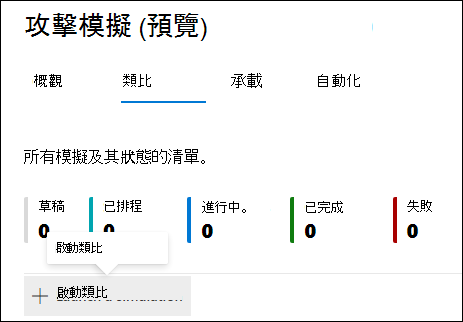
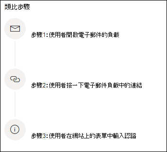
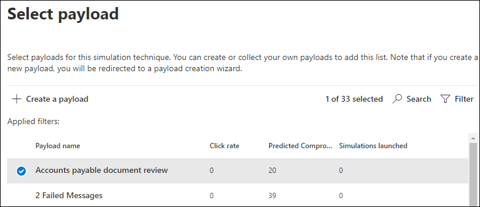
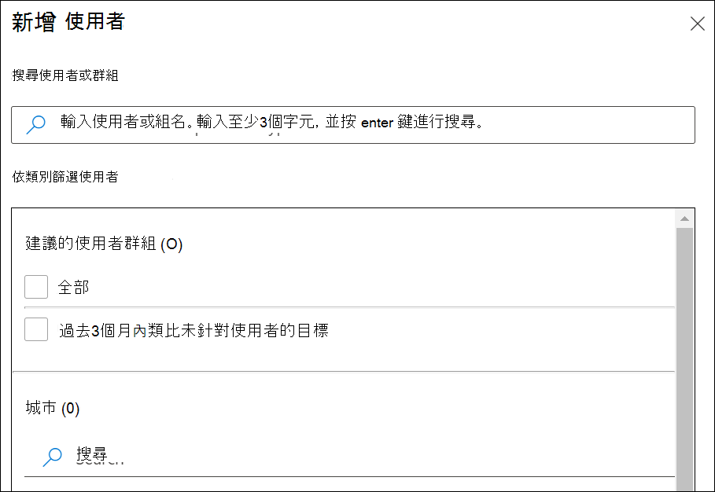
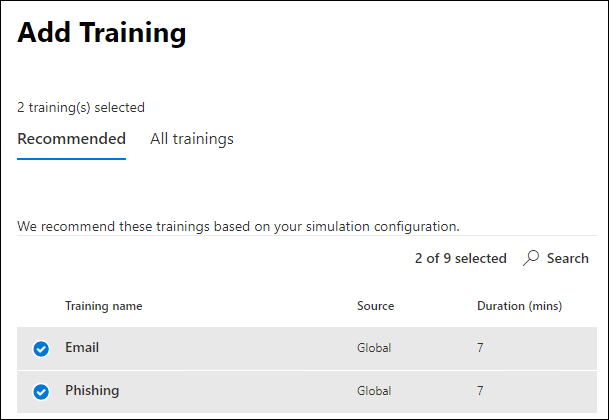

# 模擬網路釣魚攻擊Simulate a phishing attack

Microsoft Defender for Office 365 中的攻擊攻擊訓練可讓您在組織中執行惡意網路攻擊攻擊，以測試您的安全性原則與作法，以及訓練員工提升認知度及降低他們對於攻擊的敏感度。Attack simulation training in Microsoft Defender for Office 365 lets you run benign cyberattack simulations on your organization to test your security policies and practices, as well as train your employees to increase their awareness and decrease their susceptibility to attacks. 本文將引導您完成使用模擬攻擊訓練建立模擬網路釣魚攻擊。This article walks you through creating  a simulated phishing attack using attack simulation training.

有關攻擊模擬訓練的入門資訊，請參閱開始使用攻擊 [模擬訓練](attack-simulation-training-get-started.md)。For getting started information about Attack simulation training, see [Get started using Attack simulation training](attack-simulation-training-get-started.md).

若要啟動模擬網路釣魚攻擊，請開啟 Microsoft [365](https://security.microsoft.com/)資訊安全中心、前往電子郵件&共同攻擊模擬訓練，然後切換到Microsoft 365 資訊安全中心的模擬訓練，然後切換到Microsoft 365 資訊安全中心。  \>  To launch a simulated phishing attack, open the [Microsoft 365 security center](https://security.microsoft.com/), go to **Email & collaboration** \> **Attack simulation training**, and switch to the [**Simulations**](https://security.microsoft.com/attacksimulator?viewid=simulations) tab.

在 **模擬下**，選取 **+啟動模擬**。Under **Simulations**, select **+ Launch a simulation**.

> [!NOTE]
> 建立模擬時，您隨時都可以儲存並關閉模擬，稍後再繼續進行模擬。At any point during simulation creation, you can save and close to continue configuring the simulation at a later time.

## 選取社交工程技術Selecting a social engineering technique

從 4 種不同的技巧中選取，由 [MITRE ATT&CK®所挑選](https://attack.mitre.org/techniques/enterprise/)。Select from 4 different techniques, curated from the [MITRE ATT&CK® framework](https://attack.mitre.org/techniques/enterprise/). 不同的裝載適用于不同的技術：Different payloads are available for different techniques:

- **認證認證** 認證會嘗試將使用者帶至具有輸入框的已知網站以收集認證，以提交使用者名稱和密碼。**Credential harvest** attempts to collect credentials by taking users to a well-known looking website with input boxes to submit a username and password.
- **惡意程式碼** 附件會將惡意附件新增到郵件中。**Malware attachment** adds a malicious attachment to a message. 當使用者開啟附件時，會執行任意程式碼，協助攻擊者入侵目標裝置。When the user opens the attachment, arbitrary code is run that will help the attacker compromise the target's device.
- **附件中的連結** 是一種認證混合式。**Link in attachment** is a type of credential harvest hybrid. 攻擊者在電子郵件附件中插入 URL。An attacker inserts a URL into an email attachment. 附件中的 URL 採用與認證認證相同的技術。The URL within the attachment follows the same technique as credential harvest.
- **惡意程式碼** 連結會從已知的檔案共用服務上託管的檔案執行一些任意程式碼。**Link to malware** will run some arbitrary code from a file hosted on a well-known file sharing service. 此訊息會包含此惡意檔案的連結。The message sent to the user will contain a link to this malicious file. 開啟檔案，協助攻擊者入侵目標裝置。Opening the file and help the attacker compromise the target's device.

> [!TIP]
> 按一下每項 **技巧描述** 內的 View 詳細資料，將會顯示進一步的資訊，以及該技巧的模擬步驟。Clicking on **View details** within the description of each technique will display further information and the simulation steps for the technique.
>
> 

選取技巧並按一下 [下一步之後，為模擬命名和描述可選擇性地提供一個名稱。After you've selected the technique and clicked on **Next**, give your simulation a name and optionally a description.

## 選取負載Selecting a payload

接下來，您必須從現有的負載目錄選取一個負載。Next, you'll need to either select a payload from the pre-existing payload catalog.

負載具有可協助您選擇的資料點：Payloads have a number of data points to help you choose:

- **按一下比率** 會計算按一下此負載人數。**Click rate** counts how many people clicked this payload.
- **根據針對** Office 365 客戶之 Microsoft Defender 所受到負載的歷史資料，預測受到此負載入侵之人員百分比。**Predicted compromise rate** predicts the percentage of people that will get compromised by this payload based on historical data for the payload across Microsoft Defender for Office 365 customers.
- **啟動的** 模擬會計算此負載在其他模擬中使用的次數。**Simulations launched** counts the number of times this payload was used in other simulations.
- **可透過** 篩選使用複雜度，是根據由線索以受攻擊之目標之負載中的標記數目計算。**Complexity**, available through **filters**, is calculated based on the number of indicators within the payload that clue targets in on it being an attack. 標記數多一點會導致複雜度降低。More indicators lead to lower complexity.
- **可** 透過篩選使用的來源會指出該負載是否建立于您的租使用者上，或屬於 Microsoft 現有負載目錄的一 (全域) 。**Source**, available through **filters**, indicates whether the payload was created on your tenant or is a part of Microsoft's pre-existing payload catalog (global).

從清單中選取一個負載，以查看該負載的預覽，以及該負載的其他相關資訊。Select a payload from the list to see a preview of the payload with additional information about it.

如果您想要建立自己的裝載，請閱讀建立攻擊模擬訓練的 [裝載](attack-simulation-training-payloads.md)。If you'd like to create your own payload, read [create a payload for attack simulation training](attack-simulation-training-payloads.md).

## 對象目標Audience targeting

現在該選取此模擬物件。Now it's time to select this simulation's audience. 您可以選擇將 **貴組織的所有使用者** 納入，或 **只包含特定使用者和群組**。You can choose to **include all users in your organization** or **include only specific users and groups**.

當您選擇只 **包含特定使用者和群組時** ，您可以：When you choose to **include only specific users and groups** you can either:

- **新增使用者**，這可讓您針對租使用者運用搜尋功能，以及進一步搜尋和篩選功能，例如鎖定過去 3 個月內未受到模擬鎖定的使用者。**Add users**, which allows you to leverage search for your tenant, as well as advanced search and filtering capabilities, like targeting users who haven't been targeted by a simulation in the last 3 months.
  
- **從 CSV 進行** 匯出可讓您針對此模擬，匯出預先定義的使用者集。**Import from CSV** allows you to import a predefined set of users for this simulation.

## 指派訓練Assigning training

建議您為每個模擬指派訓練，因為參與訓練的員工較不容易受到類似的攻擊。We recommend that you assign training for each simulation, as employees who go through training are less susceptible to similar attacks.

您可以選擇要指派訓練，或自己選取訓練課程和單元。You can either choose to have training assigned for you or select training courses and modules yourself.

選取 **訓練到期日，** 以確保員工及時完成訓練。Select the **training due date** to make sure employees finish their training in a timely manner.

> [!NOTE]
> 如果您選擇自己選取課程和模組，您仍然可以看到建議的內容，以及所有可用的課程和模組。If you choose to select courses and modules yourself, you'll still be able to see the recommended content as well as all available courses and modules.
>
> 

在接下來的步驟中，如果您選擇自己選取，您將必須新增訓練，並自訂您的訓練登陸頁面。In the next steps you'll need to **Add trainings** if you opted to select it yourself, and customize your training landing page. 您將可以預覽訓練登陸頁面，以及變更其頁標題和本體。You'll be able to preview the training landing page, as well as change the header and body of it.

## 啟動詳細資料並評論Launch details and review

現在一切已全部完成，您可以立即啟動此模擬，或將模擬排程為稍後的日期。Now that everything is configured, you can launch this simulation immediately or schedule it for a later date. 您也需要選擇何時結束此模擬。You will also need to choose when to end this simulation. 我們將停止在過去選取的時間，拍攝此模擬的互動。We will stop capturing interaction with this simulation past the selected time.

**讓地區知道時區傳遞** ，以在員工上班時間根據地區的模擬攻擊訊息。**Enable region aware timezone delivery** to deliver simulated attack messages to your employees during their working hours based on their region.

完成後，請按一下 [下一步 **，然後查看** 模擬的詳細資訊。Once you're done, click on **Next** and review the details of your simulation. 按一下任 **一** 部分的 [編輯工具，即可返回並變更任何需要變更的細節。Click on **Edit** on any of the parts to go back and change any details that need changing. 完成後，按一下 [ **提交**。Once done, click **Submit**.
