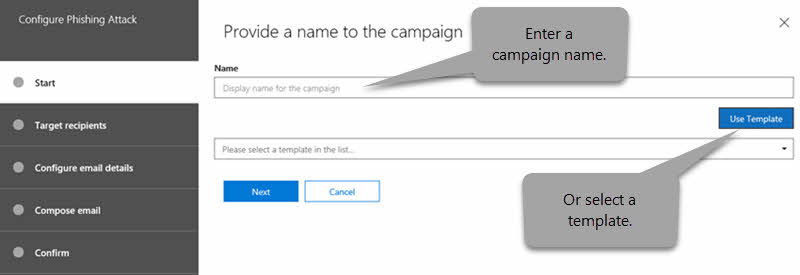

# Office 365 中的攻擊模擬器Attack Simulator in Office 365

**摘要**如果您是 Office 365 全域系統管理員或安全性系統管理員，而且您的組織有 Office 365 進階威脅防護計劃 2，其中包含[威脅調查及回應功能](office-365-ti.md)，您可以在組織中執行真實的攻擊案例使用攻擊模擬器。**Summary** If you are an Office 365 global administrator or a security administrator and your organization has Office 365 Advanced Threat Protection Plan 2, which includes [Threat Investigation and Response capabilities](office-365-ti.md), you can use Attack Simulator to run realistic attack scenarios in your organization. 這可協助您在實際攻擊對您造成實質的損害之前識別並找出易受攻擊的使用者。This can help you identify and find vulnerable users before a real attack impacts your bottom line. 閱讀本篇文章以了解更多。Read this article to learn more.

## 攻擊The Attacks

目前提供三種進攻模擬：Three kinds of attack simulations are currently available:

- [認證搜集矛網路釣魚攻擊Credential harvest spear-phishing attack](#credential-harvest-spear-phishing-attack)

- [附件矛網路釣魚攻擊Attachment spear-phishing attack](#attachment-spear-phishing-attack)

- [密碼噴濺攻擊Password-spray attack](#password-spray-attack)

- [暴力密碼破解攻擊Brute-force password attack](#brute-force-password-attack)

若要順利啟動攻擊，請確定您用來執行模擬的攻擊的帳戶使用多重要素驗證。For an attack to be successfully launched, make sure that the account you are using to run simulated attacks is using multi-factor authentication. 此外，您必須是 Office 365 全域系統管理員或安全性系統管理員。In addition, you must be an Office 365 global administrator or a security administrator. （若要深入了解角色和權限，請參閱[Office 365 安全性 & 合規性中心的權限](permissions-in-the-security-and-compliance-center.md)）。(To learn more about roles and permissions, see [Permissions in the Office 365 Security & Compliance Center](permissions-in-the-security-and-compliance-center.md).)

若要存取安全性的攻擊模擬器&amp;合規性中心，選擇 [**威脅管理** \> **攻擊模擬器**。To access Attack Simulator, in the Security &amp; Compliance Center, choose **Threat management** \> **Attack simulator**.

## 開始之前...Before you begin...

請確定您和您的組織符合的攻擊模擬器需求如下：Make sure that you and your organization meet the following requirements for Attack Simulator:

- 貴組織的電子郵件會託管於 Exchange Online。Your organization's email is hosted in Exchange Online. （攻擊模擬器不適用於內部部署電子郵件伺服器。）(Attack Simulator is not available for on-premises email servers.)

- 您是 Office 365 全域系統管理員或安全性系統管理員You are an Office 365 global administrator or security administrator

- 網路釣魚活動，將收集和處理事件的 30 天內，歷史行銷活動資料可多達 90 天後啟動活動。Phishing campaigns will collect and process events for a period of 30 days, historical campaign data will be available for up to 90 days after the campaign is launched.

- [多重要素驗證/條件式存取](https://docs.microsoft.com/office365/admin/security-and-compliance/set-up-multi-factor-authentication)已關閉，如在最低之 Office 365 全域系統管理員帳戶和安全性系統管理員將使用的攻擊模擬器。[Multi-factor authentication/Conditional Access](https://docs.microsoft.com/office365/admin/security-and-compliance/set-up-multi-factor-authentication) is turned on, for at least the Office 365 global administrator account and security administrators who will be using Attack Simulator. （理想狀況下，多重要素驗證條件式存取已為您組織中的所有使用者。）(Ideally, multi-factor authentication/conditional access is turned on for all users in your organization.)

- 您的組織有[Office 365 進階威脅防護計劃 2](office-365-atp.md)，與安全性可見的攻擊模擬器&amp;合規性中心 (前往**威脅管理** \> **攻擊模擬器**)Your organization has [Office 365 Advanced Threat Protection Plan 2](office-365-atp.md), with Attack Simulator visible in the Security &amp; Compliance Center (go to **Threat management** \> **Attack simulator**)

    

## 認證搜集矛網路釣魚攻擊Credential harvest spear-phishing attack

網路釣魚是通稱歸類為社交樣式攻擊的攻擊廣泛套件。Phishing is a generic term for a broad suite of attacks classed as a social engineering style attack. 此類攻擊著重於矛網路釣魚，針對特定群組的個人或組織在多目標攻擊。This attack is focused on spear phishing, a more targeted attack that is aimed at a specific group of individuals or an organization. 一般而言，自訂的攻擊與某些偵察執行，並使用會產生收件者，例如看起來像來自組織內的高階主管的電子郵件訊息中的信任的顯示名稱。Typically, a customized attack with some reconnaissance performed and using a display name that will generate trust in the recipient, such as an email message that looks like it came from an executive within your organization.

此類攻擊著重於給您，讓您管理誰會顯示訊息，有來自藉由變更顯示名稱和來源地址。This attack focuses on letting you manipulate who the message appears to have originated from by changing the display name and source address. 矛網路釣魚攻擊成功時，cyberattackers 存取使用者的認證。When spear-phishing attacks are successful, cyberattackers gain access to users' credentials.

### 若要模擬矛網路釣魚攻擊To simulate a spear-phishing attack

您可以製作豐富的 HTML 編輯器，直接在**電子郵件內文**欄位本身或與 HTML 來源搭配使用。You can craft the rich HTML editor directly in the **Email body** field itself or work with HTML source.

1. 在[安全性&amp;合規性中心](https://protection.office.com)，選擇 [**威脅管理** \> **攻擊模擬器**。In the [Security &amp; Compliance Center](https://protection.office.com), choose **Threat management** \> **Attack simulator**.

2. 指定攻擊的有意義的活動名稱，或者選取範本。Specify a meaningful campaign name for the attack or select a template.

   

3. 指定目標收件者。Specify the target recipients. 這可以是個人或組織中的群組。This can be individuals or groups in your organization. 每個目標收件者必須擁有 Exchange Online 信箱攻擊的順序才會成功。Each targeted recipient must have an Exchange Online Mailbox in order for the attack to be successful.

   

4. 設定網路釣魚電子郵件的詳細資訊。Configure the Phishing email details.

   

   HTML 格式可以為複雜或基本與您的行銷活動需求。The HTML formatting can be as complex or basic as your campaign needs. 為電子郵件格式是 HTML，您可以插入影像和以增強 believability 的文字。As the email format is HTML, you can insert images and text to enhance believability. 您可以在所收到的訊息中接收電子郵件用戶端外觀的控制。You have control on what the received message will look like in the receiving email client.

5. 指定文字**從 （名稱）** ] 欄位。Specify text for the **From (Name)** field. 這是顯示在接收的電子郵件用戶端中的**顯示名稱**] 欄位。This is the field that shows in the **Display Name** in the receiving email client.

6. 指定的文字或 [**從**] 欄位。Specify text or the **From** field. 這是顯示為接收電子郵件用戶端的寄件者的電子郵件地址] 欄位。This is the field that shows as the email address of the sender in the receiving email client.

   您可以在組織內輸入現有的電子郵件命名空間 （這樣會使實際解決接收用戶端，促進非常高信任模型中的電子郵件地址），或您可以輸入的外部電子郵件地址。You can enter an existing email namespace within your organization (doing this will make the email address actually resolve in the receiving client, facilitating a very high trust model), or you can enter an external email address. 您指定的電子郵件地址並沒有實際存在，但仍必須遵循的有效的 SMTP 地址，格式如下`user@domainname.extension`。The email address that you specify does not have to actually exist, but it does need to follow the format of a valid SMTP address, such as `user@domainname.extension`.

7. 使用下拉式清單選取器，請選取 [反映您必須在您攻擊內的內容類型的網路釣魚登入伺服器 URL。Using the drop-down selector, select a Phishing Login server URL that reflects the type of content you will have within your attack. 多個已設佈景主題的 Url 被提供給您從中選擇，例如文件傳遞、 技術、 薪資等。這實際上是目標的使用者上當系統要您按一下 [URL。Several themed URLs are provided for you to choose from, such as document delivery, technical, payroll etc. This is effectively the URL that targeted users are asked to click.

8. 指定自訂的登陸頁面 URL。Specify a custom landing page URL. 使用這將使用者重新導向至您指定的攻擊成功結尾的 URL。Using this will redirect users to a URL you specify at the end of a successful attack. 如果您有內部認知訓練，例如，您可以指定，這裡。If you have internal awareness training, for example, you can specify that here.

9. 指定文字的 [**主旨**] 欄位。Specify text for the **Subject** field. 這是顯示為中接收電子郵件用戶端的**主體名稱**] 欄位。This is the field that shows as the **Subject Name** in the receiving email client.

10. 撰寫目標會收到**電子郵件內文**。Compose the **Email body** that the target will receive.

    `${username}`電子郵件本文中插入的目標名稱。`${username}` inserts the targets name into the Email body.

    `${loginserverurl}`會插入我們想要目標使用者按一下的 URL`${loginserverurl}` inserts the URL we want target users to click

11. 選擇 [**下一步]** ，然後**完成]** 來啟動攻擊。Choose **Next,** then **Finish** to launch the attack. 矛網路釣魚電子郵件會傳遞至您目標收件者的信箱。The spear phishing email message is delivered to your target recipients' mailboxes.

## 附件矛網路釣魚攻擊Attachment spear-phishing attack

網路釣魚是通稱歸類為社交樣式攻擊的攻擊廣泛套件。Phishing is a generic term for a broad suite of attacks classed as a social engineering style attack. 此類攻擊著重於附件矛網路釣魚，針對特定群組的個人或組織在多目標攻擊。This attack is focused on attachment spear phishing, a more targeted attack that is aimed at a specific group of individuals or an organization. 一般而言，自訂的攻擊與某些偵察執行，並使用會產生收件者，例如看起來像來自組織內的高階主管的電子郵件訊息中的信任的顯示名稱。Typically, a customized attack with some reconnaissance performed and using a display name that will generate trust in the recipient, such as an email message that looks like it came from an executive within your organization.

此類攻擊著重於給您，讓您管理誰會顯示訊息，已變更的顯示名稱和來源地址，但這次而不提供嘗試和引誘使用者按一下 URL 源自於，我們提供的附件，我們想要取得 t若要開啟 [他使用者。This attack focuses on letting you manipulate who the message appears to have originated from by changing the display name and source address, but this time as opposed to offering a URL to try and lure the end user to click, we offer an attachment that we are trying to get the end user to open. 

### 若要模擬附件矛網路釣魚攻擊To simulate a Attachment spear-phishing attack

1. 請依照從上述需要這一次按一下登陸頁面上的 [**附件攻擊**。Follow the steps from above, having this time clicked on **Attachment Attack** on the landing page.

2. 進行的程序執行精靈，您會看到兩個選項來設定。As you progress through the wizard, you see two options to configure. **附件類型**，我們支援兩種附件類型， **.docx**或 **.pdf**。The **Attachment Type**, we support two attachment types, **.docx** or **.pdf**. **附件名稱**] 中，使用此欄位來建立行銷活動的有意義的附件名稱。The **Attachment Name**, use this field to create a meaningful attachment name for the campaign.

## 密碼噴濺攻擊Password-spray attack

壞動作項目已成功取得從租用戶的有效使用者的清單之後，通常會使用組織的密碼噴灑攻擊。A password spray attack against an organization is typically used after a bad actor has successfully acquired a list of valid users from the tenant. 壞動作項目所知的人員使用常見密碼。The bad actor knows about common passwords that people use. 此為廣泛使用的攻擊，來執行，且更難偵測比暴力方法便宜攻擊。This is a widely used attack, as it is a cheap attack to run, and harder to detect than brute force approaches.

此類攻擊著重於讓您指定要對使用者的大型目標基底常見的密碼。This attack focuses on letting you specify a common password against a large target base of users.

**重要事項**執行密碼噴灑攻擊已經有多重要素驗證，會導致失敗的嘗試這些報告中的帳戶的使用者帳戶。**Important Note** running the password spray attack against end user accounts that already have multi-factor authentication, will result in a unsuccessful attempt for those accounts in the reporting. 這是因為正在其中一個主要機制，以協助防範密碼噴灑攻擊，因此預期的多重要素驗證。This is due to multi-factor authentication being one of the primary mechanims to help protect against password spray attacks, so is expected.

### 若要模擬密碼噴灑攻擊To simulate a password-spray attack

1. 在[安全性&amp;合規性中心](https://protection.office.com)，選擇 [**威脅管理** \> **攻擊模擬器**。In the [Security &amp; Compliance Center](https://protection.office.com), choose **Threat management** \> **Attack simulator**.

2. 指定攻擊的有意義的活動名稱。Specify a meaningful campaign name for the attack.

3. 指定目標收件者。Specify the target recipients. 這可以是個人或組織中的群組。This can be individuals or groups in your organization. 目標收件者必須在才能成功攻擊的順序中的 Exchange Online 信箱。A targeted recipient must have an Exchange Online mailbox in order for the attack to be successful.

4. 指定要用於攻擊的密碼。Specify a password to use for the attack. 例如，您可以嘗試的一個常見、 相關密碼是`Summer2019`。For example, one common, relevant password you could try is `Summer2019`. 另一個可能是`Fall2019`，或`Password1`。Another might be `Fall2019`, or `Password1`.

5. 選擇 [**完成**] 以啟動攻擊。Choose **Finish** to launch the attack.

## 暴力密碼破解攻擊Brute-force password attack

壞動作項目已成功取得從租用戶的關鍵使用者的清單之後，通常會使用組織暴力密碼攻擊。A brute-force password attack against an organization is typically used after a bad actor has successfully acquired a list of key users from the tenant. 此類攻擊著重在嘗試一組單一使用者的帳戶的密碼。This attack focuses on trying a set of passwords on a single user's account.

針對已經有多重要素驗證的使用者帳戶執行暴力密碼攻擊的**重要注意事項，** 會導致失敗的嘗試這些報告中的帳戶。**Important Note** running the brute-force password attacks against end user accounts that already have multi-factor authentication, will result in a unsuccessful attempt for those accounts in the reporting. 這是因為正在其中一個主要機制，以協助防範暴力密碼攻擊，因此預期的多重要素驗證。This is due to multi-factor authentication being one of the primary mechanims to help protect against brute-force password attacks, so is expected.

### 若要模擬暴力密碼攻擊To simulate a brute-force password attack

1. 在[安全性&amp;合規性中心](https://protection.office.com)，選擇 [**威脅管理** \> **攻擊模擬器**。In the [Security &amp; Compliance Center](https://protection.office.com), choose **Threat management** \> **Attack simulator**.

2. 指定攻擊的有意義的活動名稱。Specify a meaningful campaign name for the attack.

3. 指定目標收件者。Specify the target recipient. 目標收件者必須在才能成功攻擊的順序中的 Exchange Online 信箱。A targeted recipient must have an Exchange Online mailbox in order for the attack to be successful.

4. 指定一組用於攻擊的密碼。Specify a set of passwords to use for the attack. 若要這麼做，您可以使用文字檔 (.txt) 的清單中的密碼。To do this, you can use a text (.txt) file for your list of passwords. 將文字檔不可超過 10 MB 的檔案大小。The text file cannot exceed 10 MB in file size. 使用一個密碼每一行，並確定要包含在清單中的最後一個密碼之後硬式傳回。Use one password per line, and make sure to include a hard return after the last password in your list.

5. 選擇 [**完成**] 以啟動攻擊。Choose **Finish** to launch the attack.

請造訪[Microsoft 365 藍圖](https://www.microsoft.com/microsoft-365/roadmap)請參閱什麼是在開發中、 什麼推行和功能已啟動。Visit the [Microsoft 365 Roadmap](https://www.microsoft.com/microsoft-365/roadmap) to see what's in development, what's rolling out, and what's already launched.

## 另請參閱See also

[Office 365 進階威脅防護服務說明Office 365 Advanced Threat Protection Service Description](https://docs.microsoft.com/office365/servicedescriptions/office-365-advanced-threat-protection-service-description)

[Office 365 進階威脅防護Office 365 Advanced Threat Protection](office-365-atp.md)
