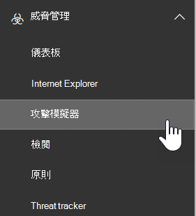

# ATP 中的攻擊模擬器Attack Simulator in ATP

**摘要**如果您是全域系統管理員或安全性管理員，且您的組織具備 Office 365 的高級威脅防護方案2（包括[威脅調查和回應功能](office-365-ti.md)），您可以使用攻擊模擬器，在組織中執行實際的攻擊案例。**Summary** If you are a global administrator or a security administrator and your organization has Office 365 Advanced Threat Protection Plan 2, which includes [Threat Investigation and Response capabilities](office-365-ti.md), you can use Attack Simulator to run realistic attack scenarios in your organization. 這可協助您在實際攻擊對您造成實質的損害之前識別並找出易受攻擊的使用者。This can help you identify and find vulnerable users before a real attack impacts your bottom line. 若要深入瞭解，請閱讀本文。Read this article to learn more.

## 開始之前有哪些須知？What do you need to know before you begin?

- 若要開啟安全性與合規性中心，請移至 <https://protection.office.com/>。To open the Security & Compliance Center, go to <https://protection.office.com/>. 攻擊模擬器可在**威脅管理** \> **攻擊模擬器**中取得。Attack simulator is available at **Threat management** \> **Attack simulator**.

  

- 如需不同 Microsoft 365 訂閱中攻擊模擬器可用性的相關資訊，請參閱[Office 365 高級威脅防護服務說明](https://docs.microsoft.com/office365/servicedescriptions/office-365-advanced-threat-protection-service-description)。For more information about the availability of Attack Simulator across different Microsoft 365 subscriptions, see [Office 365 Advanced Threat Protection service description](https://docs.microsoft.com/office365/servicedescriptions/office-365-advanced-threat-protection-service-description).

- 您必須是「**組織管理**」或「**安全性管理員**」角色群組的成員。You need to be a member of the **Organization Management** or **Security Administrator** role groups. 如需有關安全性與合規性中心中角色群組的詳細資訊，請參閱[安全性與合規性中心裡的權限](permissions-in-the-security-and-compliance-center.md)。For more information about role groups in the Security & Compliance Center, see [Permissions in the Security & Compliance Center](permissions-in-the-security-and-compliance-center.md).

- 您的帳戶必須設定為進行多重要素驗證 (MFA) 以在攻擊模擬器中建立及管理活動。Your account needs to be configured for multi-factor authentication (MFA) to create and manage campaigns in Attack Simulator. 如需相關指示，請參閱[設定多重要素驗證](https://docs.microsoft.com/microsoft-365/admin/security-and-compliance/set-up-multi-factor-authentication)。For instructions, see [Set up multi-factor authentication](https://docs.microsoft.com/microsoft-365/admin/security-and-compliance/set-up-multi-factor-authentication).

若要成功啟動攻擊，請確定您用來執行模擬攻擊的帳戶使用多重要素驗證。For an attack to be successfully launched, make sure that the account you are using to run simulated attacks is using multi-factor authentication. 此外，您必須是全域系統管理員或安全性管理員。In addition, you must be a global administrator or a security administrator.  (若要深入瞭解角色和許可權，請參閱[安全性 & 規範中心的許可權](permissions-in-the-security-and-compliance-center.md)。 ) (To learn more about roles and permissions, see [Permissions in the Security & Compliance Center](permissions-in-the-security-and-compliance-center.md).)

- 網路釣魚活動會收集事件，並處理30天的事件。Phishing campaigns will collect and process events for 30 days. 在您啟動市場活動之後，歷史活動資料將可長達90天。Historical campaign data will be available for up to 90 days after you launch the campaign.

- 攻擊模擬程式沒有對應的 PowerShell Cmdlet。There are no corresponding PowerShell cmdlets for Attack Simulator.

## Spear 網路釣魚活動Spear phishing campaigns

*網路釣魚*是一種常見的電子郵件攻擊術語，可嘗試竊取看似來自合法或信任寄件者的郵件中的機密資訊。*Phishing* is a generic term for email attacks that try to steal sensitive information in messages that appear to be from legitimate or trusted senders. *Spear 網路釣魚*是一個目標網路釣魚攻擊，其使用專門為目標收件者量身定制的專門和自訂內容， (通常是由攻擊者) 後，在收件者上的偵測之後。*Spear phishing* is a targeted phishing attack that uses very focused and customized content that's specifically tailored to the targeted recipients (typically, after reconnaissance on the recipients by the attacker).

- 您是全域系統管理員或安全性管理員You are a global administrator or security administrator

在攻擊模擬器中，有兩種不同類型的 spear 網路釣魚活動可供使用：In Attack Simulator, two different types of spear phishing campaigns are available:

- 已開啟[多重要素驗證/條件式存取](https://docs.microsoft.com/microsoft-365/admin/security-and-compliance/set-up-multi-factor-authentication)，至少要有全域管理員帳戶和將使用攻擊模擬器的安全性管理員。[Multi-factor authentication/Conditional Access](https://docs.microsoft.com/microsoft-365/admin/security-and-compliance/set-up-multi-factor-authentication) is turned on, for at least the global administrator account and security administrators who will be using Attack Simulator.  (理想情況下，會為組織中的所有使用者開啟多重要素驗證/條件式存取。 ) (Ideally, multi-factor authentication/conditional access is turned on for all users in your organization.)

  - 說明這種情況的預設頁面只是測試，並提供識別網路釣魚郵件的秘訣。A default page that explains this was a just a test, and gives tips for recognizing phishing messages.

    ![使用者按一下 [網路釣魚] 連結並輸入其認證時看到的內容](../../media/attack-simulator-phishing-result.png)

  - 您指定的自訂頁面 (URL) 。A custom page (URL) that you specify.

- \*\*Spear 網路釣魚 (附件) \*\*：攻擊會嘗試說服收件者在郵件中開啟 .docx 或 .pdf 附件。**Spear phishing (attachment)**: The attack tries to convince the recipients to open a .docx or .pdf attachment in the message. 附件包含的來自預設網路釣魚連結的內容相同，但是第一個句子會以 " \<Display Name\> ，您會看到此郵件為最近開啟的電子郵件訊息 ..."。The attachment contains the same content from the default phishing link, but the first sentence starts with "\<Display Name\>, you are seeing this message as a recent email message you opened...".

> [!NOTE]
> 目前，攻擊模擬器中的 spear 網路釣魚活動不會過期。Currently, spear phishing campaigns in Attack Simulator don't expire.

### 建立 spear 網路釣魚活動Create a spear phishing campaign

任何 spear 網路釣魚活動的重要部分是傳送給目標收件者之電子郵件的外觀與風格。An important part of any spear phishing campaign is the look and feel of the email message that's sent to the targeted recipients. 若要建立及設定電子郵件訊息，您可以使用下列選項：To create and configure the email message, you have these options:

- **使用內建的電子郵件範本**：有兩個內建的範本可供使用：**獎品 Giveaway**和**工資單更新**。**Use a built-in email template**: Two built-in templates are available: **Prize Giveaway** and **Payroll Update**. 您可以在建立及啟動市場活動時，進一步自訂範本中的部分、全部或無電子郵件屬性。You can further customize some, all, or none of the email properties from the template when you create and launch the campaign.

- **建立可重複使用的電子郵件範本**：在您建立及儲存電子郵件範本之後，您可以在未來 spear 網路釣魚活動中再次使用它。**Create a reusable email template**: After you create and save the email template, you can use it again in future spear phishing campaigns. 您可以在建立及啟動市場活動時，進一步自訂範本中的部分、全部或無電子郵件屬性。You can further customize some, all, or none of the email properties from the template when you create and launch the campaign.

- **在嚮導中建立電子郵件訊息**：當您建立及啟動 spear 網路釣魚活動時，您可以直接在嚮導中建立電子郵件訊息。**Create the email message in the wizard**: You can create the email message directly in the wizard as you create and launch the spear phishing campaign.

#### 步驟 1 (選用) ：建立自訂的電子郵件範本Step 1 (Optional): Create a custom email template

若要使用其中一個內建範本或直接在嚮導中建立電子郵件訊息，您可以略過此步驟。If you're going to use one of the built-in templates or create the email message directly in the wizard, you can skip this step.

1. 在 [安全性 & 規範中心] 中，移至 [**威脅管理**] \> **攻擊模擬器**。In the Security & Compliance Center, go to **Threat management** \> **Attack simulator**.

2. 在 [**模擬攻擊**] 頁面的 [ **Spear 網路釣魚 (認證收集]) **或**Spear 網路釣魚 (附件) **區段中，按一下 [**攻擊詳細資料**]。On the **Simulate attacks** page, in either the **Spear Phishing (Credentials Harvest)** or **Spear Phishing (Attachment)** sections, click **Attack Details**.

   您建立範本的方式無關緊要。It doesn't matter where you create the template. 範本中的可用選項與這兩種類型的網路釣魚攻擊相同。The available options in the template are the same for both types of phishing attacks.

3. 在開啟的 [**攻擊詳細資料**] 頁面中，于 [**網路釣魚範本**] 區段的 [**建立範本**] 區域中，按一下 [**新增範本**]。In the **Attack details** page that opens, in the **Phishing Templates** section, in the **Create Templates** area, click **New Template**.

4. **設定網路釣魚範本**嚮導會在新飛入的視窗中啟動。The **Configure Phishing Template** wizard starts in a new flyout. 在 [**開始**] 步驟中，輸入範本的唯一顯示名稱，然後按 **[下一步]**。In the **Start** step, enter a unique display name for the template, and then click **Next**.

5. 在 [**設定電子郵件詳細資料**] 步驟中，設定下列設定：In the **Configure email details** step, configure the following settings:

   - \*\*從 (名稱) \*\*：郵件寄件者所用的顯示名稱。**From (Name)**: The display name that's used for the message sender.

   - \*\*從 (電子郵件) \*\*：寄件者的電子郵件地址。**From (Email)**: The sender's email address.

   - **網路釣魚登入伺服器 URL**：按一下下拉式清單，然後從清單中選取其中一個可用的 URLs。**Phishing Login Server URL**: Click the drop down and select one of the available URLs from the list. 這是使用者將被誘惑按一下的 URL。This is the URL that users will be tempted to click. 選項包括：The choices are:

     - <http://portal.docdeliveryapp.com>
     - <http://portal.docdeliveryapp.net>
     - <http://portal.docstoreinternal.com>
     - <http://portal.docstoreinternal.net>
     - <http://portal.hardwarecheck.net>
     - <http://portal.hrsupportint.com>
     - <http://portal.payrolltooling.com>
     - <http://portal.payrolltooling.net>
     - <http://portal.prizegiveaway.net>
     - <http://portal.prizesforall.com>
     - <http://portal.salarytoolint.com>
     - <http://portal.salarytoolint.net>

     > [!NOTE]
     >
     > - 所有的 URLs 都是特意 HTTP，而不是 HTTPs。All of the URLs are intentionally http, not https.
     >
     > - URL 信譽服務可識別一或多個 URLs 為不安全的。A URL reputation service might identify one or more of these URLs as unsafe. 在網路釣魚活動中使用 URL 之前，請先檢查支援的網頁瀏覽器中的 URL 可用性。Check the availability of the URL in your supported web browsers before you use the URL in a phishing campaign.

   - **自訂登陸頁面 URL**：輸入使用者在按一下 [網路釣魚] 連結並輸入其認證時所採用的選用登陸頁面。**Custom Landing Page URL**: Enter an optional landing page where users are taken if they click the phishing link and enter their credentials. 此連結會取代預設登陸頁面。This link replaces the default landing page. 例如，如果您有內部的知識意識訓練，您可以在這裡指定該 URL。For example, if you have internal awareness training, you can specify that URL here.

   - **類別**：目前不使用此設定 () 忽略您輸入的任何專案。**Category**: Currently, this setting isn't used (anything you enter is ignored).

   - 主旨 **：電子**郵件的**主旨欄位。****Subject**: The **Subject** field of the email message.

   完成後，按 [下一步]\*\*\*\*。When you're finished, click **Next**.

6. 在 [**撰寫電子郵件**] 步驟中，建立電子郵件訊息的郵件內文。In the **Compose email** step, create the message body of the email message. 您可以使用 [**電子郵件**] 索引標籤 (豐富的 html 編輯器) 或 [**來源**] 索引標籤 (原始的 html 程式碼) 。You can use the **Email** tab (a rich HTML editor) or the **Source** tab (raw HTML code).

   HTML 格式設定可以簡單或複雜，您必須在需要時。The HTML formatting can be as simple or complex as you need it to be. 您可以插入影像和文字，以在收件者的電子郵件客戶程式中增強郵件的 believability。You can insert images and text to enhance the believability of the message in the recipient's email client.

   - `${username}`插入收件者的名稱。`${username}` inserts the recipient's name.

   - `${loginserverurl}`插入上一個步驟中的**網路釣魚登入伺服器 URL**值。`${loginserverurl}` inserts the **Phishing Login Server URL** value from the previous step.

   完成後，按 [下一步]\*\*\*\*。When you're finished, click **Next**.

7. 在 [**確認**] 步驟中，按一下 **[完成]**。In the **Confirm** step, click **Finish**.

#### 步驟2：建立及啟動 spear 網路釣魚活動Step 2: Create and launch the spear phishing campaign

1. 在 [安全性 & 規範中心] 中，移至 [**威脅管理**] \> **攻擊模擬器**。In the Security & Compliance Center, go to **Threat management** \> **Attack simulator**.

2. 在 [**模擬攻擊**] 頁面上，根據您要建立的活動類型進行下列其中一項選擇：On the **Simulate attacks** page, make one of the following selections based on the type of campaign you want to create:

   - 在 [ **Spear 網路釣魚 (認證搜集) \*\* ] 區段中，按一下 [**啟動攻擊**] 或按一下 [**攻擊詳細資料\*\* \> **啟動攻擊**]。In the **Spear Phishing (Credentials Harvest)** section, click **Launch Attack** or click **Attack Details** \> **Launch Attack**.

   - 在 [ **Spear 網路釣魚 (附件) \*\* ] 區段中，按一下 [**啟動攻擊**] 或按一下 [**攻擊詳細資料\*\* \> **啟動攻擊**]。In the **Spear Phishing (Attachment)** section, click **Launch Attack** or click **Attack Details** \> **Launch Attack**.

3. **設定網路釣魚攻擊**嚮導會在新飛入的視窗中啟動。The **Configure Phishing Attack** wizard starts in a new flyout. 在 [**開始**] 步驟中，執行下列其中一個步驟：In the **Start** step, do one of the following steps:

   - 在 [**名稱**] 方塊中，輸入活動的唯一顯示名稱。In the **Name** box, enter a unique display name for the campaign. 請勿按一下 [**使用範本**]，因為您將在嚮導稍後建立電子郵件訊息。Don't click **Use Template**, because you'll create the email message later in the wizard.

   - 按一下 [**使用範本**]，然後選取內建或自訂的電子郵件範本。Click **Use Template** and select a built-in or custom email template. 選取範本之後，[**名稱**] 方塊會根據範本自動填滿，但您可以變更名稱。After you select the template, the **Name** box is automatically filled based on the template, but you can change the name.

   

   完成後，按 [下一步]\*\*\*\*。When you're finished, click **Next**.

4. 在 [**目標**收件者] 步驟中，執行下列其中一個步驟：In the **Target recipients** step, do one of the following steps:

   - 按一下 [**通訊錄**]，以選取市場活動的收件者 (使用者或群組) 。Click **Address Book** to select the recipients (users or groups) for the campaign. 每個目標收件者都必須有 Exchange Online 信箱。Each targeted recipient must have an Exchange Online mailbox. 如果您按一下 [**篩選**] 並套用但未輸入搜尋準則，則會傳回所有收件者，**並將其**新增至市場活動。If you click **Filter** and **Apply** without entering a search criteria, all recipients are returned and added to the campaign.

   - 按一下 **[匯入]** ，然後匯入**檔**匯入以逗號分隔的值 (CSV) 或電子郵件地址的行分隔檔。Click **Import** then **File Import** to import a comma-separated value (CSV) or line-separated file of email addresses. 每一行都必須包含收件者的電子郵件地址。Each line must contain the recipient's email address.

   完成後，按 [下一步]\*\*\*\*。When you're finished, click **Next**.

5. 在 [**設定電子郵件詳細資料**] 步驟中，設定下列設定：In the **Configure email details** step, configure the following settings:

   如果您在 [**開始**] 步驟中選取了範本，則這些值中的大部分已設定好，但您可以加以變更。If you selected a template in the **Start** step, most of these values are already configured, but you can change them.

   - \*\*從 (名稱) \*\*：郵件寄件者所用的顯示名稱。**From (Name)**: The display name that's used for the message sender.

   - \*\*從 (電子郵件) \*\*：寄件者的電子郵件地址。**From (Email)**: The sender's email address. 您可以從組織的電子郵件網域輸入實際或虛假的電子郵件地址，也可以輸入實際或虛假的外部電子郵件地址。You can enter a real or fake email address from your organization's email domain, or you can enter a real or fake external email address. 您組織中的有效寄件者電子郵件地址會在收件者的電子郵件客戶程式中實際解析。A valid sender email address from your organization will actually resolve in the recipient's email client.

   - **網路釣魚登入伺服器 URL**：按一下下拉式清單，然後從清單中選取其中一個可用的 URLs。**Phishing Login Server URL**: Click the drop down and select one of the available URLs from the list. 這是使用者將被誘惑按一下的 URL。This is the URL that users will be tempted to click. 選項包括：The choices are:

     - <http://portal.docdeliveryapp.com>
     - <http://portal.docdeliveryapp.net>
     - <http://portal.docstoreinternal.com>
     - <http://portal.docstoreinternal.net>
     - <http://portal.hardwarecheck.net>
     - <http://portal.hrsupportint.com>
     - <http://portal.payrolltooling.com>
     - <http://portal.payrolltooling.net>
     - <http://portal.prizegiveaway.net>
     - <http://portal.prizesforall.com>
     - <http://portal.salarytoolint.com>
     - <http://portal.salarytoolint.net>

     > [!NOTE]
     >
     > - 所有的 URLs 都是特意 HTTP，而不是 HTTPs。All of the URLs are intentionally http, not https.
     >
     > - URL 信譽服務可識別一或多個 URLs 為不安全的。A URL reputation service might identify one or more of these URLs as unsafe. 在網路釣魚活動中使用 URL 之前，請先檢查支援的網頁瀏覽器中的 URL 可用性。Check the availability of the URL in your supported web browsers before you use the URL in a phishing campaign.
     >
     > - 您必須選取 URL。You are required to select a URL. 針對**Spear 網路釣魚 (附件) **活動，您可以在下一個步驟中移除郵件本文中的連結 (否則，郵件會同時包含連結**和**附件) 。For **Spear Phishing (Attachment)** campaigns, you can remove the link from the body of the message in the next step (otherwise, the message will contain both a link **and** an attachment).

   - **附件類型**：此設定僅適用于\*\*Spear 網路釣魚 (附件) \*\*活動中。**Attachment Type**: This setting is only available in **Spear Phishing (Attachment)** campaigns. 按一下下拉式清單，然後選取 **。.DOCX**或 **。PDF**中的清單。Click the drop down and select **.DOCX** or **.PDF** from the list.

   - **附件名稱**：此設定僅適用于\*\*Spear 網路釣魚 (附件) \*\*活動中。**Attachment Name**: This setting is only available in **Spear Phishing (Attachment)** campaigns. 輸入 .docx 或 .pdf 附件的檔案名。Enter a filename for the .docx or .pdf attachment.

   - **自訂登陸頁面 URL**：輸入使用者在按一下 [網路釣魚] 連結並輸入其認證時所採用的選用登陸頁面。**Custom Landing Page URL**: Enter an optional landing page where users are taken if they click the phishing link and enter their credentials. 此連結會取代預設登陸頁面。This link replaces the default landing page. 例如，如果您有內部的知識意識訓練，您可以在這裡指定該 URL。For example, if you have internal awareness training, you can specify that URL here.

   - 主旨 **：電子**郵件的**主旨欄位。****Subject**: The **Subject** field of the email message.

   完成後，按 [下一步]\*\*\*\*。When you're finished, click **Next**.

6. 在 [**撰寫電子郵件**] 步驟中，建立電子郵件訊息的郵件內文。In the **Compose email** step, create the message body of the email message. 如果您在 [**開始**] 步驟中選取了範本，則會已設定郵件內文，但您可以進行自訂。If you selected a template in the **Start** step, the message body is already configured, but you can customize it. 您可以使用 [**電子郵件**] 索引標籤 (豐富的 html 編輯器) 或 [**來源**] 索引標籤 (原始的 html 程式碼) 。You can use the **Email** tab (a rich HTML editor) or the **Source** tab (raw HTML code).

   HTML 格式設定可以簡單或複雜，您必須在需要時。The HTML formatting can be as simple or complex as you need it to be. 您可以插入影像和文字，以在收件者的電子郵件客戶程式中增強郵件的 believability。You can insert images and text to enhance the believability of the message in the recipient's email client.

   - `${username}`插入收件者的名稱。`${username}` inserts the recipient's name.

   - `${loginserverurl}`插入**網路釣魚登入伺服器 URL**值。`${loginserverurl}` inserts the **Phishing Login Server URL** value.

   針對**Spear 網路釣魚 (附件) **活動，您應該從郵件的本文中移除連結 (否則，郵件會同時包含連結**和**附件，而且不會在附件活動) 中追蹤連結按一下。For **Spear Phishing (Attachment)** campaigns, you should remove the link from the body of the message (otherwise, the message will contain both a link **and** an attachment, and link clicks aren't tracked in an attachment campaign).

   

   完成後，按 [下一步]\*\*\*\*。When you're finished, click **Next**.

7. 在 [**確認**] 步驟中，按一下 **[完成]** 以啟動市場活動。In the **Confirm** step, click **Finish** to launch the campaign. 網路釣魚郵件會傳遞給目標收件者。The phishing message is delivered to the targeted recipients.

## 密碼攻擊活動Password attack campaigns

*密碼攻擊*會嘗試猜測組織中使用者帳戶的密碼，通常是在攻擊者識別一或多個有效的使用者帳戶之後。A *password attack* tries to guess passwords for user accounts in an organization, typically after the attacker has identified one or more valid user accounts.

在攻擊模擬器中，有兩種不同類型的密碼攻擊活動可供您測試使用者密碼的複雜性：In Attack Simulator, two different types of password attack campaigns are available for you to test the complexity of your users' passwords:

- \*\*強力密碼 (字典攻擊) \**：*強力強制*或*字典\*攻擊會在使用者帳戶上使用大量的密碼字典檔案，以供其中一位使用者在一個帳戶) 使用許多密碼 (。**Brute force password (dictionary attack)**: A *brute force* or *dictionary* attack uses a large dictionary file of passwords on a user account with the hope that one of them will work (many passwords against one account). 不正確的密碼鎖定有助於封鎖強力密碼攻擊。Incorrect password lock-outs help deter brute force password attacks.

  針對字典攻擊，您可以指定一或多個密碼以嘗試 (手動輸入或上傳的檔案) 中，也可以指定一或多個使用者。For the dictionary attack, you can specify one or many passwords to try (manually entered or in an uploaded file), and you can specify one or many users.

- **密碼噴塗攻擊**：*密碼噴塗*攻擊會在使用者帳戶清單上使用相同的密碼，針對許多帳戶)  (一個密碼。**Password spray attack**: A *password spray* attack uses the same carefully considered password against a list of user accounts (one password against many accounts). 密碼噴塗攻擊比強力強制密碼攻擊較難偵測 (當攻擊者嘗試多個帳戶的一個密碼，而不會冒出使用者不正確的密碼鎖定功能) 時，成功的可能性。Password spray attacks are harder to detect than brute force password attacks (the probability of success increases when an attacker tries one password across dozens or hundreds of accounts without the risk of tripping the user's incorrect password lock-out).

  在密碼噴塗攻擊中，您只能指定一個密碼進行嘗試，也可以指定一或多個使用者。For the password spray attack, you can only specify one password to try, and you can specify one or many users.

> [!NOTE]
> 攻擊模擬器中的密碼攻擊會將使用者名稱和密碼基本身分驗證要求傳遞給端點，讓使用者也可以使用其他驗證方法， (AD FS、密碼雜湊同步處理、傳遞 PingFederate 等等 ) 。The password attacks in Attack Simulator pass username and password Basic auth requests to an endpoint, so they also work with other authentication methods (AD FS, password hash sync, pass-through, PingFederate, etc.). 針對已啟用 MFA 的使用者，即使密碼攻擊嘗試其實際密碼，該嘗試永遠會註冊為失敗 (換句話說，MFA 使用者永遠不會出現在市場活動的「**成功嘗試**計數」) 中。For users that have MFA enabled, even if the password attack tries their actual password, the attempt will always register as a failure (in other words, MFA users will never appear in the **Successful attempts** count of the campaign). 這是預期的結果。This is the expected result. MFA 是協助防護密碼攻擊的主要方法。MFA is a primary method to help protect against password attacks.

### 建立及啟動密碼攻擊活動Create and launch a password attack campaign

1. 在 [安全性 & 規範中心] 中，移至 [**威脅管理**] \> **攻擊模擬器**。In the Security & Compliance Center, go to **Threat management** \> **Attack simulator**.

2. 在 [**模擬攻擊**] 頁面上，根據您要建立的活動類型進行下列其中一項選擇：On the **Simulate attacks** page, make one of the following selections based on the type of campaign you want to create:

   - 在 [**強力密碼 (字典攻擊]) **區段中，按一下 [**啟動攻擊**] 或按一下 [**攻擊詳細資料** \> **啟動攻擊**]。In the **Brute Force Password (Dictionary Attack)** section, click **Launch Attack** or click **Attack Details** \> **Launch Attack**.

   - 在 [**密碼噴塗攻擊**] 區段中，按一下 [**啟動攻擊**] 或按一下 [**攻擊詳細資料** \> **啟動攻擊**]。in the **Password spray attack** section, click **Launch Attack** or click **Attack Details** \> **Launch Attack**.

3. **設定密碼攻擊**嚮導會在新飛入的視窗中啟動。The **Configure Password Attack** wizard starts in a new flyout. 在 [**開始**] 步驟中，輸入活動的唯一顯示名稱，然後按 **[下一步]**。In the **Start** step, enter a unique display name for the campaign, and then click **Next**.

4. 在 [**目標使用者**] 步驟中，執行下列其中一個步驟：In the **Target users** step, do one of the following steps:

   - 按一下 [**通訊錄**]，以選取市場活動的收件者 (使用者或群組) 。Click **Address Book** to select the recipients (users or groups) for the campaign. 每個目標收件者都必須有 Exchange Online 信箱。Each targeted recipient must have an Exchange Online mailbox. 如果您按一下 [**篩選**] 並套用但未輸入搜尋準則，則會傳回所有收件者，**並將其**新增至市場活動。If you click **Filter** and **Apply** without entering a search criteria, all recipients are returned and added to the campaign.

   - 按一下 **[匯入]** ，然後匯入**檔**匯入以逗號分隔的值 (CSV) 或電子郵件地址的行分隔檔。Click **Import** then **File Import** to import a comma-separated value (CSV) or line-separated file of email addresses. 每一行都必須包含收件者的電子郵件地址。Each line must contain the recipient's email address.

   完成後，按 [下一步]\*\*\*\*。When you're finished, click **Next**.

5. 在 [**選擇攻擊設定**] 步驟中，選擇根據行銷活動類型執行的動作：In the **Choose attack settings** step, choose what to do based on the campaign type:

   - \*\*強力密碼 (字典攻擊) \*\*：執行下列其中一個步驟：**Brute Force Password (Dictionary Attack)**: Do either of the following steps:

     - **手動輸入密碼**：在**按 enter 鍵以新增密碼**方塊中，輸入密碼，然後按 enter 鍵。**Enter passwords manually**: In the **Press enter to add a password** box, type a password and then press ENTER. 視需要重複此步驟多次。Repeat this step as many times as necessary.

     - **從字典檔案上傳密碼**：按一下 **[上傳**]，可匯入在每一行上包含一個密碼的現有文字檔，以及一個空白的最後一行。**Upload passwords from a dictionary file**: Click **Upload** to import an existing text file that contains one password on each line and a blank last line. 文字檔的大小必須為 10 MB 或以下，而且不能包含30000個以上的密碼。The text file must be 10 MB or less in size, and can't contain more than 30000 passwords.

   - **密碼噴塗攻擊**：在 **[攻擊] 方塊中的 [密碼 (s) 中使用**] 方塊中，輸入一個密碼。**Password spray attack**: In **The password(s) to use in the attack** box, enter one password.

   完成後，按 [下一步]\*\*\*\*。When you're finished, click **Next**.

6. 在 [**確認**] 步驟中，按一下 **[完成]** 以啟動市場活動。In the **Confirm** step, click **Finish** to launch the campaign. 您指定的密碼會嘗試您指定的使用者。The passwords you specified are tried on users you specified.

## 查看市場活動結果View campaign results

啟動活動之後，您可以在 [主要**模擬攻擊**] 頁面上檢查進度和結果。After you launch a campaign, you can check the progress and results on the main **Simulate attacks** page.

使用中的活動會顯示狀態列、已完成百分比值和「 (總計使用者的 (已完成使用者) ) 計數。Active campaigns will show a status bar, a completed percentage value and "(completed users) of (total users)" count. 按一下 [重新整理] 按鈕，會更新任何使用**中的活動**活動的進度。Clicking the **Refresh** button will update the progress of any active campaigns. 您也可以按一下 [**終止**]，以停止使用中的活動。You can also click **Terminate** to stop an active campaign.

當市場活動完成時，狀態變更為 [**攻擊已完成**]。When the campaign is finished, the status changes to **Attack completed**. 您可以執行下列其中一項動作，以查看活動的結果：You can view the results of the campaign by doing either of the following actions:

- 在 [主**模擬攻擊**] 頁面上，按一下 [活動名稱] 底下的 [**查看報告**]。On the main **Simulate attacks** page, click **View Report** under the name of the campaign.

- 在「主要**模擬攻擊**」頁面上，按一下該攻擊類型區段中的 [**攻擊詳細資料**]。On the main **Simulate attacks** page, click **Attack Details** in the section for the type of attack. 在開啟的 [**攻擊詳細資料**] 頁面上，選取 [**攻擊歷程記錄**] 區段中的 [活動]。On the **Attack details** page that opens, select the campaign in the **Attack History** section.

上述任一項動作都會帶您前往名為 [**攻擊詳細資料**] 的頁面。Either of the previous actions will take you to a page named **Attack details**. 以下各節將說明此頁面上針對每種類型的活動所提供的資訊。The information that's available on this page for each type of campaign is described in the following sections.

### Spear 網路釣魚 (認證搜集) 活動結果Spear Phishing (Credentials Harvest) campaign results

每個活動的 [**攻擊詳細資料**] 頁面上提供下列資訊：The following information is available on the **Attack details** page for each campaign:

- 活動的期間 (開始日期/時間和結束日期/時間) 。The duration (start date/time and end date/time) of the campaign.

- **目標使用者總數****Total users targeted**

- **嘗試成功**：按一下連結**並**輸入其認證的使用者數目 () 的*任何*使用者名稱和密碼值。**Successful attempts**: The number of users who clicked the link **and** entered their credentials (*any* username and password value).

- **整體成功率**：以**成功嘗試**為  /  **目標之使用者總數**所計算的百分比。**Overall Success Rate**: A percentage that's calculated by **Successful attempts** / **Total users targeted**.

- **最快速按一下**：在您啟動市場活動之後，第一位使用者按一下連結所花費的時間。**Fastest Click**: How long it took the first user to click the link after you launched the campaign.

- **平均按一下**：每個人依序按一下連結所花費的時間與按一下連結的使用者數目的總和。**Average Click**: The sum of how long it took everyone to click the link divided by the number of users who clicked the link.

- **按一下 [成功率**：] (使用者人數) /使用者已**設定**的使用者人數計算的百分比。**Click Success Rate**: A percentage that's calculated by (number of users who clicked the link) / **Total users targeted**.

- **最快的認證**：在您啟動市場活動之後，第一位使用者進入其認證所需的時間。**Fastest Credentials**: How long it took the first user to enter their credentials after you launched the campaign.

- **平均認證**：每個人輸入認證所花費的時間，除以輸入其認證的使用者人數。**Average Credentials**: The sum of how long it took everyone to enter their credentials divided by the number of users who entered their credentials.

- **認證成功率**： (使用者輸入其身分憑證的使用者人數) /**使用者所針對的使用者**人數所計算的百分比。**Credential Success Rate**: A percentage that's calculated by (number of users who entered their credentials) / **Total users targeted**.

- 顯示**連結已按一下**的柱狀圖圖，以及每日所**提供的憑證**數量。A bar graph that shows the **Link clicked** and **Credential supplied** numbers per day.

- 圓形圖，顯示所**按一下的連結**、**提供的認證**，以及**無**活動的百分比。A circle graph that shows the **Link clicked**, **Credential supplied**, and **None** percentages for the campaign.

- 「已**遭破壞的使用者**」區段會列出按一下連結之使用者的詳細資料：The **Compromised Users** section lists the details of the users who clicked the link:

  - 使用者的電子郵件地址The user's email address

  - 按一下連結時的日期/時間。The date/time when they clicked the link.

  - 用戶端 IP 位址。The client IP address.

  - 使用者版本的 Windows 和網頁瀏覽器的詳細資料。Details about the user's version of Windows and web browser.

  您可以按一下 [**匯出**]，將結果匯出至 CSV 檔案。You can click **Export** to export the results to a CSV file.

### Spear 網路釣魚 (附件) 活動結果Spear Phishing (Attachment) campaign results

每個活動的 [**攻擊詳細資料**] 頁面上提供下列資訊：The following information is available on the **Attack details** page for each campaign:

- 活動的期間 (開始日期/時間和結束日期/時間) 。The duration (start date/time and end date/time) of the campaign.

- **目標使用者總數****Total users targeted**

- **嘗試成功**：開啟或下載及開啟附件的使用者數目 (預覽不會計算) 。**Successful attempts**: The number of users who opened or downloaded and opened the attachment (preview doesn't count).

- **整體成功率**：以**成功嘗試**為  /  **目標之使用者總數**所計算的百分比。**Overall Success Rate**: A percentage that's calculated by **Successful attempts** / **Total users targeted**.

- **最快捷的附件開啟時間**：啟動市場活動之後，第一位使用者開啟附件所花費的時間。**Fastest attachment open time**: How long it took the first user to open the attachment after you launched the campaign.

- **平均附件開啟時間**：每個人開啟附件所花費的時間除以開啟附件的使用者人數。**Average attachment open time**: The sum of how long it took everyone to open the attachment divided by the number of users who opened the attachment.

- **附件開啟成功率**： (開啟附件的使用者人數) /已**設定目標的使用者**人數所計算的百分比。**Attachment open success rate**: A percentage that's calculated by (number of users who opened the attachment) / **Total users targeted**.

### 強力密碼 (字典攻擊) 活動結果Brute Force Password (Dictionary Attack) campaign results

每個活動的 [**攻擊詳細資料**] 頁面上提供下列資訊：The following information is available on the **Attack details** page for each campaign:

- 活動的期間 (開始日期/時間和結束日期/時間) 。The duration (start date/time and end date/time) of the campaign.

- **目標使用者總數****Total users targeted**

- **嘗試成功**：發現使用其中一個指定密碼的使用者人數。**Successful attempts**: The number of users who were found to be using one of the specified passwords.

- **整體成功率**：以**成功嘗試**為  /  **目標之使用者總數**所計算的百分比。**Overall Success Rate**: A percentage that's calculated by **Successful attempts** / **Total users targeted**.

- 「已**遭破壞的使用者**」區段會列出受影響使用者的電子郵件地址。The **Compromised Users** section lists the email addresses of the affected users. 您可以按一下 [**匯出**]，將結果匯出至 CSV 檔案。You can click **Export** to export the results to a CSV file.

### 密碼噴塗攻擊活動結果Password spray attack campaign results

每個活動的 [**攻擊詳細資料**] 頁面上提供下列資訊：The following information is available on the **Attack details** page for each campaign:

- 活動的期間 (開始日期/時間和結束日期/時間) 。The duration (start date/time and end date/time) of the campaign.

- **目標使用者總數****Total users targeted**

- **嘗試成功**：找到的使用者人數是使用指定的密碼。**Successful attempts**: The number of users who were found to be using the specified password.

- **整體成功率**：以**成功嘗試**為  /  **目標之使用者總數**所計算的百分比。**Overall Success Rate**: A percentage that's calculated by **Successful attempts** / **Total users targeted**.
