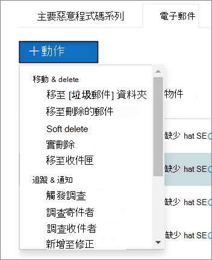

# Microsoft Defender for Office 365 的自動化調查和回應運作方式How automated investigation and response works in Microsoft Defender for Office 365

在觸發安全性警示時，您的安全性運作小組會檢查這些警示，並採取步驟來保護您的組織。As security alerts are triggered, it's up to your security operations team to look into those alerts and take steps to protect your organization. 在某些情況下，安全性作業小組可能感覺到所觸發的警示數量所淹沒。Sometimes, security operations teams can feel overwhelmed by the volume of alerts that are triggered. Microsoft Defender for Office 365 中 (AIR) 功能的自動化調查和回應可提供協助。Automated investigation and response (AIR) capabilities in Microsoft Defender for Office 365 can help.

AIR 可讓您的安全性運作小組更有效率地運作。AIR enables your security operations team to operate more efficiently and effectively. AIR 功能包括自動調查處理程式，以回應目前存在的已知威脅。AIR capabilities include automated investigation processes in response to well-known threats that exist today. 適當的修正動作等待核准，讓您的安全性作業小組能夠回應偵測到的威脅。Appropriate remediation actions await approval, enabling your security operations team to respond to detected threats.

本文說明 AIR 如何透過數個範例運作。This article describes how AIR works through several examples. 當您準備好開始使用 AIR 時，請參閱 [自動調查和回應威脅](office-365-air.md)。When you're ready to get started using AIR, see [Automatically investigate and respond to threats](office-365-air.md).

- [範例1：使用者報告的網路釣魚郵件啟動調查行動手冊Example 1: A user-reported phish message launches an investigation playbook](#example-a-user-reported-phish-message-launches-an-investigation-playbook)
- [範例2：安全性管理員會觸發來自威脅瀏覽器的調查Example 2: A security administrator triggers an investigation from Threat Explorer](#example-a-security-administrator-triggers-an-investigation-from-threat-explorer)
- [範例3：安全操作小組使用 Office 365 管理活動 API，將 AIR 與其 SIEM 整合Example 3: A security operations team integrates AIR with their SIEM using the Office 365 Management Activity API](#example-a-security-operations-team-integrates-air-with-their-siem-using-the-office-365-management-activity-api)

## 範例：使用者報告的網路釣魚郵件啟動調查行動手冊Example: A user-reported phish message launches an investigation playbook

假設組織中的使用者收到他們認為是網路釣魚企圖的電子郵件。Suppose that a user in your organization receives an email that they think is a phishing attempt. 使用者在報告這類訊息時，會使用 [報告訊息增益集](enable-the-report-message-add-in.md) 或 [報告網路釣魚增益集](enable-the-report-phish-add-in.md) 將其傳送至 Microsoft 進行分析。The user, trained to report such messages, uses the [Report Message add-in](enable-the-report-message-add-in.md) or the [Report Phishing add-in](enable-the-report-phish-add-in.md) to send it to Microsoft for analysis. 提交也會傳送至您的系統，而且會顯示在 **提交** 視圖中 (先前稱為 **使用者報告** 的 view) 。The submission is also sent to your system and is visible in Explorer in the **Submissions** view (formerly referred to as the **User-reported** view). 此外，使用者報告的訊息現在會觸發以系統為基礎的資訊性警示，這會自動啟動調查行動手冊。In addition, the user-reported message now triggers a system-based informational alert, which automatically launches the investigation playbook.

在根調查階段中，會評估電子郵件的各個層面。During the root investigation phase, various aspects of the email are assessed. 這些方面包括：These aspects include:

- 決定可能的威脅類型;A determination about what type of threat it might be;
- 誰送出;Who sent it;
- 電子郵件傳送來源的 (傳送基礎結構) ;Where the email was sent from (sending infrastructure);
- 電子郵件的其他實例是否已傳遞或封鎖;Whether other instances of the email were delivered or blocked;
- 我們分析員的評估;An assessment from our analysts;
- 電子郵件是否與任何已知的市場活動相關聯;Whether the email is associated with any known campaigns;
- 等等。and more.

完成根調查之後，「行動手冊」會提供建議執行的動作清單，以供原始電子郵件和與其相關聯的實體使用。After the root investigation is complete, the playbook provides a list of recommended actions to take on the original email and entities associated with it.

接下來，會執行數個威脅調查和搜尋步驟：Next, several threat investigation and hunting steps are executed:

- 類似的電子郵件會透過電子郵件聚簇搜尋加以識別。Similar email messages are identified via email cluster searches.
- 此信號是與其他平臺（例如 [Microsoft Defender For Endpoint](https://docs.microsoft.com/windows/security/threat-protection/microsoft-defender-atp/microsoft-defender-advanced-threat-protection)）共用。The signal is shared with other platforms, such as [Microsoft Defender for Endpoint](https://docs.microsoft.com/windows/security/threat-protection/microsoft-defender-atp/microsoft-defender-advanced-threat-protection).
- 決定是否任何使用者已透過可疑電子郵件訊息中的任何惡意連結進行按一下。A determination is made on whether any users have clicked through any malicious links in suspicious email messages.
- 在 Exchange Online Protection ([EOP](exchange-online-protection-overview.md)) 和 ([Microsoft Defender for Office 365](office-365-atp.md)) 中進行檢查，以查看使用者是否已報告任何其他類似的郵件。A check is done across Exchange Online Protection ([EOP](exchange-online-protection-overview.md)) and ([Microsoft Defender for Office 365](office-365-atp.md)) to see if there are any other similar messages reported by users.
- 會執行檢查以查看使用者是否遭到破壞。A check is done to see if a user has been compromised. 這種檢查會利用跨 Office 365、 [Microsoft Cloud App Security](https://docs.microsoft.com/cloud-app-security)和 [Azure Active Directory](https://docs.microsoft.com/azure/active-directory)的信號，以關聯任何相關的使用者活動異常。This check leverages signals across Office 365, [Microsoft Cloud App Security](https://docs.microsoft.com/cloud-app-security), and [Azure Active Directory](https://docs.microsoft.com/azure/active-directory), correlating any related user activity anomalies.

在搜尋階段中，會將風險和威脅指派給各種搜尋步驟。During the hunting phase, risks and threats are assigned to various hunting steps.

修正是行動手冊的最後階段。Remediation is the final phase of the playbook. 在此階段中，會根據調查和搜尋階段採取補救措施。During this phase, remediation steps are taken, based on the investigation and hunting phases.

## 範例：安全性管理員會觸發來自威脅瀏覽器的調查Example: A security administrator triggers an investigation from Threat Explorer

除了警示所觸發的自動調查之外，您的組織的安全性運作小組也可在 [威脅瀏覽器](threat-explorer.md)的視圖中觸發自動調查。In addition to automated investigations that are triggered by an alert, your organization's security operations team can trigger an automated investigation from a view in [Threat Explorer](threat-explorer.md).  這種調查也會建立警示，使 Microsoft Defender 事件和外部 SIEM 工具可以查看已觸發此調查。This investigation also creates an alert, so that Microsoft Defender Incidents and external SIEM tools can see that this investigation was triggered.

例如，假設您在瀏覽器中使用 **惡意** 代碼視圖。For example, suppose that you are using the **Malware** view in Explorer. 您可以使用圖表下方的索引標籤，選取 [ **電子郵件** ] 索引標籤。如果您選取清單中的一或多個專案，則會啟動 **+ 動作** 按鈕。Using the tabs below the chart, you select the **Email** tab. If you select one or more items in the list, the **+ Actions** button activates.

您可以使用 [ **動作** ] 功能表，選取 [ **觸發調查**]。Using the **Actions** menu, you can select **Trigger investigation**.

類似于警示所觸發的行動行動方式，從瀏覽器中的視圖觸發的自動調查包括根調查、識別和關聯威脅的步驟，以及緩解這些威脅的建議動作。Similar to playbooks triggered by an alert, automatic investigations that are triggered from a view in Explorer include a root investigation, steps to identify and correlate threats, and recommended actions to mitigate those threats.

## 範例：使用 Office 365 管理活動 API，安全性運作小組與其 SIEM 整合 AIRExample: A security operations team integrates AIR with their SIEM using the Office 365 Management Activity API

Microsoft Defender for Office 365 中的 AIR 功能包括 [報告 & 詳細資料](air-view-investigation-results.md) ，安全性作業小組可用以監視和處理威脅。AIR capabilities in Microsoft Defender for Office 365 include [reports & details](air-view-investigation-results.md) that security operations teams can use to monitor and address threats. 不過，您也可以整合 AIR 功能與其他解決方案。But you can also integrate AIR capabilities with other solutions. 範例包括安全性資訊和事件管理 (SIEM) 系統、案例管理系統或自訂報告解決方案。Examples include a security information and event management (SIEM) system, a case management system, or a custom reporting solution. 您可以使用 [Office 365 管理活動 API](https://docs.microsoft.com/office/office-365-management-api/office-365-management-activity-api-reference)來完成這些類型的整合。These kinds of integrations can be done by using the [Office 365 Management Activity API](https://docs.microsoft.com/office/office-365-management-api/office-365-management-activity-api-reference).

例如，在最近，組織會設定安全性作業小組的方式，以查看已由 AIR 處理的使用者報告網路釣魚警報。For example, recently, an organization set up a way for their security operations team to view user-reported phish alerts that were already processed by AIR. 其解決方案會將相關的警示與組織的 SIEM 伺服器及其案例管理系統整合在一起。Their solution integrates relevant alerts with the organization's SIEM server and their case-management system. 此解決方案大幅減少誤報的數目，讓他們的安全性運作小組能夠專注于實際威脅的時間和工作。The solution greatly reduces the number of false positives so that their security operations team can focus their time and effort on real threats. 若要深入瞭解此自訂解決方案，請參閱 [技術社區博客：使用 Microsoft Defender For Office 365 和 O365 管理 API，改善 SOC 的效能](https://techcommunity.microsoft.com/t5/microsoft-security-and/improve-the-effectiveness-of-your-soc-with-office-365-atp-and/ba-p/1525185)。To learn more about this custom solution, see [Tech Community blog: Improve the Effectiveness of your SOC with Microsoft Defender for Office 365 and the O365 Management API](https://techcommunity.microsoft.com/t5/microsoft-security-and/improve-the-effectiveness-of-your-soc-with-office-365-atp-and/ba-p/1525185).

## 後續步驟Next steps

- [開始使用 AIRGet started using AIR](office-365-air.md)
- [查看擱置中或已完成的修復動作View pending or completed remediation actions](air-review-approve-pending-completed-actions.md)
