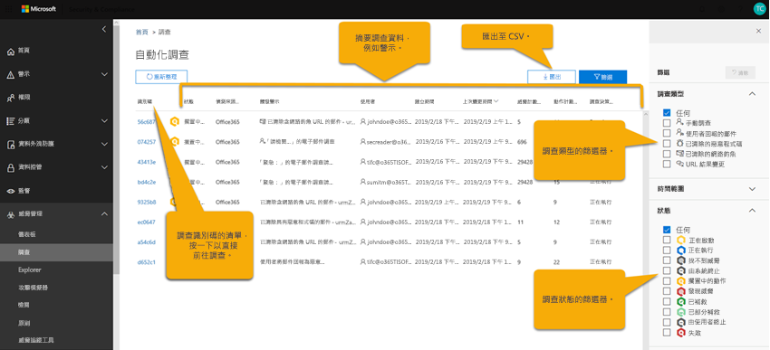
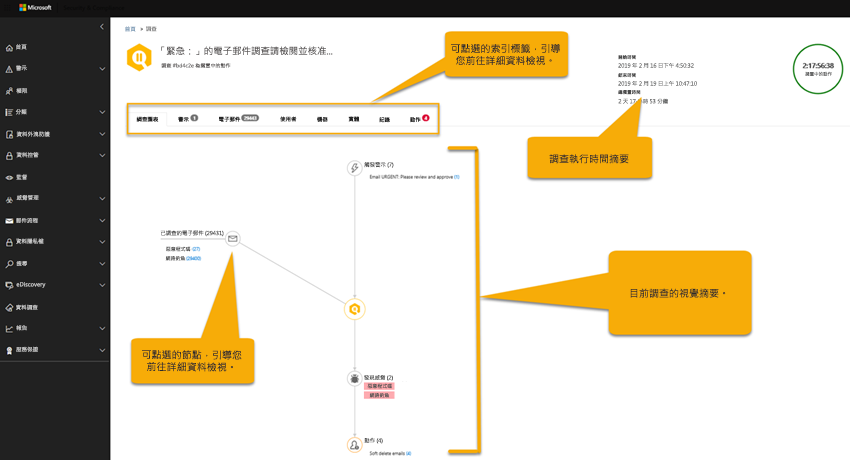

# 自動化的調查和 Office 365 中的回應 （空調）

自動化的調查及回應 （空調） 功能可讓您回應熟知威脅存在於今天執行自動化的調查程序。 空調可協助您操作更有效率的安全性作業小組。
- 若要取得航空的運作方式的概觀，請使用本文。
- 若要開始使用空調，請參閱[自動調查及回應 Office 365 中的威脅](office-365-air.md)。

> [!TIP]
> 您有 Microsoft 365 E5 或 Microsoft 365 E3 以及身分識別與威脅防護產品？ 考慮嘗試 [Microsoft 威脅防護](../mtp/microsoft-threat-protection.md)。

## 航空的整體流程

在高的層級，空調流程的運作方式如下：

|階段  |涉及的內容  |
|---------|---------|
|1     |由 Office 事件觸發[警示](#alerts)並[安全性 playbook](#security-playbooks)啟始選取警示自動化的調查。   或者，安全性分析師可以[手動啟動自動化的調查](#example-a-security-administrator-triggers-an-investigation-from-threat-explorer)，請從[Explorer](threat-explorer.md)電子郵件。        |
|2     |自動化的調查當執行時，它會收集有關電子郵件與該電子郵件 – 檔案、 Url 和收件者相關的實體的其他資料。  調查的範圍可以增加，因為會觸發新的相關的警示。         |
|3     |期間和之後自動調查，[詳細資料和結果](#investigation-graph)可供檢視。 結果包含[建議的動作](#recommended-actions)可以採取回應及修復任何發現的威脅。 此外，也可以使用[playbook 記錄](#playbook-log)中追蹤調查的所有活動。  如果您的組織會使用自訂的報表解決方案或協力廠商解決方案，您可以[使用 Office 365 管理活動 API](office-365-air.md#use-the-office-365-management-activity-api-for-custom-or-third-party-reporting-solutions) ，可檢視自動化的調查和威脅的相關資訊。         |
|4     |安全性作業小組會檢閱調查結果與建議，並核准修復動作。 在 Office 365 中，只能在貴組織的安全性小組核准時採取補救動作。         |

下列各節提供更多詳細資訊空調，包括提醒、 安全性 playbooks 和調查詳細資料相關的詳細資料。 此外，本文中包含航空的運作方式的兩個範例。 若要開始使用空調，請參閱[自動調查及回應 Office 365 中的威脅](office-365-air.md)。

## 警示

[提醒](../../compliance/alert-policies.md#viewing-alerts)代表觸發程序適用於安全性事件回應作業小組工作流程。 排列優先順序的調查，同時確保沒有威脅 unaddressed 提醒右組是一項挑戰。 時以手動方式執行提醒到調查，安全性作業小組必須搜尋，並與相互關聯實體 （例如內容、 裝置及使用者） 威脅的風險。 這類任務及工作流程可很耗時及牽涉到多個工具和系統。 空調、 調查與 Office 365 安全性事件回應會自動完成察覺主要的安全性與威脅管理警報自動觸發安全性回應 playbooks。 

目前的空調，從下列幾種類型的警示原則中產生警示，可自動調查：  

- 偵測到有潛在的惡意 URL 點擊
- 報告的釣魚程式 * 作為使用者的電子郵件
- 電子郵件包含惡意程式碼傳遞 * 後移除
- 電子郵件訊息包含傳遞 * 後移除的釣魚程式 Url
- 傳送模式偵測到可疑的電子郵件#
- 使用者限制而無法傳送電子郵件#

> [!NOTE]
> 以星號 （*） 標記的警示關閉的電子郵件通知與指派安全性 & 合規性中心，各自的警示原則*提示資訊*嚴重性。 電子郵件通知可以開啟透過[警示原則設定](../../compliance/alert-policies.md#alert-policy-settings)。 以雜湊 （#） 標記的提醒是通常可公開預覽 playbooks 相關聯的提醒。

若要檢視提醒，安全性 & 合規性中心中，選擇 [**提醒** > **檢視警示**。 選取警示若要檢視其詳細資料，並從該處，使用的**檢視調查**連結移至對應的[調查](#investigation-graph)。  

> [!NOTE]
> 預設為 [警示] 檢視中隱藏資訊警示。 若要查看它們，請變更篩選功能，包括資訊警示的警示。

如果您的組織管理您的安全性提醒透過警示管理系統、 服務管理系統或安全性資訊和事件管理 (SIEM) 的系統，您可以透過 [電子郵件通知，或是透過[Office 365 管理活動 API](https://docs.microsoft.com/office/office-365-management-api/office-365-management-activity-api-reference)該系統傳送 Office 365 警示。 透過電子郵件或 API 調查警示通知包含連結來存取安全性 & 合規性中心，啟用快速瀏覽到調查指派的安全性系統管理員中的警示。

 

## 安全性 playbooks

安全性 playbooks 所面臨的自動化 Office 進階威脅防護和 Microsoft 威脅防護中的核心的後端原則。 根據常見的真實世界的安全性案例 playbooks 空調中所提供且開發安全性為基礎的意見反應安全性作業小組。 當組織內會觸發特定的警示時，就會自動啟動安全性 playbook。 之後會觸發警示，相關聯的 playbook 執行自動化調查及回應 （空調） 系統。 調查步驟透過分析根據該特定警示 playbook，查看所有關聯的中繼資料 （包括電子郵件、 使用者、 主旨、 寄件者等等） 的提醒。 根據調查 playbook 的結果，空調建議一組的動作，貴組織的安全性小組可以採取控制項，並降低威脅。 

您會看到與空調安全性 playbooks 被設計來處理最常見的威脅組織遇到今天的電子郵件。 他們根據安全性作業和事件回應小組，包括協助防禦 Microsoft 和我們的客戶資產的輸入。

### 安全性 playbooks 已推出階段

航空的一部分，安全性 playbooks 已推出階段。 階段 1 是現在可使用，並包含數個 playbooks 提供建議的安全性系統管理員可以檢閱和核准的動作：
- 使用者報告的釣魚程式訊息
- URL 按一下 verdict 變更
- 偵測到的惡意程式碼後傳遞 （惡意程式碼時能量光束）
- 釣魚程式偵測到後續傳遞 ZAP （Phish 時能量光束）

階段 1 也包含觸發的系統管理員的電子郵件調查 （使用[威脅總管](threat-explorer.md)） 的支援。

階段 2 現在是與**公開預覽**中提供建議的動作，並在調查問題達到安全性管理員下列 playbooks 的進度：
- 使用者回報為遭入侵 （公用預覽）

將發行進一步 playbooks，因為它們已完成。 請造訪[Microsoft 365 藍圖](https://www.microsoft.com/microsoft-365/roadmap)請參閱什麼是計劃的及接下來推出。

### Playbooks 包括調查與建議

在空調，每個安全性 playbook 包括： 
- 根調查的電子郵件的實體 （檔案、 Url、 收件者、 IP 位址等等。），
- 進一步四處尋找類似組織所接收的電子郵件 
- 識別並對應其他潛在威脅，所採取的步驟和 
- 建議的威脅修復動作。

每個高階步驟皆包含一些 substeps 執行提供深層、 詳細又詳盡回應威脅。

## 自動化的調查

[自動化的調查] 頁面上顯示貴組織的調查和其目前狀態。

 
  
您可以：
- 直接前往調查 （選取**調查識別碼**）。
- 套用篩選。 選擇 [從**調查類型**、**時間範圍**、**狀態**或這些項目的組合。
- 將資料匯出至.csv 檔案。

調查狀態表示分析和動作的進度。 當調查執行時，狀態會變更為表示是否已找到威脅，以及是否已核准的動作。 

|狀態  |其意思  |
|---------|---------|
|啟動中 | 調查已排入佇列推出開始 |
|正在執行 | 調查已啟動，並且所進行的分析 |
|沒有找到的威脅 | 調查已完成其分析，而且找不到任何威脅 |
|由系統終止 | 調查已不關閉，並將在 7 天後過期 |
|擱置中的巨集指令 | 調查找到威脅與建議的動作。  調查會繼續執行後已找到初始威脅，並建議動作，所以您應該查看記錄檔之前核准，看看分析器是否仍為正在進行中的動作。 |
|找到的威脅 | 調查找到威脅，但威脅沒有空調內可用的動作。  以下是使用者動作是沒有方向尚未空調動作。 |
|修復 | 調查完成，並完全修復 （已核准所有動作） |
|部分修復 | 調查完成，並建議的動作的一些已核准 |
|終止的使用者 | 系統管理員終止調查 |
|失敗 | 禁止達到上威脅結論調查期間發生錯誤 |
|排入佇列的節流設定 | 調查正在等候由於系統處理限制 （以保護服務效能） 的分析 |
|終止的節流設定 | 在有足夠的時間，因為調查磁碟區及處理限制的系統無法完成調查。 您可以選取 [檔案總管中的 [電子郵件，然後選取調查動作 retrigger 調查。 |

### 調查圖表

當您開啟特定調查時，您會看到 [調查 graph] 頁面。 此頁面會顯示所有不同的實體： 電子郵件、 使用者 （和其活動），以及已自動調查一部分警示所觸發的裝置。

您可以：
- 取得目前調查的視覺化概觀。
- 檢視調查工期的摘要。
- 若要檢視該節點的詳細資料視覺效果中選取節點。
- 若要檢視該索引標籤的詳細資訊，在頂端選取] 索引標籤。

### 警示調查

調查的 [**提醒**] 索引標籤中，您可以看到與調查有關的提醒。 詳細資料包含觸發調查警示和調查相互關聯其他相關的警示，例如風險登入、 違反 DLP 原則等。 此頁面上，從安全性分析師也可以檢視其他詳細資料上獲取個別警示。

![產生提醒] 頁面上](../media/air-investigationalertspage.png)

您可以：
- 取得目前的觸發警示和任何相關聯的警示的視覺化概觀。
- 若要開啟 [顯示完整警示的詳細資訊的飛出視窗頁面清單中，選取 [警示。

### 電子郵件調查

在調查的**電子郵件**] 索引標籤中，您可以看到原始的電子郵件和類似的電子郵件被識別為調查的一部分的叢集。 

指定組織中的使用者傳送及接收，再加上電子郵件通訊和攻擊的多重使用者本質、 的程序的電子郵件的真正量 
- 根據類似的屬性，從郵件標頭、 內文、 URL 及附件; 叢集的電子郵件 
- 從良好的電子郵件; 分隔惡意電子郵件和 
- 對惡意電子郵件採取的動作 

可能需要很多時間。 空調現在會自動執行此程序，儲存您的組織安全性小組時間和精力。 

可能會在電子郵件分析步驟期間識別的電子郵件叢集的兩種不同類型： 相似性叢集與標記叢集。 
- 相似性叢集會以類似的寄件者和內容屬性的電子郵件狩獵所識別的電子郵件訊息。 這些叢集會評估為惡意內容根據原始偵測結果。 包含足夠惡意電子郵件偵測的電子郵件叢集會被視為惡意。
- 指示器叢集是識別狩獵相同的標記實體 （檔案雜湊或 URL） 從原始的電子郵件的電子郵件訊息。 時的原始的檔案/URL 實體便會被視為惡意，空調套用於標記 verdict 整個叢集的電子郵件訊息包含的實體。 識別為惡意程式碼檔案表示包含該檔案的電子郵件的叢集會被視為惡意程式碼的電子郵件。

叢集的目標是要搜尋並找出由攻擊或活動的一部分的相同寄件者所傳送的其他相關的電子郵件。  在某些情況下，合法電子郵件可能會觸發的調查 （例如使用者回報行銷電子郵件）。  在這些案例中，叢集的電子郵件應該識別它適當會讓它將不惡意 – 電子郵件叢集**不**表示威脅，也不將它建議電子郵件移除。

[**電子郵件**] 索引標籤也會顯示電子郵件項目相關的調查，例如使用者回報的電子郵件的詳細資訊，原始的電子郵件報告，電子郵件訊息 zapped 因為惡意程式碼/釣魚程式等等。

在 [電子郵件] 索引標籤上目前所識別的電子郵件計數代表顯示在 [**電子郵件**] 索引標籤上的所有電子郵件訊息的總和。因為電子郵件訊息中都有多個叢集，實際電子郵件訊息總數識別 （和受影響的補救動作） 跨所有叢集與原始收件者的電子郵件是唯一的電子郵件訊息存在的計數。 

檔案總管和空調計數上每個收件者為基礎的電子郵件，因為安全性結果、 動作和傳遞位置而異每個收件者為基礎。 因此原始的電子郵件傳送給三個使用者計數為總計的三個電子郵件，而不是一個電子郵件。 請注意那里可能會取得一封電子郵件的其中的情況下被計算兩個或更多時間，因為電子郵件可能會在其上有多個動作，而且可能會有多個電子郵件複本一次的所有動作會都發生。 例如，在傳遞偵測到惡意程式碼電子郵件可能會導致封鎖 （隔離） 電子郵件以及已被取代的電子郵件 （威脅檔案取代警告： 檔案，再傳遞到使用者的信箱）。 實際上，有兩個副本的電子郵件系統中，因為兩者都可能計算叢集計數中。 

調查次計算電子郵件計數，當您開啟調查延伸顯示 （根據基準查詢） 才會重新計算某些計數。 電子郵件計算所顯示的電子郵件] 索引標籤上的電子郵件叢集，並在叢集彈出式視窗上所顯示的電子郵件數量值調查次計算，並不會變更。 在 [電子郵件] 索引標籤的電子郵件叢集彈出式視窗底部顯示電子郵件計數，且在檔案總管中顯示的電子郵件訊息的計數會反映調查的初始分析後收到電子郵件訊息。 因此顯示 10 的電子郵件的原始數量電子郵件叢集會顯示電子郵件清單總數的 15 五個多個電子郵件訊息送達之間調查分析階段和系統管理員檢閱調查時。  同樣地舊調查可能啟動具有比 Explorer 查詢顯示，因為 ATP P2 7 天的 trials 和付費授權的 30 天後過期資料更大的計數。  顯示兩者計算歷史和完成目前在不同的檢視計數若要指出電子郵件影響調查和到時間現行的目前影響次該修復是執行。

做為範例，請考慮下列案例。 三個電子郵件的第一個叢集已被視為是釣魚程式。 類似郵件具有相同的 IP 和主旨的另一個叢集已找到，而且視為惡意，有些已識別為釣魚程式初始偵測期間。 

![空調電子郵件調查] 頁面](../media/air-investigationemailpage.png)

您可以：
- 取得目前的叢集結果和威脅找到的視覺化概觀。
- 按一下 [叢集實體或威脅清單] 以開啟飛出視窗] 頁面上顯示的完整警示的詳細資料。
- 進一步調查的電子郵件叢集按一下頂端的 '電子郵件叢集詳細資料] 索引標籤上的 '在檔案總管中開啟' 連結

> [!NOTE]
> 在電子郵件的內容，您可能會看到大量異常威脅表面調查的一部分。 磁碟區異常指出相較於舊版項調查事件時間前後的類似電子郵件訊息中的特殊圖文集。 此特殊圖文集的特性類似的電子郵件流量 (例如主旨] 和 [寄件者的網域，本文相似性和寄件者 IP) 是一般的電子郵件行銷活動或攻擊的開始。 不過，大量、 垃圾郵件和合法電子郵件行銷活動常共用這些特性。 磁碟區異常代表潛在威脅，並據此可能少數嚴重相較惡意程式碼或釣魚程式的威脅，用來識別的防毒引擎、 爆炸或惡意的信譽。

### 使用者調查

在 [**使用者**] 索引標籤中，您可以看到識別為調查的一部分的所有使用者。 使用者帳戶出現在調查時沒有事件或可能影響這些使用者帳戶，或遭到盜用的指示。

例如，在下列映像，空調已識別危害和異常根據新的收件匣規則所建立的指標。 調查的其他詳細資料 （辨識項） 可透過此危害的指標] 索引標籤內的詳細檢視，而且異常也可包含從[Microsoft Cloud App Security](https://docs.microsoft.com/cloud-app-security)的異常偵測。

![空調調查的使用者] 頁面](../media/air-investigationuserspage.png)

您可以：
- 取得已識別的使用者結果與風險找到的視覺化概觀。
- 選取使用者，若要開啟 [飛出視窗] 頁面上顯示的完整警示的詳細資料。

### 機器調查

**機器**索引標籤上，您可以看到識別為調查的一部分的所有機器。 

某些 playbooks 的一部分，空調相互關聯至裝置 （例如 Zapped 惡意程式碼） 的電子郵件威脅。 例如，調查遞給惡意檔案雜湊跨[Microsoft Defender ATP](https://docs.microsoft.com/windows/security/threat-protection/microsoft-defender-atp/microsoft-defender-advanced-threat-protection
)調查。 這可讓您的使用者，以協助確保已解決威脅，在雲端和跨端點相關機器的自動化調查。 

您可以：
- 取得目前機器和威脅找到的視覺化概觀。
- 選取 [若要開啟 [檢視電腦，到 Microsoft defender 資訊安全中心中相關的[Microsoft Defender ATP 調查](https://docs.microsoft.com/windows/security/threat-protection/microsoft-defender-atp/automated-investigations)。

### 實體調查

在 [**實體**] 索引標籤上，您可以看到識別並分析一部分調查的實體。 

在這裡，您可以看到的調查實體與類型的實體，例如電子郵件、 叢集、 IP 位址、 使用者和更多詳細資料。 您也可以查看多少實體進行分析，且威脅，與每個相關聯。 

![空調調查實體] 頁面上](../media/air-investigationentitiespage.png)

您可以：
- 取得調查實體和威脅找到的視覺化概觀。
- 選取要開啟飛出視窗] 頁面顯示相關的實體詳細資料的實體。

### Playbook 記錄檔

在 [**記錄**] 索引標籤中，您可以看到調查期間所發生的所有 playbook 步驟。 記錄檔會擷取所有分析器和空調一部分由 Office 365 自動調查功能完成動作的完整詳細目錄。 它本身、 描述及的實際工期提供清楚的所有所採取的步驟，包括巨集指令檢視從開始到完成。 

您可以：
- 取得看到所採取的 playbook 步驟的視覺化概觀。
- 將結果匯出至 CSV 檔案。
- 篩選的檢視。

|分析器 | 描述 |
|-----|-----|
|DLP 違規調查 |調查[Office 365 資料外洩防護](../../compliance/data-loss-prevention-policies.md)(DLP) 所偵測到任何違規 |
|電子郵件指標擷取 |從標頭、 本文及調查的電子郵件訊息的內容解壓縮指標 |
|檔案雜湊信譽 |偵測異常根據使用者與您組織中的機器檔案雜湊 |
|郵件叢集識別碼 |電子郵件叢集分析根據標頭、 內文、 內容及 Url |
|郵件叢集的磁碟區分析 |電子郵件叢集分析根據輸出郵件流程的磁碟區模式 |
|郵件委派調查 |調查與此調查的使用者信箱的郵件委派存取 |
|郵件轉寄規則調查 |調查任何郵件轉寄規則與此調查的使用者信箱 |
|未接偵測到的惡意程式碼 |偵測未接的惡意程式碼傳遞至貴組織中使用者的信箱 |
|隨選爆炸 |隨選爆炸觸發電子郵件訊息、 附件及 Url |
|輸出郵件異常調查 |偵測異常根據貴組織中的使用者傳送模式的歷程記錄的郵件流程 |
|輸出的惡意軟體和垃圾郵件異常調查 |偵測到組織內部和輸出惡意程式碼，釣魚程式，或垃圾郵件來自您組織中的使用者 |
|寄件者網域調查 |從[Microsoft 智慧型安全性 Graph](https://www.microsoft.com/security/operations/intelligence)和外部威脅情報來源網域信譽的隨選核取 |
|寄件者 IP 調查 | 從[Microsoft 智慧型安全性 Graph](https://www.microsoft.com/security/operations/intelligence)和外部威脅情報來源 IP 信譽的隨選核取 |
|URL 按一下調查 | 調查由[Office 365 ATP 安全連結](atp-safe-links.md)保護您組織中的使用者點選 |
|URL 信譽調查 |隨選檢查 URL 信譽從[Microsoft 智慧型安全性 Graph](https://www.microsoft.com/security/operations/intelligence)和外部威脅情報來源 |
|使用者活動調查 |分析[Microsoft 雲端 App 安全性](https://docs.microsoft.com/cloud-app-security/what-is-cloud-app-security)中的使用者活動異常 |
|使用者回報的電子郵件指標擷取 |從標頭、 本文及調查的[使用者回報的電子郵件](enable-the-report-message-add-in.md)的內容解壓縮指標 |

### 建議的動作

在 [**動作**] 索引標籤中，您可以看到建議的修復後調查已完成的所有 playbook 動作。 

動作擷取 Microsoft 建議您採取調查結尾處的步驟。 您可以藉由選取一或多個動作採取以下修復動作。 按一下 [**核准**允許修復以開始。 （所需的適當的權限-'搜尋及清除' 角色，才能執行從檔案總管和空調）。 例如，安全性讀取者可以檢視動作，而不是核准它們。 附註： 您不必核准的每個動作。 如果您與建議的動作不一致，或您的組織未選擇特定類型的動作，接著您可以選擇**拒絕**動作或只需加以略過並不採取任何動作。 核准及/或拒絕的所有動作可讓完全關閉調查 （狀態會變成修復，） 時前面調查狀態變更為部分修復狀態中的某些動作不完整的結果。

![空調調查動作] 頁面上](../media/air-investigationactionspage.png)

您可以：
- 取得 playbook 建議動作的視覺化概觀。
- 選取單一動作或多個動作。
- 核准或拒絕建議的動作與註解。
- 將結果匯出至 CSV 檔案。
- 篩選的檢視。

## 補救動作

當自動化的調查正在執行，或是已完成時，您通常會看到一或多個修復動作。 下表列出 Office 365 空調中可能的補救動作。

|動作 | 描述 |
|-----|-----|
|封鎖 URL (點擊時) |保護電子郵件和包含惡意 Url 的文件。 這可讓封鎖惡意連結和任何相關透過[安全連結](atp-safe-links.md)的網頁，當使用者按一下 [在現有的 Office 檔案，或較舊的電子郵件訊息中的連結。 |
|虛刪除的電子郵件  |虛刪除特定的電子郵件從使用者的信箱|
|虛刪除的電子郵件叢集  |虛刪除比對所有使用者信箱的查詢的惡意電子郵件訊息|
|關閉外部郵件轉寄 |會移除特定使用者的信箱轉寄規則|

## 範例： 使用者回報的釣魚程式訊息啟動調查 playbook

當您組織中的使用者送出的電子郵件訊息和報告至 Microsoft，請使用[報告訊息增益集以進行 Outlook 或 Outlook Web App](enable-the-report-message-add-in.md)，報告也會傳送到您的系統，且使用者報告檢視中顯示在檔案總管。 此使用者回報郵件現在會觸發系統架構資訊警示，這會自動啟動 [調查 playbook。

在根調查階段中，會評估的電子郵件的各個層面。 包括：
- 可能需有哪些類型的威脅它決定;
- 寄件者; 它
- 其中電子郵件寄件地 （傳送基礎結構）;
- 電子郵件的其他執行個體是否已傳遞或封鎖;
- 從我們分析師; 評估
- 是否任何已知的行銷活動; 相關聯的電子郵件
- 等等。

根調查完成後，playbook 會提供建議的動作，才會在原始的電子郵件和與它相關聯的實體清單。
  
接下來，數個威脅調查並狩獵步驟執行：

- 透過電子郵件叢集搜尋識別類似的電子郵件訊息。
- 其他平台，例如[Microsoft Defender ATP](https://docs.microsoft.com/windows/security/threat-protection/microsoft-defender-atp/microsoft-defender-advanced-threat-protection)可共用接收的訊號。
- 決定在任何使用者是否按下可疑的電子郵件訊息中任何前往惡意連結。
- 檢查完成跨 Office 365 Exchange Online Protection ([EOP](exchange-online-protection-eop.md)) 和 Office 365 進階威脅防護 ([ATP](office-365-atp.md))，以查看是否有任何其他類似的訊息報告的使用者。
- 若要查看是否使用者已遭洩露完成查核。 這項檢查跨 Office 365、 [Microsoft Cloud App Security](https://docs.microsoft.com/cloud-app-security)和[Azure Active Directory](https://docs.microsoft.com/azure/active-directory)，相互關聯任何相關的使用者活動異常運用訊號。 

狩獵階段風險和威脅指派給各種狩獵步驟。 

修復為 playbook 的最後一個階段。 在這個階段，採取補救步驟為止，根據調查和狩獵階段。 

## 範例： 安全性系統管理員會觸發從威脅總管調查

除了警示所觸發的自動調查，貴組織的安全性作業小組可以觸發自動進行調查，從[威脅總管](threat-explorer.md)] 中檢視。

例如，假設您正在檢視的資料在檔案總管中關於使用者報告的郵件。 您可以在結果清單中選取項目，然後按一下 [從 （假設您具備適當的補救權限） 的 [動作] 功能表的 [**調查]** 。

![使用者報告中的郵件檔案總管與調查] 按鈕](../media/Explorer-UserReported-Investigate.png)

另一個範例，假設您正在檢視包含惡意程式碼，偵測到的電子郵件的相關資料，並有幾個偵測為包含惡意程式碼的電子郵件訊息。 您可以選取 [**電子郵件**] 索引標籤，選取一或多個電子郵件訊息，然後在 [**動作**] 功能表上選取 [**調查]**。 

類似於 playbooks 觸發警示的通知，會觸發從瀏覽器中檢視的自動調查包含根目錄和調查]，以找出並相互關聯的威脅，步驟及建議的動作來減輕這些威脅。

## 如何取得航空

Office 365 AIR 現在包含在以下訂閱中：

- Microsoft 365 E5
- Office 365 E5
- Microsoft 威脅防護
- Office 365 進階威脅防護方案 2

如果您不需要任何這些訂閱，[開始免費試用版](https://go.microsoft.com/fwlink/p/?LinkID=698279&culture=en-US&country=US)。

若要深入了解可用的功能，請造訪[進階威脅防護 (ATP) 計劃的功能可用性](https://docs.microsoft.com/office365/servicedescriptions/office-365-advanced-threat-protection-service-description#feature-availability-across-advanced-threat-protection-atp-plans)。

## 若要使用空調功能的必要權限

授與權限是透過特定角色，例如，如下表所述： 

|工作 |所需的角色 |
|--|--|
|若要設定空調功能 |下列其中一個下列角色：  - **全域系統管理員** - **安全性系統管理員**  可以指派這些角色，在[Azure Active Directory](https://docs.microsoft.com/azure/active-directory/users-groups-roles/directory-assign-admin-roles)中或在[Office 365 安全性 & 合規性中心](https://docs.microsoft.com/microsoft-365/security/office-365-security/permissions-in-the-security-and-compliance-center)。 |
|核准或拒絕建議的動作|下列其中一個指派[Office 365 安全性 & 合規性中心](https://docs.microsoft.com/microsoft-365/security/office-365-security/permissions-in-the-security-and-compliance-center)或[Azure Active Directory](https://docs.microsoft.com/azure/active-directory/users-groups-roles/directory-assign-admin-roles)中的下列角色）： - **全域系統管理員**  - **安全性系統管理員** - **安全性讀取者**  --- 且 --- - **搜尋及清除**（此角色指派只能在[Office 365 安全性 & 合規性中心](https://docs.microsoft.com/microsoft-365/security/office-365-security/permissions-in-the-security-and-compliance-center)。 您可能必須建立新角色群組，並將 「 搜尋及清除角色新增至該新的角色群組。）

## 後續步驟

- [開始使用 Office 365 中的空調](office-365-air.md)
- [了解 Microsoft Defender ATP 中的 AIR](https://docs.microsoft.com/windows/security/threat-protection/microsoft-defender-atp/automated-investigations) (部分機器翻譯) 
- [造訪 Microsoft 365 藍圖，查看即將推出的功能](https://www.microsoft.com/microsoft-365/roadmap?filters=)

## 另請參閱

- [Microsoft 威脅防護](../mtp/microsoft-threat-protection.md)
- [自動化的調查和 Microsoft 威脅防護中的補救措施 （空調）](../mtp/mtp-autoir.md)
