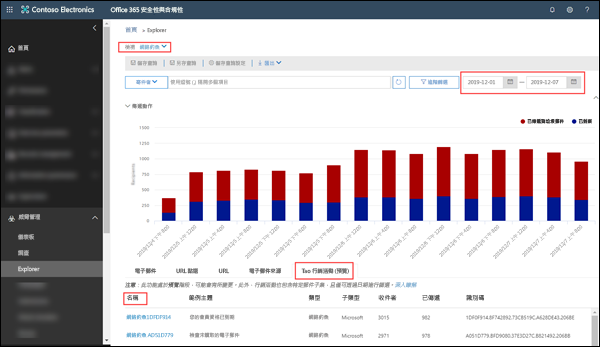
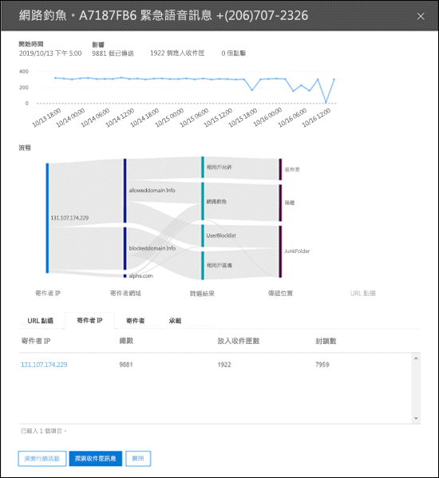
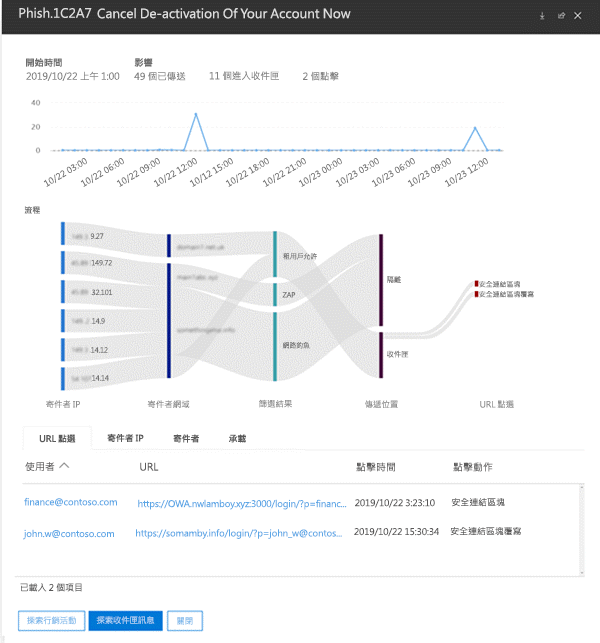

# Office 365 ATP 中的行銷活動檢視Campaign Views in Office 365 ATP

> [!NOTE]
> 本主題中所述的功能目前處於預覽，且可能會變更。The features described in this topic are currently in preview, and are subject to change.

行銷活動檢視是 Office 365 安全性與合規性中心中進階威脅防護 (ATP) 的一項功能，可識別和分類服務中的網路釣魚攻擊。Campaign Views is a feature in Advanced Threat Protection (ATP) in the Office 365 Security & Compliance Center that identifies and categorizes phishing attacks in the service. 行銷活動檢視可協助您：Campaign Views can help you to:

- 更有效率地調查和回應網路釣魚攻擊。Efficiently investigate and respond to phishing attacks.

- 更進一步了解攻擊範圍。Better understand the scope of the attack.

- 向決策者展現價值。Show value to decision makers.

行銷活動檢視可讓您較任何人類所能夠，更快速且更完整地查看攻擊的全貌。Campaign Views lets you see the big picture of an attack faster and more complete than any human.

## 什麼是行銷活動？What is a campaign?

行銷活動是針對一或多個組織的協調式電子郵件攻擊。A campaign is a coordinated email attack against one or many organizations. 現今，竊取認證和公司資料的電子郵件攻擊是一項龐大且能賺錢的生意。Today, email attacks that steal credentials and company data are a big and lucrative business. 隨著為了阻擋攻擊的技術增加，攻擊者更為老練而足以修改其方法，以確保持續成功。As technologies increase in an effort to stop attacks, attackers are sophisticated enough to modify their methods in an effort to ensure continued success.

Microsoft 利用大量防網路釣魚、反垃圾郵件和反惡意程式碼資料，以及在全球各地的整個 Office 365 服務的經驗，以找出行銷活動。Microsoft leverages the vast amounts of anti-phishing, anti-spam, and anti-malware data and experience across the entire Office 365 service world-wide to identify campaigns. 系統會根據數個因素分析和分類攻擊資訊。The attack information is analyzed and classified according to several factors. 例如：For example:

- **攻擊來源**：來源 IP 位址和寄件者電子郵件網域。**Attack source**: Source IP addresses and sender email domains.

- **攻擊訊息屬性**：攻擊訊息的內容、樣式和調性。**Attack message properties**: The content, style, and tone of the attack messages.

- **攻擊收件者**：收件者網域、收件者工作職掌 (系統管理員、執行人員等)、公司類型 (大型、小型、公有、私人等等) 以及產業。**Attack recipients**: Recipient domains, recipient job functions (admins, executives, etc.), company types (large, small, public, private, etc.), and industries.

- **攻擊承載**：惡意連結、附件或其他承載。**Attack payload**: Malicious links, attachments, or other payloads.

## Office 365 安全性與合規性中心行銷活動檢視Campaign Views the Office 365 Security & Compliance Center

您可以在下列位置的[安全性與合規性中心](https://docs.microsoft.com/microsoft-365/compliance/go-to-the-securitycompliance-center)中取得行銷活動檢視：Campaign Views is available in the [Security & Compliance Center](https://docs.microsoft.com/microsoft-365/compliance/go-to-the-securitycompliance-center) at the following locations:

- **威脅管理** \> **總管** \> **檢視** \> **網路釣魚** \> **熱門活動 (預覽)****Threat management** \> **Explorer** \> **View** \> **Phish** \> **Top campaign (Preview)**

- **威脅管理** \> **總管** \> **檢視** \> **所有電子郵件** \> **熱門活動 (預覽)****Threat management** \> **Explorer** \> **View** \> **All email** \> **Top campaign (Preview)**

> [!TIP]
> 目前唯一可用的篩選是日期範圍。Currently, the only filtering that's available is the date range. 如果您沒有看到任何行銷活動資料，請嘗試變更日期範圍。If you don't see any campaign data, try changing the date range.

概觀頁面會顯示有關行銷活動的下列資訊：The overview page shows the following information about the campaign:

- **名稱****Name**

- **樣本主旨**：行銷活動中其中一個訊息的主旨列。**Sample subject**: The subject line of one of the messages in the campaign. 請注意，並非行銷活動中的_所有_訊息都會有這個相同的主旨列。Note that _all_ the messages in the campaign will not necessarily have this same subject line.

- **類型**：目前此值將一律是**網路釣魚**。**Type**: Currently, this value will always be **Phish**.

- **子類型**：本行銷活動要網路釣魚的品牌 (如適用)。**Subtype**: Where available, the brand that is being phished by this campaign. 當偵測是由 ATP 技術驅動時，系統會在子類型值中新增字首 **ATP-**。When the detection is driven by ATP technology, the prefix **ATP-** is added to the subtype value.

- **收件者**：此行銷活動鎖定的使用者數目。**Recipients**: The number of users that were targeted by this campaign.

- **已傳送**：在其收件匣中收到來自此行銷活動訊息的使用者數目。**Delivered**: The number of users that received messages from this campaign into their Inbox.

- **ID**：行銷活動的唯一識別碼。**ID**: A unique identifier for the campaign.

當您按一下行銷活動的名稱時，行銷活動詳細資料會顯示在飛出視窗中。When you click on the name of a campaign, the campaign details appears in a flyout.

## 行銷活動詳細資料Campaign details

在行銷活動詳細資料檢視中，提供有關行銷活動的許多資訊：In the campaign details view, a lot of information is available about the campaign:

- 行銷活動資訊：Campaign information:

  - **識別碼**：與概觀畫面的行銷活動相同的唯一識別碼。**ID**: The same unique identifier of the campaign from the overview screen.

  - **開始**和**結束**：您選取的日期範圍篩選。**Started** and **Ended**: the date range filter you selected.

  - **影響**：在您選取的日期範圍中傳送的訊息數量、「加入收件匣」(也就是傳送到收件匣) 的數量，以及有多少個使用者在網路釣魚訊息中的 URL 承載上點選。**Impact**: the number of messages sent in the date range you selected, how many were "inboxed" (that is, delivered to the Inbox), and how many users clicked on the URL payload in the phishing message.

  - 行銷活動時間表：行銷活動的開始和結束時間，以及一段時間內的訊息量。A timeline of campaign activity: When the campaign started and ended, and the volume of messages over time.

### 行銷活動流程Campaign flow

有關行銷活動的重要詳細資料，會在 [流程]\*\*\*\* 區段中的水平流程圖 (稱為 _Sankey_ 圖表) 中顯示。Important details about the campaign are presented in a horizontal flow diagram (known as a _Sankey_ diagram) in the **Flow** section. 這些詳細資料將協助您了解行銷活動的元素和在組織中的潛在影響。These details will help you to understand the elements of the campaign and the potential impact in your organization.

如果您將游標停留在圖表中的水平帶狀上，您會看到相關訊息的數量 (例如來自特定來源 IP 的訊息、來自使用特定寄件者網域來源 IP 的訊息等)。If you hover over a horizontal band in the diagram, you'll see the number of related messages (for example, messages from a particular source IP, messages from the source IP using the specified sender domain, etc.).

圖表中包含下列資訊：The diagram contains the following information:

- **寄件者 IP****Sender IPs**

- **寄件者網域****Sender domains**

- **篩選結果**：此處的值與可用的防網路釣魚及反垃圾郵件篩選結果有關，如[反垃圾郵件訊息標頭](anti-spam-message-headers.md)中所述。**Filter verdicts**: The values here are related to the available anti-phishing and anti-spam filter verdicts as described in [Anti-spam message headers](anti-spam-message-headers.md). 此處最有意思的是**租用戶允許**值，這表示組織中進行的設定會允許可能已由服務封鎖的訊息 (例如 [允許的寄件者] 清單中的網域)。Of great interest here are the values **Tenant Allow**, which means a configured setting in the organization allowed a message through that would have been otherwise blocked by the service (for example, a domain in the Allowed Senders list).

  - **租用戶封鎖**：此值表示組織中的某個設定 (例如，[封鎖的寄件者](create-block-sender-lists-in-office-365.md)清單中的網域項目) 會同時偵測訊息並判斷傳送該訊息的位置。**Tenant Block**: This value indicates that a setting in your organization (for example, a domain entry in the [Blocked Senders list](create-block-sender-lists-in-office-365.md)) both detected the message and determined where it was delivered. 針對未隔離的訊息，請檢閱您的封鎖的寄件者設定，以判斷傳送訊息的原因。For messages that weren't quarantined, review your blocked senders settings to determine why the message was delivered.

  - **已偵測****Detected**

  - **租用戶允許****Tenant Allow**

- **傳送位置**：您可能想要調查實際傳送給收件者的訊息 (無論是移至 [收件匣] 或 [垃圾郵件] 資料夾)，即使使用者未在訊息中點選承載 URL。**Delivery locations**: You'll likely want to investigate messages that were actually delivered to recipients (either to the Inbox or the Junk Email folder), even if users didn't click on the payload URL in the message. 您也可以透過[在 Office 365 中隔離電子郵件訊息](quarantine-email-messages.md)，來移除隔離的訊息。You can also remove the quarantined messages from [Quarantine email messages in Office 365](quarantine-email-messages.md).

  - **垃圾郵件資料夾****Junk folder**

  - **隔離區****Quarantine**

  - **收件匣****Inbox**

#### URL 點選URL clicks

使用者總是有機會對傳送到收件者的 [收件匣] 或 [垃圾郵件] 資料夾中的訊息採取行動 (亦即，使用者將點選訊息中的惡意 URL)。There's always the chance that messages delivered to the recipient's Inbox or Junk Email folder can be acted upon by the user (that is, user will click on the malicious URL in the message). 如果使用者沒有點選，這是極少程度的成功，不過您當然必須判斷為什麼最初將有害的訊息傳送至其信箱。If they haven't, that's a small measure of success, although you certainly need to determine why the harmful message was delivered to their mailbox in the first place.

如果使用者已點選惡意的 URL，動作會顯示在圖表的 [URL 點選]\*\*\*\* 區域。If a user has clicked on the malicious URL, the actions are displayed in the **URL clicks** area of the diagram.

- **安全連結封鎖**：此值表示收件者點選訊息中的承載 URL，但它已由組織中的 [ATP 安全連結](atp-safe-links.md) 原則封鎖。**Safe Links Block**: This value indicates the recipient clicked on the payload URL in the message, but it was blocked by the [ATP Safe Links](atp-safe-links.md) policies in your organization.

- **安全連結封鎖覆寫**：此值也表示收件者已點選訊息中的承載 URL，而 [ATP 安全連結] 嘗試阻止這些連結，但它們已被允許覆寫封鎖。**Safe Links Block Override**: This value also indicates the recipient clicked on the payload URL in the message, ATP Safe Links tried to stop them, but they were allowed to override the block. 您需要調查[安全連結原則](set-up-atp-safe-links-policies.md)，以查看為何允許使用者覆寫安全連結結果，並點選惡意 URL。You need to investigate your [Safe Links policies](set-up-atp-safe-links-policies.md) to see why users are allowed to override the Safe Links verdict and click on malicious URLs.

### 索引標籤Tabs

行銷活動詳細資料檢視中有數個索引標籤，可讓您進一步調查行銷活動。There are several tabs in the campaign details view that allow you to further investigate the campaign.

- **URL 點選**：如果沒有點選網路釣魚訊息中的承載 URL，則此區段會是空白。**URL Clicks**: If the payload URL in the phishing message wasn't clicked, this section will be blank. 如果使用者可以點選 URL，您If a user was able to click on the URL, you

  - **使用者**\***User**\*

  - **URL**\***URL**\*

  - **點選時間****Click Time**

  - **點選動作****Click Action**

- **寄件者 IP****Sender IPs**

  - **寄件者 IP**\***Sender IP**\*

  - **總數****Total Count**

  - **收件匣計數****Inboxed Count**

  - **封鎖的計數****Blocked Count**

  - **SPF 已通過****SPF Passed**

- **寄件者****Senders**

  - **寄件者****Sender**

  - **總數****Total Count**

  - **收件匣計數****Inboxed Count**

  - **封鎖的計數****Blocked Count**

  - **DKIM 已通過****DKIM Passed**

  - **DMARC 已通過****DMARC Passed**

- **承載****Payloads**

  - **URL**\***URL**\*

  - **總數****Total Count**

\* 按一下此值會開啟新的飛出畫面，其中在行銷活動詳細資料檢視上方包含更多有關指定項目 (使用者、URL 等) 的詳細資料。\* Clicking on this value opens a new flyout that contains more details about the specified item (user, URL, etc.) on top of the campaign details view. 若要回到行銷活動詳細資料檢視，請按一下新飛出視窗中的 [完成]\*\*\*\*。To return to the campaign details view, click **Done** in the new flyout.

### 按鈕Buttons

行銷活動詳細資料檢視中的按鈕可讓您使用威脅瀏覽器的強大功能，進一步調查行銷活動。The buttons in the campaign details view allow you to use the power of Threat Explorer to further investigate the campaign.

- **探索行銷活動**：使用 [行銷活動識別碼]\*\*\*\* 值做為搜尋篩選，以開啟新的威脅總管搜尋索引標籤。**Explore campaign**: Opens a new Threat Explorer search tab using the **Campaign ID** value as the search filter.

- **探索收件匣訊息**：使用 [行銷活動識別碼]\*\*\*\* 和 [傳送位置]\*\*\*\* 做為搜尋篩選，以開啟新的威脅總管搜尋索引標籤。**Explore Inbox messages**: Opens a new Threat Explorer search tab using the **Campaign ID** and **Delivery location: Inbox** as the search filter.
