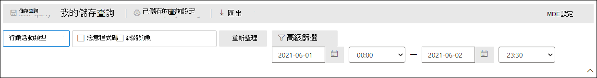

# ATP 中的即時檢視Campaign Views in ATP

[活動] 視圖是「安全性 & 規範中心」中的高級威脅防護（ATP）中的一項功能，可用於識別和分類服務中的網路釣魚攻擊。Campaign Views is a feature in Advanced Threat Protection (ATP) in the Security & Compliance Center that identifies and categorizes phishing attacks in the service. 行銷活動檢視可協助您：Campaign Views can help you to:

- 更有效率地調查和回應網路釣魚攻擊。Efficiently investigate and respond to phishing attacks.

- 更進一步了解攻擊範圍。Better understand the scope of the attack.

- 向決策者展現價值。Show value to decision makers.

行銷活動檢視可讓您較任何人類所能夠，更快速且更完整地查看攻擊的全貌。Campaign Views lets you see the big picture of an attack faster and more complete than any human.

## 什麼是行銷活動？What is a campaign?

行銷活動是針對一或多個組織的協調式電子郵件攻擊。A campaign is a coordinated email attack against one or many organizations. 竊取認證及公司資料的電子郵件攻擊是一種大型且 lucrative 的行業。Email attacks that steal credentials and company data are a big and lucrative industry. 隨著技術不斷增加以停止攻擊的努力，攻擊者會修改其方法，以確保持續成功。As technologies increase in an effort to stop attacks, attackers modify their methods in an effort to ensure continued success.

Microsoft 會利用整個服務中大量的反網路釣魚、反垃圾郵件和反惡意程式碼資料，協助識別市場活動。Microsoft leverages the vast amounts of anti-phishing, anti-spam, and anti-malware data across the entire service to help identify campaigns. 我們會根據數個因素來分析和分類攻擊資訊。We analyze and classify the attack information according to several factors. 例如：For example:

- **攻擊來源**：來源 IP 位址和寄件者電子郵件網域。**Attack source**: The source IP addresses and sender email domains.

- **攻擊郵件**內容：郵件的內容、樣式和音調。**Attack message properties**: The content, style, and tone of the messages.

- **攻擊收件者**：收件者網域、收件者工作職掌 (系統管理員、執行人員等)、公司類型 (大型、小型、公有、私人等等) 以及產業。**Attack recipients**: Recipient domains, recipient job functions (admins, executives, etc.), company types (large, small, public, private, etc.), and industries.

- **攻擊負載**：郵件中的惡意連結、附件或其他負載。**Attack payload**: Malicious links, attachments, or other payloads in the messages.

市場活動可能會短期，或可能跨越數天、數周或數天，具有有效和非使用中的期間。A campaign might be short-lived, or could span several days, weeks, or months with active and inactive periods. 您的特定組織可能會發起一個市場活動，否則您的組織可能會是多個公司的較大活動的一部分。A campaign might be launched against your specific organization, or your organization might be part of a larger campaign across multiple companies.

## 即時檢視安全性 & 規範中心Campaign Views the Security & Compliance Center

在**威脅管理**活動的[安全性 & 規範中心](https://protection.office.com) \> \*\* \*\*，或是直接在中提供即時檢視 <https://protection.office.com/campaigns> 。Campaign Views is available in the [Security & Compliance Center](https://protection.office.com) at **Threat management** \> **Campaigns**, or directly at <https://protection.office.com/campaigns>.

您也可以從下列來源取得市場即時檢視：You can also get to Campaign Views from:

- **威脅管理** \>**瀏覽器** \>**View** \>**活動****Threat management** \> **Explorer** \> **View** \> **Campaigns**

- **威脅管理** \>**瀏覽器** \>**View** \>**所有電子郵件** \>[**活動**] 索引標籤**Threat management** \> **Explorer** \> **View** \> **All email** \> **Campaign** tab

- **威脅管理** \>**瀏覽器** \>**View** \>**網路釣魚** \>[**活動**] 索引標籤**Threat management** \> **Explorer** \> **View** \> **Phish** \> **Campaign** tab

- **威脅管理** \>**瀏覽器** \>**View** \>**惡意** \> 代碼[**活動**] 索引標籤**Threat management** \> **Explorer** \> **View** \> **Malware** \> **Campaign** tab

若要存取市場即時檢視，您必須是 Security & 合規性中心內的**組織管理**、**安全性管理員**或**安全性讀者**角色群組的成員。To access Campaign Views, you need to be a member of the **Organization Management**, **Security Administrator**, or **Security Reader** role groups in the Security & Compliance Center. 如需詳細資訊，請參閱[安全性與合規性中心中的權限](permissions-in-the-security-and-compliance-center.md)。For more information, see [Permissions in the Security & Compliance Center](permissions-in-the-security-and-compliance-center.md).

## 市場活動概覽Campaigns overview

[一覽表] 頁面會顯示所有市場活動的相關資訊。The overview page shows information about all campaigns.

在 [預設**市場活動**] 索引標籤上，[**行銷活動類型**] 區域會顯示柱狀圖圖，顯示每日的收件者人數。On the default **Campaign** tab, the **Campaign type** area shows a bar graph that shows the number of recipients per day. 根據預設，圖表會顯示**網路釣魚**和**惡意**代碼資料。By default, the graph shows both **Phish** and **Malware** data.

> [!TIP]
> 如果您沒有看到任何活動資料，請嘗試變更日期範圍或[篩選器](#filters-and-settings)。If you don't see any campaign data, try changing the date range or [filters](#filters-and-settings).

[一覽表] 頁面的其餘部分會在 [**市場活動**] 索引標籤上顯示下列資訊：The rest of the overview page shows the following information on the **Campaign** tab:

- **名稱****Name**

- **樣本主旨**：行銷活動中其中一個訊息的主旨列。**Sample subject**: The subject line of one of the messages in the campaign. 請注意，市場活動中的所有郵件不一定會有相同的主語。Note that all messages in the campaign will not necessarily have the same subject.

- **目標**：所計算的百分比：（組織中的活動收件者數目）/（該服務中所有組織的收件者總數）。**Targeted**: The percentage as calculated by: (the number of campaign recipients in your organization) / (the total number of recipients in the campaign across all organizations in the service). 此值表示市場活動特別導向組織的程度（較高的值）與導向其他組織在服務中的位置（低值）。This value indicates the degree to which the campaign is specifically directed at your organization (a higher value) vs. directed at other organizations in the service (a lower value).

- **類型**：此值為**網路釣魚**或**惡意**代碼。**Type**: This value is either **Phish** or **Malware**.

- **子類型**：此值包含有關活動的詳細資料。**Subtype**: This value contains more details about the campaign. 例如：For example:

  - **網路釣魚**：在此 phished 中，您可以使用此市場活動的品牌。**Phish**: Where available, the brand that is being phished by this campaign. 例如，、、、 `Microsoft` `365` `Unknown` `Outlook` 或 `DocuSign` 。For example, `Microsoft`, `365`, `Unknown`, `Outlook`, or `DocuSign`.

  - **惡意**代碼：例如 `HTML/PHISH` 或 `HTML/<MalwareFamilyName>` 。**Malware**: For example, `HTML/PHISH` or `HTML/<MalwareFamilyName>`.

在此 phished 中，您可以使用此活動的品牌。Where available, the brand that is being phished by this campaign. 當以 ATP 技術為偵測時，會將前置詞**ATP**新增至子類型值。When the detection is driven by ATP technology, the prefix **ATP-** is added to the subtype value.

- **收件者**：此行銷活動鎖定的使用者數目。**Recipients**: The number of users that were targeted by this campaign.

- **Inboxed**：從其收件匣的此活動接收郵件的使用者人數（未傳遞到其 [垃圾郵件] 資料夾）。**Inboxed**: The number of users that received messages from this campaign in their Inbox (not delivered to their Junk Email folder).

- 按下：在網路釣魚郵件中 **，按一下 URL**或開啟附件的使用者數目。**Clicked**: The number of users that clicked on the URL or opened the attachment in the phishing message.

- **按一下 [速率**：由「已**按一下**Inboxed」所計算的百分比  /  \*\* \*\*。**Click rate**: The percentage as calculated by "**Clicked** / **Inboxed**". 此值是活動之效能的指示器，以及收件者是否可以將郵件識別為網路釣魚，並避免按一下 [負載 URL]。This value is an indicator of the effectiveness of the campaign, and whether the recipients were able to identify the message as phishing and avoid clicking on the payload URL.

  請注意，惡意軟體活動中不會使用此值。Note that this value isn't used in malware campaigns.

- 已**訪問**：有多少使用者實際將其設為 [負載] 網站。**Visited**: How many users actually made it through to the payload website. 如果有**按一下**的值，但安全連結已封鎖網站的存取權，這個值將會是零。If there are **Clicked** values, but Safe Links blocked access to the website, this value will be zero.

[**市場活動來源**] 索引標籤會顯示世界地圖上的郵件來源。The **Campaign origin** tab shows the message sources on a map of the world.

### 篩選和設定Filters and settings

在 [市場即時檢視] 頁面頂端，有數個篩選和查詢設定可協助您找出並隔離特定的市場活動。At the top of the Campaign Views page, there are several filter and query settings to help you find and isolate specific campaigns.

您可以執行的最基本篩選為開始日期/時間和結束日期/時間。The most basic filtering that you can do is the start date/time and the end date/time.

若要進一步篩選視圖，您可以使用多個值篩選的單一屬性，方法是按一下 [**行銷活動類型**] 按鈕，進行選取，然後按一下 [重新整理 **]。**To further filter the view, you can do single property with multiple values filtering by clicking the **Campaign type** button, making your selection, and then clicking **Refresh**.

下列清單說明可用的活動屬性：The available campaign properties are described in the following list:

- 基本Basic

  - **行銷活動類型**：選取**惡意**代碼或**網路釣魚**。**Campaign type**: Select **Malware** or **Phish**. 清除選取範圍與同時選取這兩者的結果相同。Clearing the selections has the same result as selecting both.
  - **市場活動名稱****Campaign name**
  - **活動子類型****Campaign subtype**
  - **Sender****Sender**
  - **收件者****Recipients**
  - **寄件者網域****Sender domain**
  - **主旨****Subject**
  - **附件檔名****Attachment filename**
  - **惡意程式碼系列****Malware family**
  - **傳遞動作****Delivery action**
  - **偵測技術****Detection technology**
  - **標記****Tags**
  - **系統覆寫****System overrides**

- 進階Advanced

  - **網際網路郵件識別碼**：郵件頭的**Message-ID**標頭欄位中提供。**Internet message ID**: Available in the **Message-ID** header field in the message header. 範例值為 `<08f1e0f6806a47b4ac103961109ae6ef@server.domain>` （記下角括弧）。An example value is `<08f1e0f6806a47b4ac103961109ae6ef@server.domain>` (note the angle brackets).
  
  - **網路消息識別碼**：在郵件頭的 [ **X-MS-Exchange-Organization-網路 Message-Id**標頭] 欄位中可用的 GUID 值。**Network message ID**: A GUID value that's available in the **X-MS-Exchange-Organization-Network-Message-Id** header field in the message header.
  
  - **寄件者 IP****Sender IP**
  
  - **附件 SHA256**：若要在 Windows 中尋找檔案的 SHA256 雜湊值，請在命令提示字元中執行下列命令： `certutil.exe -hashfile "<Path>\<Filename>" SHA256` 。**Attachment SHA256**: To find the SHA256 hash value of a file in Windows, run the following command in a Command Prompt: `certutil.exe -hashfile "<Path>\<Filename>" SHA256`.
  
  - **叢集識別碼****Cluster ID**
  
  - **警示原則識別碼****Alert Policy ID**

- URLURLs

  - **URL 網域****URL domain**
  - **URL 網域和路徑****URL domain and path**
  - [URL]\*\*\*\***URL**
  - **URL 路徑****URL path**
  - **按一下 [判定]****Click verdict**

如需更多的高級篩選，包括多個屬性篩選，您可以按一下 [**高級篩選**] 按鈕建立查詢。For more advanced filtering, including filtering by multiple properties, you can click the **Advanced filter** button to build a query. 您可以使用相同的活動屬性，但有下列增強功能：The same campaign properties are available, but with the following enhancements:

- 您可以按一下 [**新增條件**]，以選取多個條件。You can click **Add a condition** to select multiple conditions.
- 您可以選擇條件之間的**And**或**or**運算子。You can choose the **And** or **Or** operator between conditions.
- 您可以選取 [條件] 清單底部的 [**條件] 群組**專案，以形成複雜的複合條件。You can select the **Condition group** item at the bottom of the conditions list to form complex compound conditions.

完成作業後，請按一下 [**查詢**] 按鈕。When you're finished, click the **Query** button.

在您建立基本或高級篩選器之後，您可以使用 [**儲存查詢**] 或 [**另存查詢**] 來儲存。After you create a basic or advanced filter, you can save it by using **Save query** or **Save query as**. 之後，當您回到 [市場活動] 視圖時，您可以按一下 [**已儲存的查詢設定**] 載入已儲存的篩選。Later, when you return to Campaign Views, you can load a saved filter by clicking **Saved query settings**.

若要匯出圖形或行銷清單，請按一下 [**匯出**]，然後選取 [**匯出圖表資料**] 或 [**匯出活動清單**]。To export the graph or the list of campaigns, click **Export** and select **Export chart data** or **Export campaign list**.

如果您有 Microsoft Defender ATP 訂閱，您可以按一下 [ **WDATP** ]，使用 MICROSOFT defender atp 連線或中斷市場活動資訊的連線。If you have a Microsoft Defender ATP subscription, you can click **WDATP** to connect or disconnect the campaigns information with Microsoft Defender ATP. 如需詳細資訊，請參閱將[Office 365 atp 與 Microsoft DEFENDER Atp 整合](https://docs.microsoft.com/microsoft-365/security/office-365-security/integrate-office-365-ti-with-wdatp)。For more information, see [Integrate Office 365 ATP with Microsoft Defender ATP](https://docs.microsoft.com/microsoft-365/security/office-365-security/integrate-office-365-ti-with-wdatp).

## 行銷活動詳細資料Campaign details

當您按一下市場活動的名稱時，市場活動詳細資料會出現在浮出控制項中。When you click on the name of a campaign, the campaign details appear in a flyout.

### 活動資訊Campaign information

在 [市場活動詳細資料] 視圖的頂端，可取得下列活動資訊：At the top of the campaign details view, the following campaign information is available:

- **識別碼**：唯一的活動識別碼。**ID**: The unique campaign identifier.

- **開始**和**結束**：活動的開始日期和結束日期。**Started** and **Ended**: The start date and end date of the campaign. 請注意，這些日期可能會比您在 [概覽] 頁面上選取的篩選日期進一步擴充。Note that these dates might extend further than your filter dates that you selected on the overview page.

- **影響**：此區段包含您選取的日期範圍篩選器（或您在時程表中選取）的下列資料：**Impact**: This section contains the following data for the date range filter you selected (or that you select in the timeline):
  
  - 收件者總數。The total number of recipients.
  - 「Inboxed」的郵件數目（也就是傳遞至收件匣，而非 [垃圾郵件] 資料夾）。The number of messages that were "Inboxed" (that is, delivered to the Inbox, not to the Junk Email folder).
  - 在網路釣魚郵件中按一下 URL 負載的使用者人數。How many users clicked on the URL payload in the phishing message.
  - Howe 許多使用者已訪問 URL。Howe many users visited the URL.

- **目標**：所計算的百分比：（組織中的活動收件者數目）/（該服務中所有組織的收件者總數）。**Targeted**: The percentage as calculated by: (the number of campaign recipients in your organization) / (the total number of recipients in the campaign across all organizations in the service). 請注意，此值是透過整個市場活動的週期計算而來，而不會變更篩選日期。Note that this value is calculated over the entire lifetime of the campaign, and doesn't change the filter dates.

- 市場活動活動的互動時程表：時程表會顯示活動的整個生命週期中的活動。An interactive timeline of campaign activity: The timeline shows activity over the entire lifetime of the campaign. 根據預設，陰影區域會包含您在 [概覽] 中選取的日期範圍篩選。By default, the shaded area includes the date range filter that you selected in the overview. 您可以按一下並拖動以選取特定的起點和終點，<u>它會變更顯示在 [**影響**] 區域中的資料，以及下一節所述的頁面的其餘</u>部分。You can click and drag to select a specific start point and end point, <u>which will change the data that's displayed in **Impact** area, and on the rest of the page as described in the next sections</u>.

在標題列中，您可以按一下 [**下載活動] 調**高按鈕  以將市場活動詳細資料下載至 Word 檔（預設為 CampaignReport.docx）。In the title bar, you can click the **Download campaign write-up** button  to download the campaign details to a Word document (by default, named CampaignReport.docx). 請注意，本檔包含整個市場活動生命週期的詳細資料（而不只是選取的篩選日期）。Note that this document contains details over the entire lifetime of the campaign (not just the filter dates you selected).

### 行銷活動流程Campaign flow

在 [市場活動詳細資料] 視圖的中間，水準流程圖中的 [**流程**] 區段會顯示有關活動的重要詳細資料（稱為_Sankey_圖）。In the middle of the campaign details view, important details about the campaign are presented in the **Flow** section in a horizontal flow diagram (known as a _Sankey_ diagram). 這些詳細資料將協助您了解行銷活動的元素和在組織中的潛在影響。These details will help you to understand the elements of the campaign and the potential impact in your organization.

> [!TIP]
> **流程圖**中所顯示的資訊是由時程表中的陰影日期範圍所控制，如上一節所述。The information that's displayed in the **Flow** diagram is controlled by the shaded date range in the timeline as described in the previous section.

如果您將游標停留在圖表中的水平帶狀上，您會看到相關訊息的數量 (例如來自特定來源 IP 的訊息、來自使用特定寄件者網域來源 IP 的訊息等)。If you hover over a horizontal band in the diagram, you'll see the number of related messages (for example, messages from a particular source IP, messages from the source IP using the specified sender domain, etc.).

圖表中包含下列資訊：The diagram contains the following information:

- **寄件者 IP****Sender IPs**

- **寄件者網域****Sender domains**

- **篩選 verdicts**：這些值與[反垃圾郵件訊息標頭](anti-spam-message-headers.md)中所述的可用網路釣魚和垃圾郵件篩選 verdicts 相關聯。**Filter verdicts**: These values are related to the available phishing and spam filtering verdicts as described in [Anti-spam message headers](anti-spam-message-headers.md). 下表說明可用的值：The available values are described in the following table:

  ||||
  |---|---|---|
  |**值****Value**|**垃圾郵件篩選判定****Spam filter verdict**|**描述****Description**|
  |**允許****Allowed**|`SFV:SKN`    `SFV:SKI`|垃圾郵件篩選功能（例如郵件流程規則，也稱為傳輸規則）進行評估之前，郵件會標示為非垃圾郵件和/或略過的篩選。The message was marked as not spam and/or skipped filtering before being evaluated by spam filtering (for example, by a mail flow rule, also known as a transport rule).  郵件因其他原因而略過垃圾郵件篩選（例如，寄件者和收件者似乎位於相同組織中）。The message skipped spam filtering for other reasons (for example, the sender and recipient appear to be in the same organization).|
  |**已封鎖****Blocked**|`SFV:SKS`|垃圾郵件篩選功能（例如，依郵件流程規則）進行評估之前，郵件已標示為垃圾郵件。The message was marked as spam before being evaluated by spam filtering (for example, by a mail flow rule).|
  |**已偵測****Detected**|`SFV:SPM`|垃圾郵件篩選已將郵件標記為垃圾郵件。The message was marked as spam by spam filtering.|
  |**未偵測到****Not Detected**|`SFV:NSPM`|郵件已由垃圾郵件篩選標示為非垃圾郵件。The message was marked as not spam by spam filtering.|
  |**釋放****Released**|`SFV:SKQ`|郵件因從隔離區發行而略過垃圾郵件篩選。The message skipped spam filtering because it was released from quarantine.|
  |**承租人允許**\***Tenant Allow**\*|`SFV:SKA`|由於反垃圾郵件原則設定，郵件會略過垃圾郵件篩選（例如，寄件者位於允許的寄件者清單或允許的網域清單中）。The message skipped spam filtering due to anti-spam policy settings (for example, the sender was in the allowed sender list or allowed domain list).|
  |**租使用者區塊**\*\***Tenant Block**\*\*|`SFV:SKA`|由於反垃圾郵件原則設定（例如，寄件者位於允許的寄件者清單或允許的網域清單），垃圾郵件篩選會封鎖郵件。The message was blocked by spam filtering due to anti-spam policy settings (for example, the sender was in the allowed sender list or allowed domain list).|
  |**使用者允許**\***User Allow**\*|`SFV:SFE`|郵件會略過垃圾郵件篩選，因為寄件者是在 Outlook 中的使用者的安全寄件者清單中。The message skipped spam filtering because the sender was in a user's Safe Senders list in Outlook.|
  |**使用者區塊**\*\***User Block**\*\*|`SFV:BLK`|郵件被垃圾郵件篩選封鎖，因為寄件者位於 Outlook 中使用者的封鎖寄件者清單中。The message was blocked by spam filtering because the sender was in a user's Blocked Senders list in Outlook.|
  |**幹掉****ZAP**|n/an/a|[零小時自動清除（ZAP）](zero-hour-auto-purge.md)會根據您的反垃圾郵件原則設定（移至 [垃圾郵件] 資料夾或「隔離」），對傳送的郵件採取動作。[Zero-hour auto purge (ZAP)](zero-hour-auto-purge.md) took action on the delivered message according to your anti-spam policy settings (moved to the Junk Email folder or Quarantined).|
  |

  \*請複查您的反垃圾郵件原則，因為服務可能封鎖允許的郵件。\* Review your anti-spam policies, because the allowed message would have likely been blocked by the service.

  \*\*請複查您的反垃圾郵件原則，因為應該隔離這些郵件，而非傳遞。\*\* Review your anti-spam policies, because these messages should be quarantined, not delivered.

- **傳送位置**：您可能想要調查實際傳送給收件者的訊息 (無論是移至 [收件匣] 或 [垃圾郵件] 資料夾)，即使使用者未在訊息中點選承載 URL。**Delivery locations**: You'll likely want to investigate messages that were actually delivered to recipients (either to the Inbox or the Junk Email folder), even if users didn't click on the payload URL in the message. 您也可以從隔離區中移除隔離的郵件。You can also remove the quarantined messages from quarantine. 如需詳細資訊，請參閱[在 EOP 中隔離的電子郵件訊息](quarantine-email-messages.md)。For more information, see [Quarantined email messages in EOP](quarantine-email-messages.md).

  - **已刪除資料夾****Deleted folder**
  - **下降****Dropped**
  - **外部**：收件者位於您的內部部署電子郵件組織中的混合式環境。**External**: The recipient is located in your on-premises email organization in hybrid environments.
  - **失敗****Failed**
  - **轉發****Forwarded**
  - **收件匣****Inbox**
  - **垃圾郵件資料夾****Junk folder**
  - **隔離區****Quarantine**
  - **Unknown****Unknown**

- **URL 按一下**：這些會在下一節中說明。**URL clicks**: These are described in the next section.

> [!NOTE]
> 在所有包含超過10個專案的層中，會顯示前10個專案，而其餘專案則會結合在**其他**專案中。In all layers that contain more than 10 items, the top 10 items are shown, while the rest are bundled together in **Others**.

#### URL 點選URL clicks

當網路釣魚郵件傳送至收件匣或 [垃圾郵件] 資料夾時，使用者永遠都有可能會按一下 [負載 URL]。When a phishing message is delivered to a recipient (to the Inbox or the Junk Email folder), there's always a chance that the user will click on the payload URL. 未在傳送的郵件中按一下 URL 只是一項成功的衡量，但是您必須決定網路釣魚郵件在第一個位置中傳遞到其信箱的原因。Not clicking on the URL in a delivered message is a small measure of success, but you need to determine why the phishing message was delivered to their mailbox in the first place.

如果使用者按一下網路釣魚郵件中的 [負載 URL]，則動作會顯示在 [市場活動詳細資料] 視圖中圖表的 [ **URL 按一下**] 區域中。If a user clicked on the payload URL in the phishing message, the actions are displayed in the **URL clicks** area of the diagram in the campaign details view.

- **允許****Allowed**

- **BlockPage**：收件者已按一下有效載荷 URL，但組織中的[ATP 安全連結](atp-safe-links.md)原則已封鎖他們對惡意網站的存取。**BlockPage**: The recipient clicked on the payload URL, but their access to the malicious website was blocked by the [ATP Safe Links](atp-safe-links.md) policies in your organization.

- **BlockPageOverride**：收件者按一下了郵件中的 [負載 URL]，ATP 安全連結嘗試停止它們，但允許他們覆寫區塊。**BlockPageOverride**: The recipient clicked on the payload URL in the message, ATP Safe Links tried to stop them, but they were allowed to override the block. 您必須調查您的[安全連結原則](set-up-atp-safe-links-policies.md)，以瞭解使用者為何可以覆寫安全連結判定，並繼續進行惡意網站。You need to investigate your [Safe Links policies](set-up-atp-safe-links-policies.md) to see why users are allowed to override the Safe Links verdict and continue to the malicious website.

- **PendingDetonationPage**： ATP 安全附件正在虛擬電腦環境中開啟的負載 URL，並查看發生什麼情況。**PendingDetonationPage**: ATP Safe Attachments is in the process of opening the payload URL in a virtual computer environment, and seeing what happens.

- **PendingDetonationPageOverride**：收件者可以覆寫 [負載引爆] 處理常式，並開啟 URL，而不會等候結果。**PendingDetonationPageOverride**: The recipient was allowed to override the payload detonation process and open the URL without waiting for the results.

### 索引標籤Tabs

[市場活動詳細資料] 視圖中的索引標籤可讓您進一步調查市場活動。The tabs in the campaign details view allow you to further investigate the campaign.

> [!TIP]
> 在 [[活動資訊](#campaign-information)] 區段中所述的時程表中，依陰影日期範圍所控制的索引標籤上顯示的資訊。The information that's displayed on the tabs is controlled by the shaded date range in the timeline as described in [Campaign information](#campaign-information) section.

- **URL 按一下**：如果使用者未按一下網路釣魚郵件中的 [負載 URL]，此區段將會是空白的。**URL clicks**: If users didn't click on the payload URL in the phishing message, this section will be blank. 如果使用者能夠按一下 URL，則會填入下列值：If a user was able to click on the URL, the following values will be populated:

  - **使用者**\***User**\*
  - **URL**\***URL**\*
  - **按一下 [時間]****Click time**
  - **按一下 [判定]****Click verdict**

- **寄件者 IP****Sender IPs**

  - **寄件者 IP**\***Sender IP**\*
  - **總計計數****Total count**
  - **Inboxed****Inboxed**
  - **非 Inboxed****Not Inboxed**
  - 已**傳遞 SPF**：寄件者[原則架構（SPF）](how-office-365-uses-spf-to-prevent-spoofing.md)已驗證寄件者。**SPF passed**: The sender was authenticated by the [Sender Policy Framework (SPF)](how-office-365-uses-spf-to-prevent-spoofing.md). 未通過 SPF 驗證的寄件者表示寄件者未驗證，或郵件哄騙合法的寄件者。A sender that does not pass SPF validation indicates the sender isn't authenticated, or the message is spoofing a legitimate sender.

- **寄件者****Senders**

  - **寄件者**：這是 SMTP MAIL FROM 命令中的實際寄件者位址，不一定是使用者在其電子郵件客戶程式中看到的寄件者：電子郵件地址。**Sender**: This is the actual sender address in the SMTP MAIL FROM command, which is not necessarily the From: email address that users see in their email clients.
  - **總計計數****Total count**
  - **Inboxed****Inboxed**
  - **非 Inboxed****Not Inboxed**
  - **DKIM 通過**：寄件者是由[識別為郵件（DKIM）的網域金鑰](support-for-validation-of-dkim-signed-messages.md)所驗證。**DKIM passed**: The sender was authenticated by [Domain Keys Identified Mail (DKIM)](support-for-validation-of-dkim-signed-messages.md). 未通過 DKIM 驗證的寄件者會指出未驗證寄件者，或郵件會哄騙合法的寄件者。A sender that does not pass DKIM validation indicates the sender isn't authenticated, or the message is spoofing a legitimate sender.
  - **DMARC 通過**：寄件者是透過以[網域為基礎的郵件驗證、報告和符合性（DMARC）](use-dmarc-to-validate-email.md)進行驗證。**DMARC passed**: The sender was authenticated by [Domain-based Message Authentication, Reporting, and Conformance (DMARC)](use-dmarc-to-validate-email.md). 未通過 DMARC 驗證的寄件者會指出未驗證寄件者，或郵件會哄騙合法的寄件者。A sender that does not pass DMARC validation indicates the sender isn't authenticated, or the message is spoofing a legitimate sender.

- **Attachments****Attachments**

  - **Filename****Filename**
  - **SHA256****SHA256**
  - **惡意程式碼系列****Malware family**
  - **總計計數****Total count**

- [URL]\*\*\*\***URL**

  - **URL**\***URL**\*
  - **總數****Total Count**

\* 按一下此值會開啟新的飛出畫面，其中在行銷活動詳細資料檢視上方包含更多有關指定項目 (使用者、URL 等) 的詳細資料。\* Clicking on this value opens a new flyout that contains more details about the specified item (user, URL, etc.) on top of the campaign details view. 若要回到行銷活動詳細資料檢視，請按一下新飛出視窗中的 [完成]\*\*\*\*。To return to the campaign details view, click **Done** in the new flyout.

### 按鈕Buttons

行銷活動詳細資料檢視中的按鈕可讓您使用威脅瀏覽器的強大功能，進一步調查行銷活動。The buttons in the campaign details view allow you to use the power of Threat Explorer to further investigate the campaign.

- **探索行銷活動**：使用 [行銷活動識別碼]\*\*\*\* 值做為搜尋篩選，以開啟新的威脅總管搜尋索引標籤。**Explore campaign**: Opens a new Threat Explorer search tab using the **Campaign ID** value as the search filter.

- **探索 Inboxed 郵件**：開啟新的威脅瀏覽器搜尋索引標籤，使用**活動識別碼**及**傳遞位置：收件**匣做為搜尋篩選器。**Explore Inboxed messages**: Opens a new Threat Explorer search tab using the **Campaign ID** and **Delivery location: Inbox** as the search filter.
