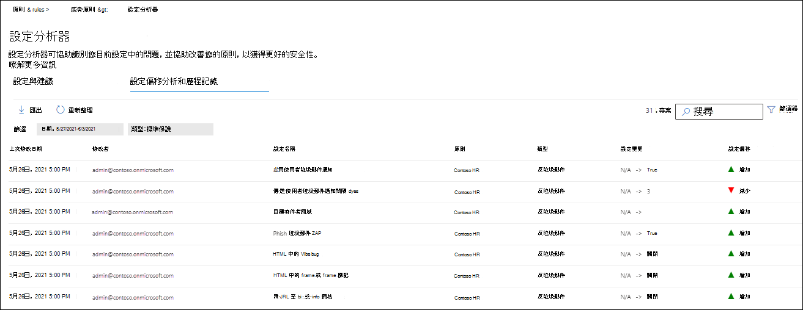

# EOP 和 Microsoft Defender for Office 365 中的保護原則設定分析器

[!INCLUDE [Microsoft 365 Defender rebranding](../includes/microsoft-defender-for-office.md)]

**適用於**
- [Exchange Online Protection](exchange-online-protection-overview.md)
- [適用於 Office 365 的 Microsoft Defender 方案 1 和方案 2](defender-for-office-365.md)
- [Microsoft 365 Defender](../defender/microsoft-365-defender.md)

Microsoft 365 security center 中的設定 analyzer 提供了一個集中位置，可找出並修正其設定低於標準[安全性原則](preset-security-policies.md)中的標準保護和嚴格保護設定檔設定的安全性原則。

設定分析器會分析下列類型的原則：

- **Exchange Online Protection (EOP) 原則**：這包括具有 Exchange Online 信箱和獨立 EOP 組織的 Microsoft 365 組織，但沒有 Exchange Online 信箱：

  - [反垃圾郵件原則](configure-your-spam-filter-policies.md)。
  - [反惡意程式碼原則](configure-anti-malware-policies.md)。
  - [EOP 反網路釣魚原則](set-up-anti-phishing-policies.md#spoof-settings)。

- **適用于 Office 365 原則的 Microsoft Defender**：這包括具有 Microsoft 365 E5 或 Defender 的組織 Office 365 附加元件訂閱：

  - Microsoft Defender 中 Office 365 的反網路釣魚原則，其中包括：
    - EOP 反網路釣魚原則中提供的相同 [欺騙設定](set-up-anti-phishing-policies.md#spoof-settings) 。
    - [類比設定](set-up-anti-phishing-policies.md#impersonation-settings-in-anti-phishing-policies-in-microsoft-defender-for-office-365)
    - [高級網路釣魚臨界值](set-up-anti-phishing-policies.md#advanced-phishing-thresholds-in-anti-phishing-policies-in-microsoft-defender-for-office-365)
  - [安全連結原則](set-up-safe-links-policies.md)。
  - [安全附件原則](set-up-safe-attachments-policies.md)。

[EOP 和 Microsoft Defender Office 365 security](recommended-settings-for-eop-and-office365.md)] 中的建議設定會說明用作基準的 **標準** 和 **嚴格** 原則設定值。

## 開始之前有哪些須知？

- 您可以開啟安全性中心，網址為 <https://security.microsoft.com>。 若要直接移至 [設定 **分析器** ] 頁面，請使用 <https://security.microsoft.com/configurationAnalyzer> 。

- 若要連線至 Exchange Online PowerShell，請參閱[連線至 Exchange Online PowerShell](/powershell/exchange/connect-to-exchange-online-powershell)。

- 您必須先在 [安全性中心] 中指派許可權，才能執行本文中的程式：
  - 若要使用設定分析器 **並** 更新安全性原則，您必須是「 **組織管理** 」或「 **安全性管理員** 」角色群組的成員。
  - 若要唯讀存取設定分析器，您必須是 **全域讀取器** 或 **安全性讀取器** 角色群組的成員。

  如需詳細資訊，請參閱[Microsoft 365 security center 中的許可權](permissions-microsoft-365-security-center.md)。

  > [!NOTE]
  >  
  > - 將使用者新增至對應的 Azure Active Directory 角色，可為使用者提供 Microsoft 365 中的其他功能的 _安全性中心的_ 必要許可權。 如需詳細資訊，請參閱[關於系統管理員角色](../../admin/add-users/about-admin-roles.md)。
  >
  > - [Exchange Online](/Exchange/permissions-exo/permissions-exo#role-groups) 中的 **僅限檢視組織管理** 角色群組也會提供功能的唯讀存取權。

## 在安全中心使用設定分析器

在 [安全性中心] 中，移至 [ **電子郵件 &** 共同作業 \> **原則] & 規則** \> **威脅原則** \> **範本化原則** 區段設定 \> **analyzer**。

設定分析器有兩個主要的索引標籤：

- **設定和建議**：選擇 [**標準**] 或 [**嚴格**]，然後將這些設定與您現有的安全性原則進行比較。 在結果中，您可以調整設定的值，使其具有與標準或嚴格相同的層級。
- 設定 **偏移分析和記錄**：此 view 可讓您追蹤一段時間的原則變更。

### 設定分析器中的 [設定與建議] 索引標籤

依預設，索引標籤會在與標準保護設定檔的比較上開啟。 您可以選取 [ **查看嚴格建議**] 切換到嚴格保護設定檔的比較。 若要切換回來，請選取 [ **查看標準建議**]。

根據預設，[ **原則群組/設定名稱** ] 欄會包含不同類型的安全性原則及設定數目的折疊模式，如果有任何) 則需要改進 (。 原則類型包括：

- **反垃圾郵件**
- **防網路釣魚**
- **反惡意程式碼**
- 如果您的訂閱包含 Microsoft Defender for Office 365， (**安全附件**) 
- 在您的訂閱中包含 Microsoft Defender for Office 365 時 (的 **安全連結**) 

在預設的視圖中，會折疊所有專案。 每個原則旁都有一個原則的比較結果摘要，您可以在您的原則 (中修改) 和設定標準或嚴格保護設定檔對應之原則中的設定， (但不能修改) 。 您將會看到您要比較的保護設定檔的下列資訊：

- **綠色**：所有現有原則中的所有設定，至少都是保護設定檔的安全性。
- **琥珀色**：現有原則中的少量設定，不如保護設定檔的安全性。
- **紅色**：現有原則中的大量設定與保護設定檔的安全性不符。 這可能是許多原則中的一些設定或一個原則中的眾多設定。

就理想的比較而言，您會看到文字： **所有設定都會遵循** \<**Standard** or **Strict**\> **建議**。 否則，您會看到建議設定的變更數目。

如果您展開 [ **原則] 群組/設定名稱**，則會顯示每個需要注意之特定原則中的所有原則和相關設定。 或者，您可以展開特定類型的原則 (例如， **反垃圾郵件**) ，只查看那些需要注意之原則類型中的設定。

如果比較沒有改進 (綠) 的建議，則展開原則會顯示 nothing。 如果有任何數量的改進建議 (琥珀色或紅色) ，則會顯示需要注意的設定，並會顯示下列各欄中的對應資訊：

- **Policy group/設定名稱**：需要您注意的設定名稱。 例如，在先前的螢幕擷取畫面中，這是預設反垃圾郵件原則中的設定。
- **原則**：包含設定之受影響原則的名稱。
- **適用** 于：受影響的原則所套用的使用者數目。
- **目前** 設定：設定的目前值。 對於套用至所有收件者的該類型的預設原則，此值為空白。
- **上次修改** 日期：上次修改原則的日期。
- **建議**：標準或嚴格保護設定檔中的設定值。 若要變更原則中設定的值，使其符合保護設定檔中的建議值，請按一下 [ **採用**]。 如果變更成功，您會看到訊息：**建議已成功採用**。 按一下 **[** 重新整理] 以查看減少的建議數量，並從結果中移除特定設定/原則列。

### 設定分析器中的設定偏移分析和記錄] 索引標籤

此索引標籤可讓您追蹤您對自訂安全性原則所做的變更。 根據預設，會顯示下列資訊：

- **上次修改日期**
- **修改者**
- **設定名稱**
- **原則**
- **類型**
- **設定變更**
- 設定 **偏移**：值 **增加** 或 **減少**。

若要篩選結果，請按一下 [篩選]。 在出現的 [ **篩選** ] 浮出控制項中，您可以選取下列篩選：

-  (日期) 的 **開始時間** 和 **結束時間**
- **標準保護** 或 **嚴格保護**

若要將結果匯出至 .csv 檔案，請按一下 [ **匯出**]。

