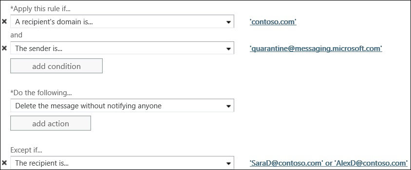

# 在 Exchange Online 中設定使用者垃圾郵件通知

> [!IMPORTANT]
> 本主題適用於保護雲端託管信箱的 Exchange Online 客戶。 保護內部部署信箱的 Exchange Online Protection (EOP) 獨立客戶應改閱讀下列主題： [EOP 中的設定使用者垃圾郵件通知](configure-end-user-spam-notifications-in-eop.md)。 
  
您可以設定使用者垃圾郵件通知的預設的全公司的垃圾郵件篩選原則或自訂垃圾郵件篩選原則。 啟用使用者垃圾郵件通知訊息可讓您管理自己的垃圾隔離郵件的使用者。 
  
使用者垃圾郵件通知包含使用者在您設定的時間期間 (您可指定 1 到 15 天之間的值) 內收到，被當成垃圾郵件隔離的所有郵件清單。您也可以設定用來撰寫通知郵件的語言。
  
之後收到通知郵件，使用者可以選擇下列選項：

**封鎖寄件者**如果您希望 Office 365 將寄件者新增至封鎖的寄件者清單。

**版本**如果郵件不是垃圾郵件，而且您希望 Office 365 將郵件傳送至您的信箱。

如果您想要採取其他動作，例如預覽或版本，瀏覽至隔離區入口網站安全性 & 合規性中心內的**檢閱**。
  
## 開始之前有哪些須知？

預估完成時間：2 分鐘
  
您必須已獲指派權限，才能執行此程序或這些程序。 若要查看您需要的權限，請參閱 [Exchange Online 中的功能權限](https://docs.microsoft.com/exchange/permissions-exo/feature-permissions) (部分機器翻譯) 主題中的「反垃圾郵件」項目。 
  
如需適用於本主題中程序的快速鍵相關資訊，請參閱 [Exchange Online 中 Exchange 系統管理中心的鍵盤快速鍵](https://docs.microsoft.com/Exchange/accessibility/keyboard-shortcuts-in-admin-center)。
  
## 使用 EAC 來設定使用者垃圾郵件通知

1. 在 Exchange 系統管理中心 (EAC)，瀏覽至 **[保護]** \> **[垃圾郵件篩選]**。
    
2. 選取您要啟用使用者垃圾郵件通知 （其預設會停用） 的垃圾郵件篩選原則。
    
3. In the right pane, where the summary information about your policy appears, click the **Configure End-user spam notifications** link. 
    
4. 在後續的對話方塊中，您可以設定下列選項：
    
   - **啟用使用者垃圾郵件通知** 選取此核取方塊，以啟用此原則的使用者垃圾郵件通知。(反之，如果此原則已啟用，您可以清除此核取方塊，以停用此原則的使用者垃圾郵件通知。) 
    
   - **傳送使用者垃圾郵件通知的間隔時間 (天數)** 指定傳送使用者垃圾郵件通知的頻率。預設值為 3 天。您可以指定 1 到 15 天之間的值。例如，如果您指定 7 天，則此通知將包含在過去 7 天內對象為該使用者，卻被當成垃圾郵件隔離的所有郵件的清單。 
    
   - **通知語言** 您可以使用下拉式清單，選取用來撰寫此原則之使用者垃圾郵件通知的語言。 
    
   - 按一下 [儲存]****。 垃圾郵件篩選原則設定，包括您使用者的垃圾郵件通知設定的摘要隨即出現在右側窗格中。
    
> [!NOTE]
>  使用者垃圾郵件通知才會正常運作的已啟用的垃圾郵件篩選原則。 >  每天只傳送一次使用者垃圾郵件通知。 無法向任何特定客戶保證通知傳遞的時間，且無法加以設定。 
  
 **提示：** 如果您想要完全實作它們之前將它們傳送到一組有限的使用者，以測試使用者垃圾郵件通知，建立可讓使用者都位於的網域之使用者垃圾郵件通知的自訂垃圾郵件篩選原則。 接著，在 EAC 中，[**郵件流程\>規則**，且您想要接收通知的使用者的例外狀況從 quarantine@messaging.microsoft.com （傳送通知電子郵件通訊） 建立郵件流程規則 （也稱為傳輸規則） 來封鎖郵件。 下圖是從網域 Contoso.com 建立兩個使用者 (SaraD 和 AlexD) 之例外狀況的範例： 
  

  
## 使用 SCC 來設定使用者垃圾郵件通知

您也可以使用的安全性與合規性中心 (SCC) 來設定使用者垃圾郵件通知。 請遵循下列步驟：

1. 開啟 [安全性與合規性中心，瀏覽至**威脅管理，** \> **原則** \> **反垃圾郵件**] 或 [使用直接連結https://protection.office.com/antispam。

2. 按一下您要啟用使用者垃圾郵件通知的垃圾郵件篩選器原則旁的向下箭號。

3. 按一下 [**設定使用者垃圾郵件通知**] 連結。

4. 在後續的對話方塊中，您可以設定下列選項：
    
   - **啟用使用者垃圾郵件通知** 選取此核取方塊，以啟用此原則的使用者垃圾郵件通知。(反之，如果此原則已啟用，您可以清除此核取方塊，以停用此原則的使用者垃圾郵件通知。) 
    
   - **傳送使用者垃圾郵件通知的間隔時間 (天數)** 指定傳送使用者垃圾郵件通知的頻率。預設值為 3 天。您可以指定 1 到 15 天之間的值。例如，如果您指定 7 天，則此通知將包含在過去 7 天內對象為該使用者，卻被當成垃圾郵件隔離的所有郵件的清單。 
    
   - **通知語言** 您可以使用下拉式清單，選取用來撰寫此原則之使用者垃圾郵件通知的語言。 
    
   - 按一下 [儲存]****。 垃圾郵件篩選原則設定，包括您使用者的垃圾郵件通知設定的摘要隨即出現在窗格中。

## 相關資訊

[設定您的垃圾郵件篩選原則](configure-your-spam-filter-policies.md)
  
