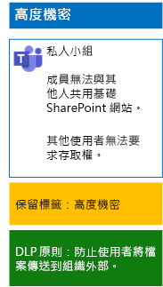

# 使用保留標籤和 DLP 保護小組中的檔案Protect files in teams with retention labels and DLP

 
您可以使用本文中的步驟，為基準、敏感和高度機密小組及其基礎 SharePoint 網站設計和部署保留標籤和資料外洩防護 (DLP) 原則。Use the steps in this article to design and deploy retention labels and data loss prevention (DLP) policies for baseline, sensitive, and highly confidential teams and their underlying SharePoint sites. 如需這三種保護層級的詳細資訊，請參閱[在 Microsoft Teams 中保護檔案](secure-files-in-teams.md)。For more information about these three tiers of protection, see [Secure files in Microsoft Teams](secure-files-in-teams.md).
  
## 如何進行此作業How this works

1. 建立需要的保留標籤並將它們發行。Create the desired retention labels and publish these. 發行這些標籤可能需要最多 12 小時的時間。It can take up to 12 hours for these to be published.
2. 針對所需的基礎 SharePoint 網站，請編輯文件庫設定，將需要的保留標籤套用至文件庫中的項目。For the desired underlying SharePoint sites, edit the document library settings to apply the desired retention labels to items in the library.
3. 建立 DLP 原則，以根據保留標籤採取動作。Create DLP policies to take action based on the retention labels.

當使用者將文件新增至小組的基礎 SharePoint 網站文件庫時，文件依預設取得指派的保留標籤。When users add a document to the underlying SharePoint site library for the team, the document will receive the assigned retention label by default. 如有需要，使用者可以變更標籤。Users can change the label, if needed. 當使用者共用組織外部的文件時，DLP 會檢查是否已指派標籤，並在 DLP 原則符合標籤時採取動作。When a user shares a document outside the organization, DLP will check to see if a label is assigned and take action if a DLP policy matches the label. DLP 也會尋找其他原則相符項目，例如保護具有信用卡號碼的檔案 (如果已設定這類原則)。DLP will look for other policy matches as well, such as protecting files with credit card numbers if this type of policy is configured. 

## 基礎 SharePoint 網站的保留標籤Retention labels for your underlying SharePoint sites

建立保留標籤並將其指派給基礎 SharePoint 網站需要三個階段。There are three phases to creating and then assigning retention labels to underlying SharePoint sites.
  
### 步驟 1：決定保留標籤名稱Step 1: Determine the retention label names

在此階段中，您會為套用至基礎 SharePoint 網站的四種資訊保護層級，決定其保留標籤的名稱。In this phase, you determine the names of your retention labels for the four levels of information protection applied to underlying SharePoint sites. 下表列出每種層級的建議名稱。The following table lists the recommended names for each level.
  
|**基礎 SharePoint 網站保護層級****underlying SharePoint sites protection level**|**標籤名稱****Label name**|
|:-----|:-----|
|基準-公用Baseline-Public    |內部公用Internal public    |
|基準-私人Baseline-Private    |PrivatePrivate    |
|敏感性Sensitive    |敏感性Sensitive    |
|高度機密Highly Confidential    |高度機密Highly Confidential    |
   
### 步驟 2：建立保留標籤Step 2: Create the retention labels

在此階段中，您會為不同資訊保護層級建立所決定的標籤，然後將它發佈。In this phase, you create and then publish your determined labels for the different levels of information protection.
  
1. 使用具有安全性系統管理員或公司系統管理員角色的帳戶登入 [Microsoft 365 合規性入口網站](https://compliance.microsoft.com)。Sign in to the [Microsoft 365 compliance portal](https://compliance.microsoft.com) with an account that has the Security Administrator or Company Administrator role.
    
2. 從瀏覽器的 [首頁 - Microsoft 365 合規性]\*\*\*\* 索引標籤，按一下 [分類] > [標籤]\*\*\*\*。From the **Home - Microsoft 365 compliance** tab of your browser, click **Classifications > Labels**.
    
3. 按一下 [保留標籤] > [建立標籤]\*\*\*\*。Click **Retention labels > Create a label**.
    
4. 在 [命名您的標籤]\*\*\*\* 窗格中，鍵入標籤名稱和系統管理員與使用者的描述，然後按 [下一步]\*\*\*\*。On the **Name your label** pane, type the name of the label and a description for admins and users, and then click **Next**.

5. 在 [檔案計畫描述元]\*\*\*\* 窗格上，視需要填寫，然後按 [下一步]\*\*\*\*。On the **File plan descriptors** pane, fill in as needed, and then click **Next**.
    
6. 在 [標籤設定]\*\*\*\* 窗格中，視需要將 [保留]\*\*\*\* 設定為 [開啟]\*\*\*\* 並設定保留設定。On the **Label settings** pane, if needed, set **Retention** to **On** and configure retention settings. 按 [下一步]\*\*\*\*。Click **Next**.
    
7. 在 [檢閱您的設定]\*\*\*\* 窗格中，按一下 [建立標籤]\*\*\*\*。On the **Review your settings** pane, click **Create the label**.
    
8. 針對其他標籤，按一下 [建立標籤]\*\*\*\*，然後視需要重複此程序中的步驟 3-7。For your additional labels, click **Create a label**, and then repeat steps 3-7 in this procedure as needed.
    

### 發佈新標籤Publish your new labels

接下來，使用下列步驟來發佈新的保留標籤。Next, use these steps to publish the new retention labels.
  
1. 從 [標籤]\*\*\*\* 窗格，按一下 [保留標籤]\*\*\*\* 索引標籤，然後按一下 [發佈標籤]\*\*\*\*。From the **Labels** pane, click the **Retention labels** tab, and then click **Publish labels**.
    
2. 在 [選擇要發佈的標籤]\*\*\*\* 窗格上，按一下 [選擇要發佈的標籤]\*\*\*\*。On the **Choose labels to publish** pane, click **Choose labels to publish**.
    
3. 在 [選擇標籤]\*\*\*\* 窗格上，按一下 [新增]\*\*\*\*，選取所有四個標籤，然後按一下 [新增]\*\*\*\*。On the **Choose labels** pane, click **Add**, select all four labels, click **Add**.
    
4. 按一下 [完成]\*\*\*\*。Click **Done**.
    
5. 在 [選擇要發佈的標籤]\*\*\*\* 窗格上，按一下 [下一步]\*\*\*\*。On the **Choose labels to publish** pane, click **Next**.
    
6. 在 [選擇位置]\*\*\*\* 窗格中，按一下 [下一步]\*\*\*\*。On the **Choose locations** pane, click **Next**.
    
7. 在 [命名您的原則]\*\*\*\* 窗格的 [名稱]\*\*\*\* 中，鍵入標籤集的名稱，然後按一下 [下一步]\*\*\*\*。On the **Name your policy** pane, type a name for your set of labels in **Name**, and then click **Next**.
    
8. 在 [檢閱您的設定]\*\*\*\* 窗格中，按一下 [發佈標籤]\*\*\*\*，然後按一下 [關閉]\*\*\*\*。On the **Review your settings** pane, click **Publish labels**, and then click **Close**.

    
### 步驟 3：將保留標籤套用至基礎 SharePoint 網站Step 3: Apply the retention labels to your underlying SharePoint sites

使用下列步驟，將保留標籤套用至基礎 SharePoint 網站的文件資料夾。Use these steps to apply the retention labels to the documents folders of your underlying SharePoint sites.
  
1.  在小組中按一下 [檔案]\*\*\*\*，然後按一下 [在 SharePoint 中開啟]\*\*\*\*。From the team, click **Files**, and then click **Open in SharePoint**.

2. 在瀏覽器的新 [SharePoint 網站] 索引標籤中，按一下 [文件]\*\*\*\*。In the new SharePoint site tab of your browser, click **Documents**.
    
3. 按一下設定圖示，然後按一下 [文件庫設定]\*\*\*\*。Click the settings icon, and then click **Library settings**.
    
4. 在 [權限與管理]\*\*\*\* 下，按一下 [Apply label to items in this library]\(將標籤套用至此文件庫中的項目)\*\*\*\*。Under **Permissions and Management**, click **Apply label to items in this library**.
    
5. 在 [設定] - [套用標籤]\*\*\*\* 中，選取適當的保留標籤，然後按一下 [儲存]\*\*\*\*。In **Settings-Apply Label**, select the appropriate retention label, and then click **Save**.
    
6. 關閉 SharePoint 網站的索引標籤。Close the tab for the SharePoint site.
    
7. 重複步驟 1-6，將保留標籤指派給其他基礎 SharePoint 網站。Repeat steps 1-6 to assign retention labels to your additional underlying SharePoint sites.
    
以下是您產生的組態。Here is your resulting configuration.
  

  
## 基礎 SharePoint 網站的 DLP 原則DLP policies for your underlying SharePoint sites

使用下列步驟設定 DLP 原則，以在使用者在組織外部共用基礎 SharePoint 網站上的文件時通知使用者。Use these steps to configure a DLP policy that notifies users when they share a document on an underlying SharePoint site outside the organization.

1. 使用具有安全性系統管理員或公司系統管理員角色的帳戶登入 [Microsoft 365 合規性入口網站](https://compliance.microsoft.com/)。Sign in to the [Microsoft 365 compliance portal](https://compliance.microsoft.com/) with an account that has the Security Administrator or Company Administrator role.
    
2. 在瀏覽器的新 [Microsoft 365 合規性]\*\*\*\* 索引標籤上，按一下 [原則] > [資料外洩防護]\*\*\*\*。On the new **Microsoft 365 compliance** tab in your browser, click **Policies > Data loss prevention**.
    
3. 在 [首頁] > [資料外洩防護]\*\*\*\* 窗格中，按一下 [建立原則]\*\*\*\*。In the **Home > Data loss prevention** pane, click **Create a policy**.
    
4. 在 [使用範本開始，或建立自訂原則]\*\*\*\* 窗格中，按一下 [自訂]\*\*\*\*，然後按 [下一步]\*\*\*\*。In the **Start with a template or create a custom policy** pane, click **Custom**, and then click **Next**.
    
5. 在 [命名您的原則]\*\*\*\* 窗格的 [名稱]\*\*\*\* 中，鍵入機密層級 DLP 原則的名稱，然後按一下 [下一步]\*\*\*\*。In the **Name your policy** pane, type the name for the sensitive level DLP policy in **Name**, and then click **Next**.
    
6. 在 [選擇位置]\*\*\*\* 窗格中，按一下 [讓我選擇一個特定位置]\*\*\*\*，然後按 [下一步]\*\*\*\*。In the **Choose locations** pane, click **Let me choose specific locations**, and then click **Next**.
    
7. 在位置清單中，停用 [Exchange 電子郵件]\*\*\*\*、[OneDrive 帳戶]\*\*\*\* 和 [Teams 聊天與通道訊息]\*\*\*\* 位置，然後按 [下一步]\*\*\*\*。In the list of locations, disable the **Exchange email**, **OneDrive accounts**, and **Teams chat and channel messages** locations, and then click **Next**.
    
8. 在 [自訂您要保護的內容類型]\*\*\*\* 窗格中，按一下 [編輯]\*\*\*\*。In the **Customize the type of content you want to protect** pane, click **Edit**.
    
9. 在 [選擇要保護的內容類型]\*\*\*\* 窗格中，從下拉式方塊按一下 [新增]\*\*\*\*，然後按一下 [保留標籤]\*\*\*\*。In the **Choose the types of content to protect** pane, click **Add** in the drop-down box, and then click **Retention labels**.
    
10. 在 [保留標籤]\*\*\*\* 窗格中，按一下 [新增]\*\*\*\* 並選取 [敏感性]\*\*\*\* 標籤，然後依序按一下 [新增]\*\*\*\* 和 [完成]\*\*\*\*。In the **Retention labels** pane, click **Add**, select the **Sensitive** label, click **Add**, and then click **Done**.
    
11. 在 [選擇要保護的內容類型]\*\*\*\* 窗格中，按一下 [儲存]\*\*\*\*。In the **Choose the types of content to protect** pane, click **Save**.
    
12. 在 [Customize the type of content you want to protect] (自訂您要保護的內容類型)\*\*\*\* 窗格中，按一下 [下一步]\*\*\*\*。In the **Customize the type of content you want to protect** pane, click **Next**.

13. 在 [What do you want to do if we detect sensitive info?]\(如果偵測到機密資訊要如何處理?)\*\*\*\* 窗格中，按一下 [Customize the tip and email]\(自訂提示和電子郵件)\*\*\*\*。In the **What do you want to do if we detect sensitive info?** pane, click **Customize the tip and email**.
    
14. 在 [Customize policy tips and email notifications]\(自訂原則提示和電子郵件通知)\*\*\*\* 窗格中，按一下 [Customize the policy tip text]\(自訂原則提示文字)\*\*\*\*。In the **Customize policy tips and email notifications** pane, click **Customize the policy tip text**.
    
15. 在文字方塊中，鍵入或貼上下列其中一個提示：In the text box, type or paste in one of the following tips:
    
  - 若要與組織外部的使用者共用，請下載檔案，然後將它開啟。 依序按一下 [檔案]、[保護文件] 和 [以密碼加密]，然後指定強式密碼。 以個別電子郵件或其他通訊方式傳送密碼。To share with a user outside the organization, download the file and then open it. Click File, then Protect Document, and then Encrypt with Password, and then specify a strong password. Send the password in a separate email or other means of communication.
  - 高度機密的檔案會受加密保護。只有獲得您 IT 部門授與權限的外部使用者可以讀取它們。Highly confidential files are protected with encryption. Only external users who are granted permissions to these files by your IT department can read them.
    
    或者，鍵入或貼上您自己的原則提示，以指示使用者如何共用組織外部的檔案。Alternately, type or paste in your own policy tip that instructs users on how to share a file outside your organization.
    
16. 按一下 [確定]\*\*\*\*。Click **OK**.
    
17. 在 [What do you want to do if we detect sensitive info?]\(如果偵測到機密資訊要如何處理?)\*\*\*\* 窗格中，按一下 [下一步]\*\*\*\*。In the **What do you want to do if we detect sensitive info?** pane, click **Next**.
    
18. 在 [要先開啟原則或測試內容嗎?]\*\*\*\* 窗格中，按一下 [是]\*\*\*\* 立即將它開啟，然後按一下 [下一步]\*\*\*\*。In the **Do you want to turn on the policy or test things out first?** pane, click **Yes, turn it on right away**, and then click **Next**.
    
19. 在 [檢閱您的設定]\*\*\*\* 窗格中，按一下 [建立]\*\*\*\*，然後按一下 [關閉]\*\*\*\*。In the **Review your settings** pane, click **Create**, and then click **Close**.
    
以下是敏感小組的設定結果。Here is your resulting configuration for sensitive teams.
  

  
然後，使用下列步驟設定 DLP 原則，以在使用者在組織外部共用基礎 SharePoint 網站上的文件時封鎖使用者。Next, use these steps to configure a DLP policy that blocks users when they share a document on an underlying SharePoint site outside the organization.
  
1. 在瀏覽器的新 [Microsoft 365 合規性]\*\*\*\* 索引標籤上，按一下 [原則] > [資料外洩防護]\*\*\*\*。On the new **Microsoft 365 compliance** tab in your browser, click **Policies > Data loss prevention**.
    
2. 在 [資料外洩防護]\*\*\*\* 窗格中，按一下 [建立原則]\*\*\*\*。In the **Data loss prevention** pane, click **Create a policy**.
    
3. 在 [從範本開始或建立自訂原則]\*\*\*\* 窗格中，按一下 [自訂]\*\*\*\*，然後按一下 [下一步]\*\*\*\*。In the **Start with a template or create a custom policy** pane, click **Custom**, and then click **Next**.
    
4. 在 [命名您的原則]\*\*\*\* 窗格的 [名稱]\*\*\*\* 中，鍵入高度機密層級 DLP 原則的名稱，然後按一下 [下一步]\*\*\*\*。In the **Name your policy** pane, type the name for the highly sensitive level DLP policy in **Name**, and then click **Next**.
    
5. 在 [選擇位置]\*\*\*\* 窗格中，按一下 [Let me choose specific locations]\(讓我選擇特定位置)\*\*\*\*，然後按一下 [下一步]\*\*\*\*。In the **Choose locations** pane, click **Let me choose specific locations**, and then click **Next**.
    
6. 在位置清單中，停用 [Exchange 電子郵件]\*\*\*\*、[OneDrive 帳戶]\*\*\*\* 和 [Teams 聊天與通道訊息]\*\*\*\* 位置，然後按 [下一步]\*\*\*\*。In the list of locations, disable the **Exchange email**, **OneDrive accounts**, and **Teams chat and channel messages** locations, and then click **Next**.
    
7. 在 [自訂要保護的敏感性資訊類型]\*\*\*\* 窗格中，按一下 [編輯]\*\*\*\*。In the **Customize the types of sensitive info you want to protect** pane, click **Edit**.
    
8. 在 [選擇要保護的內容類型]\*\*\*\* 窗格中，從下拉式方塊按一下 [新增]\*\*\*\*，然後按一下 [保留標籤]\*\*\*\*。In the **Choose the types of content to protect** pane, click **Add** in the drop-down box, and then click **Retention labels**.
    
9. 在 [保留標籤]\*\*\*\* 窗格中，按一下 [新增]\*\*\*\*，並選取 [高度機密性]\*\*\*\* 標籤，然後依序按一下 [新增]\*\*\*\* 和 [完成]\*\*\*\*。In the **Retention labels** pane, click **Add**, select the **Highly Confidential** label, click **Add**, and then click **Done**.
    
10. 在 [Choose the types of content to protect]\(選擇要保護的內容類型)\*\*\*\* 窗格中，按一下 [儲存]\*\*\*\*。In the **Choose the types of content to protect** pane, click **Save**.
    
12. 在 [Customize the types of sensitive info you want to protect]\(自訂您要保護的機密資訊類型)\*\*\*\* 窗格中，按一下 [下一步]\*\*\*\*。In the **Customize the types of sensitive info you want to protect** pane, click **Next**.
    
13. 在 [What do you want to do if we detect sensitive info?]\(如果偵測到機密資訊要如何處理?)\*\*\*\* 窗格中，按一下 [Customize the tip and email]\(自訂提示和電子郵件)\*\*\*\*。In the **What do you want to do if we detect sensitive info?** pane, click **Customize the tip and email**.
    
14. 在 [Customize policy tips and email notifications]\(自訂原則提示和電子郵件通知)\*\*\*\* 窗格中，按一下 [Customize the policy tip text]\(自訂原則提示文字)\*\*\*\*。In the **Customize policy tips and email notifications** pane, click **Customize the policy tip text**.
    
15. 在文字方塊中，鍵入或貼上下列內容：In the text box, type or paste in the following:
    
  - 若要與組織外部的使用者共用，請下載檔案，然後將它開啟。 依序按一下 [檔案]、[保護文件] 和 [以密碼加密]，然後指定強式密碼。 以個別電子郵件或其他通訊方式傳送密碼。To share with a user outside the organization, download the file and then open it. Click File, then Protect Document, and then Encrypt with Password, and then specify a strong password. Send the password in a separate email or other means of communication.
    
    或者，鍵入或貼上您自己的原則提示，以指示使用者如何共用組織外部的檔案。Alternately, type or paste in your own policy tip that instructs users on how to share a file outside your organization.
    
16. 按一下 [確定]\*\*\*\*。Click **OK**.
    
17. 在 [如果偵測到敏感性資訊，您要怎麼做?]\*\*\*\* 窗格中，於 [偵測是否一次共用特定數目的敏感性資訊]\*\*\*\* 下，按一下 [限制存取或加密內容]\*\*\*\*，然後按 [下一步]\*\*\*\*。In the **What do you want to do if we detect sensitive info?** pane, under **Detect when a specific amount of sensitive info is being shared at one time**, click **Restrict access or encrypt the content**, and then click **Next**.
    
18. 在 [要先開啟原則或測試內容嗎?]\*\*\*\* 窗格中，按一下 [是]\*\*\*\* 立即將它開啟，然後按一下 [下一步]\*\*\*\*。In the **Do you want to turn on the policy or test things out first?** pane, click **Yes, turn it on right away**, and then click **Next**.
    
19. 在 [檢閱您的設定]\*\*\*\* 窗格中，按一下 [建立]\*\*\*\*，然後按一下 [關閉]\*\*\*\*。In the **Review your settings** pane, click **Create**, and then click **Close**.
    
以下是高度機密小組的設定結果。Here is your resulting configuration for high confidentiality team.
  

  
## 下一步Next step

[使用敏感度標籤保護小組中的檔案Protect files in teams with sensitivity labels](deploy-teams-sensitivity-labels.md)
    
## 另請參閱See Also

[在 Microsoft Teams 中保護檔案Secure files in Microsoft Teams](secure-files-in-teams.md)
  
[雲端採用和混合式解決方案Cloud adoption and hybrid solutions](https://docs.microsoft.com/office365/enterprise/cloud-adoption-and-hybrid-solutions)

