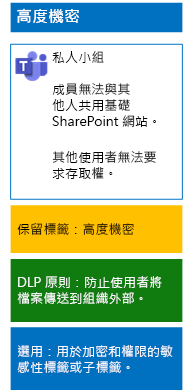

# 使用敏感度標籤保護小組中的檔案Protect files in teams with sensitivity labels

適用於高度管制資料的敏感度標籤可讓任何人套用至任何檔案，但是高度機密小組不同，他們需要自己的標籤或子標籤，使指派的檔案能夠：Unlike a sensitivity label for highly regulated data that anyone can apply to any file, a highly confidential team needs its own label or sublabel so that assigned files:

- 進行個別加密。Are individually encrypted.
- 包含自訂權限，使其只能由小組成員開啟。Contain custom permissions so that only members of the team can open it.

若要為儲存在小組的基礎 SharePoint 網站中的檔案達成這個額外的安全性層級，您必須設定自訂的敏感度標籤，而此標籤可以是單獨的標籤，或是高度管制資料之一般標籤的子標籤。To accomplish this additional level of security for files stored in the underlying SharePoint site of a team, you must configure a customized sensitivity label that is either its own label or a sublabel of the general label for highly regulated data. 只有小組成員才可在其標籤清單中看到自訂標籤或子標籤。Only team members will see the customized label or sublabel in their list of labels.

當您需要少量標籤、可同時用於全域使用和個別的私人小組時，請使用敏感度標籤。Use a sensitivity label when you need a small number of labels for both global use and individual private teams. 

當您有大量標籤，或想要將高度機密小組的標籤整理到高度管制標籤之下時，請使用敏感度子標籤。Use a sensitivity sublabel when you have a large number of labels or want to organize labels for highly confidential teams under the highly regulated label.

依照[下列指示](https://docs.microsoft.com/microsoft-365/compliance/encryption-sensitivity-labels)，設定具有下列設定的不同標籤或子標籤：Use [these instructions](https://docs.microsoft.com/microsoft-365/compliance/encryption-sensitivity-labels) to configure a separate label or a sublabel with the following settings:

- 標籤或子標籤的名稱中包含小組的名稱The name of the label or sublabel contains the name of the team
- 已啟用加密Encryption is enabled
- 小組的 Microsoft 365 群組具有共同撰寫權限The Microsoft 365 group for the team has Co-Author permissions

建立之後，請為您的使用者發佈新的標籤或子標籤，讓他們能夠在檔案上傳至小組前先在本機的檔案套用標籤，或等到檔案儲存至小組時再套用。After creating, publish the new label or sublabel for your users, who can then apply them to files either locally before uploading them to the team or later once the file is stored in the team.

以下是高度機密小組使用敏感度標籤進行檔案加密和權限授與的設定。Here is the configuration of the highly confidential team that uses sensitivity labels for file encryption and permissions.

## 另請參閱See Also

[在 Microsoft Teams 中保護檔案Secure files in Microsoft Teams](secure-files-in-teams.md)
  
[雲端採用和混合式解決方案Cloud adoption and hybrid solutions](https://docs.microsoft.com/office365/enterprise/cloud-adoption-and-hybrid-solutions)
