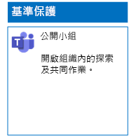
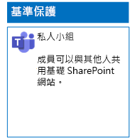
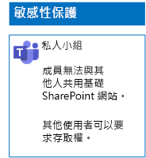
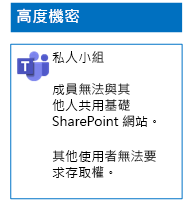

# 部署三種檔案保護層級的小組

您可以使用本文中的步驟，來設計及部署基準、敏感和高度機密的小組。 如需這三種保護層級的詳細資訊，請參閱[在 Microsoft Teams 中保護檔案](secure-files-in-teams.md)。

## 基準小組

基準保護包含公開和私人小組。 公開小組可供組織中的任何人探索及存取。 私人網站僅供與小組關聯的 Office 365 群組成員探索及存取。 這兩種類型的小組都可讓成員與其他人共用網站。

### 公用

依照[本文](https://support.office.com/article/174adf5f-846b-4780-b765-de1a0a737e2b)中的指示操作，以建立具有公用存取和權限的基準小組。

以下是產生的組態。

### 私人

依照[本文](https://support.office.com/article/174adf5f-846b-4780-b765-de1a0a737e2b)中的指示操作，以建立具有私用存取和權限的基準小組。

以下是產生的組態。

## 敏感小組

對於敏感小組，您必須先[建立私人小組](https://support.office.com/article/174adf5f-846b-4780-b765-de1a0a737e2b)。

接著，您必須設定基礎 SharePoint 網站以防止小組成員共用。

1. 在小組的工具列中，按一下 [檔案]****。

2. 按一下省略符號，然後按一下 [在 SharePoint 中開啟]****。

3. 在基礎 SharePoint 網站的工具列中，按一下設定圖示，然後按一下 [網站權限]****。

4. 在 [網站權限]**** 窗格的 [共用設定]**** 之下，按一下 [變更共用設定]****。

5. 在 [共用權限]**** 之下，選擇 [只有網站擁有者可以共用檔案、資料夾及網站]****，然後按一下 [儲存]****。

以下是您產生的組態。

## 高度機密小組

對於高度機密小組，您必須先[建立私人小組](https://support.office.com/article/174adf5f-846b-4780-b765-de1a0a737e2b)。

接著，您必須設定基礎 SharePoint 網站，以防止小組成員共用及非小組成員要求存取。

1. 在小組的工具列中，按一下 [檔案]****。

2. 按一下省略符號，然後按一下 [在 SharePoint 中開啟]****。

3. 在基礎 SharePoint 網站的工具列中，按一下設定圖示，然後按一下 [網站權限]****。

4. 在 [網站權限]**** 窗格的 [共用設定]**** 之下，按一下 [變更共用設定]****。

5. 在 [共用權限]**** 之下，選擇 [只有網站擁有者可以共用檔案、資料夾及網站]****。

6. 關閉 [允許存取要求]****，然後按一下 [儲存]****。

以下是您產生的組態。

## 下一步

[使用保留標籤和 DLP 保護小組中的檔案](deploy-teams-retention-DLP.md)

## 另請參閱

[在 Microsoft Teams 中保護檔案](secure-files-in-teams.md)

[雲端採用和混合式解決方案](https://docs.microsoft.com/office365/enterprise/cloud-adoption-and-hybrid-solutions)
