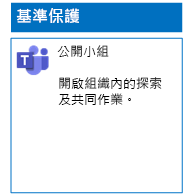
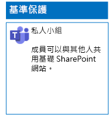
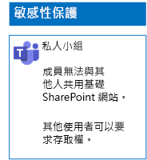
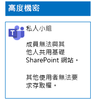

# 部署三種檔案保護層級的小組Deploy teams for three tiers of protection for files

您可以使用本文中的步驟，來設計及部署基準、敏感和高度機密的小組。Use the steps in this article to design and deploy baseline, sensitive, and highly confidential teams. 如需這三種保護層級的詳細資訊，請參閱[在 Microsoft Teams 中保護檔案](secure-files-in-teams.md)。For more information about these three tiers of protection, see [Secure files in Microsoft Teams](secure-files-in-teams.md).

## 基準小組Baseline teams

基準保護包含公開和私人小組。Baseline protection includes both public and private teams. 公開小組可供組織中的任何人探索及存取。Public teams can be discovered and accessed by anybody in the organization. 私人網站僅供與小組關聯的 Office 365 群組成員探索及存取。Private sites can only be discovered and accessed by members of the Office 365 group associated with the team. 這兩種類型的小組都可讓成員與其他人共用網站。Both of these types of teams allow members to share the site with others.

### 公用Public

依照[本文](https://support.office.com/article/174adf5f-846b-4780-b765-de1a0a737e2b)中的指示操作，以建立具有公用存取和權限的基準小組。Follow the instructions in [this article](https://support.office.com/article/174adf5f-846b-4780-b765-de1a0a737e2b) to create a baseline team with public access and permissions.

以下是產生的組態。Here is your resulting configuration.

### 私人Private

依照[本文](https://support.office.com/article/174adf5f-846b-4780-b765-de1a0a737e2b)中的指示操作，以建立具有私用存取和權限的基準小組。Follow the instructions in [this article](https://support.office.com/article/174adf5f-846b-4780-b765-de1a0a737e2b) to create a baseline team with private access and permissions.

以下是產生的組態。Here is your resulting configuration.

## 敏感小組Sensitive teams

對於敏感小組，您必須先[建立私人小組](https://support.office.com/article/174adf5f-846b-4780-b765-de1a0a737e2b)。For a sensitive team, you start by [creating a private team](https://support.office.com/article/174adf5f-846b-4780-b765-de1a0a737e2b).

接著，您必須設定基礎 SharePoint 網站以防止小組成員共用。Next, you configure the underlying SharePoint site to prevent sharing by team members.

1. 在小組的工具列中，按一下 [檔案]\*\*\*\*。In the tool bar for the team, click **Files**.

2. 按一下省略符號，然後按一下 [在 SharePoint 中開啟]\*\*\*\*。Click the ellipsis, and then click **Open in SharePoint**.

3. 在基礎 SharePoint 網站的工具列中，按一下設定圖示，然後按一下 [網站權限]\*\*\*\*。In the tool bar of the underlying SharePoint site, click the settings icon, and then click **Site permissions**.

4. 在 [網站權限]\*\*\*\* 窗格的 [共用設定]\*\*\*\* 之下，按一下 [變更共用設定]\*\*\*\*。In the **Site permissions** pane, under **Sharing Settings**, click **Change sharing settings**.

5. 在 [共用權限]\*\*\*\* 之下，選擇 [只有網站擁有者可以共用檔案、資料夾及網站]\*\*\*\*，然後按一下 [儲存]\*\*\*\*。Under **Sharing permissions**, choose **Only site owners can share files, folders, and the site**, and then click **Save**.

以下是您產生的組態。Here is your resulting configuration.

## 高度機密小組Highly confidential teams

對於高度機密小組，您必須先[建立私人小組](https://support.office.com/article/174adf5f-846b-4780-b765-de1a0a737e2b)。With a highly confidential team, you start by [creating a private team](https://support.office.com/article/174adf5f-846b-4780-b765-de1a0a737e2b).

接著，您必須設定基礎 SharePoint 網站，以防止小組成員共用及非小組成員要求存取。Next, you configure the underlying SharePoint site to prevent sharing by team members and the requesting of access by non-members of the team.

1. 在小組的工具列中，按一下 [檔案]\*\*\*\*。In the tool bar for the team, click **Files**.

2. 按一下省略符號，然後按一下 [在 SharePoint 中開啟]\*\*\*\*。Click the ellipsis, and then click **Open in SharePoint**.

3. 在基礎 SharePoint 網站的工具列中，按一下設定圖示，然後按一下 [網站權限]\*\*\*\*。In the tool bar of the underlying SharePoint site, click the settings icon, and then click **Site permissions**.

4. 在 [網站權限]\*\*\*\* 窗格的 [共用設定]\*\*\*\* 之下，按一下 [變更共用設定]\*\*\*\*。In the **Site permissions** pane, under **Sharing Settings**, click **Change sharing settings**.

5. 在 [共用權限]\*\*\*\* 之下，選擇 [只有網站擁有者可以共用檔案、資料夾及網站]\*\*\*\*。Under **Sharing permissions**, choose **Only site owners can share files, folders, and the site**.

6. 關閉 [允許存取要求]\*\*\*\*，然後按一下 [儲存]\*\*\*\*。Turn off **Allow access requests**, and then click **Save**.

以下是您產生的組態。Here is your resulting configuration.

## 下一步Next step

[使用保留標籤和 DLP 保護小組中的檔案Protect files in teams with retention labels and DLP](deploy-teams-retention-DLP.md)

## 另請參閱See also

[在 Microsoft Teams 中保護檔案Secure files in Microsoft Teams](secure-files-in-teams.md)

[雲端採用和混合式解決方案Cloud adoption and hybrid solutions](https://docs.microsoft.com/office365/enterprise/cloud-adoption-and-hybrid-solutions)
