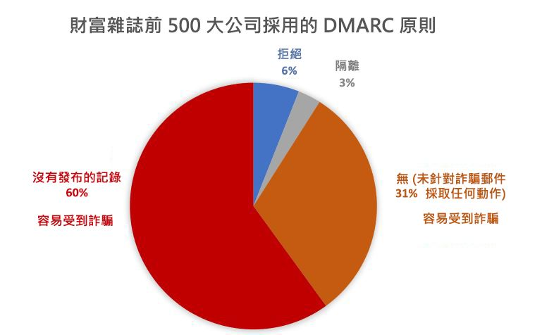

# <a name="email-authentication-in-eop"></a>EOP 中的電子郵件驗證

電子郵件驗證 (又稱為電子郵件驗證) 是一組嘗試停止詐騙 (來自偽造寄件者的電子郵件訊息) 的標準。 在擁有 Exchange Online 信箱的 Microsoft 365 組織中，和沒有 Exchange Online 信箱的獨立版 Exchange Online Protection (EOP) 組織中，EOP 會使用以下標準來驗證內送電子郵件：

- [SPF](how-office-365-uses-spf-to-prevent-spoofing.md)

- [DKIM](support-for-validation-of-dkim-signed-messages.md)

- [DMARC](use-dmarc-to-validate-email.md)

電子郵件驗證會驗證來自寄件者 (例如，laura@contoso.com) 的電子郵件訊息是否合法，以及是否來自該電子郵件網域的預期來源 (例如，contoso.com)。

本主題的其餘部分說明這些技術的運作方式，以及 EOP 如何使用它們來檢查內送電子郵件。

## <a name="use-email-authentication-to-help-prevent-spoofing"></a>使用電子郵件驗證以協助避免詐騙

DMARC 會藉由檢查郵件中的 [寄件者]**** 地址 (使用者在其電子郵件用戶端中看到的寄件者電子郵件地址)，來防止詐騙。 目的地電子郵件組織也可以驗證網域已通過 SPF 或 DKIM，這表示網域已驗證，因此不是偽造的。 

不過，問題是對於電子郵件驗證而言 DNS 中的 SPF、DKIM 和 DMARC 記錄 (統稱為電子郵件驗證原則)，完全是選用的。 因此，雖然採用強式電子郵件驗證原則的網域 (如 microsoft.com 和 skype.com) 可防止詐騙，但是發佈較弱的電子郵件驗證原則、或甚至完全未採用任何原則的網域就成了主要詐騙目標。

截至 2018 年 3 月，在財富雜誌前 500 大公司的網域中，只有 9% 發佈強式的電子郵件驗證原則。 攻擊者可能會對其餘 91% 的公司進行詐騙。 除非有其他的電子郵件篩選機制，否則來自這些網域中偽造寄件者的電子郵件可能會傳送給使用者。



不在財富雜誌前 500 大中的中小型企業，有發佈強式電子郵件驗證原則的比例更少，且北美和西歐地區以外的電子郵件網域具有強式電子郵件驗證原則的比例同樣很少。

這是個嚴重的問題，因為企業可能沒意識到電子郵件驗證的功用，但攻擊者卻瞭若指掌並加以利用。 因為網路釣魚這類問題的發生，以及強式電子郵件驗證原則的採用率有限，Microsoft 使用「隱含電子郵件驗證」** 來檢查內送電子郵件。

隱含電子郵件驗證是根據一般電子郵件驗證原則的許多延伸模組而建立。 這些延伸模組包括寄件者信譽、寄件者歷程記錄、收件者歷程記錄、行為分析，以及其他進階技術。 傳送郵件的網域若未使用電子郵件驗證原則，該郵件將被標示為詐騙郵件，除非郵件包含其他能指出其合法性的訊號。

若要查看 Microsoft 的一般公告，請參閱[網路釣魚的範圍第 2 部分 - Microsoft 365 中增強的反詐騙保護](https://techcommunity.microsoft.com/t5/Security-Privacy-and-Compliance/Schooling-A-Sea-of-Phish-Part-2-Enhanced-Anti-spoofing/ba-p/176209) (英文)。

## <a name="composite-authentication"></a>複合驗證

雖然 SPF、DKIM 和 DMARC 本身是很有幫助，但是如果郵件沒有明確驗證記錄，它們不會傳達足夠的驗證狀態。 因此，Microsoft 開發了隱含電子郵件驗證的演算法，將多個訊號組合成一個稱為_複合驗證_的單一值，或簡稱為 compauth。 系統會在郵件標頭的 **Authentication-Results** 標頭中，註記 compauth 值。

> Authentication-Results:<br/>&nbsp;&nbsp;&nbsp;compauth=\<fail | pass | softpass | none\> reason=\<yyy\>

這些值會在 [Authentication-results 郵件標頭](anti-spam-message-headers.md#authentication-results-message-header)中說明。

系統管理員或甚至是使用者都能透過檢查郵件標題來決定 Microsoft 365 如何判斷寄件者是偽造的。

## <a name="why-email-authentication-is-not-always-enough-to-stop-spoofing"></a>為什麼電子郵件驗證不一定能夠阻止詐騙

只依靠電子郵件驗證記錄來判斷內送郵件是否為詐騙，有下列限制：

- 寄件網域可能沒有所需的 DNS 記錄，或是記錄未正確設定。

- 來源網域具有正確設定的 DNS 記錄，但是該網域與 [寄件者] 地址中的網域不相符。 SPF 和 DKIM 不需要在 [寄件者] 地址中使用網域。 攻擊者或合法服務可以註冊網域、設定網域的 SPF 和 DKIM、在 [寄件者] 地址中使用完全不同的網域，且該郵件會通過 SPF 和 DKIM。

複合驗證可以藉由讓電子郵件檢查失敗的郵件通過，以解決這些限制。

> [!NOTE]
> 如前所述，隱含電子郵件驗證使用多個訊號來判斷郵件是否合法。 為了簡單起見，以下範例著重於電子郵件驗證結果。 其他後端情報因素會將通過電子郵件驗證的郵件視為詐騙，或是將電子郵件驗證失敗的郵件視為合法。

例如，fabrikam.com 網域沒有 SPF、DKIM 或 DMARC 記錄。 來自 fabrikam.com 網域中寄件者的郵件無法通過複合驗證 (請記下 `compauth` 值和原因)：

```text
Authentication-Results: spf=none (sender IP is 10.2.3.4)
  smtp.mailfrom=fabrikam.com; contoso.com; dkim=none
  (message not signed) header.d=none; contoso.com; dmarc=none
  action=none header.from=fabrikam.com; compauth=fail reason=001
From: chris@fabrikam.com
To: michelle@contoso.com
```

如果 fabrikam.com 設定了沒有 DKIM 記錄的 SPF，郵件可以通過複合驗證，因為通過 SPF 的網域與 [寄件者] 地址中的網域相符：

```text
Authentication-Results: spf=pass (sender IP is 10.2.3.4)
  smtp.mailfrom=fabrikam.com; contoso.com; dkim=none
  (message not signed) header.d=none; contoso.com; dmarc=bestguesspass
  action=none header.from=fabrikam.com; compauth=pass reason=109
From: chris@fabrikam.com
To: michelle@contoso.com
```

如果 fabrikam.com 設定了沒有 SPF 記錄的 DKIM 記錄，郵件可以通過複合驗證，因為通過 DKIM 簽章的網域與 [寄件者] 地址中的網域相符：

```text
Authentication-Results: spf=none (sender IP is 10.2.3.4)
  smtp.mailfrom=fabrikam.com; contoso.com; dkim=pass
  (signature was verified) header.d=outbound.fabrikam.com;
  contoso.com; dmarc=bestguesspass action=none
  header.from=fabrikam.com; compauth=pass reason=109
From: chris@fabrikam.com
To: michelle@contoso.com
```

如果 SPF 或 DKIM 簽章中的網域與 [寄件者] 地址中的網域不相符，則該郵件無法通過複合驗證：

```text
Authentication-Results: spf=none (sender IP is 192.168.1.8)
  smtp.mailfrom=maliciousdomain.com; contoso.com; dkim=pass
  (signature was verified) header.d=maliciousdomain.com;
  contoso.com; dmarc=none action=none header.from=contoso.com;
  compauth=fail reason=001
From: chris@contoso.com
To: michelle@fabrikam.com
```

## <a name="solutions-for-legitimate-senders-who-are-sending-unauthenticated-email"></a>傳送未經驗證電子郵件的合法寄件者解決方案

Microsoft 365 會追蹤誰傳送未經驗證電子郵件到您的組織。 如果該服務認為寄件者不合法，則會標示為複合驗證失敗。 若要避免發生此情況，您可以使用本節中的建議。

### <a name="configure-email-authentication-for-domains-you-own"></a>為您擁有的網域設定電子郵件驗證

您可以使用這個方法，在您擁有多個租用戶或與多個租用戶互動的案例中，解決組織內部詐騙和跨網域詐騙。 其也有助於解決跨網域詐騙，您在其中傳送郵件給 Microsoft 365 內的客戶，或其他提供者主控的第三方。

- 為您的網域[設定 SPF 記錄](set-up-spf-in-office-365-to-help-prevent-spoofing.md)。

- 為您的主要網域[設定 DKIM 記錄](use-dkim-to-validate-outbound-email.md)。

- [考量設定 DMARC 記錄](use-dmarc-to-validate-email.md)，讓網域能判斷誰是合法的寄件者。

Microsoft 不會針對 SPF、DKIM 和 DMARC 記錄提供詳細實作指南。 但是，網路上有許多可用資訊。 也有第三方公司可專門協助您的組織設定電子郵件驗證記錄。

#### <a name="you-dont-know-all-sources-for-your-email"></a>您不知道電子郵件的所有來源

許多網域並不會發佈 SPF 記錄，因為它們不知道在其網域中郵件的所有電子郵件來源。 首先，發佈內含您所知道所有電子郵件來源 (尤其是貴公司流量位於何處) 的 SPF 記錄，然後發佈中性 SPF 原則 `?all`。 例如：

```text
fabrikam.com IN TXT "v=spf1 include:spf.fabrikam.com ?all"
```

此範例表示來自公司基礎結構的電子郵件將會通過電子郵件驗證，但是來自不明來源的電子郵件將會回歸中性。

Microsoft 365 會將來自公司基礎結構的內送電子郵件視為已驗證，但是來自無法識別來源的電子郵件可能仍會標示為詐騙 (依據 Microsoft 365 是否可以對其進行隱含驗證而定)。 但是，比起所有電子郵件都被 Microsoft 365 標示為詐騙郵件，這不失為一項改進。

當您開始使用 SPF 後援原則 `?all` 之後，您就可以逐漸探索及包含更多郵件來源，然後使用更嚴格的原則更新您的 SPF 記錄。

### <a name="use-spoof-intelligence-to-configure-permitted-senders-of-unauthenticated-email"></a>使用詐騙情報來設定允許傳送未經驗證電子郵件的寄件者

您也可以使用[詐騙情報](learn-about-spoof-intelligence.md)來允許寄件者將未經驗證的郵件傳送至您的組織。

對於外部網域，詐騙使用者是 [寄件者] 地址中的網域，而傳送基礎結構是來源 IP 位址 (分成 /24 個 CIDR 範圍)，或反向 DNS (PTR) 記錄的組織網域。

在下方的螢幕擷取畫面中，來源 IP 是 131.107.18.4，PTR 記錄是 outbound.mail.protection.outlook.com。 這會針對傳送基礎結構顯示為 outlook.com。

若要允許此寄件者傳送未經驗證的電子郵件，請將 [否] **** 變更為 [是]****。


### <a name="create-an-allow-entry-for-the-senderrecipient-pair"></a>為寄件者/收件者配對建立允許項目

若要略過垃圾郵件篩選、網路釣魚篩選的某些部分，但是不略過特定寄件者的惡意程式碼篩選，請參閱[在 Microsoft 365 中建立安全的寄件者清單](create-safe-sender-lists-in-office-365.md)。

### <a name="ask-the-sender-to-configure-email-authentication-for-domains-you-dont-own"></a>要求寄件者為您未擁有的網域設定電子郵件驗證

有鑑於垃圾郵件和網路釣魚問題，Microsoft 建議針對所有電子郵件組織進行電子郵件驗證。 您可以要求傳送網域中的系統管理員設定其電子郵件驗證記錄，而不是在貴組織中設定手動覆寫。

- 即使他們過去不需要發佈電子郵件驗證記錄，如果他們傳送電子郵件至 Microsoft，就應該這麼做。

- 設定 SPF 來發佈網域的傳送 IP 位址，並設定 DKIM (若可用) 來數位簽署郵件。 他們應該考慮設定 DMARC 記錄。

- 如果他們使用大量寄件者代表他們傳送電子郵件，則要確認 [寄件者] 地址中的網域 (如果屬於他們) 與通過 SPF 或 DMARC 的網域相符。

- 確認下列位置 (如果他們使用這些位置) 包含在 SPF 記錄中：
  
  - 內部部署電子郵件伺服器。
  - 軟體即服務 (SaaS) 提供者傳送的電子郵件。
  - 從雲端主控服務 (Microsoft Azure、GoDaddy、Rackspace、Amazon Web Services 等等) 傳送的電子郵件。

- 針對 ISP 主控的小型網域，根據 ISP 的指示來設定 SPF 記錄。

雖然一開始驗證傳送網域可能會有困難，但隨著時間過去，有越來越多的電子郵件篩選器開始篩選垃圾郵件或甚至拒絕他們的電子郵件，促使他們設定正確記錄以確保更佳的傳遞。 此外，他們的參與可協助抵禦網路釣魚，並能降低組織或電子郵件傳送目標組織中網路釣魚的可能性。

#### <a name="information-for-infrastructure-providers-isps-esps-or-cloud-hosting-services"></a>基礎結構提供者 (ISP、ESP 或雲端主控服務) 的資訊

如果您主控網域的電子郵件，或提供可傳送電子郵件的主控基礎結構，您應該執行下列步驟：

- 請確認您的客戶擁有文件，其中說明客戶應如何設定其 SPF 記錄

- 即使客戶未明確設定 (使用預設網域登入)，仍考慮在外寄電子郵件中簽署 DKIM 簽章。 您甚至可以使用 DKIM 簽章對電子郵件進行雙重簽署 (如果已經設定了客戶的網域，則為第一次，第二次使用您公司的 DKIM簽章)

即使您對來自您的平台的電子郵件進行驗證，也無法保證Microsoft 的可傳遞性，但至少可保證 Microsoft 不會因為郵件未經過驗證，而將它列為垃圾郵件。

如需服務提供者最佳作法的詳細資訊，請參閱[適用服務提供者的 M3AAWG 行動傳訊最佳做法](https://www.m3aawg.org/sites/default/files/M3AAWG-Mobile-Messaging-Best-Practices-Service-Providers-2015-08.pdf)。
