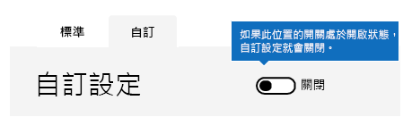

# <a name="enable-or-disable-safety-tips-in-office-365"></a><span data-ttu-id="7199f-103">啟用或停用 Office 365 中的安全提示</span><span class="sxs-lookup"><span data-stu-id="7199f-103">Enable or disable safety tips in Office 365</span></span>

<span data-ttu-id="7199f-104">Exchange Online Protection (EOP) 會對它傳遞的電子郵件加上 (或標記) 安全提示。</span><span class="sxs-lookup"><span data-stu-id="7199f-104">Exchange Online Protection (EOP) adds, or stamps, a safety tip to email messages that it delivers.</span></span> <span data-ttu-id="7199f-105">如果 Office 365 已將郵件標示為垃圾郵件、如果郵件包含某種可疑項目 (例如網路詐騙)，或者如果外部影像已遭到封鎖，這些安全提示會提供收件者快速且視覺化的方式，以判斷郵件是否來自安全且通過驗證的寄件者。</span><span class="sxs-lookup"><span data-stu-id="7199f-105">These safety tips provide recipients with a quick, visual way to determine if a message is from a safe, verified sender, if the message has been marked as spam by Office 365, if the message contains something suspicious such as a phishing scam, or if external images have been blocked.</span></span> <span data-ttu-id="7199f-106">Office 365 和 EOP 獨立系統管理員可編輯垃圾郵件原則設定，以啟用或停用 Outlook 和其他桌面電子郵件用戶端之電子郵件中顯示的安全提示。</span><span class="sxs-lookup"><span data-stu-id="7199f-106">Office 365 and EOP-standalone admins can edit a spam policy setting to enable or disable safety tips from being displayed in email in Outlook and other desktop email clients.</span></span>

<span data-ttu-id="7199f-107">根據預設，Office 365 會為您的組織啟用安全提示，建議您保持啟用，以協助對抗垃圾郵件和網路釣魚攻擊。</span><span class="sxs-lookup"><span data-stu-id="7199f-107">Office 365 enables safety tips by default for your organization and we recommend that you leave them enabled to help combat spam and phishing attacks.</span></span> <span data-ttu-id="7199f-108">您無法停用 Outlook 網頁版的安全提示。</span><span class="sxs-lookup"><span data-stu-id="7199f-108">You can't disable safety tips for Outlook on the web.</span></span>

<span data-ttu-id="7199f-109">若要查看範例並了解安全提示中顯示的資訊，請參閱 [Office 365 電子郵件的安全提示。](safety-tips-in-office-365.md)(部分內容為機器翻譯)</span><span class="sxs-lookup"><span data-stu-id="7199f-109">To see examples and to learn about the information displayed in safety tips, see [Safety tips in email messages in Office 365.](safety-tips-in-office-365.md)</span></span>

<span data-ttu-id="7199f-110">本主題內容：</span><span class="sxs-lookup"><span data-stu-id="7199f-110">In this topic:</span></span>

- [<span data-ttu-id="7199f-111">使用 O365 安全性&amp;與合規性中心啟用或停用安全提示</span><span class="sxs-lookup"><span data-stu-id="7199f-111">To enable or disable safety tips by using the Office 365 Security &amp; Compliance Center</span></span>](enable-or-disable-safety-tips.md#SandCCsafetytip)

- [<span data-ttu-id="7199f-112">使用 PowerShell 啟用或停用安全提示</span><span class="sxs-lookup"><span data-stu-id="7199f-112">To enable or disable safety tips by using PowerShell</span></span>](enable-or-disable-safety-tips.md#pshellsafetytip)

## <a name="to-enable-or-disable-safety-tips-by-using-the-office-365-security-amp-compliance-center"></a><span data-ttu-id="7199f-113">使用 O365 安全性與&amp;合規性中心啟用或停用安全提示</span><span class="sxs-lookup"><span data-stu-id="7199f-113">To enable or disable safety tips by using the Office 365 Security &amp; Compliance Center</span></span>
<span data-ttu-id="7199f-114"><a name="SandCCsafetytip"> </a></span><span class="sxs-lookup"><span data-stu-id="7199f-114"></span></span>

1. <span data-ttu-id="7199f-115">請移至 [https://protection.office.com](https://protection.office.com)。</span><span class="sxs-lookup"><span data-stu-id="7199f-115">Go to [https://protection.office.com](https://protection.office.com).</span></span>

2. <span data-ttu-id="7199f-116">使用您的公司或學校帳戶登入 Office 365。</span><span class="sxs-lookup"><span data-stu-id="7199f-116">Sign in to Office 365 with your work or school account.</span></span>

3. <span data-ttu-id="7199f-117">選擇 **[威脅管理]** \> **[原則]**。</span><span class="sxs-lookup"><span data-stu-id="7199f-117">Choose **Threat Management** \> **Policy**.</span></span>

4. <span data-ttu-id="7199f-118">選擇 **[原則]** 頁面上的 **[反垃圾郵件]**。</span><span class="sxs-lookup"><span data-stu-id="7199f-118">On the **Policy** page, choose **Anti-Spam**.</span></span>

    ![這個螢幕擷取畫面顯示如何前往安全性 &amp; 合規性中心中的 [反垃圾郵件] 設定頁面。](../media/b8eb2ee3-2eb1-4ea2-b138-f6d7fb2e23de.png)

5. <span data-ttu-id="7199f-120">選擇 **[垃圾郵件防護設定]** 頁面上的 **[自訂]** 索引標籤。</span><span class="sxs-lookup"><span data-stu-id="7199f-120">On the **Anti-spam settings** page choose the **Custom** tab.</span></span>

    ![此螢幕擷取畫面顯示安全性 &amp; 合規性中心中之 [反垃圾郵件] 設定頁面上的 [自訂] 索引標籤位置。](../media/1d688d23-e6f3-4de5-84a7-e8ce31786193.png)

6. <span data-ttu-id="7199f-122">如有需要，請選擇 **[自訂設定]** 開關，以開啟自訂設定。</span><span class="sxs-lookup"><span data-stu-id="7199f-122">If necessary, choose the **Custom settings** switch to turn on custom settings.</span></span> <span data-ttu-id="7199f-123">如果自訂設定開關已設為 **[關閉]**，您將無法修改垃圾郵件篩選原則。</span><span class="sxs-lookup"><span data-stu-id="7199f-123">If the custom settings switch is set to **Off**, you won't be able to modify spam filter policies.</span></span>

    

7. <span data-ttu-id="7199f-125">展開您要修改的垃圾郵件原則，然後選擇 **[編輯原則]**。</span><span class="sxs-lookup"><span data-stu-id="7199f-125">Expand the spam policy you want to modify and then choose **Edit policy**.</span></span> <span data-ttu-id="7199f-126">例如，選擇 **[預設垃圾郵件篩選原則]** 旁邊的向下箭號。</span><span class="sxs-lookup"><span data-stu-id="7199f-126">For example, choose the down arrow next to **Default spam filter policy**.</span></span> <span data-ttu-id="7199f-127">或者，您可以視需要選擇 **[新增原則]** 來建立新原則。</span><span class="sxs-lookup"><span data-stu-id="7199f-127">Or, if you want, you can create a new policy by choosing **Add a policy**.</span></span>

8. <span data-ttu-id="7199f-128">展開 **[垃圾郵件及大量]** 動作。</span><span class="sxs-lookup"><span data-stu-id="7199f-128">Expand **Spam and bulk** actions.</span></span>

9. <span data-ttu-id="7199f-129">若要啟用安全提示，請在 **[安全提示]** 底下，選取 **[開啟]** 核取方塊。</span><span class="sxs-lookup"><span data-stu-id="7199f-129">To enable safety tips, under **Safety Tips**, check the **On** checkbox.</span></span> <span data-ttu-id="7199f-130">若要停用安全提示，請清除 **[開啟]** 核取方塊。</span><span class="sxs-lookup"><span data-stu-id="7199f-130">To disable safety tips, clear the **On** checkbox.</span></span>

10. <span data-ttu-id="7199f-131">選擇 **[儲存]**。</span><span class="sxs-lookup"><span data-stu-id="7199f-131">Choose **Save**.</span></span>

## <a name="to-enable-or-disable-safety-tips-by-using-powershell"></a><span data-ttu-id="7199f-132">使用 PowerShell 啟用或停用安全提示</span><span class="sxs-lookup"><span data-stu-id="7199f-132">To enable or disable safety tips by using PowerShell</span></span>
<span data-ttu-id="7199f-133"><a name="pshellsafetytip"> </a></span><span class="sxs-lookup"><span data-stu-id="7199f-133"></span></span>

<span data-ttu-id="7199f-134">系統管理員可以使用 Exchange Online PowerShell 來啟用或停用安全提示。</span><span class="sxs-lookup"><span data-stu-id="7199f-134">Admins can use Exchange Online PowerShell to enable or disable safety tips.</span></span> <span data-ttu-id="7199f-135">使用 Set-HostedContentFilterPolicy cmdlet 啟用或停用垃圾郵件篩選原則中的安全提示。</span><span class="sxs-lookup"><span data-stu-id="7199f-135">Use the Set-HostedContentFilterPolicy cmdlet to enable or disable safety tips in a spam filter policy.</span></span>

1. <span data-ttu-id="7199f-136">連線至 Exchange Online PowerShell。</span><span class="sxs-lookup"><span data-stu-id="7199f-136">Connect to Exchange Online PowerShell</span></span> <span data-ttu-id="7199f-137">如需資訊，請參閱 [連線至 Exchange Online PowerShell](https://docs.microsoft.com/powershell/exchange/exchange-online/connect-to-exchange-online-powershell/connect-to-exchange-online-powershell)。</span><span class="sxs-lookup"><span data-stu-id="7199f-137">For more information, see [Connect to Exchange Online PowerShell](https://docs.microsoft.com/powershell/exchange/exchange-online/connect-to-exchange-online-powershell/connect-to-exchange-online-powershell).</span></span>

2. <span data-ttu-id="7199f-138">執行 Set-HostedContentFilterPolicy cmdlet 啟用或停用安全提示：</span><span class="sxs-lookup"><span data-stu-id="7199f-138">Run the Set-HostedContentFilterPolicy cmdlet to enable or disable safety tips:</span></span>

   ```powershell
   Set-HostedContentFilterPolicy -Identity "policy name " -InlineSafetyTipsEnabled <$true | $false>
   ```

<span data-ttu-id="7199f-139">其中：</span><span class="sxs-lookup"><span data-stu-id="7199f-139">Where:</span></span>

- <span data-ttu-id="7199f-140">*原則名稱*是您要修改的原則名稱，例如 **[預設]**。</span><span class="sxs-lookup"><span data-stu-id="7199f-140">*policy name*  is the name of the policy you want to modify, for example **default**.</span></span>

- <span data-ttu-id="7199f-141">`$true` 會啟用垃圾郵件篩選原則的安全提示。</span><span class="sxs-lookup"><span data-stu-id="7199f-141">`$true` enables safety tips for the spam filter policy.</span></span>

- <span data-ttu-id="7199f-142">`$false` 會停用垃圾郵件篩選原則的安全提示。</span><span class="sxs-lookup"><span data-stu-id="7199f-142">`$false` disables safety tips for the spam filter policy.</span></span>

<span data-ttu-id="7199f-143">例如，若要停用預設垃圾郵件篩選原則的安全提示，請執行下列命令：</span><span class="sxs-lookup"><span data-stu-id="7199f-143">For example, to disable safety tips for the default spam filter policy, run the following command:</span></span>

```powershell
Set-HostedContentFilterPolicy -Identity "default" -InlineSafetyTipsEnabled $false
```

<span data-ttu-id="7199f-144">如需有關此 cmdlet 的詳細資訊，請參閱 [Set-HostedContentFilterPolicy](https://docs.microsoft.com/powershell/module/exchange/antispam-antimalware/set-hostedcontentfilterpolicy) (部分內容為機器翻譯)。</span><span class="sxs-lookup"><span data-stu-id="7199f-144">For more information about this cmdlet, see [Set-Msolcompanysettings](https://docs.microsoft.com/powershell/module/exchange/antispam-antimalware/set-hostedcontentfilterpolicy).</span></span>

## <a name="still-need-help"></a><span data-ttu-id="7199f-145">仍需要協助嗎？</span><span class="sxs-lookup"><span data-stu-id="7199f-145">Still need help?</span></span>
<span data-ttu-id="7199f-146"><a name="pshellsafetytip"> </a></span><span class="sxs-lookup"><span data-stu-id="7199f-146"></span></span>

<span data-ttu-id="7199f-147">如果您已停用安全提示，但仍在電子郵件中看到安全提示，請檢查下列項目：</span><span class="sxs-lookup"><span data-stu-id="7199f-147">If you disabled safety tips but are still seeing them in your email messages, check these things:</span></span>

- <span data-ttu-id="7199f-148">您無法停用 Outlook 網頁版的安全提示。</span><span class="sxs-lookup"><span data-stu-id="7199f-148">You can't disable safety tips for Outlook on the web.</span></span> <span data-ttu-id="7199f-149">嘗試在其他用戶端 (例如 Outlook) 檢視同一封電子郵件。</span><span class="sxs-lookup"><span data-stu-id="7199f-149">Try viewing the same email in another client, such as Outlook.</span></span>

- <span data-ttu-id="7199f-150">根據預設，每位使用 EOP 的人員的安全提示都是開啟狀態，這包括擁有 Office 365 的每個人。</span><span class="sxs-lookup"><span data-stu-id="7199f-150">Safety tips are on by default for every one who uses EOP, this includes everyone who has Office 365.</span></span> <span data-ttu-id="7199f-151">為了停用安全提示使它們不再顯示於電子郵件中，您必須按本主題所述使用垃圾郵件篩選原則停用它們。</span><span class="sxs-lookup"><span data-stu-id="7199f-151">In order to disable safety tips from showing up in email, you must disable them by using a spam filter policy as described in this topic.</span></span> <span data-ttu-id="7199f-152">一旦您設定完原則，請確認已將它啟用。</span><span class="sxs-lookup"><span data-stu-id="7199f-152">Once you've set up the policy, ensure that it is enabled.</span></span> <span data-ttu-id="7199f-153">如需有關啟用垃圾郵件篩選原則的資訊，請參閱[設定您的垃圾郵件篩選原則](configure-your-spam-filter-policies.md) (部分內容為機器翻譯)。</span><span class="sxs-lookup"><span data-stu-id="7199f-153">For information on enabling spam filter policies, see [Configure your spam filter policies](configure-your-spam-filter-policies.md).</span></span>

<span data-ttu-id="7199f-154">如需有關對抗垃圾郵件和網路釣魚的更多方式，請參閱 [Office 365 電子郵件的反垃圾郵件保護](anti-spam-protection.md) (部分內容為機器翻譯)。</span><span class="sxs-lookup"><span data-stu-id="7199f-154">For more ways to combat spam and phishing, see [Office 365 Email Anti-Spam Protection](anti-spam-protection.md).</span></span>
