# 啟用報告訊息增益集Enable the Report Message add-in

> [!NOTE]
> Outlook 和 Outlook 網頁版的 [報告訊息] 增益集與 [Outlook 垃圾郵件篩選工具](https://support.office.com/article/5ae3ea8e-cf41-4fa0-b02a-3b96e21de089)並不完全相同，但兩者皆可用來將電子郵件標示為垃圾郵件、非垃圾郵件或網路釣魚。The Report Message add-in for Outlook and Outlook on the web is not exactly the same thing as the [Outlook Junk Email Filter](https://support.office.com/article/5ae3ea8e-cf41-4fa0-b02a-3b96e21de089), although both can be used to mark email as junk, not junk, or a phishing attempt. 差異在於 Outlook 和 Outlook 網頁版的 [報告訊息] 增益集會通知 Microsoft 有關分類錯誤的電子郵件，而 Outlook 垃圾郵件篩選工具則用來組織使用者信箱中的電子郵件。The difference is, the Report Message add-in for Outlook and Outlook on the web notifies Microsoft about misclassified email, whereas the Outlook Junk Email Filter is used to organize email messages in a user's mailbox.

## 概觀Overview

Outlook 和 Outlook 網頁版的 [報告訊息] 增益集可讓人員輕鬆地向 Microsoft 及其子公司報告分類錯誤的電子郵件 (無論安全或惡意)，以便進行分析。The Report Message add-in for Outlook and Outlook on the web enables people to easily report misclassified email, whether safe or malicious, to Microsoft and its affiliates for analysis. Microsoft 會使用這些提交來改善電子郵件防護技術的有效性。Microsoft uses these submissions to improve the effectiveness of email protection technologies. 此外，如果貴組織使用 [Office 365 進階威脅防護方案 1](office-365-atp.md) 或[方案 2](office-365-ti.md)，則 [報告訊息] 增益集會向貴組織的安全性小組提供實用資訊，以便用於檢閱及更新安全性原則。In addition, if your organization is using [Office 365 Advanced Threat Protection Plan 1](office-365-atp.md) or [Plan 2](office-365-ti.md), the Report Message add-in provides your organization's security team with useful information they can use to review and update security policies.

例如，假設使用者將大量訊息回報為網路釣魚。For example, suppose that people are reporting a lot of messages as phishing. 此資訊會顯示在[安全性儀表板](security-dashboard.md)及其他報告中。This information surfaces in the [Security Dashboard](security-dashboard.md) and other reports. 貴組織的安全性小組可以使用此資訊來表示可能需要更新防網路釣魚原則。Your organization's security team can use this information as an indication that anti-phishing policies might need to be updated. 或者，如果有人使用 [報告訊息] 增益集，回報大量被標示為垃圾郵件的訊息，則貴組織的安全性小組可能需要調整[反垃圾郵件原則](configure-the-anti-spam-policies.md)。Or, if people are reporting a lot of messages that were flagged as junk mail as Not Junk by using the Report Message add-in, your organization's security team might need to adjust [anti-spam policies](configure-the-anti-spam-policies.md).

[報告訊息] 增益集適用於您的 Office 365 訂用帳戶和下列產品：The Report Message add-in works with your Office 365 subscription and the following products:
 - Outlook 網頁版Outlook on the web
 - Outlook 2013 SP1Outlook 2013 SP1
 - Outlook 2016Outlook 2016
 - Mac 版 Outlook 2016Outlook 2016 for Mac
 - Office 365 專業增強版隨附的 OutlookOutlook included with Office 365 ProPlus

您現有的網頁瀏覽器應足以讓 [報告訊息] 增益集運作。不過，如果您發現增益集無法使用或無法如預期般運作，請嘗試使用不同的瀏覽器。Your existing web browser should suffice for the Report Message add-in to work; however, if you notice the add-in is not available or not working as expected, try a different browser.

如果您是個人使用者，您可以[自行啟用 [報告訊息] 增益集](#get-the-report-message-add-in-for-yourself)。If you're an individual user, you can [enable the Report Message add-in for yourself](#get-the-report-message-add-in-for-yourself).

如果您是 Office 365 全域系統管理員或 Exchange Online 系統管理員，且 Exchange 已設定為使用 OAuth 驗證，您可以[為貴組織啟用 [報告訊息] 增益集](#get-and-enable-the-report-message-add-in-for-your-organization)。If you're an Office 365 global administrator or an Exchange Online administrator, and Exchange is configured to use OAuth authentication, you can [enable the Report Message add-in for your organization](#get-and-enable-the-report-message-add-in-for-your-organization). [報告訊息] 增益集現可透過[集中式部署](https://docs.microsoft.com/office365/admin/manage/centralized-deployment-of-add-ins)提供。The Report Message Add-In is now available through [Centralized Deployment](https://docs.microsoft.com/office365/admin/manage/centralized-deployment-of-add-ins).

## 自行取得報告訊息增益集Get the Report Message add-in for yourself

1. 在 [Microsoft AppSource](https://appsource.microsoft.com/marketplace/apps) 中，搜尋[報告訊息增益集](https://appsource.microsoft.com/product/office/wa104381180)。In [Microsoft AppSource](https://appsource.microsoft.com/marketplace/apps), search for the [Report Message add-in](https://appsource.microsoft.com/product/office/wa104381180).

2. 選擇 [立即取得]\*\*\*\*。Choose **GET IT NOW**.

   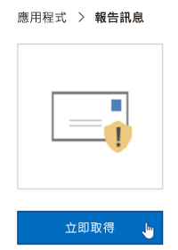

3. 檢閱使用條款和隱私權原則。Review the terms of use and privacy policy. 然後選擇 [繼續]\*\*\*\*。Then choose **Continue**.

4. 使用您的公司或學校帳戶 (商務用途) 或您的 Microsoft 帳戶 (個人用途) 登入 Office 365。Sign in to Office 365 using your work or school account (for business use) or your Microsoft account (for personal use).

安裝並啟用增益集之後，您會看到下列圖示：After the add-in is installed and enabled, you'll see the following icons:

- 在 Outlook 中，圖示如下所示：In Outlook, the icon looks like this:

  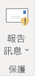

- 在 Outlook 網頁版 (先前為 Outlook Web 應用程式) 中，圖示如下所示：In Outlook on the web (formerly known as Outlook Web App), the icon looks like this:

  

> [!TIP]
> 在下一個步驟中，了解如何[使用報告訊息增益集](https://support.office.com/article/b5caa9f1-cdf3-4443-af8c-ff724ea719d2)。As a next step, learn how to [Use the Report Message add-in](https://support.office.com/article/b5caa9f1-cdf3-4443-af8c-ff724ea719d2).

## 為貴組織取得和啟用報告訊息增益集Get and enable the Report Message add-in for your organization

> [!IMPORTANT]
> 您必須是 Office 365 全域系統管理員或 Exchange Online 系統管理員才能完成此工作。You must be an Office 365 global administrator or an Exchange Online Administrator to complete this task. 此外，Exchange 必須設定為使用 OAuth 驗證。若要深入了解，請參閱 [Exchange 需求 (增益集的集中式部署)](https://docs.microsoft.com/office365/admin/manage/centralized-deployment-of-add-ins)。In addition, Exchange must be configured to use OAuth authentication To learn more, see [Exchange requirements (Centralized Deployment of add-ins)](https://docs.microsoft.com/office365/admin/manage/centralized-deployment-of-add-ins).

1. 移至 Microsoft 365 系統管理中心的[服務與增益集頁面](https://admin.microsoft.com/AdminPortal/Home#/Settings/ServicesAndAddIns)。Go to the [Services & add-ins page](https://admin.microsoft.com/AdminPortal/Home#/Settings/ServicesAndAddIns) in the Microsoft 365 admin center.

   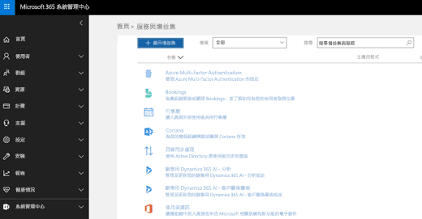

2. 選擇 [+ 部署增益集]\*\*\*\*。Choose **+ Deploy Add-in**.

   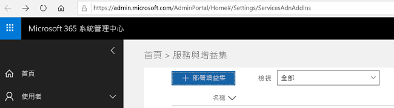

3. 在 [新增增益集]\*\*\*\* 畫面中，檢閱資訊，然後選擇 [下一步]\*\*\*\*。In the **New Add-In** screen, review the information, and then choose **Next**.

   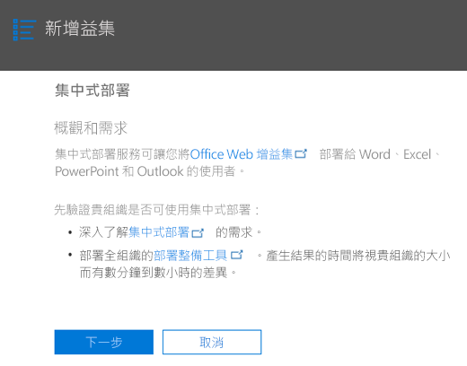

4. 選取 [我想要從 Office 市集新增增益集]\*\*\*\*，然後選擇 [下一步]\*\*\*\*。Select **I want to add an Add-In from the Office Store**, and then choose **Next**.

   

5. 搜尋 [報告訊息]\*\*\*\*，然後在結果清單中，選擇 [報告訊息增益集]\*\*\*\* 旁邊的 [新增]\*\*\*\*。Search for **Report Message**, and in the list of results, next to the **Report Message Add-In**, choose **Add**.

   ![搜尋 [報告訊息]，然後選擇 [新增]](../media/NewAddInScreen3.png)

6. 在 [報告訊息]\*\*\*\* 畫面上，檢閱資訊，然後選擇 [下一步]\*\*\*\*。On the **Report Message** screen, review the information, and then choose **Next**.

   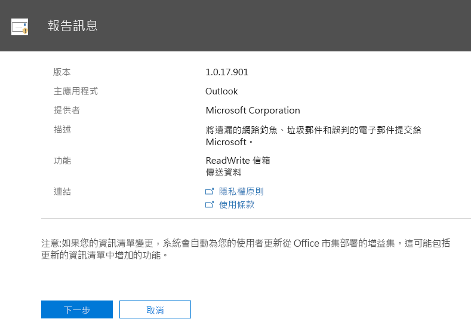

7. 指定 Outlook 的使用者預設設定，然後 選擇 [下一步]\*\*\*\*。Specify the user default settings for Outlook, and  then choose **Next**.

   ![Outlook 的 [報告訊息] 預設設定](../media/ReportMessageOptionsScreen5.png)

8. 指定誰可取得 [報告訊息] 增益集，然後選擇 [儲存]\*\*\*\*。Specify who gets the Report Message Add-in, and then choose **Save**.

   ![誰可取得 [報告訊息] 增益集](../media/ReportMessageOptionsScreen6.png)

> [!TIP]
> 我們建議[設定規則，以取得由使用者所報告的電子郵件複本](#set-up-a-rule-to-get-a-copy-of-email-messages-reported-by-your-users)。We recommend [setting up a rule to get a copy of email messages reported by your users](#set-up-a-rule-to-get-a-copy-of-email-messages-reported-by-your-users).

視您在設定增益集時 (上面步驟 7-8) 所選取的內容而定，貴組織中的人員將擁有[報告訊息增益集](https://support.office.com/article/b5caa9f1-cdf3-4443-af8c-ff724ea719d2)。Depending on what you selected when you set up the add-in (steps 7-8 above), people in your organization will have the [Report Message add-in](https://support.office.com/article/b5caa9f1-cdf3-4443-af8c-ff724ea719d2) available. 貴組織中的人員會看到下列圖示：People in your organization will see the following icons:

- 在 Outlook 中，圖示如下所示：In Outlook, the icon looks like this:

  

- 在 Outlook 網頁版中，圖示如下所示：In Outlook on the web, the icon looks like this:

  

> [!TIP]
> 當您通知使用者關於 [報告訊息] 增益集時，請包含[使用報告訊息增益集](https://support.office.com/article/b5caa9f1-cdf3-4443-af8c-ff724ea719d2)的連結。When you notify users about the Report Message add-in, include a link to [Use the Report Message add-in](https://support.office.com/article/b5caa9f1-cdf3-4443-af8c-ff724ea719d2).

## 設定規則，以取得由您的使用者所報告的電子郵件複本Set up a rule to get a copy of email messages reported by your users

> [!IMPORTANT]
> 您必須是 Exchange Online 系統管理員才能執行此工作。You must be an Exchange Online Administrator to perform this task.

您可以設定規則，以取得貴組織中的使用者所報告的電子郵件複本。You can set up a rule to get a copy of email messages reported by users in your organization. 為貴組織下載並啟用 [報告訊息] 增益集之後，您就會這麼做。You do this after you have downloaded and enabled the Report Message add-in for your organization.

1. 在 Exchange 系統管理中心，選擇 [郵件流程]\*\*\*\* \> [規則]\*\*\*\*。In the Exchange admin center, choose **mail flow** \> **rules**.

2. 選擇 **+** \> [建立新的規則]\*\*\*\*。Choose **+** \> **Create a new rule**.

3. 在 [名稱]\*\*\*\* 方塊中，鍵入名稱，例如 [提交]。In the **Name** box, type a name, such as Submissions.

4. 在 [如果出現下列情況，請套用這個規則]\*\*\*\* 清單中，請選擇 [收件者位址包含...]\*\*\*\*。In the **Apply this rule if** list, choose **The recipient address includes...**.

5. 在 [指定字詞或片語]\*\*\*\* 畫面中，新增 `junk@office365.microsoft.com` 和 `phish@office365.microsoft.com`，然後選擇 [確定]\*\*\*\*。In the **specify words or phrases** screen, add `junk@office365.microsoft.com` and `phish@office365.microsoft.com`, and then choose **OK**.

   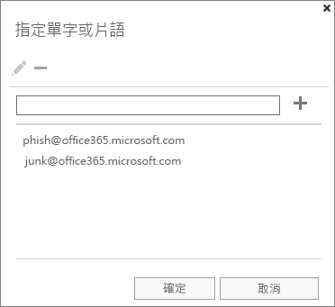

6. 在 [執行下列動作...]\*\*\*\* 清單中，選擇 [將此郵件以密件副本傳送到…]\*\*\*\*。In the **Do the following...** list, choose **Bcc the message to...**.

7. 新增全域系統管理員、安全性系統管理員和/或安全性讀者，他們應會收到人員向 Microsoft 回報告的每封電子郵件複本，然後選擇 [確定]\*\*\*\*。Add a global administrator, security administrator, and/or security reader who should receive a copy of each email message that people report to Microsoft, and then choose **OK**.

   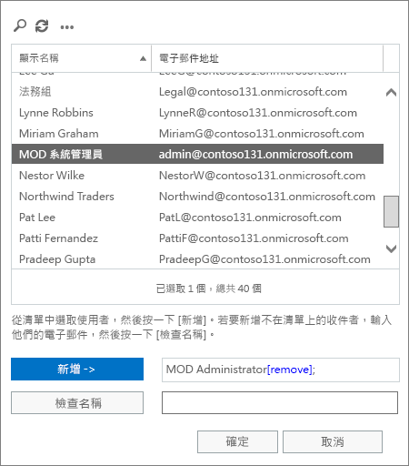

8. 選取 [以嚴重性等級稽核此規則]\*\*\*\*，然後選擇 [中]\*\*\*\*。Select **Audit this rule with severity level**, and choose **Medium**.

9. 在 [選擇此規則的模式]\*\*\*\* 底下，選擇 [強制執行]\*\*\*\*。Under **Choose a mode for this rule**, choose **Enforce**.

   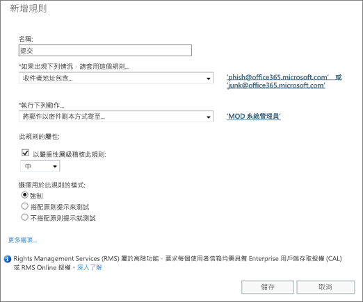

10. 選擇 [儲存]\*\*\*\*。Choose **Save**.

備妥此規則後，每當貴組織中的人員使用 [報告訊息] 增益集來報告電子郵件時，您的全域系統管理員、安全性系統管理員和/或安全性讀者將會收到該郵件的複本。With this rule in place, whenever someone in your organization reports an email message using the Report Message add-in, your global administrator, security administrator, and/or security reader will receive a copy of that message. 此資訊可讓您設定或調整原則，例如 [Office 365 ATP 安全連結](atp-safe-links.md)原則，或[反垃圾郵件](anti-spam-protection.md)設定。This information can enable you to set up or adjust policies, such as [Office 365 ATP Safe Links](atp-safe-links.md) policies, or your [anti-spam](anti-spam-protection.md) settings.

## 了解如何使用報告訊息增益集Learn how to use the Report Message add-in

請參閱[使用報告訊息增益集](https://support.office.com/article/b5caa9f1-cdf3-4443-af8c-ff724ea719d2)。See [Use the Report Message add-in](https://support.office.com/article/b5caa9f1-cdf3-4443-af8c-ff724ea719d2).

## 檢閱或編輯報告訊息增益集的設定Review or edit settings for the Report Message add-in

您可以在[服務與增益集頁面](https://admin.microsoft.com/AdminPortal/Home#/Settings/ServicesAndAddIns)上檢閱及編輯 [報告訊息] 增益集的預設設定。You can review and edit the default settings for the Report Message add-in on the [Services & Add-Ins page](https://admin.microsoft.com/AdminPortal/Home#/Settings/ServicesAndAddIns).

> [!IMPORTANT]
> 您必須是 Office 365 全域系統管理員或 Exchange Online 系統管理員才能完成此工作。You must be an Office 365 global administrator or an Exchange Online Administrator to complete this task.

1. 移至 Microsoft 365 系統管理中心的[服務與增益集頁面](https://admin.microsoft.com/AdminPortal/Home#/Settings/ServicesAndAddIns)。Go to the [Services & add-ins page](https://admin.microsoft.com/AdminPortal/Home#/Settings/ServicesAndAddIns) in the Microsoft 365 admin center.

   

2. 尋找並選取報告訊息增益集。Find and select the Report Message add-in.

   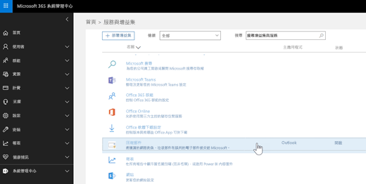

3. 在 [報告訊息] 畫面上，檢閱及編輯您組織的相關設定。On the Report Message screen, review and edit settings as appropriate for your organization.

   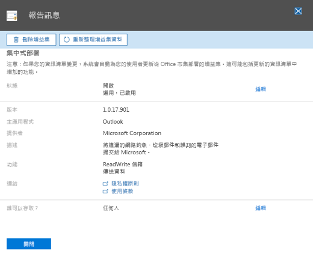

## 相關主題Related topics

[使用報告訊息增益集Use the Report Message add-in](https://support.office.com/article/b5caa9f1-cdf3-4443-af8c-ff724ea719d2)

[檢視安全性與合規性中心內的電子郵件安全性報告View email security reports in the Security &amp; Compliance Center](view-email-security-reports.md)

[檢視 Office 365 進階威脅防護的報告View reports for Office 365 Advanced Threat Protection](view-reports-for-atp.md)

[使用安全性與合規性中心的總管Use Explorer in the Security &amp; Compliance Center](threat-explorer.md)
