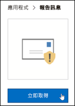
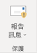
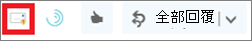
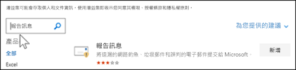
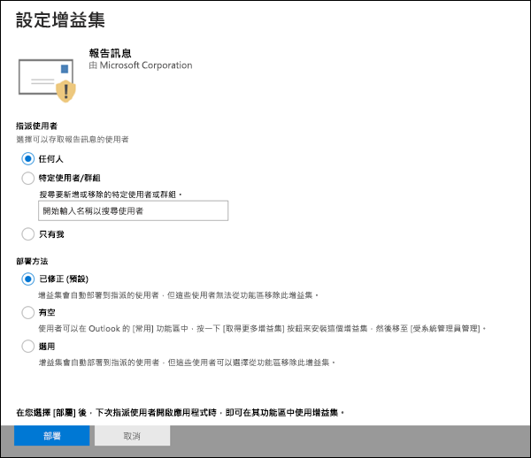
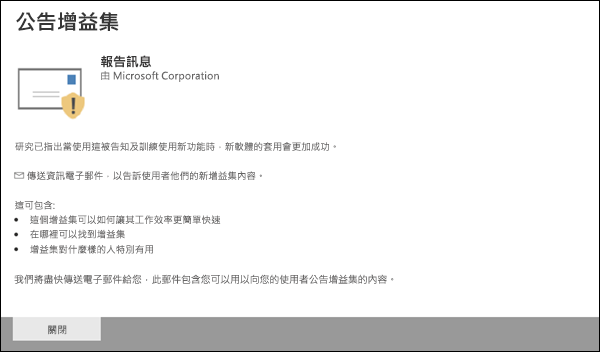
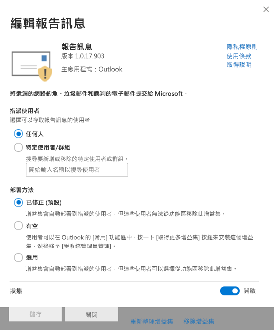

# 啟用報告訊息增益集Enable the Report Message add-in

> [!NOTE]
> 如果您是 Exchange Online 信箱組織中的系統管理員，建議您在安全性 & 規範中心內使用提交入口網站。If you're an admin in an organization with Exchange Online mailboxes, we recommend that you use the Submissions portal in the Security & Compliance Center. 如需詳細資訊，請參閱[使用系統管理員提交將可疑的垃圾郵件、網路釣魚、URLs 和檔案提交給 Microsoft](admin-submission.md)。For more information, see [Use Admin Submission to submit suspected spam, phish, URLs, and files to Microsoft](admin-submission.md).

Outlook 和網頁型 Outlook （先前稱為 Outlook Web App）的報告訊息增益集可讓使用者輕鬆地將誤報（良好的電子郵件標記為壞的電子郵件）或 "漏報（不正確的電子郵件）] 報告給 Microsoft 及其子公司進行分析。The Report Message add-in for Outlook and Outlook on the web (formerly known as Outlook Web App) enables people to easily report false positives (good email marked as bad) or false negatives (bad email allowed) to Microsoft and its affiliates for analysis. Microsoft 會使用這些提交來改善電子郵件防護技術的有效性。Microsoft uses these submissions to improve the effectiveness of email protection technologies.

例如，假設使用者將大量訊息回報為網路釣魚。For example, suppose that people are reporting a lot of messages as phishing. 此資訊會顯示在[安全性儀表板](security-dashboard.md)及其他報告中。This information surfaces in the [Security Dashboard](security-dashboard.md) and other reports. 貴組織的安全性小組可以使用此資訊來表示可能需要更新防網路釣魚原則。Your organization's security team can use this information as an indication that anti-phishing policies might need to be updated. 或者，如果有人使用 [報告訊息] 增益集，回報大量被標示為垃圾郵件的訊息，則貴組織的安全性小組可能需要調整[反垃圾郵件原則](configure-your-spam-filter-policies.md)。Or, if people are reporting a lot of messages that were flagged as junk mail as Not Junk by using the Report Message add-in, your organization's security team might need to adjust [anti-spam policies](configure-your-spam-filter-policies.md).

此外，如果貴組織使用 [Office 365 進階威脅防護方案 1](office-365-atp.md) 或[方案 2](office-365-ti.md)，則 [報告訊息] 增益集會向貴組織的安全性小組提供實用資訊，以便用於檢閱及更新安全性原則。In addition, if your organization is using [Office 365 Advanced Threat Protection Plan 1](office-365-atp.md) or [Plan 2](office-365-ti.md), the Report Message add-in provides your organization's security team with useful information they can use to review and update security policies.

系統管理員可以為組織啟用「報告訊息增益集」，個別使用者可以自行自行安裝。Admins can enable the Report Message add-in for the organization, and individual users can install it for themselves.

如果您是個人使用者，您可以[自行啟用 [報告訊息] 增益集](#get-the-report-message-add-in-for-yourself)。If you're an individual user, you can [enable the Report Message add-in for yourself](#get-the-report-message-add-in-for-yourself).

如果您是全域系統管理員或 Exchange Online 系統管理員，且 Exchange 設定成使用 OAuth 驗證，您可以[為組織啟用報告訊息增益集](#get-and-enable-the-report-message-add-in-for-your-organization)。If you're a global administrator or an Exchange Online administrator, and Exchange is configured to use OAuth authentication, you can [enable the Report Message add-in for your organization](#get-and-enable-the-report-message-add-in-for-your-organization). [報告訊息] 增益集現可透過[集中式部署](https://docs.microsoft.com/office365/admin/manage/centralized-deployment-of-add-ins)提供。The Report Message Add-In is now available through [Centralized Deployment](https://docs.microsoft.com/office365/admin/manage/centralized-deployment-of-add-ins).

## 開始之前有哪些須知？What do you need to know before you begin?

- 報告訊息增益集可與大多數 Microsoft 365 訂閱及下列產品搭配使用：The Report Message add-in works with most Microsoft 365 subscriptions and the following products:

  - Outlook 網頁版Outlook on the web
  - Outlook 2013 SP1 或更新版本Outlook 2013 SP1 or later
  - Mac 版 Outlook 2016Outlook 2016 for Mac
  - Outlook 隨附于適用于企業的 Microsoft 365 應用程式Outlook included with Microsoft 365 apps for Enterprise

- 報告郵件增益集目前不適用於下列專案：The Report Message add-in is currently not available for:

  - 內部部署 Exchange 組織中的信箱Mailboxes in on-premises Exchange organizations
  - GCC、GCC 高階或 DoD 訂閱GCC, GCC HIGH, or DoD subscriptions

- 您可以設定報告的郵件以複製或重新導向至您指定的信箱。You can configure reported messages to be copied or redirected to a mailbox that you specify. 如需詳細資訊，請參閱[在 Office 365 中指定使用者送出垃圾郵件和網路釣魚郵件的信箱](user-submission.md)。For more information, see [Specify a mailbox for user submissions of spam and phishing messages in Office 365](user-submission.md).

- 您的現有網頁瀏覽器應該使用報表訊息增益集。Your existing web browser should work with the Report Message add-in. 不過，如果您注意到增益集無法使用或如預期般運作，請嘗試其他瀏覽器。But, if you notice the add-in is not available or not working as expected, try a different browser.

- 若為組織安裝，必須設定組織使用 OAuth 驗證。For organizational installs, the organization needs to be configured to use OAuth authentication. 如需詳細資訊，請參閱[判斷是否集中式部署的增益集可為您的組織運作](../../admin/manage/centralized-deployment-of-add-ins.md)。For more information, see [Determine if Centralized Deployment of add-ins works for your organization](../../admin/manage/centralized-deployment-of-add-ins.md).

- 管理員必須是全域系統管理員角色群組的成員。Admins need to be a member of the Global admins role group. 如需詳細資訊，請參閱[安全性與合規性中心中的權限](permissions-in-the-security-and-compliance-center.md)。For more information, see [Permissions in the Security & Compliance Center](permissions-in-the-security-and-compliance-center.md).

## 自行取得報告訊息增益集Get the Report Message add-in for yourself

1. 移至 Microsoft AppSource <https://appsource.microsoft.com/marketplace/apps> ，並搜尋報告訊息增益集。Go to the Microsoft AppSource at <https://appsource.microsoft.com/marketplace/apps> and search for the Report Message add-in. 若要直接移至報告訊息增益集，請移至<https://appsource.microsoft.com/product/office/wa104381180>。To go directly to the Report Message add-in, go to <https://appsource.microsoft.com/product/office/wa104381180>.

2. 按一下 [**立即取得**]。Click **GET IT NOW**.

   

3. 在出現的對話方塊中，複查使用條款和隱私權原則，然後按一下 [**繼續**]。In the dialog that appears, review the terms of use and privacy policy, and then click **Continue**.

4. 使用您的工作或學校帳戶（供商務用）或您的 Microsoft 帳戶（專為個人用途）登入。Sign in using your work or school account (for business use) or your Microsoft account (for personal use).

安裝並啟用增益集之後，您會看到下列圖示：After the add-in is installed and enabled, you'll see the following icons:

- 在 Outlook 中，圖示如下所示：In Outlook, the icon looks like this:

  

- 在 Outlook 網頁版中，圖示如下所示：In Outlook on the web, the icon looks like this:

  

若要瞭解如何使用增益集，請參閱[use The Report Message 增益集](https://support.office.com/article/b5caa9f1-cdf3-4443-af8c-ff724ea719d2)。To learn how to use the add-in, see [Use the Report Message add-in](https://support.office.com/article/b5caa9f1-cdf3-4443-af8c-ff724ea719d2).

## 為貴組織取得和啟用報告訊息增益集Get and enable the Report Message add-in for your organization

> [!NOTE]
> 在您的組織中顯示增益集可能需要長達12小時。It could take up to 12 hours for the add-in to appear in your organization.

1. 在 Microsoft 365 系統管理中心中，移至的 [**服務] & 增益集**] <https://admin.microsoft.com/AdminPortal/Home#/Settings/ServicesAndAddIns>頁面上，然後按一下 [**部署 Add-In**]。In the Microsoft 365 admin center, go to the **Services & add-ins** page at <https://admin.microsoft.com/AdminPortal/Home#/Settings/ServicesAndAddIns>, and then click **Deploy Add-In**.

   ![Microsoft 365 系統管理中心的 [服務和增益集] 頁面](../../media/ServicesAddInsPageNewM365AdminCenter.png)

2. 在出現的**新增益集**浮出視窗中，複查資訊，然後按 **[下一步]**。In the **Deploy a new add-in** flyout that appears, review the information, and then click **Next**.

3. 在下一個頁面上，按一下 **[從儲存區選擇**]。On the next page, click **Choose from the Store**.

   

4. 在出現的 [**選取增益集**] 頁面上，按一下 [**搜尋**] 方塊，輸入**報告訊息**，然後按一下 [**搜尋** ] 圖示。In the **Select add-in** page that appears, click in the **Search** box, enter **Report Message**, and then click **Search** . 在結果清單中，尋找 [**報告訊息**]，然後按一下 [**新增**]。In the list of results, find **Report Message** and then click **Add**.

   

5. 在出現的對話方塊中，複查授權和隱私權資訊，然後按一下 [**繼續**]。In the dialog that appears, review the licensing and privacy information, and then click **Continue**.

6. 在出現的 [**設定增益集**] 頁面中，設定下列設定：In the **Configure add-in** page that appears, configure the following settings:

   - **指派的使用者**：選取下列其中一個值：**Assigned users**: Select one of the following values:

     - **所有人**（預設值）**Everyone** (default)
     - **特定使用者/群組****Specific users / groups**
     - **就我自己****Just me**

   - **部署方法**：選取下列其中一個值：**Deployment method**: Select one of the following values:

     - **Fixed （預設值）**：增益集會自動部署至指定的使用者，且無法加以移除。**Fixed (Default)**: The add-in is automatically deployed to the specified users and they can't remove it.
     - **可用**：使用者可以在**Home** \> **Get 增益集** \> **管理管理**的位置安裝增益集。**Available**: Users can install the add-in at **Home** \> **Get add-ins** \> **Admin-managed**.
     - **選用**：增益集會自動部署至指定的使用者，但是可以選擇加以移除。**Optional**: The add-in is automatically deployed to the specified users, but they can choose to remove it.

   

   當您完成時，按一下 [**部署**]。When you're finished, click **Deploy**.

7. 在出現的 [**部署報告郵件**] 頁面中，您會看到進度報告，接著會出現部署增益集的確認。In the **Deploy Report Message** page that appears, you'll see a progress report followed by a confirmation that the add-in was deployed. 閱讀資訊後，請按 **[下一步]**。After you read the information, click **Next**.

   

8. 在出現的**宣告增益集**頁面上，複查資訊，然後按一下 [**關閉**]。On the **Announce add-in** page that appears, review the information, and then click **Close**.

   

## 了解如何使用報告訊息增益集Learn how to use the Report Message add-in

已指派增益集的人員會看到下列圖示：People who have the add-in assigned to them will see the following icons:

- 在 Outlook 中，圖示如下所示：In Outlook, the icon looks like this:

  

- 在 Outlook 網頁版中，圖示如下所示：In Outlook on the web, the icon looks like this:

  

當您通知使用者關於 [報告訊息] 增益集時，請包含[使用報告訊息增益集](https://support.office.com/article/b5caa9f1-cdf3-4443-af8c-ff724ea719d2)的連結。When you notify users about the Report Message add-in, include a link to [Use the Report Message add-in](https://support.office.com/article/b5caa9f1-cdf3-4443-af8c-ff724ea719d2).

## 檢閱或編輯報告訊息增益集的設定Review or edit settings for the Report Message add-in

1. 在 Microsoft 365 系統管理中心中，移至上<https://admin.microsoft.com/AdminPortal/Home#/Settings/ServicesAndAddIns>的 [服務] **& 增益集**] 頁面。In the Microsoft 365 admin center, go to the **Services & add-ins** page at <https://admin.microsoft.com/AdminPortal/Home#/Settings/ServicesAndAddIns>.

   

2. 尋找並選取**報告訊息**增益集。Find and select the **Report Message** add-in.

3. 在顯示的 [**編輯報告訊息**] 浮出視窗中，視組織的需要複查及編輯設定。In the **Edit Report Message** flyout that appears, review and edit settings as appropriate for your organization. 完成後，按一下 [儲存]\*\*\*\*。When you're finished, click **Save**.

   

## 查看和審閱報告的郵件View and review reported messages

若要查看使用者向 Microsoft 報告的郵件，您可以使用下列選項：To review messages that users report to Microsoft, you have these options:

- 使用系統管理提交入口網站。Use the Admin Submissions portal. 如需詳細資訊，請參閱[View user 報送 To Microsoft](admin-submission.md#view-user-submissions-to-microsoft)。For more information, see [View user submissions to Microsoft](admin-submission.md#view-user-submissions-to-microsoft).

- 建立郵件流程規則（也稱為傳輸規則）以傳送報告訊息的副本。Create a mail flow rule (also known as a transport rule) to send copies of reported messages. 如需相關指示，請參閱[使用郵件流程規則來查看您的使用者向 Microsoft 報告的內容](use-mail-flow-rules-to-see-what-your-users-are-reporting-to-microsoft.md)。For instructions, see [Use mail flow rules to see what your users are reporting to Microsoft](use-mail-flow-rules-to-see-what-your-users-are-reporting-to-microsoft.md).
