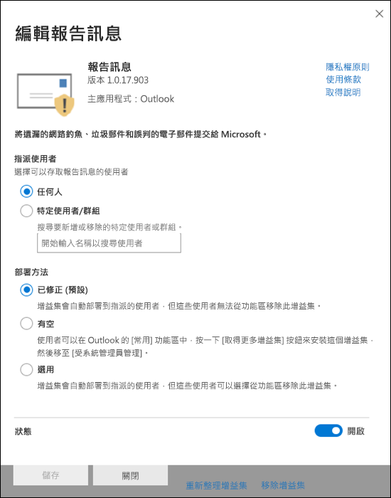

# 啟用報告訊息或報告網路釣魚增益集

[!INCLUDE [Microsoft 365 Defender rebranding](../includes/microsoft-defender-for-office.md)]

**適用於**
- [Exchange Online Protection](exchange-online-protection-overview.md)
- [適用於 Office 365 的 Microsoft Defender 方案 1 和方案 2](defender-for-office-365.md)
- [Microsoft 365 Defender](../defender/microsoft-365-defender.md)

> [!NOTE]
> 如果您是具有 Exchange Online 信箱的 Microsoft 365 組織中的系統管理員，建議您在 Microsoft 365 Defender 入口網站中使用 [**提交**] 頁面。 如需詳細資訊，請參閱 [使用系統管理員提交將可疑的垃圾郵件、網路釣魚、URLs 和檔案提交給 Microsoft](admin-submission.md)。

Outlook 和 Outlook 網頁版 (以前稱為 Outlook Web App 的報告郵件和報告網路釣魚增益集，可讓使用者輕鬆報告誤報，) 正確的電子郵件會標示為壞的 (或 false 的否定) 錯誤電子郵件允許 (到 Microsoft 及其子公司進行分析。

Microsoft 會使用這些提交來改善電子郵件防護技術的有效性。 例如，假設有人使用「報告網路釣魚增益集」報告許多郵件。 此資訊會顯示在安全性儀表板及其他報告中。 貴組織的安全性小組可以使用此資訊來表示可能需要更新防網路釣魚原則。

您可以安裝報告訊息或報告網路釣魚增益集。 如果您想要讓使用者報告垃圾郵件和網路釣魚郵件，請在您的組織中部署報告訊息增益集。 如需詳細資訊，請參閱 Enable the Report Message 增益集。

報告郵件增益集提供的選項可報告垃圾郵件和網路釣魚郵件。 系統管理員可以為組織啟用「報告訊息增益集」，個別使用者可以自行自行安裝。

報告網路釣魚增益集提供的選項可報告僅網路釣魚郵件。 系統管理員可以為組織啟用「報告網路釣魚增益集」，個別使用者可以自行自行安裝。

如果您是個別的使用者，您可以為自己啟用增益集。

如果您是全域系統管理員或 Exchange Online 管理員，且 Exchange 設定成使用 OAuth 驗證，則可以為您的組織啟用報告訊息增益集和報表仿冒增益集。 這兩個增益集現在均可透過 [集中式部署](../../admin/manage/centralized-deployment-of-add-ins.md)使用。

## 開始之前有哪些須知？

- 報告訊息增益集與報告網路釣魚增益集均可搭配大多數的 Microsoft 365 訂閱及下列產品運作：
  - Outlook 網頁版
  - Outlook 2013 SP1 或更新版本
  - Mac 版 Outlook 2016
  - 包含 Microsoft 365 Enterprise 應用程式的 Outlook
  - iOS 和 Android 的 Outlook 應用程式

- 這兩個增益集不能用於內部部署 Exchange 組織中的共用信箱或信箱。

- 您的現有網頁瀏覽器應該同時搭配報告訊息和報告網路釣魚增益集。不過，如果您注意到增益集無法使用或如預期般運作，請嘗試其他瀏覽器。

- 若為組織安裝，必須設定組織使用 OAuth 驗證。 如需詳細資訊，請參閱 [判斷是否集中式部署的增益集可為您的組織運作](../../admin/manage/centralized-deployment-of-add-ins.md)。

- 管理員必須是全域系統管理員角色群組的成員。 如需詳細資訊，請參閱 [Microsoft 365 Defender 入口網站中的權限](permissions-microsoft-365-security-center.md)。

- 如需如何使用報告郵件功能來報告訊息的詳細資訊，請參閱[在 Outlook 中報告誤報和漏報](report-false-positives-and-false-negatives.md)。

> [!IMPORTANT]
> 由於無法使用[使用者提交原則](./user-submission.md)，因此建議您不要在 Outlook 內建報告經驗。 建議您改為使用報表訊息增益集或報表網路釣魚增益集。

## 取得報告訊息增益集

### 自行取得報告訊息增益集

1. 移至 Microsoft AppSource <https://appsource.microsoft.com/marketplace/apps> ，並搜尋報告訊息增益集。 若要直接移至報告訊息增益集，請移至 <https://appsource.microsoft.com/product/office/wa104381180> 。

2. 按一下 [ **立即取得**]。

   

3. 在出現的對話方塊中，複查使用條款和隱私權原則，然後按一下 [ **繼續**]。

4. 使用您的工作或學校帳戶登入 (商務用) 或您的 Microsoft 帳戶 (個人用途) 。

安裝並啟用增益集之後，您會看到下列圖示：

- 在 Outlook 中，圖示如下所示：

  > [!div class="mx-imgBorder"]
  > 

- 在 Outlook 網頁版中，圖示如下所示：

  > [!div class="mx-imgBorder"]
  > 

### 取得組織的報告訊息增益集

> [!NOTE]
> 在您的組織中顯示增益集可能需要長達12小時。

1. 在 Microsoft 365 系統管理中心中，移至中的 [**設定** \> **增益集**] 頁面 <https://admin.microsoft.com/AdminPortal/Home#/Settings/AddIns> 。 如果您看不到 [**增益集**] 頁面，請移至 [整合式應用程式] 頁面頂端的 [**設定** \> **整合式應用程式** \> **增益集**] 連結。 

2. 選取頁面頂端的 [ **部署增益集** ]，然後選取 **[下一步]**。

   ![Microsoft 365 系統管理中心中的 [服務和增益集] 頁面](../../media/ServicesAddInsPageNewM365AdminCenter.png)

3. 在出現的 **新增益集** 浮出視窗中，複查資訊，然後按 **[下一步]**。

4. 在下一個頁面上，按一下 **[從儲存區選擇**]。

   

5. 在出現的 [ **選取增益集** ] 頁面上，按一下 [ **搜尋** ] 方塊，輸入 **報告訊息**，然後按一下 [ **搜尋** ![ 搜尋] 圖示 ](../../media/search-icon.png) 。 在結果清單中，尋找 [ **報告訊息** ]，然後按一下 [ **新增**]。

   

6. 在出現的對話方塊中，複查授權和隱私權資訊，然後按一下 [ **繼續**]。

7. 在出現的 [ **設定增益集** ] 頁面中，設定下列設定：

   - **指派的使用者**：選取下列其中一個值：
     - **所有人** (預設) 
     - **特定使用者/群組**
     - **就我自己**

   - **部署方法**：選取下列其中一個值：
     - **Fixed (預設)**：增益集會自動部署至指定的使用者，且無法加以移除。
     - **可用**：使用者可以在 **Home** \> **Get 增益集** \> **管理管理** 的位置安裝增益集。
     - **選用**：增益集會自動部署至指定的使用者，但是可以選擇加以移除。

   

   當您完成時，按一下 [ **部署**]。

8. 在出現的 [ **部署報告郵件** ] 頁面中，您會看到進度報告，接著會出現部署增益集的確認。 閱讀資訊後，請按 **[下一步]**。

   

9. 在出現的 **宣告增益集** 頁面上，複查資訊，然後按一下 [ **關閉**]。

   

## 檢閱或編輯報告訊息增益集的設定

1. 在 Microsoft 365 系統管理中心中，移至 [前往 **設定** \> **增益集**] 頁面 <https://admin.microsoft.com/AdminPortal/Home#/Settings/AddIns> 。 如果您看不到 [**增益集**] 頁面，請移至 [整合式應用程式] 頁面頂端的 [**設定** \> **整合式應用程式** \> **增益集**] 連結。 

   

2. 尋找並選取 **報告訊息** 增益集。

3. 在顯示的 [ **編輯報告訊息** ] 浮出視窗中，視組織的需要複查及編輯設定。 完成後，按一下 [儲存]。

   

## 取得報告網路釣魚增益集

### 取得您自己的報表網路釣魚增益集

1. 移至 Microsoft AppSource <https://appsource.microsoft.com/marketplace/apps> ，並搜尋報表網路釣魚增益集。

2. 按一下 [ **立即取得**]。

3. 在出現的對話方塊中，複查使用條款和隱私權原則，然後按一下 [ **繼續**]。

4. 使用您的工作或學校帳戶登入 (商務用) 或您的 Microsoft 帳戶 (個人用途) 。

安裝並啟用增益集之後，您會看到下列圖示：

- 在 Outlook 中，圖示如下所示：

  

- 在 Outlook 網頁版中，圖示如下所示：

  > [!div class="mx-imgBorder"]
  > 

### 取得組織的報表網路釣魚增益集

> [!NOTE]
> 在您的組織中顯示增益集可能需要長達12小時。

1. 在 Microsoft 365 系統管理中心中，移至 [前往 **設定** \> **增益集**] 頁面 <https://admin.microsoft.com/AdminPortal/Home#/Settings/AddIns> 。 如果您看不到 [**增益集**] 頁面，請移至 [整合式應用程式] 頁面頂端的 [**設定** \> **整合式應用程式** \> **增益集**] 連結。 

2. 選取頁面頂端的 [ **部署增益集** ]，然後選取 **[下一步]**。

   ![Microsoft 365 系統管理中心中的 [服務和增益集] 頁面](../../media/ServicesAddInsPageNewM365AdminCenter.png)

3. 在出現的 **新增益集** 浮出視窗中，複查資訊，然後按 **[下一步]**。

4. 在下一個頁面上，按一下 **[從儲存區選擇**]。

   

5. 在出現的 [ **選取增益集** ] 頁面上，按一下 [ **搜尋** ] 方塊中的 [ **報告網路釣魚**]，然後按一下 [ **搜尋** ![ 搜尋] 圖示 ](../../media/search-icon.png) 。 在結果清單中，尋找 [ **報告網路釣魚** ]，然後按一下 [ **新增**]。

6. 在出現的對話方塊中，複查授權和隱私權資訊，然後按一下 [ **繼續**]。

7. 在出現的 [ **設定增益集** ] 頁面中，設定下列設定：

   - **指派的使用者**：選取下列其中一個值：
     - **所有人** (預設) 
     - **特定使用者/群組**
     - **就我自己**

   - **部署方法**：選取下列其中一個值：
     - **Fixed (預設)**：增益集會自動部署至指定的使用者，且無法加以移除。
     - **可用**：使用者可以在 **Home** \> **Get 增益集** \> **管理管理** 的位置安裝增益集。
     - **選用**：增益集會自動部署至指定的使用者，但是可以選擇加以移除。

   當您完成時，按一下 [ **部署**]。

8. 在出現的 [ **部署報告網路釣魚** ] 頁面中，您會看到進度報告，接著會出現部署增益集的確認。 閱讀資訊後，請按 **[下一步]**。

9. 在出現的 **宣告增益集** 頁面上，複查資訊，然後按一下 [ **關閉**]。

## 查看或編輯報表網路釣魚增益集的設定

1. 在 Microsoft 365 系統管理中心中，移至 [前往 **設定** \> **增益集**] 頁面 <https://admin.microsoft.com/AdminPortal/Home#/Settings/AddIns> 。 如果您看不到 [**增益集**] 頁面，請移至 [整合式應用程式] 頁面頂端的 [**設定** \> **整合式應用程式** \> **增益集**] 連結。 

2. 尋找並選取 **報告網路釣魚** 增益集。

3. 在 [ **編輯報告的網路釣魚** ] 浮出控制項中，視您的組織而定，會顯示、審閱及編輯設定。 When you're finished, click **Save**.
