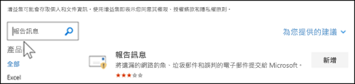
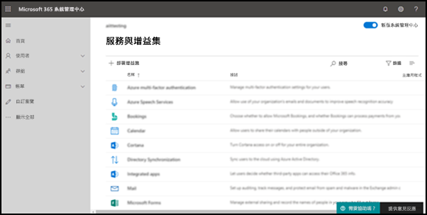

# 啟用報告訊息增益集

[!INCLUDE [Microsoft 365 Defender rebranding](../includes/microsoft-defender-for-office.md)]

> [!NOTE]
> 如果您是使用 Exchange Online 信箱的 Microsoft 365 組織中的系統管理員，建議您在安全性 & 合規性中心使用提交入口網站。 如需詳細資訊，請參閱 [使用系統管理員提交將可疑的垃圾郵件、網路釣魚、URLs 和檔案提交給 Microsoft](admin-submission.md)。

「Outlook」和「Outlook」上的「outlook」和「Outlook」 (先前稱為 Outlook Web) App 的報告訊息增益集，可讓使用者輕鬆報告誤報， (正確的電子郵件標記為壞的) 或 false 的否定 (錯誤電子郵件允許) 到 Microsoft 及其子公司進行分析。 Microsoft 會使用這些提交來改善電子郵件防護技術的有效性。

例如，假設使用者將大量訊息回報為網路釣魚。 此資訊會顯示在[安全性儀表板](security-dashboard.md)及其他報告中。 貴組織的安全性小組可以使用此資訊來表示可能需要更新防網路釣魚原則。 或者，如果有人使用 [報告訊息] 增益集，回報大量被標示為垃圾郵件的訊息，則貴組織的安全性小組可能需要調整[反垃圾郵件原則](configure-your-spam-filter-policies.md)。

此外，如果貴組織使用 [Office 365 進階威脅防護方案 1](office-365-atp.md) 或[方案 2](office-365-ti.md)，則 [報告訊息] 增益集會向貴組織的安全性小組提供實用資訊，以便用於檢閱及更新安全性原則。

系統管理員可以為組織啟用「報告訊息增益集」，個別使用者可以自行自行安裝。

如果您是個人使用者，您可以[自行啟用 [報告訊息] 增益集](#get-the-report-message-add-in-for-yourself)。

如果您是全域系統管理員或 Exchange Online 系統管理員，且 Exchange 設定成使用 OAuth 驗證，您可以 [為組織啟用報告訊息增益集](#get-and-enable-the-report-message-add-in-for-your-organization)。 [報告訊息] 增益集現可透過[集中式部署](https://docs.microsoft.com/microsoft-365/admin/manage/centralized-deployment-of-add-ins)提供。

## 開始之前有哪些須知？

- 報告訊息增益集可與大多數 Microsoft 365 訂閱及下列產品搭配使用：

  - Outlook 網頁版
  - Outlook 2013 SP1 或更新版本
  - Mac 版 Outlook 2016
  - Outlook 隨附于適用于企業的 Microsoft 365 應用程式

- 內部部署 Exchange 組織中的信箱無法使用報告訊息增益集。

- 您可以設定報告的郵件以複製或重新導向至您指定的信箱。 如需詳細資訊，請參閱 [使用者報送原則](user-submission.md)。

- 您的現有網頁瀏覽器應該使用報表訊息增益集。 不過，如果您注意到增益集無法使用或如預期般運作，請嘗試其他瀏覽器。

- 若為組織安裝，必須設定組織使用 OAuth 驗證。 如需詳細資訊，請參閱 [判斷是否集中式部署的增益集可為您的組織運作](../../admin/manage/centralized-deployment-of-add-ins.md)。

- 管理員必須是全域系統管理員角色群組的成員。 如需詳細資訊，請參閱[安全性與合規性中心中的權限](permissions-in-the-security-and-compliance-center.md)。

## 自行取得報告訊息增益集

1. 移至 Microsoft AppSource <https://appsource.microsoft.com/marketplace/apps> ，並搜尋報告訊息增益集。 若要直接移至報告訊息增益集，請移至 <https://appsource.microsoft.com/product/office/wa104381180> 。

2. 按一下 [ **立即取得**]。

   

3. 在出現的對話方塊中，複查使用條款和隱私權原則，然後按一下 [ **繼續**]。

4. 使用您的工作或學校帳戶登入 (商務用) 或您的 Microsoft 帳戶 (個人用途) 。

安裝並啟用增益集之後，您會看到下列圖示：

- 在 Outlook 中，圖示如下所示：

  

- 在 Outlook 網頁版中，圖示如下所示：

  

若要瞭解如何使用增益集，請參閱 [use The Report Message 增益集](https://support.microsoft.com/office/b5caa9f1-cdf3-4443-af8c-ff724ea719d2)。

## 為貴組織取得和啟用報告訊息增益集

> [!NOTE]
> 在您的組織中顯示增益集可能需要長達12小時。

1. 在 Microsoft 365 系統管理中心中，移至的 [ **服務] & 增益集** ] 頁面上 <https://admin.microsoft.com/AdminPortal/Home#/Settings/ServicesAndAddIns> ，然後按一下 [ **部署 Add-In**]。

   ![Microsoft 365 系統管理中心的 [服務和增益集] 頁面](../../media/ServicesAddInsPageNewM365AdminCenter.png)

2. 在出現的 **新增益集** 浮出視窗中，複查資訊，然後按 **[下一步]**。

3. 在下一個頁面上，按一下 **[從儲存區選擇**]。

   

4. 在出現的 [ **選取增益集** ] 頁面上，按一下 [ **搜尋** ] 方塊，輸入 **報告訊息**，然後按一下 [ **搜尋** ![ 搜尋] 圖示 ](../../media/search-icon.png) 。 在結果清單中，尋找 [ **報告訊息** ]，然後按一下 [ **新增**]。

   

5. 在出現的對話方塊中，複查授權和隱私權資訊，然後按一下 [ **繼續**]。

6. 在出現的 [ **設定增益集** ] 頁面中，設定下列設定：

   - **指派的使用者**：選取下列其中一個值：

     - **所有人** (預設) 
     - **特定使用者/群組**
     - **就我自己**

   - **部署方法**：選取下列其中一個值：

     - **Fixed (預設) **：增益集會自動部署至指定的使用者，且無法加以移除。
     - **可用**：使用者可以在 **Home** \> **Get 增益集** \> **管理管理**的位置安裝增益集。
     - **選用**：增益集會自動部署至指定的使用者，但是可以選擇加以移除。

   

   當您完成時，按一下 [ **部署**]。

7. 在出現的 [ **部署報告郵件** ] 頁面中，您會看到進度報告，接著會出現部署增益集的確認。 閱讀資訊後，請按 **[下一步]**。

   

8. 在出現的 **宣告增益集** 頁面上，複查資訊，然後按一下 [ **關閉**]。

   

## 了解如何使用報告訊息增益集

已指派增益集的人員會看到下列圖示：

- 在 Outlook 中，圖示如下所示：

  

- 在 Outlook 網頁版中，圖示如下所示：

  

當您通知使用者關於 [報告訊息] 增益集時，請包含[使用報告訊息增益集](https://support.microsoft.com/office/b5caa9f1-cdf3-4443-af8c-ff724ea719d2)的連結。

## 檢閱或編輯報告訊息增益集的設定

1. 在 Microsoft 365 系統管理中心中，移至上的 [ **服務] & 增益集** ] 頁面 <https://admin.microsoft.com/AdminPortal/Home#/Settings/ServicesAndAddIns> 。

   

2. 尋找並選取 **報告訊息** 增益集。

3. 在顯示的 [ **編輯報告訊息** ] 浮出視窗中，視組織的需要複查及編輯設定。 完成後，按一下 [儲存]****。

   

## 查看和審閱報告的郵件

若要查看使用者向 Microsoft 報告的郵件，您可以使用下列選項：

- 使用系統管理提交入口網站。 如需詳細資訊，請參閱 [View user 報送 To Microsoft](admin-submission.md#view-user-submissions-to-microsoft)。

- 建立郵件流程規則 (也稱為傳輸規則) 傳送報告郵件的副本。 如需相關指示，請參閱 [使用郵件流程規則來查看您的使用者向 Microsoft 報告的內容](use-mail-flow-rules-to-see-what-your-users-are-reporting-to-microsoft.md)。
