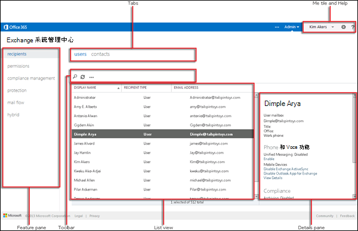

# 獨立版 EOP 中的 Exchange 系統管理中心

[!INCLUDE [Microsoft 365 Defender rebranding](../includes/microsoft-defender-for-office.md)]

Exchange 系統管理中心 (EAC) 是以 web 為基礎的管理主控台，供獨立 Exchange Online Protection (EOP) 。

在尋找本主題的 Exchange Online 版本嗎？ 請參閱[Exchange admin center in Exchange Online](https://docs.microsoft.com/exchange/exchange-admin-center)。

## 開啟 EOP 中的 EAC

獨立 EOP 客戶可以使用下列方法存取 EAC：

- **從 Microsoft 365 系統管理中心**：

  1. 移至 <https://admin.microsoft.com> 並按一下 [ **全部顯示**]。

     ![按一下 Microsoft 365 系統管理中心內的 [全部顯示]](../../media/m365-center-show-all.png)

  2. 在出現的 [系統 **管理中心** ] 區段中，按一下 [ **所有系統管理中心**]。

     ![按一下 [Microsoft 365 系統管理中心] 中的 [所有系統管理中心]。](../../media/m365-center-select-all-admin-centers.png)

  3. 在出現的 [ **所有系統管理中心** ] 頁面上，按一下 [ **Exchange Online Protection**]。

- 直接移至 `https://admin.protection.outlook.com/ecp/` 。

## EOP 中 EAC 中的一般使用者介面元素

本節說明 EMC 中的使用者介面元素。

### 功能窗格

這是您在 EAC 中執行大部分工作時的第一個導覽層級。功能窗格依功能區域組織。

- 收件 **者：這** 是您用來查看群組和外部連絡人的所在位置。

- **許可權**：這是您管理系統管理員角色的位置。

- **規範管理**：這是您可以找到系統管理員角色群組報告和系統管理員審核記錄報告的所在位置。

- **保護**：這是您可以管理反惡意程式碼原則、預設連線篩選原則及 DKIM 的所在位置。

  > [!NOTE]
  > 您應在安全性 & 規範中心管理反惡意程式碼原則和預設連線篩選原則。 如需詳細資訊，請參閱在 [EOP 中設定反惡意程式碼原則](configure-anti-malware-policies.md) 及 [設定 EOP 中的連線篩選](configure-the-connection-filter-policy.md)。

- **郵件流程**：這是您管理郵件流程規則 (的所在位置，也稱為傳輸規則) 、公認的網域和連接器，以及您可以前往執行郵件追蹤的位置。

- **混合** 式：這是您可以執行 [混合](https://docs.microsoft.com/Exchange/hybrid-configuration-wizard)式設定向導的所在位置，以及您可以在其中安裝 [Exchange Online PowerShell 模組](https://docs.microsoft.com/powershell/exchange/mfa-connect-to-exchange-online-powershell)的位置。

### 索引標籤

索引標籤是您的第二個導覽層級。 每一個功能區都包含不同的索引標籤，各自代表一項功能。

### 工具列

按一下大部分的索引標籤時，會看到一個工具列。工具列上的圖示會執行特定動作。下表描述圖示及其動作。

****

|圖示|名稱|動作|
|---|---|---|
||新增|使用此圖示來建立新的物件。這些圖示中有些擁有一個關聯的向下箭號，您可以按一下以顯示所能建立的其他物件。|
||編輯|使用此圖示來編輯物件。|
||刪除|使用此圖示來刪除物件。部分刪除圖示擁有一個向下箭號，您可以按一下以顯示額外選項。|
||搜尋|使用此圖示來開啟搜尋方塊，您可在此處輸入想要尋找之物件的搜尋字詞。|
||重新整理|使用此圖示來重新整理清單檢視。|
|![[更多選項] 圖示](../../media/ITPro-EAC-MoreOptionsIcon.gif)|更多選項|使用此圖示來檢視更多可對該索引標籤之物件執行的動作。例如，在 **[收件者 \> 使用者]** 中按一下此圖示會顯示可執行 **[進階搜尋]** 的選項。  |
||向上鍵和向下鍵|使用這些圖示向上或向下移動物件的優先順序。|
|![[移除] 圖示](../../media/ITPro-EAC-RemoveIcon.gif)|移除|使用此圖示來移除清單中的物件。|
|

### 清單檢視

當您選取索引標籤時，大部分情況下會看見清單檢視。EAC 清單檢視內可檢視的限制約為 10,000 個物件。此外，也包括分頁功能，所以你可以將結果分頁顯示。

### 詳細資料窗格

當您從清單檢視中選取物件時，該物件的相關資訊就會顯示在詳細資料窗格中。在部分情況下，詳細資料窗格包括管理工作。

### 個人資訊動態磚與說明

**[自有磚]** 可讓您登出 EAC，然後以不同使用者的身分登入。 您可以從 [**説明**] 的 [說明]  下拉式功能表中執行下列動作：

- **說明：** 按一下 [說明圖示] 即可檢視線上說明內容。
- **意見** 反應：留下意見反應。
- **社區**：在社區論壇中張貼尋找答案的問題。
- **停用說明泡泡圖**：[說明泡泡圖] 會在您建立或編輯物件時，顯示欄位的內容說明。 您可以關閉 [說明泡泡圖]，或是在停用的狀態下將它開啟。
- **顯示命令記錄**：會開啟新的視窗，顯示根據 EAC 中設定之專案的對等 PowerShell 命令。

## 支援的瀏覽器

為享有 EAC 最佳使用體驗，建議您一律使用最新的瀏覽器、Office 用戶端和應用程式。 我們也建議您隨時安裝最新的軟體更新。 如需此服務支援的瀏覽器和系統需求的詳細資訊，請參閱 [Office 的系統需求](https://products.office.com/office-system-requirements)。

## 支援的語言

在獨立 EOP 中，EAC 支援和使用下列語言。

- 阿姆哈拉文
- 阿拉伯文
- 巴斯克文 (巴斯克文)
- 孟加拉文 (印度)
- 保加利亞文
- 卡達隆尼亞文
- 簡體中文
- 繁體中文
- 克羅埃西亞文
- 捷克文
- 丹麥文
- 荷蘭文
- 英文
- 愛沙尼亞文
- 菲律賓文 (菲律賓)
- 芬蘭文
- 法文
- 加里斯亞文
- 德文
- 希臘文
- 古吉拉特文
- 希伯來文
- 印度文
- 匈牙利文
- 冰島文
- 印尼文
- 義大利文
- 日文
- 坎那達文
- 哈薩克文
- 史瓦希里文
- 韓文
- 拉脫維亞文
- 立陶宛文
- 馬來文 (汶萊)
- 馬來文 (馬來西亞)
- 馬來亞拉姆文
- 馬拉提文
- 挪威文 (巴克摩)
- 挪威文 (尼洛斯克)
- 歐利亞文
- 波斯文
- 波蘭文
- 葡萄牙文 (巴西)
- 葡萄牙文 (葡萄牙)
- 羅馬尼亞文
- 俄文
- 塞爾維亞文 (斯拉夫、塞爾維亞)
- 塞爾維亞文 (拉丁)
- 斯洛伐克文
- 斯洛維尼亞文
- 西班牙文
- 瑞典文
- 坦米爾文
- 特拉古文
- 泰文
- 土耳其文
- 烏克蘭文
- 烏都文
- 越南文
- 威爾斯文
