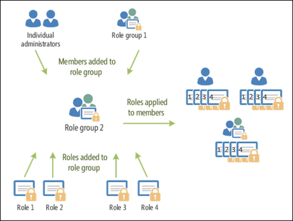

# <a name="permissions-in-standalone-eop"></a>獨立版 EOP 中的權限

獨立 Exchange Online Protection (EOP) 沒有 Exchange Online 信箱時，會使用以角色為基礎的存取控制 (RBAC) 許可權模型，以輕鬆授與許可權給您的系統管理員。 您可以使用獨立 EOP 中的許可權功能，快速地讓新組織正常運作。

若要授與許可權給使用者，請參閱 [管理 EOP 中的系統管理員角色群組](manage-admin-role-group-permissions-in-eop.md)。

如需跨 Microsoft 365 之許可權的詳細資訊，請參閱 [關於系統管理員角色](https://docs.microsoft.com/microsoft-365/admin/add-users/about-admin-roles)。

## <a name="role-based-permissions"></a>角色型權限

您授與使用者的系統管理員許可權是以管理角色為基礎。 管理角色會定義可用於一組指定任務的 Cmdlet。 因為 Exchange 系統管理中心 (EAC) 和獨立 EOP PowerShell 兩者都使用 Cmdlet，所以授予 Cmdlet 存取權可讓使用者在 EAC 或獨立 EOP PowerShell 中執行相關工作。 例如，「郵件收件者」角色會定義修改郵件使用者所需的 Cmdlet。

在獨立 EOP 中，系統管理角色是唯一可用的管理角色類型， (沒有) 使用者角色或角色指派原則。

## <a name="role-groups"></a>角色群組

若要簡化指派角色給使用者，獨立 EOP 使用角色群組。 管理角色會指派給角色群組，而角色群組成員也會取得與角色相關聯的許可權。 換句話說，管理角色不會直接指派給使用者，而是它們是指派給角色群組。 此模型可讓您同時將許多角色指派給許多角色群組成員。 角色群組成員可以是郵件使用者、擁有郵件功能的安全性群組、Microsoft 365 系統管理中心的使用者，以及其他角色群組。

下圖顯示使用者、角色群組和角色之間的關係。



下表說明獨立 EOP 中可用的角色群組。

****

|角色群組|描述|已指派預設角色|
|---|---|---|
|ComplianceManagement|設定及管理組織內的規範設定，包括資料遺失防護 (DLP) （如果您的訂閱具有 DLP 功能）。 <br/><br/> Azure AD 中的 [合規性系統管理員](https://docs.microsoft.com/azure/active-directory/users-groups-roles/directory-assign-admin-roles#compliance-administrator) 角色成員會自動取得此角色群組的許可權。|稽核記錄 <br/><br/> 合規性管理 <br/><br/> 資訊版權管理 <br/><br/> 保留管理 <br/><br/> 僅限檢視稽核記錄 <br/><br/> 僅限檢視組態 <br/><br/> 僅限檢視收件者|
|ContentExplorerContentViewer|不會使用。|資料分類內容檢視器|
|ContentExplorerListViewer|不會使用。|資料分類清單檢視器|
|HelpDesk|查看和管理郵件使用者。|重設密碼 <br/><br/> 使用者選項 <br/><br/> 僅限檢視收件者|
|HygieneManagement|管理保護功能 (反垃圾郵件、反惡意程式碼等 ) 。|傳輸衛生 <br/><br/> 僅限檢視組態 <br/><br/> 僅限檢視收件者|
|MailFlowAdministrator|查看及管理公認的網域和連接器|遠端和公認的網域 <br/><br/> 僅限檢視收件者|
|OrganizationManagement|整個組織的系統管理員存取權，以及執行幾乎任何工作的功能。 <br/><br/> Azure AD 中 [全域系統管理員](https://docs.microsoft.com/azure/active-directory/users-groups-roles/directory-assign-admin-roles#global-administrator--company-administrator) 角色的成員會自動取得此角色群組的許可權。 <br/><br/> **重要**：由於 OrganizationManagement 角色群組是功能強大的角色，因此只有執行組織層級管理工作的使用者才應成為這個角色群組的成員。|軟體 <br/><br/> 反垃圾郵件 <br/><br/> 稽核記錄 <br/><br/> 合規性系統管理員 <br/><br/> 動態通訊群組 <br/><br/> 資訊版權管理 <br/><br/> 建立郵件收件者 <br/><br/> 郵件收件者 <br/><br/> 郵件追蹤 <br/><br/> 移轉 <br/><br/> 組織用戶端存取 <br/><br/> 組織組態 <br/><br/> 組織傳輸設定 <br/><br/> 隔離 <br/><br/> 收件者原則 <br/><br/> 遠端和公認的網域 <br/><br/> 重設密碼 <br/><br/> 保留管理 <br/><br/> 角色管理 <br/><br/> 安全性系統管理員 <br/><br/> 安全性群組建立和成員資格 <br/><br/> 安全性讀取者 <br/><br/> 敏感度標籤系統管理員 <br/><br/> 監督 <br/><br/> 傳輸衛生 <br/><br/> 傳輸規則 <br/><br/> 使用者選項 <br/><br/> View-Only 反惡意程式碼 <br/><br/> View-Only 反垃圾郵件 <br/><br/> 僅限檢視稽核記錄 <br/><br/> 僅限檢視組態 <br/><br/> View-Only 隔離 <br/><br/> 僅限檢視收件者 <br/><br/> View-Only 威脅情報|
|QuarantineAdministrator|管理所有收件者的隔離郵件。|隔離|
|RecipientManagement|建立、管理及移除組織中的收件者物件。|動態通訊群組 <br/><br/> 建立郵件收件者 <br/><br/> 郵件收件者 <br/><br/> 郵件追蹤 <br/><br/> 移轉 <br/><br/> 收件者原則 <br/><br/> 重設密碼|
|RecordsManagement|設定符合性功能，例如保留原則標記、郵件分類和郵件流程規則 (也稱為傳輸規則) 。|郵件追蹤 <br/><br/> 保留管理 <br/><br/> 傳輸規則|
|SecurityAdministrator|設定組織中的所有保護方面 (反垃圾郵件、反惡意程式碼、反欺騙、隔離等等 ) 。 <br/><br/> Azure AD 中的 [安全性系統管理員](https://docs.microsoft.com/azure/active-directory/users-groups-roles/directory-assign-admin-roles#security-administrator) 角色成員會自動取得此角色群組的許可權。|軟體 <br/><br/> 反垃圾郵件 <br/><br/> 稽核記錄 <br/><br/> 隔離 <br/><br/> 安全性系統管理員 <br/><br/> 敏感度標籤系統管理員 <br/><br/> View-Only 反惡意程式碼 <br/><br/> View-Only 反垃圾郵件 <br/><br/> 僅限檢視稽核記錄 <br/><br/> View-Only 隔離 <br/><br/> View-Only 威脅情報|
|SecurityReader|僅可供查看組織中的所有保護方面 (反垃圾郵件、反惡意程式碼、反欺騙、隔離等 ) 的存取權。 <br/><br/> Azure AD 中的 [安全性讀者](https://docs.microsoft.com/azure/active-directory/users-groups-roles/directory-assign-admin-roles#security-reader) 角色成員會自動取得此角色群組的許可權。|安全性讀取者 <br/><br/> View-Only 反惡意程式碼 <br/><br/> View-Only 反垃圾郵件 <br/><br/> View-Only 隔離 <br/><br/> View-Only 威脅情報|
|TenantAdmins|這個角色群組中的成員資格能跨服務同步，且為集中管理的。 根據預設，此角色群組不會被指派任何角色。 不過，它會是「組織管理」角色群組的成員，並會繼承這些許可權。|無|
|ViewOnlyOrganizationManagement|查看組織中的收件者、保護和設定物件及其屬性。|合規性系統管理員 <br/><br/> 安全性系統管理員 <br/><br/> 安全性讀取者 <br/><br/> 敏感度標籤系統管理員 <br/><br/> 僅限檢視組態 <br/><br/> 僅限檢視收件者|
|

如果您在只有少數系統管理員的小型組織中工作，您可能只需要將這些使用者新增至組織管理角色群組，而且您可能永遠不需要使用其他角色群組。 如果您在較大的組織中工作，則可能會有管理員執行特定工作，例如收件者設定。 在這種情況下，您可能會將一個系統管理員新增至 [收件者管理] 角色群組，並將另一個系統管理員新增至組織管理角色群組。 這些系統管理員可以管理其特定區域，但不會有管理其不負責之區域的許可權。

如果 Exchange Online 中的內建角色群組與您的系統管理員職責不符，您可以建立角色群組並新增角色到這些群組。 如需詳細資訊，請參閱 [Manage role groups in 獨立 EOP](manage-admin-role-group-permissions-in-eop.md)。

## <a name="roles"></a>角色

下表說明獨立 EOP 中可用的內建角色。

****

|Role * *|描述|預設角色群組指派|
|---|---|---|
|軟體|查看及修改反惡意程式碼功能的設定和報告。|OrganizationManagement <br/><br/> SecurityAdministrator|
|反垃圾郵件|查看及修改反垃圾郵件功能的設定和報告。|OrganizationManagement <br/><br/> SecurityAdministrator|
|稽核記錄|搜尋系統管理員的審計記錄檔，然後查看結果。|ComplianceManagement <br/><br/> OrganizationManagement <br/><br/> SecurityAdministrator|
|合規性管理員<sup>\*</sup>||ComplianceManagement <br/><br/> OrganizationManagement <br/><br/> ViewOnlyOrganizationManagement|
|資料分類內容檢視器<sup>\*</sup>||ContentExplorerContentViewer|
|資料分類清單檢視器<sup>\*</sup>||
|動態通訊群組|建立及管理所有通訊群組、擁有郵件功能的安全性群組和成員。|OrganizationManagement <br/><br/> RecipientManagement|
|資訊版權管理<sup>\*</sup>||ComplianceManagement <br/><br/> OrganizationManagement|
|建立郵件收件者|建立及移除郵件使用者。|OrganizationManagement <br/><br/> RecipientManagement|
|郵件收件者|修改現有的郵件使用者。|OrganizationManagement <br/><br/> RecipientManagement|
|郵件追蹤<sup>\*</sup>||OrganizationManagement <br/><br/> RecipientManagement <br/><br/> 記錄管理|
|遷移<sup>\*</sup>||OrganizationManagement <br/><br/> RecipientManagement|
|MyBaseOptions|允許使用者查看其專屬的隔離郵件。 <br/><br/> 這個角色會自動指派給使用者，而且您無法手動指派。|無|
|組織用戶端存取<sup>\*</sup>||OrganizationManagement|
|組織組態|檢視報告。|OrganizationManagement|
|組織傳輸設定<sup>\*</sup>||OrganizationManagement|
|隔離|管理所有收件者的所有類型的隔離郵件。|OrganizationManagement <br/><br/> QuarantineAdministrator <br/><br/> SecurityAdministrator|
|收件者原則<sup>\*</sup>||OrganizationManagement <br/><br/> RecipientManagement|
|遠端和公認的網域|管理遠端網域、公認的網域和連接器。|MailFlowAdministrator <br/><br/> OrganizationManagement|
|重設密碼<sup>\*</sup>||HelpDesk <br/><br/> OrganizationManagement <br/><br/> RecipientManagement|
|保留管理<sup>\*</sup>||ComplianceManagement <br/><br/> OrganizationManagement <br/><br/> RecordsManagement|
|角色管理|建立及管理角色群組。|OrganizationManagement|
|安全性系統管理員|管理所有安全性和保護功能的設定和報告。|OrganizationManagement <br/><br/> SecurityAdministrator <br/><br/> ViewOnlyOrganizationManagement|
|安全性群組建立和成員資格|建立和管理擁有郵件功能的安全性群組。|OrganizationManagement|
|安全性讀取者|查看安全性和保護功能的設定和報告。|組織管理 <br/><br/> SecurityReader <br/><br/> ViewOnlyOrganizationManagement|
|敏感度標籤管理員<sup>\*</sup>||OrganizationManagement <br/><br/> SecurityAdministrator <br/><br/> ViewOnlyOrganizationManagement|
|監督<sup>\*</sup>||OrganizationManagement|
|傳輸衛生|管理反惡意程式碼、反垃圾郵件功能和反欺騙功能。|HygieneManagement <br/><br/> OrganizationManagement|
|傳輸規則|建立及管理郵件流程規則 (也稱為傳輸規則) 。|OrganizationManagement <br/><br/> RecordsManagement|
|使用者選項|修改現有的郵件使用者。|HelpDesk <br/><br/> OrganizationManagement|
|View-Only 反惡意程式碼|查看反惡意程式碼功能的設定和報告。|OrganizationManagement <br/><br/> SecurityAdministrator <br/><br/> SecurityReader|
|View-Only 反垃圾郵件|查看反垃圾郵件功能的設定和報告。|OrganizationManagement <br/><br/> SecurityAdministrator <br/><br/> SecurityReader|
|僅限檢視稽核記錄|搜尋系統管理員的審計記錄檔，然後查看結果。|ComplianceManagement <br/><br/> OrganizationManagement <br/><br/> SecurityAdministrator|
|僅限檢視組態|查看組織中的所有組織和郵件流程 (非收件者) 設定。|ComplianceManagement <br/><br/> HygieneManagement <br/><br/> OrganizationManagement <br/><br/> ViewOnlyOrganizationManagement|
|View-Only 隔離|查看所有收件者的所有隔離郵件。|OrganizationManagement <br/><br/> SecurityAdministrator <br/><br/> SecurityReader|
|僅限檢視收件者|View 收件者屬性並執行郵件追蹤。|ComplianceManagement <br/><br/> HelpDesk <br/><br/> HygieneManagement <br/><br/> MailFlowAdministrator <br/><br/>  OrganizationManagement <br/><br/> ViewOnlyOrganizationManagement|
|View-Only 威脅情報<sup>\*</sup>||OrganizationManagement <br/><br/> SecurityAdministrator <br/><br/> SecurityReader|
|

<sup>\*</sup> 雖然此角色可用，但在獨立 EOP 中基本上不會有任何作用。

## <a name="microsoft-365-permissions-in-standalone-eop"></a>獨立 EOP 中的 Microsoft 365 許可權

當您在 Microsoft 365 系統管理中心中建立使用者時，您可以選擇是否要為使用者指派各種系統管理角色，例如全域管理員、服務管理員、密碼管理員等等。 部分（並非所有） Microsoft 365 角色會授與使用者在 EOP 中的系統管理許可權。

> [!NOTE]
> 您用來建立獨立 EOP 組織的帳戶會自動指派給全域系統管理員角色。

下表列出 Microsoft 365 角色和其對應的獨立 EOP 角色群組。 如需這些角色的相關資訊，請參閱 [關於系統管理員角色](https://docs.microsoft.com/microsoft-365/admin/add-users/about-admin-roles)。

****

|Microsoft 365 角色|EOP 角色群組|
|---|---|
|Exchange 系統管理員|OrganizationManagement|
|全域系統管理員|OrganizationManagement <br/><br/> **附注**：全域系統管理員角色和 OrganizationManagement 角色群組會使用特殊的「公司系統管理員」角色群組進行結合。 公司系統管理員角色群組是在內部管理，且無法直接修改。|
|密碼系統管理員|HelpDesk|
|全域讀取者|ViewOnlyOrganizationManagement|
|安全性系統管理員|SecurityAdministrator|
|安全性讀取者|SecurityReader|
|

其他 Microsoft 365 角色沒有對應的 EOP 角色群組，也不會授與 EOP 中的管理許可權。 如需將 Microsoft 365 角色指派給使用者的詳細資訊，請參閱 [指派系統管理員角色](https://docs.microsoft.com/microsoft-365/admin/add-users/assign-admin-roles)。

使用者可以在 EOP 中授與系統管理許可權，而不需將其新增至 Microsoft 365 角色。 您可以將使用者新增為 EOP 角色群組的成員來執行此動作。 使用者將在 EOP 中取得許可權，但不會取得其他 Microsoft 365 工作負載中的許可權。

### <a name="how-do-you-know-this-worked"></a>如何知道這是否正常運作？

若要確認您是否已成功複製角色群組，請執行下列其中一個步驟：

- 在 EAC 中，移至 [ **許可權**] [系統 \> **管理員角色**]，然後確認角色群組 (列出] 或 [未列出]) 。 選取角色群組，並確認詳細資料窗格中的設定，或按一下 [ **編輯** ![ 編輯圖示] ](../../media/ITPro-EAC-EditIcon.png) 以驗證設定。

- 在 Exchange Online PowerShell 中， \<Role Group Name\> 以角色群組的名稱取代，並執行下列命令，以確認角色群組存在 (或不存在) 並確認設定：

    ```PowerShell
    Get-RoleGroup -Identity "<Role Group Name>" | Format-List
    ```
