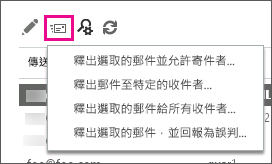

# 以系統管理員身分尋找及釋出被隔離的郵件Find and release quarantined messages as an administrator

本主題說明 Exchange Online 和 Exchange Online Protection (EOP) 系統管理員如何在 Exchange 系統管理中心 (EAC) 尋找、釋出及報告被隔離的郵件。This topic describes how Exchange Online and Exchange Online Protection (EOP) admins can find, release, and report on quarantined messages in the Exchange admin center (EAC). Office 365 將郵件移至隔離區是因為被判定為垃圾郵件或符合郵件流程規則 (又稱為傳輸規則)。Office 365 directs messages to quarantine either because they were identified as spam or they matched a mail flow rule (also known as a transport rule).

您可以使用安全性與合規性中心 (而非 EAC) 來完成任何這類工作；Exchange 系統管理中心 (EAC) 內的隔離入口網站設定為解除委任。You can use the Security & Compliance Center instead of the EAC to complete any of these tasks as well; the Quarantine portal within the Exchange admin center (EAC) is set to be decommisioned. 如需詳細資訊，請參閱[在 Office 365 中隔離電子郵件訊息](quarantine-email-messages.md)。For more information, see [Quarantine email messages in Office 365](quarantine-email-messages.md).

隔離的郵件會列在 EAC 中的 **[隔離]** 頁面。Quarantined messages are listed on the **quarantine** page in EAC. 根據預設，郵件在 **[收到日期]** 欄位中會以從最新到最舊的方式排序。By default, messages are sorted from newest to oldest on the **RECEIVED** field. 此外亦會列出每封郵件的 **[寄件者]**、 **[主旨]** 和 **[到期日]** 值。**SENDER**, **SUBJECT**, and **EXPIRES** values are also listed for each message. 您可按一下這些任一欄位的標頭，以進行排序。You can sort on any of these fields by clicking their headers. 如果您再按一下欄標頭，就會反轉排序。If you click a column header a second time, the sort order reverses. **[隔離]** 頁面最多可顯示 500 封郵件。The **quarantine** page displays a maximum of 500 messages.

您可以檢視所有隔離之郵件的清單，也可以指定篩選準則來搜尋特定郵件 (如果您有超過 500 封郵件，則篩選也可以協助精簡結果集)。You can view a list of all quarantined messages, or you can search for specific messages by specifying filter criteria (filtering can also help reduce your result set if you have more than 500 messages). 在搜尋並找到特定的隔離郵件後，您可以檢視該郵件的詳細資料。After searching for and locating a specific quarantined message, you can view details about the message. 您也可以：You can also:

- 釋出郵件給一或多個收件者，並選擇性地向 Microsoft 垃圾郵件分析小組報告該郵件為誤判的郵件 (非垃圾郵件)，而該小組會評估和分析此郵件。Release the message to one or more recipients, and optionally report it as a false positive (not junk) message to the Microsoft Spam Analysis Team, who will evaluate and analyze the message. 我們可以根據分析的結果調整全服務的垃圾郵件內容篩選規則，以便允許郵件通行。Depending on the results of the analysis, the service-wide spam content filter rules may be adjusted to allow the message through.

- 釋出郵件並允許該寄件者的所有後續郵件。Release the message and allow all future messages from that sender.

## 開始之前有哪些須知？What do you need to know before you begin?

- 您必須已獲指派權限，才能執行此程序或這些程序。You need to be assigned permissions before you can perform this procedure or procedures. 若要查看您需要的權限，請參閱 [Exchange Online 中的功能權限](https://docs.microsoft.com/exchange/permissions-exo/feature-permissions)主題中的「隔離」項目。To see what permissions you need, see the "Quarantine" entry in the [Feature Permissions in Exchange Online](https://docs.microsoft.com/exchange/permissions-exo/feature-permissions) topic.

- 您可以在 **[隔離]** 頁面一次釋出或回報多封郵件。You can release or report multiple messages at once on the **quarantine** page. 或者，您可以建立遠端 Windows PowerShell 指令碼來完成這項工作。Alternatively you can create a remote Windows PowerShell script to accomplish this task. 使用 [Get-QuarantineMessage](https://docs.microsoft.com/powershell/module/exchange/antispam-antimalware/get-quarantinemessage) 指令程式來搜尋郵件，使用 [Release-QuarantineMessage](https://docs.microsoft.com/powershell/module/exchange/antispam-antimalware/release-quarantinemessage) 指令程式來釋出郵件。Use the [Get-QuarantineMessage](https://docs.microsoft.com/powershell/module/exchange/antispam-antimalware/get-quarantinemessage) cmdlet to search for messages, and the [Release-QuarantineMessage](https://docs.microsoft.com/powershell/module/exchange/antispam-antimalware/release-quarantinemessage) cmdlet to release them.

- 如需適用於本主題中程序的快速鍵相關資訊，請參閱 [Exchange Online 中 Exchange 系統管理中心的鍵盤快速鍵](https://docs.microsoft.com/Exchange/accessibility/keyboard-shortcuts-in-admin-center)。For information about keyboard shortcuts that may apply to the procedures in this topic, see [Keyboard shortcuts for the Exchange admin center in Exchange Online](https://docs.microsoft.com/Exchange/accessibility/keyboard-shortcuts-in-admin-center).

> [!TIP]
> 有問題嗎？Having problems? 在 [Exchange Online Protection](https://go.microsoft.com/fwlink/p/?linkId=285351) 論壇中尋求協助。Ask for help in the [Exchange Online Protection](https://go.microsoft.com/fwlink/p/?linkId=285351) forum.

## 使用進階搜尋來篩選和尋找隔離郵件Use advanced search to filter and locate quarantined messages

在 Exchange 系統管理中心 (EAC)，您可以使用進階搜尋，根據數個不同條件來篩選隔離的郵件。這些條件可以分開使用，也可以一起使用。搜尋將會提供符合所有篩選準則的郵件清單。In the Exchange admin center (EAC), you can filter quarantined items based on several different conditions using advanced search. You can use these conditions separately or in combination with one another. The search will provide a list of messages that meet all your filter criteria.

1. 在 EAC 中瀏覽至 **[保護]** \> **[隔離]**，然後按一下 **[進階搜尋]**。In EAC, navigate to **Protection** \> **quarantine**, and then click **Advanced search**.

2. 在 **[進階搜尋]** 視窗中，選取下列任意條件組合。In the **Advanced search** window, select any combination of the following conditions. 選取關聯的核取方塊，以啟用每個條件。Select the associated check box to enable each condition. 不支援萬用字元。Wildcards aren't supported.

   1. **郵件識別碼**：您可以使用此參數來執行特定郵件的目標式搜尋。**Message ID**: You can use this parameter to perform a targeted search for a specific message. 例如，如果組織中的某位使用者傳送了郵件或者他是郵件的預定收件者，但郵件未到達目的地，則您可使用郵件追蹤功能搜尋郵件。For example, if a specific message is sent by, or intended for, a user in your organization, but it never reaches its destination, you can search for the message using the message trace feature. 如需詳細資訊，請參閱 [執行訊息追蹤和檢視結果](https://docs.microsoft.com/exchange/monitoring/trace-an-email-message/run-a-message-trace-and-view-results)。For details, see [Run a Message Trace and View Results](https://docs.microsoft.com/exchange/monitoring/trace-an-email-message/run-a-message-trace-and-view-results). 如果您發現郵件已傳送到隔離區 (或許因為該郵件符合了某個規則或被視為垃圾郵件)，指定其郵件識別碼，即可在隔離區中輕鬆找到此郵件。If you discover that the message was sent to the quarantine, perhaps because it matched a rule or was identified as spam, you can then easily find this message in the quarantine by specifying its Message ID. 務必包括完整的郵件識別碼字串。Be sure to include the full Message ID string. 這可能包括角括號 (\<\>)。This might include angle brackets (\<\>).

   2. **寄件者電子郵件地址**：指定寄送郵件人員的電子郵件地址。**Sender email address**: Specify the email address of the person who sent the message.

   3. **收件者電子郵件地址**：指定郵件預定收件者的電子郵件地址。**Recipient email address**: Specify the email address of the intended recipient of the message.

   4. **主旨**：指定郵件的主旨行文字。**Subject**: Specify the subject line text of the message.

   5. **已接收**：您可以選取郵件是由隔離區在過去 24 小時 ( **今天**)、過去 48 小時 (**最近 2 天**)、過去一週 (**最近 7 天**) 內接收，也可以選取隔離區接收郵件的自訂時間間隔。**Received**: You can select that the message was received by quarantine within the past 24 hours ( **Today**), within the past 48 hours ( **Last 2 days**), within the past week ( **Last 7 days**), or you can select a custom time interval during which the message was received by the quarantine.

   6. **過期**：您可以選取郵件將在未來 24 小時 ( **今天**)、未來 48 小時 ( **未來 2 天**)、未來一週 ( **未來 7 天**) 內從隔離區刪除，也可以選取從隔離區刪除郵件的自訂時間間隔。**Expires**: You can select that the message will be deleted from quarantine within the next 24 hours ( **Today**), within the next 48 hours ( **Next 2 days**), within the next week ( **Next 7 days**), or you can select a custom time interval during which the message will be deleted from quarantine.

      > [!IMPORTANT]
      > 根據預設，垃圾郵件隔離的郵件會保留在隔離區 30 天，而符合郵件流程規則的隔離郵件會根據您在預設內容篩選原則中設定的保留期，最多保留在隔離區 30 天。By default, spam-quarantined messages are kept in quarantine for 30 days, while quarantined messages that matched a mail flow rule are kept in the quarantine for up to 30 days based on the retention period set in your default content filter policy. 超過這段時間後，Office 365 就會刪除郵件，而無法擷取。After this period of time Office 365 deletes the messages and they are not retrievable. 符合郵件流程規則的隔離郵件無法設定保留期限。The retention period for quarantined messages that matched a mail flow rule is not configurable. 不過，您可以透過內容篩選原則的 **[保留垃圾郵件的天數]** 設定，縮短垃圾郵件隔離郵件的保留期限。However, the retention period for spam-quarantined messages can be lowered via the **Retain spam for (days)** setting in your content filter policies. 如需詳細資訊，請參閱[設定您的垃圾郵件篩選原則](configure-your-spam-filter-policies.md)。For more information, see [Configure your spam filter policies](configure-your-spam-filter-policies.md).

   7. **類型** 您可指定是要搜尋被識別為 **[垃圾郵件]** 的隔離郵件，或是搜尋符合某個郵件流程規則 (**傳輸規則**) 的郵件。**Type** You can specify whether to search for quarantined messages that have been identified as **Spam**, or whether to search for messages that matched a mail flow rule (**Transport rule**).

3. 按一下 **[確定]**，開始執行進階搜尋。Click **OK** to start running the advanced search.

   > [!NOTE]
   > 若要清除搜尋準則並檢視隔離中的所有郵件，請清除 **[進階搜尋]** 視窗中的所有核取方塊，然後按一下 **[確定]**。To clear your search criteria and view all messages in the quarantine, clear all the check boxes in the **Advanced search** window, and then click **OK**.

搜尋郵件後，符合您指定之準則的結果會顯示在使用者介面中。EAC 中最多可以顯示 500 封郵件。After searching for messages, the results that match your specified criteria will display in the user interface. A maximum of 500 messages can be displayed in the EAC.

## 檢視特定隔離郵件的詳細資料View details about a specific quarantined message

在 **[隔離]** 頁面找到特定隔離郵件之後，您即可檢視其詳細資料。After locating a specific quarantined message on the **quarantine** page, you can view details about it.

1. 在 **[隔離]** 頁面中，選取特定郵件，畫面右邊的詳細資料窗格中會顯示該郵件的屬性摘要。On the **quarantine** page, select a specific message and a summary of the properties of that message appear in the details pane on the right side of the screen.

   **[郵件狀態]** 值如下：The **Message status** values are as follows:

   - **類型**：指出郵件被識別為 **[垃圾郵件]** 或是符合某個郵件流程規則 (**傳輸規則)**。**Type**: Denotes whether the message has been identified as **Spam** or matched a mail flow rule (**Transport rule**).

   - **到期**：將從隔離刪除此郵件的日期。**Expires**: The date when the message will be deleted from the quarantine.

   **[郵件詳細資料]** 值如下：The **Message details** values are as follows:

   - **寄件者**：傳送郵件之人員的電子郵件地址。**Sender**: The email address of the person who sent the message.

   - **主旨**：郵件的主旨行文字。**Subject**: The subject line text of the message.

   - **收到日期**：隔離收到郵件的日期。**Received**: The date on which the message was received by the quarantine.

   - **大小**：郵件的大小，單位為 KB，如果郵件大小超過 999 KB 則為 MB。**Size**: The size of the message, in kilobytes (KB), or, if the message size is greater than 999 KBs, in megabytes (MB).

   - **檢視郵件標頭**：按一下此連結可開啟 **[郵件標頭]** 對話方塊，以便您檢視郵件標頭文字。**View message header**: Click this link to open the **message header** dialog box, which lets you view the message header text. You can also copy the message header text to your clipboard and paste it into the [Message Header Analyzer](https://testconnectivity.microsoft.com/?tabid=mha).You can also copy the message header text to your clipboard and paste it into the [Message Header Analyzer](https://testconnectivity.microsoft.com/?tabid=mha). Once in the Message Header Analyzer tool, click **Analyze headers** in order to retrieve information about the header.Once in the Message Header Analyzer tool, click **Analyze headers** in order to retrieve information about the header.

    > [!TIP]
    > 如需服務所插入之特定反垃圾郵件郵件標頭欄位的相關資訊，請參閱[反垃圾郵件訊息標頭](anti-spam-message-headers.md)。For information about specific anti-spam message header fields inserted by the service, see [Anti-spam message headers](anti-spam-message-headers.md).

   - **檢閱電子郵件** 按一下此連結以檢閱郵件文字。**Preview email message** Click this link to review the text of the message.

2. 如果您按兩下隔離郵件，則會開啟 **[隔離郵件]** 視窗並顯示下列資訊：If you double-click a quarantined message, the **Quarantined message** window opens and displays the following information:

   - **已釋出**：已釋出其郵件的所有電子郵件地址清單 (若有的話)。**Released to**: A list of all email addresses to whom the message has been released, if any.

   - **尚未釋出**：尚未釋出其郵件的所有電子郵件地址清單 (若有的話)。**Not yet released to**: A list of all email addresses to whom the message has not been released, if any. You can click the **Release to** link in order to release the message; for more information about releasing a message, see the next section.You can click the **Release to** link in order to release the message; for more information about releasing a message, see the next section.

   - **郵件識別碼**：在郵件標頭中找到的網際網路郵件識別碼 (也稱為用戶端識別碼)。**Message ID**: The Internet Message ID (also known as the Client ID) found in the header of the message.

   按一下 **[關閉]** 返回主要隔離窗格。Click **Close** to return to the main quarantine pane.

## 從隔離區釋出郵件Release messages from quarantine

如果您想要將郵件釋出給收件者，您可以：If you want to release messages to recipients, your options are:

- [釋出隔離的郵件並允許該寄件者的後續郵件Release a quarantined message and allow future messages from the sender](#release-a-quarantined-message-and-allow-future-messages-from-the-sender)

- [釋出隔離的郵件給特定收件者，而不將其回報為誤判Release a quarantined message to specific recipients without reporting it as a false positive](#release-a-quarantined-message-to-specific-recipients-without-reporting-it-as-a-false-positive)

- [釋出一或多個隔離的郵件給所有收件者Release one or more quarantined messages to all recipients](#release-one-or-more-quarantined-messages-to-all-recipients)

- [釋出一或多個隔離的郵件給所有收件者並將其回報為誤判Release one or more quarantined messages to all recipients and report false positives](#release-one-or-more-quarantined-messages-to-all-recipients-and-report-false-positives)

### 釋出隔離的郵件並允許該寄件者的後續郵件Release a quarantined message and allow future messages from the sender

1. 在 EAC 中瀏覽至 **[保護]** \> **[隔離]**。In EAC, navigate to **Protection** \> **quarantine**.

2. 按一下選取郵件，然後按一下 **[釋出郵件]** 圖示，如以下螢幕擷取畫面所示。Click on a message to select it and then click the **Release Message** icon as shown in the following screen shot.

   

   從下拉式清單中按一下 **[釋出選取的郵件並允許寄件者]**。Click **Release selected message and allow sender** from the drop-down list.

3. **[釋出郵件並允許寄件者]** 對話方塊即會開啟。The **release message and allow sender** dialog box opens. 您可以選擇是否要向 Microsoft 回報郵件，然後按一下 **[釋出並允許]**。Optionally, you can choose to report the message to Microsoft, then click **release and allow**. 郵件將會釋出給所有該郵件的收件者，並允許該寄件者的所有後續郵件。The message will be released to all recipients it's addressed to and all future messages from this sender will be allowed. 然而，如果該郵件因為郵件流程規則或封鎖的寄件者而被隔離，則寄件者後續郵件仍會持續封鎖。However, if this message was quarantined because of a mail flow rule or blocked sender, the sender will continue to be blocked for future messages.

### 釋出隔離的郵件給特定收件者，而不將其回報為誤判Release a quarantined message to specific recipients without reporting it as a false positive

1. 在 EAC 中瀏覽至 **[保護]** \> **[隔離]**。In EAC, navigate to **Protection** \> **quarantine**.

2. 選取郵件並按一下 **[釋出郵件]** 圖示，接著在下拉式清單中按一下 **[將郵件釋出給特定收件者]**。Select a message, click the **Release Message** icon, and then click **Release message to specific recipients** from the drop-down list.

3. 在 **[釋出郵件]** 對話方塊中，選取下列其中一個選項：In the **release message** dialog box, select one of the following options:

   - **將郵件釋出給所有收件者** 如果您選取此選項，請注意，您只能將郵件釋出給同一位收件者一次。如果收件者先前已收到郵件，系統不會再將郵件釋出給該名收件者。**Release message to all recipients** When you select this option, be aware that a message cannot be released more than once to the same recipient. If a recipient has previously received the message, it will not be released again to that recipient.

   - **將郵件釋出給指定的收件者** 選取郵件釋出的目標收件者。**Release message to specified recipients** Select the recipient(s) to whom the message can be released. 由於您只能將郵件釋出給每位收件者一次，因此唯有能當做釋出目標的收件者會出現在清單中。Because a message can only be released once to each recipient, only recipients to whom it can be released appear in this list. 您可以選擇多位收件者。Multi-selection is supported. 完成收件者選擇後，請按一下 **[新增]**。After making your recipient selections, click **add**.

4. 按一下 **[釋出]**。Click **release**.

如果按一下 **[重新整理** ] 來重新整理資料，然後按兩下郵件，則會看到郵件已釋出到目標收件者。If you click **Refresh**  to refresh your data, and then double-click the message, you should see that it's been released to the intended recipients.

### 釋出一或多個隔離的郵件給所有收件者Release one or more quarantined messages to all recipients

1. 在 EAC 中瀏覽至 **[保護]** \> **[隔離]**。In EAC, navigate to **Protection** \> **quarantine**.

2. 按一下選取郵件，或使用 Shift 鍵選取多封郵件。Click on a message to select it, or use the shift key to select multiple messages. 然後按一下 **[釋出郵件]** 圖示。Then click the **Release Message** icon.

3. 從下拉式清單中按一下 **[釋出選取的郵件至所有收件者]**。Click **Release selected message(s) to ALL recipients** from the drop-down list.

4. 警告對話方塊隨即開啟。The warning dialog box opens. 如果您想要繼續，請閱讀警告並選取 **[是]**。Read the warning and select **Yes** if you want to proceed. 如果您選取此選項，請注意，您只能將郵件釋出給同一位收件者一次。When you select this option, be aware that a message cannot be released more than once to the same recipient. 如果收件者先前已收到郵件，系統不會再將郵件釋出給該名收件者。If a recipient has previously received the message, it will not be released again to that recipient.

### 釋出一或多個隔離的郵件給所有收件者並將其回報為誤判Release one or more quarantined messages to all recipients and report false positives

1. 在 EAC 中瀏覽至 **[保護]** \> **[隔離]**。In EAC, navigate to **Protection** \> **quarantine**.

2. 按一下選取郵件，或使用 Shift 鍵選取多封郵件。Click on a message to select it, or use the shift key to select multiple messages. 然後按一下 **[釋出郵件]** 圖示。Then click the **Release Message** icon.

3. 從下拉式清單中按一下 **[釋出選取的郵件並將其回報為誤判]**。Click **Release selected message(s) and report as false positive** from the drop-down list.

4. 警告對話方塊隨即開啟。The warning dialog box opens. 如果您想要繼續，請閱讀警告並選取 **[是]**。Read the warning and select **Yes** if you want to proceed. 如果您選取此選項，請注意，您只能將郵件釋出給同一位收件者一次。When you select this option, be aware that a message cannot be released more than once to the same recipient. 如果收件者先前已收到郵件，系統不會再將郵件釋出給該名收件者。If a recipient has previously received the message, it will not be released again to that recipient.

   當您選擇此動作時，系統會將郵件釋出給所有尚未收到該郵件的收件者。When you choose this option, the message will be released to all recipients who have not yet received it. 如果這是垃圾郵件隔離郵件，則也會向 Microsoft 垃圾郵件分析小組進行回報，該小組會評估和分析此郵件。If it's a spam-quarantined message, it will also be reported to the Microsoft Spam Analysis Team, who will evaluate and analyze the message. 我們可以根據分析的結果調整全服務的垃圾郵件內容篩選規則，以便允許郵件通行。Depending on the results of the analysis, the service-wide spam content filter rules may be adjusted to allow the message through.

> [!TIP]
> 按照[如何協助確保郵件不會被標示為垃圾郵件](how-to-help-ensure-that-a-message-isn-t-marked-as-spam.md)中的步驟，協助確保郵件不會被標示為垃圾郵件。Help ensure that a message isn't marked as spam by following the steps in [How to help ensure that a message isn't marked as spam](how-to-help-ensure-that-a-message-isn-t-marked-as-spam.md).

如果按一下 **[重新整理** ] 圖示來重新整理資料，然後按兩下郵件，則會看到郵件已釋出到目標收件者。If you click the **Refresh** icon to refresh your data, and then double-click the message, you should see that it's been released to the intended recipients.

## 如需詳細資訊For more information

[隔離常見問題集Quarantine FAQ](quarantine-faq.md)
