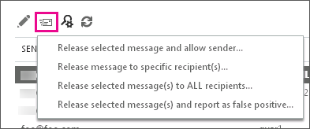

# 以系統管理員身分尋找及釋出被隔離的郵件

本主題說明 Exchange Online 和 Exchange Online Protection (EOP) 系統管理員如何在 Exchange 系統管理中心 (EAC) 尋找、釋出及報告被隔離的郵件。 Office 365 將郵件移至隔離區是因為被判定為垃圾郵件或符合郵件流程規則 (又稱為傳輸規則)。

您可以使用安全性與合規性中心 (而非 EAC) 來完成任何這類工作；Exchange 系統管理中心 (EAC) 內的隔離入口網站設定為解除委任。 如需詳細資訊，請參閱[在 Office 365 中隔離電子郵件訊息](quarantine-email-messages.md)。

隔離的郵件會列在 EAC 中的 **[隔離]** 頁面。 根據預設，郵件在 **[收到日期]** 欄位中會以從最新到最舊的方式排序。 此外亦會列出每封郵件的 **[寄件者]**、 **[主旨]** 和 **[到期日]** 值。 您可按一下這些任一欄位的標頭，以進行排序。 如果您再按一下欄標頭，就會反轉排序。 **[隔離]** 頁面最多可顯示 500 封郵件。

您可以檢視所有隔離之郵件的清單，也可以指定篩選準則來搜尋特定郵件 (如果您有超過 500 封郵件，則篩選也可以協助精簡結果集)。 在搜尋並找到特定的隔離郵件後，您可以檢視該郵件的詳細資料。 您也可以：

- 釋出郵件給一或多個收件者，並選擇性地向 Microsoft 垃圾郵件分析小組報告該郵件為誤判的郵件 (非垃圾郵件)，而該小組會評估和分析此郵件。 我們可以根據分析的結果調整全服務的垃圾郵件內容篩選規則，以便允許郵件通行。

- 釋出郵件並允許該寄件者的所有後續郵件。

## 開始之前有哪些須知？

- 您必須已獲指派權限，才能執行此程序或這些程序。 若要查看您需要的權限，請參閱 [Exchange Online 中的功能權限](https://docs.microsoft.com/exchange/permissions-exo/feature-permissions)主題中的「隔離」項目。

- 您可以在 **[隔離]** 頁面一次釋出或回報多封郵件。 或者，您可以建立遠端 Windows PowerShell 指令碼來完成這項工作。 使用 [Get-QuarantineMessage](https://docs.microsoft.com/powershell/module/exchange/antispam-antimalware/get-quarantinemessage) 指令程式來搜尋郵件，使用 [Release-QuarantineMessage](https://docs.microsoft.com/powershell/module/exchange/antispam-antimalware/release-quarantinemessage) 指令程式來釋出郵件。

- 如需適用於本主題中程序的快速鍵相關資訊，請參閱 [Exchange Online 中 Exchange 系統管理中心的鍵盤快速鍵](https://docs.microsoft.com/Exchange/accessibility/keyboard-shortcuts-in-admin-center)。

> [!TIP]
> 有問題嗎？ 在 [Exchange Online Protection](https://go.microsoft.com/fwlink/p/?linkId=285351) 論壇中尋求協助。

## 使用進階搜尋來篩選和尋找隔離郵件

在 Exchange 系統管理中心 (EAC)，您可以使用進階搜尋，根據數個不同條件來篩選隔離的郵件。這些條件可以分開使用，也可以一起使用。搜尋將會提供符合所有篩選準則的郵件清單。

1. 在 EAC 中瀏覽至 **[保護]** \> **[隔離]**，然後按一下 **[進階搜尋]**。

2. 在 **[進階搜尋]** 視窗中，選取下列任意條件組合。 選取關聯的核取方塊，以啟用每個條件。 不支援萬用字元。

   1. **郵件識別碼**：您可以使用此參數來執行特定郵件的目標式搜尋。 例如，如果組織中的某位使用者傳送了郵件或者他是郵件的預定收件者，但郵件未到達目的地，則您可使用郵件追蹤功能搜尋郵件。 如需詳細資訊，請參閱 [執行訊息追蹤和檢視結果](https://docs.microsoft.com/exchange/monitoring/trace-an-email-message/run-a-message-trace-and-view-results)。 如果您發現郵件已傳送到隔離區 (或許因為該郵件符合了某個規則或被視為垃圾郵件)，指定其郵件識別碼，即可在隔離區中輕鬆找到此郵件。 務必包括完整的郵件識別碼字串。 這可能包括角括號 (\<\>)。

   2. **寄件者電子郵件地址**：指定寄送郵件人員的電子郵件地址。

   3. **收件者電子郵件地址**：指定郵件預定收件者的電子郵件地址。

   4. **主旨**：指定郵件的主旨行文字。

   5. **已接收**：您可以選取郵件是由隔離區在過去 24 小時 ( **今天**)、過去 48 小時 (**最近 2 天**)、過去一週 (**最近 7 天**) 內接收，也可以選取隔離區接收郵件的自訂時間間隔。

   6. **過期**：您可以選取郵件將在未來 24 小時 ( **今天**)、未來 48 小時 ( **未來 2 天**)、未來一週 ( **未來 7 天**) 內從隔離區刪除，也可以選取從隔離區刪除郵件的自訂時間間隔。

      > [!IMPORTANT]
      > 根據預設，垃圾郵件隔離的郵件會保留在隔離區 30 天，而符合郵件流程規則的隔離郵件會根據您在預設內容篩選原則中設定的保留期，最多保留在隔離區 30 天。 超過這段時間後，Office 365 就會刪除郵件，而無法擷取。 符合郵件流程規則的隔離郵件無法設定保留期限。 不過，您可以透過內容篩選原則的 **[保留垃圾郵件的天數]** 設定，縮短垃圾郵件隔離郵件的保留期限。 如需詳細資訊，請參閱[設定您的垃圾郵件篩選原則](configure-your-spam-filter-policies.md)。

   7. **類型** 您可指定是要搜尋被識別為 **[垃圾郵件]** 的隔離郵件，或是搜尋符合某個郵件流程規則 (**傳輸規則**) 的郵件。

3. 按一下 **[確定]**，開始執行進階搜尋。

   > [!NOTE]
   > 若要清除搜尋準則並檢視隔離中的所有郵件，請清除 **[進階搜尋]** 視窗中的所有核取方塊，然後按一下 **[確定]**。

搜尋郵件後，符合您指定之準則的結果會顯示在使用者介面中。EAC 中最多可以顯示 500 封郵件。

## 檢視特定隔離郵件的詳細資料

在 **[隔離]** 頁面找到特定隔離郵件之後，您即可檢視其詳細資料。

1. 在 **[隔離]** 頁面中，選取特定郵件，畫面右邊的詳細資料窗格中會顯示該郵件的屬性摘要。

   **[郵件狀態]** 值如下：

   - **類型**：指出郵件被識別為 **[垃圾郵件]** 或是符合某個郵件流程規則 (**傳輸規則)**。

   - **到期**：將從隔離刪除此郵件的日期。

   **[郵件詳細資料]** 值如下：

   - **寄件者**：傳送郵件之人員的電子郵件地址。

   - **主旨**：郵件的主旨行文字。

   - **收到日期**：隔離收到郵件的日期。

   - **大小**：郵件的大小，單位為 KB，如果郵件大小超過 999 KB 則為 MB。

   - **檢視郵件標頭**：按一下此連結可開啟 **[郵件標頭]** 對話方塊，以便您檢視郵件標頭文字。 You can also copy the message header text to your clipboard and paste it into the [Message Header Analyzer](https://testconnectivity.microsoft.com/?tabid=mha). Once in the Message Header Analyzer tool, click **Analyze headers** in order to retrieve information about the header.

    > [!TIP]
    > 如需服務所插入之特定反垃圾郵件郵件標頭欄位的相關資訊，請參閱[反垃圾郵件訊息標頭](anti-spam-message-headers.md)。

   - **檢閱電子郵件** 按一下此連結以檢閱郵件文字。

2. 如果您按兩下隔離郵件，則會開啟 **[隔離郵件]** 視窗並顯示下列資訊：

   - **已釋出**：已釋出其郵件的所有電子郵件地址清單 (若有的話)。

   - **尚未釋出**：尚未釋出其郵件的所有電子郵件地址清單 (若有的話)。 You can click the **Release to** link in order to release the message; for more information about releasing a message, see the next section.

   - **郵件識別碼**：在郵件標頭中找到的網際網路郵件識別碼 (也稱為用戶端識別碼)。

   按一下 **[關閉]** 返回主要隔離窗格。

## 從隔離區釋出郵件

如果您想要將郵件釋出給收件者，您可以：

- [釋出隔離的郵件並允許該寄件者的後續郵件](#release-a-quarantined-message-and-allow-future-messages-from-the-sender)

- [釋出隔離的郵件給特定收件者，而不將其回報為誤判](#release-a-quarantined-message-to-specific-recipients-without-reporting-it-as-a-false-positive)

- [釋出一或多個隔離的郵件給所有收件者](#release-one-or-more-quarantined-messages-to-all-recipients)

- [釋出一或多個隔離的郵件給所有收件者並將其回報為誤判](#release-one-or-more-quarantined-messages-to-all-recipients-and-report-false-positives)

### 釋出隔離的郵件並允許該寄件者的後續郵件

1. 在 EAC 中瀏覽至 **[保護]** \> **[隔離]**。

2. 按一下選取郵件，然後按一下 **[釋出郵件]** 圖示，如以下螢幕擷取畫面所示。

   

   從下拉式清單中按一下 **[釋出選取的郵件並允許寄件者]**。

3. **[釋出郵件並允許寄件者]** 對話方塊即會開啟。 您可以選擇是否要向 Microsoft 回報郵件，然後按一下 **[釋出並允許]**。 郵件將會釋出給所有該郵件的收件者，並允許該寄件者的所有後續郵件。 然而，如果該郵件因為郵件流程規則或封鎖的寄件者而被隔離，則寄件者後續郵件仍會持續封鎖。

### 釋出隔離的郵件給特定收件者，而不將其回報為誤判

1. 在 EAC 中瀏覽至 **[保護]** \> **[隔離]**。

2. 選取郵件並按一下 **[釋出郵件]** 圖示，接著在下拉式清單中按一下 **[將郵件釋出給特定收件者]**。

3. 在 **[釋出郵件]** 對話方塊中，選取下列其中一個選項：

   - **將郵件釋出給所有收件者** 如果您選取此選項，請注意，您只能將郵件釋出給同一位收件者一次。如果收件者先前已收到郵件，系統不會再將郵件釋出給該名收件者。

   - **將郵件釋出給指定的收件者** 選取郵件釋出的目標收件者。 由於您只能將郵件釋出給每位收件者一次，因此唯有能當做釋出目標的收件者會出現在清單中。 您可以選擇多位收件者。 完成收件者選擇後，請按一下 **[新增]**。

4. 按一下 **[釋出]**。

如果按一下 **[重新整理** ] 來重新整理資料，然後按兩下郵件，則會看到郵件已釋出到目標收件者。

### 釋出一或多個隔離的郵件給所有收件者

1. 在 EAC 中瀏覽至 **[保護]** \> **[隔離]**。

2. 按一下選取郵件，或使用 Shift 鍵選取多封郵件。 然後按一下 **[釋出郵件]** 圖示。

3. 從下拉式清單中按一下 **[釋出選取的郵件至所有收件者]**。

4. 警告對話方塊隨即開啟。 如果您想要繼續，請閱讀警告並選取 **[是]**。 如果您選取此選項，請注意，您只能將郵件釋出給同一位收件者一次。 如果收件者先前已收到郵件，系統不會再將郵件釋出給該名收件者。

### 釋出一或多個隔離的郵件給所有收件者並將其回報為誤判

1. 在 EAC 中瀏覽至 **[保護]** \> **[隔離]**。

2. 按一下選取郵件，或使用 Shift 鍵選取多封郵件。 然後按一下 **[釋出郵件]** 圖示。

3. 從下拉式清單中按一下 **[釋出選取的郵件並將其回報為誤判]**。

4. 警告對話方塊隨即開啟。 如果您想要繼續，請閱讀警告並選取 **[是]**。 如果您選取此選項，請注意，您只能將郵件釋出給同一位收件者一次。 如果收件者先前已收到郵件，系統不會再將郵件釋出給該名收件者。

   當您選擇此動作時，系統會將郵件釋出給所有尚未收到該郵件的收件者。 如果這是垃圾郵件隔離郵件，則也會向 Microsoft 垃圾郵件分析小組進行回報，該小組會評估和分析此郵件。 我們可以根據分析的結果調整全服務的垃圾郵件內容篩選規則，以便允許郵件通行。

> [!TIP]
> 按照[如何協助確保郵件不會被標示為垃圾郵件](how-to-help-ensure-that-a-message-isn-t-marked-as-spam.md)中的步驟，協助確保郵件不會被標示為垃圾郵件。

如果按一下 **[重新整理** ] 圖示來重新整理資料，然後按兩下郵件，則會看到郵件已釋出到目標收件者。

## 如需詳細資訊

[隔離常見問題集](quarantine-faq.md)
