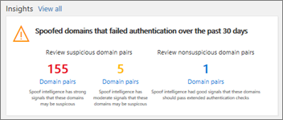
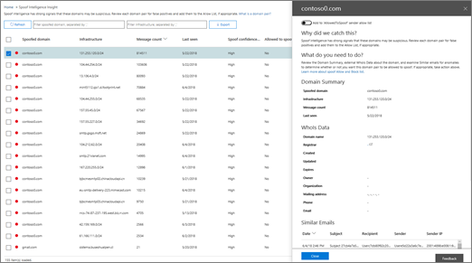

# 逐步解說 - 從儀表板到深入解析

如果您是[Office 365 安全性&amp;與合規性中心內的報表和洞察力的](reports-and-insights-in-security-and-compliance.md)最新資訊，它可能會協助您瞭解如何輕鬆從儀表板流覽至真知灼見及建議的動作。 
  
這是安全性&amp;與合規性中心的幾個演練中的其中一個。 若要查看其他的演練，請參閱[相關主題](#related-topics)一節。 
  
## 逐步解說：從儀表板到深入瞭解

讓我們逐步流覽從儀表板到報表的流向，以瞭解和採取的動作。 （這是一個簡單的[欺騙智慧](learn-about-spoof-intelligence.md)範例）。 
  
1. 我們從[安全性&amp;與合規性中心](https://protection.office.com)的安全性儀表板開始。 （移至 [**威脅管理** \> ]**儀表板**）。 ![在 [安全性&amp;與合規性中心] 中\> ，選擇 [威脅管理] 儀表板](../../media/05a38660-eb13-4960-a266-11809c453d95.png) 
  
2. 在 [**洞察力**] 資料列中，我們會注意到指出我們需要複查某些可能可疑之網域的洞察力。 （在 [**洞察力**] 列中，按一下 [**網域配對**]）。  
  
3. 我們取得與哄騙情報相關的活動清單。 這些是電子郵件傳送的電子郵件，看起來好像來自我們的組織，但實際上是從另一個組織傳送。 目標是要判斷是否已授權哄騙郵件。  在此清單中，我們可以依訊息計數、上一次偵測欺騙的日期等方式來排序資訊。 （按一下 [**郵件計數**] 或 [**最後一個看到**的欄標題]，以查看排序的運作方式。） 
    
4. 選取清單中的專案會開啟詳細資料窗格，讓我們可以看到其他資訊，包括所偵測到的類似電子郵件。 （按一下清單中的專案，然後複查資訊和建議。）  
  
5. 請注意，在窗格頂端，我們可以選擇將寄件者新增至組織的允許寄件者清單。 （請勿選取 [**新增至 ' AllowedtoSpoof ' 寄件者允許清單**，除非您確定要這麼做。 [在 Office 365 中設定欺騙智慧](learn-about-spoof-intelligence.md)。） 
  
以這種方式，我們可以從儀表板移至深入瞭解及建議的動作。
  
## 相關主題

[逐步解說：從深入瞭解到詳細報告](from-an-insight-to-a-detailed-report.md)
  
[逐步解說：從詳細報告到深入瞭解](from-a-detailed-report-to-an-insight.md)
  

