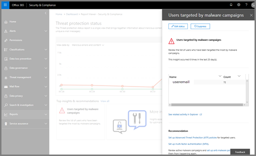

# 逐步解說 - 從詳細報告到深入解析Walkthrough - From a detailed report to an insight

如果您不熟悉[安全性&amp;與合規性中心的報表和洞察力](reports-and-insights-in-security-and-compliance.md)，它可能會協助您瞭解如何輕鬆地從詳細報告流覽至真知灼見及建議的動作。If you're new to [reports and insights in the Security &amp; Compliance Center](reports-and-insights-in-security-and-compliance.md), it might help to see how you can easily navigate from a detailed report to an insight and recommended actions. 
  
這是安全性&amp;與合規性中心的幾個演練中的其中一個。This is one of several walkthroughs for the Security &amp; Compliance Center. 若要查看其他的演練，請參閱[相關主題](#related-topics)一節。To see additional walkthroughs, see the [Related topics](#related-topics) section. 
  
## 逐步解說：從詳細報告到深入瞭解Walkthrough: From a detailed report to an insight

讓我們逐步流覽從詳細報告到深入瞭解和動作的流程。Let's walk through the flow from a detailed report to an insight and actions. （這是一個簡短的[反垃圾郵件和反惡意](anti-spam-and-anti-malware-protection.md)代碼範例。）(This is a brief [anti-spam and anti-malware](anti-spam-and-anti-malware-protection.md) example.) 
  
1. 我們始于[安全&amp;規範中心](https://protection.office.com)報告。We begin with [Security &amp; Compliance Center](https://protection.office.com) reports. （移至 [**報表** \> ]**儀表板**）。(Go to **Reports** \> **Dashboard**.)  ![在安全性&amp;與合規性中心，移至\> [報告] 儀表板](../../media/68f3bb7c-b4f7-4cca-904b-478643a93c94.png)
  
2. 我們選擇報告以取得更詳細的視圖。We choose a report to get a more detailed view. （選擇報表，例如「**威脅防護狀態**報告」）。(Choose a report, such as the **Threat Protection Status** report.) 
  
3. 我們注意到圖表中和報表底下的真知灼見指示器。We notice an insights indicator in the chart as well as below the report. 將滑鼠指標放在 insights 標記上可提供一些額外的詳細資料。Positioning the mouse pointer on the insights marker gives some additional details. （懸停在 insights 標記上方以查看其他詳細資料）。(Hover over the insights marker to see additional details.)
    
4. 按一下圖表中的 insights 標記或相關惡意程式碼的 insights 小工具會開啟詳細資料窗格。Clicking either the insights marker in the chart or the insights widget about malware below the chart opens a details pane. （在圖表下方，選取 insights 小工具）。(Below the chart, select the insights widget.)  詳細資料窗格提供考慮的資訊和建議，包括審查原則、進行進一步的探索，以及編輯狀態。The details pane provides information and recommendations to consider, including reviewing policies, conducting further exploration, and editing status. （[深入瞭解 Office 365 中的反垃圾郵件和反惡意程式碼保護](anti-spam-and-anti-malware-protection.md)）。([Learn more about anti-spam and anti-malware protection in Office 365](anti-spam-and-anti-malware-protection.md).)
    
以這種方式，我們可以從詳細報告移至真知灼見及建議的動作。In this way, we can move from a detailed report to an insight and recommended actions. 
  
## 相關主題Related topics

[逐步解說：從深入瞭解到詳細報告Walkthrough: From an insight to a detailed report](from-an-insight-to-a-detailed-report.md)
  
[逐步解說：從儀表板到深入瞭解Walkthrough: From a dashboard to an insight](from-a-dashboard-to-an-insight.md)
  

