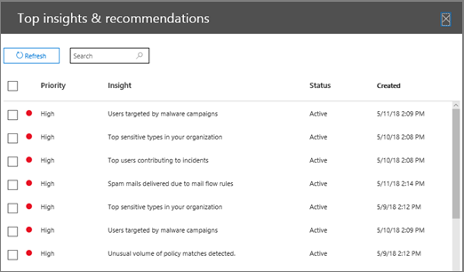

# 逐步解說 - 從深入解析到詳細報告Walkthrough - From an insight to a detailed report

如果您不熟悉[安全性&amp;與合規性中心的報表和洞察力](reports-and-insights-in-security-and-compliance.md)，它可能會協助您瞭解如何輕鬆流覽到詳細報告的洞察力。If you're new to [reports and insights in the Security &amp; Compliance Center](reports-and-insights-in-security-and-compliance.md), it might help to see how you can easily navigate from an insight to a detailed report. 
  
這是[安全性&amp;與合規性中心](https://protection.office.com)的幾個演練中的其中一個。This is one of several walkthroughs for the [Security &amp; Compliance Center](https://protection.office.com). 若要查看其他的演練，請參閱[相關主題](#related-topics)一節。To see additional walkthroughs, see the [Related topics](#related-topics) section. 
  
## 從深入瞭解到詳細報告From an insight to a detailed report

讓我們逐步流覽儀表板的流程，深入瞭解資料探索的詳細報告。Let's walk through the flow from the dashboard to an insight to a detailed report for data exploration. （這是一個簡短的[資料遺失防護](../../compliance/data-loss-prevention-policies.md)範例。）(This is a brief [data loss prevention](../../compliance/data-loss-prevention-policies.md) example.) 
  
1. 我們從[安全性&amp;與合規性中心](https://protection.office.com)的儀表板開始。We begin with a dashboard in the [Security &amp; Compliance Center](https://protection.office.com). （移至 [**報表** \> ]**儀表板**）。(Go to **Reports** \> **Dashboard**.) ![在 [安全性&amp;與合規性中心] \>中，選擇 [報告] 儀表板](../../media/2a668c3d-3fa3-4e37-8149-46989b33ae8c.png)
  
2. 在儀表板的左上角，在 [熱門資訊] \*\* &amp;建議\*\*旁，我們有連結。In the upper left corner of the dashboard, next to **Top insights &amp; recommendations**, we have a link. （按一下 [**全部查看**]。）(Click **View all**.) ![在 [安全性&amp;與合規性中心] \>中，選擇 [報告] 儀表板以查看您的熱門洞察力](../../media/9bb64e11-494f-40a4-ab3d-8d3c7789f300.png) 這需要我們的組織的洞察力清單。This takes us to a list of insights for our organization. 
  
3. 選取清單中的專案會開啟窗格，我們可以在這裡查看該專案的詳細資訊。Selecting an item in the list opens a pane where we can view more details about that item. （按一下專案。）(Click an item.)  我們會看到我們應考慮的建議動作，例如審閱原則。We see recommended actions we should consider, such as reviewing policies. （[深入瞭解資料遺失防護原則](../../compliance/data-loss-prevention-policies.md)）。([Learn more about data loss prevention policies](../../compliance/data-loss-prevention-policies.md).)
    
4. 我們也有可查看詳細資料的連結。We also have a link to view more details. （按一下 [**參閱 Explorer 中的相關活動**]）。(Click **See related activity in Explorer**.) 這會將我們帶入「[威脅瀏覽器」（和即時偵測）](threat-explorer.md)的報表類型，我們可以在這裡套用篩選器，並以深入查看特定的詳細資料。This takes us to a report type called [Threat Explorer (and real-time detections)](threat-explorer.md), where we can apply filters and drill into specific details. 
  
以這種方式，我們可以輕鬆地從深入瞭解至其基礎詳細資料，並對組織的資料遺失防護作出更明智的決策。In this way, we can move easily from an insight into its underlying details, and make more informed decisions about data loss prevention for an organization.
  
## 相關主題Related topics

[逐步解說：從詳細報告到深入瞭解Walkthrough: From a detailed report to an insight](from-a-detailed-report-to-an-insight.md)
  
[逐步解說：從儀表板到深入瞭解Walkthrough: From a dashboard to an insight](from-a-dashboard-to-an-insight.md)
  

