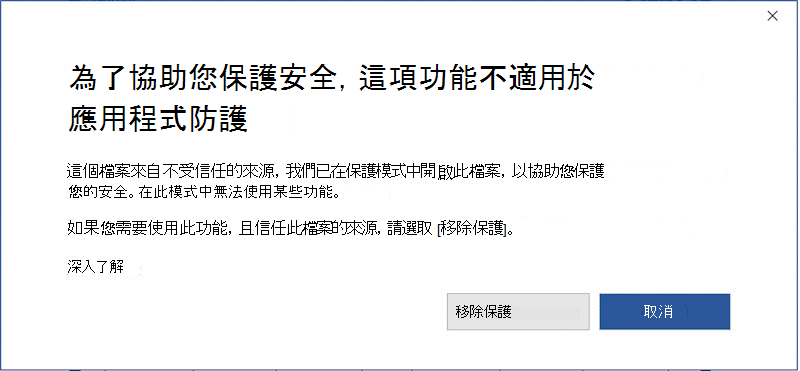

# <a name="application-guard-for-office-public-preview-for-admins"></a>適用于系統管理員的 Office 的應用程式防護 (公開預覽) 

[!INCLUDE [Microsoft 365 Defender rebranding](../includes/microsoft-defender-for-office.md)]


**適用于：** Microsoft 365，Windows 10 企業版的 Word、Excel 及 PowerPoint

> [!IMPORTANT]
> 有些資訊與 prereleased 產品有關，在正式發行之前，可能會受到大量修改。 Microsoft makes no warranties, express or implied, with respect to the information provided here.

Microsoft Defender Application Guard for office (Application Guard) 協助防止不可信的檔案存取受信任的資源，讓您的企業安全地抵禦新的和新興的攻擊。 本文指導管理員如何針對 Office 的應用程式防護，設定可預覽的裝置。 它提供有關系統需求和安裝步驟的資訊，以便在裝置上啟用 Office 的應用程式防護功能。

## <a name="prerequisites"></a>必要條件

### <a name="minimum-hardware-requirements"></a>基本硬體需求

* **CPU**：64位、4核心 (實體或虛擬) 、虛擬化擴充 (Intel VT-x 或 AMD-V) 、Core i5 對等建議或更高版本的建議
* **實體記憶體**： 8 GB RAM
* **硬碟**：系統磁片磁碟機上有 10 GB 的可用空間 (SSD 建議) 

### <a name="minimum-software-requirements"></a>基本軟體需求

* **Windows 10**： Windows 10 Enterprise Edition，Client Build version 2004 (20H1) 組建19041
* **Office**： Office Beta 通道組建版本 2008 16.0.13212 或更新版本
* **更新套件**： Windows 10 累計每月安全性更新 [KB4571756](https://support.microsoft.com/help/4571756/windows-10-update-KB4571756)

如需詳細的系統需求，請參閱 [Microsoft Defender Application Guard 的系統需求](https://docs.microsoft.com/windows/security/threat-protection/microsoft-defender-application-guard/reqs-md-app-guard)。 若要深入瞭解 Office 測試人員預覽組建，請參閱 [部署 office 測試人員組建的快速入門](https://insider.office.com/business/deploy)。

### <a name="licensing-requirements"></a>授權需求

* Microsoft 365 E5 或 Microsoft 365 E5 Security

## <a name="deploy-application-guard-for-office"></a>部署 Office 的應用程式防護

### <a name="enable-application-guard-for-office"></a>啟用適用于 Office 的應用程式防護

1. 下載及安裝 **Windows 10 累計每月安全性更新 KB4571756**。

2. 選取 [Windows 功能] 底下的 [ **Microsoft Defender 應用程式防護** ] 並選取 **[確定]**。 啟用 Application Guard 功能時，會提示重新開機系統。 您可以選擇 [現在] 或 [在步驟3之後重新開機]。

   ![顯示 AG 的 [Windows 功能] 對話方塊](../../media/ag03-deploy.png)

   您也可以以系統管理員身分執行下列 PowerShell 命令，以啟用此功能：

   ```powershell
   Enable-WindowsOptionalFeature -online -FeatureName Windows-Defender-ApplicationGuard
   ```

3. 在 [電腦設定] 系統管理範本的「管理模式」群組原則中尋找 Microsoft Defender Application Guard **\\ \\ \\ microsoft defender application guard**。 在 [選項為 **2** 或 **3** 時設定值]，然後選取 **[確定] 或 [套用]** ，以開啟此 **原則。**

   

   或者，您也可以設定對應的 CSP 原則：

   > OMA URI： **./Device/Vendor/MSFT/WindowsDefenderApplicationGuard/Settings/AllowWindowsDefenderApplicationGuard** <br> 資料類型： **Integer** <br> 值： **2**

4. 重新開機系統。

### <a name="set-diagnostics--feedback-to-send-full-data"></a>設定診斷 & 傳送完整資料的意見

此步驟可確保識別和修正問題所需的資料是在 Microsoft。 請遵循下列步驟，在 Windows 裝置上啟用診斷：

1. 開啟 [開始] 功能表中的 **設定** 。

   ![[開始] 功能表](../../media/ag05-diagnostic.png)

2. 在 [ **Windows 設定**] 上，選取 [ **隱私權**]。

   

3. 在 [隱私權] 底下，選取 [ **診斷 & 回饋** ]，然後選取 [ **選用診斷資料**]。

   

如需設定 Windows 診斷設定的詳細資訊，請參閱設定 [組織中的 Windows 診斷資料](https://docs.microsoft.com/windows/privacy/configure-windows-diagnostic-data-in-your-organization#enterprise-management)。

### <a name="confirm-that-application-guard-for-office-is-enabled-and-working"></a>確認 Office 的應用程式防護已啟用且正常運作

確認已啟用 Office 的應用程式防護功能之後，在已部署原則的裝置上啟動 Word、Excel 或 PowerPoint。 請確定已啟用 Office。 您可能需要先使用您的工作身分識別來啟用 Office 產品。

若要確認 Office 的應用程式防護現在已啟用，請啟動 Word、Excel 或 PowerPoint，然後開啟不受信任的檔。 例如，您可以開啟從網際網路下載的檔或來自組織外部人員的電子郵件附件。

在第一次啟動不受信任的檔案時，您可能會看到如下的 Office 閃屏畫面。 在啟動 Office 的應用程式防護，且正在開啟檔案時，它可能會顯示一段時間。 後續啟動不受信任的檔案應該會更快。


開啟檔案時，該檔案應該會顯示一些視覺標記，指出檔案已在 Office 的應用程式防護中開啟：

* 功能區中的標注

  

* 在工作列中帶有盾牌的應用程式圖示

  

## <a name="configure-application-guard-for-office"></a>設定 Office 的應用程式防護

Office 支援下列原則，可讓您設定 Office 應用程式防護的功能。 您可以透過「群組原則」或 Office cloud policy service 來設定這些原則。

> [!NOTE]
> 這些原則即將推出。
> 此外，設定這些原則也可以停用 Office 的應用程式防護中開啟檔案的某些功能。

|原則|描述|
|---|---|
|停用 Office 的應用程式防護|啟用這個原則會強制 Word、Excel 及 PowerPoint 使用受保護的檢視隔離容器，而不是 Office 的應用程式防護。 這項原則可用於暫時停用 Office 的應用程式防護時，如果有問題仍可讓其啟用 Edge。|
|停用應用程式防護中開啟之檔的複製/貼上|啟用這個原則可防止使用者從 Office 應用程式防護中開啟的檔，將內容複寫並貼到在其外部開啟的檔中。|
|防止使用者移除檔上的應用程式防護保護|啟用此原則將會移除 Office 應用程式經驗) 中的選項 (，以停用應用程式防護保護或開啟應用程式防護之外的檔案。 <p> **附注：** 使用者仍可略過此原則，方法是手動移除檔案中的 web 標記，或是將檔移至信任位置。|
|限制從應用程式防護開啟的檔列印|啟用此原則會限制使用者可以從 Office 的應用程式防護開啟的檔案列印的印表機。 例如，您可以使用這個原則來限制使用者只能列印為 PDF。|
|關閉在應用程式防護中開啟之檔的相機及麥克風存取權|啟用此原則將會在 Office 的應用程式防護中移除對相機及麥克風的 Office 存取。|
|

> [!NOTE]
> 下列原則將需要使用者登出並重新登入 Windows，才會生效：
>
> * 停用應用程式防護中開啟之檔的複製/貼上
> * 限制在應用程式防護中開啟的檔列印
> * 關閉在應用程式防護中開啟的檔的相機及麥克風存取權

## <a name="submit-feedback"></a>提交意見反應

### <a name="submit-feedback-via-feedback-hub"></a>透過意見反應中心提交意見反應

如果您在啟動 Office 的應用程式防護時遇到任何問題，建議您透過意見反應中心提交您的意見反應：

1. 開啟「 **回饋中樞」應用程式** 並登入。

2. 如果您在啟動應用程式防護時收到錯誤對話方塊，請在錯誤對話方塊中選取 [ **向 Microsoft 報告** ]，以啟動新的意見反應提交。 否則，請流覽至 <https://aka.ms/wdagoffice-fb> 以選取正確的應用程式防護類別類別，然後選取 [+ 在右上方 **新增新的意見** 反應]。

3. 若尚未填入您的意見反應摘要，請填入 **您的意見** 反應。

4. 在 [ **詳細資料** ] 方塊中填入您所遇到問題的詳細描述以及您採取的步驟，然後選取 **[下一步]**。

5. 選取 [問題] 旁邊的氣泡。 確定選取的類別為 **安全性和隱私權 \> Microsoft Defender 應用程式防護-Office**，然後選取 **[下一步]**。

6. 選取 [ **新增** 反應]，然後選取 **[下一步]**。

7. 收集有關問題的追蹤：

   1. 展開 [ **重新建立我的問題** ] 磚。

   2. 如果您在執行應用程式防護時發生所遇到的問題，請開啟應用程式防護實例。 這樣做允許從應用程式防護容器內收集其他追蹤。

   3. 選取 [ **開始錄製** ] 並等候磚停止旋轉，並說 [ *停止錄製*]。

   4. 使用應用程式防護完全再現問題。 這可能包括嘗試啟動應用程式防護實例並等候失敗，或在執行中的應用程式防護實例中再現問題。

   5. 選取 [ **停止錄製** ] 磚。

   6. 保留任何執行中的應用程式防護實例/s 開啟，甚至在提交後的幾分鐘後，也可以收集容器診斷。

8. 附加任何相關的螢幕擷取畫面或與問題相關的檔案。

9. 選取 **[提交]**。

### <a name="submit-feedback-via-office-customer-voice"></a>透過 Office 客戶語音提交意見反應

您也可以從 Office 提交意見，如果在應用程式防護中開啟 Office 檔時會發生問題。 請參閱 [Office 預覽人員手冊](https://insider.office.com/handbook) 以取得意見反應。

## <a name="integration-with-microsoft-defender-for-endpoint-and-microsoft-defender-for-office-365"></a>與 Microsoft Defender for Endpoint 和 Microsoft Defender for Office 365 整合

適用于 Office 的應用程式防護會與 Microsoft Defender for Endpoint 整合，以提供有關隔離環境中發生之惡意活動的監控和警示。

Microsoft Defender for Endpoint 是一種安全性平臺，旨在協助商業網路避免、偵測、調查和回應高級威脅。 如需此平臺的詳細資訊，請造訪 [Microsoft Defender For Endpoint](https://www.microsoft.com/microsoft-365/windows/microsoft-defender-atp) 頁面。 深入瞭解在板載裝置上的此平臺上 [的板載裝置至 Microsoft Defender For Endpoint service](https://docs.microsoft.com/windows/security/threat-protection/microsoft-defender-atp/onboard-configure)。

您也可以將 Microsoft Defender for Office 365 設定為搭配使用 Defender for Endpoint。 請參閱 [整合 Defender For Office 365 搭配 Microsoft Defender For Endpoint](integrate-office-365-ti-with-wdatp.md)。

## <a name="limitations-and-considerations"></a>限制和考慮

* 適用于 Office 的應用程式防護是一種限制模式，可隔離不受信任的公司資源、內部網路、使用者的身分識別，以及電腦上顯示的任意檔案。 因此，如果使用者嘗試存取對此類存取有相依性的功能（例如，從磁片上的本機檔案插入圖片），它會失敗，並產生如下所示的提示。 若要讓不可信的檔能夠存取受信任的資源，使用者必須從檔中移除 Application Guard protection。

  

  > [!NOTE]
  > 建議使用者只有在信任檔案及其來源或來源的位置時，才移除保護。

* 在 Office 的應用程式防護中，諸如宏和 ActiveX 控制項等檔中的作用中內容會停用。 使用者需要移除應用程式防護保護才能啟用 active 內容。

* 從網路共用或從 OneDrive OneDrive 共用的檔案，或從不同組織 SharePoint 線上的檔案開啟的不受信任檔案會在應用程式防護中開啟為唯讀。 使用者可以儲存這類檔案的本機副本，以繼續在容器中工作或移除保護，以直接使用原始檔案。

* 受資訊版權管理 (IRM 保護的檔案，) 會繼續在受保護的檢視中開啟。

* 在使用者登入和登入或重新開機裝置後，Office 應用程式的 office 應用程式防護中的任何自訂功能都不會保留。

* 只有使用 UIA 架構的協助工具工具才能為 Office 的應用程式防護中開啟的檔案提供可存取的經驗。

* 安裝後第一次啟動應用程式防護時，必須具備網路連線能力。 這是應用程式防護驗證授權所需的。

* 在檔的 [資訊] 區段中，[ *上次修改者* ] 屬性可能會以使用者的身分顯示 WDAGUtilityAccount。 這是在 Application Guard 中設定的匿名使用者，因為桌面使用者的身分識別不會在應用程式防護容器內共用。

## <a name="performance-optimizations-for-application-guard"></a>Application Guard 的效能優化

本節提供適用于 Office 的應用程式防護中所使用之效能優化的概述。 此資訊可協助系統管理員在啟用 Application Guard 時，向與 Office 效能或整體系統相關的使用者診斷報告。

Application Guard 會使用虛擬容器，將不受信任的檔與系統隔離。 建立容器及設定應用程式防護容器以開啟 Office 檔的程式，在使用者開啟不受信任的檔時，可能會對使用者經驗造成負面影響的效能負荷。

若要為使用者提供預期的檔案開啟體驗，Application Guard 會在系統上滿足下列試探法時，使用邏輯來預先建立容器：使用者已于過去28天內，于受保護的 View 或 Application Guard 中開啟檔案。

當符合此啟發時，Office 會在使用者登入 Windows 後，預先為使用者建立應用程式防護容器。 當此預先建立作業進行中時，系統可能會經歷很低的效能。 這會在作業完成時立即解決。

> [!NOTE]
> 用於預先建立容器的啟發所需的提示是由 Office 應用程式在使用者使用時產生。 若使用者在已啟用 Application Guard 的新系統上安裝 Office，除非使用者第一次在系統上開啟不受信任的檔，否則 Office 將不會預先建立容器。 使用者將會看到此第一個檔案在應用程式防護中所需的時間較長。

## <a name="known-issues-in-preview"></a>預覽中的已知問題

* 按一下 [網頁連結] (`http` 或 `https`) 並不會開啟瀏覽器。
* .NET 更新導致檔無法在應用程式防護中開啟。 作為變通方法，當您遇到此問題時，使用者可以重新開機其裝置。 深入瞭解 [當嘗試開啟 Windows Defender 應用程式防護或 Windows 沙箱時，收到錯誤訊息時](https://support.microsoft.com/help/4575917/receiving-an-error-message-when-attempting-to-open-windows-defender-ap)，有關問題的詳細資訊。
