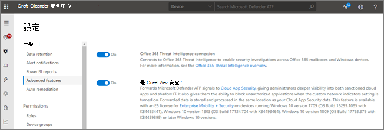

# 使用 Microsoft Defender 高級威脅防護整合 Office 365 高級威脅防護Integrate Office 365 Advanced Threat Protection with Microsoft Defender Advanced Threat Protection

[Office 365 Advanced 威脅防護](https://docs.microsoft.com/microsoft-365/security/office-365-security/office-365-atp?view=o365-worldwide)（OFFICE 365 ATP）可以設定為搭配[Microsoft Defender 高級威脅防護](https://docs.microsoft.com/windows/security/threat-protection)（Microsoft defender ATP）。[Office 365 Advanced Threat Protection](https://docs.microsoft.com/microsoft-365/security/office-365-security/office-365-atp?view=o365-worldwide) (Office 365 ATP) can be configured to work with [Microsoft Defender Advanced Threat Protection](https://docs.microsoft.com/windows/security/threat-protection) (Microsoft Defender ATP).

將 Office 365 ATP 與 Microsoft Defender ATP 整合，可協助您的安全性運作小組監視並快速採取行動（如果使用者的裝置面臨危險）。Integrating Office 365 ATP with Microsoft Defender ATP can help your security operations team monitor and take action quickly if users' devices are at risk. 例如，啟用整合後，您的安全性作業小組將能夠查看偵測到的電子郵件訊息可能影響的裝置，以及這些裝置在 Microsoft Defender ATP 中的最近通知數目。For example, once integration is enabled, your security operations team will be able to see the devices that are potentially affected by a detected email message, as well as how many recent alerts those devices have in Microsoft Defender ATP. 

下圖說明 [**裝置**] 索引標籤似乎已啟用 MICROSOFT Defender ATP 整合功能：The following image depicts what the **Devices** tab looks like have Microsoft Defender ATP integration enabled:
  

  
在此範例中，您可以看到偵測到之電子郵件的收件者有四個裝置，一個有警示。In this example, you can see that the recipients of the detected email message have four devices and one has an alert. 按一下裝置的連結會在 Microsoft Defender 安全中心（）中開啟其頁面 [https://securitycenter.windows.com](https://securitycenter.windows.com) 。Clicking the link for a device opens its page in the Microsoft Defender Security Center ([https://securitycenter.windows.com](https://securitycenter.windows.com)).

> [!TIP]
> **[深入瞭解 Microsoft Defender 安全中心](https://docs.microsoft.com/windows/security/threat-protection/microsoft-defender-atp/use)**（也稱為 MICROSOFT defender ATP 入口網站）。**[Learn more about the Microsoft Defender Security Center](https://docs.microsoft.com/windows/security/threat-protection/microsoft-defender-atp/use)** (also referred to as the Microsoft Defender ATP portal.)
  
## 需求Requirements

- 您的組織必須具有 Office 365 ATP Plan 2 （或 Office 365 E5）和 Microsoft Defender ATP。Your organization must have Office 365 ATP Plan 2 (or Office 365 E5) and Microsoft Defender ATP.
    
- 您必須是全域系統管理員，或具有安全性與[ &amp; 合規性中心](https://protection.office.com)中所指派的安全性系統管理員角色（例如安全性管理員）。You must be a global administrator or have a security administrator role (such as Security Administrator) assigned in the [Security &amp; Compliance Center](https://protection.office.com). （請參閱[安全性與 &amp; 合規性中心的許可權](permissions-in-the-security-and-compliance-center.md)）(See [Permissions in the Security &amp; Compliance Center](permissions-in-the-security-and-compliance-center.md))
    
- 您必須能夠在安全性 & 規範中心和 Microsoft Defender Security Center 中存取[瀏覽器（或即時偵測）](threat-explorer.md) 。You must have access to both [Explorer (or real-time detections)](threat-explorer.md) in the Security & Compliance Center and the Microsoft Defender Security Center.
    
## 將 Office 365 ATP 與 Microsoft Defender ATP 整合To integrate Office 365 ATP with Microsoft Defender ATP

使用安全性 & 規範中心和 Microsoft Defender 安全性中心，將 Office 365 ATP 整合至 Microsoft Defender ATP。Integrating Office 365 ATP with Microsoft Defender ATP is set up by using both the Security & Compliance Center AND the Microsoft Defender Security Center.
  
1. 以全域管理員或安全性管理員為單位，請移至 [https://protection.office.com](https://protection.office.com) 並登入。As a global administrator or a security administrator, go to [https://protection.office.com](https://protection.office.com) and sign in. （這會帶您前往 Office 365 的安全性 & 規範中心）。(This takes you to the Office 365 Security & Compliance Center.)
    
2. 在功能窗格中，選擇 [**威脅管理**  >  **瀏覽器**]。In the navigation pane, choose **Threat management** > **Explorer**.  
    
3. 在螢幕的右上角，選擇 [ **WDATP 設定**]。In the upper right corner of the screen, choose **WDATP Settings**.
    
4. 在 [Microsoft Defender ATP connection] 對話方塊中，開啟 **[連線到 WINDOWS ATP**]。In the Microsoft Defender ATP connection dialog box, turn on **Connect to Windows ATP**.  
    
5. 移至 Microsoft Defender 安全中心（ [https://securitycenter.windows.com](https://securitycenter.windows.com) ）。Go to the Microsoft Defender Security Center ([https://securitycenter.windows.com](https://securitycenter.windows.com)).

6. 在導覽列中，選擇 [**設定**]。In the navigation bar, choose **Settings**. 然後，在 **[一般**] 下，選擇 [**高級功能**]。Then, under **General**, choose **Advanced features**.

7. 向下滾動至**Office 365 威脅情報**連線，然後開啟連線。Scroll down to **Office 365 Threat Intelligence connection**, and turn the connection on.  

## 相關文章Related articles

[Office 365 中的威脅調查和回應功能Threat investigation and response capabilities in Office 365](office-365-ti.md)
  
[Office 365 進階威脅防護Office 365 Advanced Threat Protection](office-365-atp.md)
  
[Microsoft Defender ATPMicrosoft Defender ATP](https://docs.microsoft.com/windows/security/threat-protection)
