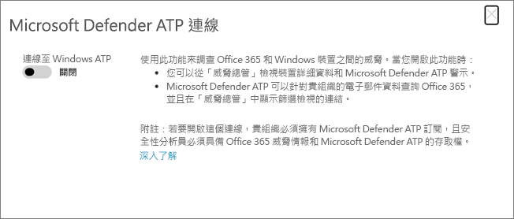

# 使用 Microsoft Defender 高級威脅防護整合 Office 365 高級威脅防護Integrate Office 365 Advanced Threat Protection with Microsoft Defender Advanced Threat Protection

如果您是組織的安全性小組的一部分，您可以使用[Microsoft Defender 高級威脅防護](https://docs.microsoft.com/windows/security/threat-protection/microsoft-defender-atp/microsoft-defender-advanced-threat-protection)來整合[Office 365 的高級威脅防護](office-365-atp.md)和相關的調查和回應功能。If you are part of your organization's security team, you can integrate [Office 365 Advanced Threat Protection](office-365-atp.md) and related investigation and response features with [Microsoft Defender Advanced Threat Protection](https://docs.microsoft.com/windows/security/threat-protection/microsoft-defender-atp/microsoft-defender-advanced-threat-protection). 這可協助您在調查 Office 365 中的威脅時，快速瞭解使用者的機器是否存在危險。This can help you quickly understand if users' machines are at risk when you are investigating threats in Office 365. 例如，啟用整合後，您將可以查看偵測到之電子郵件的收件者所使用的機器清單，以及這些電腦在 Microsoft Defender 高級威脅防護中的最近通知數目。For example, once integration is enabled, you will be able to see a list of machines that are used by the recipients of a detected email message, as well as how many recent alerts those machines have in Microsoft Defender Advanced Threat Protection.
  
下圖顯示您在啟用 Microsoft Defender ATP 整合時所看到的 [**裝置**] 索引標籤：The following image shows the **Devices** tab that you'll see when have Microsoft Defender ATP integration enabled:
  

  
在此範例中，您可以看到電子郵件的收件者有四個裝置，一個包含警示。In this example, you can see that the recipients of the email message have four devices and one has an alert. 按一下裝置的連結會在 Microsoft Defender 安全中心開啟其頁面。Clicking the link for a device opens its page in the Microsoft Defender Security Center.
  
## 需求Requirements

- 您的組織必須具有 Office 365 ATP Plan 2 （或 Office 365 E5）和 Microsoft Defender ATP。Your organization must have Office 365 ATP Plan 2 (or Office 365 E5) and Microsoft Defender ATP.
    
- 您必須是全域系統管理員，或具有安全性與[ &amp;合規性中心](https://protection.office.com)中所指派的安全性系統管理員角色（例如安全性管理員）。You must be a global administrator or have a security administrator role (such as Security Administrator) assigned in the [Security &amp; Compliance Center](https://protection.office.com). （請參閱[安全性&amp;與合規性中心的許可權](permissions-in-the-security-and-compliance-center.md)）(See [Permissions in the Security &amp; Compliance Center](permissions-in-the-security-and-compliance-center.md))
    
- 您必須能夠在安全性 & 規範中心和 Microsoft Defender Security Center 中存取[瀏覽器（或即時偵測）](threat-explorer.md) 。You must have access to both [Explorer (or real-time detections)](threat-explorer.md) in the Security & Compliance Center and the Microsoft Defender Security Center.
    
## 將 Office 365 ATP 與 Microsoft Defender ATP 整合To integrate Office 365 ATP with Microsoft Defender ATP

使用安全性 & 規範中心和 Microsoft Defender 安全性中心，將 Office 365 ATP 整合至 Microsoft Defender ATP。Integrating Office 365 ATP with Microsoft Defender ATP is set up by using both the Security & Compliance Center AND the Microsoft Defender Security Center.
  
1. 以全域管理員或安全性管理員的身分，移至[https://protection.office.com](https://protection.office.com)並登入您的公司或學校帳戶。As a global administrator or a security administrator, go to [https://protection.office.com](https://protection.office.com) and sign in with your work or school account.
    
2. 選擇 [**威脅管理** \> **瀏覽器**]。Choose **Threat management** \> **Explorer**.  
    
3. 在螢幕的右上角，選擇 [ **WDATP 設定**]。In the upper right corner of the screen, choose **WDATP Settings**.
    
4. 在 [Microsoft Defender ATP connection] 對話方塊中，開啟 **[連線到 WINDOWS ATP**]。In the Microsoft Defender ATP connection dialog box, turn on **Connect to Windows ATP**.  
    
5. 啟用 Microsoft Defender Security Center 中的連線（[https://securitycenter.windows.com](https://securitycenter.windows.com)）。Enable the connection in the Microsoft Defender Security Center ([https://securitycenter.windows.com](https://securitycenter.windows.com)).

## 相關主題Related topics

[Office 365 中的威脅調查和回應功能Threat investigation and response capabilities in Office 365](office-365-ti.md)
  
[Office 365 進階威脅防護Office 365 Advanced Threat Protection](office-365-atp.md)
  

