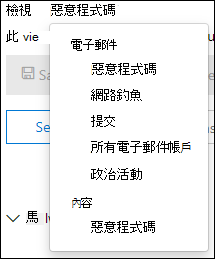
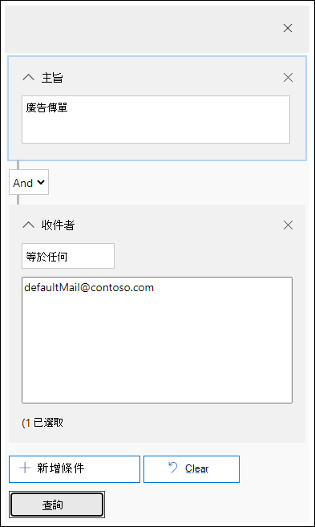

# 調查並修復 Office 365 中傳遞的惡意電子郵件

[Office 365 的「高級威脅防護](office-365-atp.md)」可讓您調查讓組織中的人員面臨風險的活動，並採取行動以保護您的組織。 例如，如果您是組織的安全性小組的一部分，您可以找出並調查已傳遞的可疑電子郵件訊息。 您可以使用[威脅瀏覽器（或即時偵測）](threat-explorer.md)來執行此動作。
  
## 開始之前...

請確定符合下列需求：
  
- 您的組織已將[Office 365 高級威脅防護](office-365-atp.md)和[授權指派給使用者](../../admin/manage/assign-licenses-to-users.md)。
    
- 您的組織已開啟[Office 365 審核記錄](../../compliance/turn-audit-log-search-on-or-off.md)。 
    
- 您的組織有為反垃圾郵件、反惡意程式碼、反網路釣魚等定義的原則。 請參閱[防禦 Office 365 中的威脅](protect-against-threats.md)。
    
- 您是 Office 365 全域系統管理員，或您已在安全性&amp;與合規性中心內指派安全性管理員或搜尋和清除角色。 請參閱[Office 365 安全性&amp;與合規性中心的許可權](permissions-in-the-security-and-compliance-center.md)。 在某些動作中，您也必須已指派新的預覽角色。 

#### 預覽角色許可權

若要執行某些動作（例如，查看郵件頭或下載電子郵件內容），您必須要有一個名為*Preview*的新角色，以新增至另一個適當的 Office 365 角色群組。 下表說明必要的角色和許可權。

|活動  |角色群組 |需要預覽角色？  |
|---------|---------|---------|
|使用威脅瀏覽器（和即時偵測）來分析威脅     |Office 365 全域管理員   安全性系統管理員   安全性讀取者     | 否   |
|使用威脅瀏覽器（和即時偵測）來查看電子郵件訊息的標題，以及預覽及下載隔離的電子郵件    |Office 365 全域管理員   安全性系統管理員  安全性讀取者   |       否  |
|使用威脅瀏覽器來查看標頭，並下載傳送至信箱的電子郵件     |Office 365 全域管理員  安全性系統管理員   安全性讀取者   預覽   |   是      |

> [!NOTE]
> *Preview*是角色，不是角色群組;預覽角色必須新增至 Office 365 的現有角色群組。 Office 365 全域系統管理員角色會指派給 Microsoft 365 系統管理中心（[https://admin.microsoft.com](https://admin.microsoft.com)），而且安全性管理員和安全性讀取者角色會指派于 Office 365 安全性 & 規範中心（[https://protection.office.com](https://protection.office.com)）。 若要深入瞭解角色和許可權，請參閱[Office 365 Security & 合規性中心的許可權](permissions-in-the-security-and-compliance-center.md)。

## 尋找和刪除已傳遞的可疑電子郵件

威脅瀏覽器是一種強大的報表，可用於多種用途，例如尋找和刪除郵件、識別惡意電子郵件寄件者的 IP 位址，或啟動事件以進一步進行調查。 下列程式著重于使用 Explorer 尋找及刪除收件者信箱中的惡意電子郵件。

> [!NOTE]
> 瀏覽器中的預設搜尋目前不包含 Zapped 的專案。  這適用于所有的視圖，例如惡意程式碼或網路釣魚視圖。 若要包含 Zapped 的專案，您需要將 ' 傳遞動作 ' 設定為包含「包含」（由 ZAP 移除）。 如果您包括所有選項，您會看到所有傳遞動作結果，包括 Zapped 專案。

1. **流覽至威脅瀏覽器**：移[https://protection.office.com](https://protection.office.com)至並使用您的 Office 365 的公司或學校帳戶登入。 這會帶您前往安全性&amp;與合規性中心。

2. 在 [左導覽快速啟動] 中，選擇 [**威脅管理** \> **瀏覽器**]。

    ![使用 [傳遞動作] 和 [傳遞位置] 欄位的 Explorer。](../../media/ThreatExFields.PNG)

    <!-- You may notice the new **Special actions** column. This feature is aimed at telling admins the outcome of processing an email. The **Special actions** column can be accessed in the same place as **Delivery action** and **Delivery location**. Special actions might be updated at the end of Threat Explorer's email timeline, which is a new feature aimed at making the hunting experience better for admins.-->

3. **威脅瀏覽器中的視圖**：在 [**視圖**] 功能表中，選擇 [**所有電子郵件**]。

    

    *惡意*代碼視圖目前是預設值，會捕獲偵測到惡意軟體威脅的電子郵件。 *網路釣魚*視圖的運作方式與網路釣魚。

    不過，*所有的電子郵件 View 都會*列出組織收到的每封郵件，是否偵測到威脅。 您可以想像，這是許多資料，這就是為什麼此視圖會顯示要求套用篩選的預留位置。 （此視圖只適用于 ATP P2 客戶。）

    「*提交*」視圖會顯示系統管理員或使用者向 Microsoft 提交的所有郵件。

4. **威脅瀏覽器中的搜尋和篩選**：篩選顯示在搜尋列的頁面頂端，以協助系統管理員進行調查。 請注意，可以同時套用多個篩選，並新增多個逗號分隔值，以縮小搜尋範圍。 記得：
    - 篩選器對大多數篩選準則完全符合。
    - 主體篩選使用包含查詢。
    - URL 篩選器使用或不使用通訊協定（ex）。 HTTPs）。
    - URL 網域、URL 路徑及 URL 網域和路徑篩選器不需要使用通訊協定。
    - 每次變更篩選值以取得相關結果時，您必須按一下 [重新整理] 圖示。

5. **高級篩選**：使用這些篩選器，您可以建立複雜的查詢並篩選您的資料集。 按一下 [*高級篩選*] 開啟具有選項的浮出控制項。

   「高級篩選 ' 是搜尋功能的極佳補充。 在*收*件者、*寄件者*和*寄件者網域*上，已引進 boolean**非**篩選，以允許系統管理員透過排除值來調查。 此選項會出現在 [選取參數不*包含任何*] 底下。 **不**會讓系統管理員從其調查中排除警示信箱、預設回復信箱，而且可用於系統管理員搜尋特定主旨（subject = 「注意」）的情況，在此情況下，收件者可將收件者設定為*無 defaultMail@contoso.com*。 這是實際值搜尋。

   

   *依小時篩選*可協助貴組織的安全性小組快速深入。 允許的最短時間為30分鐘。 如果您可以將可疑的動作縮小為時間範圍（例如，發生3小時之前），則會限制內容並協助找出問題。

  ![[依小時篩選] 選項，以縮小必須處理的資料安全小組數量，而且其最短工期為30分鐘。](../../media/tp-InvestigateMalEmail-FilterbyHours.png)

6. **威脅瀏覽器中的欄位**：威脅瀏覽器會公開許多安全性相關郵件資訊，*例如傳遞動作*、*傳遞位置*、*特殊動作*、*方向*性、*覆寫*及*URL 威脅*。 它也可讓您的組織的安全性小組以更高的確定性進行調查。 

    *傳遞動作*是由於現有的原則或偵測，而對電子郵件採取的動作。 以下是電子郵件可能採取的動作：
    - **傳遞**-電子郵件已傳遞至使用者的收件匣或資料夾，而且使用者可以直接存取。
    - **Junked** （已傳遞至垃圾）–將電子郵件傳送至使用者的垃圾郵件資料夾或已刪除的資料夾，而且使用者可以存取垃圾郵件或已刪除的資料夾中的電子郵件。
    - **封鎖**–隔離、失敗或丟棄的任何電子郵件訊息。 （這是使用者完全無法存取的）。
    - **已取代**所有惡意附件取代為附件惡意的 .txt 檔案所取代的電子郵件

    **傳遞位置**：可用的傳遞位置篩選器，可協助系統管理員瞭解可疑的惡意郵件如何結束，以及對它採取的動作。 產生的資料可匯出至試算表。 可能的傳遞位置如下：
    - **收件匣或資料夾**–電子郵件會根據您的電子郵件規則，在收件匣或特定資料夾中。
    - **部署或外部**–信箱不存在於雲端中，但為內部部署。
    - [垃圾郵件]**資料夾**–電子郵件位於使用者的 [垃圾郵件] 資料夾中。
    - [**刪除的郵件] 資料夾**-電子郵件是在使用者的 [刪除的郵件] 資料夾中。
    - **隔離**–隔離區中的電子郵件，而不是使用者信箱中的電子郵件。
    - **Failed** -電子郵件無法送達信箱。
    - 已**丟棄**-電子郵件已遺失于郵件流程中的某處。

    **方向**性：此選項可讓您的安全性作業小組以郵件來自的「方向」來篩選，或前往。 方向性值為*輸入*、*輸出*和*組織內*（對應至您的組織外部、即將寄出給您的組織的郵件，或分別在內部傳送給您的組織）。 此資訊可協助安全性運作小組發現欺騙和模擬，因為方向性值（ex）之間不相符。 *輸入*），且寄件者的網域 *（可能是*內部網域）很明顯！ 方向性值是分開的，而且可以與郵件追蹤有所不同。 結果可以匯出至試算表。

    **覆寫**：此篩選器會取得出現在 [郵件詳細資料] 索引標籤上的資訊，並使用它來公開允許和封鎖郵件已覆*寫*的組織或使用者原則。 此篩選器最重要的一點是它可協助貴組織的安全性小組查看因設定而傳遞的可疑電子郵件數目。 這讓他們有機會視需要修改允許和封鎖。 這個篩選的結果集可以匯出至試算表。

|威脅瀏覽器覆寫  | 其含義  |
|---------|---------|
|組織原則允許     |   郵件是透過組織原則所導向的信箱。       |
|由組織原則封鎖      |  郵件已封鎖為由組織原則所導向的方式傳遞到信箱。    |
|組織原則封鎖的檔擴充     | 從組織原則的導向中，File 遭到封鎖，無法傳遞至信箱。        |
|使用者原則所允許     | 信箱是使用者原則所導向的信箱。        |
|使用者原則封鎖     | 郵件已封鎖由使用者原則所導向的方式傳遞到信箱。        |

**Url 威脅**： [url 威脅] 欄位已包含在電子郵件的 [*詳細資料*] 索引標籤中，指出 URL 所呈現的威脅。 URL 所呈現的威脅可以包含*惡意*代碼、*網路釣魚*或*垃圾郵件*，而*不具威脅*的 url 會在 [威脅] 區段中指出*無*威脅。

7. **電子郵件時程表視圖**：您的安全作業小組可能需要深入瞭解電子郵件詳細資料，以進行進一步調查。 電子郵件時程表可讓系統管理員將電子郵件所採取的動作從傳遞傳遞至傳遞投遞。 若要查看電子郵件時程表，請按一下電子郵件的主旨，然後按一下 [電子郵件時程表]。 （它會顯示在面板上的其他標題，如摘要或詳細資料）。這些結果可以匯出至試算表。

    電子郵件時程表會開啟一個表格，顯示電子郵件的所有傳遞和傳遞後事件。 如果電子郵件上沒有進一步的動作，您應該會看到原始傳遞的單一事件，其狀態為「類似*網路釣魚*」的結果（如*封鎖*）。 系統管理員可以匯出整個電子郵件時程表，包含索引標籤上的所有詳細資料，以及電子郵件（如主旨、寄件者、收件者、網路及郵件識別碼）。 電子郵件時程表會在隨機進行分解，因為檢查不同位置所花費的時間較少，以嘗試瞭解自電子郵件到達後發生的事件。 當電子郵件上發生多個事件，或在電子郵件上接近時，這些事件會顯示在時程表視圖中。

8. **預覽/下載**：威脅瀏覽器可讓您的安全性運作小組提供調查可疑電子郵件所需的詳細資料。 您的安全性作業小組可以：

    - [檢查傳遞動作和位置](#check-the-delivery-action-and-location)。

    - [查看您電子郵件的時程表](#view-the-timeline-of-your-email)。

    ##### 檢查傳遞動作和位置

    在[[威脅瀏覽器] （和即時偵測）](threat-explorer.md)中，您現在具有 [**傳遞動作**] 和 [**傳遞位置**] 欄，而不是先前傳遞的 [**狀態**] 欄。 這會使您的電子郵件成為土地的更完整的畫面。 此變更的一部分目標是讓調查更容易進行安全作業小組，但 net 結果是知道問題電子郵件訊息的位置。

    傳遞狀態現在劃分為兩個資料行：

    - **傳遞動作**-此電子郵件的狀態為何？

    - **傳遞位置**-這封電子郵件會以結果的方式路由傳送？

    傳遞動作是由於現有的原則或偵測，而對電子郵件採取的動作。 以下是電子郵件可能採取的動作：

    - **傳遞**-電子郵件已傳遞至使用者的收件匣或資料夾，而且使用者可以直接存取。

    - **Junked** –將電子郵件傳送至使用者的垃圾郵件資料夾或已刪除的資料夾，而且使用者可以存取垃圾郵件或已刪除的資料夾中的電子郵件。

    - **封鎖**–隔離、失敗或丟棄的任何電子郵件訊息。 （這是使用者完全無法存取的）。

    - **已取代**所有惡意附件取代為附件惡意的 .txt 檔的電子郵件。
 
    傳遞位置顯示原則和執行傳遞後偵測的結果。 其連結到「傳遞動作」。 已新增此欄位，以深入了解找到問題電子郵件時所採取的動作。 以下是傳遞位置可能的值：

    - **收件匣或資料夾**–電子郵件是在收件匣或資料夾中（根據您的電子郵件規則）。

    - **部署或外部**–信箱不存在於雲端上，但為內部部署。

    - [垃圾郵件]**資料夾**–電子郵件位於使用者的 [垃圾郵件] 資料夾中。

    - [**刪除的郵件] 資料夾**-電子郵件是在使用者的 [刪除的郵件] 資料夾中。

    - **隔離**–隔離區中的電子郵件，而不是使用者信箱中的電子郵件。

    - **Failed** -電子郵件無法送達信箱。

    - **丟**入–電子郵件會在郵件流程中遺失。

     ##### 查看您電子郵件的時程表
  
     **電子郵件時程表**是威脅瀏覽器中的欄位，可讓您的安全性運作小組更輕鬆進行搜尋。 當電子郵件上發生多個事件或在同一時間關閉時，這些事件會顯示在時程表視圖中。 某些會在 [**特殊動作**] 欄中捕獲傳送投遞至電子郵件的事件。 結合電子郵件的時程表中的資訊，可讓系統管理員深入瞭解原則和威脅處理（例如郵件路由傳送的位置，以及在某些情況下，最後評估的情況）。

<!-- Reference material

1. **Navigate to Threat Explorer**: Go to [https://protection.office.com](https://protection.office.com) and sign in using your work or school account for Office 365. This takes you to the Security &amp; Compliance Center. 

2. In the left navigation quick-launch, choose **Threat management** \> **Explorer**.

3. Click on the subject of an email message, and then click **Email timeline**. (It appears among other headings on the panel like **Summary** or **Details**.)

    Once you've opened the email timeline, you should see a table that tells you the post-delivery events for that mail. In the case of no further events for the email, you should see a single event for the original delivery that states a result like **Blocked** with a verdict like **Phish**. The tab also has the option to export the entire email timeline, and this exports all the details on the tab and details on the email (things like Subject, Sender, Recipient, Network, and Message ID).

    The email timeline cuts down on randomization because there is less time spent checking different locations to try to understand events that happened since the email arrived. When multiple events happen at, or close to, the same time on an email, those events show up in a timeline view. 
    
    Some events that happen post-delivery to your mail are captured in the **Special actions** column. Combining the information from the email timeline along with special actions taken on email post-delivery gives admins insight into how their policies work, where the email was finally routed, and, in some cases, what the final assessment was. 

4. In the **View** menu, choose **All email**.

    
  
    Notice the labels that appear in the report, such as **Delivered**, **Unknown**, or **Delivered to junk**.

    
    
    (Depending on the actions that were taken on email messages for your organization, you might see other labels, such as **Blocked** or **Replaced**.)
    
5. In the report, choose **Delivered** to view only email messages that ended up in users' inboxes.

    
  
6. Below the chart, review the **Email** list below the chart.

    
  
7. In the list, choose an item to view more details about that email message. For example, you can click the subject line to view information about the sender, recipients, attachments, and other similar email messages.

    
  
8. After viewing information about email messages, select one or more items in the list to activate **+ Actions**.
    
9. Use the **+ Actions** list to apply an action, such as **Move to deleted** items. This deletes the selected messages from the recipients' mailboxes.

    

## Dealing with suspicious email messages

Malicious attackers might be sending mail to people in your organization in an attempt to phish their credentials and gain access to your corporate secrets. To help prevent this, you use the threat protection services in Office 365, including [Exchange Online Protection](exchange-online-protection-overview.md) and [Advanced Threat Protection](office-365-atp.md). However, it occasionally happens that an attacker sends email that contains a link (URL) that only later points to malicious content (such as malware). Or, you might realize too late that someone in your organization has been compromised, and while they were compromised, an attacker used their account to send email to other people in your organization. As part of dealing with either of these scenarios, you can remove suspicious email messages from user inboxes. To do that, you can use [Threat Explorer](threat-explorer.md).

## Finding re-routed email messages after actions are taken

Threat Explorer provides your security operations team with the details they need to investigate suspicious email. Your security operations team can:

- [View the email headers and download the email body](#view-the-email-headers-and-download-the-email-body) 

- [Check the delivery action and location](#check-the-delivery-action-and-location)

- [View the timeline of your email](#view-the-timeline-of-your-email)

### View the email headers and download the email body

The ability to preview email headers and download the body of an email body are powerful capabilities in Threat Explorer. Appropriate [permissions](permissions-in-the-security-and-compliance-center.md) must be assigned. See [Preview role permissions](#preview-role-permissions).

To access your message header and email download options, follow these steps: 

1. Go to [https://protection.office.com](https://protection.office.com) and sign in using your work or school account for Office 365. This takes you to the Security &amp; Compliance Center. 
    
2. In the left navigation, choose **Threat management** \> **Explorer**.

3. Click on a subject in the Threat Explorer table. 

    This opens the flyout, where both header preview and email download links are positioned.

    

> [!IMPORTANT]
> This capability doesn't show up for email messages that were never found in a user's mailbox, which can happen if an email was dropped or its delivery failed. In cases where email messages were deleted from users' mailboxes, admins see a "Mail not found" error message.
-->

## 相關主題

[Office 365 進階威脅防護](office-365-ti.md)
  
[保護 Office 365 中的威脅](protect-against-threats.md)
  
[檢視 Office 365 進階威脅防護的報告](view-reports-for-atp.md)
