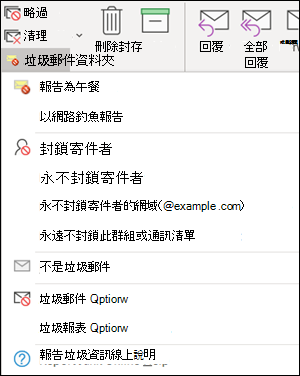

# <a name="install-and-use-the-junk-email-reporting-add-in-for-microsoft-outlook"></a><span data-ttu-id="6c4fe-103">安裝和使用 Microsoft Outlook 的垃圾郵件回報增益集</span><span class="sxs-lookup"><span data-stu-id="6c4fe-103">Install and use the Junk Email Reporting add-in for Microsoft Outlook</span></span>

[!INCLUDE [Microsoft 365 Defender rebranding](../includes/microsoft-defender-for-office.md)]

<span data-ttu-id="6c4fe-104">**適用於**</span><span class="sxs-lookup"><span data-stu-id="6c4fe-104">**Applies to**</span></span>
- [<span data-ttu-id="6c4fe-105">Exchange Online Protection</span><span class="sxs-lookup"><span data-stu-id="6c4fe-105">Exchange Online Protection</span></span>](exchange-online-protection-overview.md)
- [<span data-ttu-id="6c4fe-106">適用於 Office 365 的 Microsoft Defender 方案 1 和方案 2</span><span class="sxs-lookup"><span data-stu-id="6c4fe-106">Microsoft Defender for Office 365 plan 1 and plan 2</span></span>](office-365-atp.md)
- [<span data-ttu-id="6c4fe-107">Microsoft 365 Defender</span><span class="sxs-lookup"><span data-stu-id="6c4fe-107">Microsoft 365 Defender</span></span>](../mtp/microsoft-threat-protection.md)

> [!NOTE]
> <span data-ttu-id="6c4fe-108">如果您目前並未使用垃圾郵件回報增益集，建議您改為 [報告訊息載入](enable-the-report-message-add-in.md) 宏或 [報告網路釣魚增益集](enable-the-report-phish-add-in.md) 。</span><span class="sxs-lookup"><span data-stu-id="6c4fe-108">If you aren't currently using the Junk E-mail Reporting add-in, we recommend the [Report Message add-in](enable-the-report-message-add-in.md) or the [Report Phishing add-in](enable-the-report-phish-add-in.md) instead.</span></span> <span data-ttu-id="6c4fe-109">如需詳細資訊，請參閱[回報訊息和檔案至 Microsoft](report-junk-email-messages-to-microsoft.md)。</span><span class="sxs-lookup"><span data-stu-id="6c4fe-109">For more information, see [Report messages and files to Microsoft](report-junk-email-messages-to-microsoft.md).</span></span>

<span data-ttu-id="6c4fe-110">Microsoft Outlook 的垃圾郵件回報增益集可讓使用者提交誤報為垃圾郵件的誤報 (已標示為垃圾郵件) 、false 負片 (錯誤電子郵件允許) 和網路釣魚郵件。</span><span class="sxs-lookup"><span data-stu-id="6c4fe-110">The Junk Email Reporting Add-in for Microsoft Outlook allows users to submit false positives (good email marked as spam), false negatives (bad email allowed) and phishing messages to Microsoft.</span></span> <span data-ttu-id="6c4fe-111">如果您的組織未使用 Exchange Online Protection (例如，內部部署 Exchange 或電子郵件服務（Exchange Online) 以外），則您的垃圾郵件報告提交不會影響您的垃圾郵件篩選。</span><span class="sxs-lookup"><span data-stu-id="6c4fe-111">If your organization doesn't use Exchange Online Protection (for example, on-premises Exchange or email services other than Exchange Online), your junk email report submission will not affect your spam filtering.</span></span>

<span data-ttu-id="6c4fe-112">本主題說明如何安裝和使用垃圾郵件回報增益集。</span><span class="sxs-lookup"><span data-stu-id="6c4fe-112">This topic explains how to install and use the Junk Email Reporting add-in.</span></span>

## <a name="what-do-you-need-to-know-before-you-begin"></a><span data-ttu-id="6c4fe-113">開始之前有哪些須知？</span><span class="sxs-lookup"><span data-stu-id="6c4fe-113">What do you need to know before you begin?</span></span>

- <span data-ttu-id="6c4fe-114">若要安裝垃圾郵件回報增益集，請參閱本文稍後的 [安裝垃圾郵件回報增益集](#install-the-junk-email-reporting-add-in) 一節。</span><span class="sxs-lookup"><span data-stu-id="6c4fe-114">To install the Junk Email Reporting add-in, see the [Install the Junk Email Reporting add-in](#install-the-junk-email-reporting-add-in) section later in this article.</span></span>

- <span data-ttu-id="6c4fe-115">垃圾郵件回報增益集可與下列 Outlook 版本搭配使用：</span><span class="sxs-lookup"><span data-stu-id="6c4fe-115">The Junk Email Reporting add-in works with the following versions of Outlook:</span></span>

  - <span data-ttu-id="6c4fe-116">Outlook 2013 或更新版本</span><span class="sxs-lookup"><span data-stu-id="6c4fe-116">Outlook 2013 or later</span></span>
  - <span data-ttu-id="6c4fe-117">Outlook 隨附于適用于企業的 Microsoft 365 應用程式</span><span class="sxs-lookup"><span data-stu-id="6c4fe-117">Outlook included with Microsoft 365 Apps for enterprise</span></span>

- <span data-ttu-id="6c4fe-118">如需將郵件報告給 Microsoft 的詳細資訊，請參閱 [將郵件和檔案報告給 microsoft](report-junk-email-messages-to-microsoft.md)。</span><span class="sxs-lookup"><span data-stu-id="6c4fe-118">For more information about reporting messages to Microsoft, see [Report messages and files to Microsoft](report-junk-email-messages-to-microsoft.md).</span></span>

## <a name="use-the-junk-email-reporting-add-in-to-report-spam-and-phishing-messages"></a><span data-ttu-id="6c4fe-119">使用垃圾郵件回報增益集來報告垃圾郵件和網路釣魚郵件</span><span class="sxs-lookup"><span data-stu-id="6c4fe-119">Use the Junk Email Reporting add-in to report spam and phishing messages</span></span>

1. <span data-ttu-id="6c4fe-120">對於收件匣或任何其他電子郵件資料夾（除了垃圾郵件）以外的郵件，請使用下列任何一種方法來報告垃圾郵件和網路釣魚郵件：</span><span class="sxs-lookup"><span data-stu-id="6c4fe-120">For messages in the Inbox or any other email folder except Junk Email, use any of the following methods to report spam and phishing messages:</span></span>

   - <span data-ttu-id="6c4fe-121">選取郵件或開啟郵件。</span><span class="sxs-lookup"><span data-stu-id="6c4fe-121">Select the message or open the message.</span></span> <span data-ttu-id="6c4fe-122">在功能區的 [**首頁**] 或 [**訊息**] 索引標籤中，按一下 [**垃圾郵件**]，然後選取 [**報告為垃圾郵件**] 或 [**報表為網路**</span><span class="sxs-lookup"><span data-stu-id="6c4fe-122">In the **Home** or **Message** tab in the ribbon, click **Junk**, and then select **Report as Junk** or **Report as Phishing**.</span></span>

     

   - <span data-ttu-id="6c4fe-124">在郵件上按一下滑鼠右鍵，選取 [ **垃圾** 郵件]，然後選取 [ **報告為垃圾** 郵件] 或 [ **報表為網路釣魚**]。</span><span class="sxs-lookup"><span data-stu-id="6c4fe-124">Right-click on the message, select **Junk**, and then select **Report as Junk** or **Report as Phishing**.</span></span>

     

   - <span data-ttu-id="6c4fe-126">選取多封郵件，以滑鼠右鍵按一下，然後選取 [ **報告為垃圾** 郵件] 或 [ **報表為網路釣魚**]。</span><span class="sxs-lookup"><span data-stu-id="6c4fe-126">Select multiple messages, right-click, and then select **Report as Junk** or **Report as Phishing**.</span></span>

     

2. <span data-ttu-id="6c4fe-128">在出現的對話方塊中，閱讀資訊，然後按一下 [ **報告**]。</span><span class="sxs-lookup"><span data-stu-id="6c4fe-128">In the dialog that appears, read the information and click **Report**.</span></span> <span data-ttu-id="6c4fe-129">如果您變更主意，請按一下 [ **不報告**]。</span><span class="sxs-lookup"><span data-stu-id="6c4fe-129">If you change your mind, click **Don't Report**.</span></span>

   

   

3. <span data-ttu-id="6c4fe-132">選取的郵件會傳送至 Microsoft 進行分析，並：</span><span class="sxs-lookup"><span data-stu-id="6c4fe-132">The selected messages will be sent to Microsoft for analysis and:</span></span>

   - <span data-ttu-id="6c4fe-133">移至 [垃圾郵件] 資料夾（如果已舉報為垃圾郵件）。</span><span class="sxs-lookup"><span data-stu-id="6c4fe-133">Moved to the Junk Email folder if it was reported as spam.</span></span>
   - <span data-ttu-id="6c4fe-134">已刪除，如果已報告為網路釣魚。</span><span class="sxs-lookup"><span data-stu-id="6c4fe-134">Deleted if it was reported as phishing.</span></span>

   <span data-ttu-id="6c4fe-135">若要確認郵件已提交，請開啟 **[寄件備份]** 資料夾，以檢視已提交的郵件。</span><span class="sxs-lookup"><span data-stu-id="6c4fe-135">To confirm that the messages have been submitted, open your **Sent Items** folder to view the submitted messages.</span></span>

## <a name="use-the-junk-email-reporting-add-in-to-report-non-spam-and-phishing-messages-from-the-junk-email-folder"></a><span data-ttu-id="6c4fe-136">使用垃圾郵件回報增益集來報告垃圾郵件資料夾中的非垃圾郵件和網路釣魚郵件</span><span class="sxs-lookup"><span data-stu-id="6c4fe-136">Use the Junk Email Reporting add-in to report non-spam and phishing messages from the Junk Email folder</span></span>

1. <span data-ttu-id="6c4fe-137">在 [垃圾郵件] 資料夾中，使用下列任何一種方法來報告垃圾郵件誤報或網路釣魚郵件：</span><span class="sxs-lookup"><span data-stu-id="6c4fe-137">In the Junk Email folder, use any of the following methods to report spam false positives or phishing messages:</span></span>

   - <span data-ttu-id="6c4fe-138">選取郵件或開啟郵件。</span><span class="sxs-lookup"><span data-stu-id="6c4fe-138">Select the message or open the message.</span></span> <span data-ttu-id="6c4fe-139">在功能區的 [**首頁**] 或 [**訊息**] 索引標籤中，按一下 [**非垃圾郵件**]，然後選取 [**報告為非垃圾郵件**] 或 [**報表為網路**</span><span class="sxs-lookup"><span data-stu-id="6c4fe-139">In the **Home** or **Message** tab in the ribbon, click **Not Junk**, and then select **Report as Not Junk** or **Report as Phishing**.</span></span>

     ![從 [垃圾郵件] 資料夾中的功能區報告不是垃圾郵件或網路釣魚電子郵件](../../media/junk-email-reporting-junk-folder-ribbon.png)

   - <span data-ttu-id="6c4fe-141">在郵件上按一下滑鼠右鍵，按一下 [ **垃圾** 郵件]，然後選取 [ **報告為非垃圾郵件** ] 或 [ **報表為網路釣魚**]。</span><span class="sxs-lookup"><span data-stu-id="6c4fe-141">Right-click on the message, click **Junk**, and then select **Report as Not Junk** or **Report as Phishing**.</span></span>

     ![在 [垃圾郵件] 資料夾中，以滑鼠右鍵按一下不報告垃圾郵件或網路釣魚電子郵件](../../media/junk-email-reporting-junk-folder-right-click.png)

   - <span data-ttu-id="6c4fe-143">選取多封郵件，以滑鼠右鍵按一下，然後選取 [ **報告為非垃圾郵件** ] 或 [ **報表為網路釣魚**]。</span><span class="sxs-lookup"><span data-stu-id="6c4fe-143">Select multiple messages, right-click, and then select **Report as Not Junk** or **Report as Phishing**.</span></span>

     ![在 [垃圾郵件] 資料夾中，以滑鼠右鍵按一下不限垃圾郵件或網路釣魚電子郵件](../../media/junk-email-reporting-junk-folder-right-click-multiple.png)

2. <span data-ttu-id="6c4fe-145">在出現的對話方塊中，閱讀資訊，然後按一下 [ **報告**]。</span><span class="sxs-lookup"><span data-stu-id="6c4fe-145">In the dialog that appears, read the information and click **Report**.</span></span> <span data-ttu-id="6c4fe-146">如果您變更主意，請按一下 [ **不報告**]。</span><span class="sxs-lookup"><span data-stu-id="6c4fe-146">If you change your mind, click **Don't Report**.</span></span>

   ![[報告為非垃圾郵件] 對話方塊](../../media/junk-email-reporting-report-as-not-junk-dialog.png)

   

3. <span data-ttu-id="6c4fe-149">選取的郵件會傳送至 Microsoft 進行分析，並：</span><span class="sxs-lookup"><span data-stu-id="6c4fe-149">The selected messages will be sent to Microsoft for analysis and:</span></span>

   - <span data-ttu-id="6c4fe-150">移至 [垃圾郵件] 資料夾（如果已舉報為垃圾郵件）。</span><span class="sxs-lookup"><span data-stu-id="6c4fe-150">Moved to the Junk Email folder if it was reported as spam.</span></span>
   - <span data-ttu-id="6c4fe-151">已刪除，如果已報告為網路釣魚。</span><span class="sxs-lookup"><span data-stu-id="6c4fe-151">Deleted if it was reported as phishing.</span></span>

   <span data-ttu-id="6c4fe-152">若要確認郵件已提交，請開啟 **[寄件備份]** 資料夾，以檢視已提交的郵件。</span><span class="sxs-lookup"><span data-stu-id="6c4fe-152">To confirm that the messages have been submitted, open your **Sent Items** folder to view the submitted messages.</span></span>

## <a name="install-the-junk-email-reporting-add-in"></a><span data-ttu-id="6c4fe-153">安裝垃圾郵件回報增益集</span><span class="sxs-lookup"><span data-stu-id="6c4fe-153">Install the Junk Email Reporting add-in</span></span>

- <span data-ttu-id="6c4fe-154">您必須具備安裝增益集之電腦的系統管理員許可權。</span><span class="sxs-lookup"><span data-stu-id="6c4fe-154">You need to have administrator privileges on the computer where you're installing the add-in.</span></span>

- <span data-ttu-id="6c4fe-155">移至 <https://www.microsoft.com/download/details.aspx?id=18275> 並下載適用于您的 Office 版本的 .msi 檔案，以供您尋找的位置：</span><span class="sxs-lookup"><span data-stu-id="6c4fe-155">Go to <https://www.microsoft.com/download/details.aspx?id=18275> and download the appropriate .msi file for your version of Office to a location that's easy to find:</span></span>

  - <span data-ttu-id="6c4fe-156">**32** 位： `Junk Reporting Add-in for Office 2007, 2010, 2013, and 2016 (32-bit).msi`</span><span class="sxs-lookup"><span data-stu-id="6c4fe-156">**32-bit**: `Junk Reporting Add-in for Office 2007, 2010, 2013, and 2016 (32-bit).msi`</span></span>
  - <span data-ttu-id="6c4fe-157">**64** 位： `Junk Reporting Add-in for Office 2007, 2010, 2013, and 2016 (64-bit).msi`</span><span class="sxs-lookup"><span data-stu-id="6c4fe-157">**64-bit**: `Junk Reporting Add-in for Office 2007, 2010, 2013, and 2016 (64-bit).msi`</span></span>

- <span data-ttu-id="6c4fe-158">針對 Outlook 2013 或更新版本，唯一的必要條件是 Microsoft .NET Framework 2.0。</span><span class="sxs-lookup"><span data-stu-id="6c4fe-158">For Outlook 2013 or later, the only prerequisite is the Microsoft .NET Framework 2.0.</span></span> <span data-ttu-id="6c4fe-159">在 Windows 10 中，您不會從下載安裝 .NET Framework 2.0。</span><span class="sxs-lookup"><span data-stu-id="6c4fe-159">In Windows 10, you don't install the .NET Framework 2.0 from a download.</span></span>

### <a name="install-the-junk-email-reporting-add-in-using-the-setup-wizard"></a><span data-ttu-id="6c4fe-160">使用安裝精靈安裝垃圾郵件回報增益集</span><span class="sxs-lookup"><span data-stu-id="6c4fe-160">Install the Junk Email Reporting Add-in using the Setup wizard</span></span>

1. <span data-ttu-id="6c4fe-161">在您的電腦上，關閉 Outlook。</span><span class="sxs-lookup"><span data-stu-id="6c4fe-161">On your computer, close Outlook.</span></span>

2. <span data-ttu-id="6c4fe-162">在 Windows 10 中，確認已啟用 .NET Framework 2.0。</span><span class="sxs-lookup"><span data-stu-id="6c4fe-162">In Windows 10, verify the .NET Framework 2.0 is enabled.</span></span> <span data-ttu-id="6c4fe-163">如需相關指示，請參閱 [Enable the .Net Framework 3.5 In Control Panel](/dotnet/framework/install/dotnet-35-windows-10#enable-the-net-framework-35-in-control-panel)。</span><span class="sxs-lookup"><span data-stu-id="6c4fe-163">For instructions, see [Enable the .NET Framework 3.5 in Control Panel](/dotnet/framework/install/dotnet-35-windows-10#enable-the-net-framework-35-in-control-panel).</span></span>

3. <span data-ttu-id="6c4fe-164">找到您已下載的 .msi 檔案，然後按兩下它。</span><span class="sxs-lookup"><span data-stu-id="6c4fe-164">Locate the .msi file you downloaded and double-click on it.</span></span>

4. <span data-ttu-id="6c4fe-165">在 **[歡迎使用 Microsoft 垃圾郵件回報增益集安裝程式]** 頁面上，按 **[下一步]**。</span><span class="sxs-lookup"><span data-stu-id="6c4fe-165">On the **Welcome to Microsoft Junk Email Reporting Add-in Setup** page, click **Next**.</span></span>

5. <span data-ttu-id="6c4fe-166">閱讀授權合約，如果您同意條款，請按一下 [ **我接受授權合約中的條款** ]，然後按 **[下一步]**。</span><span class="sxs-lookup"><span data-stu-id="6c4fe-166">Review the license agreement, click **I accept the terms in the License Agreement** if you agree to the terms, and then click **Next**.</span></span>

6. <span data-ttu-id="6c4fe-167">當精靈完成時，請按一下 **[完成]**。</span><span class="sxs-lookup"><span data-stu-id="6c4fe-167">When the wizard is complete, click **Finish**.</span></span>

<span data-ttu-id="6c4fe-168">請啟動 Outlook。</span><span class="sxs-lookup"><span data-stu-id="6c4fe-168">Start Outlook.</span></span>

<span data-ttu-id="6c4fe-p109">請在 Outlook 功能區上尋找 **[垃圾郵件]** 按鈕。您現在可以選取 [收件匣] 中的垃圾郵件並按一下 **[回報垃圾郵件]** 按鈕，即可向 Microsoft 回報垃圾郵件。</span><span class="sxs-lookup"><span data-stu-id="6c4fe-p109">Look for the **Junk** button on your Outlook ribbon. You can now report junk email messages to Microsoft by selecting the junk email messages in your Inbox and clicking the **Report Junk** button.</span></span>

<span data-ttu-id="6c4fe-p110">選擇 **[垃圾郵件]** 旁的向下箭號取得更多選項，例如您要向 Microsoft 回報網路釣魚詐騙郵件時使用的 **[回報為網路釣魚]**。在您的垃圾郵件資料夾中，如果電子郵件誤報為垃圾郵件，您也可以選取 **[回報非垃圾郵件]**。</span><span class="sxs-lookup"><span data-stu-id="6c4fe-p110">Choose the down arrow next to **Junk** for more options such as **Report as Phishing** if you want to report phishing scam emails to Microsoft. In your junk mail folder, you can also select, **Report not junk** if an email was incorrectly identified as junk mail.</span></span>

### <a name="install-the-junk-email-reporting-add-in-using-silent-mode"></a><span data-ttu-id="6c4fe-173">使用無訊息模式安裝垃圾郵件回報增益集</span><span class="sxs-lookup"><span data-stu-id="6c4fe-173">Install the Junk Email Reporting Add-In using Silent Mode</span></span>

1. <span data-ttu-id="6c4fe-174">在您的電腦上，關閉 Outlook。</span><span class="sxs-lookup"><span data-stu-id="6c4fe-174">On your computer, close Outlook.</span></span>

2. <span data-ttu-id="6c4fe-175">在 Windows 10 中執行下列命令，以安裝 .NET Framework 2.0：</span><span class="sxs-lookup"><span data-stu-id="6c4fe-175">In Windows 10, install the .NET Framework 2.0 by running the following command:</span></span>

   ```dos
   DISM /Online /Enable-Feature /FeatureName:NetFx3 /All
   ```

3. <span data-ttu-id="6c4fe-176">若要在沒有任何使用者互動的情況下安裝增益集，請開啟命令提示字元，並使用下列語法：</span><span class="sxs-lookup"><span data-stu-id="6c4fe-176">To install the add-in without any user interaction, open a Command Prompt and use the following syntax:</span></span>

   ```dos
   msiexec /qn /i "<PathToMSIFile>\<MSIFile>" [MaxMessageSelection=<1-50>] [BccEmailAddress="<EmailAddress1>; <EmailAddress2>"...]
   ```

   - <span data-ttu-id="6c4fe-177">`MaxMessageSelection` 指定您可以為單一提交選取的郵件數目上限。</span><span class="sxs-lookup"><span data-stu-id="6c4fe-177">`MaxMessageSelection` specifies the maximum number of messages that you can select for a single submission.</span></span> <span data-ttu-id="6c4fe-178">有效的值介於1到50。</span><span class="sxs-lookup"><span data-stu-id="6c4fe-178">Valid values are from 1 to 50.</span></span> <span data-ttu-id="6c4fe-179">預設值為 15。</span><span class="sxs-lookup"><span data-stu-id="6c4fe-179">The default value is 15.</span></span>

   - <span data-ttu-id="6c4fe-180">`BccEmailAddress` 指定將接收所有使用者提交之複本的其他密件副本收件者。</span><span class="sxs-lookup"><span data-stu-id="6c4fe-180">`BccEmailAddress` specifies additional Bcc recipients who will receive a copy of all user submissions.</span></span> <span data-ttu-id="6c4fe-181">預設值是空白的 (沒有其他的密件副本收件者) 。</span><span class="sxs-lookup"><span data-stu-id="6c4fe-181">The default value is blank (no additional Bcc recipients).</span></span>

   <span data-ttu-id="6c4fe-182">本範例會從指定的路徑，使用預設設定，從指定的路徑安裝64位版本的增益集。</span><span class="sxs-lookup"><span data-stu-id="6c4fe-182">This example installs the 64-bit version of the add-in from the specified path with the default settings.</span></span>

   ```dos
   msiexec /qn /i "C:\Downloads\Junk Reporting Add-in for Office 2007, 2010, 2013, and 2016 (64-bit).msi"
   ```

   <span data-ttu-id="6c4fe-183">此範例會從指定的路徑，使用下列其他設定，安裝32位版本的增益集：</span><span class="sxs-lookup"><span data-stu-id="6c4fe-183">This example installs the 32-bit version of the add-in from the specified path with the following additional settings:</span></span>

   - <span data-ttu-id="6c4fe-184">單一提交可選取最多20封郵件。</span><span class="sxs-lookup"><span data-stu-id="6c4fe-184">Up to 20 messages can be selected in a single submission.</span></span>
   - <span data-ttu-id="6c4fe-185">junkreports@contoso.com 和 hollyd@treyresearch.net 接收所有提交的密件副本副本。</span><span class="sxs-lookup"><span data-stu-id="6c4fe-185">junkreports@contoso.com and hollyd@treyresearch.net receive Bcc copies of all submissions.</span></span>

   ```dos
   msiexec /qn /i "C:\Downloads\Junk Reporting Add-in for Office 2007, 2010, 2013, and 2016 (32-bit).msi" MaxMessageSelection=20 BccEmailAddress="junkreports@contoso.com; hollyd@treyresearch.net"
   ```

### <a name="how-do-you-know-this-worked"></a><span data-ttu-id="6c4fe-186">如何知道這是否正常運作？</span><span class="sxs-lookup"><span data-stu-id="6c4fe-186">How do you know this worked?</span></span>

<span data-ttu-id="6c4fe-187">若要確認您是否已成功安裝垃圾郵件回報增益集，請在 Outlook 中執行下列任一步驟：</span><span class="sxs-lookup"><span data-stu-id="6c4fe-187">To verify that you've successfully installed the Junk Email Reporting Add-in, do the any of the following steps in Outlook:</span></span>

- <span data-ttu-id="6c4fe-188">選取郵件或開啟郵件。</span><span class="sxs-lookup"><span data-stu-id="6c4fe-188">Select the message or open the message.</span></span> <span data-ttu-id="6c4fe-189">在功能區的 [ **首頁** ] 或 [ **訊息** ] 索引標籤中，按一下 [ **垃圾郵件**]，然後確認下列選項可供使用：</span><span class="sxs-lookup"><span data-stu-id="6c4fe-189">In the **Home** or **Message** tab in the ribbon, click **Junk**, and verify that the following options are available:</span></span>

  - <span data-ttu-id="6c4fe-190">**報告為垃圾郵件**</span><span class="sxs-lookup"><span data-stu-id="6c4fe-190">**Report as Junk**</span></span>
  - <span data-ttu-id="6c4fe-191">**以網路釣魚報告**</span><span class="sxs-lookup"><span data-stu-id="6c4fe-191">**Report as Phishing**</span></span>
  - <span data-ttu-id="6c4fe-192">**垃圾報告選項**</span><span class="sxs-lookup"><span data-stu-id="6c4fe-192">**Junk Reporting Options**</span></span>
  - <span data-ttu-id="6c4fe-193">**報告垃圾資訊線上說明**</span><span class="sxs-lookup"><span data-stu-id="6c4fe-193">**Report Junk Online Help**</span></span>

  

- <span data-ttu-id="6c4fe-195">以滑鼠右鍵按一下郵件，選取 [ **垃圾** 郵件]，然後確認下列選項可供使用：</span><span class="sxs-lookup"><span data-stu-id="6c4fe-195">Right-click on the message, select **Junk**, and verify that the following options are available:</span></span>

  - <span data-ttu-id="6c4fe-196">**報告為垃圾郵件**</span><span class="sxs-lookup"><span data-stu-id="6c4fe-196">**Report as Junk**</span></span>
  - <span data-ttu-id="6c4fe-197">**以網路釣魚報告**</span><span class="sxs-lookup"><span data-stu-id="6c4fe-197">**Report as Phishing**</span></span>
  - <span data-ttu-id="6c4fe-198">**垃圾報告選項**</span><span class="sxs-lookup"><span data-stu-id="6c4fe-198">**Junk Reporting Options**</span></span>
  - <span data-ttu-id="6c4fe-199">**報告垃圾資訊線上說明**</span><span class="sxs-lookup"><span data-stu-id="6c4fe-199">**Report Junk Online Help**</span></span>

  

- <span data-ttu-id="6c4fe-201">選取多封郵件，以滑鼠右鍵按一下，並確認下列選項可供使用：</span><span class="sxs-lookup"><span data-stu-id="6c4fe-201">Select multiple messages, right click, and verify that the following options are available:</span></span>

  - <span data-ttu-id="6c4fe-202">**報告為垃圾郵件**</span><span class="sxs-lookup"><span data-stu-id="6c4fe-202">**Report as Junk**</span></span>
  - <span data-ttu-id="6c4fe-203">**以網路釣魚報告**</span><span class="sxs-lookup"><span data-stu-id="6c4fe-203">**Report as Phishing**</span></span>

  

- <span data-ttu-id="6c4fe-205">在 [ **垃圾郵件** ] 資料夾中執行先前的動作，並確認先前的 **垃圾** 申報選項現在 **不是垃圾** 郵件。</span><span class="sxs-lookup"><span data-stu-id="6c4fe-205">Do the previous actions in the **Junk Email** folder and verify the previous **Junk** reporting options are now **Not Junk**.</span></span>

  ![從 [垃圾郵件] 資料夾中的功能區報告不是垃圾郵件或網路釣魚電子郵件](../../media/junk-email-reporting-junk-folder-ribbon.png)

  ![在 [垃圾郵件] 資料夾中，以滑鼠右鍵按一下不報告垃圾郵件或網路釣魚電子郵件](../../media/junk-email-reporting-junk-folder-right-click.png)

  ![在 [垃圾郵件] 資料夾中，以滑鼠右鍵按一下不限垃圾郵件或網路釣魚電子郵件](../../media/junk-email-reporting-junk-folder-right-click-multiple.png)

## <a name="uninstall-the-junk-email-reporting-add-in"></a><span data-ttu-id="6c4fe-209">解除安裝垃圾郵件回報增益集</span><span class="sxs-lookup"><span data-stu-id="6c4fe-209">Uninstall the Junk Email Reporting Add-in</span></span>

<span data-ttu-id="6c4fe-210">在您關閉 Outlook 後，請使用下列任何程式卸載垃圾郵件回報增益集：</span><span class="sxs-lookup"><span data-stu-id="6c4fe-210">After you close Outlook, use any of the following procedures to uninstall the Junk Email Reporting Add-in:</span></span>

- <span data-ttu-id="6c4fe-211">**控制台**：按下 Windows 鍵 + R。在開啟的 [ **執行** ] 對話方塊中，輸入， `control appwiz.cpl` 然後按一下 **[確定]**。</span><span class="sxs-lookup"><span data-stu-id="6c4fe-211">**Control Panel**: Press the Windows key + R. In the **Run** dialog that opens, enter `control appwiz.cpl` and then click **OK**.</span></span>

  <span data-ttu-id="6c4fe-212">在清單中尋找並選取 **Microsoft 垃圾郵件回報增益集** ，然後按一下 [ **卸載**]。</span><span class="sxs-lookup"><span data-stu-id="6c4fe-212">Find and select **Microsoft Junk Email Reporting Add-in** in the list, and then click **Uninstall**.</span></span>

- <span data-ttu-id="6c4fe-213">**Windows Installer 封裝**：尋找或下載適當的 .msi 檔案，然後按兩下該檔案。</span><span class="sxs-lookup"><span data-stu-id="6c4fe-213">**Windows Installer package**: Find or download the appropriate .msi file, and double-click on it.</span></span>

  - <span data-ttu-id="6c4fe-214">**32** 位： `Junk Reporting Add-in for Office 2007, 2010, 2013, and 2016 (32-bit).msi`</span><span class="sxs-lookup"><span data-stu-id="6c4fe-214">**32-bit**: `Junk Reporting Add-in for Office 2007, 2010, 2013, and 2016 (32-bit).msi`</span></span>

  - <span data-ttu-id="6c4fe-215">**64** 位： `Junk Reporting Add-in for Office 2007, 2010, 2013, and 2016 (64-bit).msi`</span><span class="sxs-lookup"><span data-stu-id="6c4fe-215">**64-bit**: `Junk Reporting Add-in for Office 2007, 2010, 2013, and 2016 (64-bit).msi`</span></span>

  <span data-ttu-id="6c4fe-216">在出現的對話方塊中，選取 [ **移除 Outlook 的 Microsoft 垃圾郵件回報增益集** ]，然後按 **[下一步]**。</span><span class="sxs-lookup"><span data-stu-id="6c4fe-216">In the dialog that appears, select **Remove Microsoft Junk Email Reporting Add-in for Outlook** and then click **Next**.</span></span>

- <span data-ttu-id="6c4fe-217">**無訊息模式**：尋找或下載適當的 .msi 檔案。</span><span class="sxs-lookup"><span data-stu-id="6c4fe-217">**Silent Mode**: Find or download the appropriate .msi file.</span></span> <span data-ttu-id="6c4fe-218">在 [命令提示字元] 視窗中，以 .msi 檔案的位置取代， \<PathToFile\> 並執行下列其中一個命令：</span><span class="sxs-lookup"><span data-stu-id="6c4fe-218">In a Command Prompt window, replace \<PathToFile\> with the location of the .msi file, and run one of the following commands:</span></span>

  - <span data-ttu-id="6c4fe-219">**32** 位：</span><span class="sxs-lookup"><span data-stu-id="6c4fe-219">**32-bit**:</span></span>

    ```dos
    msiexec /x "<PathToFile>\Junk Reporting Add-in for Office 2007, 2010, 2013, and 2016 (32-bit).msi" /qn MSIRESTARTMANAGERCONTROL="DisableShutdown"
    ```

  - <span data-ttu-id="6c4fe-220">**64** 位：</span><span class="sxs-lookup"><span data-stu-id="6c4fe-220">**64-bit**:</span></span>

    ```dos
    msiexec /x "<PathToFile>\Junk Reporting Add-in for Office 2007, 2010, 2013, and 2016 (64-bit).msi" /qn MSIRESTARTMANAGERCONTROL="DisableShutdown"
    ```

<span data-ttu-id="6c4fe-221">當您在卸載後開啟 Outlook 時，[垃圾郵件]、[非垃圾郵件] 和 [網路釣魚報告] 選項都應該消失。</span><span class="sxs-lookup"><span data-stu-id="6c4fe-221">When you open Outlook after the uninstall, the junk, not junk, and phishing reporting options should be gone.</span></span>

## <a name="troubleshooting-the-junk-email-reporting-add-in"></a><span data-ttu-id="6c4fe-222">疑難排解垃圾郵件回報增益集</span><span class="sxs-lookup"><span data-stu-id="6c4fe-222">Troubleshooting the Junk Email Reporting add-in</span></span>

<span data-ttu-id="6c4fe-223">在新增垃圾郵件報告 Add-In 後，您可能會遇到 Outlook 的問題。</span><span class="sxs-lookup"><span data-stu-id="6c4fe-223">Occasionally, you might experience trouble with Outlook after adding the Junk Email Reporting Add-In.</span></span> <span data-ttu-id="6c4fe-224">本節說明您可能會遇到的問題，以及解決這些問題的秘訣。</span><span class="sxs-lookup"><span data-stu-id="6c4fe-224">This section describes problems that you might encounter, along with tips for resolving these issues.</span></span>

### <a name="troubleshooting-for-users"></a><span data-ttu-id="6c4fe-225">使用者疑難排解</span><span class="sxs-lookup"><span data-stu-id="6c4fe-225">Troubleshooting for users</span></span>

<span data-ttu-id="6c4fe-226">您會遇到下列一或多項問題：</span><span class="sxs-lookup"><span data-stu-id="6c4fe-226">You experience one or more of the following problems:</span></span>

- <span data-ttu-id="6c4fe-227">按一下 **[回報垃圾郵件]** 沒有作用</span><span class="sxs-lookup"><span data-stu-id="6c4fe-227">Nothing happens when you click **Report Junk**</span></span>
- <span data-ttu-id="6c4fe-228">選取電子郵件後，Outlook 停止回應</span><span class="sxs-lookup"><span data-stu-id="6c4fe-228">Outlook stops responding after you select an email message</span></span>
- <span data-ttu-id="6c4fe-229">由於「無法傳遞」回覆，回報的垃圾郵件無法傳遞</span><span class="sxs-lookup"><span data-stu-id="6c4fe-229">Reported junk mail cannot be delivered due to an "undeliverable" reply</span></span>

<span data-ttu-id="6c4fe-230">若要修正此問題，請執行下列步驟：</span><span class="sxs-lookup"><span data-stu-id="6c4fe-230">To fix this problem, do the following steps:</span></span>

1. <span data-ttu-id="6c4fe-231">關閉並重新啟動 Outlook。</span><span class="sxs-lookup"><span data-stu-id="6c4fe-231">Close and restart Outlook.</span></span>
2. <span data-ttu-id="6c4fe-232">建立及傳送測試郵件，並確認收件者收到郵件。</span><span class="sxs-lookup"><span data-stu-id="6c4fe-232">Create and send a test message, and verify that the recipient received the message.</span></span>
3. <span data-ttu-id="6c4fe-233">如果問題仍然存在，請與您的系統管理員聯繫。</span><span class="sxs-lookup"><span data-stu-id="6c4fe-233">If the problem persists, contact your admin.</span></span>

<span data-ttu-id="6c4fe-234">如需其他可用於將郵件提交至 Microsoft 的方法，請參閱 [將郵件和檔案報告給 microsoft](report-junk-email-messages-to-microsoft.md)。</span><span class="sxs-lookup"><span data-stu-id="6c4fe-234">For other methods that you can use to submit messages to Microsoft, see [Report messages and files to Microsoft](report-junk-email-messages-to-microsoft.md).</span></span>

### <a name="troubleshooting-for-admins"></a><span data-ttu-id="6c4fe-235">管理員的疑難排解</span><span class="sxs-lookup"><span data-stu-id="6c4fe-235">Troubleshooting for admins</span></span>

#### <a name="problem-an-error-message-continually-appears-that-asks-users-to-contact-their-system-administrator"></a><span data-ttu-id="6c4fe-236">問題：不斷出現錯誤訊息，詢問使用者是否要聯繫其系統管理員</span><span class="sxs-lookup"><span data-stu-id="6c4fe-236">Problem: An error message continually appears that asks users to contact their system administrator</span></span>

1. <span data-ttu-id="6c4fe-237">驗證或將登錄機 `LoggingLevel` 碼設定為 "Verbose" 值：</span><span class="sxs-lookup"><span data-stu-id="6c4fe-237">Verify or set the `LoggingLevel` registry key to the value "Verbose":</span></span>

   - <span data-ttu-id="6c4fe-238">**32 位 Outlook on 32 Bit Windows**：</span><span class="sxs-lookup"><span data-stu-id="6c4fe-238">**32-bit Outlook on 32-bit Windows**:</span></span>

     ```text
     Windows Registry Editor Version 5.00

     [HKEY_LOCAL_MACHINE\Software\Microsoft\Junk Email Reporting\Addins]
     "LoggingLevel"="Verbose"
     ```

   - <span data-ttu-id="6c4fe-239">**32 位 Outlook on 64 Bit Windows**：</span><span class="sxs-lookup"><span data-stu-id="6c4fe-239">**32-bit Outlook on 64-bit Windows**:</span></span>

     ```text
     Windows Registry Editor Version 5.00

     [HKEY_LOCAL_MACHINE\Software\Wow6432Node\Microsoft\Junk Email Reporting\Addins]
     "LoggingLevel"="Verbose"
     ```

   - <span data-ttu-id="6c4fe-240">**64 位 Outlook**：</span><span class="sxs-lookup"><span data-stu-id="6c4fe-240">**64-bit Outlook**:</span></span>

     ```text
     Windows Registry Editor Version 5.00

     [HKEY_LOCAL_MACHINE\Software\Microsoft\Junk E-mail Reporting\Addins]
     "LoggingLevel"="Verbose"
     ```

2. <span data-ttu-id="6c4fe-241">重新開機 Outlook，並要求使用者在看到錯誤訊息時向後報告回來。</span><span class="sxs-lookup"><span data-stu-id="6c4fe-241">Restart Outlook and ask users to report back when they see the error message.</span></span>

3. <span data-ttu-id="6c4fe-242">收集下列位置中的記錄資訊：</span><span class="sxs-lookup"><span data-stu-id="6c4fe-242">Collect the log information found at the following location:</span></span>

   `%LOCALAPPDATA%\Microsoft\Junk Email Reporting Add-in\SpamReporterAddinLog.txt`

4. <span data-ttu-id="6c4fe-243">連絡 Exchange Online Protection 技術支援人員，並提供這項記錄資訊。</span><span class="sxs-lookup"><span data-stu-id="6c4fe-243">Contact Exchange Online Protection Technical Support and provide them with the log information.</span></span>

#### <a name="problem-users-selected-not-to-receive-a-confirmation-prompt-when-they-report-messages-and-now-they-want-the-prompt-back"></a><span data-ttu-id="6c4fe-244">問題：選取的使用者在報告郵件時，不會收到確認提示，而且現在想要回復提示</span><span class="sxs-lookup"><span data-stu-id="6c4fe-244">Problem: Users selected not to receive a confirmation prompt when they report messages, and now they want the prompt back</span></span>

1. <span data-ttu-id="6c4fe-245">建立 `ConfirmReportJunk` 值為 "True" 的登錄機碼：</span><span class="sxs-lookup"><span data-stu-id="6c4fe-245">Create the `ConfirmReportJunk`registry key with the value "True":</span></span>

   ```text
   Windows Registry Editor Version 5.00

   HKEY_CURRENT_USER\Software\Microsoft\Junk E-mail Reporting\Preferences]
   "ConfirmReportJunk"="True"
   ```

2. <span data-ttu-id="6c4fe-246">重新啟動 Outlook。</span><span class="sxs-lookup"><span data-stu-id="6c4fe-246">Restart Outlook.</span></span>