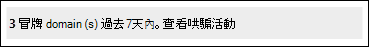

# <a name="spoof-intelligence-insight-in-eop"></a><span data-ttu-id="7775c-103">EOP 中的欺騙智慧洞察力</span><span class="sxs-lookup"><span data-stu-id="7775c-103">Spoof intelligence insight in EOP</span></span>

[!INCLUDE [Microsoft 365 Defender rebranding](../includes/microsoft-defender-for-office.md)]

<span data-ttu-id="7775c-104">**適用於**</span><span class="sxs-lookup"><span data-stu-id="7775c-104">**Applies to**</span></span>
- [<span data-ttu-id="7775c-105">Exchange Online Protection</span><span class="sxs-lookup"><span data-stu-id="7775c-105">Exchange Online Protection</span></span>](exchange-online-protection-overview.md)
- [<span data-ttu-id="7775c-106">適用於 Office 365 的 Microsoft Defender 方案 1 和方案 2</span><span class="sxs-lookup"><span data-stu-id="7775c-106">Microsoft Defender for Office 365 plan 1 and plan 2</span></span>](defender-for-office-365.md)
- [<span data-ttu-id="7775c-107">Microsoft 365 Defender</span><span class="sxs-lookup"><span data-stu-id="7775c-107">Microsoft 365 Defender</span></span>](../defender/microsoft-365-defender.md)

> [!NOTE]
> <span data-ttu-id="7775c-108">本文所述的功能都是在預覽中，可能會變更，而且無法在所有的組織中使用。</span><span class="sxs-lookup"><span data-stu-id="7775c-108">The features described in this article are in Preview, are subject to change, and are not available in all organizations.</span></span> <span data-ttu-id="7775c-109">如果您的組織不具備本文所述的功能，請參閱 [使用哄騙智慧原則管理冒牌寄件者的舊版欺騙管理經驗和 EOP 中的欺騙情報洞察力](walkthrough-spoof-intelligence-insight.md)。</span><span class="sxs-lookup"><span data-stu-id="7775c-109">If your organization does not have the features described in this article, see the older spoof management experience at [Manage spoofed senders using the spoof intelligence policy and spoof intelligence insight in EOP](walkthrough-spoof-intelligence-insight.md).</span></span>

<span data-ttu-id="7775c-110">在 Microsoft 365 具有 Exchange Online 或獨立 Exchange Online Protection 中信箱的組織 (EOP) 組織若沒有 Exchange Online 信箱，輸入的電子郵件會自動受到保護以防遭到欺騙。</span><span class="sxs-lookup"><span data-stu-id="7775c-110">In Microsoft 365 organizations with mailboxes in Exchange Online or standalone Exchange Online Protection (EOP) organizations without Exchange Online mailboxes, inbound email messages are automatically protected against spoofing.</span></span> <span data-ttu-id="7775c-111">EOP 會使用 **哄騙情報** 做為組織對網路釣魚的整體防護的一部分。</span><span class="sxs-lookup"><span data-stu-id="7775c-111">EOP uses **spoof intelligence** as part of your organization's overall defense against phishing.</span></span> <span data-ttu-id="7775c-112">如需詳細資訊，請參閱 [EOP 中的反欺詐防護](anti-spoofing-protection.md)。</span><span class="sxs-lookup"><span data-stu-id="7775c-112">For more information, see [Anti-spoofing protection in EOP](anti-spoofing-protection.md).</span></span>

<span data-ttu-id="7775c-113">當寄件者欺騙電子郵件地址時，他們似乎是組織網域之一中的使用者，或是將電子郵件傳送至您組織的外部網域中的使用者。</span><span class="sxs-lookup"><span data-stu-id="7775c-113">When a sender spoofs an email address, they appear to be a user in one of your organization's domains, or a user in an external domain that sends email to your organization.</span></span> <span data-ttu-id="7775c-114">欺騙寄件者以傳送垃圾郵件或網路釣魚電子郵件的攻擊者必須封鎖。</span><span class="sxs-lookup"><span data-stu-id="7775c-114">Attackers who spoof senders to send spam or phishing email need to be blocked.</span></span> <span data-ttu-id="7775c-115">但在某些情況下，合法寄件者是哄騙。</span><span class="sxs-lookup"><span data-stu-id="7775c-115">But there are scenarios where legitimate senders are spoofing.</span></span> <span data-ttu-id="7775c-116">例如：</span><span class="sxs-lookup"><span data-stu-id="7775c-116">For example:</span></span>

- <span data-ttu-id="7775c-117">欺騙內部網域的合法案例：</span><span class="sxs-lookup"><span data-stu-id="7775c-117">Legitimate scenarios for spoofing internal domains:</span></span>
  - <span data-ttu-id="7775c-118">協力廠商寄件者使用您的網域將大宗郵件傳送給您自己的員工，以進行公司投票。</span><span class="sxs-lookup"><span data-stu-id="7775c-118">Third-party senders use your domain to send bulk mail to your own employees for company polls.</span></span>
  - <span data-ttu-id="7775c-119">外部公司代表您產生及傳送廣告或產品更新。</span><span class="sxs-lookup"><span data-stu-id="7775c-119">An external company generates and sends advertising or product updates on your behalf.</span></span>
  - <span data-ttu-id="7775c-120">助理定期需要在組織內傳送其他人員的電子郵件。</span><span class="sxs-lookup"><span data-stu-id="7775c-120">An assistant regularly needs to send email for another person within your organization.</span></span>
  - <span data-ttu-id="7775c-121">內部應用程式會傳送電子郵件通知。</span><span class="sxs-lookup"><span data-stu-id="7775c-121">An internal application sends email notifications.</span></span>

- <span data-ttu-id="7775c-122">欺騙外部網域的合法案例：</span><span class="sxs-lookup"><span data-stu-id="7775c-122">Legitimate scenarios for spoofing external domains:</span></span>
  - <span data-ttu-id="7775c-123">寄件者位於郵寄清單中 (又稱為討論清單) ，而且郵寄清單會將來自原始寄件者的電子郵件轉送至郵寄清單上的所有參與者。</span><span class="sxs-lookup"><span data-stu-id="7775c-123">The sender is on a mailing list (also known as a discussion list), and the mailing list relays email from the original sender to all the participants on the mailing list.</span></span>
  - <span data-ttu-id="7775c-124">外部公司代表其他公司傳送電子郵件 (例如，自動化報表或軟體即服務公司) 。</span><span class="sxs-lookup"><span data-stu-id="7775c-124">An external company sends email on behalf of another company (for example, an automated report or a software-as-a-service company).</span></span>

<span data-ttu-id="7775c-125">您可以使用 Microsoft 365 Defender 入口網站中的 **欺騙智慧洞察力**，快速找出可合法傳送您未驗證的電子郵件的欺騙寄件者，以 (未通過 SPF、DKIM 或 DMARC) 檢查的網域郵件，以及手動允許這些寄件者。</span><span class="sxs-lookup"><span data-stu-id="7775c-125">You can use the **spoof intelligence insight** in the Microsoft 365 Defender portal to quickly identify spoofed senders who are legitimately sending you unauthenticated email (messages from domains that don't pass SPF, DKIM, or DMARC checks), and manually allow those senders.</span></span>

<span data-ttu-id="7775c-126">透過允許已知寄件者從已知位置傳送哄騙郵件，您可以減少誤報 (已標示為錯誤) 的良好電子郵件。</span><span class="sxs-lookup"><span data-stu-id="7775c-126">By allowing known senders to send spoofed messages from known locations, you can reduce false positives (good email marked as bad).</span></span> <span data-ttu-id="7775c-127">透過監視允許的欺騙寄件者，您可以提供額外的安全性層級，以防止不安全的郵件到達您的組織中。</span><span class="sxs-lookup"><span data-stu-id="7775c-127">By monitoring the allowed spoofed senders, you provide an additional layer of security to prevent unsafe messages from arriving in your organization.</span></span>

<span data-ttu-id="7775c-128">同樣地，您也可以查看哄騙情報所允許的欺騙寄件者，並手動封鎖欺騙性智慧洞察力中的寄件者。</span><span class="sxs-lookup"><span data-stu-id="7775c-128">Likewise, you can review spoofed senders that were allowed by spoof intelligence and manually block those senders from the spoof intelligence insight.</span></span>

<span data-ttu-id="7775c-129">本文的其餘部分將說明如何使用 Microsoft 365 Defender 入口網站和 PowerShell (Exchange Online PowerShell 中的欺騙智慧洞察力，以 Microsoft 365 具有 Exchange Online 信箱的組織;組織的獨立 EOP PowerShell，不 Exchange Online 信箱) 。</span><span class="sxs-lookup"><span data-stu-id="7775c-129">The rest of this article explains how to use the spoof intelligence insight in the Microsoft 365 Defender portal and in PowerShell (Exchange Online PowerShell for Microsoft 365 organizations with mailboxes in Exchange Online; standalone EOP PowerShell for organizations without Exchange Online mailboxes).</span></span>

> [!NOTE]
>
> - <span data-ttu-id="7775c-130">欺詐智慧洞察力只會顯示欺騙性智慧所偵測到的欺騙寄件者。</span><span class="sxs-lookup"><span data-stu-id="7775c-130">Only spoofed senders that were detected by spoof intelligence appear in the spoof intelligence insight.</span></span> <span data-ttu-id="7775c-131">當您覆寫真知灼見中的 allow 或 block 判定時，哄騙寄件者會變成隻會出現在承租人允許/封鎖清單中 [ **偽造** ] 索引標籤上的 [手動允許] 或 [封鎖] 專案。</span><span class="sxs-lookup"><span data-stu-id="7775c-131">When you override the allow or block verdict in the insight, the spoofed sender becomes a manual allow or block entry that appears only on the **Spoof** tab in the Tenant Allow/Block List.</span></span> <span data-ttu-id="7775c-132">您也可以手動為欺騙性寄件者建立允許或封鎖專案，以取得欺騙性的智慧。</span><span class="sxs-lookup"><span data-stu-id="7775c-132">You can also manually create allow or block entries for spoofed senders before they're detected by spoof intelligence.</span></span> <span data-ttu-id="7775c-133">如需詳細資訊，請參閱[管理 EOP 中的租用戶允許/封鎖清單](tenant-allow-block-list.md)。</span><span class="sxs-lookup"><span data-stu-id="7775c-133">For more information, see [Manage the Tenant Allow/Block List in EOP](tenant-allow-block-list.md).</span></span>
>
> - <span data-ttu-id="7775c-134">承租人「允許/封鎖」清單中的「欺騙性智慧真知灼見」和「 **欺騙** 」索引標籤會取代 [安全性 & 合規性中心的 [反垃圾郵件原則] 頁面上提供的欺騙智慧原則功能。</span><span class="sxs-lookup"><span data-stu-id="7775c-134">The spoof intelligence insight and the **Spoof** tab in the Tenant Allow/Block list replace the functionality of the spoof intelligence policy that was available on the anti-spam policy page in the Security & Compliance Center.</span></span>
>
>- <span data-ttu-id="7775c-135">欺騙性智慧洞察力會顯示7天的資料。</span><span class="sxs-lookup"><span data-stu-id="7775c-135">The spoof intelligence insight shows 7 days worth of data.</span></span> <span data-ttu-id="7775c-136">**SpoofIntelligenceInsight** Cmdlet 會顯示30天的資料。</span><span class="sxs-lookup"><span data-stu-id="7775c-136">The **Get-SpoofIntelligenceInsight** cmdlet shows 30 days worth of data.</span></span>

## <a name="what-do-you-need-to-know-before-you-begin"></a><span data-ttu-id="7775c-137">開始之前有哪些須知？</span><span class="sxs-lookup"><span data-stu-id="7775c-137">What do you need to know before you begin?</span></span>

- <span data-ttu-id="7775c-138">您於 <https://security.microsoft.com/> 開啟 Microsoft 365 Defender 入口網站。</span><span class="sxs-lookup"><span data-stu-id="7775c-138">You open the Microsoft 365 Defender portal at <https://security.microsoft.com/>.</span></span> <span data-ttu-id="7775c-139">若要直接移至 [ **反網路釣魚** ] 頁面，請使用 <https://security.microsoft.com/antiphishing> 。</span><span class="sxs-lookup"><span data-stu-id="7775c-139">To go directly to the **Anti-phishing** page, use <https://security.microsoft.com/antiphishing>.</span></span> <span data-ttu-id="7775c-140">若要直接移至 [ **偽造智慧洞察力** ] 頁面，請使用 <https://security.microsoft.com/spoofintelligence> 。</span><span class="sxs-lookup"><span data-stu-id="7775c-140">To go directly to the **Spoof intelligence insight** page, use <https://security.microsoft.com/spoofintelligence>.</span></span>

- <span data-ttu-id="7775c-141">若要連線至 Exchange Online PowerShell，請參閱[連線至 Exchange Online PowerShell](/powershell/exchange/connect-to-exchange-online-powershell)。</span><span class="sxs-lookup"><span data-stu-id="7775c-141">To connect to Exchange Online PowerShell, see [Connect to Exchange Online PowerShell](/powershell/exchange/connect-to-exchange-online-powershell).</span></span> <span data-ttu-id="7775c-142">若要連接至獨立版 EOP PowerShell，請參閱[連線到 Exchange Online Protection PowerShell](/powershell/exchange/connect-to-exchange-online-protection-powershell)。</span><span class="sxs-lookup"><span data-stu-id="7775c-142">To connect to standalone EOP PowerShell, see [Connect to Exchange Online Protection PowerShell](/powershell/exchange/connect-to-exchange-online-protection-powershell).</span></span>

- <span data-ttu-id="7775c-143">您必須已在 **Exchange Online** 中獲派權限，才能執行此文章中的程序：</span><span class="sxs-lookup"><span data-stu-id="7775c-143">You need to be assigned permissions in **Exchange Online** before you can do the procedures in this article:</span></span>
  - <span data-ttu-id="7775c-144">若要修改欺騙性智慧原則或啟用或停用欺騙智慧，您必須是「 **組織管理** 」或「 **安全性管理員** 」角色群組的成員。</span><span class="sxs-lookup"><span data-stu-id="7775c-144">To modify the spoof intelligence policy or enable or disable spoof intelligence, you need to be a member of the **Organization Management** or **Security Administrator** role groups.</span></span>
  - <span data-ttu-id="7775c-145">若要唯讀的訪問欺騙性智慧原則，您必須是 **全域讀取** 者或 **安全性讀取器** 角色群組的成員。</span><span class="sxs-lookup"><span data-stu-id="7775c-145">For read-only access to the spoof intelligence policy, you need to be a member of the **Global Reader** or **Security Reader** role groups.</span></span>

  <span data-ttu-id="7775c-146">如需詳細資訊，請參閱 [Exchange Online 中的權限](/exchange/permissions-exo/permissions-exo)。</span><span class="sxs-lookup"><span data-stu-id="7775c-146">For more information, see [Permissions in Exchange Online](/exchange/permissions-exo/permissions-exo).</span></span>

  <span data-ttu-id="7775c-147">**附註**：</span><span class="sxs-lookup"><span data-stu-id="7775c-147">**Notes**:</span></span>

  - <span data-ttu-id="7775c-148">在 Microsoft 365 系統管理中心中，將使用者新增至對應的 Azure Active Directory 角色可為使用者提供所需的權限 _和_ Microsoft 365 中其他功能的權限。</span><span class="sxs-lookup"><span data-stu-id="7775c-148">Adding users to the corresponding Azure Active Directory role in the Microsoft 365 admin center gives users the required permissions _and_ permissions for other features in Microsoft 365.</span></span> <span data-ttu-id="7775c-149">如需詳細資訊，請參閱[關於系統管理員角色](../../admin/add-users/about-admin-roles.md)。</span><span class="sxs-lookup"><span data-stu-id="7775c-149">For more information, see [About admin roles](../../admin/add-users/about-admin-roles.md).</span></span>
  - <span data-ttu-id="7775c-150">[Exchange Online](/Exchange/permissions-exo/permissions-exo#role-groups) 中的 **僅限檢視組織管理** 角色群組也會提供功能的唯讀存取權。</span><span class="sxs-lookup"><span data-stu-id="7775c-150">The **View-Only Organization Management** role group in [Exchange Online](/Exchange/permissions-exo/permissions-exo#role-groups) also gives read-only access to the feature.</span></span>

- <span data-ttu-id="7775c-151">您可以在 EOP 和 Microsoft Defender for Office 365 中，啟用並停用欺騙性智慧中的反網路釣魚原則。</span><span class="sxs-lookup"><span data-stu-id="7775c-151">You enable and disable spoof intelligence in anti-phishing policies in EOP and Microsoft Defender for Office 365.</span></span> <span data-ttu-id="7775c-152">預設會啟用欺騙智慧。</span><span class="sxs-lookup"><span data-stu-id="7775c-152">Spoof intelligence is enabled by default.</span></span> <span data-ttu-id="7775c-153">如需詳細資訊，請參閱[在 EOP 中設定反網路釣魚原則](configure-anti-phishing-policies-eop.md)或[設定 Microsoft Defender 中的反網路釣魚原則，以進行 Office 365](configure-mdo-anti-phishing-policies.md)。</span><span class="sxs-lookup"><span data-stu-id="7775c-153">For more information, see [Configure anti-phishing policies in EOP](configure-anti-phishing-policies-eop.md) or [Configure anti-phishing policies in Microsoft Defender for Office 365](configure-mdo-anti-phishing-policies.md).</span></span>

- <span data-ttu-id="7775c-154">如需適用于哄騙情報的建議設定，請參閱 [EOP 反網路釣魚原則設定](recommended-settings-for-eop-and-office365-atp.md#eop-anti-phishing-policy-settings)。</span><span class="sxs-lookup"><span data-stu-id="7775c-154">For our recommended settings for spoof intelligence, see [EOP anti-phishing policy settings](recommended-settings-for-eop-and-office365-atp.md#eop-anti-phishing-policy-settings).</span></span>

## <a name="open-the-spoof-intelligence-insight-in-the-microsoft-365-defender-portal"></a><span data-ttu-id="7775c-155">在 Microsoft 365 Defender 入口網站中開啟欺騙智慧洞察力</span><span class="sxs-lookup"><span data-stu-id="7775c-155">Open the spoof intelligence insight in the Microsoft 365 Defender portal</span></span>

1. <span data-ttu-id="7775c-156">在 Microsoft 365 Defender 入口網站中，移至 [**電子郵件 &** 共同作業 \> **原則] & 規則** \> **威脅原則** 原則] \> 區段 \> **反網路釣魚**。</span><span class="sxs-lookup"><span data-stu-id="7775c-156">In the Microsoft 365 Defender portal, go to **Email & Collaboration** \> **Policies & Rules** \> **Threat policies** \> **Policies** section \> **Anti-phishing**.</span></span>

2. <span data-ttu-id="7775c-157">在 [ **反網路釣魚** ] 頁面上，欺騙性的智慧洞察力看起來像這樣：</span><span class="sxs-lookup"><span data-stu-id="7775c-157">On the **Anti-phishing** page, the spoof intelligence insight looks like this:</span></span>

   

   <span data-ttu-id="7775c-159">洞察力有兩種模式：</span><span class="sxs-lookup"><span data-stu-id="7775c-159">The insight has two modes:</span></span>

   - <span data-ttu-id="7775c-160">**深入瞭解模式**：如果已啟用欺騙智慧，則真知灼見會顯示過去7天內，欺騙情報偵測到的郵件數目。</span><span class="sxs-lookup"><span data-stu-id="7775c-160">**Insight mode**: If spoof intelligence is enabled, the insight shows you how many messages were detected by spoof intelligence during the past seven days.</span></span>
   - <span data-ttu-id="7775c-161">**假設模式**：如果已停用欺騙智慧，則真知灼見會顯示過去七天內，欺騙情報偵測到 *的郵件數目* 。</span><span class="sxs-lookup"><span data-stu-id="7775c-161">**What if mode**: If spoof intelligence is disabled, then the insight shows you how many messages *would* have been detected by spoof intelligence during the past seven days.</span></span>

<span data-ttu-id="7775c-162">若要查看有關欺騙智慧偵測的資訊，請按一下 [偽造智慧洞察力] 中的 [ **查看哄騙活動** ]。</span><span class="sxs-lookup"><span data-stu-id="7775c-162">To view information about the spoof intelligence detections, click **View spoofing activity** in the spoof intelligence insight.</span></span>

### <a name="view-information-about-spoofed-messages"></a><span data-ttu-id="7775c-163">查看有關欺騙性郵件的資訊</span><span class="sxs-lookup"><span data-stu-id="7775c-163">View information about spoofed messages</span></span>

> [!NOTE]
> <span data-ttu-id="7775c-164">請記住，此頁面上只會顯示欺騙性智慧所偵測到的欺騙寄件者。</span><span class="sxs-lookup"><span data-stu-id="7775c-164">Remember, only spoofed senders that were detected by spoof intelligence appear on this page.</span></span> <span data-ttu-id="7775c-165">當您覆寫真知灼見中的 allow 或 block 判定時，哄騙寄件者會變成隻會出現在承租人允許/封鎖清單中 [ **偽造** ] 索引標籤上的 [手動允許] 或 [封鎖] 專案。</span><span class="sxs-lookup"><span data-stu-id="7775c-165">When you override the allow or block verdict in the insight, the spoofed sender becomes a manual allow or block entry that appears only on the **Spoof** tab in the Tenant Allow/Block List.</span></span>

<span data-ttu-id="7775c-166">在您按一下 [偽造智慧資訊] 中的 [**查看哄騙活動**] 後出現的 [**哄騙情報** 資訊] 頁面上，此頁面包含下列資訊：</span><span class="sxs-lookup"><span data-stu-id="7775c-166">On the **Spoof intelligence insight** page that appears after you click **View spoofing activity** in the spoof intelligence insight, the page contains the following information:</span></span>

- <span data-ttu-id="7775c-167">**冒牌使用者**：在電子郵件客戶程式的 [**寄件者**] 方塊中顯示的欺騙使用者 **網域**。</span><span class="sxs-lookup"><span data-stu-id="7775c-167">**Spoofed user**: The **domain** of the spoofed user that's displayed in the **From** box in email clients.</span></span> <span data-ttu-id="7775c-168">「寄件者」位址也稱為 `5322.From` 位址。</span><span class="sxs-lookup"><span data-stu-id="7775c-168">The From address is also known as the `5322.From` address.</span></span>
- <span data-ttu-id="7775c-169">傳送 **基礎結構**：也稱為 _基礎結構_。</span><span class="sxs-lookup"><span data-stu-id="7775c-169">**Sending infrastructure**: Also known as the _infrastructure_.</span></span> <span data-ttu-id="7775c-170">傳送基礎結構會是下列其中一個值：</span><span class="sxs-lookup"><span data-stu-id="7775c-170">The sending infrastructure will be one of the following values:</span></span>
  - <span data-ttu-id="7775c-171">) 來源電子郵件伺服器的 IP 位址的反向 DNS 查閱 (PTR 記錄中找到的網域。</span><span class="sxs-lookup"><span data-stu-id="7775c-171">The domain found in a reverse DNS lookup (PTR record) of the source email server's IP address.</span></span>
  - <span data-ttu-id="7775c-172">如果來源 IP 位址沒有 PTR 記錄，則會將傳送基礎結構識別為 \<source IP\> /24 (例如，192.168.100.100/24) 。</span><span class="sxs-lookup"><span data-stu-id="7775c-172">If the source IP address has no PTR record, then the sending infrastructure is identified as \<source IP\>/24 (for example, 192.168.100.100/24).</span></span>
- <span data-ttu-id="7775c-173">**郵件** 數目：在過去7天內，來自欺騙網域 _與_ 傳送基礎結構之結合的郵件數目。</span><span class="sxs-lookup"><span data-stu-id="7775c-173">**Message count**: The number of messages from the combination of the spoofed domain _and_ the sending infrastructure to your organization within the last 7 days.</span></span>
- <span data-ttu-id="7775c-174">**上次看到**：從包含欺騙網域之傳送基礎結構接收郵件的最後日期。</span><span class="sxs-lookup"><span data-stu-id="7775c-174">**Last seen**: The last date when a message was received from the sending infrastructure that contains the spoofed domain.</span></span>
- <span data-ttu-id="7775c-175">**哄騙類型**：下列其中一個值：</span><span class="sxs-lookup"><span data-stu-id="7775c-175">**Spoof type**: One of the following values:</span></span>
  - <span data-ttu-id="7775c-176">**Internal**：哄騙寄件者位於屬於您組織 ([公認的網域](/exchange/mail-flow-best-practices/manage-accepted-domains/manage-accepted-domains)) 中的網域。</span><span class="sxs-lookup"><span data-stu-id="7775c-176">**Internal**: The spoofed sender is in a domain that belongs to your organization (an [accepted domain](/exchange/mail-flow-best-practices/manage-accepted-domains/manage-accepted-domains)).</span></span>
  - <span data-ttu-id="7775c-177">**外部**：冒牌寄件者位於外部網域。</span><span class="sxs-lookup"><span data-stu-id="7775c-177">**External**: The spoofed sender is in an external domain.</span></span>
- <span data-ttu-id="7775c-178">**動作**： **允許** 或 **封鎖** 此值：</span><span class="sxs-lookup"><span data-stu-id="7775c-178">**Action**: This value is **Allowed** or **Blocked**:</span></span>
  - <span data-ttu-id="7775c-179">**允許**：網域失敗明確的電子郵件驗證檢查 [SPF](how-office-365-uses-spf-to-prevent-spoofing.md)、 [DKIM](use-dkim-to-validate-outbound-email.md)及 [DMARC](use-dmarc-to-validate-email.md)) 。</span><span class="sxs-lookup"><span data-stu-id="7775c-179">**Allowed**: The domain failed explicit email authentication checks [SPF](how-office-365-uses-spf-to-prevent-spoofing.md), [DKIM](use-dkim-to-validate-outbound-email.md), and [DMARC](use-dmarc-to-validate-email.md)).</span></span> <span data-ttu-id="7775c-180">不過，網域已通過我們的隱含電子郵件驗證檢查 ([複合驗證](email-validation-and-authentication.md#composite-authentication)) 。</span><span class="sxs-lookup"><span data-stu-id="7775c-180">However, the domain passed our implicit email authentication checks ([composite authentication](email-validation-and-authentication.md#composite-authentication)).</span></span> <span data-ttu-id="7775c-181">因此，不會對郵件採取任何反欺詐動作。</span><span class="sxs-lookup"><span data-stu-id="7775c-181">As a result, no anti-spoofing action was taken on the message.</span></span>
  - <span data-ttu-id="7775c-182">已 **封鎖**：來自欺騙性網域 _和_ 傳送基礎結構的郵件會因欺騙性智慧而標示為壞。</span><span class="sxs-lookup"><span data-stu-id="7775c-182">**Blocked**: Messages from the combination of the spoofed domain _and_ sending infrastructure are marked as bad by spoof intelligence.</span></span> <span data-ttu-id="7775c-183">對哄騙郵件採取的動作是由預設的反網路釣魚原則或自訂的反網路釣魚原則所控制 (預設值會將 **郵件移至 [垃圾郵件] 資料夾**) 。</span><span class="sxs-lookup"><span data-stu-id="7775c-183">The action that's taken on the spoofed messages is controlled by the default anti-phishing policy or custom anti-phishing policies (the default value is **Move message to Junk Email folder**).</span></span> <span data-ttu-id="7775c-184">如需詳細資訊，請參閱[Configure Office 365 的 Microsoft Defender 中的反網路釣魚原則](configure-mdo-anti-phishing-policies.md)。</span><span class="sxs-lookup"><span data-stu-id="7775c-184">For more information, see [Configure anti-phishing policies in Microsoft Defender for Office 365](configure-mdo-anti-phishing-policies.md).</span></span>

<span data-ttu-id="7775c-185">您可以按一下 [選取的欄標題] 來排序結果。</span><span class="sxs-lookup"><span data-stu-id="7775c-185">You can click selected column headings to sort the results.</span></span>

<span data-ttu-id="7775c-186">若要篩選結果，您可以使用下列選項：</span><span class="sxs-lookup"><span data-stu-id="7775c-186">To filter the results, you have the following options:</span></span>

- <span data-ttu-id="7775c-187">按一下 [ **篩選** ] 按鈕。</span><span class="sxs-lookup"><span data-stu-id="7775c-187">Click the **Filter** button.</span></span> <span data-ttu-id="7775c-188">在出現的 [ **篩選** ] 浮出控制項中，您可以透過下列方式篩選結果：</span><span class="sxs-lookup"><span data-stu-id="7775c-188">In the **Filter** flyout that appears, you can filter the results by:</span></span>
  - <span data-ttu-id="7775c-189">**哄騙類型**</span><span class="sxs-lookup"><span data-stu-id="7775c-189">**Spoof type**</span></span>
  - <span data-ttu-id="7775c-190">**Action**</span><span class="sxs-lookup"><span data-stu-id="7775c-190">**Action**</span></span>
- <span data-ttu-id="7775c-191">使用 [ **搜尋** ] 方塊，輸入以逗號分隔的欺騙網域值清單，或傳送基礎結構值以篩選結果。</span><span class="sxs-lookup"><span data-stu-id="7775c-191">Use the **Search** box to enter a comma-separated list of spoofed domain values or sending infrastructure values to filter the results.</span></span>

### <a name="view-details-about-spoofed-messages"></a><span data-ttu-id="7775c-192">查看有關哄騙郵件的詳細資料</span><span class="sxs-lookup"><span data-stu-id="7775c-192">View details about spoofed messages</span></span>

<span data-ttu-id="7775c-193">當您從清單中選取專案時，會出現詳細資料彈出列表，其中包含下列資訊和功能：</span><span class="sxs-lookup"><span data-stu-id="7775c-193">When you select an entry from the list, a details flyout appears that contains the following information and features:</span></span>

- <span data-ttu-id="7775c-194">**允許\*\*\*\*從電子欺騙中** 取得或封鎖：選取其中一個值以覆寫原始的欺騙智慧判定，並將輸入從欺騙智慧洞察力移至承租人允許/封鎖清單以取得欺騙的允許或封鎖專案。</span><span class="sxs-lookup"><span data-stu-id="7775c-194">**Allow to spoof** or **Block from spoofing**: Select one of these values to override the original spoof intelligence verdict and move the entry from the spoof intelligence insight to the Tenant Allow/Block List as an allow or block entry for spoof.</span></span>
- <span data-ttu-id="7775c-195">我們為何會發現這種情況。</span><span class="sxs-lookup"><span data-stu-id="7775c-195">Why we caught this.</span></span>
- <span data-ttu-id="7775c-196">您需要執行的工作。</span><span class="sxs-lookup"><span data-stu-id="7775c-196">What you need to do.</span></span>
- <span data-ttu-id="7775c-197">包含主要欺騙智慧頁面中大部分相同資訊的域摘要。</span><span class="sxs-lookup"><span data-stu-id="7775c-197">A domain summary that includes most of the same information from the main spoof intelligence page.</span></span>
- <span data-ttu-id="7775c-198">WhoIs 寄件者的相關資料。</span><span class="sxs-lookup"><span data-stu-id="7775c-198">WhoIs data about the sender.</span></span>
- <span data-ttu-id="7775c-199">開啟[威脅瀏覽器](threat-explorer.md)的連結，以查看有關 Office 365) 之寄件者 (Microsoft Defender 的其他詳細資料。</span><span class="sxs-lookup"><span data-stu-id="7775c-199">A link to open [Threat Explorer](threat-explorer.md) to see additional details about the sender (Microsoft Defender for Office 365).</span></span>
- <span data-ttu-id="7775c-200">來自相同寄件者的您租使用者中所看到的類似訊息。</span><span class="sxs-lookup"><span data-stu-id="7775c-200">Similar messages we have seen in your tenant from the same sender.</span></span>

### <a name="about-allowed-spoofed-senders"></a><span data-ttu-id="7775c-201">關於允許的欺騙寄件者</span><span class="sxs-lookup"><span data-stu-id="7775c-201">About allowed spoofed senders</span></span>

<span data-ttu-id="7775c-202">您手動變更為 **允許哄騙** 的欺騙性智慧或遭到封鎖的寄件者所允許的欺騙寄件者，只允許來自欺騙網域 *和* 傳送基礎結構的組合中的郵件。</span><span class="sxs-lookup"><span data-stu-id="7775c-202">An allowed spoofed sender in the spoof intelligence insight or a blocked spoofed sender that you manually changed to **Allow to spoof** only allows messages from the combination of the spoofed domain *and* the sending infrastructure.</span></span> <span data-ttu-id="7775c-203">不允許來自任何來源的冒牌網域的電子郵件，也不允許來自任何網域之傳送基礎結構的電子郵件。</span><span class="sxs-lookup"><span data-stu-id="7775c-203">It does not allow email from the spoofed domain from any source, nor does it allow email from the sending infrastructure for any domain.</span></span>

<span data-ttu-id="7775c-204">例如，下列欺騙寄件者可哄騙：</span><span class="sxs-lookup"><span data-stu-id="7775c-204">For example, the following spoofed sender is allowed to spoof:</span></span>

- <span data-ttu-id="7775c-205">**網域**： gmail.com</span><span class="sxs-lookup"><span data-stu-id="7775c-205">**Domain**: gmail.com</span></span>
- <span data-ttu-id="7775c-206">**基礎結構**： tms.mx.com</span><span class="sxs-lookup"><span data-stu-id="7775c-206">**Infrastructure**: tms.mx.com</span></span>

<span data-ttu-id="7775c-207">只有來自該網域/傳送基礎結構對的電子郵件才會遭到欺騙。</span><span class="sxs-lookup"><span data-stu-id="7775c-207">Only email from that domain/sending infrastructure pair will be allowed to spoof.</span></span> <span data-ttu-id="7775c-208">其他企圖哄騙 gmail.com 的寄件者不會自動允許。</span><span class="sxs-lookup"><span data-stu-id="7775c-208">Other senders attempting to spoof gmail.com aren't automatically allowed.</span></span> <span data-ttu-id="7775c-209">來自來自 tms.mx.com 的來自其他網域中寄件者的郵件，仍會透過欺騙智慧加以檢查，而且可能會遭到封鎖。</span><span class="sxs-lookup"><span data-stu-id="7775c-209">Messages from senders in other domains that originate from tms.mx.com are still checked by spoof intelligence, and might be blocked.</span></span>

## <a name="use-the-spoof-intelligence-insight-in-exchange-online-powershell-or-standalone-eop-powershell"></a><span data-ttu-id="7775c-210">使用 Exchange Online PowerShell 或獨立 EOP 中的欺騙智慧洞察力 PowerShell</span><span class="sxs-lookup"><span data-stu-id="7775c-210">Use the spoof intelligence insight in Exchange Online PowerShell or standalone EOP PowerShell</span></span>

<span data-ttu-id="7775c-211">在 PowerShell 中，您可以使用 **SpoofIntelligenceInsight 指令程式** 來 **查看** 被欺騙情報偵測到的允許和封鎖的欺騙寄件者。</span><span class="sxs-lookup"><span data-stu-id="7775c-211">In PowerShell, you use the **Get-SpoofIntelligenceInsight** cmdlet to **view** allowed and blocked spoofed senders that were detected by spoof intelligence.</span></span> <span data-ttu-id="7775c-212">若要手動允許或封鎖欺騙寄件者，您必須使用 **TenantAllowBlockListSpoofItems** Cmdlet。</span><span class="sxs-lookup"><span data-stu-id="7775c-212">To manually allow or block the spoofed senders, you need to use the **New-TenantAllowBlockListSpoofItems** cmdlet.</span></span> <span data-ttu-id="7775c-213">如需詳細資訊，請參閱 [Use PowerShell configure The 承租人 Allow/封鎖清單](tenant-allow-block-list.md#use-exchange-online-powershell-or-standalone-eop-powershell-to-configure-the-tenant-allowblock-list)。</span><span class="sxs-lookup"><span data-stu-id="7775c-213">For more information, see [Use PowerShell to configure the Tenant Allow/Block List](tenant-allow-block-list.md#use-exchange-online-powershell-or-standalone-eop-powershell-to-configure-the-tenant-allowblock-list).</span></span>

<span data-ttu-id="7775c-214">若要查看哄騙智慧洞察力中的資訊，請執行下列命令：</span><span class="sxs-lookup"><span data-stu-id="7775c-214">To view the information in the spoof intelligence insight, run the following command:</span></span>

```powershell
Get-SpoofIntelligenceInsight
```

<span data-ttu-id="7775c-215">如需詳細的語法及參數資訊，請參閱 [SpoofIntelligenceInsight](/powershell/module/exchange/get-spoofintelligenceinsight)。</span><span class="sxs-lookup"><span data-stu-id="7775c-215">For detailed syntax and parameter information, see [Get-SpoofIntelligenceInsight](/powershell/module/exchange/get-spoofintelligenceinsight).</span></span>

## <a name="other-ways-to-manage-spoofing-and-phishing"></a><span data-ttu-id="7775c-216">其他管理哄騙和網路釣魚的方式</span><span class="sxs-lookup"><span data-stu-id="7775c-216">Other ways to manage spoofing and phishing</span></span>

<span data-ttu-id="7775c-217">勤於進行詐騙和網路釣魚防護。</span><span class="sxs-lookup"><span data-stu-id="7775c-217">Be diligent about spoofing and phishing protection.</span></span> <span data-ttu-id="7775c-218">以下是檢查寄件者哄騙您網域的相關方法，並協助防止他們破壞您的組織：</span><span class="sxs-lookup"><span data-stu-id="7775c-218">Here are related ways to check on senders who are spoofing your domain and help prevent them from damaging your organization:</span></span>

- <span data-ttu-id="7775c-219">檢查 **冒名郵件報告**。</span><span class="sxs-lookup"><span data-stu-id="7775c-219">Check the **Spoof Mail Report**.</span></span> <span data-ttu-id="7775c-220">您通常可使用此報告來檢視及協助管理偽裝的寄件者。</span><span class="sxs-lookup"><span data-stu-id="7775c-220">You can use this report often to view and help manage spoofed senders.</span></span> <span data-ttu-id="7775c-221">如需詳細資訊，請參閱 [欺騙偵測報告](view-email-security-reports.md#spoof-detections-report)。</span><span class="sxs-lookup"><span data-stu-id="7775c-221">For information, see [Spoof Detections report](view-email-security-reports.md#spoof-detections-report).</span></span>

- <span data-ttu-id="7775c-222">檢閱寄件者原則架構 (SPF) 設定。</span><span class="sxs-lookup"><span data-stu-id="7775c-222">Review your Sender Policy Framework (SPF) configuration.</span></span> <span data-ttu-id="7775c-223">如需 SPF 的快速簡介並快速設定，請參閱[在 Microsoft 365 中設定 SPF 以協助防止詐騙](set-up-spf-in-office-365-to-help-prevent-spoofing.md)。</span><span class="sxs-lookup"><span data-stu-id="7775c-223">For a quick introduction to SPF and to get it configured quickly, see [Set up SPF in Microsoft 365 to help prevent spoofing](set-up-spf-in-office-365-to-help-prevent-spoofing.md).</span></span> <span data-ttu-id="7775c-224">如需更深入了解 Office 365 如何使用 SPF 或是進行疑難排解或非標準的部署 (例如混合式部署)，請先參閱 [Office 365 如何使用寄件者原則架構 (SPF) 防止詐騙](how-office-365-uses-spf-to-prevent-spoofing.md)。</span><span class="sxs-lookup"><span data-stu-id="7775c-224">For a more in-depth understanding of how Office 365 uses SPF, or for troubleshooting or non-standard deployments such as hybrid deployments, start with [How Office 365 uses Sender Policy Framework (SPF) to prevent spoofing](how-office-365-uses-spf-to-prevent-spoofing.md).</span></span>

- <span data-ttu-id="7775c-225">檢閱您的網域金鑰識別郵件 (DKIM) 設定。</span><span class="sxs-lookup"><span data-stu-id="7775c-225">Review your DomainKeys Identified Mail (DKIM) configuration.</span></span> <span data-ttu-id="7775c-226">除了 SPF 和 DMARC 之外，您還應該使用 DKIM，以協助防止攻擊者傳送看似來自您網域的郵件。</span><span class="sxs-lookup"><span data-stu-id="7775c-226">You should use DKIM in addition to SPF and DMARC to help prevent attackers from sending messages that look like they are coming from your domain.</span></span> <span data-ttu-id="7775c-227">DKIM 可讓您在郵件標頭中將數位簽章新增到電子郵件。</span><span class="sxs-lookup"><span data-stu-id="7775c-227">DKIM lets you add a digital signature to email messages in the message header.</span></span> <span data-ttu-id="7775c-228">如需相關資訊，請參閱[在 Office 365 中使用 DKIM 驗證從自訂網域傳送的外寄電子郵件](use-dkim-to-validate-outbound-email.md)。</span><span class="sxs-lookup"><span data-stu-id="7775c-228">For information, see [Use DKIM to validate outbound email sent from your custom domain in Office 365](use-dkim-to-validate-outbound-email.md).</span></span>

- <span data-ttu-id="7775c-229">檢閱以網域為基礎的訊息認證、報告與一致性 (DMARC) 設定。</span><span class="sxs-lookup"><span data-stu-id="7775c-229">Review your Domain-based Message Authentication, Reporting, and Conformance (DMARC) configuration.</span></span> <span data-ttu-id="7775c-230">搭配 SPF 和 DKIM 來實作 DMARC 可提供額外保護，防範詐騙和網路釣魚電子郵件。</span><span class="sxs-lookup"><span data-stu-id="7775c-230">Implementing DMARC with SPF and DKIM provides additional protection against spoofing and phishing email.</span></span> <span data-ttu-id="7775c-231">DMARC 可協助接收方郵件系統決定如何處理未通過 SPF 或 DKIM 檢查的您網域傳送的郵件。</span><span class="sxs-lookup"><span data-stu-id="7775c-231">DMARC helps receiving mail systems determine what to do with messages sent from your domain that fail SPF or DKIM checks.</span></span> <span data-ttu-id="7775c-232">如需相關資訊，請參閱[在 Office 365 中使用 DMARC 來驗證電子郵件](use-dmarc-to-validate-email.md)。</span><span class="sxs-lookup"><span data-stu-id="7775c-232">For information, see [Use DMARC to validate email in Office 365](use-dmarc-to-validate-email.md).</span></span>
