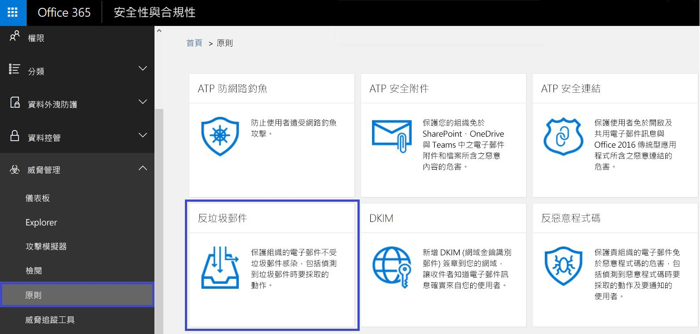
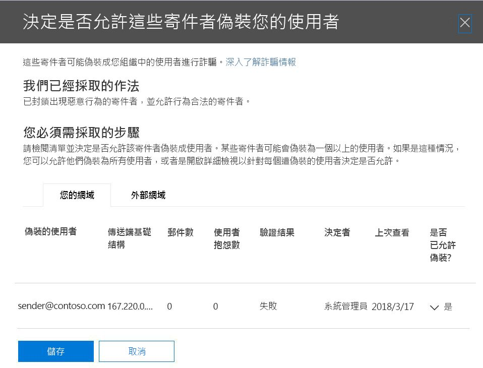
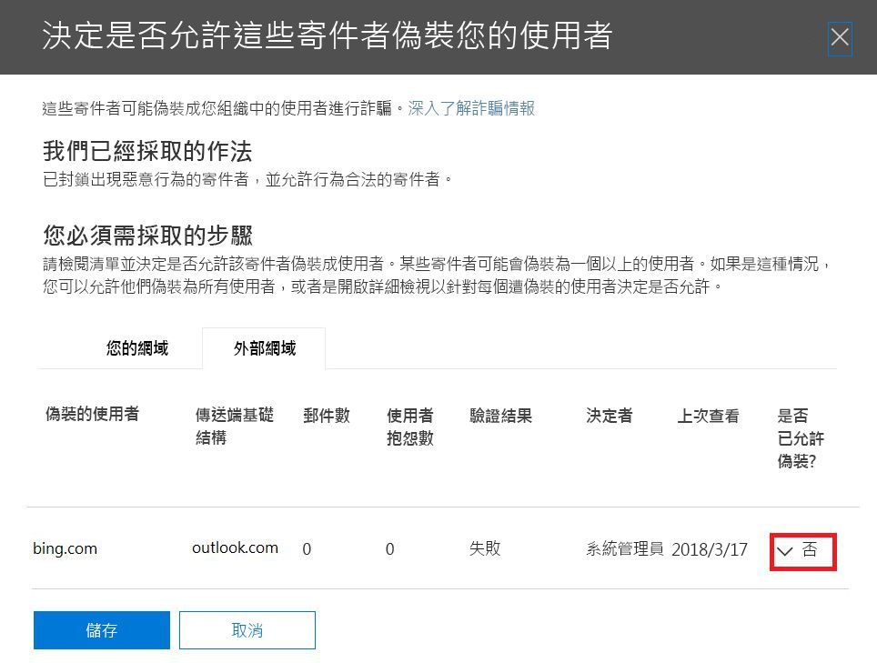
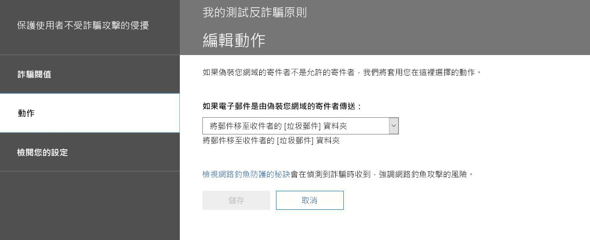

# 深入了解詐騙情報

請在 [反垃圾郵件設定]**** 頁面上的安全性與合規性中心使用詐騙情報，以檢閱欺騙貴組織網域或欺騙外部網域的所有寄件者。 在 Office 365 企業版 E5 中可取得詐騙情報，也可在進階威脅防護和 (從 2018 年 10 月起) Exchange Online Protection (EOP) 中分開取得。

## 我可檢閱哪些類型的電子郵件，以及我應使用詐騙情報保護什麼？

對於您擁有的網域，您可以檢閱欺騙您網域的所有寄件者，然後選擇允許寄件者繼續或封鎖寄件者。 對於外部網域，您可以允許與傳送基礎結構合併的寄件者網域，但不是個別的傳送電子郵件地址。

當寄件者偽造電子郵件地址時，他們似乎會代表貴組織的某個網域內一或多個使用者帳戶傳送郵件，或代表外部網域將郵件傳送給貴組織。 令人驚訝的是，詐騙竟然有一些正當的商業理由。 例如，在下列情況下，您不會阻止寄件者欺騙您的網域：

- 有第三方寄件者使用您的網域，將大量郵件傳送給您自己的員工進行公司民調。

- 您聘用了一家外部公司，代表您產生並送出廣告或產品更新。

- 經常需要傳送電子郵件給貴組織內另一個人的助理。

- 已設定要欺騙其組織的應用程式，以便透過電子郵件傳送內部通知。

外部網域會經常傳送偽造的電子郵件，且其中很多都有正當的理由。 例如，以下是當外部寄件者傳送偽造的電子郵件時的一些合法案例：

- 寄件者在討論郵寄清單中，而郵寄清單將來自原始寄件者的電子郵件轉送給郵寄清單上的所有參與者。

- 外部公司代表另一家公司傳送電子郵件 (例如自動報告，或軟體即服務公司)。

您需要一種方法來確保合法詐騙者所傳送的郵件不會遭到 Office 365 或外部電子郵件系統中的垃圾郵件篩選器攔截。 Office 365 通常會將這些電子郵件視為垃圾郵件。 如果您是 Office 365 系統管理員，您可以在安全性與合規性中心設定詐騙篩選條件來避免此種情況。 如果您擁有該網域，可以設定 SPF、DKIM 和 DMARC 來允許這些寄件者。

另一方面，必須封鎖惡意詐騙者、欺騙您網域的寄件者，或要傳送垃圾郵件或網路釣魚電子郵件的外部網域。 詐騙也是網路釣魚者取得使用者認證的常見方式。 Office 365 具有內建詐騙防護功能，可協助保護貴組織免於遭受這些惡意電子郵件的寄件者攻擊。 貴組織網域的詐騙防護一律會針對所有的 Office 365 客戶開啟，而外部網域詐騙防護則預設會針對進階威脅防護客戶和 (從 2018 年 10 月起) EOP 客戶開啟。 若要進一步加強這項防護，請告知我們哪些寄件者已獲得授權偽造貴組織的網域並可代表您傳送電子郵件，以及是否允許任何外部網域進行偽造。 未經您授權的寄件者所傳送的任何電子郵件，都會被 Office 365 視為垃圾郵件或詐騙。 請留意欺騙您網域的寄件者，並使用安全性與合規性中心來協助我們改善詐騙情報。

## 在安全性與合規性中心管理詐騙情報

Office 365 一律會強制執行您設定的詐騙情報原則。 您無法將該原則停用，但可以選擇您要主動進行管理的程度。

您可以檢閱正在欺騙您的網域或外部網域的寄件者，然後使用安全性與合規性中心來決定是否允許每個寄件者這麼做。 對於您的網域或外部網域中寄件者所偽造的每個偽裝使用者帳戶，您可以檢視下表中的資訊。

|**參數**|**描述**|
|:-----|:-----|
|寄件者    |也稱為真實寄件者。 這通常是詐騙電子郵件源自的網域。 Office 365 會針對偽裝貴組織的傳送 IP 位址，判斷其指標 (PTR) DNS 記錄的網域。 如果找不到任何網域，報告會改為顯示寄件者的 IP 位址。    |
|偽裝的使用者    |遭到寄件者偽造的使用者帳戶。    僅限 [內部]**** 索引標籤。 此欄位包含單一電子郵件地址，或者如果寄件者正在偽造多個使用者帳戶，則包含**不只一個**電子郵件地址。    僅限 [外部]**** 索引標籤。 外部網域只包含傳送網域，但不包含完整的電子郵件地址。    **秘訣！適用於系統管理員。** 偽裝的使用者是寄件者 (5322.From) 位址，也就是由郵件用戶端顯示為 [寄件者] 位址的位址。 這有時稱為 header.from 地址。 SPF 不會檢查此位址的有效性。           |
|郵件數目    |在過去 30 天內，由寄件者代表所識別偽裝寄件者傳送給貴組織的郵件數目。    |
|使用者抱怨數    |在過去 30 天內，由使用者針對此寄件者所提出的抱怨。 抱怨的形式通常為對 Microsoft 的垃圾郵件提交。    |
|驗證結果    |如果寄件者通過 Exchange Online Protection (EOP) 寄件者驗證檢查 (例如 SPF 或 DKIM)，此值為 [已通過]****，如果寄件者未通過 EOP 寄件者驗證檢查，此值為 [未通過]****，或者如果這些檢查的結果不明，則此值為 [未知]****。    |
|決定者    |顯示 Office 365 系統管理員或詐騙情報原則是否決定允許寄件者偽裝使用者。    |
|上次查看    |此寄件者代表此偽裝的使用者接收郵件的最後日期。    |
|是否已允許偽裝?    | 顯示是否允許此寄件者代表偽裝的使用者傳送電子郵件。 可能的值包括：    **是**：將允許來自此詐騙寄件者的所有偽造地址欺騙您的組織。    **否**：不允許來自此詐騙寄件者的偽造地址欺騙您的組織。 而來自此寄件者的郵件將會被 Office 365 標示為垃圾郵件。    **部分使用者**：如果寄件者正在偽裝多個使用者，則會允許此寄件者的部分偽造地址欺騙貴組織，而其餘的地址將會被標示為垃圾郵件。 使用 [詳細]**** 索引標籤來查看特定地址。    |
|詐騙類型    |如果網域是貴組織的其中一個佈建網域，則此值為 [內部]****，否則為 [外部]****。    |

 **使用安全性與合規性中心來管理欺騙您網域的寄件者**

1. 前往[安全性與合規性中心](https://protection.office.com)。

2. 使用您的公司或學校帳戶登入 Office 365。 您的帳戶必須具備您的 Office 365 組織中的系統管理員認證。

3. 在安全性與合規性中心，展開 [威脅管理]**** \> [原則]**** \> [反垃圾郵件]****。

    

4. 在右窗格中的**反垃圾郵件設定**] 頁面上，向下捲動，然後依序展開 [**詐騙智慧原則**。

    

5. 若要檢視欺騙您網域的寄件者清單，請選擇 [檢閱新的寄件者]****，然後選取 [您的網域]**** 索引標籤。

    如果您已經檢閱寄件者，而且想要變更先前的某些選擇，您可改為選擇 [顯示我已經檢閱的寄件者]****。 在任一種情況下，下列面板都會出現。

    

    每個偽裝的使用者都會顯示在個別的列中，以便您選擇要允許或阻止寄件者個別地偽裝每位使用者。

    若要將寄件者新增至使用者的允許清單，請從 [是否已允許偽裝]**** 欄中選取 [是]****。 若要將寄件者新增至使用者的封鎖清單，請選擇 [否]****。

    若要設定不屬於您網域的原則，請選取 [外部網域]**** 索引標籤。將寄件者的 [是否已允許偽裝]**** 欄變更為 [是]****，可允許該寄件者將未經驗證的電子郵件傳送到貴組織。 或者，如果您認為 Office 365 在允許寄件者傳送偽造的電子郵件時犯了錯誤，請將 [是否已允許偽裝]**** 欄變更為 [否]****。

    

6. 選擇 [儲存]**** 以儲存所有變更。

如果您具有 Office 365 企業版 E5 訂用帳戶，或已另外購買進階威脅防護作為附加元件，您也可以透過[詐騙情報見解](https://docs.microsoft.com/office365/securitycompliance/walkthrough-spoof-intelligence-insight)來管理欺騙您網域的寄件者。

## 設定反詐騙原則

除了允許或封鎖特定寄件者將偽造的電子郵件傳送到貴組織之外，您也可以設定篩選條件的嚴格程度，以及在發現詐騙郵件時所要採取的動作。

反詐騙防護會套用到來自您的 Office 365 組織外部網域寄件者的電子郵件。 您可以將原則套用到其信箱獲得 Office 365 企業版 E5、進階威脅防護及 (從 2018 年 10 月起) EOP 客戶授權的收件者。 您可管理反詐騙原則及其他反網路釣魚設定。 如需反網路釣魚設定的詳細資訊，請參閱[設定 Office 365 ATP 防網路釣魚功能及防網路釣魚原則](set-up-anti-phishing-policies.md)。

Office 365 包括一律會執行的預設反詐騙防護。 此預設防護不會顯示於安全性與合規性中心，也無法透過 Windows PowerShell Cmdlet 擷取。 您無法修改預設反詐騙防護。 然而，您可設定 Office 365 在您所建立的每個反網路釣魚原則中強制執行反欺騙防護的嚴格程序。

即使反詐騙原則顯示在安全性與合規性中心的反網路釣魚原則底下，也不會從反垃圾郵件設定之下的現有網路釣魚設定繼承其預設行為。 如果在 [反垃圾郵件]**** \> [網路釣魚]**** 之下有要針對反詐騙複寫的設定，您就需要建立反網路釣魚策略，然後編輯反網路釣魚原則的詐騙部分來反映您的詐騙設定 (如下一節所述)，而不是接受在背景中執行的預設設定。

 **使用安全性與合規性中心來設定反網路釣魚原則內的反詐騙防護**

1. 前往[安全性與合規性中心](https://protection.office.com)。

2. 使用您的公司或學校帳戶登入 Office 365。 您的帳戶必須具備您的 Office 365 組織中的系統管理員認證。

3. 在安全性與合規性中心，展開 [威脅管理]**** \> [原則]**** \> [反網路釣魚]****。

4. 在右側窗格的 [反網路釣魚]**** 頁面上，選取您要設定的反網路釣魚原則。

5. 在出現的頁面上，於 [詐騙]**** 列中，選擇 [編輯]****。

6. 接下來，設定在偵測到跨網域詐騙的郵件時所要採取的動作。 預設行為是將郵件移至收件者的垃圾郵件資料夾。 另一個選項是將郵件傳送至隔離區。 如需管理傳送至隔離區的郵件的詳細資訊，請參閱[在 Office 365 中隔離電子郵件](quarantine-email-messages.md)。

    

7. 進行選擇，然後選擇 [儲存]****。

## 使用 Office 365 管理詐騙和網路釣魚的其他方法

勤於進行詐騙和網路釣魚防護。 以下是檢查欺騙您網域的寄件者並協助防止他們破壞貴組織的相關方式：

- 在例行工作中檢查 Exchange Online Protection 詐騙郵件報告。 您通常可使用此報告來檢視及協助管理偽裝的寄件者。 如需相關資訊，請參閱[使用 Office 365 的郵件保護報告以檢視有關惡意程式碼、垃圾郵件和規則偵測的資訊](https://docs.microsoft.com/exchange/monitoring/use-mail-protection-reports)中的 [詐騙郵件報告]****。

如需更多進階 Office 365 系統管理，您也可以完成下列檢查：

- 檢閱寄件者原則架構 (SPF) 設定。 如需 SPF 的快速簡介並快速設定，請參閱[在 Office 365 中設定 SPF 以協助防止詐騙](set-up-spf-in-office-365-to-help-prevent-spoofing.md)。 如需更深入了解 Office 365 如何使用 SPF 或是進行疑難排解或非標準的部署 (例如混合式部署)，請先參閱 [Office 365 如何使用寄件者原則架構 (SPF) 防止詐騙](how-office-365-uses-spf-to-prevent-spoofing.md)。

- 檢閱您的網域金鑰識別郵件 (DKIM) 設定。 除了 SPF 和 DMARC 以外，您也應使用 DKIM，以避免詐騙程式傳送看似來自您的網域的郵件。 DKIM 可讓您在郵件標頭中將數位簽章新增到電子郵件。 如需相關資訊，請參閱[在 Office 365 中使用 DKIM 驗證從自訂網域傳送的外寄電子郵件](use-dkim-to-validate-outbound-email.md)。

- 檢閱以網域為基礎的訊息認證、報告與一致性 (DMARC) 設定。 搭配 SPF 和 DKIM 來實作 DMARC 可提供額外保護，防範詐騙和網路釣魚電子郵件。 DMARC 可協助接收方郵件系統決定如何處理未通過 SPF 或 DKIM 檢查的您網域傳送的郵件。 如需相關資訊，請參閱[在 Office 365 中使用 DMARC 來驗證電子郵件](use-dmarc-to-validate-email.md)。

- 在 Exchange Online PowerShell 或 Exchange Online Protection PowerShell 中使用 [Get-PhishFilterPolicy](https://docs.microsoft.com/powershell/module/exchange/advanced-threat-protection/get-phishfilterpolicy) Cmdlet，收集偽裝的寄件者詳細資料、產生允許和封鎖清單，以及協助您判斷如何產生更完整的 SPF、DKIM 和 DMARC DNS 記錄，而不會讓合法的電子郵件遭到外部垃圾郵件篩選器攔截。 如需詳細資訊，請參閱 [Office 365 中反詐騙防護的運作方式](https://blogs.msdn.microsoft.com/tzink/2016/02/23/how-antispoofing-protection-works-in-office-365/)。
