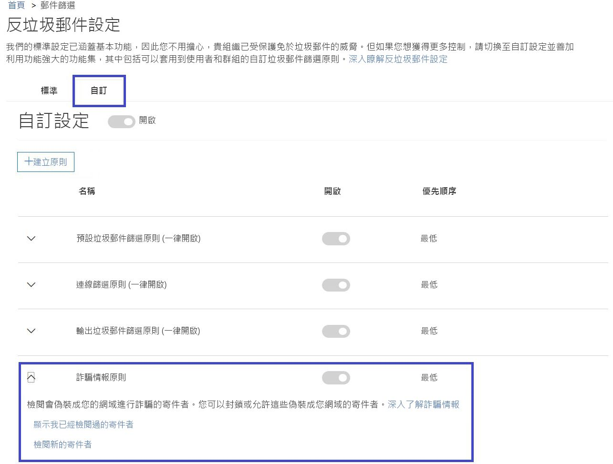

# 深入了解詐騙情報Learn more about spoof intelligence

請在 [反垃圾郵件設定]\*\*\*\* 頁面上的安全性與合規性中心使用詐騙情報，以檢閱欺騙貴組織網域或欺騙外部網域的所有寄件者。Use spoof intelligence in the Security &amp; Compliance Center on the **Anti-spam settings page** to review all senders who are spoofing either domains that are part of your organization, or spoofing external domains. 在 Office 365 企業版 E5 中可取得詐騙情報，也可在進階威脅防護和 (從 2018 年 10 月起) Exchange Online Protection (EOP) 中分開取得。Spoof intelligence is available as part of Office 365 Enterprise E5 or separately as part of Advanced Threat Protection (ATP) and as of October, 2018 Exchange Online Protection (EOP).

## 我可檢閱哪些類型的電子郵件，以及我應使用詐騙情報保護什麼？What types of email spoofing can I review and which should I protect against with spoof intelligence?

對於您擁有的網域，您可以檢閱欺騙您網域的所有寄件者，然後選擇允許寄件者繼續或封鎖寄件者。It enables you to review all senders who are spoofing your domain, and then choose to allow the sender to continue or block the sender. 對於外部網域，您可以允許與傳送基礎結構合併的寄件者網域，但不是個別的傳送電子郵件地址。For external domains, you can allow the sender domain combined with the sending infrastructure, although not an individual sending email address.

當寄件者偽造電子郵件地址時，他們似乎會代表貴組織的某個網域內一或多個使用者帳戶傳送郵件，或代表外部網域將郵件傳送給貴組織。When a sender spoofs an email address, they appear to be sending mail on behalf of one or more user accounts within one of your organization's domains, or an external domain sending to your organization. 令人驚訝的是，詐騙竟然有一些正當的商業理由。Surprisingly, there are some legitimate business reasons for spoofing. 例如，在下列情況下，您不會阻止寄件者欺騙您的網域：For example, in these cases, you wouldn't block the sender from spoofing your domain:

- 有第三方寄件者使用您的網域，將大量郵件傳送給您自己的員工進行公司民調。You have third-party senders who use your domain to send bulk mail to your own employees for company polls.

- 您聘用了一家外部公司，代表您產生並送出廣告或產品更新。You have hired an external company to generate and send out advertising or product updates on your behalf.

- 經常需要傳送電子郵件給貴組織內另一個人的助理。An assistant who regularly needs to send email for another person within your organization.

- 已設定要欺騙其組織的應用程式，以便透過電子郵件傳送內部通知。An application that is configured to spoof its own organization in order to send internal notifications by email.

外部網域會經常傳送偽造的電子郵件，且其中很多都有正當的理由。External domains frequently send spoofed email, and many of these reasons are legitimate. 例如，以下是當外部寄件者傳送偽造的電子郵件時的一些合法案例：For example, here are some legitimate cases when external senders send spoofed email:

- 寄件者在討論郵寄清單中，而郵寄清單將來自原始寄件者的電子郵件轉送給郵寄清單上的所有參與者。The sender is on a discussion mailing list, and the mailing list is relaying the email from the original sender to all the participants on the mailing list.

- 外部公司代表另一家公司傳送電子郵件 (例如自動報告，或軟體即服務公司)。An external company is sending email on behalf of another company (for example, an automated report, or a software-as-a-service company).

您需要一種方法來確保合法詐騙者所傳送的郵件不會遭到 Office 365 或外部電子郵件系統中的垃圾郵件篩選器攔截。You need a way to ensure that the mail sent by legitimate spoofers doesn't get caught up in spam filters in Office 365 or external email systems. Office 365 通常會將這些電子郵件視為垃圾郵件。Normally, Office 365 treats these email messages as spam. 如果您是 Office 365 系統管理員，您可以在安全性與合規性中心設定詐騙篩選條件來避免此種情況。As an Office 365 admin, you have the ability to prevent this by setting up spoof filters in the Security &amp; Compliance Center. 如果您擁有該網域，可以設定 SPF、DKIM 和 DMARC 來允許這些寄件者。If you own the domain, you can configure SPF, DKIM, and DMARC to allow for these senders.

另一方面，必須封鎖惡意詐騙者、欺騙您網域的寄件者，或要傳送垃圾郵件或網路釣魚電子郵件的外部網域。On the other hand, malicious spoofers, those senders that are spoofing your domain, or external domains, to send spam or phishing email, need to be blocked. 詐騙也是網路釣魚者取得使用者認證的常見方式。Spoofing is also a common way for phishers to get user credentials. Office 365 具有內建詐騙防護功能，可協助保護貴組織免於遭受這些惡意電子郵件的寄件者攻擊。Office 365 has built-in spoof protection to help shield your organization from senders of these malicious emails. 貴組織網域的詐騙防護一律會針對所有的 Office 365 客戶開啟，而外部網域詐騙防護則預設會針對進階威脅防護客戶和 (從 2018 年 10 月起) EOP 客戶開啟。Spoof protection for your organization's domains is always on for all Office 365 customers, and external domain spoof protection is on by default for Advanced Threat Protection customers and as of October, 2018 EOP customers as well. 若要進一步加強這項防護，請告知我們哪些寄件者已獲得授權偽造貴組織的網域並可代表您傳送電子郵件，以及是否允許任何外部網域進行偽造。To further strengthen this protection, tell us which senders are authorized to spoof your organization's domains and send email on your behalf, and if any external domains are permitted to spoof. 未經您授權的寄件者所傳送的任何電子郵件，都會被 Office 365 視為垃圾郵件或詐騙。Any email sent from a sender that you don't authorize will be treated as spam or spoofing by Office 365. 請留意欺騙您網域的寄件者，並使用安全性與合規性中心來協助我們改善詐騙情報。Keep an eye on the senders spoofing your domain and help us improve spoof intelligence by using the Security &amp; Compliance Center.

## 在安全性與合規性中心管理詐騙情報Managing spoof intelligence in the Security &amp; Compliance Center

Office 365 一律會強制執行您設定的詐騙情報原則。The spoof intelligence policy you set up is always enforced by Office 365. 您無法將該原則停用，但可以選擇您要主動進行管理的程度。You cannot disable it, but you can choose how much you want to actively manage it.

您可以檢閱正在欺騙您的網域或外部網域的寄件者，然後使用安全性與合規性中心來決定是否允許每個寄件者這麼做。You can review the senders who are spoofing your domain, or external domains, and then decide whether each sender should be allowed to do so by using the Security &amp; Compliance Center. 對於您的網域或外部網域中寄件者所偽造的每個偽裝使用者帳戶，您可以檢視下表中的資訊。For each spoofed user account that a sender spoofs from your domain or an external domain, you can view the information in the following table.

|**參數****Parameter**|**描述****Description**|
|:-----|:-----|
|寄件者Sender    |也稱為真實寄件者。Also called the true sender. 這通常是詐騙電子郵件源自的網域。This is usually the domain from which the spoof email originates. Office 365 會針對偽裝貴組織的傳送 IP 位址，判斷其指標 (PTR) DNS 記錄的網域。Office 365 determines the domain of the pointer (PTR) DNS record of the sending IP address that is spoofing your organization. 如果找不到任何網域，報告會改為顯示寄件者的 IP 位址。If no domain is found, the report displays the sender's IP address instead.    |
|偽裝的使用者Spoofed user    |遭到寄件者偽造的使用者帳戶。The user account that is being spoofed by the sender.    僅限 [內部]\*\*\*\* 索引標籤。**Internal** tab only. 此欄位包含單一電子郵件地址，或者如果寄件者正在偽造多個使用者帳戶，則包含**不只一個**電子郵件地址。This field contains a single email address, or if the sender is spoofing multiple user accounts, it contains **More than one**.    僅限 [外部]\*\*\*\* 索引標籤。**External** tab only. 外部網域只包含傳送網域，但不包含完整的電子郵件地址。External domains only contain a sending domain, and do not contain a full email address.    **秘訣！適用於系統管理員。****Tip! For advanced admins.** 偽裝的使用者是寄件者 (5322.From) 位址，也就是由郵件用戶端顯示為 [寄件者] 位址的位址。The spoofed user is the From (5322.From) address which is also the address displayed as the From address by the mail client. 這有時稱為 header.from 地址。This is sometimes called the 5322.From address. SPF 不會檢查此位址的有效性。The validity of this address is not checked by SPF.           |
|郵件數目Number of messages and bytes transmitted    |在過去 30 天內，由寄件者代表所識別偽裝寄件者傳送給貴組織的郵件數目。The number of mail messages sent by the sender to your organization on behalf of the identified spoofed sender or senders within the last 30 days.    |
|使用者抱怨數Number of user profiles    |在過去 30 天內，由使用者針對此寄件者所提出的抱怨。Complaints filed by users against this sender by your users within the last 30 days. 抱怨的形式通常為對 Microsoft 的垃圾郵件提交。Complaints are usually in the form of junk submissions to Microsoft.    |
|驗證結果Authentication result    |如果寄件者通過 Exchange Online Protection (EOP) 寄件者驗證檢查 (例如 SPF 或 DKIM)，此值為 [已通過]\*\*\*\*，如果寄件者未通過 EOP 寄件者驗證檢查，此值為 [未通過]\*\*\*\*，或者如果這些檢查的結果不明，則此值為 [未知]\*\*\*\*。This value is **Passed** if the sender passed Exchange Online Protection (EOP) sender authentication checks, such as SPF or DKIM, **Failed** if the sender failed EOP sender authentication checks, or **Unknown** if the result of these checks isn't known.    |
|決定者Decision set by    |顯示 Office 365 系統管理員或詐騙情報原則是否決定允許寄件者偽裝使用者。Shows whether the Office 365 administrator or the spoof intelligence policy determined whether or not the sender is allowed to spoof the user.    |
|上次查看Last seen    |此寄件者代表此偽裝的使用者接收郵件的最後日期。The last date on which a message was received by this sender on behalf of this spoofed user.    |
|是否已允許偽裝?Allowed to spoof?    | 顯示是否允許此寄件者代表偽裝的使用者傳送電子郵件。Displays whether or not this sender is allowed to send email on behalf of the spoofed user. 可能的值包括：Possible values include:    **是**：將允許來自此詐騙寄件者的所有偽造地址欺騙您的組織。**Yes** All spoofed addresses from this spoofing sender will be allowed to spoof your organization.    **否**：不允許來自此詐騙寄件者的偽造地址欺騙您的組織。**No** Spoofed addresses from this spoofing sender won't be allowed to spoof your organization. 而來自此寄件者的郵件將會被 Office 365 標示為垃圾郵件。Instead, messages from this sender will be marked as spam by Office 365.    **部分使用者**：如果寄件者正在偽裝多個使用者，則會允許此寄件者的部分偽造地址欺騙貴組織，而其餘的地址將會被標示為垃圾郵件。**Some users** If a sender is spoofing multiple users, some spoofed addresses from this sender will be allowed to spoof your organization, the rest will be marked as spam. 使用 [詳細]\*\*\*\* 索引標籤來查看特定地址。Use the **Detailed** tab to see the specific addresses.    |
|詐騙類型Spoof Type    |如果網域是貴組織的其中一個佈建網域，則此值為 [內部]\*\*\*\*，否則為 [外部]\*\*\*\*。This value is **Internal** if the domain is one of your organization's provisioned domains, otherwise the value is **External**.    |

 **使用安全性與合規性中心來管理欺騙您網域的寄件者****To manage senders who are spoofing your domain by using the Security &amp; Compliance Center**

1. 前往[安全性與合規性中心](https://protection.office.com)。Go to the Security & Compliance Center ([&amp;](https://protection.office.com)).

2. 使用您的公司或學校帳戶登入 Office 365。Sign in to Office 365 with your work or school account. 您的帳戶必須具備您的 Office 365 組織中的系統管理員認證。Your account must have administrator credentials in your Office 365 organization.

3. 在安全性與合規性中心，展開 [威脅管理]\*\*\*\* \> [原則]\*\*\*\* \> [反垃圾郵件]\*\*\*\*。In the Security &amp; Compliance Center, expand **Threat Management** \> **Policy** \> **Anti-spam**.

    

4. 在右側窗格的 [反垃圾郵件設定]\*\*\*\* 頁面上，選取 [自訂]\*\*\*\* 索引標籤，然後向下捲動並展開 [詐騙情報原則]\*\*\*\*。On the **Anti-spam settings** page in the right pane, select the **Custom** tab, and then scroll down and expand **Spoof intelligence policy**.

    

5. 若要檢視欺騙您網域的寄件者清單，請選擇 [檢閱新的寄件者]\*\*\*\*，然後選取 [您的網域]\*\*\*\* 索引標籤。To view the list of senders spoofing your domain, choose **Review new senders** and select the **Your Domains** tab.

    如果您已經檢閱寄件者，而且想要變更先前的某些選擇，您可改為選擇 [顯示我已經檢閱的寄件者]\*\*\*\*。If you've already reviewed senders, and want to change some of your previous choices, you can choose **Show me senders I already reviewed** instead. 在任一種情況下，下列面板都會出現。In either case, the following panel appears.

    

    每個偽裝的使用者都會顯示在個別的列中，以便您選擇要允許或阻止寄件者個別地偽裝每位使用者。Each spoofed user is displayed in a separate row so that you can choose whether to allow or block the sender from spoofing each user individually.

    若要將寄件者新增至使用者的允許清單，請從 [是否已允許偽裝]\*\*\*\* 欄中選取 [是]\*\*\*\*。To add a sender to the allow list for a user, select **Yes** from the **Allowed to spoof** column. 若要將寄件者新增至使用者的封鎖清單，請選擇 [否]\*\*\*\*。To add a sender to the block list for a user, choose **No**.

    若要設定不屬於您網域的原則，請選取 [外部網域]\*\*\*\* 索引標籤。將寄件者的 [是否已允許偽裝]\*\*\*\* 欄變更為 [是]\*\*\*\*，可允許該寄件者將未經驗證的電子郵件傳送到貴組織。To set the policy for domains you do not own, select the **External Domains** tab. Change any sender to **Yes** in the **Allowed to Spoof** column to permit that sender to send unauthenticated email into your organization. 或者，如果您認為 Office 365 在允許寄件者傳送偽造的電子郵件時犯了錯誤，請將 [是否已允許偽裝]\*\*\*\* 欄變更為 [否]\*\*\*\*。Alternatively, if you think Office 365 has made a mistake in permitting the sender to send spoofed email, change the **Allowed to spoof** column to **No**.

    

6. 選擇 [儲存]\*\*\*\* 以儲存所有變更。Click **Save** to save any changes that were made.

如果您具有 Office 365 企業版 E5 訂用帳戶，或已另外購買進階威脅防護作為附加元件，您也可以透過[詐騙情報見解](https://docs.microsoft.com/office365/securitycompliance/walkthrough-spoof-intelligence-insight)來管理欺騙您網域的寄件者。If you have an Office 365 Enterprise E5 subscription or have separately purchased Advanced Threat Protection as an add-on, you can also manage senders who are spoofing your domain through the [Spoof Intelligence Insight](https://docs.microsoft.com/office365/securitycompliance/walkthrough-spoof-intelligence-insight).

## 設定反詐騙原則Configuring the anti-spoofing policy

除了允許或封鎖特定寄件者將偽造的電子郵件傳送到貴組織之外，您也可以設定篩選條件的嚴格程度，以及在發現詐騙郵件時所要採取的動作。In addition to allowing or blocking a particular sender from sending spoofed email into your organization, you can also configure how strict you want the filter to be, and the action to take when a spoofing message is found.

反詐騙防護會套用到來自您的 Office 365 組織外部網域寄件者的電子郵件。Anti-spoofing protection is applied to email from senders from domains that are external to your Office 365 organization. 您可以將原則套用到其信箱獲得 Office 365 企業版 E5、進階威脅防護及 (從 2018 年 10 月起) EOP 客戶授權的收件者。You can apply the policy to recipients whose mailboxes are licensed for Office 365 Enterprise E5, Advanced Threat Protection and as of October, 2018 EOP customers as well. 您可管理反詐騙原則及其他反網路釣魚設定。You manage the anti-spoofing policy along with the other anti-phishing settings. 如需反網路釣魚設定的詳細資訊，請參閱[設定 Office 365 ATP 防網路釣魚功能及防網路釣魚原則](set-up-anti-phishing-policies.md)。For more information about anti-phishing settings, see [Set up Office 365 ATP anti-phishing and anti-phishing policies](set-up-anti-phishing-policies.md).

Office 365 包括一律會執行的預設反詐騙防護。Office 365 includes default anti-spoofing protection that's always running. 此預設防護不會顯示於安全性與合規性中心，也無法透過 Windows PowerShell Cmdlet 擷取。This default protection is not visible in the Security &amp; Compliance Center or retrievable through Windows PowerShell cmdlets. 您無法修改預設反詐騙防護。You can't modify the default anti-spoofing protection. 然而，您可設定 Office 365 在您所建立的每個反網路釣魚原則中強制執行反欺騙防護的嚴格程序。Instead, you can configure how strictly Office 365 enforces the anti-spoofing protection in each anti-phishing policy that you create.

即使反詐騙原則顯示在安全性與合規性中心的反網路釣魚原則底下，也不會從反垃圾郵件設定之下的現有網路釣魚設定繼承其預設行為。Even though the anti-spoofing policy appears under the anti-phishing policy in the Security &amp; Compliance Center, it does not inherit its default behavior from the existing phishing setting under the Anti-spam configuration. 如果在 [反垃圾郵件]\*\*\*\* \> [網路釣魚]\*\*\*\* 之下有要針對反詐騙複寫的設定，您就需要建立反網路釣魚策略，然後編輯反網路釣魚原則的詐騙部分來反映您的詐騙設定 (如下一節所述)，而不是接受在背景中執行的預設設定。If you have settings under **Anti-spam** \> **Phishing** that you want to replicate for anti-spoofing, you will need to create an anti-phishing policy, then edit the spoof portion of the anti-phishing policy to reflect your spoof settings as described in the following section, rather than accepting the default settings that run in the background.

 **使用安全性與合規性中心來設定反網路釣魚原則內的反詐騙防護****To configure anti-spoofing protection within an anti-phishing policy by using the Security &amp; Compliance Center**

1. 前往[安全性與合規性中心](https://protection.office.com)。Go to the Security & Compliance Center ([&amp;](https://protection.office.com)).

2. 使用您的公司或學校帳戶登入 Office 365。Sign in to Office 365 with your work or school account. 您的帳戶必須具備您的 Office 365 組織中的系統管理員認證。Your account must have administrator credentials in your Office 365 organization.

3. 在安全性與合規性中心，展開 [威脅管理]\*\*\*\* \> [原則]\*\*\*\* \> [反網路釣魚]\*\*\*\*。In the Security &amp; Compliance Center, expand **Threat Management** \> **Policy** \> **Anti-phishing**.

4. 在右側窗格的 [反網路釣魚]\*\*\*\* 頁面上，選取您要設定的反網路釣魚原則。On the **Anti-phishing** page in the right pane, select the anti-phishing policy you want to configure.

5. 在出現的頁面上，於 [詐騙]\*\*\*\* 列中，選擇 [編輯]\*\*\*\*。On the page that appears, in the **Spoof** row, choose **Edit**.

6. 接下來，設定在偵測到跨網域詐騙的郵件時所要採取的動作。Next, configure the actions to take when a message is detected as a cross-domain spoof. 預設行為是將郵件移至收件者的垃圾郵件資料夾。The default behavior is to move the message to the recipient's junk email folder. 另一個選項是將郵件傳送至隔離區。The other option is to send the message to the quarantine. 如需管理傳送至隔離區的郵件的詳細資訊，請參閱[在 Office 365 中隔離電子郵件](quarantine-email-messages.md)。For more information about managing messages sent to quarantine, see [Quarantine email messages in Office 365](quarantine-email-messages.md).

    

7. 進行選擇，然後選擇 [儲存]\*\*\*\*。Make your choice and then choose **Save**.

## 使用 Office 365 管理詐騙和網路釣魚的其他方法Other ways to manage spoofing and phishing with Office 365

勤於進行詐騙和網路釣魚防護。Be diligent about spoofing and phishing protection. 以下是檢查欺騙您網域的寄件者並協助防止他們破壞貴組織的相關方式：Here are related ways to check on senders spoofing your domain and help prevent them from damaging your organization:

- 在例行工作中檢查 Exchange Online Protection 詐騙郵件報告。Check the Exchange Online Protection spoof mail report as part of your routine. 您通常可使用此報告來檢視及協助管理偽裝的寄件者。You can use this report often to view and help manage spoofed senders. 如需相關資訊，請參閱[使用 Office 365 的郵件保護報告以檢視有關惡意程式碼、垃圾郵件和規則偵測的資訊](https://docs.microsoft.com/exchange/monitoring/use-mail-protection-reports)中的 [詐騙郵件報告]\*\*\*\*。For more information, see Use mail protection reports in Office 365 to view data about malware, spam, and rule detections.

如需更多進階 Office 365 系統管理，您也可以完成下列檢查：For more advanced Office 365 admins, you can also complete these checks:

- 檢閱寄件者原則架構 (SPF) 設定。Review your Sender Policy Framework (SPF) configuration. 如需 SPF 的快速簡介並快速設定，請參閱[在 Office 365 中設定 SPF 以協助防止詐騙](set-up-spf-in-office-365-to-help-prevent-spoofing.md)。For a quick introduction to SPF and to get it configured quickly, see [Set up SPF in Office 365 to help prevent spoofing](set-up-spf-in-office-365-to-help-prevent-spoofing.md). 如需更深入了解 Office 365 如何使用 SPF 或是進行疑難排解或非標準的部署 (例如混合式部署)，請先參閱 [Office 365 如何使用寄件者原則架構 (SPF) 防止詐騙](how-office-365-uses-spf-to-prevent-spoofing.md)。For a more in-depth understanding of how Office 365 uses SPF, or for troubleshooting or non-standard deployments such as hybrid deployments, start with [How Office 365 uses Sender Policy Framework (SPF) to prevent spoofing](how-office-365-uses-spf-to-prevent-spoofing.md).

- 檢閱您的網域金鑰識別郵件 (DKIM) 設定。Review your DomainKeys Identified Mail (DKIM) configuration. 除了 SPF 和 DMARC 以外，您也應使用 DKIM，以避免詐騙程式傳送看似來自您的網域的郵件。You should use DKIM in addition to SPF and DMARC to help prevent spoofers from sending messages that look like they are coming from your domain. DKIM 可讓您在郵件標頭中將數位簽章新增到電子郵件。DKIM lets you add a digital signature to email messages in the message header. 如需相關資訊，請參閱[在 Office 365 中使用 DKIM 驗證從自訂網域傳送的外寄電子郵件](use-dkim-to-validate-outbound-email.md)。For information about DKIM and Office 365, see [Use DKIM to validate outbound email sent from your domain in Office 365](use-dkim-to-validate-outbound-email.md).

- 檢閱以網域為基礎的訊息認證、報告與一致性 (DMARC) 設定。Domain-based Message Authentication, Reporting, and Conformance (DMARC). 搭配 SPF 和 DKIM 來實作 DMARC 可提供額外保護，防範詐騙和網路釣魚電子郵件。Implementing DMARC with SPF and DKIM provides additional protection against spoofing and phishing email. DMARC 可協助接收方郵件系統決定如何處理未通過 SPF 或 DKIM 檢查的您網域傳送的郵件。DMARC helps receiving mail systems determine what to do with messages sent from your domain that fail SPF or DKIM checks. 如需相關資訊，請參閱[在 Office 365 中使用 DMARC 來驗證電子郵件](use-dmarc-to-validate-email.md)。For information on setting up DMARC, see [Use DMARC to validate email in Office 365](use-dmarc-to-validate-email.md).

- 在 Exchange Online PowerShell 或 Exchange Online Protection PowerShell 中使用 [Get-PhishFilterPolicy](https://docs.microsoft.com/powershell/module/exchange/advanced-threat-protection/get-phishfilterpolicy) Cmdlet，收集偽裝的寄件者詳細資料、產生允許和封鎖清單，以及協助您判斷如何產生更完整的 SPF、DKIM 和 DMARC DNS 記錄，而不會讓合法的電子郵件遭到外部垃圾郵件篩選器攔截。Use the [Get-PhishFilterPolicy](https://docs.microsoft.com/powershell/module/exchange/advanced-threat-protection/get-phishfilterpolicy) cmdlet in Exchange Online PowerShell or Exchange Online Protection PowerShell to gather detailed data on spoofed senders, generate allow and block lists, and help you determine how to generate more comprehensive SPF, DKIM, and DMARC DNS records without having your legitimate email get caught in external spam filters. 如需詳細資訊，請參閱 [Office 365 中反詐騙防護的運作方式](https://blogs.msdn.microsoft.com/tzink/2016/02/23/how-antispoofing-protection-works-in-office-365/)。For more information, see [How antispoofing protection works in Office 365](https://blogs.msdn.microsoft.com/tzink/2016/02/23/how-antispoofing-protection-works-in-office-365/).
