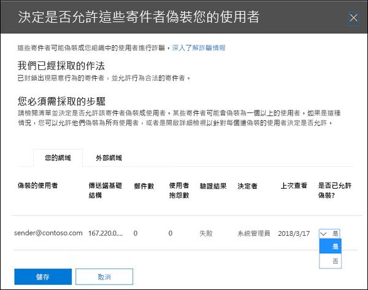

# <a name="configure-spoof-intelligence-in-eop"></a><span data-ttu-id="b3916-103">在 EOP 中設定欺騙情報</span><span class="sxs-lookup"><span data-stu-id="b3916-103">Configure spoof intelligence in EOP</span></span>

[!INCLUDE [Microsoft 365 Defender rebranding](../includes/microsoft-defender-for-office.md)]


<span data-ttu-id="b3916-104">在使用 Exchange Online 或獨立 Exchange online (Protection 中信箱的 Microsoft 365 組織中，EOP) 組織沒有 Exchange Online 信箱時，會自動保護輸入的電子郵件，避免在10月2018的情況下受到 EOP 的欺騙。</span><span class="sxs-lookup"><span data-stu-id="b3916-104">In Microsoft 365 organizations with mailboxes in Exchange Online or standalone Exchange Online Protection (EOP) organizations without Exchange Online mailboxes, inbound email messages are automatically protected against spoofing by EOP as of October 2018.</span></span> <span data-ttu-id="b3916-105">EOP 會使用哄騙情報做為組織對網路釣魚的整體防護的一部分。</span><span class="sxs-lookup"><span data-stu-id="b3916-105">EOP uses spoof intelligence as part of your organization's overall defense against phishing.</span></span> <span data-ttu-id="b3916-106">如需詳細資訊，請參閱 [EOP 中的反欺詐防護](anti-spoofing-protection.md)。</span><span class="sxs-lookup"><span data-stu-id="b3916-106">For more information, see [Anti-spoofing protection in EOP](anti-spoofing-protection.md).</span></span>

<span data-ttu-id="b3916-107">當寄件者欺騙電子郵件地址時，他們似乎是組織網域之一中的使用者，或是將電子郵件傳送至您組織的外部網域中的使用者。</span><span class="sxs-lookup"><span data-stu-id="b3916-107">When a sender spoofs an email address, they appear to be a user in one of your organization's domains, or a user in an external domain that sends email to your organization.</span></span> <span data-ttu-id="b3916-108">欺騙寄件者以傳送垃圾郵件或網路釣魚電子郵件的攻擊者必須封鎖。</span><span class="sxs-lookup"><span data-stu-id="b3916-108">Attackers who spoof senders to send spam or phishing email need to be blocked.</span></span> <span data-ttu-id="b3916-109">但在某些情況下，合法寄件者是哄騙。</span><span class="sxs-lookup"><span data-stu-id="b3916-109">But there are scenarios where legitimate senders are spoofing.</span></span> <span data-ttu-id="b3916-110">例如：</span><span class="sxs-lookup"><span data-stu-id="b3916-110">For example:</span></span>

- <span data-ttu-id="b3916-111">欺騙內部網域的合法案例：</span><span class="sxs-lookup"><span data-stu-id="b3916-111">Legitimate scenarios for spoofing internal domains:</span></span>

  - <span data-ttu-id="b3916-112">協力廠商寄件者使用您的網域將大宗郵件傳送給您自己的員工，以進行公司投票。</span><span class="sxs-lookup"><span data-stu-id="b3916-112">Third-party senders use your domain to send bulk mail to your own employees for company polls.</span></span>
  - <span data-ttu-id="b3916-113">外部公司代表您產生及傳送廣告或產品更新。</span><span class="sxs-lookup"><span data-stu-id="b3916-113">An external company generates and sends advertising or product updates on your behalf.</span></span>
  - <span data-ttu-id="b3916-114">助理定期需要在組織內傳送其他人員的電子郵件。</span><span class="sxs-lookup"><span data-stu-id="b3916-114">An assistant regularly needs to send email for another person within your organization.</span></span>
  - <span data-ttu-id="b3916-115">內部應用程式會傳送電子郵件通知。</span><span class="sxs-lookup"><span data-stu-id="b3916-115">An internal application sends email notifications.</span></span>

- <span data-ttu-id="b3916-116">欺騙外部網域的合法案例：</span><span class="sxs-lookup"><span data-stu-id="b3916-116">Legitimate scenarios for spoofing external domains:</span></span>

  - <span data-ttu-id="b3916-117">寄件者位於郵寄清單中 (又稱為討論清單) ，而且郵寄清單會將來自原始寄件者的電子郵件轉送至郵寄清單上的所有參與者。</span><span class="sxs-lookup"><span data-stu-id="b3916-117">The sender is on a mailing list (also known as a discussion list), and the mailing list relays email from the original sender to all the participants on the mailing list.</span></span>
  - <span data-ttu-id="b3916-118">外部公司代表其他公司傳送電子郵件 (例如，自動化報表或軟體即服務公司) 。</span><span class="sxs-lookup"><span data-stu-id="b3916-118">An external company sends email on behalf of another company (for example, an automated report or a software-as-a-service company).</span></span>

<span data-ttu-id="b3916-119">假冒情報，尤其是預設 (，而且只) 欺詐智慧原則，可協助確保合法寄件者所傳送的欺騙電子郵件不會陷入 EOP 垃圾郵件篩選器或外部電子郵件系統中，同時也會保護您的使用者免受垃圾郵件或網路釣魚攻擊。</span><span class="sxs-lookup"><span data-stu-id="b3916-119">Spoof intelligence, and specifically the default (and only) spoof intelligence policy, helps ensure that the spoofed email sent by legitimate senders doesn't get caught up in EOP spam filters or external email systems, while protecting your users from spam or phishing attacks.</span></span>

<span data-ttu-id="b3916-120">您可以在 Security & 合規性中心或 PowerShell (Exchange online 中的 Exchange Online PowerShell 中管理欺騙智慧; 在 Exchange Online 中，您可以使用信箱來管理 Microsoft 365 組織沒有 Exchange Online 信箱) 之組織的獨立 EOP PowerShell。</span><span class="sxs-lookup"><span data-stu-id="b3916-120">You can manage spoof intelligence in the Security & Compliance Center, or in PowerShell (Exchange Online PowerShell for Microsoft 365 organizations with mailboxes in Exchange Online; standalone EOP PowerShell for organizations without Exchange Online mailboxes).</span></span>

## <a name="what-do-you-need-to-know-before-you-begin"></a><span data-ttu-id="b3916-121">開始之前有哪些須知？</span><span class="sxs-lookup"><span data-stu-id="b3916-121">What do you need to know before you begin?</span></span>

- <span data-ttu-id="b3916-122">您要在 <https://protection.office.com/> 開啟安全性與合規性中心。</span><span class="sxs-lookup"><span data-stu-id="b3916-122">You open the Security & Compliance Center at <https://protection.office.com/>.</span></span> <span data-ttu-id="b3916-123">若要直接移至 [反垃圾郵件設定] 頁面，請使用 <https://protection.office.com/antispam>。</span><span class="sxs-lookup"><span data-stu-id="b3916-123">To go directly to the **Anti-spam settings** page, use <https://protection.office.com/antispam>.</span></span> <span data-ttu-id="b3916-124">若要直接移至 [ **反網路釣魚** ] 頁面，請使用 <https://protection.office.com/antiphishing> 。</span><span class="sxs-lookup"><span data-stu-id="b3916-124">To go directly to the **Anti-phishing** page, use <https://protection.office.com/antiphishing>.</span></span>

- <span data-ttu-id="b3916-125">若要連線至 Exchange Online PowerShell，請參閱[連線至 Exchange Online PowerShell](https://docs.microsoft.com/powershell/exchange/connect-to-exchange-online-powershell)。</span><span class="sxs-lookup"><span data-stu-id="b3916-125">To connect to Exchange Online PowerShell, see [Connect to Exchange Online PowerShell](https://docs.microsoft.com/powershell/exchange/connect-to-exchange-online-powershell).</span></span> <span data-ttu-id="b3916-126">若要連接至獨立版 EOP PowerShell，請參閱[連線到 Exchange Online Protection PowerShell](https://docs.microsoft.com/powershell/exchange/connect-to-exchange-online-protection-powershell)。</span><span class="sxs-lookup"><span data-stu-id="b3916-126">To connect to standalone EOP PowerShell, see [Connect to Exchange Online Protection PowerShell](https://docs.microsoft.com/powershell/exchange/connect-to-exchange-online-protection-powershell).</span></span>

- <span data-ttu-id="b3916-127">您必須已獲派權限，才能進行此主題中的程序:</span><span class="sxs-lookup"><span data-stu-id="b3916-127">You need to be assigned permissions before you can do the procedures in this topic:</span></span>

  - <span data-ttu-id="b3916-128">若要修改欺騙性智慧原則或啟用或停用欺騙智慧，您必須是下列其中一個角色群組的成員：</span><span class="sxs-lookup"><span data-stu-id="b3916-128">To modify the spoof intelligence policy or enable or disable spoof intelligence, you need to be a member of one of the following role groups:</span></span>

    - <span data-ttu-id="b3916-129">**組織管理** 或 [安全性 & 規範中心](permissions-in-the-security-and-compliance-center.md) 的 **安全性系統管理員** 。 </span><span class="sxs-lookup"><span data-stu-id="b3916-129">**Organization Management** or **Security Administrator** in the [Security & Compliance Center](permissions-in-the-security-and-compliance-center.md).</span></span>
    - <span data-ttu-id="b3916-130">**組織管理** 或 [線上交換](https://docs.microsoft.com/Exchange/permissions-exo/permissions-exo#role-groups) 中的 **檢疫管理** 。</span><span class="sxs-lookup"><span data-stu-id="b3916-130">**Organization Management** or **Hygiene Management** in [Exchange Online](https://docs.microsoft.com/Exchange/permissions-exo/permissions-exo#role-groups).</span></span>

  - <span data-ttu-id="b3916-131">若要取得欺騙智慧原則的唯讀存取權，您必須是下列其中一個角色群組的成員：</span><span class="sxs-lookup"><span data-stu-id="b3916-131">For read-only access to the spoof intelligence policy, you need to be a member of one of the following role groups:</span></span>

    - <span data-ttu-id="b3916-132">[安全性與合規性中心](permissions-in-the-security-and-compliance-center.md) 中的 **安全讀者** 。</span><span class="sxs-lookup"><span data-stu-id="b3916-132">**Security Reader** in the [Security & Compliance Center](permissions-in-the-security-and-compliance-center.md).</span></span>
    - <span data-ttu-id="b3916-133">[線上交換](https://docs.microsoft.com/Exchange/permissions-exo/permissions-exo#role-groups) 中的 **僅檢視組織管理** 。</span><span class="sxs-lookup"><span data-stu-id="b3916-133">**View-Only Organization Management** in [Exchange Online](https://docs.microsoft.com/Exchange/permissions-exo/permissions-exo#role-groups).</span></span>

- <span data-ttu-id="b3916-134">如需適用于哄騙情報的建議設定，請參閱 [EOP 預設的反網路釣魚原則設定](recommended-settings-for-eop-and-office365-atp.md#eop-default-anti-phishing-policy-settings)。</span><span class="sxs-lookup"><span data-stu-id="b3916-134">For our recommended settings for spoof intelligence, see [EOP default anti-phishing policy settings](recommended-settings-for-eop-and-office365-atp.md#eop-default-anti-phishing-policy-settings).</span></span>

## <a name="use-the-security--compliance-center-to-manage-spoofed-senders"></a><span data-ttu-id="b3916-135">使用安全性 & 規範中心管理欺騙寄件者</span><span class="sxs-lookup"><span data-stu-id="b3916-135">Use the Security & Compliance Center to manage spoofed senders</span></span>

> [!NOTE]
> <span data-ttu-id="b3916-136">如果您有 Microsoft 365 企業版 E5 訂閱或已個別購買 Microsoft Defender for Office 365 附加元件，您也可以管理透過 [欺騙智慧洞察力](walkthrough-spoof-intelligence-insight.md)欺騙您網域的寄件者。</span><span class="sxs-lookup"><span data-stu-id="b3916-136">If you have an Microsoft 365 Enterprise E5 subscription or have separately purchased an Microsoft Defender for Office 365 add-on, you can also manage senders who are spoofing your domain through the [Spoof Intelligence insight](walkthrough-spoof-intelligence-insight.md).</span></span>

1. <span data-ttu-id="b3916-137">在安全性與合規性中心，移至 [威脅管理] \> [原則] \> [反垃圾郵件]。</span><span class="sxs-lookup"><span data-stu-id="b3916-137">In the Security & Compliance Center, go to **Threat management** \> **Policy** \> **Anti-spam**.</span></span>

2. <span data-ttu-id="b3916-138">在 [ **反垃圾郵件設定** ] 頁面上，按一下 [ ![ 展開圖示] ](../../media/scc-expand-icon.png) 以展開 [ **欺騙智慧原則** ]。</span><span class="sxs-lookup"><span data-stu-id="b3916-138">On the **Anti-spam settings** page, click  to expand **Spoof intelligence policy**.</span></span>

   

3. <span data-ttu-id="b3916-140">進行下列其中一項選擇：</span><span class="sxs-lookup"><span data-stu-id="b3916-140">Make one of the following selections:</span></span>

   - <span data-ttu-id="b3916-141">**審閱新寄件者**</span><span class="sxs-lookup"><span data-stu-id="b3916-141">**Review new senders**</span></span>
   - <span data-ttu-id="b3916-142">**顯示已經過審閱的寄件者**</span><span class="sxs-lookup"><span data-stu-id="b3916-142">**Show me senders I already reviewed**</span></span>

4. <span data-ttu-id="b3916-143">在 [ **決定是否允許這些寄件者哄騙您** 顯示的使用者] 浮出項目時，選取下列其中一個索引標籤：</span><span class="sxs-lookup"><span data-stu-id="b3916-143">In the **Decide if these senders are allowed to spoof your users** flyout that appears, select one of the following tabs:</span></span>

   - <span data-ttu-id="b3916-144">**您的網域** ：寄件者哄騙您內部網域中的使用者。</span><span class="sxs-lookup"><span data-stu-id="b3916-144">**Your Domains** : Senders spoofing users in your internal domains.</span></span>
   - <span data-ttu-id="b3916-145">**外部網域** ：寄件者哄騙外部網域中的使用者。</span><span class="sxs-lookup"><span data-stu-id="b3916-145">**External Domains** : Senders spoofing users in external domains.</span></span>

5. <span data-ttu-id="b3916-146">按一下  [ **允許欺騙？** ] 欄中的展開圖示。</span><span class="sxs-lookup"><span data-stu-id="b3916-146">Click  in the **Allowed to spoof?** column.</span></span> <span data-ttu-id="b3916-147">選擇 **[是]** 允許冒牌寄件者，或選擇 [ **否** ] 將郵件標示為欺騙。</span><span class="sxs-lookup"><span data-stu-id="b3916-147">Choose **Yes** to allow the spoofed sender, or choose **No** to mark the message as spoofed.</span></span> <span data-ttu-id="b3916-148">此巨集指令是由預設的反網路釣魚原則或自訂的反網路釣魚原則所控制 (預設值會將 **郵件移至 [垃圾郵件] 資料夾** ) 。</span><span class="sxs-lookup"><span data-stu-id="b3916-148">The action is controlled by the default anti-phishing policy or custom anti-phishing policies (the default value is **Move message to Junk Email folder** ).</span></span> <span data-ttu-id="b3916-149">如需詳細資訊，請參閱 [反網路釣魚原則中的欺騙設定](set-up-anti-phishing-policies.md#spoof-settings)。</span><span class="sxs-lookup"><span data-stu-id="b3916-149">For more information, see [Spoof settings in anti-phishing policies](set-up-anti-phishing-policies.md#spoof-settings).</span></span>

   

   <span data-ttu-id="b3916-151">下列清單說明您所看到的欄和值：</span><span class="sxs-lookup"><span data-stu-id="b3916-151">The columns and values that you see are explained in the following list:</span></span>

   - <span data-ttu-id="b3916-152">**欺騙使用者** ：已欺騙的使用者帳戶。</span><span class="sxs-lookup"><span data-stu-id="b3916-152">**Spoofed user** : The user account that's being spoofed.</span></span> <span data-ttu-id="b3916-153">這是寄件者位址 (中的郵件寄件者，也稱為 `5322.From` 電子郵件客戶程式中顯示的位址) 。</span><span class="sxs-lookup"><span data-stu-id="b3916-153">This is the message sender in the From address (also known as the `5322.From` address) that's shown in email clients.</span></span> <span data-ttu-id="b3916-154">SPF 不會檢查此位址的有效性。</span><span class="sxs-lookup"><span data-stu-id="b3916-154">The validity of this address is not checked by SPF.</span></span>

     - <span data-ttu-id="b3916-155">在 [ **您的網域** ] 索引標籤上，此值會包含單一電子郵件地址，或如果來源電子郵件伺服器是哄騙多個使用者帳戶，它會包含 **一個以上** 的使用者帳戶。</span><span class="sxs-lookup"><span data-stu-id="b3916-155">On the **Your Domains** tab, the value contains a single email address, or if the source email server is spoofing multiple user accounts, it contains **More than one**.</span></span>

     - <span data-ttu-id="b3916-156">在 [ **外部網域** ] 索引標籤上，此值包含欺騙使用者的網域，而非完整的電子郵件地址。</span><span class="sxs-lookup"><span data-stu-id="b3916-156">On the **External Domains** tab, the value contains the domain of the spoofed user, not the full email address.</span></span>

   - <span data-ttu-id="b3916-157">傳送 **基礎結構** ：反向 DNS 查閱 (PTR 記錄) 來源電子郵件伺服器的 IP 位址，或 IP 位址（如果來源沒有 PTR 記錄）中找到的網域。</span><span class="sxs-lookup"><span data-stu-id="b3916-157">**Sending Infrastructure** : The domain found in a reverse DNS lookup (PTR record) of the source email server's IP address, or the IP address if the source has no PTR record.</span></span>

     <span data-ttu-id="b3916-158">如需郵件來源和郵件寄件者的詳細資訊，請參閱 [電子郵件標準的概述](how-office-365-validates-the-from-address.md#an-overview-of-email-message-standards)。</span><span class="sxs-lookup"><span data-stu-id="b3916-158">For more information about message sources and message senders, see [An overview of email message standards](how-office-365-validates-the-from-address.md#an-overview-of-email-message-standards).</span></span>

   - <span data-ttu-id="b3916-159">**郵件** 數目：在過去30天內，來自組織的傳送基礎結構中包含指定的欺騙寄件者或寄件者的郵件數目。</span><span class="sxs-lookup"><span data-stu-id="b3916-159">**# of messages** : The number of messages from the sending infrastructure to your organization that contain the specified spoofed sender or senders within the last 30 days.</span></span>

   - <span data-ttu-id="b3916-160">**使用者抱怨** ：過去30天內，使用者對此寄件者所進行的投訴。</span><span class="sxs-lookup"><span data-stu-id="b3916-160">**# of user complaints** : Complaints filed by your users against this sender within the last 30 days.</span></span> <span data-ttu-id="b3916-161">抱怨的形式通常為對 Microsoft 的垃圾郵件提交。</span><span class="sxs-lookup"><span data-stu-id="b3916-161">Complaints are usually in the form of junk submissions to Microsoft.</span></span>

   - <span data-ttu-id="b3916-162">**驗證結果** ：下列其中一個值：</span><span class="sxs-lookup"><span data-stu-id="b3916-162">**Authentication result** : One of the following values:</span></span>

      - <span data-ttu-id="b3916-163">**傳遞** ：寄件者傳送寄件者電子郵件驗證檢查 (SPF 或 DKIM) 。</span><span class="sxs-lookup"><span data-stu-id="b3916-163">**Passed** : The sender passed sender email authentication checks (SPF or DKIM).</span></span>
      - <span data-ttu-id="b3916-164">**失敗** ：寄件者失敗 EOP 寄件者驗證檢查。</span><span class="sxs-lookup"><span data-stu-id="b3916-164">**Failed** : The sender failed EOP sender authentication checks.</span></span>
      - <span data-ttu-id="b3916-165">**未知** ：這些檢查的結果是未知的。</span><span class="sxs-lookup"><span data-stu-id="b3916-165">**Unknown** : The result of these checks isn't known.</span></span>

   - <span data-ttu-id="b3916-166">**決策設定依據** ：顯示誰決定了傳送基礎結構是否允許哄騙使用者：</span><span class="sxs-lookup"><span data-stu-id="b3916-166">**Decision set by** : Shows who determined if the sending infrastructure is allowed to spoof the user:</span></span>

       - <span data-ttu-id="b3916-167">**欺騙性智慧原則** (自動) </span><span class="sxs-lookup"><span data-stu-id="b3916-167">**Spoof intelligence policy** (automatic)</span></span>
       - <span data-ttu-id="b3916-168">**Admin** (手動) </span><span class="sxs-lookup"><span data-stu-id="b3916-168">**Admin** (manual)</span></span>

   - <span data-ttu-id="b3916-169">**上次看到** ：從包含欺騙使用者之傳送基礎結構接收郵件的最後日期。</span><span class="sxs-lookup"><span data-stu-id="b3916-169">**Last seen** : The last date when a message was received from the sending infrastructure that contains the spoofed user.</span></span>

   - <span data-ttu-id="b3916-170">是否 **允許哄騙？** ：您在這裡看到的值包括：</span><span class="sxs-lookup"><span data-stu-id="b3916-170">**Allowed to spoof?** : The values that you see here are:</span></span>

     - <span data-ttu-id="b3916-171">**Yes** ：允許虛假使用者和傳送基礎結構組合的郵件，也不會被視為欺騙電子郵件。</span><span class="sxs-lookup"><span data-stu-id="b3916-171">**Yes** : Messages from the combination of spoofed user and sending infrastructure are allowed and not treated as spoofed email.</span></span>

     - <span data-ttu-id="b3916-172">**No** ：來自欺騙使用者和傳送基礎結構的郵件會標示為欺騙。</span><span class="sxs-lookup"><span data-stu-id="b3916-172">**No** : Messages from the combination of spoofed user and sending infrastructure are marked as spoofed.</span></span> <span data-ttu-id="b3916-173">此巨集指令是由預設的反網路釣魚原則或自訂的反網路釣魚原則所控制 (預設值會將 **郵件移至 [垃圾郵件] 資料夾** ) 。</span><span class="sxs-lookup"><span data-stu-id="b3916-173">The action is controlled by the default anti-phishing policy or custom anti-phishing policies (the default value is **Move message to Junk Email folder** ).</span></span> <span data-ttu-id="b3916-174">如需詳細資訊，請參閱下一節。</span><span class="sxs-lookup"><span data-stu-id="b3916-174">See the next section for more information.</span></span>

     - <span data-ttu-id="b3916-175">**有些使用者** ( **您的網域** ] 索引標籤只) ：傳送基礎結構是哄騙多個使用者，而某些欺騙使用者則是允許的，有些則不是。</span><span class="sxs-lookup"><span data-stu-id="b3916-175">**Some users** ( **Your Domains** tab only): A sending infrastructure is spoofing multiple users, where some spoofed users are allowed and others are not.</span></span> <span data-ttu-id="b3916-176">使用 [詳細] 索引標籤來查看特定地址。</span><span class="sxs-lookup"><span data-stu-id="b3916-176">Use the **Detailed** tab to see the specific addresses.</span></span>

6. <span data-ttu-id="b3916-177">在頁面底部，按一下 [ **儲存** ]。</span><span class="sxs-lookup"><span data-stu-id="b3916-177">At the bottom of the page, click **Save**.</span></span>

## <a name="use-powershell-to-manage-spoofed-senders"></a><span data-ttu-id="b3916-178">使用 PowerShell 管理欺騙寄件者</span><span class="sxs-lookup"><span data-stu-id="b3916-178">Use PowerShell to manage spoofed senders</span></span>

<span data-ttu-id="b3916-179">若要在哄騙情報中查看允許和封鎖的寄件者，請使用下列語法：</span><span class="sxs-lookup"><span data-stu-id="b3916-179">To view allowed and blocked senders in spoof intelligence, use the following syntax:</span></span>

```powershell
Get-PhishFilterPolicy [-AllowedToSpoof <Yes | No | Partial>] [-ConfidenceLevel <Low | High>] [-DecisionBy <Admin | SpoofProtection>] [-Detailed] [-SpoofType <Internal | External>]
```

<span data-ttu-id="b3916-180">此範例會傳回所有允許哄騙您網域中使用者之寄件者的詳細資訊。</span><span class="sxs-lookup"><span data-stu-id="b3916-180">This example returns detailed information about all senders that are allowed to spoof users in your domains.</span></span>

```powershell
Get-PhishFilterPolicy -AllowedToSpoof Yes -Detailed -SpoofType Internal
```

<span data-ttu-id="b3916-181">如需詳細的語法及參數資訊，請參閱 [Get-PhishFilterPolicy](https://docs.microsoft.com/powershell/module/exchange/get-phishfilterpolicy)。</span><span class="sxs-lookup"><span data-stu-id="b3916-181">For detailed syntax and parameter information, see [Get-PhishFilterPolicy](https://docs.microsoft.com/powershell/module/exchange/get-phishfilterpolicy).</span></span>

<span data-ttu-id="b3916-182">若要在欺騙智慧中設定允許和封鎖的寄件者，請遵循下列步驟：</span><span class="sxs-lookup"><span data-stu-id="b3916-182">To configure allowed and blocked senders in spoof intelligence, follow these steps:</span></span>

1. <span data-ttu-id="b3916-183">將 **Get-PhishFilterPolicy** Cmdlet 的輸出寫入 CSV 檔案，以捕獲目前偵測到之寄件者的清單：</span><span class="sxs-lookup"><span data-stu-id="b3916-183">Capture the current list of detected spoofed senders by writing the output of the **Get-PhishFilterPolicy** cmdlet to a CSV file:</span></span>

   ```powershell
   Get-PhishFilterPolicy -Detailed | Export-CSV "C:\My Documents\Spoofed Senders.csv"
   ```

2. <span data-ttu-id="b3916-184">編輯 CSV 檔案，以新增或修改 **SpoofedUser** (電子郵件地址) 並 **AllowedToSpoof** (是或否) 值。</span><span class="sxs-lookup"><span data-stu-id="b3916-184">Edit the CSV file to add or modify the **SpoofedUser** (email address) and **AllowedToSpoof** (Yes or No) values.</span></span> <span data-ttu-id="b3916-185">儲存檔案，閱讀檔案，並將內容儲存為名為的變數 `$UpdateSpoofedSenders` ：</span><span class="sxs-lookup"><span data-stu-id="b3916-185">Save the file, read the file, and store the contents as a variable named `$UpdateSpoofedSenders`:</span></span>

   ```powershell
   $UpdateSpoofedSenders = Get-Content -Raw "C:\My Documents\Spoofed Senders.csv"
   ```

3. <span data-ttu-id="b3916-186">使用 `$UpdateSpoofedSenders` 變數來設定欺騙智慧原則：</span><span class="sxs-lookup"><span data-stu-id="b3916-186">Use the `$UpdateSpoofedSenders` variable to configure the spoof intelligence policy:</span></span>

   ```powershell
   Set-PhishFilterPolicy -Identity Default -SpoofAllowBlockList $UpdateSpoofedSenders
   ```

<span data-ttu-id="b3916-187">如需詳細的語法及參數資訊，請參閱 [Set-PhishFilterPolicy](https://docs.microsoft.com/powershell/module/exchange/set-phishfilterpolicy)。</span><span class="sxs-lookup"><span data-stu-id="b3916-187">For detailed syntax and parameter information, see [Set-PhishFilterPolicy](https://docs.microsoft.com/powershell/module/exchange/set-phishfilterpolicy).</span></span>

## <a name="use-the-security--compliance-center-to-configure-spoof-intelligence"></a><span data-ttu-id="b3916-188">使用安全性 & 規範中心設定假冒情報</span><span class="sxs-lookup"><span data-stu-id="b3916-188">Use the Security & Compliance Center to configure spoof intelligence</span></span>

<span data-ttu-id="b3916-189">欺騙性情報的設定選項會在 [反網路釣魚原則中的欺騙設定](set-up-anti-phishing-policies.md#spoof-settings)中說明。</span><span class="sxs-lookup"><span data-stu-id="b3916-189">The configuration options for spoof intelligence are described in [Spoof settings in anti-phishing policies](set-up-anti-phishing-policies.md#spoof-settings).</span></span>

<span data-ttu-id="b3916-190">您可以設定預設反網路釣魚原則中的欺騙智慧設定，也可以在 [自訂原則] 中設定。</span><span class="sxs-lookup"><span data-stu-id="b3916-190">You can configure spoof intelligence settings in the default anti-phishing policy, and also in custom policies.</span></span> <span data-ttu-id="b3916-191">如需根據您訂閱的指示，請參閱下列其中一個主題：</span><span class="sxs-lookup"><span data-stu-id="b3916-191">For instructions based on your subscription, see one of the following topics:</span></span>

- <span data-ttu-id="b3916-192">[在 EOP 中設定反網路釣魚原則](configure-anti-phishing-policies-eop.md)。</span><span class="sxs-lookup"><span data-stu-id="b3916-192">[Configure anti-phishing policies in EOP](configure-anti-phishing-policies-eop.md).</span></span>

- <span data-ttu-id="b3916-193">[在 Microsoft Defender For Office 365 中設定反網路釣魚原則](configure-atp-anti-phishing-policies.md)。</span><span class="sxs-lookup"><span data-stu-id="b3916-193">[Configure anti-phishing policies in Microsoft Defender for Office 365](configure-atp-anti-phishing-policies.md).</span></span>

## <a name="how-do-you-know-these-procedures-worked"></a><span data-ttu-id="b3916-194">如何知道這些程序是否正常運作？</span><span class="sxs-lookup"><span data-stu-id="b3916-194">How do you know these procedures worked?</span></span>

<span data-ttu-id="b3916-195">若要確認您已設定欺騙智慧與允許和不允許哄騙的寄件者，以及您已設定欺騙性智慧設定，請使用下列任何一項步驟：</span><span class="sxs-lookup"><span data-stu-id="b3916-195">To verify that you've configured spoof intelligence with senders who are allowed and not allowed to spoof, and that you've configured the spoof intelligence settings, use any of the following steps:</span></span>

- <span data-ttu-id="b3916-196">在安全性 & 規範中心內，移至 **威脅管理** \> **原則** \> **反垃圾郵件** \> 展開 **欺騙性智慧原則** \> 選取 [ **顯示我已複查的寄件者** \> ] 選取 [ **您的網域** ] 或 [ **外部網域** ] 索引標籤，然後確認寄件者的 [ **允許欺騙？** ] 值。</span><span class="sxs-lookup"><span data-stu-id="b3916-196">In the Security & Compliance Center, go to **Threat management** \> **Policy** \> **Anti-spam** \> expand **Spoof intelligence policy** \> select **Show me senders I already reviewed** \> select the **Your Domains** or **External Domains** tab, and verify the **Allowed to spoof?** value for the sender.</span></span>

- <span data-ttu-id="b3916-197">在 PowerShell 中，執行下列命令，以查看允許和不允許哄騙的寄件者：</span><span class="sxs-lookup"><span data-stu-id="b3916-197">In PowerShell, run the following commands to view the senders who are allowed and not allowed to spoof:</span></span>

  ```powershell
  Get-PhishFilterPolicy -AllowedToSpoof Yes -SpoofType Internal
  Get-PhishFilterPolicy -AllowedToSpoof No -SpoofType Internal
  Get-PhishFilterPolicy -AllowedToSpoof Yes -SpoofType External
  Get-PhishFilterPolicy -AllowedToSpoof No -SpoofType External
  ```

- <span data-ttu-id="b3916-198">在 PowerShell 中，執行下列命令，將所有冒牌寄件者的清單匯出至 CSV 檔案：</span><span class="sxs-lookup"><span data-stu-id="b3916-198">In PowerShell, run the following command to export the list of all spoofed senders to a CSV file:</span></span>

   ```powershell
   Get-PhishFilterPolicy -Detailed | Export-CSV "C:\My Documents\Spoofed Senders.csv"
   ```

- <span data-ttu-id="b3916-199">在 [安全性 & 規範中心] 中，移至 [ **威脅管理** \> **原則** ] \> **反網路** 釣魚或 **ATP 反網路釣魚** ，並執行下列其中一個步驟：  </span><span class="sxs-lookup"><span data-stu-id="b3916-199">In the Security & Compliance Center, go to **Threat management** \> **Policy**  \> **Anti-phishing**  or **ATP anti-phishing** , and do either of the following steps:</span></span>

  - <span data-ttu-id="b3916-200">從清單中選取原則。</span><span class="sxs-lookup"><span data-stu-id="b3916-200">Select a policy from the list.</span></span> <span data-ttu-id="b3916-201">在出現的快顯視窗中，確認 [ **哄騙** ] 區段中的值。</span><span class="sxs-lookup"><span data-stu-id="b3916-201">In the flyout that appears, verify the values in the **Spoof** section.</span></span>
  - <span data-ttu-id="b3916-202">按一下 [ **預設原則** ]。</span><span class="sxs-lookup"><span data-stu-id="b3916-202">Click **Default policy**.</span></span> <span data-ttu-id="b3916-203">在出現的快顯視窗中，確認 [ **哄騙** ] 區段中的值。</span><span class="sxs-lookup"><span data-stu-id="b3916-203">In the flyout that appears, verify the values in the **Spoof** section.</span></span>

- <span data-ttu-id="b3916-204">在 Exchange Online PowerShell 中， \<Name\> 以 Office365 AntiPhish 預設值或自訂原則的名稱取代，並執行下列命令來確認設定：</span><span class="sxs-lookup"><span data-stu-id="b3916-204">In Exchange Online PowerShell, replace \<Name\> with Office365 AntiPhish Default or the name of a custom policy, and run the following command to verify the settings:</span></span>

  ```PowerShell
  Get-AntiPhishPolicy -Identity "<Name>" | Format-List EnableAntiSpoofEnforcement,EnableUnauthenticatedSender,AuthenticationFailAction
  ```

## <a name="other-ways-to-manage-spoofing-and-phishing"></a><span data-ttu-id="b3916-205">其他管理哄騙和網路釣魚的方式</span><span class="sxs-lookup"><span data-stu-id="b3916-205">Other ways to manage spoofing and phishing</span></span>

<span data-ttu-id="b3916-206">勤於進行詐騙和網路釣魚防護。</span><span class="sxs-lookup"><span data-stu-id="b3916-206">Be diligent about spoofing and phishing protection.</span></span> <span data-ttu-id="b3916-207">以下是檢查欺騙您網域的寄件者並協助防止他們破壞貴組織的相關方式：</span><span class="sxs-lookup"><span data-stu-id="b3916-207">Here are related ways to check on senders spoofing your domain and help prevent them from damaging your organization:</span></span>

- <span data-ttu-id="b3916-208">檢查 **冒名郵件報告** 。</span><span class="sxs-lookup"><span data-stu-id="b3916-208">Check the **Spoof Mail Report**.</span></span> <span data-ttu-id="b3916-209">您通常可使用此報告來檢視及協助管理偽裝的寄件者。</span><span class="sxs-lookup"><span data-stu-id="b3916-209">You can use this report often to view and help manage spoofed senders.</span></span> <span data-ttu-id="b3916-210">如需詳細資訊，請參閱 [欺騙偵測報告](view-email-security-reports.md#spoof-detections-report)。</span><span class="sxs-lookup"><span data-stu-id="b3916-210">For information, see [Spoof Detections report](view-email-security-reports.md#spoof-detections-report).</span></span>

- <span data-ttu-id="b3916-211">檢閱寄件者原則架構 (SPF) 設定。</span><span class="sxs-lookup"><span data-stu-id="b3916-211">Review your Sender Policy Framework (SPF) configuration.</span></span> <span data-ttu-id="b3916-212">如需 SPF 的快速簡介並快速設定，請參閱[在 Microsoft 365 中設定 SPF 以協助防止詐騙](set-up-spf-in-office-365-to-help-prevent-spoofing.md)。</span><span class="sxs-lookup"><span data-stu-id="b3916-212">For a quick introduction to SPF and to get it configured quickly, see [Set up SPF in Microsoft 365 to help prevent spoofing](set-up-spf-in-office-365-to-help-prevent-spoofing.md).</span></span> <span data-ttu-id="b3916-213">如需更深入了解 Office 365 如何使用 SPF 或是進行疑難排解或非標準的部署 (例如混合式部署)，請先參閱 [Office 365 如何使用寄件者原則架構 (SPF) 防止詐騙](how-office-365-uses-spf-to-prevent-spoofing.md)。</span><span class="sxs-lookup"><span data-stu-id="b3916-213">For a more in-depth understanding of how Office 365 uses SPF, or for troubleshooting or non-standard deployments such as hybrid deployments, start with [How Office 365 uses Sender Policy Framework (SPF) to prevent spoofing](how-office-365-uses-spf-to-prevent-spoofing.md).</span></span>

- <span data-ttu-id="b3916-214">檢閱您的網域金鑰識別郵件 (DKIM) 設定。</span><span class="sxs-lookup"><span data-stu-id="b3916-214">Review your DomainKeys Identified Mail (DKIM) configuration.</span></span> <span data-ttu-id="b3916-215">除了 SPF 和 DMARC 之外，您還應該使用 DKIM，以協助防止攻擊者傳送看似來自您網域的郵件。</span><span class="sxs-lookup"><span data-stu-id="b3916-215">You should use DKIM in addition to SPF and DMARC to help prevent attackers from sending messages that look like they are coming from your domain.</span></span> <span data-ttu-id="b3916-216">DKIM 可讓您在郵件標頭中將數位簽章新增到電子郵件。</span><span class="sxs-lookup"><span data-stu-id="b3916-216">DKIM lets you add a digital signature to email messages in the message header.</span></span> <span data-ttu-id="b3916-217">如需相關資訊，請參閱[在 Office 365 中使用 DKIM 驗證從自訂網域傳送的外寄電子郵件](use-dkim-to-validate-outbound-email.md)。</span><span class="sxs-lookup"><span data-stu-id="b3916-217">For information, see [Use DKIM to validate outbound email sent from your custom domain in Office 365](use-dkim-to-validate-outbound-email.md).</span></span>

- <span data-ttu-id="b3916-218">檢閱以網域為基礎的訊息認證、報告與一致性 (DMARC) 設定。</span><span class="sxs-lookup"><span data-stu-id="b3916-218">Review your Domain-based Message Authentication, Reporting, and Conformance (DMARC) configuration.</span></span> <span data-ttu-id="b3916-219">搭配 SPF 和 DKIM 來實作 DMARC 可提供額外保護，防範詐騙和網路釣魚電子郵件。</span><span class="sxs-lookup"><span data-stu-id="b3916-219">Implementing DMARC with SPF and DKIM provides additional protection against spoofing and phishing email.</span></span> <span data-ttu-id="b3916-220">DMARC 可協助接收方郵件系統決定如何處理未通過 SPF 或 DKIM 檢查的您網域傳送的郵件。</span><span class="sxs-lookup"><span data-stu-id="b3916-220">DMARC helps receiving mail systems determine what to do with messages sent from your domain that fail SPF or DKIM checks.</span></span> <span data-ttu-id="b3916-221">如需相關資訊，請參閱[在 Office 365 中使用 DMARC 來驗證電子郵件](use-dmarc-to-validate-email.md)。</span><span class="sxs-lookup"><span data-stu-id="b3916-221">For information, see [Use DMARC to validate email in Office 365](use-dmarc-to-validate-email.md).</span></span>
